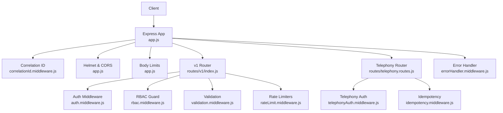
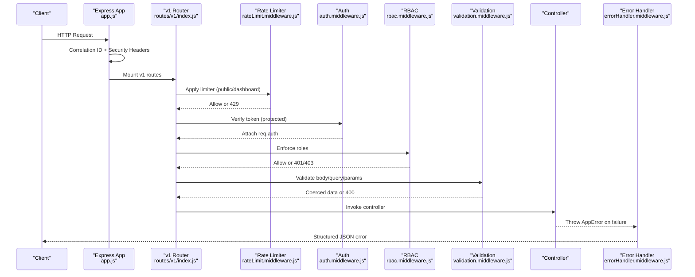
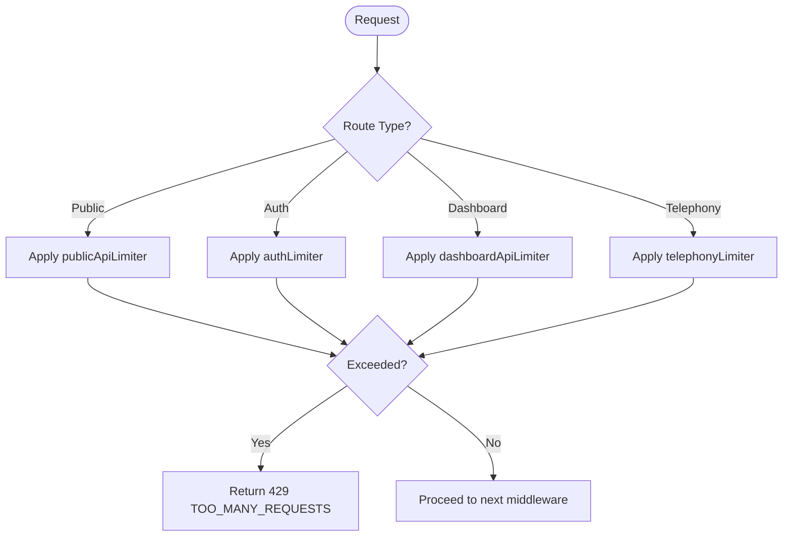
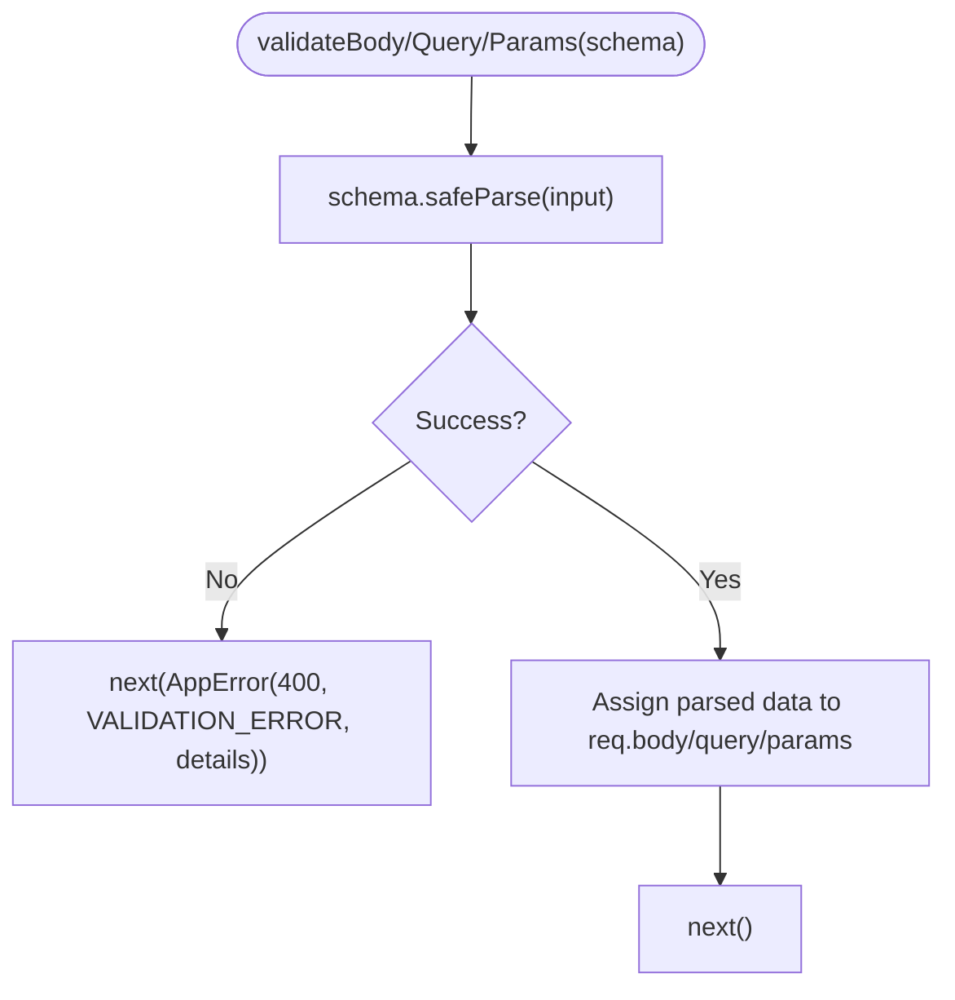
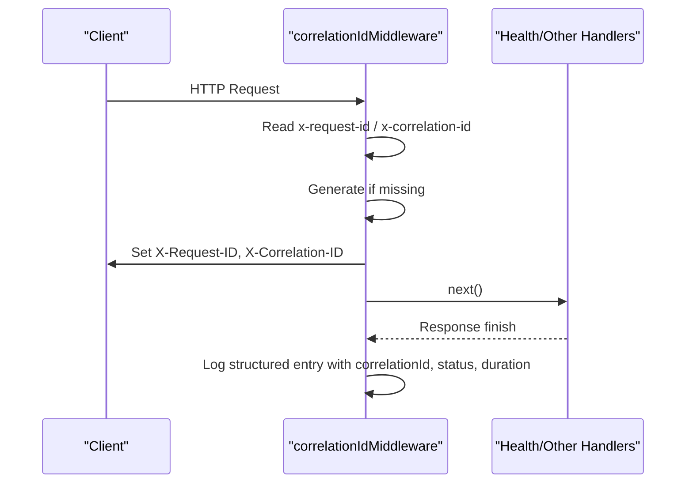
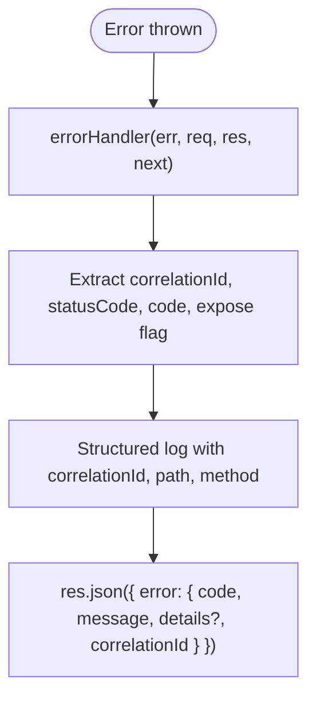
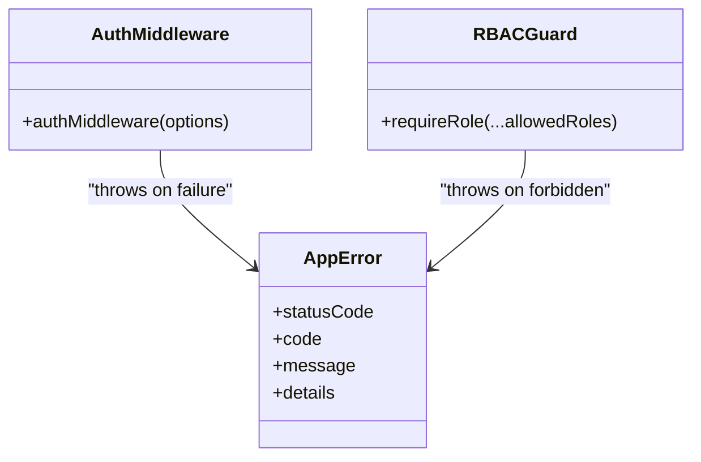
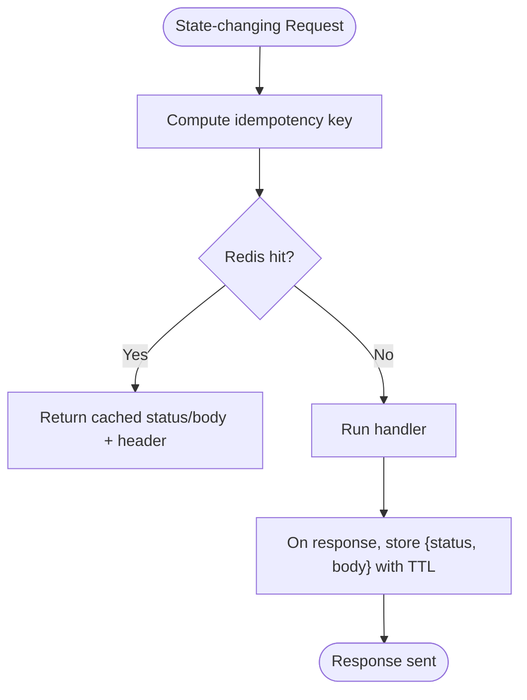
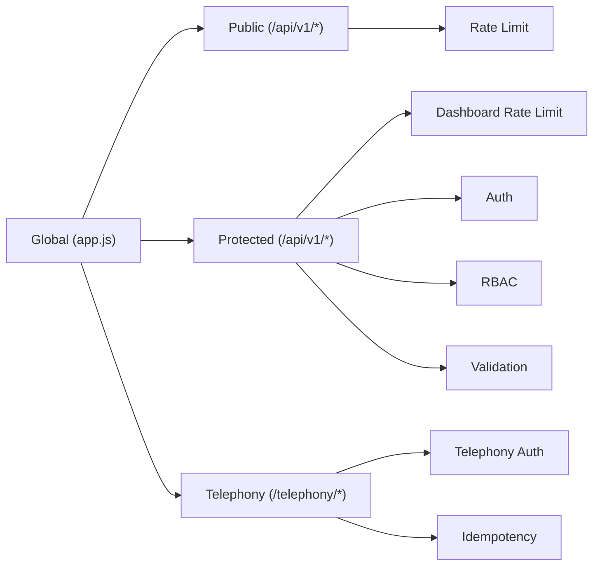
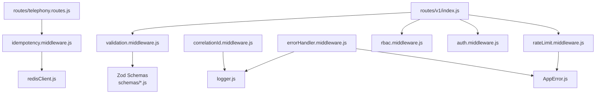

# Security Middleware Chain

<cite>
**Referenced Files in This Document**
- [app.js](file://server/src/app.js)
- [v1/index.js](file://server/src/routes/v1/index.js)
- [telephony.routes.js](file://server/src/routes/telephony.routes.js)
- [rateLimit.middleware.js](file://server/src/middleware/rateLimit.middleware.js)
- [validation.middleware.js](file://server/src/middleware/validation.middleware.js)
- [correlationId.middleware.js](file://server/src/middleware/correlationId.middleware.js)
- [errorHandler.middleware.js](file://server/src/middleware/errorHandler.middleware.js)
- [auth.middleware.js](file://server/src/middleware/auth.middleware.js)
- [rbac.middleware.js](file://server/src/middleware/rbac.middleware.js)
- [idempotency.middleware.js](file://server/src/middleware/idempotency.middleware.js)
- [AppError.js](file://server/src/utils/AppError.js)
- [common.schema.js](file://server/src/schemas/common.schema.js)
</cite>

## Table of Contents
1. Introduction
2. Project Structure
3. Core Components
4. Architecture Overview
5. Detailed Component Analysis
6. Dependency Analysis
7. Performance Considerations
8. Troubleshooting Guide
9. Conclusion

## Introduction
This document explains the security middleware chain that protects API endpoints in the server application. It covers rate limiting with configurable thresholds and IP-based restrictions, schema-based input validation and sanitization, correlation ID tracking for request tracing, centralized error handling with secure responses, and patterns for composing and extending middleware. The goal is to help developers understand how requests are secured, validated, traced, and responded to consistently across public, protected, and telephony endpoints.

## Project Structure
The security middleware chain is composed at multiple layers:
- Application-level middleware sets global security headers, CORS, body limits, correlation IDs, and central error handling.
- Versioned API router applies rate limiters, authentication, role checks, and input validation per route group.
- Telephony router applies webhook-specific authentication and idempotency protections.

**Diagram sources**
- [app.js:21-92](file://server/src/app.js#L21-L92)
- [v1/index.js:29-139](file://server/src/routes/v1/index.js#L29-L139)
- [telephony.routes.js:8-22](file://server/src/routes/telephony.routes.js#L8-L22)

**Section sources**
- [app.js:21-92](file://server/src/app.js#L21-L92)
- [v1/index.js:29-139](file://server/src/routes/v1/index.js#L29-L139)
- [telephony.routes.js:8-22](file://server/src/routes/telephony.routes.js#L8-L22)

## Core Components
- Correlation ID middleware injects and propagates trace identifiers across the request lifecycle and logs structured metrics.
- Authentication middleware verifies tokens and attaches identity to the request.
- Role-Based Access Control (RBAC) enforces minimum roles for sensitive routes.
- Input validation middleware uses Zod schemas to sanitize and validate bodies, queries, and parameters.
- Rate limiting middleware enforces per-IP or per-user request caps with custom handlers.
- Centralized error handler converts errors into consistent, safe JSON responses and logs them securely.
- Idempotency middleware prevents duplicate state mutations on retries using Redis-backed caching.

**Section sources**
- [correlationId.middleware.js:10-58](file://server/src/middleware/correlationId.middleware.js#L10-L58)
- [auth.middleware.js:10-51](file://server/src/middleware/auth.middleware.js#L10-L51)
- [rbac.middleware.js:15-28](file://server/src/middleware/rbac.middleware.js#L15-L28)
- [validation.middleware.js:7-47](file://server/src/middleware/validation.middleware.js#L7-L47)
- [rateLimit.middleware.js:8-51](file://server/src/middleware/rateLimit.middleware.js#L8-L51)
- [errorHandler.middleware.js:9-40](file://server/src/middleware/errorHandler.middleware.js#L9-L40)
- [idempotency.middleware.js:13-62](file://server/src/middleware/idempotency.middleware.js#L13-L62)

## Architecture Overview
The request flow through the security chain:
1. Global middleware adds correlation IDs, security headers, and body size limits.
2. Route groups apply rate limiters appropriate to their exposure (public vs dashboard).
3. Protected routes enforce authentication and RBAC before any business logic.
4. Schemas validate and coerce inputs; invalid payloads return structured errors.
5. Controllers execute and may call external services; errors bubble up.
6. Central error handler formats responses and logs with correlation context.

**Diagram sources**
- [app.js:21-92](file://server/src/app.js#L21-L92)
- [v1/index.js:29-139](file://server/src/routes/v1/index.js#L29-L139)
- [rateLimit.middleware.js:8-51](file://server/src/middleware/rateLimit.middleware.js#L8-L51)
- [auth.middleware.js:10-51](file://server/src/middleware/auth.middleware.js#L10-L51)
- [rbac.middleware.js:15-28](file://server/src/middleware/rbac.middleware.js#L15-L28)
- [validation.middleware.js:7-47](file://server/src/middleware/validation.middleware.js#L7-L47)
- [errorHandler.middleware.js:9-40](file://server/src/middleware/errorHandler.middleware.js#L9-L40)

## Detailed Component Analysis

### Rate Limiting
- Public API limiter: restricts unauthenticated endpoints to a fixed number of requests per minute per IP.
- Auth limiter: tightens login attempts to reduce brute-force risk.
- Dashboard limiter: allows higher throughput but can key by authenticated user when available, falling back to IP.
- Telephony limiter: protects webhooks from abuse while allowing necessary volume.
- All limiters use standard headers and return a consistent 429 via AppError.

**Diagram sources**
- [rateLimit.middleware.js:8-51](file://server/src/middleware/rateLimit.middleware.js#L8-L51)
- [v1/index.js:29-37](file://server/src/routes/v1/index.js#L29-L37)
- [telephony.routes.js:8-18](file://server/src/routes/telephony.routes.js#L8-L18)

**Section sources**
- [rateLimit.middleware.js:8-51](file://server/src/middleware/rateLimit.middleware.js#L8-L51)
- [v1/index.js:29-37](file://server/src/routes/v1/index.js#L29-L37)
- [telephony.routes.js:8-18](file://server/src/routes/telephony.routes.js#L8-L18)

### Input Validation and Sanitization
- Schema-driven validation for request bodies, query parameters, and URL parameters using Zod.
- On success, validated and coerced values replace raw inputs on the request object.
- On failure, returns a structured 400 error with field-level details and a machine-readable code.
- Shared schemas (e.g., pagination) promote consistency across endpoints.

**Diagram sources**
- [validation.middleware.js:7-47](file://server/src/middleware/validation.middleware.js#L7-L47)
- [common.schema.js:3-6](file://server/src/schemas/common.schema.js#L3-L6)

**Section sources**
- [validation.middleware.js:7-47](file://server/src/middleware/validation.middleware.js#L7-L47)
- [common.schema.js:3-6](file://server/src/schemas/common.schema.js#L3-L6)

### Correlation ID Tracking
- Extracts or generates unique request and correlation IDs from headers.
- Attaches a traceContext object containing requestId, correlationId, and optional call/session/order identifiers.
- Sets response headers for client-side correlation and logs structured entries with method, URL, status, and duration.
- Integrates with health endpoints to include correlationId in readiness/liveness responses.

**Diagram sources**
- [correlationId.middleware.js:10-58](file://server/src/middleware/correlationId.middleware.js#L10-L58)
- [app.js:59-79](file://server/src/app.js#L59-L79)

**Section sources**
- [correlationId.middleware.js:10-58](file://server/src/middleware/correlationId.middleware.js#L10-L58)
- [app.js:59-79](file://server/src/app.js#L59-L79)

### Error Handling
- Centralized handler converts errors to consistent JSON with code, message, and optional details.
- Prevents leaking internal stack traces or SQL details to clients by controlling exposure based on status codes.
- Logs full error context including correlationId, path, method, and status for observability.
- Provides a not-found handler that wraps missing routes into a standardized error.

**Diagram sources**
- [errorHandler.middleware.js:9-40](file://server/src/middleware/errorHandler.middleware.js#L9-L40)
- [AppError.js:7-16](file://server/src/utils/AppError.js#L7-L16)

**Section sources**
- [errorHandler.middleware.js:9-40](file://server/src/middleware/errorHandler.middleware.js#L9-L40)
- [AppError.js:7-16](file://server/src/utils/AppError.js#L7-L16)

### Authentication and Authorization
- Authentication extracts Bearer tokens or query tokens, verifies claims, and attaches identity to req.auth.
- Optional mode allows non-required routes to proceed without credentials.
- RBAC guard enforces minimum roles for sensitive operations and blocks unauthorized access with clear errors.

**Diagram sources**
- [auth.middleware.js:10-51](file://server/src/middleware/auth.middleware.js#L10-L51)
- [rbac.middleware.js:15-28](file://server/src/middleware/rbac.middleware.js#L15-L28)
- [AppError.js:7-16](file://server/src/utils/AppError.js#L7-L16)

**Section sources**
- [auth.middleware.js:10-51](file://server/src/middleware/auth.middleware.js#L10-L51)
- [rbac.middleware.js:15-28](file://server/src/middleware/rbac.middleware.js#L15-L28)

### Idempotency for Webhooks
- Intercepts state-modifying requests and caches responses keyed by an idempotency header or payload fields.
- Returns cached responses for duplicates within a time window and marks responses with a cache header.
- Protects against duplicate charges or order mutations caused by retries from third-party providers.

**Diagram sources**
- [idempotency.middleware.js:13-62](file://server/src/middleware/idempotency.middleware.js#L13-L62)
- [telephony.routes.js:16-22](file://server/src/routes/telephony.routes.js#L16-L22)

**Section sources**
- [idempotency.middleware.js:13-62](file://server/src/middleware/idempotency.middleware.js#L13-L62)
- [telephony.routes.js:16-22](file://server/src/routes/telephony.routes.js#L16-L22)

### Middleware Composition Patterns
- Global layer: correlation IDs, security headers, CORS, body limits, health probes, and central error handling.
- Versioned API layer:
  - Public routes: rate limited only.
  - Protected routes: rate limited, then authentication, then RBAC, then validation, then controllers.
- Telephony layer: provider-specific auth plus idempotency for webhooks.

**Diagram sources**
- [app.js:21-92](file://server/src/app.js#L21-L92)
- [v1/index.js:29-139](file://server/src/routes/v1/index.js#L29-L139)
- [telephony.routes.js:8-22](file://server/src/routes/telephony.routes.js#L8-L22)

**Section sources**
- [app.js:21-92](file://server/src/app.js#L21-L92)
- [v1/index.js:29-139](file://server/src/routes/v1/index.js#L29-L139)
- [telephony.routes.js:8-22](file://server/src/routes/telephony.routes.js#L8-L22)

## Dependency Analysis
- Rate limiters depend on express-rate-limit and AppError for consistent 429 responses.
- Validation depends on Zod schemas defined under schemas/.
- Correlation ID depends on logger and crypto utilities.
- Error handler depends on AppError and logger for structured logging.
- Idempotency depends on Redis client for distributed caching.
- Routes compose these dependencies to build layered security per endpoint group.

**Diagram sources**
- [rateLimit.middleware.js:1-51](file://server/src/middleware/rateLimit.middleware.js#L1-L51)
- [validation.middleware.js:1-47](file://server/src/middleware/validation.middleware.js#L1-L47)
- [correlationId.middleware.js:1-58](file://server/src/middleware/correlationId.middleware.js#L1-L58)
- [errorHandler.middleware.js:1-40](file://server/src/middleware/errorHandler.middleware.js#L1-L40)
- [idempotency.middleware.js:1-62](file://server/src/middleware/idempotency.middleware.js#L1-L62)
- [v1/index.js:1-139](file://server/src/routes/v1/index.js#L1-L139)
- [telephony.routes.js:1-22](file://server/src/routes/telephony.routes.js#L1-L22)

**Section sources**
- [rateLimit.middleware.js:1-51](file://server/src/middleware/rateLimit.middleware.js#L1-L51)
- [validation.middleware.js:1-47](file://server/src/middleware/validation.middleware.js#L1-L47)
- [correlationId.middleware.js:1-58](file://server/src/middleware/correlationId.middleware.js#L1-L58)
- [errorHandler.middleware.js:1-40](file://server/src/middleware/errorHandler.middleware.js#L1-L40)
- [idempotency.middleware.js:1-62](file://server/src/middleware/idempotency.middleware.js#L1-L62)
- [v1/index.js:1-139](file://server/src/routes/v1/index.js#L1-L139)
- [telephony.routes.js:1-22](file://server/src/routes/telephony.routes.js#L1-L22)

## Performance Considerations
- Prefer per-route rate limiters to balance protection and throughput; use IP keys for public endpoints and user keys where possible.
- Keep validation schemas small and focused to minimize parsing overhead.
- Use correlation ID logging selectively for high-cardinality paths to avoid excessive I/O.
- Ensure Redis connectivity for idempotency is healthy; failures should degrade gracefully without blocking requests.
- Tune body size limits to match expected payloads and prevent resource exhaustion.

[No sources needed since this section provides general guidance]

## Troubleshooting Guide
- 429 Too Many Requests: Indicates rate limit exceeded; check which limiter applies to the route and adjust thresholds or investigate traffic spikes.
- 400 Validation Errors: Inspect Zod schema definitions and ensure clients send correctly typed and required fields; details are included in error responses.
- 401/403 Authentication/Authorization: Confirm valid Bearer token and sufficient role; verify RBAC configuration for the target route.
- 404 Not Found: Missing route or incorrect path; verify router mounts and route definitions.
- 5xx Internal Errors: Review structured logs with correlationId to locate root cause; ensure error messages do not leak internals to clients.

**Section sources**
- [rateLimit.middleware.js:8-51](file://server/src/middleware/rateLimit.middleware.js#L8-L51)
- [validation.middleware.js:7-47](file://server/src/middleware/validation.middleware.js#L7-L47)
- [auth.middleware.js:10-51](file://server/src/middleware/auth.middleware.js#L10-L51)
- [rbac.middleware.js:15-28](file://server/src/middleware/rbac.middleware.js#L15-L28)
- [errorHandler.middleware.js:9-40](file://server/src/middleware/errorHandler.middleware.js#L9-L40)

## Conclusion
The middleware chain provides defense-in-depth: correlation tracking, strict input validation, robust authentication and authorization, adaptive rate limiting, and secure, consistent error handling. By composing these components at the right layers and following the composition patterns outlined here, teams can maintain a secure, observable, and maintainable API surface. Custom middleware should follow the established patterns: accept options, handle errors via AppError, preserve correlation context, and integrate cleanly with existing routers.

[No sources needed since this section summarizes without analyzing specific files]