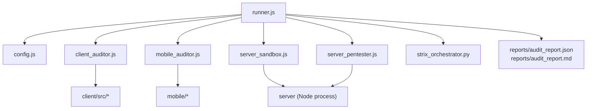
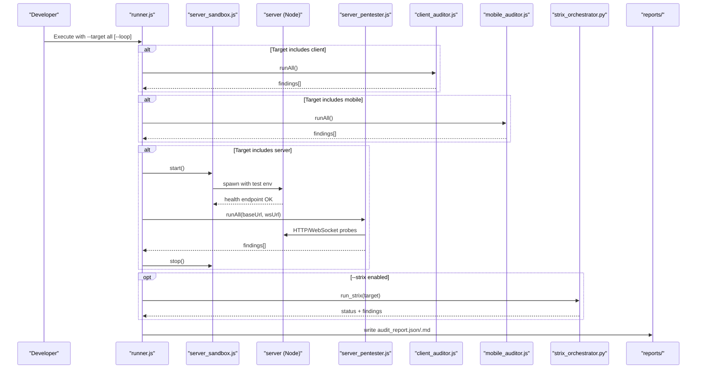
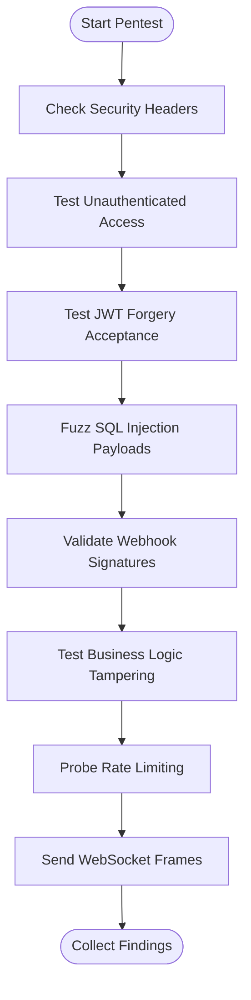
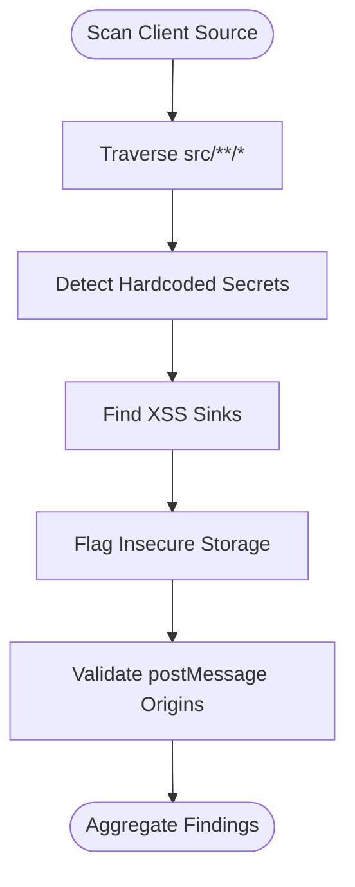
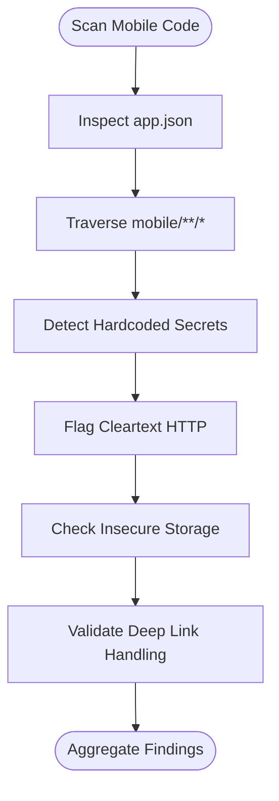
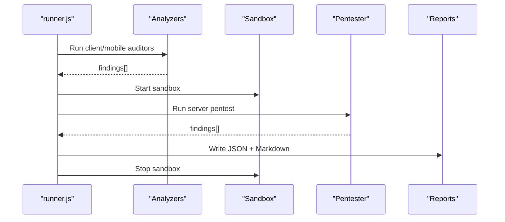
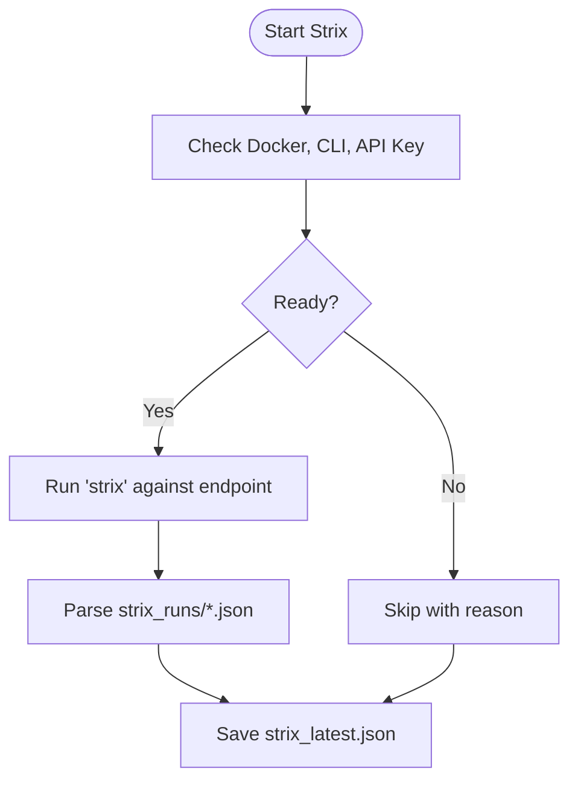
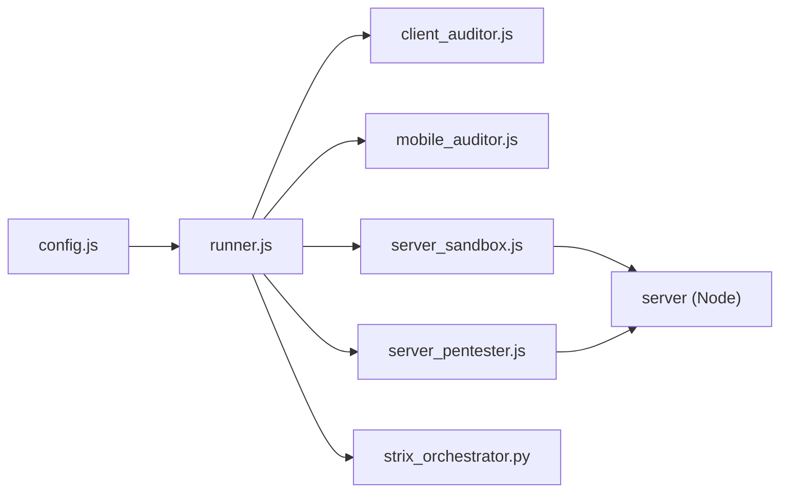

# Security Testing Suite

<cite>
**Referenced Files in This Document**
- [security-suite/README.md](file://security-suite/README.md)
- [security-suite/runner.js](file://security-suite/runner.js)
- [security-suite/config.js](file://security-suite/config.js)
- [security-suite/package.json](file://security-suite/package.json)
- [security-suite/analyzers/strix_orchestrator.py](file://security-suite/analyzers/strix_orchestrator.py)
- [security-suite/analyzers/server_pentester.js](file://security-suite/analyzers/server_pentester.js)
- [security-suite/analyzers/client_auditor.js](file://security-suite/analyzers/client_auditor.js)
- [security-suite/analyzers/mobile_auditor.js](file://security-suite/analyzers/mobile_auditor.js)
- [security-suite/sandboxes/server_sandbox.js](file://security-suite/sandboxes/server_sandbox.js)
- [server/src/middleware/auth.middleware.js](file://server/src/middleware/auth.middleware.js)
- [server/src/middleware/rateLimit.middleware.js](file://server/src/middleware/rateLimit.middleware.js)
- [server/src/services/auth.service.js](file://server/src/services/auth.service.js)
- [server/tests/security_and_auth.test.js](file://server/tests/security_and_auth.test.js)
</cite>

## Table of Contents
1. [Introduction](#introduction)
2. [Project Structure](#project-structure)
3. [Core Components](#core-components)
4. [Architecture Overview](#architecture-overview)
5. [Detailed Component Analysis](#detailed-component-analysis)
6. [Dependency Analysis](#dependency-analysis)
7. [Performance Considerations](#performance-considerations)
8. [Troubleshooting Guide](#troubleshooting-guide)
9. [Conclusion](#conclusion)
10. [Appendices](#appendices)

## Introduction
This document provides comprehensive security testing documentation for the automated vulnerability assessment and penetration testing suite. It explains how the suite orchestrates server, client, and mobile security audits; how dynamic server pentesting is executed in an isolated sandbox; how static analysis identifies vulnerabilities in web and mobile code; and how reports are generated for both human consumption and CI/CD integration. It also covers continuous monitoring practices, compliance validation strategies, and remediation guidance aligned with the implemented security controls.

## Project Structure
The security suite is a standalone module that runs against the server, client, and mobile codebases without coupling to production application logic. It includes:
- A CLI-driven runner that orchestrates tests across targets
- Static analyzers for client and mobile code
- A live server pentester that probes endpoints and WebSockets
- An optional AI-driven Strix orchestrator for autonomous scanning
- A sandbox that spins up an isolated test server instance
- Report generation in JSON and Markdown formats

**Diagram sources**
- [security-suite/runner.js:27-80](file://security-suite/runner.js#L27-L80)
- [security-suite/config.js:6-32](file://security-suite/config.js#L6-L32)
- [security-suite/sandboxes/server_sandbox.js:15-83](file://security-suite/sandboxes/server_sandbox.js#L15-L83)
- [security-suite/analyzers/server_pentester.js:10-23](file://security-suite/analyzers/server_pentester.js#L10-L23)
- [security-suite/analyzers/client_auditor.js:12-28](file://security-suite/analyzers/client_auditor.js#L12-L28)
- [security-suite/analyzers/mobile_auditor.js:11-31](file://security-suite/analyzers/mobile_auditor.js#L11-L31)
- [security-suite/analyzers/strix_orchestrator.py:49-94](file://security-suite/analyzers/strix_orchestrator.py#L49-L94)

**Section sources**
- [security-suite/README.md:9-37](file://security-suite/README.md#L9-L37)
- [security-suite/README.md:68-83](file://security-suite/README.md#L68-L83)
- [security-suite/package.json:7-13](file://security-suite/package.json#L7-L13)

## Core Components
- Orchestrator (Runner): Parses CLI flags, executes target-specific auditors, starts the server sandbox, invokes Strix if requested, and generates consolidated reports.
- Server Sandbox: Spawns an isolated Node process with test-only environment variables, cleans up DB artifacts, and waits for health readiness before handing control to the pentester.
- Server Pentester: Performs dynamic checks including security headers, authentication bypass, JWT verification, SQL injection fuzzing, webhook signature validation, business logic tampering, rate limiting, and WebSocket stream handling.
- Client Auditor: Static analysis of web source files for secret leaks, XSS sinks, insecure storage, and unsafe postMessage usage.
- Mobile Auditor: Static analysis of mobile app code and configuration for hardcoded secrets, cleartext HTTP traffic, insecure storage, and deep link handling issues.
- Strix Orchestrator: Optional Python-based wrapper that validates prerequisites (Docker, Strix CLI, LLM keys), runs autonomous scans, and aggregates findings.

**Section sources**
- [security-suite/runner.js:14-80](file://security-suite/runner.js#L14-L80)
- [security-suite/sandboxes/server_sandbox.js:5-83](file://security-suite/sandboxes/server_sandbox.js#L5-L83)
- [security-suite/analyzers/server_pentester.js:3-23](file://security-suite/analyzers/server_pentester.js#L3-L23)
- [security-suite/analyzers/client_auditor.js:5-28](file://security-suite/analyzers/client_auditor.js#L5-L28)
- [security-suite/analyzers/mobile_auditor.js:5-31](file://security-suite/analyzers/mobile_auditor.js#L5-L31)
- [security-suite/analyzers/strix_orchestrator.py:26-94](file://security-suite/analyzers/strix_orchestrator.py#L26-L94)

## Architecture Overview
The suite follows a modular pipeline:
- The runner initializes the pipeline based on target selection or loop mode.
- For server targets, it starts a sandboxed server process and runs dynamic tests against it.
- For client and mobile targets, it performs static scans over source trees.
- Optionally, it invokes Strix for autonomous scanning when Docker and CLI are available.
- All findings are aggregated, sorted by severity, and written as JSON and Markdown reports.

**Diagram sources**
- [security-suite/runner.js:27-80](file://security-suite/runner.js#L27-L80)
- [security-suite/sandboxes/server_sandbox.js:15-83](file://security-suite/sandboxes/server_sandbox.js#L15-L83)
- [security-suite/analyzers/server_pentester.js:10-23](file://security-suite/analyzers/server_pentester.js#L10-L23)
- [security-suite/analyzers/client_auditor.js:12-28](file://security-suite/analyzers/client_auditor.js#L12-L28)
- [security-suite/analyzers/mobile_auditor.js:11-31](file://security-suite/analyzers/mobile_auditor.js#L11-L31)
- [security-suite/analyzers/strix_orchestrator.py:49-94](file://security-suite/analyzers/strix_orchestrator.py#L49-L94)

## Detailed Component Analysis

### Server Penetration Testing
The server pentester executes a sequence of dynamic checks against a running server instance:
- Security headers hardening
- Unauthenticated access to protected routes
- JWT forgery acceptance
- SQL injection via query parameters
- Webhook signature validation
- Business logic state mutation
- Rate limiting effectiveness
- WebSocket stream robustness

**Diagram sources**
- [security-suite/analyzers/server_pentester.js:10-23](file://security-suite/analyzers/server_pentester.js#L10-L23)
- [security-suite/analyzers/server_pentester.js:42-67](file://security-suite/analyzers/server_pentester.js#L42-L67)
- [security-suite/analyzers/server_pentester.js:70-98](file://security-suite/analyzers/server_pentester.js#L70-L98)
- [security-suite/analyzers/server_pentester.js:101-124](file://security-suite/analyzers/server_pentester.js#L101-L124)
- [security-suite/analyzers/server_pentester.js:127-158](file://security-suite/analyzers/server_pentester.js#L127-L158)
- [security-suite/analyzers/server_pentester.js:161-186](file://security-suite/analyzers/server_pentester.js#L161-L186)
- [security-suite/analyzers/server_pentester.js:189-214](file://security-suite/analyzers/server_pentester.js#L189-L214)
- [security-suite/analyzers/server_pentester.js:217-247](file://security-suite/analyzers/server_pentester.js#L217-L247)
- [security-suite/analyzers/server_pentester.js:250-283](file://security-suite/analyzers/server_pentester.js#L250-L283)

**Section sources**
- [security-suite/analyzers/server_pentester.js:10-23](file://security-suite/analyzers/server_pentester.js#L10-L23)
- [security-suite/analyzers/server_pentester.js:42-283](file://security-suite/analyzers/server_pentester.js#L42-L283)

### Client-Side Security Auditing
The client auditor performs static analysis over JavaScript/TypeScript/HTML/JSON files:
- Detects hardcoded secrets (payment keys, API tokens)
- Identifies DOM XSS sinks (dangerous innerHTML usage, eval/Function)
- Flags insecure credential storage patterns
- Checks postMessage listeners for missing origin validation

**Diagram sources**
- [security-suite/analyzers/client_auditor.js:12-28](file://security-suite/analyzers/client_auditor.js#L12-L28)
- [security-suite/analyzers/client_auditor.js:47-62](file://security-suite/analyzers/client_auditor.js#L47-L62)
- [security-suite/analyzers/client_auditor.js:65-92](file://security-suite/analyzers/client_auditor.js#L65-L92)
- [security-suite/analyzers/client_auditor.js:95-142](file://security-suite/analyzers/client_auditor.js#L95-L142)
- [security-suite/analyzers/client_auditor.js:145-163](file://security-suite/analyzers/client_auditor.js#L145-L163)
- [security-suite/analyzers/client_auditor.js:166-184](file://security-suite/analyzers/client_auditor.js#L166-L184)

**Section sources**
- [security-suite/analyzers/client_auditor.js:12-184](file://security-suite/analyzers/client_auditor.js#L12-L184)

### Mobile Application Security Analysis
The mobile auditor inspects configuration and source files:
- Validates custom URL scheme presence
- Detects hardcoded secrets in mobile code
- Flags cleartext HTTP requests outside localhost ranges
- Identifies insecure token storage using unencrypted storage APIs
- Reviews deep link handlers for input validation

**Diagram sources**
- [security-suite/analyzers/mobile_auditor.js:11-31](file://security-suite/analyzers/mobile_auditor.js#L11-L31)
- [security-suite/analyzers/mobile_auditor.js:50-67](file://security-suite/analyzers/mobile_auditor.js#L50-L67)
- [security-suite/analyzers/mobile_auditor.js:70-93](file://security-suite/analyzers/mobile_auditor.js#L70-L93)
- [security-suite/analyzers/mobile_auditor.js:96-122](file://security-suite/analyzers/mobile_auditor.js#L96-L122)
- [security-suite/analyzers/mobile_auditor.js:125-144](file://security-suite/analyzers/mobile_auditor.js#L125-L144)
- [security-suite/analyzers/mobile_auditor.js:147-165](file://security-suite/analyzers/mobile_auditor.js#L147-L165)
- [security-suite/analyzers/mobile_auditor.js:168-186](file://security-suite/analyzers/mobile_auditor.js#L168-L186)

**Section sources**
- [security-suite/analyzers/mobile_auditor.js:11-186](file://security-suite/analyzers/mobile_auditor.js#L11-L186)

### Orchestration and Reporting
The runner coordinates execution and produces standardized outputs:
- Aggregates findings from all auditors
- Sorts by severity weights
- Writes JSON report for machine parsing
- Writes Markdown report for human review
- Supports watch mode for continuous development feedback

**Diagram sources**
- [security-suite/runner.js:27-80](file://security-suite/runner.js#L27-L80)
- [security-suite/runner.js:98-180](file://security-suite/runner.js#L98-L180)
- [security-suite/sandboxes/server_sandbox.js:15-83](file://security-suite/sandboxes/server_sandbox.js#L15-L83)
- [security-suite/analyzers/server_pentester.js:10-23](file://security-suite/analyzers/server_pentester.js#L10-L23)

**Section sources**
- [security-suite/runner.js:27-180](file://security-suite/runner.js#L27-L180)

### Strix Autonomous Integration
The Strix orchestrator validates environment readiness and executes autonomous scans:
- Checks Docker availability and daemon status
- Verifies Strix CLI installation
- Ensures LLM API key configuration
- Runs Strix against the sandboxed server endpoint
- Aggregates output into a latest JSON summary

**Diagram sources**
- [security-suite/analyzers/strix_orchestrator.py:26-47](file://security-suite/analyzers/strix_orchestrator.py#L26-L47)
- [security-suite/analyzers/strix_orchestrator.py:49-94](file://security-suite/analyzers/strix_orchestrator.py#L49-L94)
- [security-suite/analyzers/strix_orchestrator.py:96-122](file://security-suite/analyzers/strix_orchestrator.py#L96-L122)

**Section sources**
- [security-suite/analyzers/strix_orchestrator.py:26-122](file://security-suite/analyzers/strix_orchestrator.py#L26-L122)

## Dependency Analysis
Key dependencies and relationships:
- Runner depends on config for paths, ports, and Strix settings
- Server pentester depends on a running server instance provided by the sandbox
- Client and mobile auditors depend on file system traversal and pattern matching
- Strix orchestrator depends on external tools (Docker, Strix CLI) and environment variables

**Diagram sources**
- [security-suite/config.js:6-32](file://security-suite/config.js#L6-L32)
- [security-suite/runner.js:27-80](file://security-suite/runner.js#L27-L80)
- [security-suite/sandboxes/server_sandbox.js:15-83](file://security-suite/sandboxes/server_sandbox.js#L15-L83)
- [security-suite/analyzers/server_pentester.js:10-23](file://security-suite/analyzers/server_pentester.js#L10-L23)
- [security-suite/analyzers/client_auditor.js:12-28](file://security-suite/analyzers/client_auditor.js#L12-L28)
- [security-suite/analyzers/mobile_auditor.js:11-31](file://security-suite/analyzers/mobile_auditor.js#L11-L31)
- [security-suite/analyzers/strix_orchestrator.py:49-94](file://security-suite/analyzers/strix_orchestrator.py#L49-L94)

**Section sources**
- [security-suite/config.js:6-32](file://security-suite/config.js#L6-L32)
- [security-suite/runner.js:27-80](file://security-suite/runner.js#L27-L80)

## Performance Considerations
- Use targeted runs (--target server/client/mobile) to reduce scan time during iterative development
- Enable watch mode (--loop) to automatically re-run upon changes, debounced to avoid excessive re-execution
- Prefer local sandbox runs for fast feedback; reserve Strix scans for environments with Docker and sufficient resources
- Avoid scanning node_modules and build artifacts by relying on configured source paths

[No sources needed since this section provides general guidance]

## Troubleshooting Guide
Common issues and resolutions:
- Sandbox startup failure: Ensure the server can bind to the configured port and health endpoint responds within timeout; check environment variables and database path cleanup
- Strix skipped: Verify Docker daemon is running, Strix CLI is installed, and LLM API key is set; otherwise the suite continues with native engines
- Missing rate limiting detection: Confirm rate limit middleware is mounted on relevant routes; the pentester expects 429 responses after rapid login attempts
- Authentication bypass detection: Ensure auth middleware is applied to protected routes and JWT verification enforces signature validation

**Section sources**
- [security-suite/sandboxes/server_sandbox.js:15-83](file://security-suite/sandboxes/server_sandbox.js#L15-L83)
- [security-suite/analyzers/strix_orchestrator.py:26-94](file://security-suite/analyzers/strix_orchestrator.py#L26-L94)
- [security-suite/analyzers/server_pentester.js:217-247](file://security-suite/analyzers/server_pentester.js#L217-L247)
- [server/src/middleware/auth.middleware.js:10-51](file://server/src/middleware/auth.middleware.js#L10-L51)
- [server/src/middleware/rateLimit.middleware.js:8-51](file://server/src/middleware/rateLimit.middleware.js#L8-L51)

## Conclusion
The security suite provides a cohesive, automated approach to assessing vulnerabilities across server, client, and mobile surfaces. It combines static analysis with dynamic probing in an isolated sandbox, supports optional AI-driven autonomous scanning, and delivers structured reports suitable for both developers and CI/CD pipelines. By integrating with existing authentication, rate limiting, and secure coding practices, teams can continuously validate security posture and accelerate remediation.

[No sources needed since this section summarizes without analyzing specific files]

## Appendices

### Test Execution Workflows
- Full audit: Run the suite against all targets to generate comprehensive findings
- Targeted audit: Focus on server, client, or mobile to speed up iteration
- Continuous loop: Watch for code changes and re-run automatically
- Strix-only: Invoke autonomous scanning when prerequisites are met

**Section sources**
- [security-suite/README.md:9-37](file://security-suite/README.md#L9-L37)
- [security-suite/package.json:7-13](file://security-suite/package.json#L7-L13)

### Vulnerability Reporting Formats
- JSON report: Machine-readable structure with timestamp, duration, target, stats, and findings array
- Markdown report: Human-readable executive summary, severity table, detailed findings, PoC snippets, and remediation guidance

**Section sources**
- [security-suite/README.md:68-73](file://security-suite/README.md#L68-L73)
- [security-suite/runner.js:98-180](file://security-suite/runner.js#L98-L180)

### Remediation Guidance Highlights
- Enforce security headers via middleware
- Apply authentication middleware to protected routes
- Validate JWT signatures and enforce issuer/audience
- Use parameterized queries to prevent SQL injection
- Validate webhook signatures for third-party integrations
- Implement schema validation for business logic inputs
- Mount rate limiting on sensitive endpoints
- Sanitize user input and avoid dangerous DOM sinks
- Move secrets out of client-side code
- Use secure storage for mobile tokens
- Enforce HTTPS/WSS for network traffic

**Section sources**
- [security-suite/analyzers/server_pentester.js:42-283](file://security-suite/analyzers/server_pentester.js#L42-L283)
- [security-suite/analyzers/client_auditor.js:65-184](file://security-suite/analyzers/client_auditor.js#L65-L184)
- [security-suite/analyzers/mobile_auditor.js:96-186](file://security-suite/analyzers/mobile_auditor.js#L96-L186)

### CI/CD Integration and Continuous Monitoring
- Integrate runner scripts into CI jobs to execute targeted audits per PR
- Publish JSON reports as artifacts for downstream analysis
- Gate merges based on critical/high finding thresholds
- Schedule periodic full audits and Strix scans in CI
- Monitor trends over time using report diffs and dashboards

**Section sources**
- [security-suite/README.md:68-73](file://security-suite/README.md#L68-L73)
- [security-suite/package.json:7-13](file://security-suite/package.json#L7-L13)

### Compliance and Regulatory Validation
- Validate authentication enforcement and token verification to meet access control requirements
- Ensure encryption in transit (HTTPS/WSS) and secure storage practices for data protection standards
- Confirm rate limiting and abuse prevention mechanisms are active
- Review webhook signature validation to satisfy integrity and authenticity requirements
- Maintain audit trails and logging for accountability and incident response

**Section sources**
- [server/src/services/auth.service.js:8-20](file://server/src/services/auth.service.js#L8-L20)
- [server/src/services/auth.service.js:50-120](file://server/src/services/auth.service.js#L50-L120)
- [server/src/middleware/rateLimit.middleware.js:8-51](file://server/src/middleware/rateLimit.middleware.js#L8-L51)
- [security-suite/analyzers/server_pentester.js:161-186](file://security-suite/analyzers/server_pentester.js#L161-L186)

### Security Scoring Mechanisms
- Severity weighting: CRITICAL > HIGH > MEDIUM > LOW > INFO used to sort findings
- Stats aggregation: Counts per severity level for quick risk assessment
- Duration tracking: Scan duration recorded for performance benchmarking

**Section sources**
- [security-suite/runner.js:103-113](file://security-suite/runner.js#L103-L113)
- [security-suite/runner.js:115-130](file://security-suite/runner.js#L115-L130)

### Example Test Coverage References
- Authentication and JWT verification tests demonstrate expected behavior for token issuance, validation, and tampered token rejection
- Password hashing and verification tests confirm secure hashing practices

**Section sources**
- [server/tests/security_and_auth.test.js:20-88](file://server/tests/security_and_auth.test.js#L20-L88)