# Integration Testing

<cite>
**Referenced Files in This Document**
- [integration.test.js](file://server/tests/integration.test.js)
- [services.test.js](file://server/tests/services.test.js)
- [geocoding.test.js](file://server/tests/geocoding.test.js)
- [dialogue.test.js](file://server/tests/dialogue.test.js)
- [domain_state_machines.test.js](file://server/tests/domain_state_machines.test.js)
- [wsServer.js](file://server/src/websocket/wsServer.js)
- [jobQueue.js](file://server/src/queue/jobQueue.js)
- [outbox.worker.js](file://server/src/workers/outbox.worker.js)
- [geocodingService.js](file://server/src/services/geocodingService.js)
- [paymentService.js](file://server/src/services/paymentService.js)
- [exotelService.js](file://server/src/services/exotelService.js)
- [dialogueManager.js](file://server/src/services/dialogueManager.js)
- [orderStateMachine.js](file://server/src/domain/orders/orderStateMachine.js)
- [env.js](file://server/src/config/env.js)
- [redisClient.js](file://server/src/infra/redisClient.js)
- [docker-compose.yml](file://docker-compose.yml)
</cite>

## Table of Contents
1. [Introduction](#introduction)
2. [Project Structure](#project-structure)
3. [Core Components](#core-components)
4. [Architecture Overview](#architecture-overview)
5. [Detailed Component Analysis](#detailed-component-analysis)
6. [Dependency Analysis](#dependency-analysis)
7. [Performance Considerations](#performance-considerations)
8. [Troubleshooting Guide](#troubleshooting-guide)
9. [Conclusion](#conclusion)
10. [Appendices](#appendices)

## Introduction
This document provides comprehensive integration testing guidance for the Inkiro platform, focusing on end-to-end verification of API endpoints, WebSocket connections, real-time communication flows, dialogue management, geocoding services, multi-tenant scenarios, external integrations (telephony, payments, AI), database transactions, message queues, and background job processing. It also covers test environment setup, dependency isolation, test data management, performance considerations, and timeout handling strategies.

## Project Structure
The server-side integration tests are organized under server/tests and exercise both HTTP APIs and internal services. The application uses an Express-like HTTP server with WebSocket upgrades for real-time streams and dashboards. Background jobs and durable queues persist work to the database for resilience. Redis is used for caching and coordination, with a robust in-memory fallback for development/test environments.

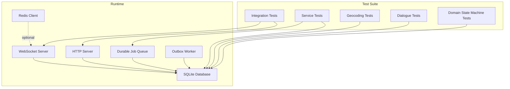

**Diagram sources**
- [integration.test.js:29-56](file://server/tests/integration.test.js#L29-L56)
- [wsServer.js:17-161](file://server/src/websocket/wsServer.js#L17-L161)
- [jobQueue.js:14-249](file://server/src/queue/jobQueue.js#L14-L249)
- [outbox.worker.js:97-128](file://server/src/workers/outbox.worker.js#L97-L128)
- [redisClient.js:82-127](file://server/src/infra/redisClient.js#L82-L127)

**Section sources**
- [integration.test.js:29-56](file://server/tests/integration.test.js#L29-L56)
- [docker-compose.yml:3-45](file://docker-compose.yml#L3-L45)

## Core Components
- HTTP API Endpoints: Authenticated stats, public catalog, telephony webhooks, missed-call webhook, pin drop page and confirmation, order validation via schema middleware.
- WebSocket Streams: Dashboard, media stream, web stream, exotel stream with ticket/token-based authentication and role checks.
- Dialogue Management: LLM-driven or rule-based fallback with state machine reconciliation and pricing engine integration.
- Geocoding Service: Google Maps API with smart local fallback and pin-drop URL generation.
- Payment Service: Razorpay payment link creation and SMS notifications via Twilio, with mock fallbacks.
- Telephony Service: Exotel VoiceXML generation and outbound call triggering with mock mode.
- Durable Job Queue: Database-backed queue with atomic claiming, retries, backoff, DLQ routing, and stats.
- Outbox Worker: Event-driven worker that enqueues notifications/dispatch jobs and broadcasts to dashboard.

**Section sources**
- [integration.test.js:58-161](file://server/tests/integration.test.js#L58-L161)
- [wsServer.js:17-161](file://server/src/websocket/wsServer.js#L17-L161)
- [dialogueManager.js:36-84](file://server/src/services/dialogueManager.js#L36-L84)
- [geocodingService.js:21-161](file://server/src/services/geocodingService.js#L21-L161)
- [paymentService.js:25-113](file://server/src/services/paymentService.js#L25-L113)
- [exotelService.js:17-83](file://server/src/services/exotelService.js#L17-L83)
- [jobQueue.js:14-249](file://server/src/queue/jobQueue.js#L14-L249)
- [outbox.worker.js:14-128](file://server/src/workers/outbox.worker.js#L14-L128)

## Architecture Overview
End-to-end flows span HTTP requests, WebSocket upgrades, service calls, and background processing. Authentication and authorization are enforced at both HTTP and WebSocket layers. External providers (Google Maps, Razorpay, Twilio, Exotel) are integrated with graceful fallbacks for testing.

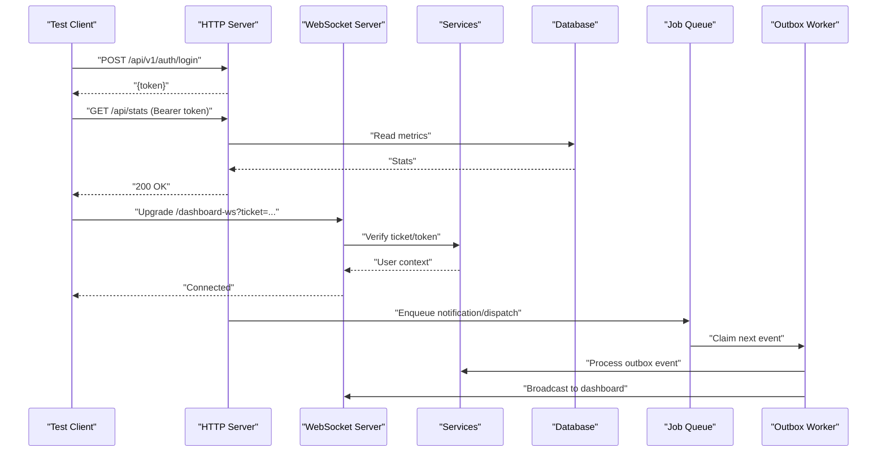

**Diagram sources**
- [integration.test.js:14-45](file://server/tests/integration.test.js#L14-L45)
- [wsServer.js:34-72](file://server/src/websocket/wsServer.js#L34-L72)
- [outbox.worker.js:20-58](file://server/src/workers/outbox.worker.js#L20-L58)
- [jobQueue.js:47-76](file://server/src/queue/jobQueue.js#L47-L76)

## Detailed Component Analysis

### API Endpoints Integration
- Authenticated stats endpoint returns dashboard metrics; unauthenticated access returns 401 with error code.
- Public catalog endpoint supports tenant_id and restaurant_id filtering.
- Telephony webhook returns VoiceXML/TwiML including media-stream directives.
- Missed-call webhook acknowledges receipt.
- Pin drop page renders HTML with order details; pin confirmation updates location.
- Order status update validates input using Zod schemas; invalid payloads return 400 with validation error.

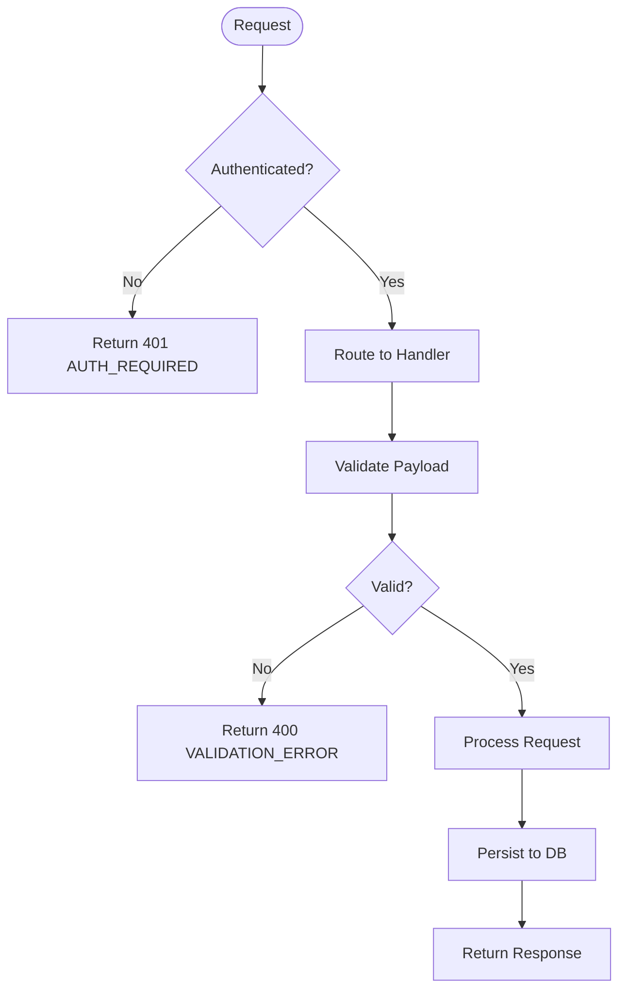

**Diagram sources**
- [integration.test.js:58-77](file://server/tests/integration.test.js#L58-L77)
- [integration.test.js:147-161](file://server/tests/integration.test.js#L147-L161)

**Section sources**
- [integration.test.js:58-161](file://server/tests/integration.test.js#L58-L161)

### WebSocket Connections and Real-Time Flows
- WebSocket upgrade path enforces allowed paths and authenticates via tickets or tokens.
- Dashboard connection requires roles like ADMIN, RESTAURANT_MANAGER, STAFF, KITCHEN.
- Media and web streams use stream tickets; production rejects unauthorized attempts.
- Heartbeat liveness check terminates inactive clients.

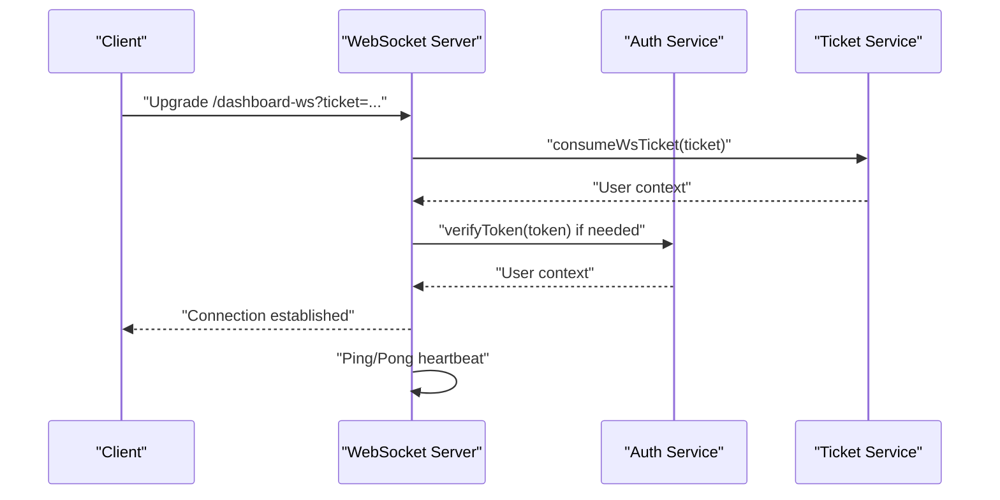

**Diagram sources**
- [wsServer.js:23-72](file://server/src/websocket/wsServer.js#L23-L72)
- [wsServer.js:99-116](file://server/src/websocket/wsServer.js#L99-L116)
- [wsServer.js:149-158](file://server/src/websocket/wsServer.js#L149-L158)

**Section sources**
- [wsServer.js:17-161](file://server/src/websocket/wsServer.js#L17-L161)

### Dialogue Management Systems
- processDialogueTurn loads caller context and catalog, builds prompts, calls LLM adapter, reconciles output with authoritative state machine and pricing engine.
- Fallback to rule-based engine when LLM adapter fails, ensuring deterministic behavior.
- State transitions validated by order state machine; items and totals recalculated authoritatively.

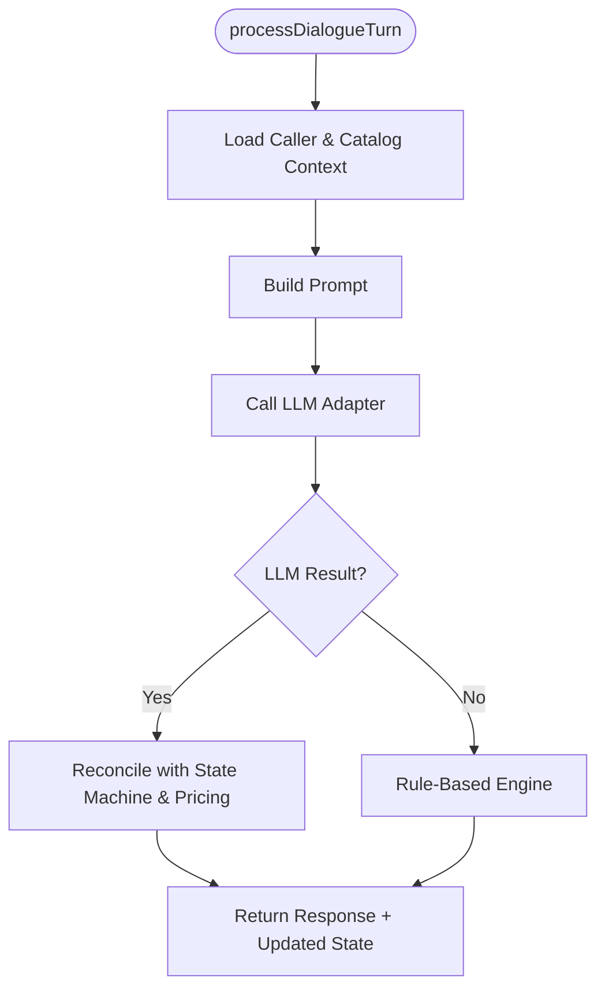

**Diagram sources**
- [dialogueManager.js:36-84](file://server/src/services/dialogueManager.js#L36-L84)
- [dialogueManager.js:93-132](file://server/src/services/dialogueManager.js#L93-L132)
- [dialogueManager.js:137-301](file://server/src/services/dialogueManager.js#L137-L301)

**Section sources**
- [dialogueManager.js:36-301](file://server/src/services/dialogueManager.js#L36-L301)
- [dialogue.test.js:21-86](file://server/tests/dialogue.test.js#L21-L86)

### Geocoding Services
- Attempts Google Maps Geocoding API; maps result location_type to confidence levels.
- Smart local fallback matches known landmarks with jitter to simulate realistic coordinates.
- needsPinDrop determines whether to prompt user for pin-drop confirmation.
- createPinDropToken persists hashed token with expiration; generatePinDropUrl constructs shareable links.

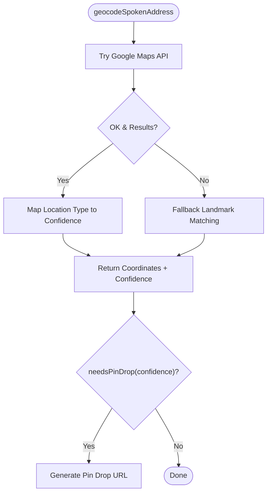

**Diagram sources**
- [geocodingService.js:21-56](file://server/src/services/geocodingService.js#L21-L56)
- [geocodingService.js:75-122](file://server/src/services/geocodingService.js#L75-L122)
- [geocodingService.js:129-161](file://server/src/services/geocodingService.js#L129-L161)

**Section sources**
- [geocodingService.js:21-161](file://server/src/services/geocodingService.js#L21-L161)
- [geocoding.test.js:5-28](file://server/tests/geocoding.test.js#L5-L28)

### Multi-Tenant Scenarios
- Environment configuration supports tenant-specific settings; tests demonstrate tenant_id usage in catalog queries.
- WebSocket dashboard connections include tenantId and restaurantId in broadcast events for scoped visibility.
- Outbox worker broadcasts tenant-scoped events to dashboard.

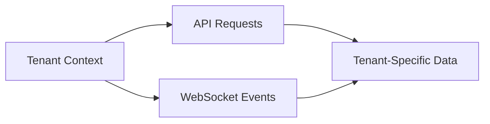

**Diagram sources**
- [integration.test.js:79-88](file://server/tests/integration.test.js#L79-L88)
- [outbox.worker.js:49-57](file://server/src/workers/outbox.worker.js#L49-L57)

**Section sources**
- [integration.test.js:79-88](file://server/tests/integration.test.js#L79-L88)
- [outbox.worker.js:49-57](file://server/src/workers/outbox.worker.js#L49-L57)

### External Service Integrations (Telephony, Payments, AI)
- Telephony: Exotel service generates VoiceXML and triggers outbound calls; mock mode returns success without network calls.
- Payments: Creates Razorpay payment links; falls back to mock links when credentials are not configured.
- AI: Dialogue manager integrates LLM provider adapter; tests can force rule_engine mode to avoid external dependencies.

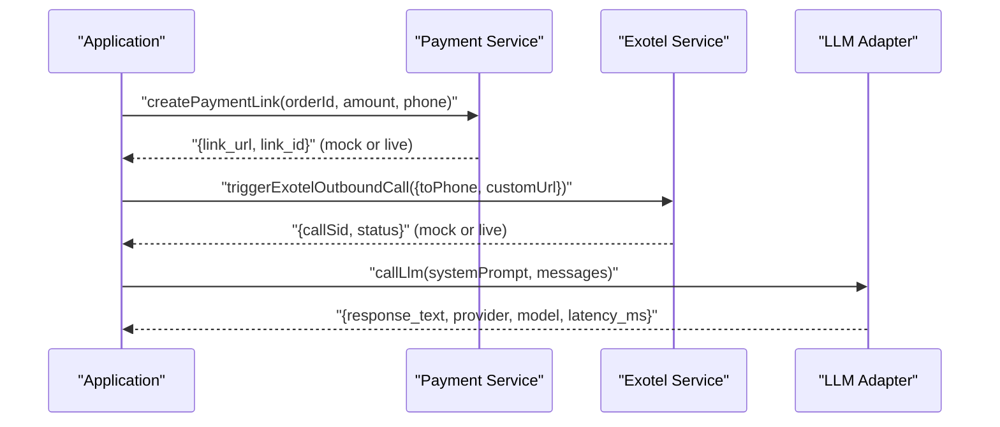

**Diagram sources**
- [paymentService.js:25-61](file://server/src/services/paymentService.js#L25-L61)
- [exotelService.js:38-83](file://server/src/services/exotelService.js#L38-L83)
- [dialogueManager.js:60-73](file://server/src/services/dialogueManager.js#L60-L73)

**Section sources**
- [paymentService.js:25-113](file://server/src/services/paymentService.js#L25-L113)
- [exotelService.js:17-83](file://server/src/services/exotelService.js#L17-L83)
- [dialogueManager.js:36-84](file://server/src/services/dialogueManager.js#L36-L84)

### Database Transactions and Message Queues
- Durable Job Queue persists jobs to database, claims them atomically, handles retries with exponential backoff, and routes failures to DLQ.
- Outbox worker polls events, processes them with locking, enqueues downstream jobs, and broadcasts to dashboard.

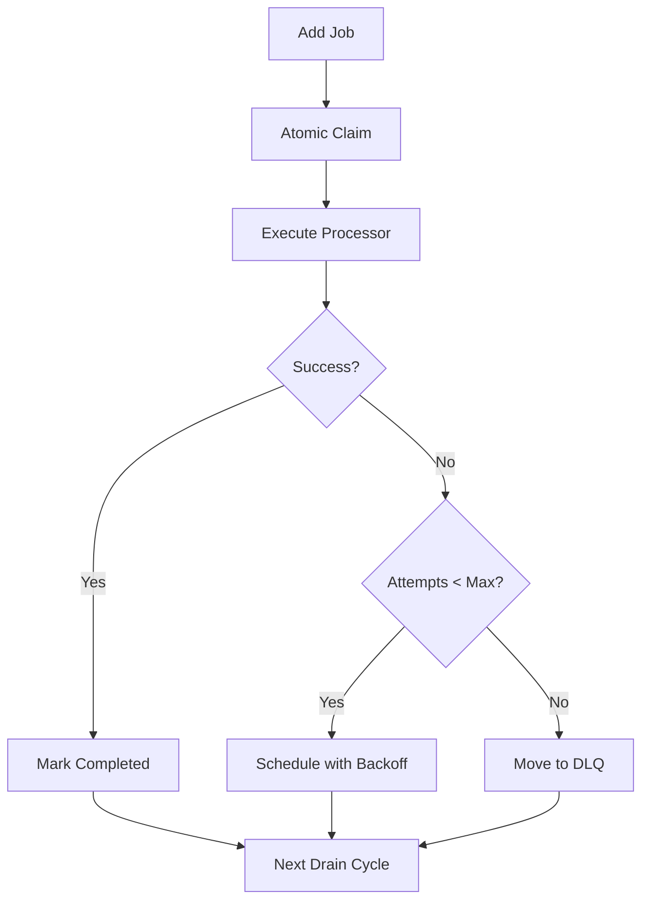

**Diagram sources**
- [jobQueue.js:47-76](file://server/src/queue/jobQueue.js#L47-L76)
- [jobQueue.js:107-212](file://server/src/queue/jobQueue.js#L107-L212)
- [outbox.worker.js:97-128](file://server/src/workers/outbox.worker.js#L97-L128)

**Section sources**
- [jobQueue.js:14-249](file://server/src/queue/jobQueue.js#L14-L249)
- [outbox.worker.js:14-128](file://server/src/workers/outbox.worker.js#L14-L128)

### Background Job Processing
- Outbox worker processes ORDER_CONFIRMED, ORDER_STATUS_CHANGED, PIN_LOCATION_CONFIRMED events.
- Enqueues notification and dispatch jobs with idempotency keys to prevent duplicates.
- Broadcasts tenant-scoped events to dashboard for real-time visibility.

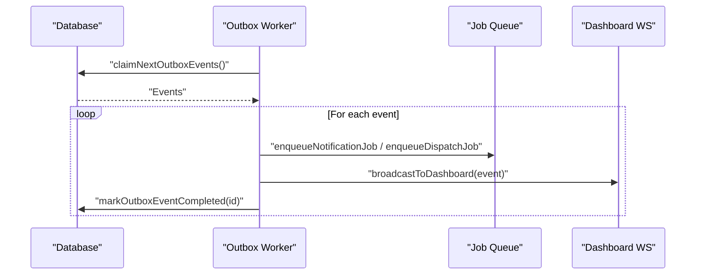

**Diagram sources**
- [outbox.worker.js:20-58](file://server/src/workers/outbox.worker.js#L20-L58)
- [outbox.worker.js:97-128](file://server/src/workers/outbox.worker.js#L97-L128)

**Section sources**
- [outbox.worker.js:14-128](file://server/src/workers/outbox.worker.js#L14-L128)

### Domain State Machines and Validation
- Order state machine defines states and actions; transitionOrder enforces legal transitions and recalculates totals.
- Payment and dispatch state machines validate lifecycle steps; illegal transitions are rejected.
- Prompt service versioning ensures consistent system prompts across dialogue turns.

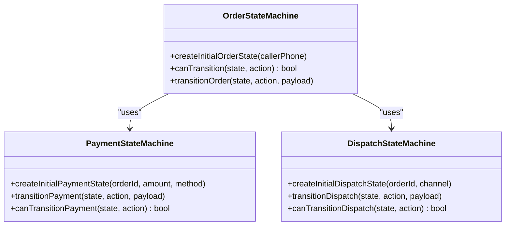

**Diagram sources**
- [orderStateMachine.js:8-325](file://server/src/domain/orders/orderStateMachine.js#L8-L325)
- [domain_state_machines.test.js:20-94](file://server/tests/domain_state_machines.test.js#L20-L94)

**Section sources**
- [orderStateMachine.js:8-325](file://server/src/domain/orders/orderStateMachine.js#L8-L325)
- [domain_state_machines.test.js:20-116](file://server/tests/domain_state_machines.test.js#L20-L116)

## Dependency Analysis
- Test suite depends on server runtime components: HTTP server, WebSocket server, database, job queue, workers.
- Services depend on environment configuration and optional external providers; mocks ensure test stability.
- Redis client provides in-memory fallback for non-production environments, enabling isolated tests without external dependencies.

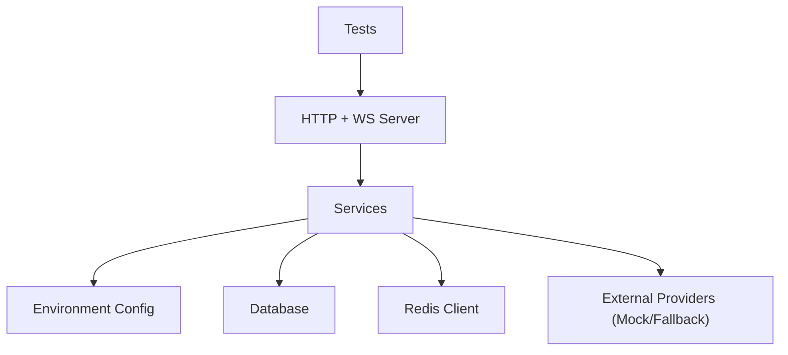

**Diagram sources**
- [env.js:3-42](file://server/src/config/env.js#L3-L42)
- [redisClient.js:82-127](file://server/src/infra/redisClient.js#L82-L127)
- [integration.test.js:29-56](file://server/tests/integration.test.js#L29-L56)

**Section sources**
- [env.js:3-42](file://server/src/config/env.js#L3-L42)
- [redisClient.js:82-127](file://server/src/infra/redisClient.js#L82-L127)
- [integration.test.js:29-56](file://server/tests/integration.test.js#L29-L56)

## Performance Considerations
- WebSocket heartbeats terminate inactive clients to free resources.
- Durable queue uses periodic drain cycles and exponential backoff to manage load and retries.
- Redis in-memory adapter reduces overhead in tests; production uses external Redis for scalability.
- Health checks in Docker Compose ensure readiness before traffic.

[No sources needed since this section provides general guidance]

## Troubleshooting Guide
- Authentication failures: Ensure valid tokens or tickets; verify role requirements for dashboard connections.
- Validation errors: Check Zod schema constraints for order updates; malformed payloads return 400.
- External provider errors: Mock modes activate when credentials are missing; logs indicate fallback behavior.
- Queue issues: Inspect DLQ entries and retry counts; ensure processors are registered for job types.
- WebSocket disconnects: Monitor heartbeat intervals and client liveness; verify upgrade paths and permissions.

**Section sources**
- [integration.test.js:72-77](file://server/tests/integration.test.js#L72-L77)
- [integration.test.js:147-161](file://server/tests/integration.test.js#L147-L161)
- [exotelService.js:38-83](file://server/src/services/exotelService.js#L38-L83)
- [paymentService.js:25-61](file://server/src/services/paymentService.js#L25-L61)
- [jobQueue.js:153-212](file://server/src/queue/jobQueue.js#L153-L212)
- [wsServer.js:149-158](file://server/src/websocket/wsServer.js#L149-L158)

## Conclusion
The Inkiro platform’s integration tests cover critical end-to-end flows across HTTP APIs, WebSocket streams, dialogue management, geocoding, payments, telephony, and background processing. Robust mocking and fallback mechanisms enable reliable testing without external dependencies. Durable queues and outbox workers ensure resilient event processing. Environment configuration and Redis adapters provide flexible setups for development and production. Following these strategies will help maintain high reliability and performance across complex integration scenarios.

[No sources needed since this section summarizes without analyzing specific files]

## Appendices
- Test Execution: Use npm scripts to run tests concurrently; isolate databases per test run.
- Environment Variables: Configure JWT secrets, encryption keys, and provider credentials appropriately for test vs production.
- Docker Setup: Leverage docker-compose for Redis and server health checks; mount volumes for persistent data during tests.

**Section sources**
- [package.json:7-11](file://server/package.json#L7-L11)
- [env.js:3-42](file://server/src/config/env.js#L3-L42)
- [docker-compose.yml:3-45](file://docker-compose.yml#L3-L45)