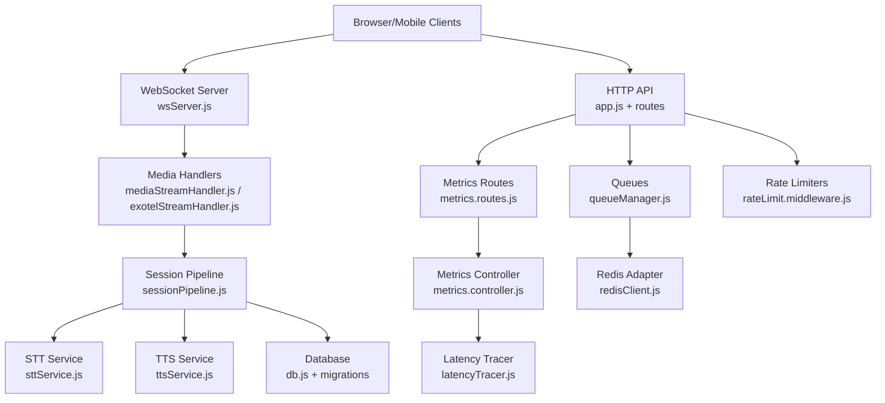
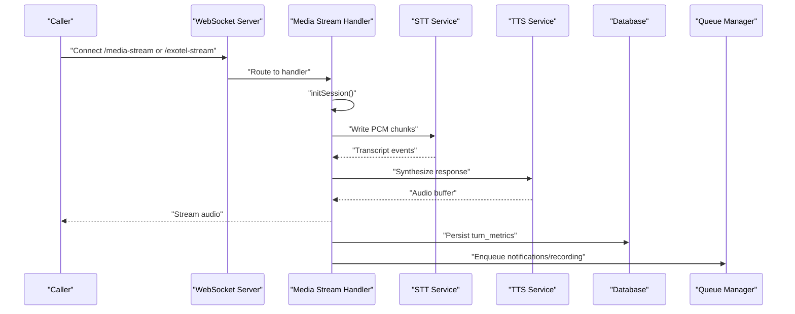
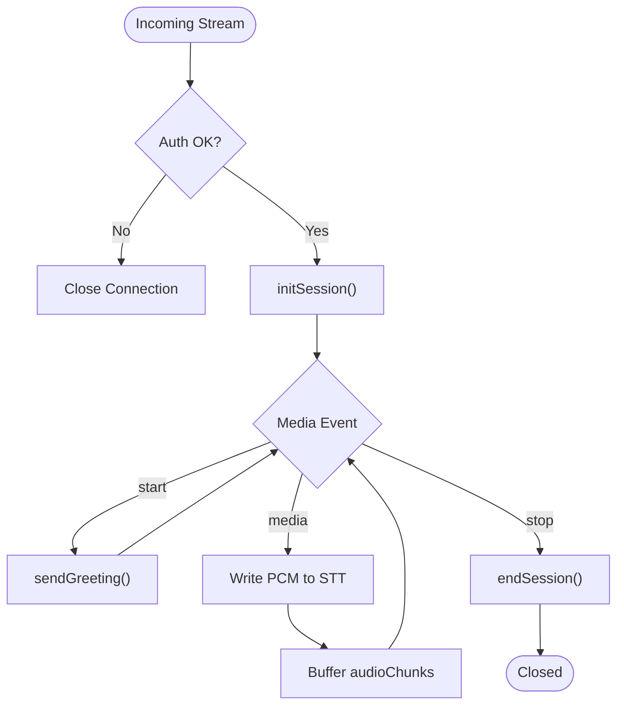
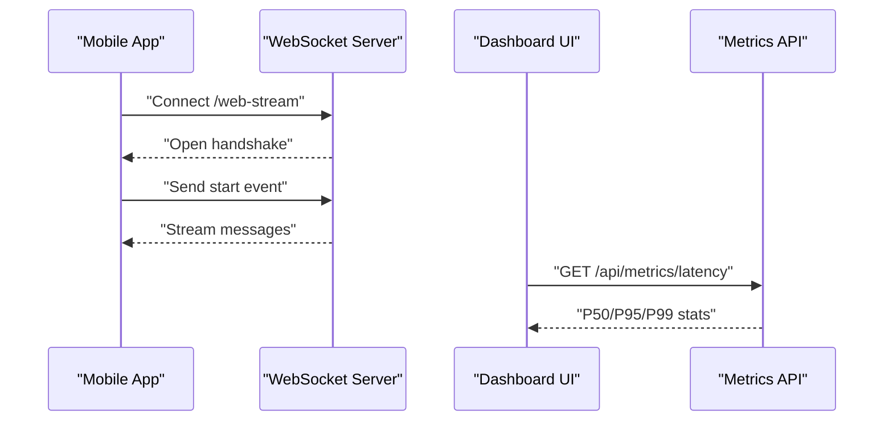
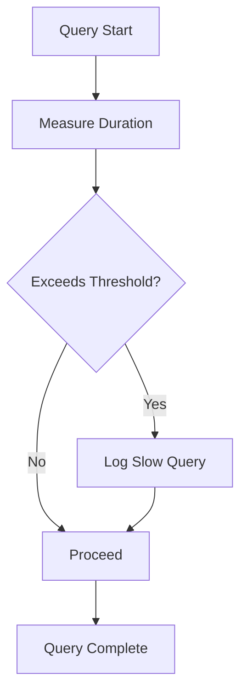
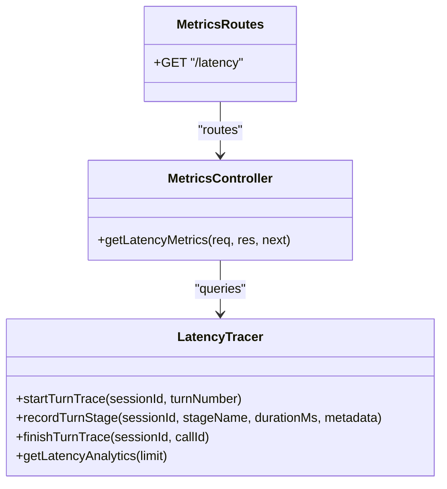
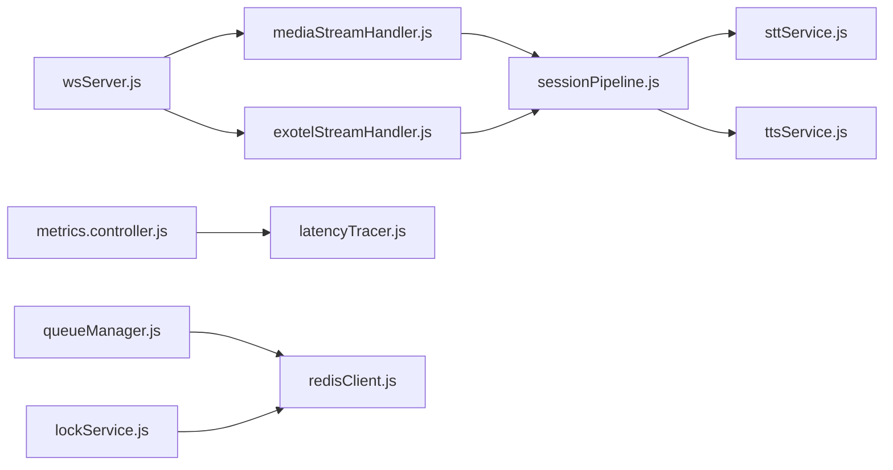

# Performance Testing

<cite>
**Referenced Files in This Document**
- [server.js](file://server/server.js)
- [app.js](file://server/src/app.js)
- [wsServer.js](file://server/src/websocket/wsServer.js)
- [mediaStreamHandler.js](file://server/src/websocket/mediaStreamHandler.js)
- [exotelStreamHandler.js](file://server/src/websocket/exotelStreamHandler.js)
- [sessionPipeline.js](file://server/src/websocket/sessionPipeline.js)
- [metrics.routes.js](file://server/src/routes/metrics.routes.js)
- [metrics.controller.js](file://server/src/controllers/metrics.controller.js)
- [latencyTracer.js](file://server/src/services/latencyTracer.js)
- [sloTracker.js](file://server/src/services/sloTracker.js)
- [sttService.js](file://server/src/services/sttService.js)
- [ttsService.js](file://server/src/services/ttsService.js)
- [db.js](file://server/src/db.js)
- [migrationRunner.js](file://server/src/db/migrations/migrationRunner.js)
- [queueManager.js](file://server/src/queue/queueManager.js)
- [redisClient.js](file://server/src/infra/redisClient.js)
- [lockService.js](file://server/src/infra/lockService.js)
- [rateLimit.middleware.js](file://server/src/middleware/rateLimit.middleware.js)
- [useMetrics.js](file://client/src/hooks/useMetrics.js)
- [VoiceAnalytics.jsx](file://client/src/components/VoiceAnalytics.jsx)
- [voiceSocketService.js](file://mobile/src/services/voiceSocketService.js)
- [integration.test.js](file://server/tests/integration.test.js)
- [release_gate_2.test.js](file://server/tests/release_gate_2.test.js)
</cite>

## Table of Contents
1. Introduction
2. Project Structure
3. Core Components
4. Architecture Overview
5. Detailed Component Analysis
6. Dependency Analysis
7. Performance Considerations
8. Troubleshooting Guide
9. Conclusion
10. Appendices

## Introduction
This document defines performance testing strategies for the Inkiro platform with a focus on:
- Load testing API endpoints under heavy traffic and concurrent sessions
- Stress testing to identify bottlenecks, memory leaks, and resource exhaustion
- Benchmarking AI processing latency across STT, LLM, and TTS stages
- Monitoring real-time WebSocket communications for voice call processing
- Database query optimization and SLO tracking for release gates

The guidance is grounded in the platform’s existing observability, rate limiting, queueing, and streaming components.

## Project Structure
Inkiro exposes HTTP APIs and WebSocket endpoints for telephony and web media streams. Observability is provided via metrics routes and client dashboards. Queues handle background workloads (notifications, dispatch, recordings). The database layer includes slow query logging and migration-managed indexes.

**Diagram sources**
- [wsServer.js:74-161](file://server/src/websocket/wsServer.js#L74-L161)
- [mediaStreamHandler.js:1-69](file://server/src/websocket/mediaStreamHandler.js#L1-L69)
- [exotelStreamHandler.js:1-80](file://server/src/websocket/exotelStreamHandler.js#L1-L80)
- [metrics.routes.js:1-7](file://server/src/routes/metrics.routes.js#L1-L7)
- [metrics.controller.js:1-29](file://server/src/controllers/metrics.controller.js#L1-L29)
- [latencyTracer.js:1-133](file://server/src/services/latencyTracer.js#L1-L133)
- [sttService.js:1-603](file://server/src/services/sttService.js#L1-L603)
- [ttsService.js:1-187](file://server/src/services/ttsService.js#L1-L187)
- [db.js:46-126](file://server/src/db.js#L46-L126)
- [migrationRunner.js:138-164](file://server/src/db/migrations/migrationRunner.js#L138-L164)
- [queueManager.js:1-122](file://server/src/queue/queueManager.js#L1-L122)
- [redisClient.js:1-127](file://server/src/infra/redisClient.js#L1-L127)
- [rateLimit.middleware.js:1-52](file://server/src/middleware/rateLimit.middleware.js#L1-L52)

**Section sources**
- [wsServer.js:74-161](file://server/src/websocket/wsServer.js#L74-L161)
- [metrics.routes.js:1-7](file://server/src/routes/metrics.routes.js#L1-L7)
- [db.js:46-126](file://server/src/db.js#L46-L126)
- [queueManager.js:1-122](file://server/src/queue/queueManager.js#L1-L122)

## Core Components
- Real-time media handling: Twilio and Exotel stream handlers initialize sessions, route audio to STT, and manage lifecycle events.
- Latency tracing: End-to-end turn traces capture VAD, STT, LLM, and TTS durations and persist them for analytics.
- Metrics exposure: REST endpoints expose latency percentiles and audit logs consumed by dashboards.
- Queueing: Background jobs for notifications, dispatch, and recording with idempotency and concurrency controls.
- Database performance: Slow query logging and pre-created indexes to optimize hot paths.
- Rate limiting: Per-route limits protect APIs and webhooks from overload.
- SLO tracking: Aggregates availability, latency, and error rates to evaluate budgets.

**Section sources**
- [mediaStreamHandler.js:1-69](file://server/src/websocket/mediaStreamHandler.js#L1-L69)
- [exotelStreamHandler.js:1-80](file://server/src/websocket/exotelStreamHandler.js#L1-L80)
- [latencyTracer.js:1-133](file://server/src/services/latencyTracer.js#L1-L133)
- [metrics.controller.js:1-29](file://server/src/controllers/metrics.controller.js#L1-L29)
- [queueManager.js:1-122](file://server/src/queue/queueManager.js#L1-L122)
- [db.js:46-126](file://server/src/db.js#L46-L126)
- [migrationRunner.js:138-164](file://server/src/db/migrations/migrationRunner.js#L138-L164)
- [rateLimit.middleware.js:1-52](file://server/src/middleware/rateLimit.middleware.js#L1-L52)
- [sloTracker.js:1-64](file://server/src/services/sloTracker.js#L1-L64)

## Architecture Overview
The system processes high-concurrency voice calls over WebSockets, transcribes audio via STT, synthesizes responses via TTS, persists metrics, and offloads side effects to queues. Observability surfaces latency percentiles and SLO status.

**Diagram sources**
- [wsServer.js:74-161](file://server/src/websocket/wsServer.js#L74-L161)
- [mediaStreamHandler.js:1-69](file://server/src/websocket/mediaStreamHandler.js#L1-L69)
- [exotelStreamHandler.js:1-80](file://server/src/websocket/exotelStreamHandler.js#L1-L80)
- [sttService.js:329-454](file://server/src/services/sttService.js#L329-L454)
- [ttsService.js:28-70](file://server/src/services/ttsService.js#L28-L70)
- [latencyTracer.js:39-90](file://server/src/services/latencyTracer.js#L39-L90)
- [queueManager.js:80-102](file://server/src/queue/queueManager.js#L80-L102)

## Detailed Component Analysis

### High-Concurrency Voice Call Processing
- WebSocket routing and authentication: The server authenticates incoming streams using tickets or tokens and routes to appropriate handlers.
- Session lifecycle: Handlers initialize sessions, send greetings, process media, and end sessions cleanly.
- Audio pipeline: Media frames are converted and written to STT streams; audio chunks are buffered for analysis.

**Diagram sources**
- [wsServer.js:74-161](file://server/src/websocket/wsServer.js#L74-L161)
- [mediaStreamHandler.js:1-69](file://server/src/websocket/mediaStreamHandler.js#L1-L69)
- [exotelStreamHandler.js:1-80](file://server/src/websocket/exotelStreamHandler.js#L1-L80)

**Section sources**
- [wsServer.js:74-161](file://server/src/websocket/wsServer.js#L74-L161)
- [mediaStreamHandler.js:1-69](file://server/src/websocket/mediaStreamHandler.js#L1-L69)
- [exotelStreamHandler.js:1-80](file://server/src/websocket/exotelStreamHandler.js#L1-L80)

### Real-Time WebSocket Communications
- Heartbeat liveness checks ensure dead connections are terminated.
- Mobile client uses a resilient WebSocket service that emits typed events and handles reconnection.
- Dashboard and analytics clients poll metrics endpoints to visualize latency percentiles.

**Diagram sources**
- [wsServer.js:138-161](file://server/src/websocket/wsServer.js#L138-L161)
- [voiceSocketService.js:1-57](file://mobile/src/services/voiceSocketService.js#L1-L57)
- [useMetrics.js:35-72](file://client/src/hooks/useMetrics.js#L35-L72)
- [metrics.routes.js:1-7](file://server/src/routes/metrics.routes.js#L1-L7)

**Section sources**
- [wsServer.js:138-161](file://server/src/websocket/wsServer.js#L138-L161)
- [voiceSocketService.js:1-57](file://mobile/src/services/voiceSocketService.js#L1-L57)
- [useMetrics.js:35-72](file://client/src/hooks/useMetrics.js#L35-L72)

### Database Query Optimization
- Slow query logging: Queries exceeding thresholds are logged with context to identify hotspots.
- Indexes: Migration runner creates critical indexes for customers, catalog, orders, and calls to reduce scan costs.
- Transactions: Wrapped operations ensure consistency during multi-step writes.

**Diagram sources**
- [db.js:46-126](file://server/src/db.js#L46-L126)
- [migrationRunner.js:138-164](file://server/src/db/migrations/migrationRunner.js#L138-L164)

**Section sources**
- [db.js:46-126](file://server/src/db.js#L46-L126)
- [migrationRunner.js:138-164](file://server/src/db/migrations/migrationRunner.js#L138-L164)

### API Load Testing Methodology
- Targets:
  - Authentication and dashboard endpoints protected by rate limiters
  - Telephony webhooks and public catalog endpoints
- Scenarios:
  - Concurrent user sessions simulating login, dashboard polling, and catalog reads
  - Webhook bursts to telephony endpoints
- Tools and approach:
  - Use a load generator to simulate thousands of concurrent users
  - Configure per-endpoint rate limits to match production policies
  - Validate 2xx/4xx/5xx ratios and response time percentiles

Key references:
- Rate limiters define safe throughput caps per endpoint category
- Integration tests demonstrate expected behaviors for key endpoints

**Section sources**
- [rateLimit.middleware.js:1-52](file://server/src/middleware/rateLimit.middleware.js#L1-L52)
- [integration.test.js:58-161](file://server/tests/integration.test.js#L58-L161)

### Stress Testing Strategies
- Objectives:
  - Identify CPU, memory, and I/O bottlenecks under sustained load
  - Detect memory leaks in long-running WebSocket sessions
  - Validate graceful degradation when external services (STT/TTS) are throttled
- Techniques:
  - Sustained peak load to push queue backlogs and measure tail latencies
  - Spike tests to validate auto-scaling and rate limiter behavior
  - Fault injection to test fallback paths (e.g., mock STT/TTS)
- Evidence points:
  - Redis adapter supports in-memory mode for local stress runs
  - Lock service ensures exclusive access to shared resources

**Section sources**
- [redisClient.js:1-127](file://server/src/infra/redisClient.js#L1-L127)
- [lockService.js:45-81](file://server/src/infra/lockService.js#L45-L81)

### Performance Regression Testing with Release Gates
- Gate criteria:
  - Verify queue processors execute correctly and idempotently
  - Validate single-use WebSocket tickets and token rotation
  - Confirm state machine transitions enforce legal order states
  - Ensure non-blocking storage persistence for recordings
- Execution:
  - Run unit and integration tests in CI as release gates
  - Fail builds if assertions on idempotency, auth, or state transitions fail

**Section sources**
- [release_gate_2.test.js:24-151](file://server/tests/release_gate_2.test.js#L24-L151)

### Benchmarking AI Processing Latency
- Measurement:
  - Turn-level traces record VAD, STT, LLM, and TTS durations
  - Percentile analytics (P50, P95, P99) exposed via metrics API
- Providers:
  - STT supports multiple providers with fallbacks
  - TTS caches repeated prompts to reduce synthesis overhead
- Baselines:
  - Establish baseline latencies per provider and language
  - Track regressions against targets defined in SLOs

**Diagram sources**
- [latencyTracer.js:1-133](file://server/src/services/latencyTracer.js#L1-L133)
- [metrics.controller.js:1-29](file://server/src/controllers/metrics.controller.js#L1-L29)
- [metrics.routes.js:1-7](file://server/src/routes/metrics.routes.js#L1-L7)

**Section sources**
- [latencyTracer.js:1-133](file://server/src/services/latencyTracer.js#L1-L133)
- [metrics.controller.js:1-29](file://server/src/controllers/metrics.controller.js#L1-L29)
- [sttService.js:329-454](file://server/src/services/sttService.js#L329-L454)
- [ttsService.js:28-70](file://server/src/services/ttsService.js#L28-L70)

### Monitoring Response Times and SLOs
- SLO targets include API availability, voice setup latency, transcription latency, and error rate.
- SLO metrics aggregate recent call data to compute availability and budget burn.
- Client dashboards display percentile latencies and component averages.

**Section sources**
- [sloTracker.js:1-64](file://server/src/services/sloTracker.js#L1-L64)
- [useMetrics.js:1-72](file://client/src/hooks/useMetrics.js#L1-L72)
- [VoiceAnalytics.jsx:1-78](file://client/src/components/VoiceAnalytics.jsx#L1-L78)

## Dependency Analysis
- WebSocket server depends on stream handlers and session pipeline for call lifecycle management.
- Metrics pipeline depends on latency tracer and database for analytics.
- Queues depend on idempotency store and storage service for durable side effects.
- Redis adapter provides distributed locking and caching with in-memory fallback for development.

**Diagram sources**
- [wsServer.js:74-161](file://server/src/websocket/wsServer.js#L74-L161)
- [mediaStreamHandler.js:1-69](file://server/src/websocket/mediaStreamHandler.js#L1-L69)
- [exotelStreamHandler.js:1-80](file://server/src/websocket/exotelStreamHandler.js#L1-L80)
- [metrics.controller.js:1-29](file://server/src/controllers/metrics.controller.js#L1-L29)
- [latencyTracer.js:1-133](file://server/src/services/latencyTracer.js#L1-L133)
- [queueManager.js:1-122](file://server/src/queue/queueManager.js#L1-L122)
- [redisClient.js:1-127](file://server/src/infra/redisClient.js#L1-L127)
- [lockService.js:45-81](file://server/src/infra/lockService.js#L45-L81)

**Section sources**
- [wsServer.js:74-161](file://server/src/websocket/wsServer.js#L74-L161)
- [metrics.controller.js:1-29](file://server/src/controllers/metrics.controller.js#L1-L29)
- [queueManager.js:1-122](file://server/src/queue/queueManager.js#L1-L122)
- [redisClient.js:1-127](file://server/src/infra/redisClient.js#L1-L127)

## Performance Considerations
- Concurrency and backpressure:
  - Tune queue concurrency and retries to match workload characteristics
  - Monitor queue depths and DLQ counts to detect saturation
- Memory management:
  - Cap in-memory buffers (e.g., audio chunks) to prevent growth under load
  - Use Redis-backed locks to avoid contention and ensure safe cleanup
- External service resilience:
  - Prefer fast-fail and fallback paths for STT/TTS to maintain responsiveness
  - Cache frequent TTS outputs to reduce synthesis overhead
- Database tuning:
  - Leverage indexes created by migrations for hot queries
  - Watch slow query logs and refactor expensive operations
- Rate limiting:
  - Apply strict limits on auth and webhook endpoints to protect stability

[No sources needed since this section provides general guidance]

## Troubleshooting Guide
- High latency spikes:
  - Inspect latency percentiles via metrics API and dashboard
  - Correlate with STT/TTS provider errors and queue backlogs
- WebSocket connection drops:
  - Check heartbeat intervals and connection close handlers
  - Validate ticket/token consumption flows
- Database slowdowns:
  - Review slow query logs and add missing indexes
  - Normalize queries and reduce result set sizes
- Queue stalls:
  - Verify processor registration and idempotency keys
  - Inspect DLQ counts and retry policies

**Section sources**
- [useMetrics.js:35-72](file://client/src/hooks/useMetrics.js#L35-L72)
- [VoiceAnalytics.jsx:1-78](file://client/src/components/VoiceAnalytics.jsx#L1-L78)
- [db.js:46-126](file://server/src/db.js#L46-L126)
- [queueManager.js:1-122](file://server/src/queue/queueManager.js#L1-L122)

## Conclusion
Inkiro’s architecture provides robust foundations for performance testing:
- Real-time media pipelines with clear lifecycle management
- Comprehensive latency tracing and SLO tracking
- Queues with idempotency and concurrency controls
- Database optimizations and rate limiting for stability

Adopt the outlined load, stress, and regression testing strategies to ensure reliable operation under high concurrency and to catch performance regressions before release.

[No sources needed since this section summarizes without analyzing specific files]

## Appendices

### A. Load Test Playbooks
- API endpoints:
  - Authenticate and poll dashboard endpoints under concurrent sessions
  - Simulate public catalog reads and validation payloads
- Telephony webhooks:
  - Generate webhook bursts to validate rate limiting and XML responses
- Validation:
  - Assert success rates, error codes, and p95/p99 latencies

**Section sources**
- [integration.test.js:58-161](file://server/tests/integration.test.js#L58-L161)
- [rateLimit.middleware.js:1-52](file://server/src/middleware/rateLimit.middleware.js#L1-L52)

### B. Stress Test Scenarios
- Sustained peak load:
  - Maintain high concurrency to observe queue depth and tail latencies
- Spike tests:
  - Short bursts to validate rate limiter behavior and recovery
- Fault injection:
  - Disable or throttle STT/TTS to verify fallbacks and error handling

**Section sources**
- [redisClient.js:1-127](file://server/src/infra/redisClient.js#L1-L127)
- [lockService.js:45-81](file://server/src/infra/lockService.js#L45-L81)

### C. Release Gate Criteria
- Queue execution and idempotency verified
- Single-use WebSocket tickets enforced
- Token rotation validated
- State machine transitions enforced
- Non-blocking storage persistence confirmed

**Section sources**
- [release_gate_2.test.js:24-151](file://server/tests/release_gate_2.test.js#L24-L151)