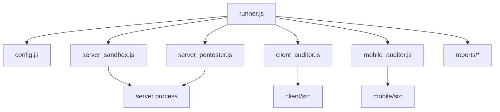
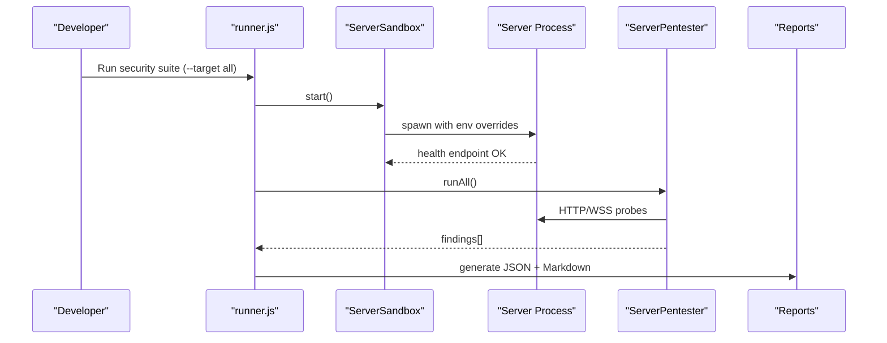
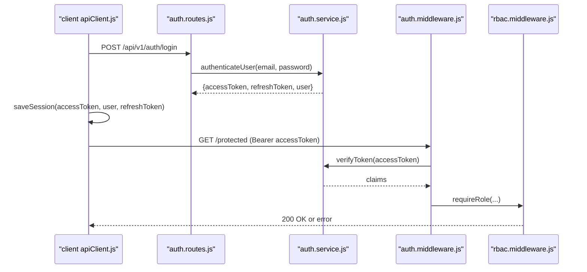
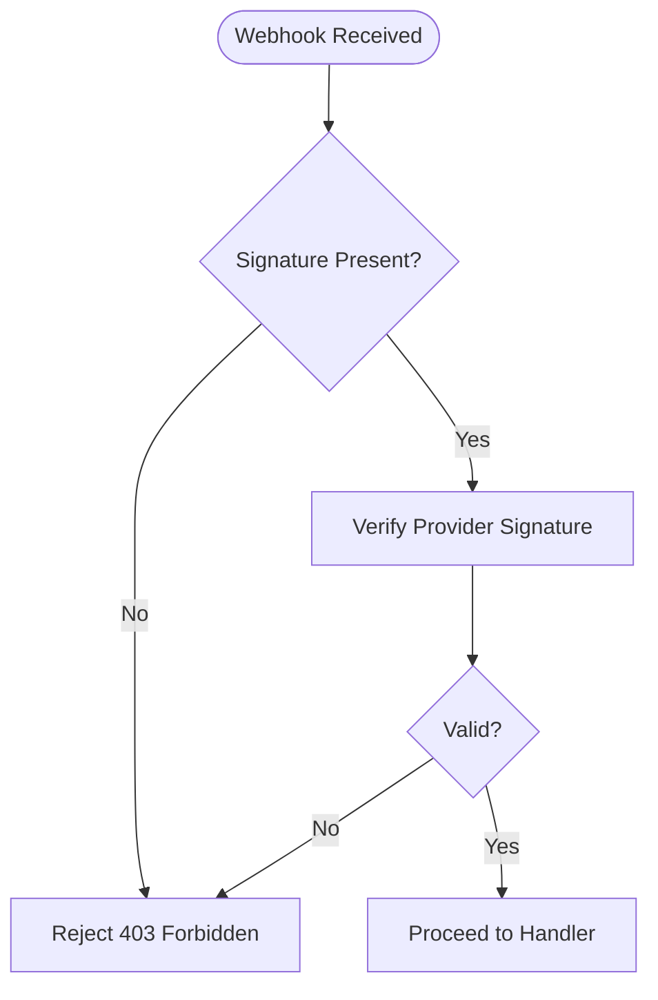
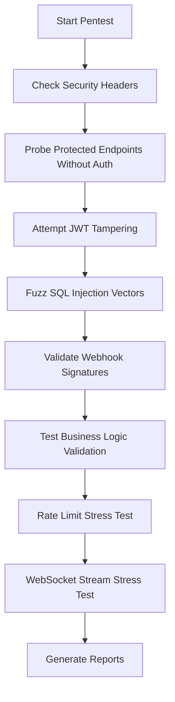
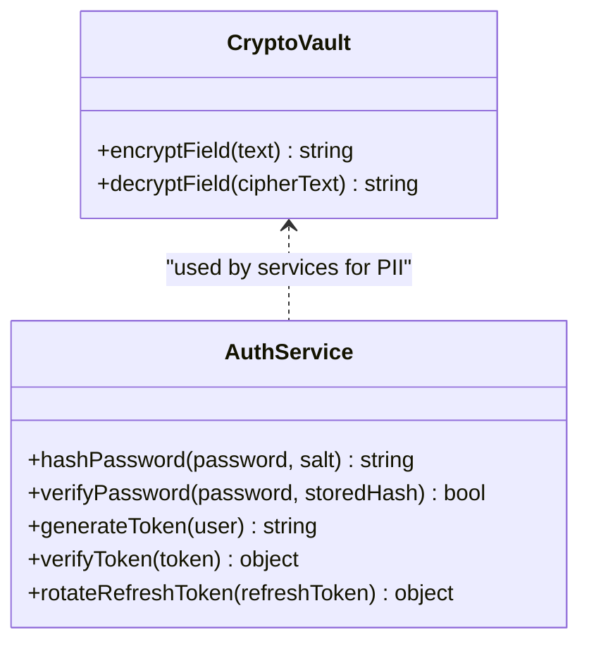
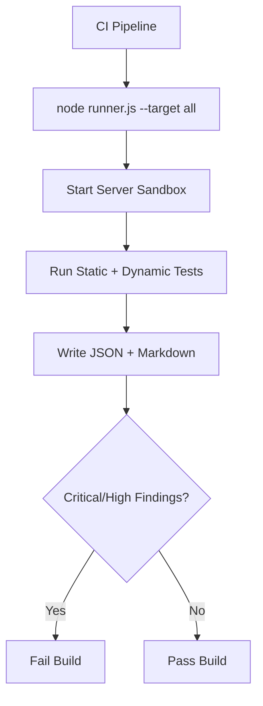
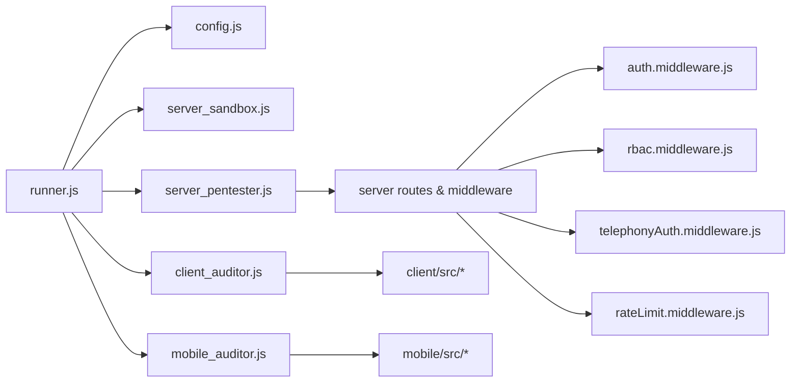

# Security Testing

<cite>
**Referenced Files in This Document**
- [security-suite/README.md](file://security-suite/README.md)
- [security-suite/config.js](file://security-suite/config.js)
- [security-suite/runner.js](file://security-suite/runner.js)
- [security-suite/sandboxes/server_sandbox.js](file://security-suite/sandboxes/server_sandbox.js)
- [security-suite/analyzers/server_pentester.js](file://security-suite/analyzers/server_pentester.js)
- [security-suite/analyzers/client_auditor.js](file://security-suite/analyzers/client_auditor.js)
- [security-suite/analyzers/mobile_auditor.js](file://security-suite/analyzers/mobile_auditor.js)
- [server/src/services/auth.service.js](file://server/src/services/auth.service.js)
- [server/src/middleware/auth.middleware.js](file://server/src/middleware/auth.middleware.js)
- [server/src/middleware/rbac.middleware.js](file://server/src/middleware/rbac.middleware.js)
- [server/src/middleware/telephonyAuth.middleware.js](file://server/src/middleware/telephonyAuth.middleware.js)
- [server/src/middleware/rateLimit.middleware.js](file://server/src/middleware/rateLimit.middleware.js)
- [server/src/utils/cryptoVault.js](file://server/src/utils/cryptoVault.js)
- [server/src/routes/auth.routes.js](file://server/src/routes/auth.routes.js)
- [client/src/services/apiClient.js](file://client/src/services/apiClient.js)
- [mobile/src/services/apiService.js](file://mobile/src/services/apiService.js)
- [server/tests/security_and_auth.test.js](file://server/tests/security_and_auth.test.js)
</cite>

## Table of Contents
1. Introduction
2. Project Structure
3. Core Components
4. Architecture Overview
5. Detailed Component Analysis
6. Dependency Analysis
7. Performance Considerations
8. Troubleshooting Guide
9. Conclusion
10. Appendices

## Introduction
This document provides comprehensive security testing guidance for the Inkiro platform, covering server-side penetration testing, client-side auditing, and mobile application security assessment. It details authentication and authorization testing (JWT validation, role-based access control, session management), vulnerability scanning methodologies (SQL injection, XSS, API flaws), encryption and secure communication verification, data protection measures, security regression testing, compliance validation, and continuous security monitoring in CI/CD pipelines.

## Project Structure
The security suite is a standalone module that orchestrates static and dynamic tests across server, client, and mobile targets without coupling to production code. The runner coordinates:
- Client static audit for secrets, XSS sinks, insecure storage, and postMessage handling
- Mobile static audit for hardcoded secrets, cleartext traffic, insecure storage, and deep link handling
- Server sandbox launch and live dynamic pentesting for headers, auth bypass, JWT tampering, SQLi, webhook forgery, business logic, rate limiting, and WebSocket security
- Optional Strix AI-driven autonomous pentesting integration
- Report generation in JSON and Markdown with severity-sorted findings

**Diagram sources**
- [security-suite/runner.js:27-81](file://security-suite/runner.js#L27-L81)
- [security-suite/config.js:6-32](file://security-suite/config.js#L6-L32)
- [security-suite/sandboxes/server_sandbox.js:15-84](file://security-suite/sandboxes/server_sandbox.js#L15-L84)
- [security-suite/analyzers/server_pentester.js:10-23](file://security-suite/analyzers/server_pentester.js#L10-L23)
- [security-suite/analyzers/client_auditor.js:12-28](file://security-suite/analyzers/client_auditor.js#L12-L28)
- [security-suite/analyzers/mobile_auditor.js:11-31](file://security-suite/analyzers/mobile_auditor.js#L11-L31)

**Section sources**
- [security-suite/README.md:9-83](file://security-suite/README.md#L9-L83)
- [security-suite/runner.js:14-81](file://security-suite/runner.js#L14-L81)
- [security-suite/config.js:6-32](file://security-suite/config.js#L6-L32)

## Core Components
- Authentication and Authorization
  - JWT issuance, verification, and refresh token rotation with fail-closed persistence
  - Middleware-based authentication and RBAC enforcement
  - Telephony webhook signature verification for Twilio and Exotel
- Vulnerability Scanning
  - Static analysis for client and mobile codebases
  - Dynamic server pentesting via an isolated sandbox
- Encryption and Data Protection
  - AES-256-GCM field-level encryption utility
  - Secure password hashing with PBKDF2 and per-user salts
- Rate Limiting and DoS Mitigation
  - Scoped rate limiters for auth, public APIs, dashboard, and telephony webhooks
- Reporting and CI Integration
  - Severity-sorted JSON and Markdown reports suitable for CI/CD gating

**Section sources**
- [server/src/services/auth.service.js:21-120](file://server/src/services/auth.service.js#L21-L120)
- [server/src/middleware/auth.middleware.js:10-51](file://server/src/middleware/auth.middleware.js#L10-L51)
- [server/src/middleware/rbac.middleware.js:3-29](file://server/src/middleware/rbac.middleware.js#L3-L29)
- [server/src/middleware/telephonyAuth.middleware.js:10-91](file://server/src/middleware/telephonyAuth.middleware.js#L10-L91)
- [server/src/middleware/rateLimit.middleware.js:8-51](file://server/src/middleware/rateLimit.middleware.js#L8-L51)
- [server/src/utils/cryptoVault.js:16-58](file://server/src/utils/cryptoVault.js#L16-L58)
- [security-suite/runner.js:98-180](file://security-suite/runner.js#L98-L180)

## Architecture Overview
The security pipeline executes in three layers:
- Static Auditors: Scan client and mobile source trees for risky patterns and misconfigurations
- Live Sandbox: Spawns an isolated server instance with test-only environment variables and a disposable database
- Dynamic Pentester: Probes endpoints, validates headers, attempts JWT tampering, probes SQLi, verifies webhook signatures, checks rate limits, and exercises WebSocket streams

**Diagram sources**
- [security-suite/runner.js:27-81](file://security-suite/runner.js#L27-L81)
- [security-suite/sandboxes/server_sandbox.js:15-84](file://security-suite/sandboxes/server_sandbox.js#L15-L84)
- [security-suite/analyzers/server_pentester.js:10-23](file://security-suite/analyzers/server_pentester.js#L10-L23)

## Detailed Component Analysis

### Authentication and Authorization Testing
- JWT Validation
  - Verify issuer, audience, algorithm, and expiration; reject malformed or tampered tokens
  - Test both access and refresh token flows including single-use rotation and revocation
- Role-Based Access Control
  - Validate that protected routes enforce required roles and deny unauthorized access
- Session Management
  - Confirm client-side token storage behavior and automatic refresh on 401 responses
  - Ensure logout clears stored credentials

**Diagram sources**
- [client/src/services/apiClient.js:42-127](file://client/src/services/apiClient.js#L42-L127)
- [server/src/routes/auth.routes.js:7-12](file://server/src/routes/auth.routes.js#L7-L12)
- [server/src/services/auth.service.js:50-120](file://server/src/services/auth.service.js#L50-L120)
- [server/src/middleware/auth.middleware.js:10-51](file://server/src/middleware/auth.middleware.js#L10-L51)
- [server/src/middleware/rbac.middleware.js:15-29](file://server/src/middleware/rbac.middleware.js#L15-L29)

**Section sources**
- [server/src/services/auth.service.js:21-120](file://server/src/services/auth.service.js#L21-L120)
- [server/src/middleware/auth.middleware.js:10-51](file://server/src/middleware/auth.middleware.js#L10-L51)
- [server/src/middleware/rbac.middleware.js:3-29](file://server/src/middleware/rbac.middleware.js#L3-L29)
- [client/src/services/apiClient.js:42-127](file://client/src/services/apiClient.js#L42-L127)
- [server/tests/security_and_auth.test.js:34-71](file://server/tests/security_and_auth.test.js#L34-L71)

### Webhook Security Testing
- Twilio and Exotel webhook signature verification
- Validate that missing or invalid signatures are rejected in production
- Confirm development bypass behavior is isolated from production

**Diagram sources**
- [server/src/middleware/telephonyAuth.middleware.js:10-91](file://server/src/middleware/telephonyAuth.middleware.js#L10-L91)

**Section sources**
- [server/src/middleware/telephonyAuth.middleware.js:10-91](file://server/src/middleware/telephonyAuth.middleware.js#L10-L91)

### Vulnerability Scanning Methodologies
- SQL Injection
  - Probe query parameters with common payloads; detect database error leakage
  - Enforce parameterized queries and schema validation
- Cross-Site Scripting (XSS)
  - Detect dangerous sinks such as innerHTML and eval usage in client code
  - Recommend sanitization and safe rendering practices
- API Security Flaws
  - Unauthenticated access to protected endpoints
  - Missing security headers
  - Business logic validation failures
  - Insufficient rate limiting on sensitive endpoints

**Diagram sources**
- [security-suite/analyzers/server_pentester.js:10-23](file://security-suite/analyzers/server_pentester.js#L10-L23)
- [security-suite/analyzers/server_pentester.js:42-283](file://security-suite/analyzers/server_pentester.js#L42-L283)

**Section sources**
- [security-suite/analyzers/server_pentester.js:42-283](file://security-suite/analyzers/server_pentester.js#L42-L283)
- [security-suite/analyzers/client_auditor.js:64-184](file://security-suite/analyzers/client_auditor.js#L64-L184)

### Encryption and Data Protection Testing
- Field-Level Encryption
  - Validate encrypt/decrypt round-trips using AES-256-GCM
  - Ensure non-encrypted inputs pass through unchanged
- Password Hashing
  - Confirm unique per-user salts and timing-safe comparison
- Secure Communication
  - Prefer HTTPS/WSS; detect cleartext HTTP in mobile code
  - Enforce transport security policies at the client layer

**Diagram sources**
- [server/src/utils/cryptoVault.js:16-58](file://server/src/utils/cryptoVault.js#L16-L58)
- [server/src/services/auth.service.js:21-120](file://server/src/services/auth.service.js#L21-L120)

**Section sources**
- [server/src/utils/cryptoVault.js:16-58](file://server/src/utils/cryptoVault.js#L16-L58)
- [server/src/services/auth.service.js:21-120](file://server/src/services/auth.service.js#L21-L120)
- [mobile/src/services/apiService.js:3-8](file://mobile/src/services/apiService.js#L3-L8)

### Continuous Security Monitoring and CI/CD Integration
- Automated Runs
  - Execute full suite against all targets or specific subsystems
  - Use watch mode to re-run on code changes during development
- Reports for Automation
  - JSON report for machine parsing and CI gating
  - Markdown report for human review and diff tracking
- Optional AI-Driven Pentesting
  - Invoke Strix orchestrator for advanced multi-agent scans when available

**Diagram sources**
- [security-suite/runner.js:27-81](file://security-suite/runner.js#L27-L81)
- [security-suite/runner.js:98-180](file://security-suite/runner.js#L98-L180)
- [security-suite/README.md:9-83](file://security-suite/README.md#L9-L83)

**Section sources**
- [security-suite/README.md:9-83](file://security-suite/README.md#L9-L83)
- [security-suite/runner.js:27-81](file://security-suite/runner.js#L27-L81)
- [security-suite/runner.js:98-180](file://security-suite/runner.js#L98-L180)

## Dependency Analysis
Key dependencies and relationships:
- Runner depends on config, sandbox, and analyzers
- Server pentester depends on running server endpoints and WebSocket service
- Client and mobile auditors depend on file system traversal of respective source trees
- Auth flow depends on auth middleware, RBAC, and auth service
- Telephony webhooks depend on signature verification middleware
- Rate limiters protect sensitive endpoints

**Diagram sources**
- [security-suite/runner.js:27-81](file://security-suite/runner.js#L27-L81)
- [security-suite/config.js:6-32](file://security-suite/config.js#L6-L32)
- [security-suite/analyzers/server_pentester.js:10-23](file://security-suite/analyzers/server_pentester.js#L10-L23)
- [security-suite/analyzers/client_auditor.js:12-28](file://security-suite/analyzers/client_auditor.js#L12-L28)
- [security-suite/analyzers/mobile_auditor.js:11-31](file://security-suite/analyzers/mobile_auditor.js#L11-L31)
- [server/src/middleware/auth.middleware.js:10-51](file://server/src/middleware/auth.middleware.js#L10-L51)
- [server/src/middleware/rbac.middleware.js:3-29](file://server/src/middleware/rbac.middleware.js#L3-L29)
- [server/src/middleware/telephonyAuth.middleware.js:10-91](file://server/src/middleware/telephonyAuth.middleware.js#L10-L91)
- [server/src/middleware/rateLimit.middleware.js:8-51](file://server/src/middleware/rateLimit.middleware.js#L8-L51)

**Section sources**
- [security-suite/runner.js:27-81](file://security-suite/runner.js#L27-L81)
- [security-suite/config.js:6-32](file://security-suite/config.js#L6-L32)
- [server/src/middleware/auth.middleware.js:10-51](file://server/src/middleware/auth.middleware.js#L10-L51)
- [server/src/middleware/rbac.middleware.js:3-29](file://server/src/middleware/rbac.middleware.js#L3-L29)
- [server/src/middleware/telephonyAuth.middleware.js:10-91](file://server/src/middleware/telephonyAuth.middleware.js#L10-L91)
- [server/src/middleware/rateLimit.middleware.js:8-51](file://server/src/middleware/rateLimit.middleware.js#L8-L51)

## Performance Considerations
- Isolated Sandbox Execution
  - Use a dedicated port and disposable database to avoid interference with other processes
  - Health-check polling ensures robust startup detection
- Efficient Static Audits
  - Traverse only relevant file types and exclude node_modules and dot folders
  - Avoid heavy regex passes on large files where possible
- Dynamic Testing Load
  - Batch requests judiciously to avoid overwhelming the sandbox
  - Time out long-running operations (e.g., WebSocket stress tests) to prevent hangs

[No sources needed since this section provides general guidance]

## Troubleshooting Guide
Common issues and resolutions:
- Sandbox Startup Failures
  - Ensure health endpoint responds within timeout; inspect captured logs if startup fails
  - Clean stale database files before spawning a new sandbox
- Authentication Errors
  - Verify JWT secret configuration and token format; confirm issuer and audience constraints
  - Check that refresh token rotation requires registered JTI and revokes old tokens
- Webhook Rejections
  - Confirm provider-specific signature headers and tokens are present and valid
  - Validate development bypass flags are not enabled in production
- Rate Limiting Triggers
  - Adjust limits appropriately for expected traffic patterns
  - Ensure clients implement backoff and retry strategies

**Section sources**
- [security-suite/sandboxes/server_sandbox.js:15-84](file://security-suite/sandboxes/server_sandbox.js#L15-L84)
- [server/src/services/auth.service.js:125-161](file://server/src/services/auth.service.js#L125-L161)
- [server/src/middleware/telephonyAuth.middleware.js:10-91](file://server/src/middleware/telephonyAuth.middleware.js#L10-L91)
- [server/src/middleware/rateLimit.middleware.js:8-51](file://server/src/middleware/rateLimit.middleware.js#L8-L51)

## Conclusion
The Inkiro platform’s security suite provides a comprehensive, automated approach to identifying and remediating vulnerabilities across server, client, and mobile surfaces. By combining static analysis, dynamic pentesting in an isolated sandbox, and robust reporting, teams can integrate continuous security checks into their workflows. Strong authentication, authorization, encryption, and rate limiting mechanisms are in place and testable, enabling reliable security regression and compliance validation.

[No sources needed since this section summarizes without analyzing specific files]

## Appendices

### Security Regression Testing Checklist
- Authentication and Authorization
  - Validate JWT issuance, verification, and refresh rotation
  - Confirm RBAC enforcement on protected routes
  - Ensure session cleanup on logout
- Input Validation and Injection
  - Probe SQL injection vectors on query parameters
  - Detect XSS sinks in client code
  - Validate business logic state transitions
- Webhook Security
  - Verify signature checks for Twilio and Exotel
- Transport Security
  - Enforce HTTPS/WSS; detect cleartext HTTP in mobile code
- Data Protection
  - Confirm field-level encryption for sensitive data
  - Validate password hashing with per-user salts and timing-safe comparison
- Rate Limiting and DoS Resistance
  - Confirm appropriate limits on auth and public endpoints

**Section sources**
- [server/src/services/auth.service.js:50-161](file://server/src/services/auth.service.js#L50-L161)
- [server/src/middleware/rbac.middleware.js:15-29](file://server/src/middleware/rbac.middleware.js#L15-L29)
- [security-suite/analyzers/server_pentester.js:127-214](file://security-suite/analyzers/server_pentester.js#L127-L214)
- [security-suite/analyzers/client_auditor.js:94-184](file://security-suite/analyzers/client_auditor.js#L94-L184)
- [server/src/middleware/telephonyAuth.middleware.js:10-91](file://server/src/middleware/telephonyAuth.middleware.js#L10-L91)
- [server/src/utils/cryptoVault.js:16-58](file://server/src/utils/cryptoVault.js#L16-L58)
- [server/src/middleware/rateLimit.middleware.js:8-51](file://server/src/middleware/rateLimit.middleware.js#L8-L51)

### Compliance Validation Notes
- Token Lifecycle
  - Short-lived access tokens with explicit expiration
  - Refresh tokens persisted with revocation support
- Secrets Management
  - No hardcoded secrets in client or mobile code
  - Environment-driven configuration for sensitive values
- Auditability
  - Structured reports enable traceability and remediation tracking

**Section sources**
- [server/src/services/auth.service.js:50-120](file://server/src/services/auth.service.js#L50-L120)
- [security-suite/analyzers/client_auditor.js:64-92](file://security-suite/analyzers/client_auditor.js#L64-L92)
- [security-suite/analyzers/mobile_auditor.js:95-122](file://security-suite/analyzers/mobile_auditor.js#L95-L122)
- [security-suite/runner.js:98-180](file://security-suite/runner.js#L98-L180)