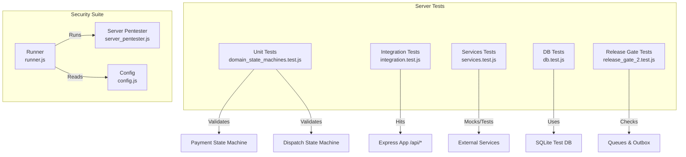
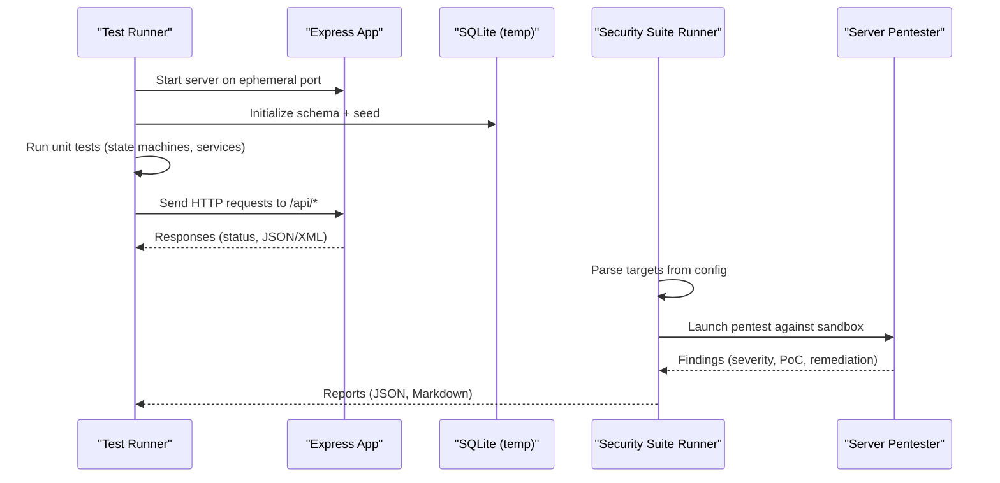
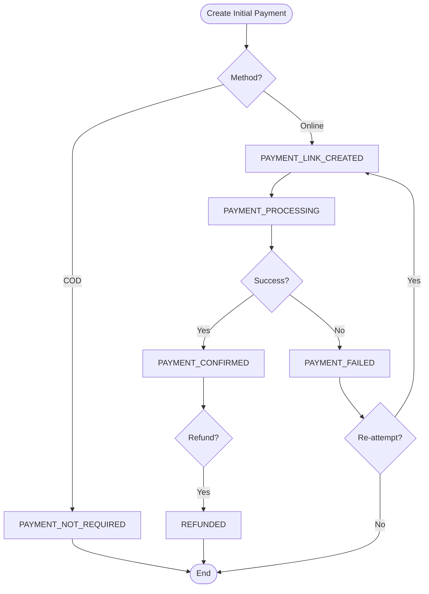
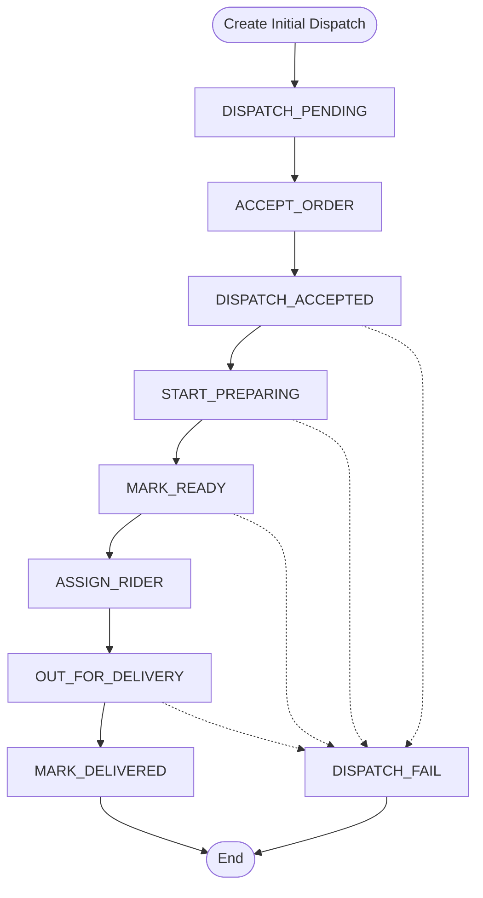
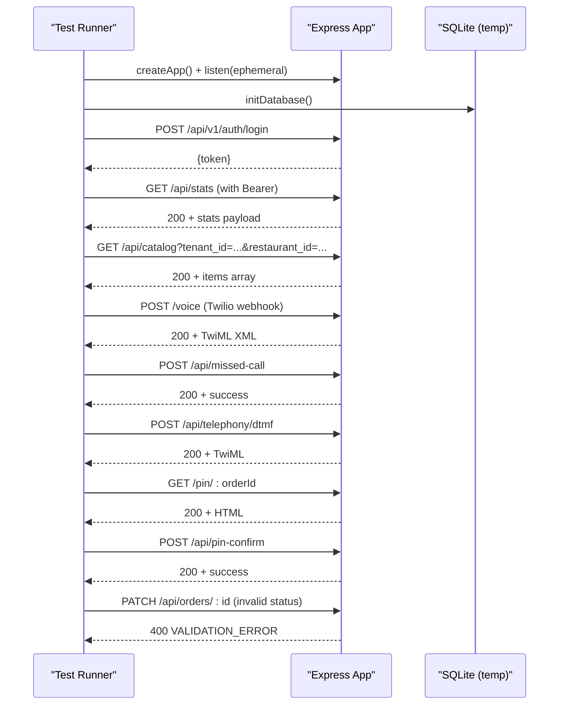
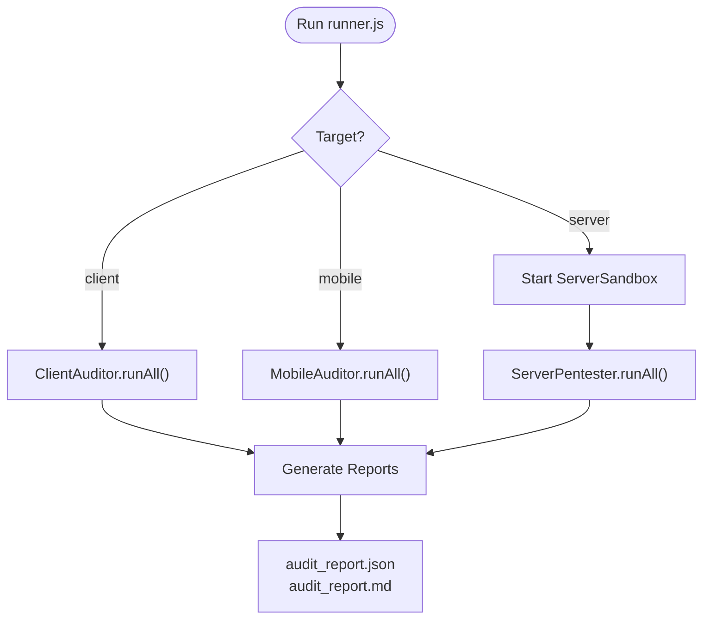
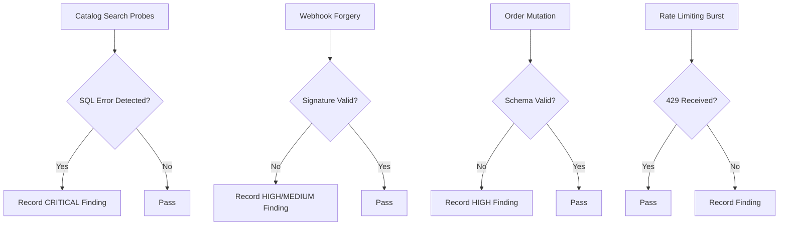
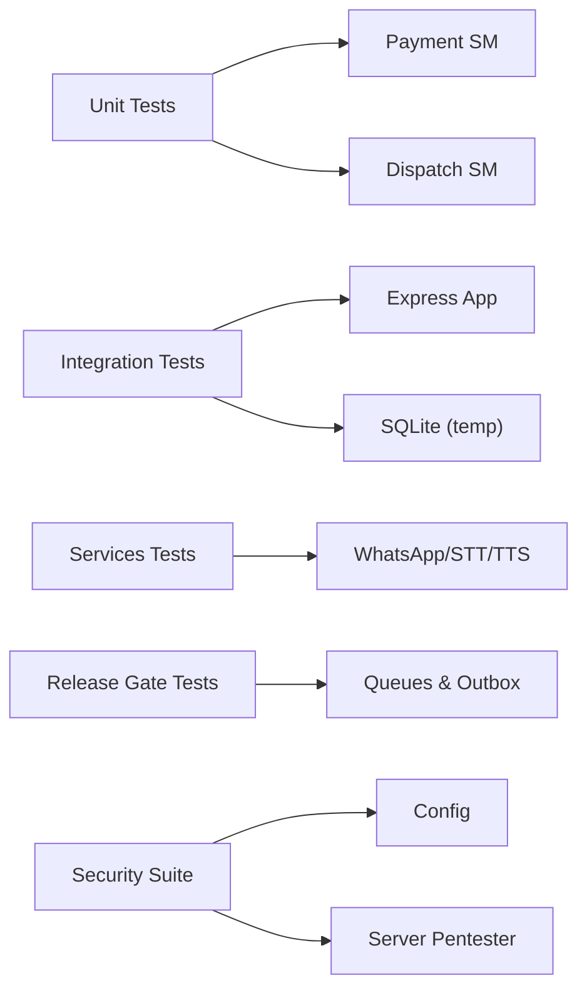

# Testing & Quality Assurance

<cite>
**Referenced Files in This Document**
- [domain_state_machines.test.js](file://server/tests/domain_state_machines.test.js)
- [integration.test.js](file://server/tests/integration.test.js)
- [security_and_auth.test.js](file://server/tests/security_and_auth.test.js)
- [services.test.js](file://server/tests/services.test.js)
- [db.test.js](file://server/tests/db.test.js)
- [release_gate_2.test.js](file://server/tests/release_gate_2.test.js)
- [paymentStateMachine.js](file://server/src/domain/payments/paymentStateMachine.js)
- [dispatchStateMachine.js](file://server/src/domain/dispatch/dispatchStateMachine.js)
- [runner.js](file://security-suite/runner.js)
- [README.md](file://security-suite/README.md)
- [config.js](file://security-suite/config.js)
- [server_pentester.js](file://security-suite/analyzers/server_pentester.js)
- [package.json](file://server/package.json)
</cite>

## Table of Contents
1. [Introduction](#introduction)
2. [Project Structure](#project-structure)
3. [Core Components](#core-components)
4. [Architecture Overview](#architecture-overview)
5. [Detailed Component Analysis](#detailed-component-analysis)
6. [Dependency Analysis](#dependency-analysis)
7. [Performance Considerations](#performance-considerations)
8. [Troubleshooting Guide](#troubleshooting-guide)
9. [Conclusion](#conclusion)
10. [Appendices](#appendices)

## Introduction
This document provides comprehensive testing and quality assurance guidance for the Inkiro platform. It covers unit tests, integration tests, security assessments, performance testing methodologies, continuous integration practices, test data management, environment setup, and debugging techniques. The focus is on validating domain state machines (payments and dispatch), API endpoints, database operations, external service interactions, and security posture across server, client, and mobile surfaces.

## Project Structure
The testing strategy spans multiple layers:
- Unit tests validate domain logic (state machines), services, and utilities.
- Integration tests exercise the HTTP API with an in-memory or temporary SQLite database and a live Express server instance.
- Security suite performs automated vulnerability scanning and penetration testing against sandboxed server instances and static code analysis for client/mobile.
- Release gate tests verify critical cross-cutting features like queues, outbox pattern, WebSocket tickets, token rotation, and storage persistence.

**Diagram sources**
- [domain_state_machines.test.js:1-116](file://server/tests/domain_state_machines.test.js#L1-L116)
- [integration.test.js:1-162](file://server/tests/integration.test.js#L1-L162)
- [services.test.js:1-74](file://server/tests/services.test.js#L1-L74)
- [db.test.js:1-104](file://server/tests/db.test.js#L1-L104)
- [release_gate_2.test.js:1-152](file://server/tests/release_gate_2.test.js#L1-L152)
- [runner.js:1-206](file://security-suite/runner.js#L1-L206)
- [server_pentester.js:141-229](file://security-suite/analyzers/server_pentester.js#L141-L229)
- [config.js:1-33](file://security-suite/config.js#L1-L33)

**Section sources**
- [package.json:7-11](file://server/package.json#L7-L11)
- [runner.js:1-206](file://security-suite/runner.js#L1-L206)

## Core Components
- Domain State Machines: Payment and Dispatch lifecycles are strictly enforced via transition functions and allowed-action checks. Tests assert legal transitions and reject illegal ones.
- Integration Layer: A temporary Express server is started per test run; endpoints are exercised with real HTTP requests and assertions on status codes and response shapes.
- Security Suite: Orchestrates static audits for client/mobile and dynamic pentesting against a sandboxed server, producing structured reports.
- Database Layer: Tests initialize a fresh SQLite database per run, seed data, and assert CRUD operations, transactions, and persistence behaviors.
- Queues and Outbox: Tests ensure jobs execute, events are claimed atomically, and completed statuses persist.

**Section sources**
- [domain_state_machines.test.js:20-94](file://server/tests/domain_state_machines.test.js#L20-L94)
- [integration.test.js:29-162](file://server/tests/integration.test.js#L29-L162)
- [security-suite/README.md:1-83](file://security-suite/README.md#L1-L83)
- [db.test.js:13-104](file://server/tests/db.test.js#L13-L104)
- [release_gate_2.test.js:24-152](file://server/tests/release_gate_2.test.js#L24-L152)

## Architecture Overview
The testing architecture combines isolated unit tests with live integration tests and an autonomous security suite.

**Diagram sources**
- [integration.test.js:29-56](file://server/tests/integration.test.js#L29-L56)
- [runner.js:27-81](file://security-suite/runner.js#L27-L81)
- [config.js:6-33](file://security-suite/config.js#L6-L33)

## Detailed Component Analysis

### Domain State Machines: Payments
The payment state machine enforces strict lifecycle transitions for online payments and COD flows. Tests cover link creation, initiation, success, failure, expiration, and refund handling, plus rejection of illegal transitions.

**Diagram sources**
- [paymentStateMachine.js:9-28](file://server/src/domain/payments/paymentStateMachine.js#L9-L28)
- [paymentStateMachine.js:30-150](file://server/src/domain/payments/paymentStateMachine.js#L30-L150)
- [domain_state_machines.test.js:20-59](file://server/tests/domain_state_machines.test.js#L20-L59)

**Section sources**
- [paymentStateMachine.js:50-84](file://server/src/domain/payments/paymentStateMachine.js#L50-L84)
- [domain_state_machines.test.js:20-59](file://server/tests/domain_state_machines.test.js#L20-L59)

### Domain State Machines: Dispatch
The dispatch state machine models kitchen preparation and delivery logistics. Tests assert the full lifecycle from acceptance through delivery and enforce cancellation/failure paths.

**Diagram sources**
- [dispatchStateMachine.js:9-28](file://server/src/domain/dispatch/dispatchStateMachine.js#L9-L28)
- [dispatchStateMachine.js:30-147](file://server/src/domain/dispatch/dispatchStateMachine.js#L30-L147)
- [domain_state_machines.test.js:61-94](file://server/tests/domain_state_machines.test.js#L61-L94)

**Section sources**
- [dispatchStateMachine.js:49-80](file://server/src/domain/dispatch/dispatchStateMachine.js#L49-L80)
- [domain_state_machines.test.js:61-94](file://server/tests/domain_state_machines.test.js#L61-L94)

### Integration Tests: API Endpoints
Integration tests spin up a temporary Express app, initialize a dedicated SQLite database, authenticate, and exercise endpoints including stats, catalog, telephony webhooks, missed-call webhook, DTMF handler, pin drop page, location confirmation, and validation enforcement.

**Diagram sources**
- [integration.test.js:29-162](file://server/tests/integration.test.js#L29-L162)

**Section sources**
- [integration.test.js:58-162](file://server/tests/integration.test.js#L58-L162)

### Security Assessments: Suite Usage
The security suite orchestrates:
- Static audits for client and mobile codebases (secrets, XSS sinks, insecure storage).
- Dynamic pentesting against a sandboxed server (webhook forgery, parameter manipulation, IDOR, SQLi, JWT tampering, rate limiting, WebSocket floods).
- Optional Strix AI-driven multi-agent penetration testing.
Reports are generated in both Markdown and JSON formats for CI consumption.

**Diagram sources**
- [runner.js:27-81](file://security-suite/runner.js#L27-L81)
- [config.js:6-33](file://security-suite/config.js#L6-L33)
- [README.md:1-83](file://security-suite/README.md#L1-L83)

**Section sources**
- [README.md:9-83](file://security-suite/README.md#L9-L83)
- [runner.js:98-181](file://security-suite/runner.js#L98-L181)

### Security Suite: Server Pentesting Details
Key checks include:
- SQL injection probing on catalog search endpoints.
- Webhook signature verification (e.g., Twilio).
- Business logic validation on order mutations.
- Rate limiting and DoS resistance by sending bursts of login attempts.

**Diagram sources**
- [server_pentester.js:141-229](file://security-suite/analyzers/server_pentester.js#L141-L229)

**Section sources**
- [server_pentester.js:141-229](file://security-suite/analyzers/server_pentester.js#L141-L229)

### Services and Utilities Tests
Service-level tests validate WhatsApp message generation, missed-call callbacks, DTMF IVR handling, STT transcription of audio buffers, and TTS synthesis with duration calculation. These ensure integrations behave correctly under mocked conditions.

**Section sources**
- [services.test.js:6-74](file://server/tests/services.test.js#L6-L74)

### Database Layer Tests
Database tests confirm table initialization and seeding, customer profile management, address persistence, last-order lookup, and call recording storage. They also demonstrate transaction rollback behavior when errors occur mid-transaction.

**Section sources**
- [db.test.js:23-104](file://server/tests/db.test.js#L23-L104)
- [security_and_auth.test.js:90-112](file://server/tests/security_and_auth.test.js#L90-L112)

### Authentication and Token Security
Security tests validate password hashing with unique salts, JWT issuance and verification using JOSE, rejection of tampered tokens, user authentication against the database, and atomic transaction rollback behavior.

**Section sources**
- [security_and_auth.test.js:20-88](file://server/tests/security_and_auth.test.js#L20-L88)
- [security_and_auth.test.js:90-112](file://server/tests/security_and_auth.test.js#L90-L112)

### Release Gate Tests: Cross-Cutting Features
Release gate tests verify:
- Queue processors execution and idempotency.
- Atomic outbox event claiming and stale event recovery.
- Single-use WebSocket tickets with short expiry.
- Short-lived access tokens and refresh token rotation with revocation guarantees.
- Centralized order state machine enforcement preventing illegal transitions.
- Non-blocking object storage persistence for audio files.

**Section sources**
- [release_gate_2.test.js:24-152](file://server/tests/release_gate_2.test.js#L24-L152)

## Dependency Analysis
Testing dependencies and relationships:
- Unit tests depend on domain modules (state machines) and services.
- Integration tests depend on the application entry point and database initialization.
- Security suite depends on configuration and analyzers; it spawns subprocesses for Strix if requested.
- All tests use isolated SQLite databases to avoid cross-test interference.

**Diagram sources**
- [domain_state_machines.test.js:1-116](file://server/tests/domain_state_machines.test.js#L1-L116)
- [integration.test.js:1-162](file://server/tests/integration.test.js#L1-L162)
- [services.test.js:1-74](file://server/tests/services.test.js#L1-L74)
- [release_gate_2.test.js:1-152](file://server/tests/release_gate_2.test.js#L1-L152)
- [runner.js:1-206](file://security-suite/runner.js#L1-L206)
- [config.js:1-33](file://security-suite/config.js#L1-L33)

**Section sources**
- [package.json:7-11](file://server/package.json#L7-L11)
- [runner.js:1-206](file://security-suite/runner.js#L1-L206)

## Performance Considerations
While explicit load/stress test scripts are not present in this repository, the following strategies are recommended based on existing components:
- Use the Express app and integration test patterns to simulate concurrent requests against endpoints like /api/auth/login and /api/catalog.
- Leverage queue workers to measure throughput and latency under load.
- Monitor SLO metrics exposed by the SLO tracker to assess API availability, voice turn latency, and error rates.
- For stress testing, consider integrating tools like k6 or Artillery to generate sustained traffic and capture response times and error rates.

[No sources needed since this section provides general guidance]

## Troubleshooting Guide
Common issues and debugging techniques:
- Temporary SQLite files: Each test creates a unique DB file; ensure cleanup occurs in after hooks to prevent leftover artifacts.
- Port conflicts: Integration tests bind to an ephemeral port; failures often indicate port binding issues or lingering processes.
- Authentication: Ensure login endpoint returns expected token shape; debug by logging responses when auth fails.
- Validation errors: Invalid payloads should return 400 with specific error codes; inspect request bodies and Zod schemas.
- Security suite: If Strix is unavailable, the suite falls back to native pentesting; check logs for Python invocation errors.

**Section sources**
- [integration.test.js:29-56](file://server/tests/integration.test.js#L29-L56)
- [integration.test.js:147-162](file://server/tests/integration.test.js#L147-L162)
- [runner.js:83-96](file://security-suite/runner.js#L83-L96)

## Conclusion
The Inkiro platform employs a robust, layered testing strategy that validates domain state machines, integrates live API endpoints, secures the system via automated pentesting, and ensures reliability through release gate checks. By combining unit, integration, and security tests with isolated environments and structured reporting, the platform maintains high quality and resilience across server, client, and mobile surfaces.

[No sources needed since this section summarizes without analyzing specific files]

## Appendices

### Running Tests
- Server unit and integration tests:
  - Execute all tests via the npm script defined in the server package.
- Security suite:
  - Run full audit across server, client, and mobile.
  - Target specific subsystems or enable loop mode for continuous feedback.

**Section sources**
- [package.json:7-11](file://server/package.json#L7-L11)
- [README.md:9-37](file://security-suite/README.md#L9-L37)

### Environment Setup
- Database isolation:
  - Set DB_PATH environment variable to a temporary file path before initializing the database in tests.
- Security suite configuration:
  - Configure sandbox host/port and report directory via config.
  - Provide LLM keys for Strix integration if desired.

**Section sources**
- [integration.test.js:29-45](file://server/tests/integration.test.js#L29-L45)
- [db.test.js:13-17](file://server/tests/db.test.js#L13-L17)
- [config.js:6-33](file://security-suite/config.js#L6-L33)