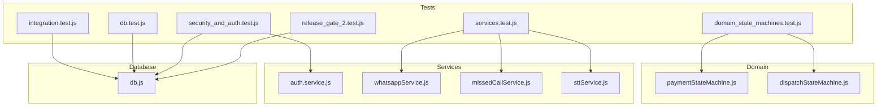
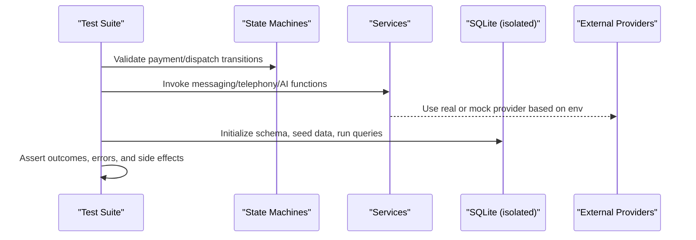
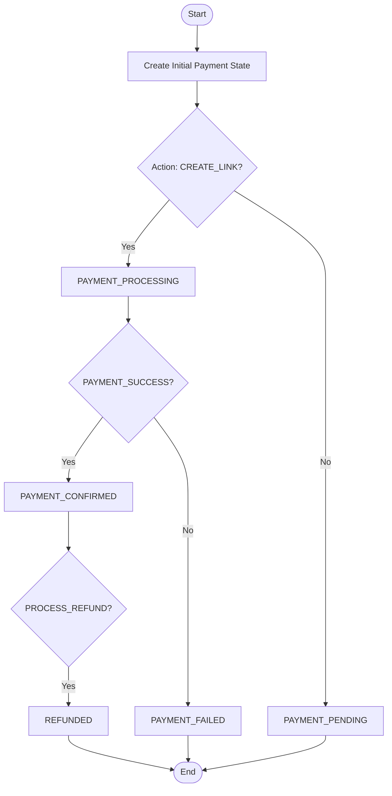
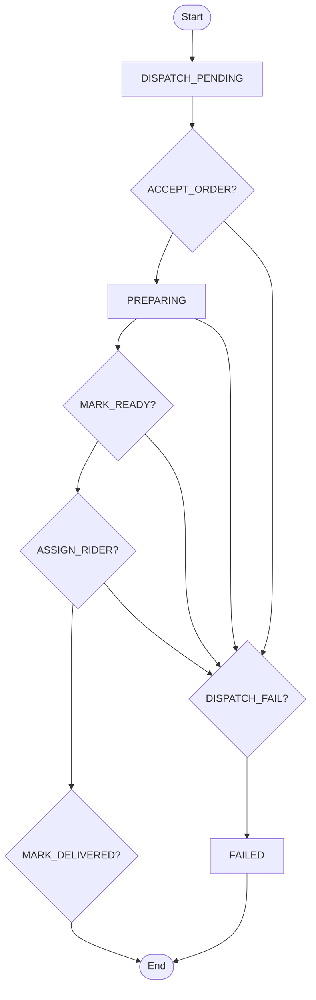
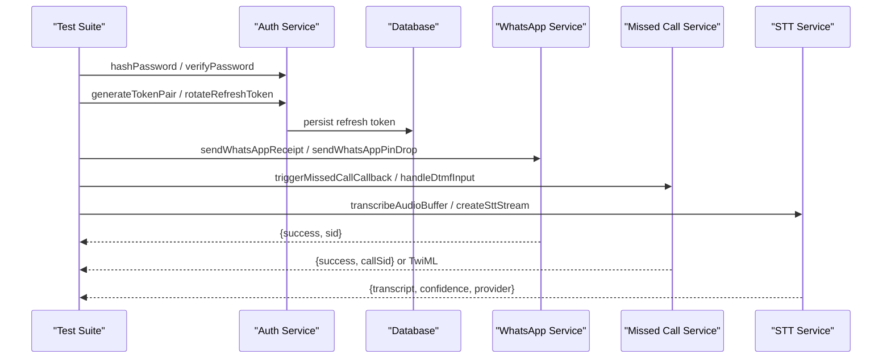
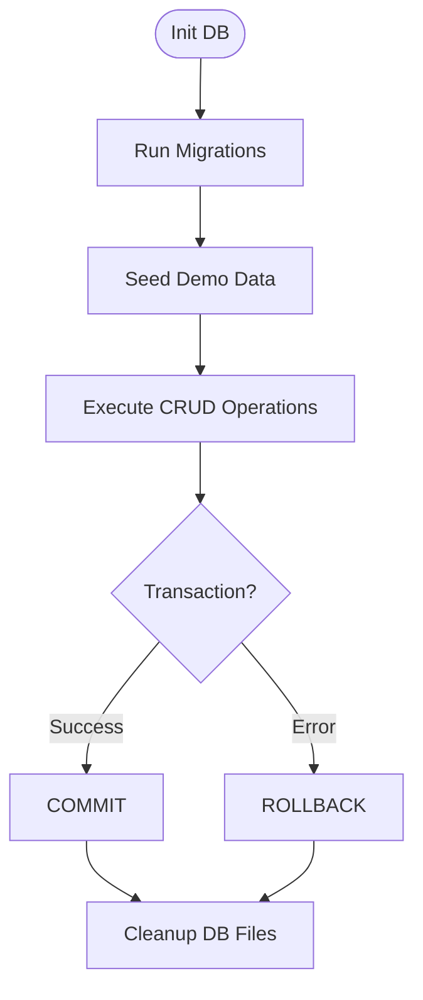
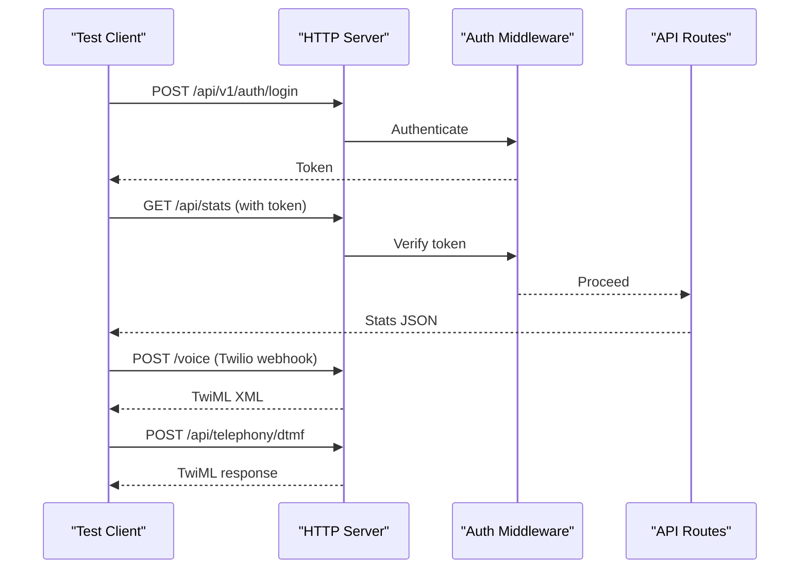
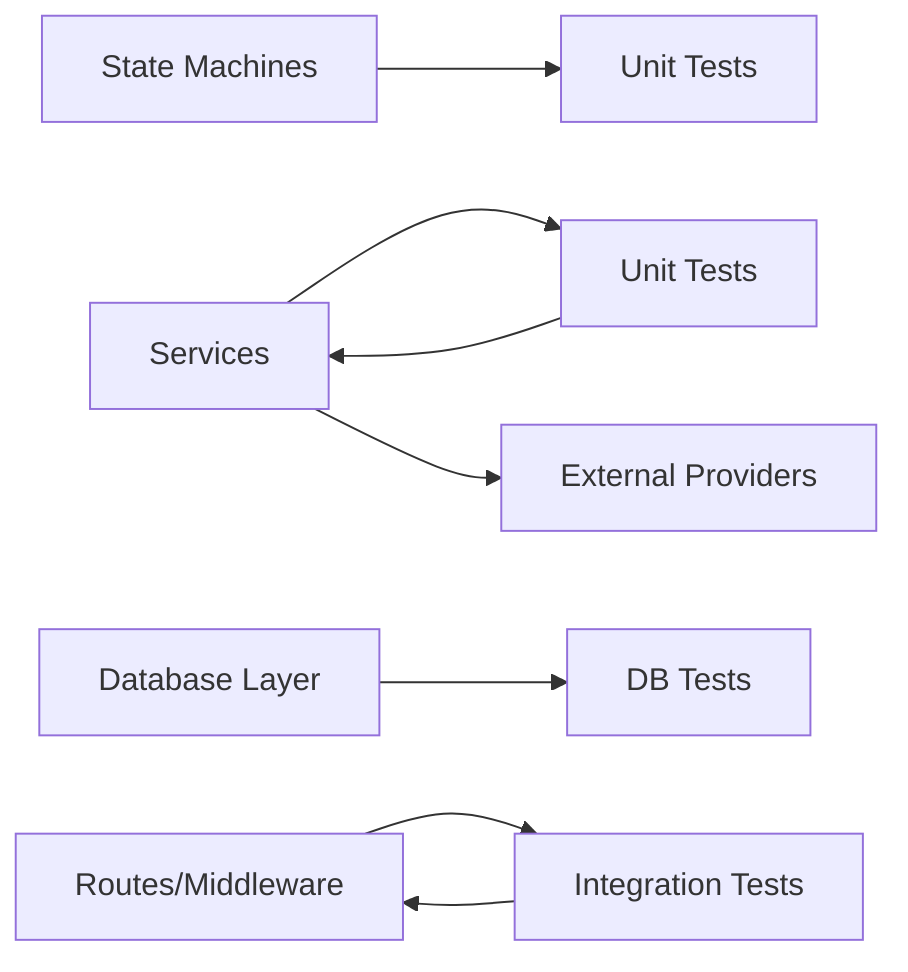

# Unit Testing

<cite>
**Referenced Files in This Document**
- [domain_state_machines.test.js](file://server/tests/domain_state_machines.test.js)
- [services.test.js](file://server/tests/services.test.js)
- [integration.test.js](file://server/tests/integration.test.js)
- [db.test.js](file://server/tests/db.test.js)
- [security_and_auth.test.js](file://server/tests/security_and_auth.test.js)
- [release_gate_2.test.js](file://server/tests/release_gate_2.test.js)
- [paymentStateMachine.js](file://server/src/domain/payments/paymentStateMachine.js)
- [dispatchStateMachine.js](file://server/src/domain/dispatch/dispatchStateMachine.js)
- [auth.service.js](file://server/src/services/auth.service.js)
- [whatsappService.js](file://server/src/services/whatsappService.js)
- [missedCallService.js](file://server/src/services/missedCallService.js)
- [sttService.js](file://server/src/services/sttService.js)
- [db.js](file://server/src/db.js)
</cite>

## Table of Contents
1. Introduction
2. Project Structure
3. Core Components
4. Architecture Overview
5. Detailed Component Analysis
6. Dependency Analysis
7. Performance Considerations
8. Troubleshooting Guide
9. Conclusion

## Introduction
This document provides comprehensive unit testing guidance for the Inkiro platform with a focus on:
- Domain state machines for order lifecycle, payment processing states, and dispatch workflows
- Service layer testing for catalog management, authentication services, and AI processing components
- Database testing methodologies including schema validation, query testing, and transaction handling
- Mocking strategies for external dependencies such as telephony providers and AI services
- Test data setup, assertion patterns, and code coverage requirements
- Examples of testing business logic, error handling, and edge cases specific to voice commerce

The goal is to help engineers write reliable tests that validate correctness, resilience, and security across the platform’s core flows.

## Project Structure
Testing is organized under server/tests with clear separation between domain state machine tests, service tests, integration tests, database tests, and security/authentication tests. The backend uses Node’s built-in test runner and strict assertions. Tests initialize isolated SQLite databases per suite and clean up after execution.

**Diagram sources**
- [domain_state_machines.test.js:1-116](file://server/tests/domain_state_machines.test.js#L1-L116)
- [services.test.js:1-74](file://server/tests/services.test.js#L1-L74)
- [integration.test.js:1-162](file://server/tests/integration.test.js#L1-L162)
- [db.test.js:1-104](file://server/tests/db.test.js#L1-L104)
- [security_and_auth.test.js:1-112](file://server/tests/security_and_auth.test.js#L1-L112)
- [release_gate_2.test.js:1-152](file://server/tests/release_gate_2.test.js#L1-L152)
- [paymentStateMachine.js:1-150](file://server/src/domain/payments/paymentStateMachine.js#L1-L150)
- [dispatchStateMachine.js:1-147](file://server/src/domain/dispatch/dispatchStateMachine.js#L1-L147)
- [auth.service.js:1-203](file://server/src/services/auth.service.js#L1-L203)
- [whatsappService.js:1-114](file://server/src/services/whatsappService.js#L1-L114)
- [missedCallService.js:1-106](file://server/src/services/missedCallService.js#L1-L106)
- [sttService.js:1-603](file://server/src/services/sttService.js#L1-L603)
- [db.js:1-200](file://server/src/db.js#L1-L200)

**Section sources**
- [domain_state_machines.test.js:1-116](file://server/tests/domain_state_machines.test.js#L1-L116)
- [services.test.js:1-74](file://server/tests/services.test.js#L1-L74)
- [integration.test.js:1-162](file://server/tests/integration.test.js#L1-L162)
- [db.test.js:1-104](file://server/tests/db.test.js#L1-L104)
- [security_and_auth.test.js:1-112](file://server/tests/security_and_auth.test.js#L1-L112)
- [release_gate_2.test.js:1-152](file://server/tests/release_gate_2.test.js#L1-L152)

## Core Components
This section outlines the primary testing targets and their responsibilities:

- Payment State Machine: Validates transitions from pending to link creation, processing, confirmation, failure, expiration, and refund paths; ensures illegal transitions are rejected.
- Dispatch State Machine: Validates full kitchen and rider lifecycle including acceptance, preparation, readiness, assignment, delivery, failure, and cancellation.
- Authentication Services: Validates password hashing, JWT issuance and verification, refresh token rotation, and user authentication against the database.
- WhatsApp Service: Validates receipt and pin-drop message generation and mock provider behavior.
- Missed Call & DTMF: Validates callback triggering and IVR digit handling with TwiML generation.
- STT/TTS Services: Validates audio transcription and synthesis with provider selection and fallbacks.
- Database Layer: Validates schema initialization, seeding, CRUD operations, transactions, and persistence of call recordings.

**Section sources**
- [paymentStateMachine.js:1-150](file://server/src/domain/payments/paymentStateMachine.js#L1-L150)
- [dispatchStateMachine.js:1-147](file://server/src/domain/dispatch/dispatchStateMachine.js#L1-L147)
- [auth.service.js:1-203](file://server/src/services/auth.service.js#L1-L203)
- [whatsappService.js:1-114](file://server/src/services/whatsappService.js#L1-L114)
- [missedCallService.js:1-106](file://server/src/services/missedCallService.js#L1-L106)
- [sttService.js:1-603](file://server/src/services/sttService.js#L1-L603)
- [db.js:1-200](file://server/src/db.js#L1-L200)

## Architecture Overview
The testing architecture mirrors production concerns:
- Domain state machines enforce legal transitions for payments and dispatch.
- Services encapsulate external integrations (WhatsApp, telephony, AI) with mock fallbacks for development.
- Integration tests spin up an HTTP server with an isolated SQLite database to exercise routes and middleware.
- Security tests validate cryptographic primitives and token lifecycles.
- Database tests ensure schema integrity, seed data, and transactional guarantees.

[No sources needed since this diagram shows conceptual workflow, not actual code structure]

## Detailed Component Analysis

### Domain State Machines: Order Lifecycle, Payments, and Dispatch
Testing strategy:
- Create initial states using factory functions and assert starting statuses.
- Apply actions via transition functions and assert success/failure and resulting states.
- Verify history entries capture timestamps, actions, and payload summaries.
- Ensure illegal transitions return structured errors and do not mutate state.

Payment flow highlights:
- COD path initializes as not required; online payments start pending and progress through link creation, processing, and confirmation.
- Refund transitions only allowed from confirmed state; attempts from other states are rejected.

Dispatch flow highlights:
- Full lifecycle: pending -> accepted -> preparing -> ready -> out_for_delivery -> delivered.
- Failure and cancellation paths are validated; final states prevent further transitions.

**Diagram sources**
- [paymentStateMachine.js:30-149](file://server/src/domain/payments/paymentStateMachine.js#L30-L149)

**Diagram sources**
- [dispatchStateMachine.js:30-146](file://server/src/domain/dispatch/dispatchStateMachine.js#L30-L146)

**Section sources**
- [domain_state_machines.test.js:20-94](file://server/tests/domain_state_machines.test.js#L20-L94)
- [paymentStateMachine.js:50-149](file://server/src/domain/payments/paymentStateMachine.js#L50-L149)
- [dispatchStateMachine.js:49-146](file://server/src/domain/dispatch/dispatchStateMachine.js#L49-L146)

### Service Layer Testing: Catalog Management, Authentication, and AI Processing
Authentication services:
- Password hashing uses PBKDF2 with unique salts; verifyPassword enforces format and timing-safe comparison.
- JWT issuance includes issuer, audience, tenant context, and short expiration; verification validates claims and rejects tampered tokens.
- Refresh token rotation persists JTI and revokes old tokens; tests assert single-use semantics and error conditions.

WhatsApp and telephony services:
- Message composition for receipts and pin-drop requests is validated; mock provider returns success with identifiers when credentials are absent.
- Missed-call callback triggers outbound calls or mocks; DTMF handling generates appropriate TwiML responses.

AI processing (STT/TTS):
- STT supports multiple providers (Groq, Google, local Whisper, mock); tests assert transcript presence, confidence, and provider metadata.
- TTS synthesizes audio buffers and computes duration; caching improves performance for repeated prompts.

**Diagram sources**
- [auth.service.js:23-203](file://server/src/services/auth.service.js#L23-L203)
- [whatsappService.js:24-114](file://server/src/services/whatsappService.js#L24-L114)
- [missedCallService.js:21-106](file://server/src/services/missedCallService.js#L21-L106)
- [sttService.js:83-603](file://server/src/services/sttService.js#L83-L603)

**Section sources**
- [security_and_auth.test.js:20-112](file://server/tests/security_and_auth.test.js#L20-L112)
- [services.test.js:6-74](file://server/tests/services.test.js#L6-L74)
- [auth.service.js:23-203](file://server/src/services/auth.service.js#L23-L203)
- [whatsappService.js:24-114](file://server/src/services/whatsappService.js#L24-L114)
- [missedCallService.js:21-106](file://server/src/services/missedCallService.js#L21-L106)
- [sttService.js:83-603](file://server/src/services/sttService.js#L83-L603)

### Database Testing: Schema Validation, Query Testing, and Transaction Handling
Testing strategy:
- Isolate each test suite with a dedicated SQLite file; initialize migrations and seed data before tests.
- Validate seeded entities (restaurants, catalog items) and relationships.
- Exercise customer profile upserts, address saving, last order lookup, and call recording persistence.
- Assert atomic transaction rollback on failures; ensure counts remain unchanged after rollbacks.

**Diagram sources**
- [db.js:11-44](file://server/src/db.js#L11-L44)
- [db.test.js:13-21](file://server/tests/db.test.js#L13-L21)
- [security_and_auth.test.js:90-112](file://server/tests/security_and_auth.test.js#L90-L112)

**Section sources**
- [db.test.js:23-104](file://server/tests/db.test.js#L23-L104)
- [security_and_auth.test.js:90-112](file://server/tests/security_and_auth.test.js#L90-L112)
- [db.js:57-120](file://server/src/db.js#L57-L120)

### Integration Testing: End-to-End Flows and Middleware
Integration tests:
- Spin up an HTTP server bound to a random port and authenticate via login endpoint.
- Assert protected endpoints require valid tokens and return proper status codes.
- Validate public endpoints like catalog retrieval and voice webhooks returning correct content types and payloads.
- Test IVR digit handling and pin-drop location confirmation flows.

**Diagram sources**
- [integration.test.js:14-162](file://server/tests/integration.test.js#L14-L162)

**Section sources**
- [integration.test.js:29-162](file://server/tests/integration.test.js#L29-L162)

### Release Gate Tests: Queues, Outbox, WebSocket Tickets, and Storage
Release gate tests validate:
- Queue processor execution and idempotency for custom jobs.
- Atomic outbox claiming with worker isolation and stale event recovery.
- Single-use WebSocket tickets with expiration and replay protection.
- Short-lived access tokens and refresh token rotation with revocation guarantees.
- Centralized state machine enforcement on order transitions.
- Non-blocking object storage persistence for audio artifacts.

**Section sources**
- [release_gate_2.test.js:24-152](file://server/tests/release_gate_2.test.js#L24-L152)

## Dependency Analysis
Key dependencies and coupling:
- Domain state machines are pure functions with no external I/O; they are easy to test in isolation.
- Services depend on environment configuration to select providers; tests rely on mock fallbacks when credentials are absent.
- Database layer centralizes connection, migrations, and transactions; tests use isolated files to avoid cross-test interference.
- Integration tests depend on route definitions and middleware; they assert HTTP-level contracts.

**Diagram sources**
- [domain_state_machines.test.js:1-116](file://server/tests/domain_state_machines.test.js#L1-L116)
- [services.test.js:1-74](file://server/tests/services.test.js#L1-L74)
- [db.test.js:1-104](file://server/tests/db.test.js#L1-L104)
- [integration.test.js:1-162](file://server/tests/integration.test.js#L1-L162)

**Section sources**
- [domain_state_machines.test.js:1-116](file://server/tests/domain_state_machines.test.js#L1-L116)
- [services.test.js:1-74](file://server/tests/services.test.js#L1-L74)
- [db.test.js:1-104](file://server/tests/db.test.js#L1-L104)
- [integration.test.js:1-162](file://server/tests/integration.test.js#L1-L162)

## Performance Considerations
- STT/TTS services include caching for repeated prompts to reduce latency and provider costs.
- Local Whisper pipeline loading is guarded by flags to avoid blocking startup; tests should account for asynchronous model loading if used.
- Database queries log slow queries above a threshold; tests can leverage this to detect regressions.
- Queue processors and outbox events enable non-blocking side effects; tests should wait briefly for async processing or use deterministic fixtures.

[No sources needed since this section provides general guidance]

## Troubleshooting Guide
Common issues and resolutions:
- Missing environment variables for external providers cause fallback to mock behavior; ensure expected behavior in tests aligns with configured provider.
- JWT verification failures indicate malformed or tampered tokens; tests assert rejection patterns and error messages.
- Database initialization errors may arise from migration failures; isolate test databases and clean up after suites.
- Illegal state transitions produce explicit errors; tests should assert both success and failure paths.

**Section sources**
- [security_and_auth.test.js:58-88](file://server/tests/security_and_auth.test.js#L58-L88)
- [domain_state_machines.test.js:53-59](file://server/tests/domain_state_machines.test.js#L53-L59)
- [db.test.js:13-21](file://server/tests/db.test.js#L13-L21)

## Conclusion
The Inkiro platform employs a robust testing strategy that covers domain state machines, service layers, database integrity, and integration flows. Tests emphasize:
- Deterministic state transitions with explicit error handling
- Provider abstraction with mock fallbacks for development and CI
- Isolated database environments with migrations and seeds
- Security validations for authentication and token lifecycles
- End-to-end HTTP contract assertions for telephony and dashboard APIs

Adopt these patterns to maintain reliability as the platform evolves, ensuring that business logic, external integrations, and data consistency remain correct under change.