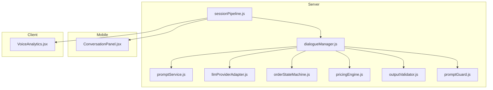
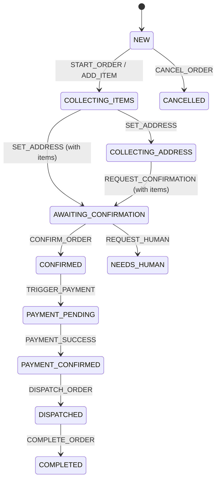
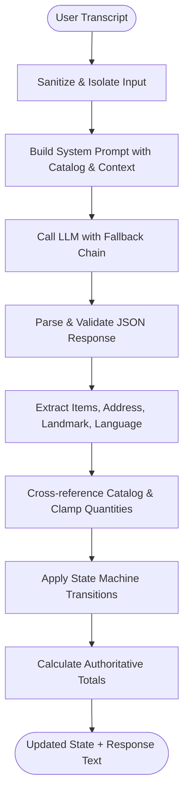
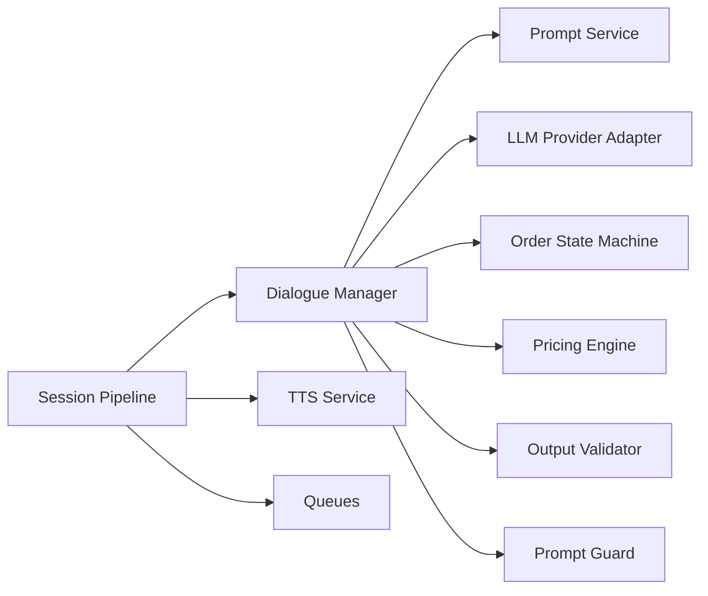

# Dialogue Management System

<cite>
**Referenced Files in This Document**
- [dialogueManager.js](file://server/src/services/dialogueManager.js)
- [promptService.js](file://server/src/services/promptService.js)
- [orderStateMachine.js](file://server/src/domain/orders/orderStateMachine.js)
- [pricingEngine.js](file://server/src/domain/orders/pricingEngine.js)
- [llmProviderAdapter.js](file://server/src/services/llmProviderAdapter.js)
- [outputValidator.js](file://server/src/services/dialogue/outputValidator.js)
- [promptGuard.js](file://server/src/services/dialogue/promptGuard.js)
- [sessionPipeline.js](file://server/src/websocket/sessionPipeline.js)
- [ConversationPanel.jsx](file://mobile/src/components/conversation/ConversationPanel.jsx)
- [VoiceAnalytics.jsx](file://client/src/components/VoiceAnalytics.jsx)
- [dialogue.test.js](file://server/tests/dialogue.test.js)
</cite>

## Table of Contents
1. Introduction
2. Project Structure
3. Core Components
4. Architecture Overview
5. Detailed Component Analysis
6. Dependency Analysis
7. Performance Considerations
8. Troubleshooting Guide
9. Conclusion
10. Appendices

## Introduction
This document explains the dialogue management system that maintains conversation context and handles multi-turn interactions for food ordering. It covers:
- State machine implementation for conversation flow
- Intent recognition patterns and entity extraction from user inputs
- Prompt engineering strategies to guide conversations toward order completion
- Handling interruptions, clarifications, and timeouts
- Multilingual conversation support (Tamil, English, mixed)
- Dialogue templates for common ordering patterns
- Error recovery mechanisms
- Conversation analytics, quality metrics tracking, and debugging tools

## Project Structure
The dialogue system spans server-side orchestration, domain state machines, LLM integration, prompt management, and client-facing conversation UI and analytics.



**Diagram sources**
- [sessionPipeline.js:24-127](file://server/src/websocket/sessionPipeline.js#L24-L127)
- [dialogueManager.js:36-84](file://server/src/services/dialogueManager.js#L36-L84)
- [promptService.js:8-115](file://server/src/services/promptService.js#L8-L115)
- [llmProviderAdapter.js:226-262](file://server/src/services/llmProviderAdapter.js#L226-L262)
- [orderStateMachine.js:8-41](file://server/src/domain/orders/orderStateMachine.js#L8-L41)
- [pricingEngine.js:16-71](file://server/src/domain/orders/pricingEngine.js#L16-L71)
- [outputValidator.js:37-80](file://server/src/services/dialogue/outputValidator.js#L37-L80)
- [promptGuard.js:21-43](file://server/src/services/dialogue/promptGuard.js#L21-L43)
- [ConversationPanel.jsx:7-50](file://mobile/src/components/conversation/ConversationPanel.jsx#L7-L50)
- [VoiceAnalytics.jsx:5-78](file://client/src/components/VoiceAnalytics.jsx#L5-L78)

**Section sources**
- [sessionPipeline.js:24-127](file://server/src/websocket/sessionPipeline.js#L24-L127)
- [dialogueManager.js:36-84](file://server/src/services/dialogueManager.js#L36-L84)

## Core Components
- Session pipeline: Initializes voice sessions, streams transcripts, processes turns, persists state, and triggers order fulfillment.
- Dialogue manager: Orchestrates a turn by building prompts, calling LLMs with fallbacks, reconciling outputs with the authoritative state machine and pricing engine, and providing rule-based fallback behavior.
- Prompt service: Versioned system prompts with caller context, menu, and strict JSON output contracts.
- LLM provider adapter: Multi-provider routing with auto-fallback, response parsing, and schema validation.
- Order state machine: Authoritative lifecycle transitions and action enforcement.
- Pricing engine: Deterministic catalog matching and authoritative totals calculation.
- Output validator: Sanitizes and validates LLM decisions against business rules and catalog.
- Prompt guard: Protects pipelines from injection and limits input size.
- Mobile conversation panel: Displays transcript and live listening indicators.
- Voice analytics: Observability dashboard for latency percentiles, queue health, and audit logs.

**Section sources**
- [sessionPipeline.js:132-219](file://server/src/websocket/sessionPipeline.js#L132-L219)
- [dialogueManager.js:36-132](file://server/src/services/dialogueManager.js#L36-L132)
- [promptService.js:14-115](file://server/src/services/promptService.js#L14-L115)
- [llmProviderAdapter.js:163-215](file://server/src/services/llmProviderAdapter.js#L163-L215)
- [orderStateMachine.js:73-148](file://server/src/domain/orders/orderStateMachine.js#L73-L148)
- [pricingEngine.js:50-117](file://server/src/domain/orders/pricingEngine.js#L50-L117)
- [outputValidator.js:37-80](file://server/src/services/dialogue/outputValidator.js#L37-L80)
- [promptGuard.js:21-43](file://server/src/services/dialogue/promptGuard.js#L21-L43)
- [ConversationPanel.jsx:7-50](file://mobile/src/components/conversation/ConversationPanel.jsx#L7-L50)
- [VoiceAnalytics.jsx:5-78](file://client/src/components/VoiceAnalytics.jsx#L5-L78)

## Architecture Overview
End-to-end flow for a voice turn:
- STT stream emits final transcript
- Session pipeline records history, calls dialogue manager
- Dialogue manager builds system prompt with catalog and caller context
- LLM provider adapter attempts providers in configured order; parses and validates JSON
- Reconciliation applies state machine transitions and authoritative pricing
- Rule engine fallback ensures deterministic behavior if LLM fails
- TTS synthesizes audio and streams back; order confirmation triggers async dispatch and notifications

```mermaid
sequenceDiagram
participant STT as "STT Stream"
participant SP as "Session Pipeline"
participant DM as "Dialogue Manager"
participant PS as "Prompt Service"
participant LLM as "LLM Provider Adapter"
participant SM as "Order State Machine"
PE as "Pricing Engine"
participant TTS as "TTS Service"
STT->>SP : Final transcript
SP->>DM : processDialogueTurn(transcript, state, history, phone)
DM->>PS : build(systemPrompt, callerContext)
DM->>LLM : callLlm(systemPrompt, messages)
LLM-->>DM : {response_text, items, address, language, provider}
DM->>SM : reconcile + transitionOrder(...)
DM->>PE : calculateAuthoritativeCart(items, address)
PE-->>DM : verified totals
DM-->>SP : updated_state, response_text, language
SP->>TTS : synthesizeSpeech(response_text, language)
TTS-->>SP : audio buffer
SP-->>Client : stream media / ai_response
```

**Diagram sources**
- [sessionPipeline.js:54-73](file://server/src/websocket/sessionPipeline.js#L54-L73)
- [sessionPipeline.js:132-219](file://server/src/websocket/sessionPipeline.js#L132-L219)
- [dialogueManager.js:36-84](file://server/src/services/dialogueManager.js#L36-L84)
- [promptService.js:14-115](file://server/src/services/promptService.js#L14-L115)
- [llmProviderAdapter.js:226-262](file://server/src/services/llmProviderAdapter.js#L226-L262)
- [orderStateMachine.js:154-324](file://server/src/domain/orders/orderStateMachine.js#L154-L324)
- [pricingEngine.js:76-117](file://server/src/domain/orders/pricingEngine.js#L76-L117)

## Detailed Component Analysis

### State Machine Implementation for Conversation Flow
- States define the full lifecycle: new → collecting_items → collecting_address → validating → awaiting_confirmation → confirmed → payment_pending → payment_confirmed → dispatched → completed/cancelled/needs_human.
- Actions enforce allowed transitions per state; illegal transitions are rejected with errors.
- The dialogue manager uses the state machine authoritatively to apply changes proposed by the LLM or rule engine.



**Diagram sources**
- [orderStateMachine.js:8-41](file://server/src/domain/orders/orderStateMachine.js#L8-L41)
- [orderStateMachine.js:73-148](file://server/src/domain/orders/orderStateMachine.js#L73-L148)
- [orderStateMachine.js:154-324](file://server/src/domain/orders/orderStateMachine.js#L154-L324)

**Section sources**
- [orderStateMachine.js:73-148](file://server/src/domain/orders/orderStateMachine.js#L73-L148)
- [orderStateMachine.js:154-324](file://server/src/domain/orders/orderStateMachine.js#L154-L324)
- [dialogueManager.js:93-132](file://server/src/services/dialogueManager.js#L93-L132)

### Intent Recognition Patterns and Entity Extraction
- LLM is instructed to return structured JSON including intent-like actions, extracted items, quantities, delivery address, landmark, and detected language.
- The provider adapter enforces allowed actions and sanitizes item arrays; quantities are clamped to safe ranges.
- Output validator cross-references extracted items against the active catalog and normalizes fields.



**Diagram sources**
- [promptGuard.js:21-43](file://server/src/services/dialogue/promptGuard.js#L21-L43)
- [promptService.js:14-115](file://server/src/services/promptService.js#L14-L115)
- [llmProviderAdapter.js:163-215](file://server/src/services/llmProviderAdapter.js#L163-L215)
- [outputValidator.js:37-80](file://server/src/services/dialogue/outputValidator.js#L37-L80)
- [dialogueManager.js:93-132](file://server/src/services/dialogueManager.js#L93-L132)
- [pricingEngine.js:50-117](file://server/src/domain/orders/pricingEngine.js#L50-L117)

**Section sources**
- [llmProviderAdapter.js:163-215](file://server/src/services/llmProviderAdapter.js#L163-L215)
- [outputValidator.js:37-80](file://server/src/services/dialogue/outputValidator.js#L37-L80)
- [dialogueManager.js:93-132](file://server/src/services/dialogueManager.js#L93-L132)

### Prompt Engineering Strategies
- Versioned prompts include caller profile, saved addresses, last order, and current menu. They enforce concise human-like speech, explicit dietary safeguards, upselling guidance, and strict JSON output.
- Temperature and token limits are tuned per version to balance creativity and determinism.
- Caller context is injected to personalize responses and reduce ambiguity.

Key strategies:
- Keep responses short and natural for voice
- Explicitly request structured extraction fields
- Warn on dietary mismatches
- Upsell specials when appropriate
- Never let LLM compute prices; only extract items and quantities

**Section sources**
- [promptService.js:14-115](file://server/src/services/promptService.js#L14-L115)

### Handling Interruptions, Clarifications, and Timeouts
- Interruptions: The session pipeline serializes processing per session using an isProcessing flag to avoid concurrent turns.
- Clarifications: Rule engine responds with prompts to collect missing information (e.g., address, confirmation).
- Timeouts: LLM calls use AbortSignal timeouts; STT/TTS also have timeouts to prevent hangs. If LLM fails, the system falls back to the deterministic rule engine.

Operational notes:
- LLM requests abort after a fixed timeout
- STT/TTS operations have shorter timeouts to keep latency low
- Fallback path ensures continuity even when external services fail

**Section sources**
- [sessionPipeline.js:132-169](file://server/src/websocket/sessionPipeline.js#L132-L169)
- [llmProviderAdapter.js:96-117](file://server/src/services/llmProviderAdapter.js#L96-L117)
- [dialogueManager.js:74-84](file://server/src/services/dialogueManager.js#L74-L84)

### Multilingual Conversation Support
- Detected language is captured per turn and used for TTS synthesis.
- Prompts instruct the model to respond in Tamil, English, or mixed based on user input.
- Rule engine supports multilingual greetings and responses.

**Section sources**
- [promptService.js:39-61](file://server/src/services/promptService.js#L39-L61)
- [promptService.js:84-105](file://server/src/services/promptService.js#L84-L105)
- [dialogueManager.js:144-168](file://server/src/services/dialogueManager.js#L144-L168)
- [sessionPipeline.js:224-294](file://server/src/websocket/sessionPipeline.js#L224-L294)

### Dialogue Templates for Common Ordering Patterns
Patterns handled by the rule engine and guided by prompts:
- Greeting and start order
- Menu inquiry and recommendations
- Adding items with quantity detection
- Collecting delivery address and landmark
- Price/bill inquiries
- Confirmation and cancellation flows
- Dietary preference warnings and upsells

These patterns ensure consistent UX and predictable state transitions.

**Section sources**
- [dialogueManager.js:144-301](file://server/src/services/dialogueManager.js#L144-L301)
- [promptService.js:39-105](file://server/src/services/promptService.js#L39-L105)

### Error Recovery Mechanisms
- LLM failures trigger automatic fallback to the rule engine.
- Invalid JSON or schema violations are sanitized and normalized.
- Illegal state transitions are rejected with descriptive errors.
- TTS errors still send text-only responses to maintain conversation continuity.

**Section sources**
- [llmProviderAdapter.js:226-262](file://server/src/services/llmProviderAdapter.js#L226-L262)
- [dialogueManager.js:74-84](file://server/src/services/dialogueManager.js#L74-L84)
- [orderStateMachine.js:154-163](file://server/src/domain/orders/orderStateMachine.js#L154-L163)
- [sessionPipeline.js:282-294](file://server/src/websocket/sessionPipeline.js#L282-L294)

### Conversation Analytics, Quality Metrics, and Debugging
- Latency profiling tracks P50/P95 turn latencies and component breakdowns (STT, LLM, TTS).
- Queue health monitoring shows active, pending, and dead-letter counts for background workers.
- Audit trails log state transitions and key events for post-call analysis.
- Mobile conversation panel provides real-time transcript and live listening indicators.

**Section sources**
- [VoiceAnalytics.jsx:5-78](file://client/src/components/VoiceAnalytics.jsx#L5-L78)
- [VoiceAnalytics.jsx:80-155](file://client/src/components/VoiceAnalytics.jsx#L80-L155)
- [ConversationPanel.jsx:7-50](file://mobile/src/components/conversation/ConversationPanel.jsx#L7-L50)

## Dependency Analysis
Core dependencies and relationships:
- Session pipeline depends on dialogue manager, STT/TTS, geocoding, queues, and persistence.
- Dialogue manager depends on prompt service, LLM adapter, state machine, and pricing engine.
- LLM adapter depends on environment-configured providers and returns normalized results.
- Output validator depends on pricing engine catalog matching to verify items.
- Prompt guard protects all inbound transcripts before they reach the LLM.



**Diagram sources**
- [sessionPipeline.js:1-16](file://server/src/websocket/sessionPipeline.js#L1-L16)
- [dialogueManager.js:1-6](file://server/src/services/dialogueManager.js#L1-L6)
- [llmProviderAdapter.js:17-49](file://server/src/services/llmProviderAdapter.js#L17-L49)
- [outputValidator.js:1-3](file://server/src/services/dialogue/outputValidator.js#L1-L3)
- [promptGuard.js:1-6](file://server/src/services/dialogue/promptGuard.js#L1-L6)

**Section sources**
- [sessionPipeline.js:1-16](file://server/src/websocket/sessionPipeline.js#L1-L16)
- [dialogueManager.js:1-6](file://server/src/services/dialogueManager.js#L1-L6)

## Performance Considerations
- Use short, deterministic prompts and clamp token usage to reduce latency.
- Prefer rule engine for fast, deterministic paths; reserve LLM for complex understanding.
- Cache catalog data briefly to avoid repeated DB reads.
- Stream TTS audio in small chunks to minimize perceived latency.
- Monitor P50/P95 turn latency and component breakdowns via analytics.

[No sources needed since this section provides general guidance]

## Troubleshooting Guide
Common issues and resolutions:
- LLM provider failure: Check environment keys and fallback chain; system will fall back to rule engine automatically.
- Invalid JSON from LLM: Ensure prompts enforce strict JSON; parser strips markdown fences and validates schema.
- Missing address or items: Rule engine prompts for required fields; state machine prevents invalid confirmations.
- High latency: Inspect STT/LLM/TTS timings in analytics; consider switching providers or adjusting timeouts.
- Injection attempts: Prompt guard redacts suspicious patterns and caps input length.

**Section sources**
- [llmProviderAdapter.js:226-262](file://server/src/services/llmProviderAdapter.js#L226-L262)
- [llmProviderAdapter.js:163-215](file://server/src/services/llmProviderAdapter.js#L163-L215)
- [promptGuard.js:21-43](file://server/src/services/dialogue/promptGuard.js#L21-L43)
- [dialogueManager.js:196-234](file://server/src/services/dialogueManager.js#L196-L234)

## Conclusion
The dialogue management system combines robust stateful orchestration, deterministic business rules, and flexible LLM-powered understanding. It ensures reliable order lifecycles, multilingual support, strong security, and comprehensive observability. By separating AI suggestions from code-enforced decisions, it achieves both natural conversation and operational safety.

[No sources needed since this section summarizes without analyzing specific files]

## Appendices

### Testing Coverage Highlights
- Greeting state transitions
- Item recognition and quantity extraction
- Upsell prompts
- Address and landmark collection
- Dietary preference safeguards
- Group order tagging
- Order confirmation flow

**Section sources**
- [dialogue.test.js:21-86](file://server/tests/dialogue.test.js#L21-L86)