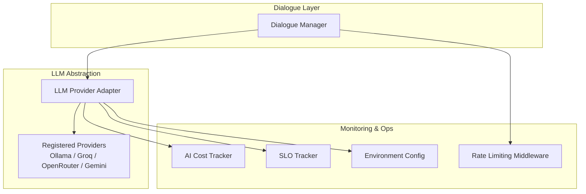
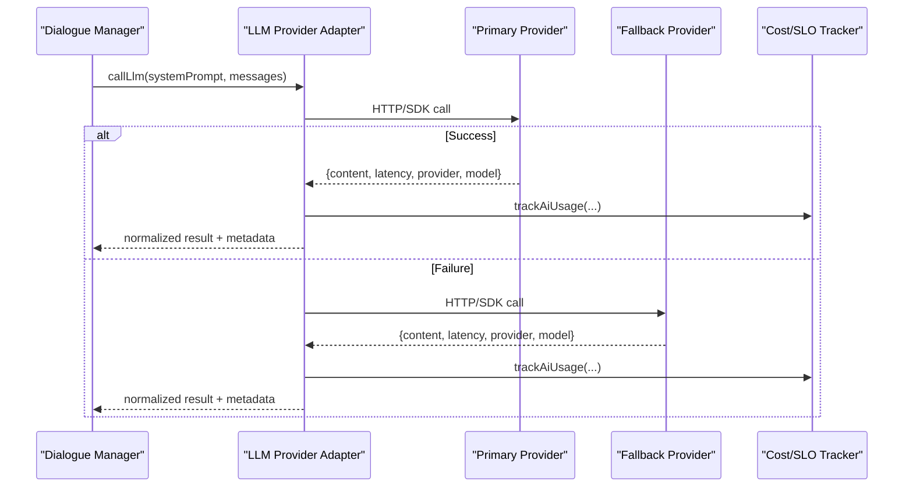
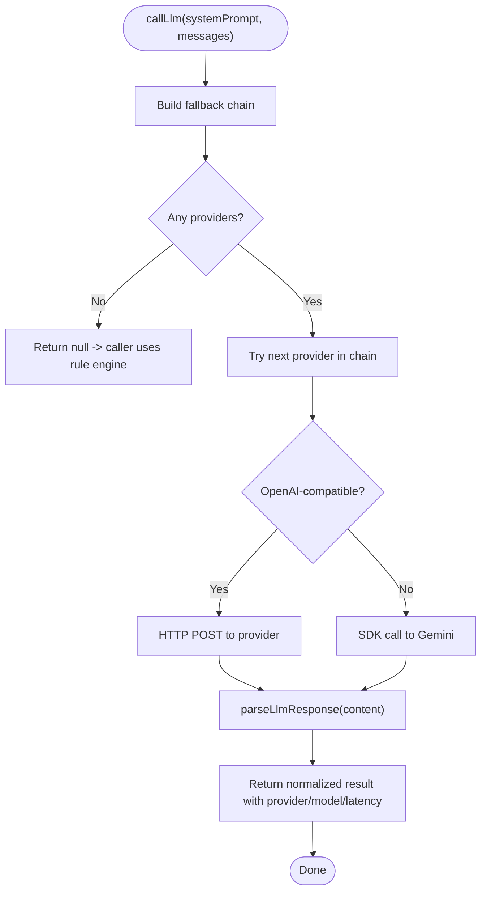
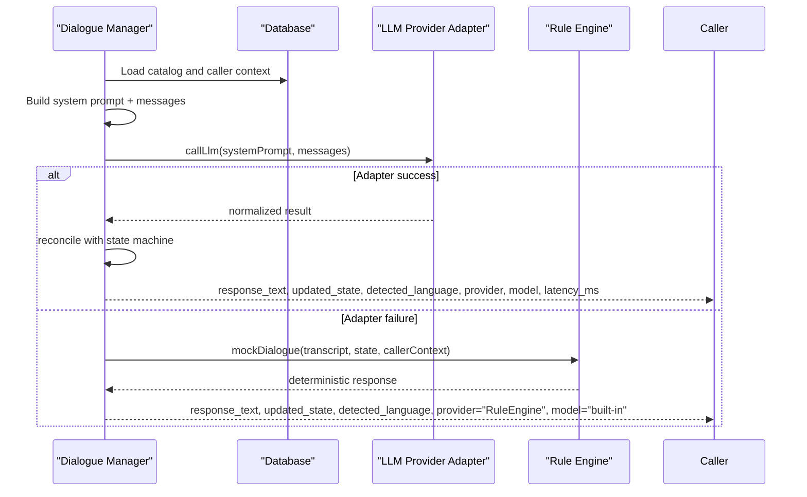
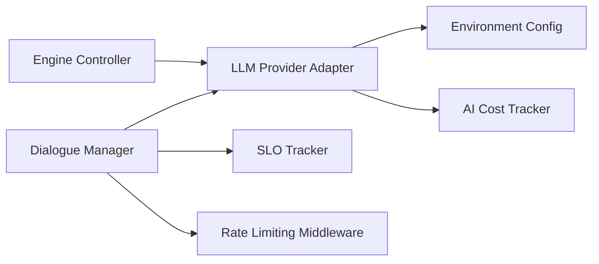

# LLM Provider Abstraction Layer

<cite>
**Referenced Files in This Document**
- [llmProviderAdapter.js](file://server/src/services/llmProviderAdapter.js)
- [dialogueManager.js](file://server/src/services/dialogueManager.js)
- [engine.controller.js](file://server/src/controllers/engine.controller.js)
- [env.js](file://server/src/config/env.js)
- [aiCostTracker.js](file://server/src/services/aiCostTracker.js)
- [sloTracker.js](file://server/src/services/sloTracker.js)
- [rateLimit.middleware.js](file://server/src/middleware/rateLimit.middleware.js)
- [sttService.js](file://server/src/services/sttService.js)
</cite>

## Table of Contents
1. [Introduction](#introduction)
2. [Project Structure](#project-structure)
3. [Core Components](#core-components)
4. [Architecture Overview](#architecture-overview)
5. [Detailed Component Analysis](#detailed-component-analysis)
6. [Dependency Analysis](#dependency-analysis)
7. [Performance Considerations](#performance-considerations)
8. [Troubleshooting Guide](#troubleshooting-guide)
9. [Conclusion](#conclusion)
10. [Appendices](#appendices)

## Introduction
This document explains the LLM provider abstraction layer that enables switching between different AI services for natural language processing. It covers the adapter pattern implementation, provider registration and fallback mechanisms, unified interface for text generation and intent/entity extraction, configuration options per provider, monitoring and cost tracking, security considerations for API keys, and rate limiting strategies.

## Project Structure
The LLM abstraction is implemented as a service module that:
- Registers multiple providers (local Ollama, Groq, OpenRouter, Gemini).
- Routes requests through a unified call function with automatic fallback.
- Normalizes responses into a consistent shape consumed by higher-level services.
- Exposes status and metrics endpoints via controllers and supporting services.

**Diagram sources**
- [dialogueManager.js:36-84](file://server/src/services/dialogueManager.js#L36-L84)
- [llmProviderAdapter.js:17-68](file://server/src/services/llmProviderAdapter.js#L17-L68)
- [aiCostTracker.js:16-57](file://server/src/services/aiCostTracker.js#L16-L57)
- [sloTracker.js:15-64](file://server/src/services/sloTracker.js#L15-L64)
- [rateLimit.middleware.js:8-51](file://server/src/middleware/rateLimit.middleware.js#L8-L51)
- [env.js:3-24](file://server/src/config/env.js#L3-L24)

**Section sources**
- [dialogueManager.js:36-84](file://server/src/services/dialogueManager.js#L36-L84)
- [llmProviderAdapter.js:17-68](file://server/src/services/llmProviderAdapter.js#L17-L68)

## Core Components
- LLM Provider Adapter: Central router implementing the adapter pattern to unify calls across providers.
- Dialogue Manager: Orchestrates conversation turns, builds prompts, invokes the adapter, reconciles outputs, and falls back to rule engine when needed.
- Engine Controller: Exposes provider status and configuration visibility.
- Environment Config: Validates and exposes environment variables including provider keys.
- Monitoring Services: Track costs and SLOs; middleware enforces rate limits.

Key responsibilities:
- Unified interface: callLlm(systemPrompt, messages) returns normalized results.
- Provider registration: PROVIDERS map defines endpoint details, models, and required keys.
- Fallback cascade: Primary provider first, then ordered fallback chain based on availability.
- Response normalization: parseLlmResponse validates and sanitizes LLM output into a strict schema.
- Observability: latency, provider, model, and usage logging; cost and SLO tracking.

**Section sources**
- [llmProviderAdapter.js:17-68](file://server/src/services/llmProviderAdapter.js#L17-L68)
- [llmProviderAdapter.js:72-117](file://server/src/services/llmProviderAdapter.js#L72-L117)
- [llmProviderAdapter.js:123-159](file://server/src/services/llmProviderAdapter.js#L123-L159)
- [llmProviderAdapter.js:169-215](file://server/src/services/llmProviderAdapter.js#L169-L215)
- [llmProviderAdapter.js:226-282](file://server/src/services/llmProviderAdapter.js#L226-L282)
- [dialogueManager.js:36-84](file://server/src/services/dialogueManager.js#L36-L84)
- [engine.controller.js:6-24](file://server/src/controllers/engine.controller.js#L6-L24)
- [env.js:3-24](file://server/src/config/env.js#L3-L24)

## Architecture Overview
The system uses an adapter pattern to abstract provider differences behind a single interface. The dialogue manager composes context and history, then delegates to the adapter. The adapter selects a provider from a configured fallback chain, executes the request, normalizes the response, and returns consistent data to the caller.

**Diagram sources**
- [llmProviderAdapter.js:226-262](file://server/src/services/llmProviderAdapter.js#L226-L262)
- [llmProviderAdapter.js:72-117](file://server/src/services/llmProviderAdapter.js#L72-L117)
- [llmProviderAdapter.js:123-159](file://server/src/services/llmProviderAdapter.js#L123-L159)
- [aiCostTracker.js:16-57](file://server/src/services/aiCostTracker.js#L16-L57)

## Detailed Component Analysis

### LLM Provider Adapter
- Provider Registration: A central map defines each provider’s name, base URL or SDK settings, model(s), required environment key, and format.
- Fallback Chain: Determines primary provider from environment and filters available providers based on configured keys.
- OpenAI-Compatible Calls: For Ollama, Groq, and OpenRouter, constructs a standard chat completion payload and handles timeouts and errors.
- Gemini Integration: Uses the official SDK, tries multiple models sequentially, and aggregates latency and model info.
- Response Parsing and Validation: Strips markdown fences, parses JSON, enforces allowed actions, bounds quantities, and ensures safe defaults.
- Unified Interface: Exports callLlm and getProviderStatus for consumers and admin endpoints.

**Diagram sources**
- [llmProviderAdapter.js:53-68](file://server/src/services/llmProviderAdapter.js#L53-L68)
- [llmProviderAdapter.js:72-117](file://server/src/services/llmProviderAdapter.js#L72-L117)
- [llmProviderAdapter.js:123-159](file://server/src/services/llmProviderAdapter.js#L123-L159)
- [llmProviderAdapter.js:169-215](file://server/src/services/llmProviderAdapter.js#L169-L215)
- [llmProviderAdapter.js:226-262](file://server/src/services/llmProviderAdapter.js#L226-L262)

**Section sources**
- [llmProviderAdapter.js:17-68](file://server/src/services/llmProviderAdapter.js#L17-L68)
- [llmProviderAdapter.js:72-117](file://server/src/services/llmProviderAdapter.js#L72-L117)
- [llmProviderAdapter.js:123-159](file://server/src/services/llmProviderAdapter.js#L123-L159)
- [llmProviderAdapter.js:169-215](file://server/src/services/llmProviderAdapter.js#L169-L215)
- [llmProviderAdapter.js:226-282](file://server/src/services/llmProviderAdapter.js#L226-L282)

### Dialogue Manager Integration
- Builds system prompt using catalog and caller context.
- Sends recent conversation history and current state to the adapter.
- Reconciles LLM proposals with authoritative pricing and state machine transitions.
- Falls back to a deterministic rule-based engine if the adapter returns null or throws.

**Diagram sources**
- [dialogueManager.js:36-84](file://server/src/services/dialogueManager.js#L36-L84)
- [dialogueManager.js:93-132](file://server/src/services/dialogueManager.js#L93-L132)
- [dialogueManager.js:137-301](file://server/src/services/dialogueManager.js#L137-L301)

**Section sources**
- [dialogueManager.js:36-84](file://server/src/services/dialogueManager.js#L36-L84)
- [dialogueManager.js:93-132](file://server/src/services/dialogueManager.js#L93-L132)
- [dialogueManager.js:137-301](file://server/src/services/dialogueManager.js#L137-L301)

### Engine Controller and Status Exposure
- Provides a health/status endpoint exposing LLM provider selection and configuration flags for STT/TTS.
- Uses getProviderStatus to report active providers and fallback chain.

**Section sources**
- [engine.controller.js:6-24](file://server/src/controllers/engine.controller.js#L6-L24)
- [llmProviderAdapter.js:268-282](file://server/src/services/llmProviderAdapter.js#L268-L282)

### Environment Configuration
- Validates required and optional environment variables, including provider keys.
- Ensures secure defaults and prevents startup with invalid configurations.

**Section sources**
- [env.js:3-24](file://server/src/config/env.js#L3-L24)

### Monitoring and Metrics
- AI Cost Tracker: Records token usage and estimated cost per provider/model; supports daily spend aggregation.
- SLO Tracker: Aggregates latency and error rates to evaluate service level objectives.
- Rate Limiting Middleware: Protects endpoints against abuse and controls throughput.

**Section sources**
- [aiCostTracker.js:16-57](file://server/src/services/aiCostTracker.js#L16-L57)
- [aiCostTracker.js:62-86](file://server/src/services/aiCostTracker.js#L62-L86)
- [sloTracker.js:15-64](file://server/src/services/sloTracker.js#L15-L64)
- [rateLimit.middleware.js:8-51](file://server/src/middleware/rateLimit.middleware.js#L8-L51)

## Dependency Analysis
- Dialogue Manager depends on LLM Provider Adapter for AI inference and on domain services for state reconciliation.
- LLM Provider Adapter depends on environment configuration for provider keys and URLs.
- Monitoring services depend on database accessors to persist and query metrics.
- Controllers expose operational status derived from adapter and environment.

**Diagram sources**
- [dialogueManager.js:36-84](file://server/src/services/dialogueManager.js#L36-L84)
- [llmProviderAdapter.js:226-282](file://server/src/services/llmProviderAdapter.js#L226-L282)
- [env.js:3-24](file://server/src/config/env.js#L3-L24)
- [aiCostTracker.js:16-57](file://server/src/services/aiCostTracker.js#L16-L57)
- [sloTracker.js:15-64](file://server/src/services/sloTracker.js#L15-L64)
- [rateLimit.middleware.js:8-51](file://server/src/middleware/rateLimit.middleware.js#L8-L51)
- [engine.controller.js:6-24](file://server/src/controllers/engine.controller.js#L6-L24)

**Section sources**
- [dialogueManager.js:36-84](file://server/src/services/dialogueManager.js#L36-L84)
- [llmProviderAdapter.js:226-282](file://server/src/services/llmProviderAdapter.js#L226-L282)

## Performance Considerations
- Timeouts: OpenAI-compatible calls use a 30-second timeout to prevent hanging requests.
- Model Selection: Gemini iterates through multiple models to find a working one quickly.
- Latency Tracking: Each provider call records latency and model used for observability.
- State Reconciliation: Authoritative pricing and state transitions are enforced server-side to avoid expensive retries due to incorrect client state.
- Rate Limits: Endpoint-level rate limiting protects downstream services and reduces load spikes.

[No sources needed since this section provides general guidance]

## Troubleshooting Guide
Common issues and resolutions:
- Missing API Keys: If a provider’s environment key is not set, it will be excluded from the fallback chain. Ensure required keys are present for intended providers.
- All Providers Exhausted: When every provider fails, the adapter returns null and the dialogue manager falls back to the rule engine. Check logs for provider-specific errors.
- Invalid LLM Output: The parser enforces a strict schema; malformed JSON or disallowed actions will cause parsing errors. Adjust prompts to ensure structured output.
- High Latency or Errors: Use SLO metrics and cost tracker to identify slow or failing providers. Consider adjusting provider order or enabling additional providers.
- Rate Limiting: If endpoints return 429, reduce request frequency or adjust rate limit policies.

**Section sources**
- [llmProviderAdapter.js:53-68](file://server/src/services/llmProviderAdapter.js#L53-L68)
- [llmProviderAdapter.js:103-117](file://server/src/services/llmProviderAdapter.js#L103-L117)
- [llmProviderAdapter.js:169-215](file://server/src/services/llmProviderAdapter.js#L169-L215)
- [dialogueManager.js:60-84](file://server/src/services/dialogueManager.js#L60-L84)
- [rateLimit.middleware.js:8-51](file://server/src/middleware/rateLimit.middleware.js#L8-L51)

## Conclusion
The LLM provider abstraction layer provides a robust, extensible foundation for multi-provider AI inference. It standardizes interfaces, enforces safe and validated outputs, and offers resilient fallback behavior. With built-in monitoring, cost tracking, and rate limiting, it supports production-grade operations while remaining easy to extend with new providers.

[No sources needed since this section summarizes without analyzing specific files]

## Appendices

### Adding a New LLM Provider
Steps to add a new provider:
1. Register the provider in the PROVIDERS map with name, base URL or SDK settings, model(s), required environment key, and format.
2. If the provider uses a non-OpenAI format, implement a dedicated call function similar to the Gemini integration.
3. Ensure the provider is included in the fallback chain by setting its environment key.
4. Update any monitoring mappings if you need cost tracking for the new model.

Example references:
- Provider registration and fallback logic: [llmProviderAdapter.js:17-68](file://server/src/services/llmProviderAdapter.js#L17-L68)
- OpenAI-compatible call pattern: [llmProviderAdapter.js:72-117](file://server/src/services/llmProviderAdapter.js#L72-L117)
- Gemini-style SDK integration: [llmProviderAdapter.js:123-159](file://server/src/services/llmProviderAdapter.js#L123-L159)

**Section sources**
- [llmProviderAdapter.js:17-68](file://server/src/services/llmProviderAdapter.js#L17-L68)
- [llmProviderAdapter.js:72-117](file://server/src/services/llmProviderAdapter.js#L72-L117)
- [llmProviderAdapter.js:123-159](file://server/src/services/llmProviderAdapter.js#L123-L159)

### Configuring Provider-Specific Parameters
- Primary provider selection: Set the environment variable to choose the preferred provider at runtime.
- Model selection: Configure model names per provider in the PROVIDERS map.
- Extra headers: Some providers require custom headers; these can be added to the provider config.
- Timeouts and tokens: Adjust request body parameters such as temperature and max tokens to balance quality and performance.

References:
- Primary provider and fallback chain: [llmProviderAdapter.js:53-68](file://server/src/services/llmProviderAdapter.js#L53-L68)
- Request body construction: [llmProviderAdapter.js:77-86](file://server/src/services/llmProviderAdapter.js#L77-L86)
- Extra headers example: [llmProviderAdapter.js:38-41](file://server/src/services/llmProviderAdapter.js#L38-L41)

**Section sources**
- [llmProviderAdapter.js:53-68](file://server/src/services/llmProviderAdapter.js#L53-L68)
- [llmProviderAdapter.js:77-86](file://server/src/services/llmProviderAdapter.js#L77-L86)
- [llmProviderAdapter.js:38-41](file://server/src/services/llmProviderAdapter.js#L38-L41)

### Monitoring Provider Performance and Costs
- Usage tracking: Record provider, model, tokens, latency, and estimated cost per request.
- Daily spend aggregation: Query aggregated metrics per tenant for budgeting and alerts.
- SLO metrics: Evaluate availability, latency targets, and error rates over time.

References:
- Usage recording: [aiCostTracker.js:16-57](file://server/src/services/aiCostTracker.js#L16-L57)
- Daily spend query: [aiCostTracker.js:62-86](file://server/src/services/aiCostTracker.js#L62-L86)
- SLO metrics: [sloTracker.js:15-64](file://server/src/services/sloTracker.js#L15-L64)

**Section sources**
- [aiCostTracker.js:16-57](file://server/src/services/aiCostTracker.js#L16-L57)
- [aiCostTracker.js:62-86](file://server/src/services/aiCostTracker.js#L62-L86)
- [sloTracker.js:15-64](file://server/src/services/sloTracker.js#L15-L64)

### Security Considerations for API Key Management
- Store provider keys in environment variables validated at startup.
- Avoid logging sensitive keys; only log provider names and models.
- Restrict access to configuration endpoints and enforce authentication where applicable.
- Use short-lived tokens and rotation patterns for sensitive credentials where supported.

References:
- Environment validation: [env.js:3-24](file://server/src/config/env.js#L3-L24)
- Provider key checks: [llmProviderAdapter.js:72-76](file://server/src/services/llmProviderAdapter.js#L72-L76)
- STT provider key usage (example): [sttService.js:219-220](file://server/src/services/sttService.js#L219-L220)

**Section sources**
- [env.js:3-24](file://server/src/config/env.js#L3-L24)
- [llmProviderAdapter.js:72-76](file://server/src/services/llmProviderAdapter.js#L72-L76)
- [sttService.js:219-220](file://server/src/services/sttService.js#L219-L220)

### Rate Limiting Strategies
- Apply endpoint-specific rate limits to protect authentication, public APIs, dashboards, and telephony webhooks.
- Use IP-based or user-based keys depending on the endpoint sensitivity.
- Integrate with error handling to return clear 429 responses and guidance.

References:
- Rate limiters: [rateLimit.middleware.js:8-51](file://server/src/middleware/rateLimit.middleware.js#L8-L51)

**Section sources**
- [rateLimit.middleware.js:8-51](file://server/src/middleware/rateLimit.middleware.js#L8-L51)