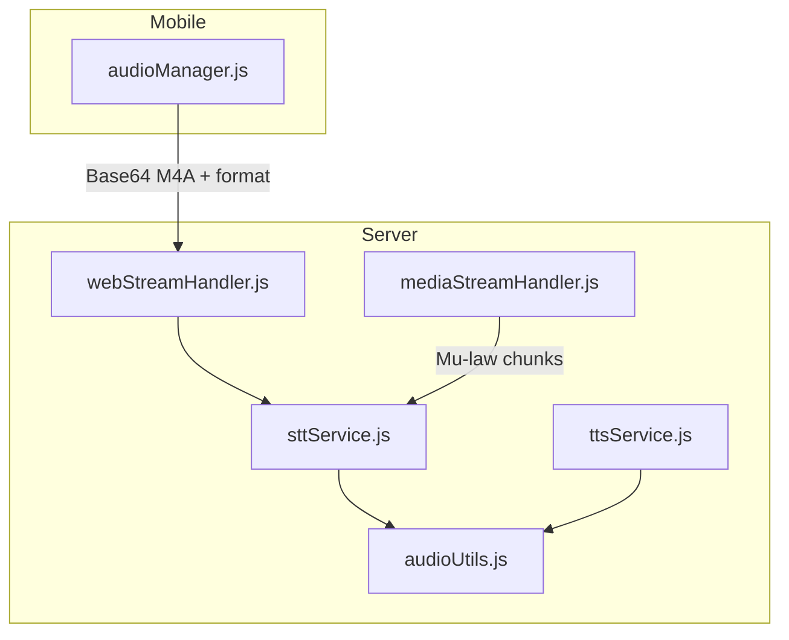
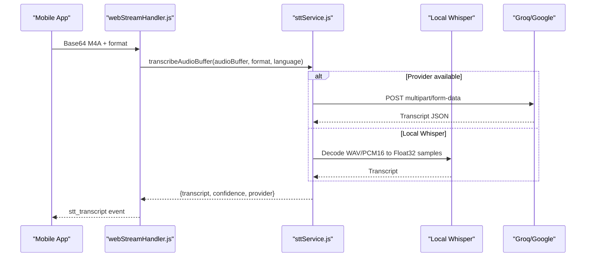
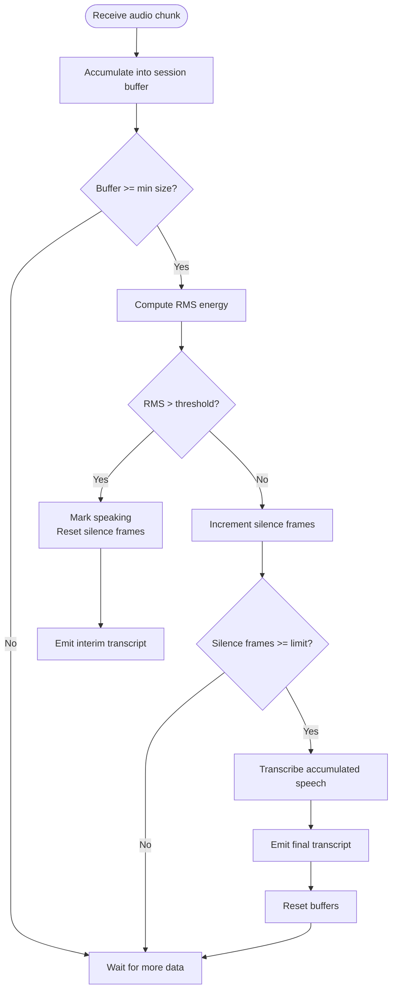
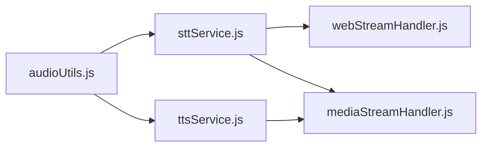

# Audio Processing & Format Handling

<cite>
**Referenced Files in This Document**
- [audioUtils.js](file://server/src/utils/audioUtils.js)
- [sttService.js](file://server/src/services/sttService.js)
- [ttsService.js](file://server/src/services/ttsService.js)
- [mediaStreamHandler.js](file://server/src/websocket/mediaStreamHandler.js)
- [webStreamHandler.js](file://server/src/websocket/webStreamHandler.js)
- [audioManager.js](file://mobile/src/services/audioManager.js)
</cite>

## Table of Contents
1. [Introduction](#introduction)
2. [Project Structure](#project-structure)
3. [Core Components](#core-components)
4. [Architecture Overview](#architecture-overview)
5. [Detailed Component Analysis](#detailed-component-analysis)
6. [Dependency Analysis](#dependency-analysis)
7. [Performance Considerations](#performance-considerations)
8. [Troubleshooting Guide](#troubleshooting-guide)
9. [Conclusion](#conclusion)
10. [Appendices](#appendices)

## Introduction
This document explains the audio processing capabilities implemented in the project, focusing on format handling (M4A, WAV, MP3, WebM), sample rate conversion to 8kHz/16kHz standards, PCM16 buffer processing, and WAV header creation for API requests. It also covers buffer chunking strategies, memory optimization techniques, error handling for unsupported formats, and performance considerations for large audio files.

## Project Structure
The audio pipeline spans server-side services and utilities, mobile recording, and WebSocket handlers:
- Server utilities provide codec conversions and resampling.
- STT service handles transcription from various formats and builds WAV payloads for APIs.
- TTS service synthesizes speech and converts to telephony-friendly codecs.
- WebSocket handlers route incoming audio streams to STT or process recorded audio buffers.
- Mobile app records audio and returns base64-encoded M4A with metadata.

**Diagram sources**
- [webStreamHandler.js:23-55](file://server/src/websocket/webStreamHandler.js#L23-L55)
- [mediaStreamHandler.js:40-49](file://server/src/websocket/mediaStreamHandler.js#L40-L49)
- [sttService.js:83-210](file://server/src/services/sttService.js#L83-L210)
- [ttsService.js:28-70](file://server/src/services/ttsService.js#L28-L70)
- [audioUtils.js:26-83](file://server/src/utils/audioUtils.js#L26-L83)

**Section sources**
- [webStreamHandler.js:23-55](file://server/src/websocket/webStreamHandler.js#L23-L55)
- [mediaStreamHandler.js:40-49](file://server/src/websocket/mediaStreamHandler.js#L40-L49)
- [sttService.js:83-210](file://server/src/services/sttService.js#L83-L210)
- [ttsService.js:28-70](file://server/src/services/ttsService.js#L28-L70)
- [audioUtils.js:26-83](file://server/src/utils/audioUtils.js#L26-L83)

## Core Components
- PCM16 ↔ Mu-law conversion and resampling utilities.
- STT service supporting multiple providers and local Whisper fallback.
- WAV header builder for PCM16 input to satisfy API requirements.
- Streaming session management with VAD-like chunking for batch providers.
- TTS synthesis with caching and telephony codec output.

Key responsibilities:
- Convert between telephony Mu-law and linear PCM16.
- Resample 16kHz PCM16 down to 8kHz PCM16 when needed.
- Build minimal WAV headers for PCM16 buffers before sending to external APIs.
- Handle M4A, WAV, MP3, and WebM inputs via provider-specific logic and local decoding.

**Section sources**
- [audioUtils.js:26-83](file://server/src/utils/audioUtils.js#L26-L83)
- [sttService.js:299-323](file://server/src/services/sttService.js#L299-L323)
- [sttService.js:358-453](file://server/src/services/sttService.js#L358-L453)
- [ttsService.js:28-70](file://server/src/services/ttsService.js#L28-L70)

## Architecture Overview
The system supports both file-based transcription and streaming transcription:
- File-based: Mobile sends base64 M4A; server transcribes using configured provider or local Whisper.
- Streaming: Twilio sends Mu-law chunks; server decodes to PCM16 and feeds a streaming STT session.
- TTS: Synthesizes text to Mu-law for telephony playback, with caching for repeated prompts.

**Diagram sources**
- [webStreamHandler.js:28-55](file://server/src/websocket/webStreamHandler.js#L28-L55)
- [sttService.js:83-210](file://server/src/services/sttService.js#L83-L210)

**Section sources**
- [webStreamHandler.js:28-55](file://server/src/websocket/webStreamHandler.js#L28-L55)
- [sttService.js:83-210](file://server/src/services/sttService.js#L83-L210)

## Detailed Component Analysis

### PCM16 Buffer Processing and Codec Conversion
- Mu-law to PCM16: Efficient table-driven decoding for 8kHz telephony streams.
- PCM16 to Mu-law: Sample-wise encoding for telephony playback.
- Resampling: Simple decimation from 16kHz to 8kHz by taking every second sample.

Complexity:
- Linear time O(N) per conversion/resample where N is number of samples.
- Memory usage proportional to input size; precomputed lookup table minimizes CPU overhead.

Optimization opportunities:
- Use typed arrays for faster numeric operations.
- Batch processing to reduce allocation churn.

**Section sources**
- [audioUtils.js:26-33](file://server/src/utils/audioUtils.js#L26-L33)
- [audioUtils.js:64-71](file://server/src/utils/audioUtils.js#L64-L71)
- [audioUtils.js:76-83](file://server/src/utils/audioUtils.js#L76-L83)

### WAV Header Creation for API Requests
- createWavFromPcm constructs a minimal RIFF/WAV header for PCM16 data at a specified sample rate.
- Used to package raw PCM16 into a valid WAV payload for Groq Whisper API.

Behavior:
- Calculates byte rate, block align, and data size based on channel count and bits per sample.
- Concatenates header and PCM buffer to produce final WAV bytes.

Error handling:
- Assumes valid PCM16 input; invalid sizes may produce malformed WAV.

**Section sources**
- [sttService.js:299-323](file://server/src/services/sttService.js#L299-L323)

### Audio Format Support and Automatic Detection
- Supported formats: M4A, WAV, MP3, WebM.
- Automatic detection:
  - For file-based transcription, the caller provides a format hint; the service maps it to MIME types for provider uploads.
  - For local Whisper path, attempts to decode as WAV first; if that fails, treats the buffer as raw PCM16 and normalizes to float32.

Fallback strategy:
- If provider unavailable or fails, tries local Whisper Tiny model.
- If both fail, returns a contextual mock transcript for development.

**Section sources**
- [sttService.js:83-110](file://server/src/services/sttService.js#L83-L110)
- [sttService.js:151-188](file://server/src/services/sttService.js#L151-L188)

### Streaming Transcription and Chunking Strategy
- Streaming sessions accumulate audio chunks and use RMS energy to detect speech vs silence.
- When silence persists beyond a threshold, accumulated speech is sent to the provider for transcription.
- Interim transcripts are emitted while speaking; final transcripts are emitted after silence.

Chunking details:
- Minimum chunk size checked before processing.
- Speech accumulation buffer resets after transcription.
- End-of-stream flushes remaining speech if above threshold.

**Diagram sources**
- [sttService.js:358-453](file://server/src/services/sttService.js#L358-L453)

**Section sources**
- [sttService.js:358-453](file://server/src/services/sttService.js#L358-L453)

### TTS Synthesis and Telephony Output
- Multi-provider synthesis with caching to avoid redundant work.
- Converts provider outputs to Mu-law for telephony playback.
- Mock mode generates short tone patterns to simulate speech.

Caching:
- In-memory cache keyed by provider, language, and normalized text.
- LRU-style eviction by removing oldest entry when max entries exceeded.

**Section sources**
- [ttsService.js:28-70](file://server/src/services/ttsService.js#L28-L70)
- [ttsService.js:154-179](file://server/src/services/ttsService.js#L154-L179)

### Mobile Recording and Format Handling
- Records high-quality audio and returns base64-encoded M4A with format metadata.
- Stops any ongoing speech playback before starting recording.
- Returns null on errors or if no active recording exists.

**Section sources**
- [audioManager.js:36-90](file://mobile/src/services/audioManager.js#L36-L90)

### Twilio Stream Integration
- Decodes Mu-law media payloads to PCM16 and forwards to STT stream.
- Limits stored audio chunks to prevent unbounded memory growth.

**Section sources**
- [mediaStreamHandler.js:40-49](file://server/src/websocket/mediaStreamHandler.js#L40-L49)

## Dependency Analysis
- STT service depends on:
  - audioUtils for codec conversions.
  - wavefile library for local decoding.
  - External providers (Groq, Google) via environment configuration.
- TTS service depends on:
  - audioUtils for PCM16 to Mu-law conversion.
  - Providers (Sarvam, Google) via environment configuration.
- WebSocket handlers depend on STT service and session pipeline.

**Diagram sources**
- [sttService.js:83-210](file://server/src/services/sttService.js#L83-L210)
- [ttsService.js:28-70](file://server/src/services/ttsService.js#L28-L70)
- [webStreamHandler.js:28-55](file://server/src/websocket/webStreamHandler.js#L28-L55)
- [mediaStreamHandler.js:40-49](file://server/src/websocket/mediaStreamHandler.js#L40-L49)

**Section sources**
- [sttService.js:83-210](file://server/src/services/sttService.js#L83-L210)
- [ttsService.js:28-70](file://server/src/services/ttsService.js#L28-L70)
- [webStreamHandler.js:28-55](file://server/src/websocket/webStreamHandler.js#L28-L55)
- [mediaStreamHandler.js:40-49](file://server/src/websocket/mediaStreamHandler.js#L40-L49)

## Performance Considerations
- Buffer allocations:
  - Conversions allocate new buffers sized to input; ensure reuse where possible for large files.
  - Streaming accumulates speech buffers; reset after transcription to free memory.
- Resampling:
  - Simple decimation is fast but may introduce aliasing; acceptable for telephony bandwidth.
- Caching:
  - TTS cache reduces repeated synthesis costs; tune max entries based on memory constraints.
- Network timeouts:
  - Provider calls use timeouts to prevent hanging connections.
- Large files:
  - Prefer streaming transcription for long recordings to avoid loading entire files into memory.
  - Limit stored audio chunks in sessions to cap memory usage.

[No sources needed since this section provides general guidance]

## Troubleshooting Guide
Common issues and resolutions:
- Missing provider keys:
  - Ensure GROQ_API_KEY or SARVAM_API_KEY are set when using respective providers.
- Unsupported format:
  - Provide correct format hint for file-based transcription; local Whisper falls back to raw PCM16 if WAV decoding fails.
- Streaming not producing transcripts:
  - Verify RMS thresholds and silence frame limits; adjust thresholds if background noise affects detection.
- Memory pressure:
  - Reduce session audio chunk limits; ensure streaming buffers are flushed properly.
- Timeouts:
  - Increase timeout values if network latency is high; monitor provider response times.

**Section sources**
- [sttService.js:218-224](file://server/src/services/sttService.js#L218-L224)
- [sttService.js:151-188](file://server/src/services/sttService.js#L151-L188)
- [sttService.js:358-453](file://server/src/services/sttService.js#L358-L453)
- [ttsService.js:28-70](file://server/src/services/ttsService.js#L28-L70)

## Conclusion
The audio processing pipeline provides robust support for multiple formats, efficient codec conversions, and flexible transcription strategies. By combining provider-based and local models, the system ensures reliability across environments. Proper buffer management and caching optimize performance, while streaming capabilities handle real-time scenarios effectively.

[No sources needed since this section summarizes without analyzing specific files]

## Appendices

### Example Workflows

#### M4A to Transcript
- Mobile records M4A and sends base64 with format 'm4a'.
- Server routes to STT service, which uses configured provider or local Whisper.
- Result includes transcript, confidence, and provider info.

**Section sources**
- [audioManager.js:65-90](file://mobile/src/services/audioManager.js#L65-L90)
- [webStreamHandler.js:28-55](file://server/src/websocket/webStreamHandler.js#L28-L55)
- [sttService.js:83-210](file://server/src/services/sttService.js#L83-L210)

#### PCM16 to WAV for API
- Raw PCM16 buffer passed to createWavFromPcm with sample rate 8kHz.
- Resulting WAV buffer sent to Groq Whisper API via multipart form data.

**Section sources**
- [sttService.js:218-224](file://server/src/services/sttService.js#L218-L224)
- [sttService.js:299-323](file://server/src/services/sttService.js#L299-L323)

#### 16kHz to 8kHz Resampling
- 16kHz PCM16 buffer resampled to 8kHz by taking every second sample.
- Useful for telephony compatibility or reducing bandwidth.

**Section sources**
- [audioUtils.js:76-83](file://server/src/utils/audioUtils.js#L76-L83)