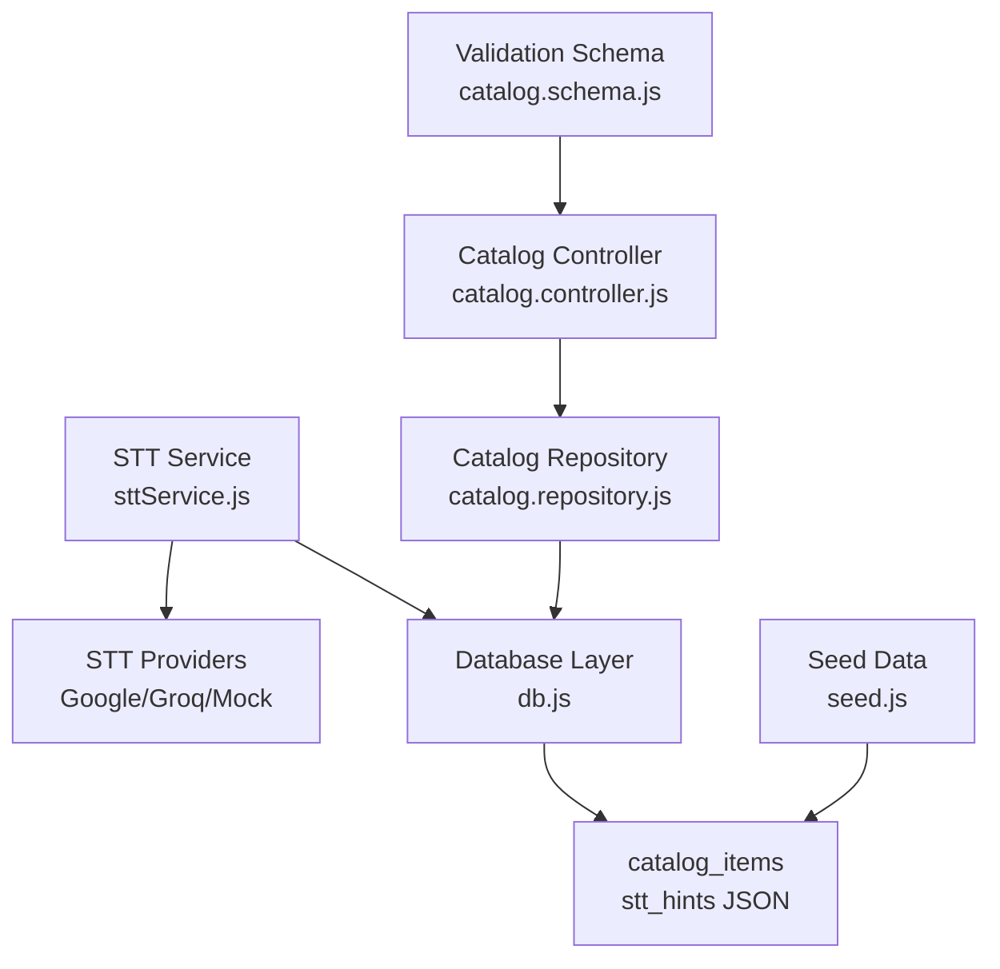
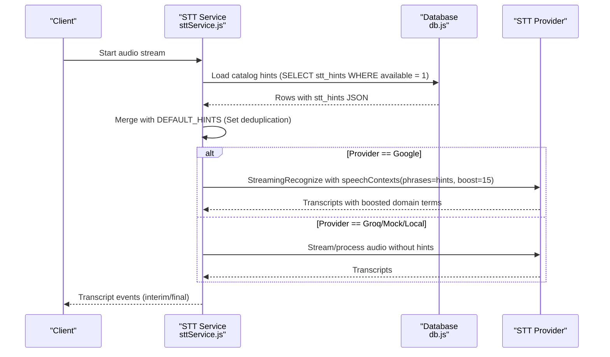
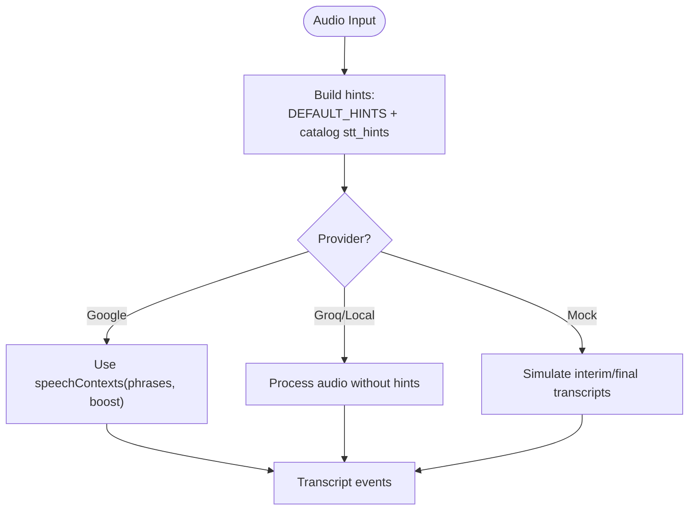
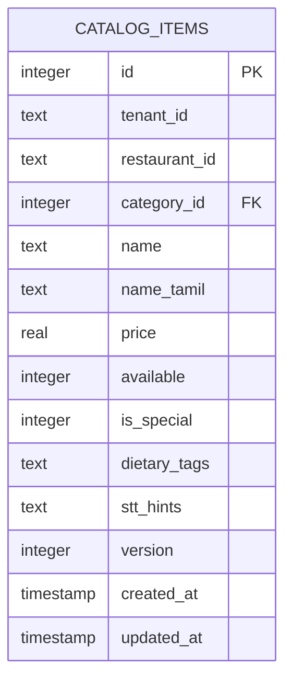
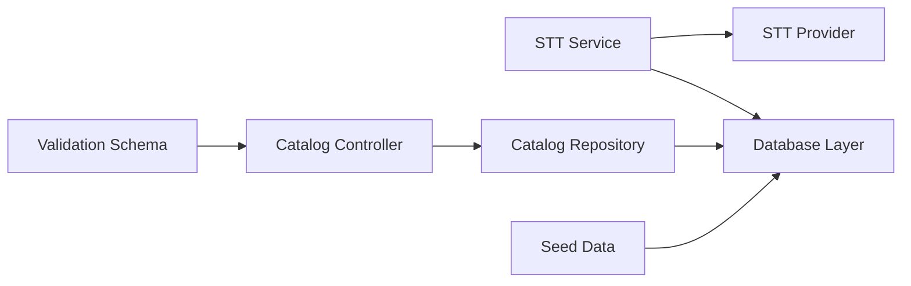

# Catalog Hints & Contextual Enhancement

<cite>
**Referenced Files in This Document**
- [sttService.js](file://server/src/services/sttService.js)
- [catalog.schema.js](file://server/src/schemas/catalog.schema.js)
- [001_initial_multitenant_schema.sql](file://server/src/db/migrations/001_initial_multitenant_schema.sql)
- [seed.js](file://server/src/db/seed.js)
- [catalog.controller.js](file://server/src/controllers/catalog.controller.js)
- [catalog.repository.js](file://server/src/domain/catalog/catalog.repository.js)
- [db.js](file://server/src/db.js)
</cite>

## Table of Contents
1. [Introduction](#introduction)
2. [Project Structure](#project-structure)
3. [Core Components](#core-components)
4. [Architecture Overview](#architecture-overview)
5. [Detailed Component Analysis](#detailed-component-analysis)
6. [Dependency Analysis](#dependency-analysis)
7. [Performance Considerations](#performance-considerations)
8. [Troubleshooting Guide](#troubleshooting-guide)
9. [Conclusion](#conclusion)
10. [Appendices](#appendices)

## Introduction
This document explains how catalog hints improve transcription accuracy for food ordering contexts. It focuses on the loadCatalogHints function that dynamically loads menu items from the database to build contextual word lists used by speech-to-text (STT) engines. It also documents the DEFAULT_HINTS array containing common Indian food terms, Tamil numbers, and order-related phrases, and shows how these hints are combined with catalog data to boost recognition accuracy for domain-specific vocabulary. Practical guidance is included for adding new menu items, optimizing hint lists for different restaurant types, and measuring the impact of hints on transcription accuracy.

## Project Structure
The catalog hints feature spans several server-side modules:
- STT service orchestrates audio processing and integrates hints into provider requests.
- Catalog schema defines validation rules for item fields including stt_hints.
- Database migrations define the catalog_items table where stt_hints are stored as JSON.
- Seed data populates sample items with stt_hints arrays.
- Catalog controller exposes endpoints to add items and retrieve catalog data.
- Catalog repository provides tenant-scoped queries and persists stt_hints.
- Database utilities provide dbAll/dbGet/dbRun used by STT and catalog layers.

**Diagram sources**
- [sttService.js:45-74](file://server/src/services/sttService.js#L45-L74)
- [sttService.js:459-475](file://server/src/services/sttService.js#L459-L475)
- [catalog.schema.js:1-16](file://server/src/schemas/catalog.schema.js#L1-L16)
- [001_initial_multitenant_schema.sql:71-89](file://server/src/db/migrations/001_initial_multitenant_schema.sql#L71-L89)
- [seed.js:59-103](file://server/src/db/seed.js#L59-L103)
- [catalog.controller.js:21-78](file://server/src/controllers/catalog.controller.js#L21-L78)
- [catalog.repository.js:23-46](file://server/src/domain/catalog/catalog.repository.js#L23-L46)
- [db.js:92-103](file://server/src/db.js#L92-L103)

**Section sources**
- [sttService.js:45-74](file://server/src/services/sttService.js#L45-L74)
- [catalog.schema.js:1-16](file://server/src/schemas/catalog.schema.js#L1-L16)
- [001_initial_multitenant_schema.sql:71-89](file://server/src/db/migrations/001_initial_multitenant_schema.sql#L71-L89)
- [seed.js:59-103](file://server/src/db/seed.js#L59-L103)
- [catalog.controller.js:21-78](file://server/src/controllers/catalog.controller.js#L21-L78)
- [catalog.repository.js:23-46](file://server/src/domain/catalog/catalog.repository.js#L23-L46)
- [db.js:92-103](file://server/src/db.js#L92-L103)

## Core Components
- DEFAULT_HINTS: A baseline set of domain-specific words and phrases for Indian food ordering, including common dish names, sizes, spice levels, quantities in English and Tamil, and payment/ordering verbs.
- loadCatalogHints(): Dynamically queries the catalog table for available items and merges their stt_hints with DEFAULT_HINTS to produce a final hints list per session.
- STT providers integration: The hints are injected into provider requests (e.g., Google Cloud STT speechContexts) to boost recognition of menu vocabulary.
- Catalog persistence: stt_hints are validated and stored per item via the catalog schema and repository, enabling per-menu customization.

Key behaviors:
- If the database query fails or returns no rows, loadCatalogHints falls back to DEFAULT_HINTS.
- Hints are deduplicated using a Set before being returned as an array.
- For Google Cloud STT, hints are passed as speechContexts with a boost value to prioritize domain terms during transcription.

**Section sources**
- [sttService.js:45-74](file://server/src/services/sttService.js#L45-L74)
- [sttService.js:459-475](file://server/src/services/sttService.js#L459-L475)
- [catalog.schema.js:1-16](file://server/src/schemas/catalog.schema.js#L1-L16)
- [catalog.repository.js:23-46](file://server/src/domain/catalog/catalog.repository.js#L23-L46)

## Architecture Overview
The flow begins when an audio stream is processed by the STT service. It builds a hints list by merging DEFAULT_HINTS with catalog-derived hints. Depending on the configured provider, it either uses local Whisper, Groq batch mode, Google Cloud streaming, or a mock implementation. When using Google Cloud STT, the hints are embedded in speechContexts to bias recognition toward menu vocabulary.

**Diagram sources**
- [sttService.js:45-74](file://server/src/services/sttService.js#L45-L74)
- [sttService.js:459-475](file://server/src/services/sttService.js#L459-L475)
- [db.js:92-103](file://server/src/db.js#L92-L103)

## Detailed Component Analysis

### loadCatalogHints and DEFAULT_HINTS
- DEFAULT_HINTS includes:
  - Common Indian dishes and sides (e.g., biryani variants, naan, dosa, idli).
  - Spice levels and pack sizes (e.g., spicy, mild, regular, family pack).
  - Quantities in English and Tamil (e.g., one/two/three/four/five; oru/rendu/moonu/naalu/anju).
  - Ordering/payment verbs and options (e.g., order, cancel, confirm, yes, no, cash on delivery, UPI, online payment).
- loadCatalogHints:
  - Queries all available catalog items and parses their stt_hints JSON arrays.
  - Merges parsed hints with DEFAULT_HINTS using a Set to avoid duplicates.
  - Returns an array of unique hints; on error, returns DEFAULT_HINTS only.

Impact:
- Ensures robust fallback behavior if the database is unavailable.
- Provides a dynamic, per-restaurant vocabulary set that improves STT accuracy for domain terms.

**Section sources**
- [sttService.js:45-74](file://server/src/services/sttService.js#L45-L74)

### STT Provider Integration with Hints
- Google Cloud STT:
  - Hints are passed as speechContexts with a boost value to increase recognition likelihood for specified phrases.
  - Language detection supports bilingual scenarios (English/Tamil).
- Groq Whisper and Local Whisper:
  - Use alternative processing paths; hints may not be directly applied in these modes within the current implementation.
- Mock STT:
  - Simulates transcripts for development without external credentials.

**Diagram sources**
- [sttService.js:459-475](file://server/src/services/sttService.js#L459-L475)
- [sttService.js:517-603](file://server/src/services/sttService.js#L517-L603)

**Section sources**
- [sttService.js:459-475](file://server/src/services/sttService.js#L459-L475)
- [sttService.js:517-603](file://server/src/services/sttService.js#L517-L603)

### Catalog Schema and Persistence
- Validation:
  - stt_hints can be provided as an array of strings or a comma-separated string, normalized to an array.
  - Each hint string is trimmed and limited in length.
- Storage:
  - catalog_items table stores stt_hints as a TEXT column containing JSON.
  - Repository methods parse stt_hints to arrays when returning catalog data.
- Seeding:
  - Seed data includes sample items with stt_hints arrays covering multiple aliases and regional spellings.

**Diagram sources**
- [001_initial_multitenant_schema.sql:71-89](file://server/src/db/migrations/001_initial_multitenant_schema.sql#L71-L89)

**Section sources**
- [catalog.schema.js:1-16](file://server/src/schemas/catalog.schema.js#L1-L16)
- [001_initial_multitenant_schema.sql:71-89](file://server/src/db/migrations/001_initial_multitenant_schema.sql#L71-L89)
- [catalog.repository.js:23-46](file://server/src/domain/catalog/catalog.repository.js#L23-L46)
- [seed.js:59-103](file://server/src/db/seed.js#L59-L103)

### Adding New Menu Items with Hints
To improve recognition for a new dish:
- Add the item via the catalog controller endpoint, including:
  - name and optional name_tamil
  - category_id, price, availability flags
  - stt_hints as an array or comma-separated string with common spoken variations
- Ensure the item is marked available so its hints are loaded by loadCatalogHints.
- Verify that the hints include:
  - Common phonetic variants and abbreviations customers might use
  - Regional terms and translations where applicable

Operational steps:
- Use the catalog API to create items with stt_hints.
- Confirm that loadCatalogHints merges these hints with DEFAULT_HINTS.
- Test transcription with Google Cloud STT to validate boost effectiveness.

**Section sources**
- [catalog.controller.js:41-78](file://server/src/controllers/catalog.controller.js#L41-L78)
- [catalog.schema.js:1-16](file://server/src/schemas/catalog.schema.js#L1-L16)
- [catalog.repository.js:69-108](file://server/src/domain/catalog/catalog.repository.js#L69-L108)
- [sttService.js:45-74](file://server/src/services/sttService.js#L45-L74)

### Optimizing Hint Lists for Different Restaurant Types
- South Indian restaurants:
  - Include more Tamil terms and local dish names (e.g., dosa, idli, sambar, rasam).
  - Add Tamil number words and quantity expressions.
- North Indian/Biryani-focused:
  - Emphasize biryani variants, naan types, and spice level descriptors.
- Beverage-heavy outlets:
  - Add drink names, sizes, and payment method keywords.
- Keep hints concise and relevant:
  - Avoid overly generic words that could dilute boost effectiveness.
  - Prioritize high-frequency customer utterances.

[No sources needed since this section provides general guidance]

### Measuring Impact of Hints on Transcription Accuracy
Recommended approach:
- Baseline measurement:
  - Record call transcripts without hints enabled (or with minimal DEFAULT_HINTS).
  - Compute Word Error Rate (WER) or phrase match accuracy against expected orders.
- With hints enabled:
  - Enable Google Cloud STT with speechContexts and boost.
  - Repeat the same test cases and compute WER/accuracy again.
- Compare results:
  - Track improvements in key phrases (dish names, quantities, payment terms).
  - Monitor false positives/negatives for domain vocabulary.
- Iterate:
  - Refine stt_hints based on observed misrecognitions.
  - Add missing variants or remove low-value hints.

[No sources needed since this section provides general guidance]

## Dependency Analysis
- STT Service depends on:
  - Database layer for loading catalog hints.
  - STT providers for transcription (Google Cloud, Groq, Local Whisper, Mock).
- Catalog components depend on:
  - Database schema for storing and retrieving stt_hints.
  - Validation schema for ensuring correct input formats.
- Tenant scoping:
  - Catalog queries enforce tenant and restaurant context to ensure hints are relevant to the active restaurant.

**Diagram sources**
- [sttService.js:45-74](file://server/src/services/sttService.js#L45-L74)
- [catalog.controller.js:21-78](file://server/src/controllers/catalog.controller.js#L21-L78)
- [catalog.repository.js:23-46](file://server/src/domain/catalog/catalog.repository.js#L23-L46)
- [db.js:92-103](file://server/src/db.js#L92-L103)

**Section sources**
- [sttService.js:45-74](file://server/src/services/sttService.js#L45-L74)
- [catalog.controller.js:21-78](file://server/src/controllers/catalog.controller.js#L21-L78)
- [catalog.repository.js:23-46](file://server/src/domain/catalog/catalog.repository.js#L23-L46)
- [db.js:92-103](file://server/src/db.js#L92-L103)

## Performance Considerations
- Hints size:
  - Keep hints focused to avoid overwhelming the STT model with too many phrases.
  - Prefer high-frequency terms and common variants.
- Database queries:
  - loadCatalogHints performs a single SELECT across available items; ensure indexes on tenant_id, restaurant_id, and available columns if migrating to PostgreSQL.
- Provider limits:
  - Google Cloud STT has constraints on speechContexts size; monitor payload size and adjust hints accordingly.
- Fallback behavior:
  - In case of DB errors, the system falls back to DEFAULT_HINTS to maintain functionality.

[No sources needed since this section provides general guidance]

## Troubleshooting Guide
Common issues and resolutions:
- Hints not applied:
  - Verify that items are marked available so their stt_hints are loaded.
  - Check that stt_hints are valid JSON arrays or comma-separated strings.
- Poor transcription accuracy:
  - Ensure hints include realistic spoken variants and regional terms.
  - Confirm that Google Cloud STT is configured with speechContexts and appropriate boost.
- Database connectivity:
  - If loadCatalogHints fails, the system falls back to DEFAULT_HINTS; check logs for DB errors.
- Tenant scoping:
  - Ensure tenant_id and restaurant_id are correctly set when querying catalog items.

**Section sources**
- [sttService.js:45-74](file://server/src/services/sttService.js#L45-L74)
- [catalog.repository.js:23-46](file://server/src/domain/catalog/catalog.repository.js#L23-L46)
- [db.js:92-103](file://server/src/db.js#L92-L103)

## Conclusion
Catalog hints significantly improve transcription accuracy for food ordering by providing domain-specific vocabulary to STT engines. The loadCatalogHints function dynamically merges DEFAULT_HINTS with per-restaurant stt_hints, ensuring relevance and adaptability. By carefully curating hints, validating inputs, and leveraging provider features like speechContexts, operators can achieve more reliable recognition of menu items, quantities, and ordering intents. Continuous measurement and iteration will further refine performance.

[No sources needed since this section summarizes without analyzing specific files]

## Appendices

### Example: Adding a New Menu Item with Hints
- Define stt_hints with common spoken forms:
  - Include full names, abbreviations, and regional variants.
  - Add quantity and modifier terms if commonly requested together.
- Submit via catalog controller:
  - Provide name, name_tamil, category_id, price, availability, and stt_hints.
- Validate:
  - Confirm hints appear in loadCatalogHints output.
  - Test transcription with Google Cloud STT to verify boost effect.

**Section sources**
- [catalog.controller.js:41-78](file://server/src/controllers/catalog.controller.js#L41-L78)
- [catalog.schema.js:1-16](file://server/src/schemas/catalog.schema.js#L1-L16)
- [catalog.repository.js:69-108](file://server/src/domain/catalog/catalog.repository.js#L69-L108)
- [sttService.js:45-74](file://server/src/services/sttService.js#L45-L74)