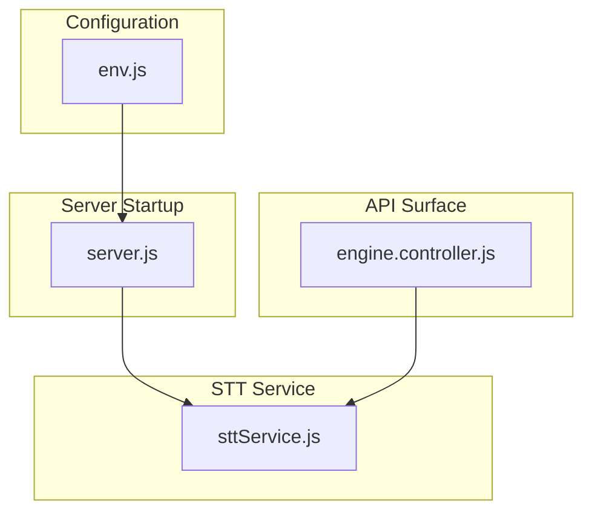
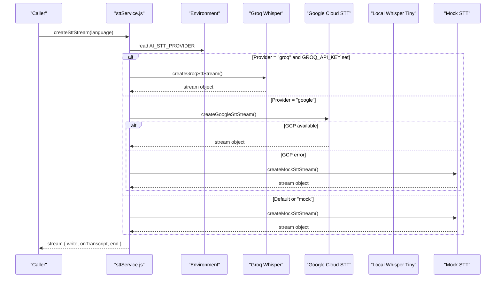
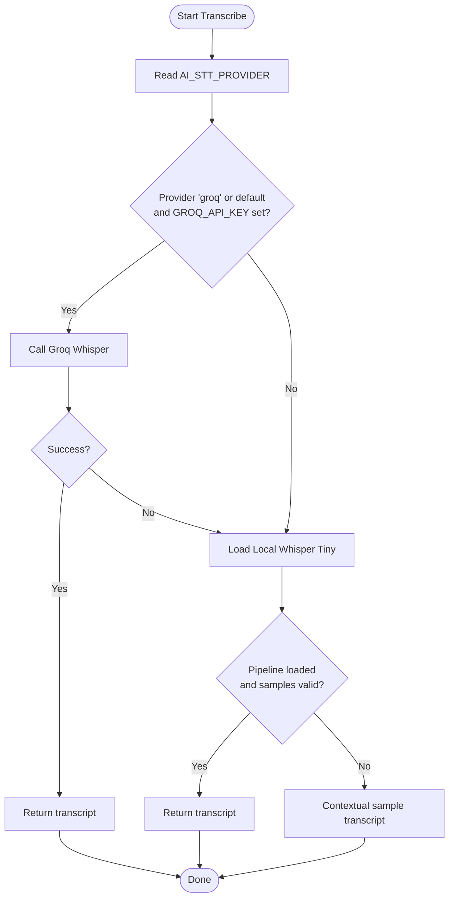
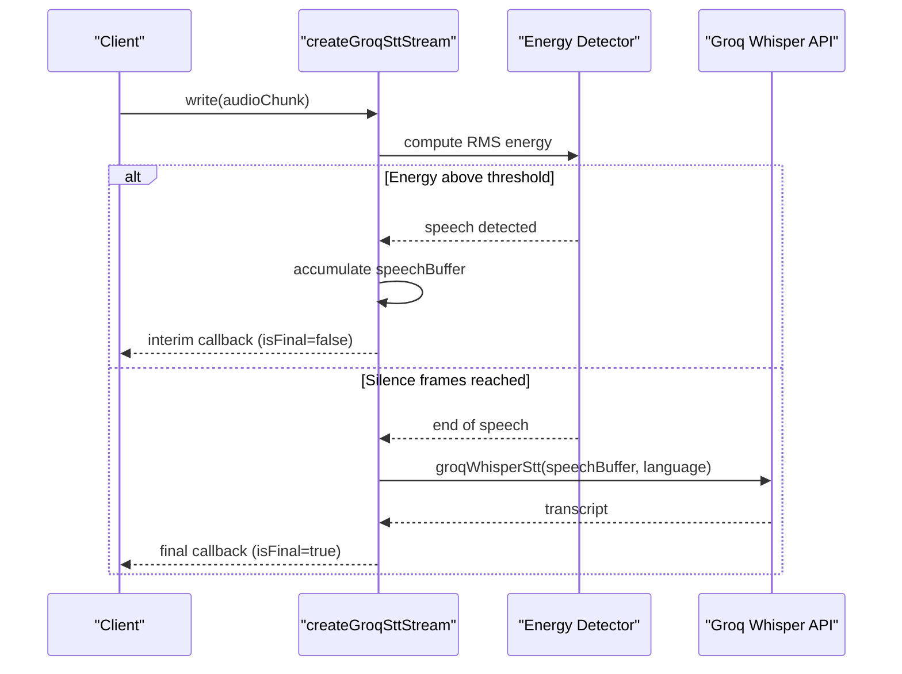
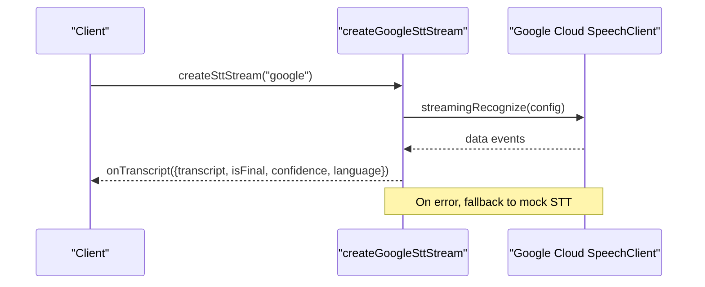
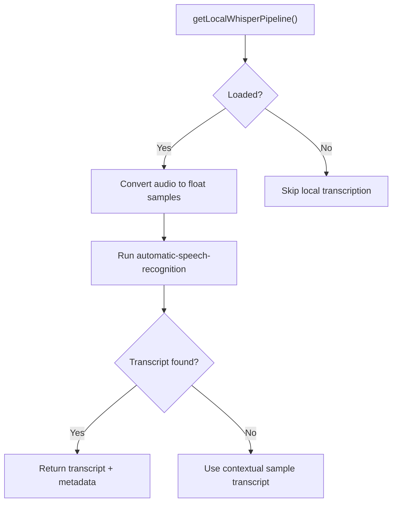
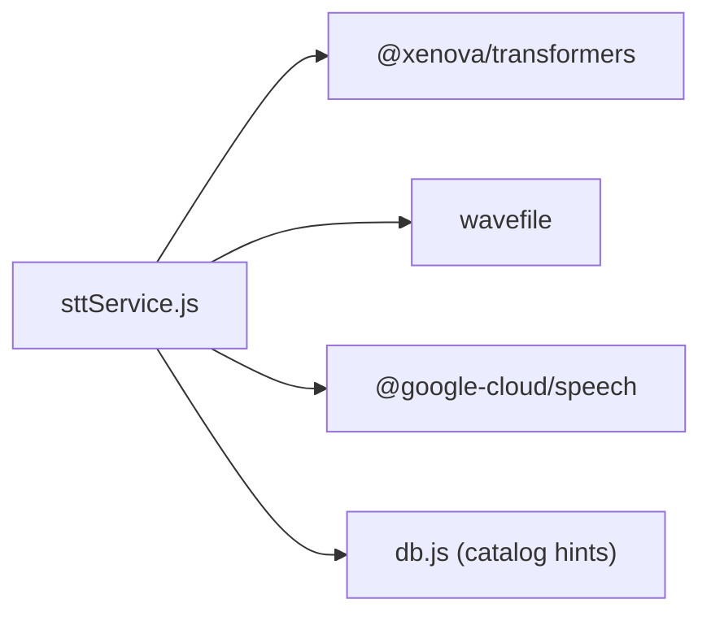

# Provider Configuration & Selection

<cite>
**Referenced Files in This Document**
- [sttService.js](file://server/src/services/sttService.js)
- [env.js](file://server/src/config/env.js)
- [engine.controller.js](file://server/src/controllers/engine.controller.js)
- [server.js](file://server/server.js)
- [package.json](file://server/package.json)
</cite>

## Table of Contents
1. [Introduction](#introduction)
2. [Project Structure](#project-structure)
3. [Core Components](#core-components)
4. [Architecture Overview](#architecture-overview)
5. [Detailed Component Analysis](#detailed-component-analysis)
6. [Dependency Analysis](#dependency-analysis)
7. [Performance Considerations](#performance-considerations)
8. [Troubleshooting Guide](#troubleshooting-guide)
9. [Conclusion](#conclusion)

## Introduction
This document explains how the server selects and configures Speech-to-Text (STT) providers at runtime. It focuses on:
- The AI_STT_PROVIDER environment variable for explicit provider selection
- Automatic detection and fallback logic when cloud credentials are missing
- Supported providers: Groq Whisper, Google Cloud STT, and a mock provider for development
- A local Whisper Tiny fallback that runs on-device when cloud providers are unavailable
- Configuration examples, environment setup, and troubleshooting steps

The goal is to help you configure the system reliably across environments and understand how the service chooses the best available provider based on runtime conditions.

## Project Structure
The STT provider selection and execution logic lives primarily in the STT service module. Environment validation and status reporting are handled by configuration and controller modules. The server startup logs the selected STT engine for visibility.

**Diagram sources**
- [server.js:18-47](file://server/server.js#L18-L47)
- [env.js:1-42](file://server/src/config/env.js#L1-L42)
- [engine.controller.js:1-25](file://server/src/controllers/engine.controller.js#L1-L25)
- [sttService.js:1-603](file://server/src/services/sttService.js#L1-L603)

**Section sources**
- [server.js:18-47](file://server/server.js#L18-L47)
- [env.js:1-42](file://server/src/config/env.js#L1-L42)
- [engine.controller.js:1-25](file://server/src/controllers/engine.controller.js#L1-L25)
- [sttService.js:1-603](file://server/src/services/sttService.js#L1-L603)

## Core Components
- STT Service: Implements provider selection, streaming interfaces, and fallbacks for Groq Whisper, Google Cloud STT, and a mock provider. Also includes a local Whisper Tiny pipeline as an on-device fallback.
- Environment Validation: Defines and validates environment variables including GROQ_API_KEY.
- Engine Status Controller: Exposes current STT provider and availability flags via API.
- Server Boot: Logs the active STT engine for operational visibility.

Key responsibilities:
- Provider selection based on AI_STT_PROVIDER and credential checks
- Streaming session creation with per-provider implementations
- Local Whisper Tiny loading and usage when cloud providers are not configured or fail
- Mock provider for development without external dependencies

**Section sources**
- [sttService.js:1-603](file://server/src/services/sttService.js#L1-L603)
- [env.js:1-42](file://server/src/config/env.js#L1-L42)
- [engine.controller.js:1-25](file://server/src/controllers/engine.controller.js#L1-L25)
- [server.js:18-47](file://server/server.js#L18-L47)

## Architecture Overview
The STT subsystem supports multiple providers and uses a priority-based selection mechanism:
- Explicit selection via AI_STT_PROVIDER
- Automatic fallback to local Whisper Tiny if cloud providers are unavailable
- Mock provider for development when no cloud credentials are present

**Diagram sources**
- [sttService.js:329-352](file://server/src/services/sttService.js#L329-L352)
- [sttService.js:358-454](file://server/src/services/sttService.js#L358-L454)
- [sttService.js:459-515](file://server/src/services/sttService.js#L459-L515)
- [sttService.js:521-602](file://server/src/services/sttService.js#L521-L602)

## Detailed Component Analysis

### Provider Selection Logic
- Streaming sessions are created via a central function that reads AI_STT_PROVIDER and applies the following order:
  - If AI_STT_PROVIDER is "groq" and GROQ_API_KEY is set, use Groq Whisper batch mode wrapped as a streaming interface.
  - If AI_STT_PROVIDER is "google", attempt to initialize Google Cloud STT; on failure, fall back to mock.
  - Otherwise, default to mock for development.
- Batch transcription also follows a similar priority:
  - If AI_STT_PROVIDER is unset or "mock" and GROQ_API_KEY is present, try Groq Whisper first.
  - If Groq fails or is not configured, try local Whisper Tiny.
  - If both fail, return a contextual sample transcript from the local audio engine.

**Diagram sources**
- [sttService.js:83-210](file://server/src/services/sttService.js#L83-L210)
- [sttService.js:18-43](file://server/src/services/sttService.js#L18-L43)

**Section sources**
- [sttService.js:83-210](file://server/src/services/sttService.js#L83-L210)
- [sttService.js:329-352](file://server/src/services/sttService.js#L329-L352)

### Groq Whisper Provider
- Requirements:
  - Set AI_STT_PROVIDER to "groq" or leave unset/default and ensure GROQ_API_KEY is configured.
- Behavior:
  - Uses batch transcription endpoint with model whisper-large-v3-turbo.
  - Wraps batch calls into a streaming-compatible interface using energy-based voice activity detection to chunk audio and send final transcripts after silence.
  - Returns structured results including transcript, language, confidence, latency, and provider name.

**Diagram sources**
- [sttService.js:358-454](file://server/src/services/sttService.js#L358-L454)
- [sttService.js:218-294](file://server/src/services/sttService.js#L218-L294)

**Section sources**
- [sttService.js:218-294](file://server/src/services/sttService.js#L218-L294)
- [sttService.js:358-454](file://server/src/services/sttService.js#L358-L454)

### Google Cloud STT Provider
- Requirements:
  - Set AI_STT_PROVIDER to "google".
  - Ensure Google Cloud credentials are available (e.g., GOOGLE_APPLICATION_CREDENTIALS).
- Behavior:
  - Creates a streaming recognition session with language hints and optional alternative languages.
  - Emits interim and final transcripts via callbacks.
  - On initialization errors, falls back to mock STT.

**Diagram sources**
- [sttService.js:459-515](file://server/src/services/sttService.js#L459-L515)
- [engine.controller.js:13-17](file://server/src/controllers/engine.controller.js#L13-L17)

**Section sources**
- [sttService.js:459-515](file://server/src/services/sttService.js#L459-L515)
- [engine.controller.js:13-17](file://server/src/controllers/engine.controller.js#L13-L17)

### Local Whisper Tiny Fallback
- Purpose:
  - Provide on-device transcription when cloud providers are unavailable or fail.
- Behavior:
  - Loads a small Whisper model locally via a transformers pipeline.
  - Converts incoming audio buffers to appropriate formats and runs inference.
  - Returns structured results with transcript, language, confidence, and provider name.
- Notes:
  - Used automatically when Groq is not configured or fails during batch transcription.
  - Also used as a secondary path in streaming if Groq is not selected.

**Diagram sources**
- [sttService.js:18-43](file://server/src/services/sttService.js#L18-L43)
- [sttService.js:151-188](file://server/src/services/sttService.js#L151-L188)

**Section sources**
- [sttService.js:18-43](file://server/src/services/sttService.js#L18-L43)
- [sttService.js:151-188](file://server/src/services/sttService.js#L151-L188)

### Mock Provider
- Purpose:
  - Enable development without external credentials.
- Behavior:
  - Simulates speech detection and emits interim/final transcripts based on audio energy thresholds.
  - Useful for testing UI and integration flows.

**Section sources**
- [sttService.js:521-602](file://server/src/services/sttService.js#L521-L602)

### Environment Variables and Configuration
- AI_STT_PROVIDER:
  - Controls explicit provider selection: "groq", "google", or "mock".
  - If unset, defaults to "mock" for streaming and triggers automatic fallback behavior in batch transcription.
- GROQ_API_KEY:
  - Required for Groq Whisper usage.
  - When present, enables automatic Groq usage even if AI_STT_PROVIDER is unset or "mock" in batch transcription.
- GOOGLE_APPLICATION_CREDENTIALS:
  - Required for Google Cloud STT streaming.
  - Availability is reported via the engine status API.

Validation:
- GROQ_API_KEY is defined and validated in the environment schema.

Startup logging:
- The server logs the active STT engine at boot, indicating whether local Whisper is being used when applicable.

**Section sources**
- [env.js:1-42](file://server/src/config/env.js#L1-L42)
- [engine.controller.js:13-17](file://server/src/controllers/engine.controller.js#L13-L17)
- [server.js:43-45](file://server/server.js#L43-L45)

## Dependency Analysis
- External libraries:
  - @xenova/transformers: Used to load and run local Whisper Tiny for on-device transcription.
  - wavefile: Used to convert PCM buffers to WAV format for APIs and local processing.
  - @google-cloud/speech: Used for Google Cloud STT streaming (imported dynamically).
- Internal dependencies:
  - Database access for catalog hints used in Google STT contexts.
  - Latency tracing and metrics infrastructure can be integrated around STT stages.

**Diagram sources**
- [sttService.js:12-13](file://server/src/services/sttService.js#L12-L13)
- [sttService.js:30-34](file://server/src/services/sttService.js#L30-L34)
- [sttService.js:459-461](file://server/src/services/sttService.js#L459-L461)
- [sttService.js:60-74](file://server/src/services/sttService.js#L60-L74)

**Section sources**
- [sttService.js:12-13](file://server/src/services/sttService.js#L12-L13)
- [sttService.js:30-34](file://server/src/services/sttService.js#L30-L34)
- [sttService.js:459-461](file://server/src/services/sttService.js#L459-L461)
- [sttService.js:60-74](file://server/src/services/sttService.js#L60-L74)
- [package.json:12-27](file://server/package.json#L12-L27)

## Performance Considerations
- Groq Whisper:
  - Batch mode with energy-based chunking reduces network calls and improves perceived latency.
  - Timeouts are applied to prevent hanging requests.
- Local Whisper Tiny:
  - On-device inference avoids network latency but depends on CPU resources.
  - Model loading is cached to avoid repeated downloads.
- Google Cloud STT:
  - Streaming provides low-latency interim results; ensure credentials are correctly configured to avoid fallback delays.
- Mock STT:
  - Suitable for development; does not reflect production performance.

[No sources needed since this section provides general guidance]

## Troubleshooting Guide
Common issues and resolutions:
- No STT output in development:
  - Ensure AI_STT_PROVIDER is set appropriately or left unset to trigger automatic fallback.
  - Verify that mock provider is active when no cloud credentials are present.
- Groq Whisper not used:
  - Confirm GROQ_API_KEY is set.
  - If AI_STT_PROVIDER is explicitly set to "google" or "mock", Groq will not be selected unless overridden.
- Google Cloud STT failing:
  - Ensure GOOGLE_APPLICATION_CREDENTIALS is configured.
  - On initialization errors, the system falls back to mock; check logs for transition messages.
- Local Whisper Tiny not loading:
  - First-time model download may take time; subsequent loads are cached.
  - If loading fails, batch transcription will still attempt Groq if configured, otherwise return contextual sample transcripts.
- Verifying active provider:
  - Use the engine status endpoint to inspect current STT provider and availability flags.
  - Check server startup logs for the active STT engine indication.

**Section sources**
- [sttService.js:83-210](file://server/src/services/sttService.js#L83-L210)
- [sttService.js:329-352](file://server/src/services/sttService.js#L329-L352)
- [engine.controller.js:13-17](file://server/src/controllers/engine.controller.js#L13-L17)
- [server.js:43-45](file://server/server.js#L43-L45)

## Conclusion
The STT subsystem provides flexible provider selection through AI_STT_PROVIDER and robust automatic fallbacks:
- Prefer Groq Whisper when credentials are available
- Fall back to local Whisper Tiny when cloud providers are unavailable
- Use Google Cloud STT when explicitly configured and credentials are present
- Default to mock for development without external dependencies

This design ensures reliable operation across environments while allowing explicit control over provider choice. Use the engine status endpoint and startup logs to verify configuration and troubleshoot issues effectively.

[No sources needed since this section summarizes without analyzing specific files]