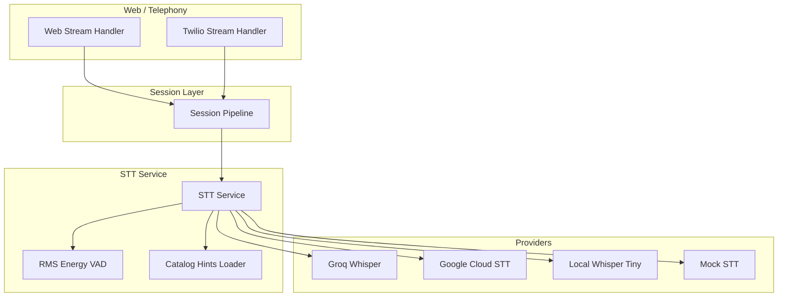
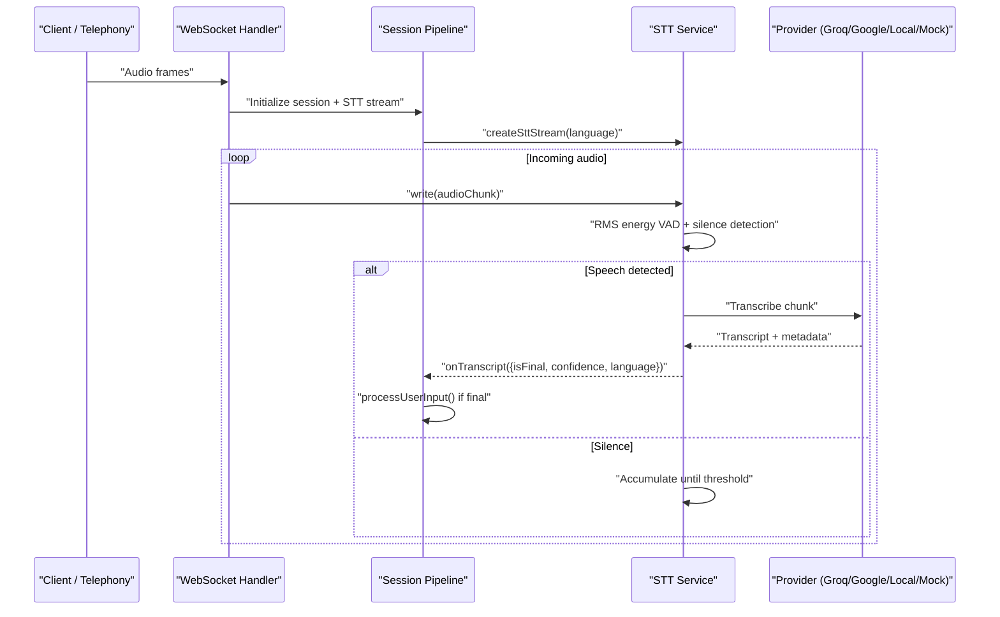
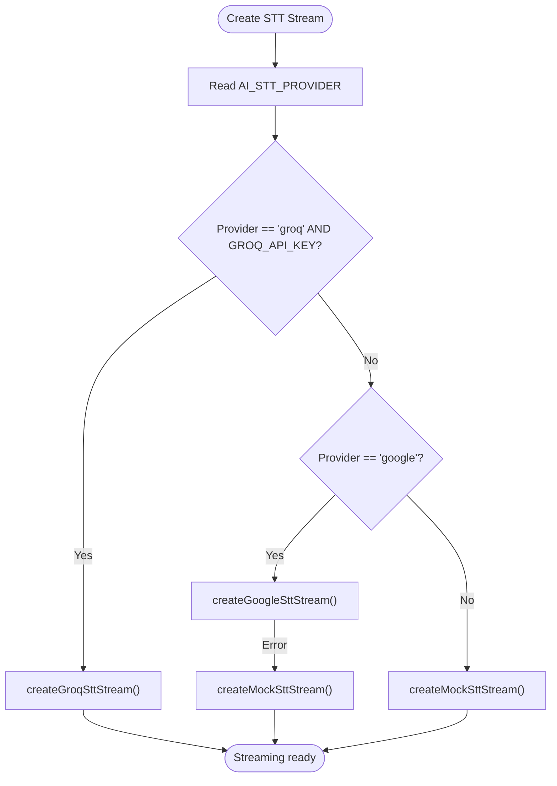
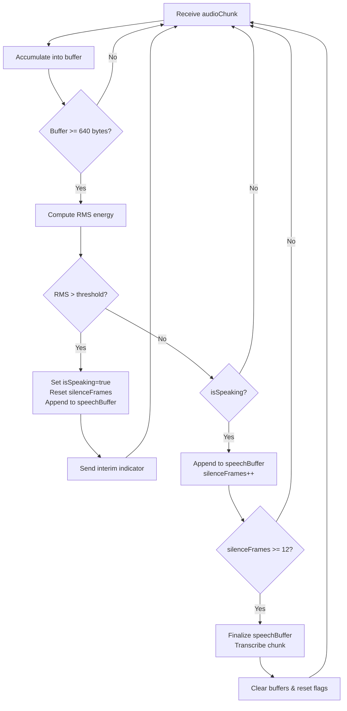
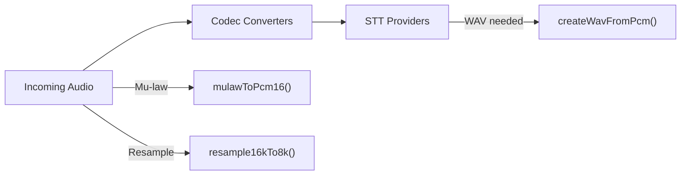
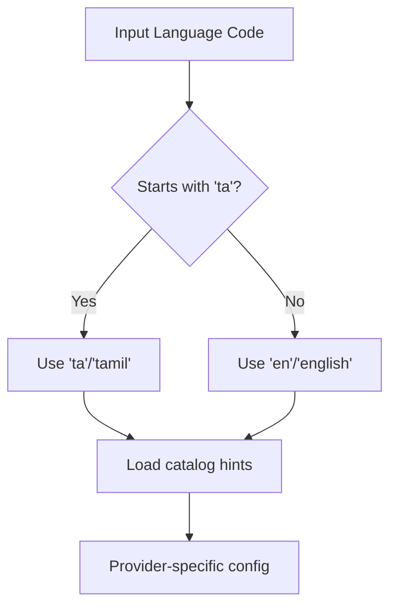
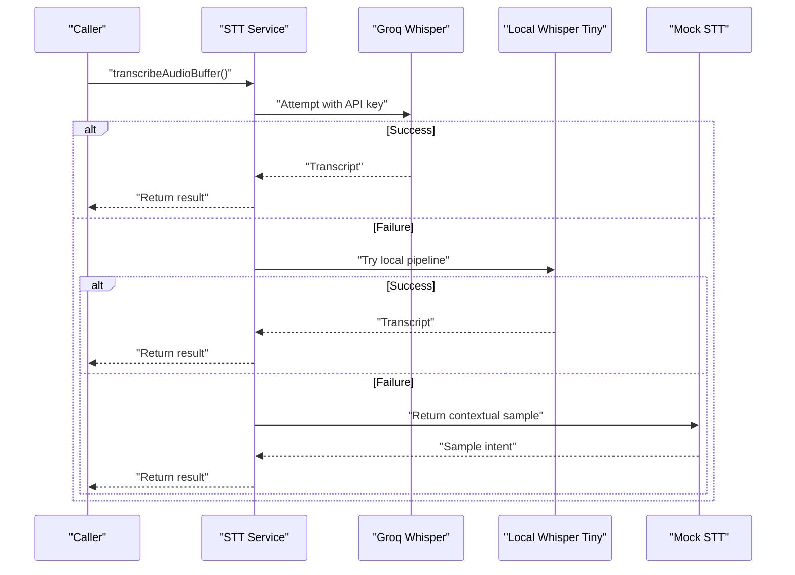
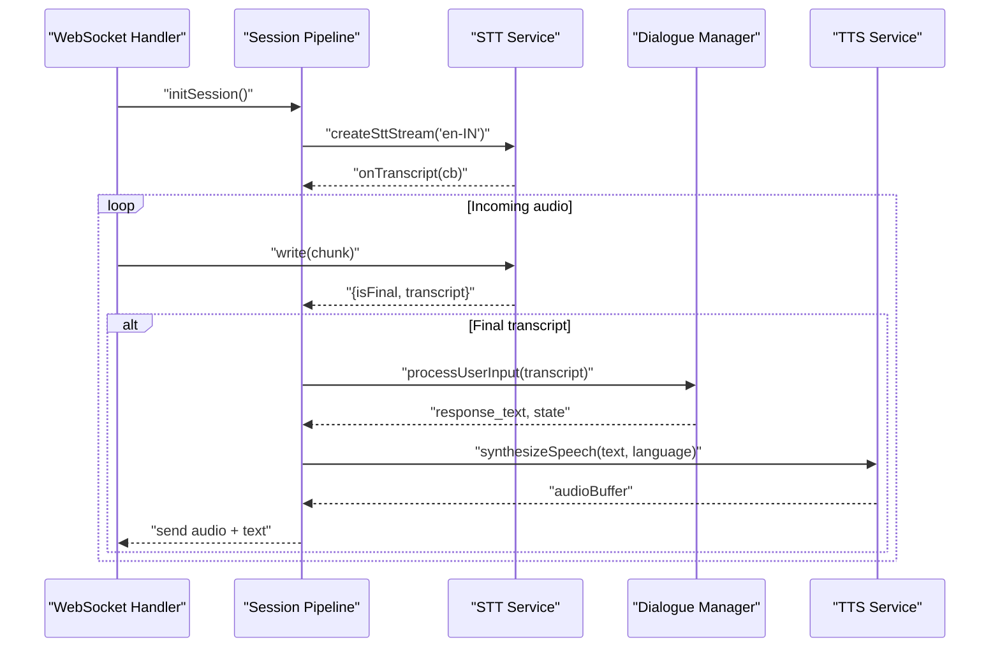
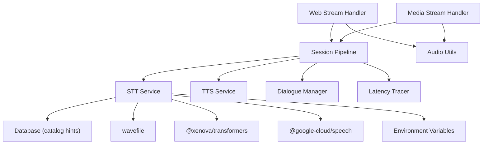

# Speech-to-Text Service

<cite>
**Referenced Files in This Document**
- [sttService.js](file://server/src/services/sttService.js)
- [audioUtils.js](file://server/src/utils/audioUtils.js)
- [env.js](file://server/src/config/env.js)
- [mediaStreamHandler.js](file://server/src/websocket/mediaStreamHandler.js)
- [webStreamHandler.js](file://server/src/websocket/webStreamHandler.js)
- [sessionPipeline.js](file://server/src/websocket/sessionPipeline.js)
- [engine.controller.js](file://server/src/controllers/engine.controller.js)
- [catalog.repository.js](file://server/src/domain/catalog/catalog.repository.js)
- [latencyTracer.js](file://server/src/services/latencyTracer.js)
- [package.json](file://server/package.json)
</cite>

## Table of Contents
1. [Introduction](#introduction)
2. [Project Structure](#project-structure)
3. [Core Components](#core-components)
4. [Architecture Overview](#architecture-overview)
5. [Detailed Component Analysis](#detailed-component-analysis)
6. [Dependency Analysis](#dependency-analysis)
7. [Performance Considerations](#performance-considerations)
8. [Troubleshooting Guide](#troubleshooting-guide)
9. [Conclusion](#conclusion)
10. [Appendices](#appendices)

## Introduction
This document explains the Speech-to-Text (STT) service that powers multi-provider transcription for voice ordering. It supports:
- Provider selection via AI_STT_PROVIDER with fallbacks to local Whisper Tiny and a mock engine
- Audio format handling for M4A, WAV, MP3, and WebM
- Language detection and hints for English and Tamil
- Streaming architecture with Voice Activity Detection (VAD) using RMS energy calculation, silence thresholds, and chunk-based processing
- Fallback mechanisms when providers are unavailable
- Catalog hints integration to improve accuracy for food ordering contexts
- Configuration examples, performance metrics, latency optimization strategies, and troubleshooting guidance

## Project Structure
The STT service is implemented as a modular backend component integrated into WebSocket-based call sessions. Key responsibilities:
- STT provider routing and streaming
- Audio codec conversion and resampling
- Session lifecycle management and transcript dispatch
- Latency tracing and metrics

**Diagram sources**
- [webStreamHandler.js:1-81](file://server/src/websocket/webStreamHandler.js#L1-L81)
- [mediaStreamHandler.js:1-69](file://server/src/websocket/mediaStreamHandler.js#L1-L69)
- [sessionPipeline.js:1-111](file://server/src/websocket/sessionPipeline.js#L1-L111)
- [sttService.js:329-352](file://server/src/services/sttService.js#L329-L352)

**Section sources**
- [webStreamHandler.js:1-81](file://server/src/websocket/webStreamHandler.js#L1-L81)
- [mediaStreamHandler.js:1-69](file://server/src/websocket/mediaStreamHandler.js#L1-L69)
- [sessionPipeline.js:1-111](file://server/src/websocket/sessionPipeline.js#L1-L111)
- [sttService.js:329-352](file://server/src/services/sttService.js#L329-L352)

## Core Components
- STT Service: Multi-provider router, batch and streaming interfaces, local Whisper pipeline, catalog hints integration
- Audio Utilities: Mu-law/PCM conversions and resampling for telephony streams
- Session Pipeline: Initializes STT stream, handles transcripts, orchestrates dialogue and audio responses
- Web and Media Handlers: Ingest audio from web clients or telephony providers and feed STT streams
- Engine Controller: Exposes provider status including STT configuration state
- Latency Tracer: Tracks per-turn stage latencies across VAD, STT, LLM, and TTS

**Section sources**
- [sttService.js:1-603](file://server/src/services/sttService.js#L1-L603)
- [audioUtils.js:1-84](file://server/src/utils/audioUtils.js#L1-L84)
- [sessionPipeline.js:1-437](file://server/src/websocket/sessionPipeline.js#L1-L437)
- [webStreamHandler.js:1-81](file://server/src/websocket/webStreamHandler.js#L1-L81)
- [mediaStreamHandler.js:1-69](file://server/src/websocket/mediaStreamHandler.js#L1-L69)
- [engine.controller.js:1-24](file://server/src/controllers/engine.controller.js#L1-L24)
- [latencyTracer.js:1-46](file://server/src/services/latencyTracer.js#L1-L46)

## Architecture Overview
The system routes incoming audio through a session pipeline to an STT stream. The STT stream selects a provider based on environment configuration and falls back gracefully. For Groq mode, it implements VAD-like chunking using RMS energy to detect speech boundaries before sending chunks to the provider. Google mode uses native streaming recognition. Local Whisper Tiny runs on-device inference when available. A mock engine provides development-time simulation.

**Diagram sources**
- [mediaStreamHandler.js:40-49](file://server/src/websocket/mediaStreamHandler.js#L40-L49)
- [webStreamHandler.js:23-70](file://server/src/websocket/webStreamHandler.js#L23-L70)
- [sessionPipeline.js:24-73](file://server/src/websocket/sessionPipeline.js#L24-L73)
- [sttService.js:329-454](file://server/src/services/sttService.js#L329-L454)

## Detailed Component Analysis

### STT Service: Provider Selection and Streaming
- Provider selection:
  - Reads AI_STT_PROVIDER; defaults to mock if not set
  - If groq and GROQ_API_KEY configured, uses Groq Whisper Large v3 Turbo in batch mode with VAD-like chunking
  - If google, attempts Google Cloud STT streaming; falls back to mock on error
  - Otherwise uses mock STT for development
- Batch transcription:
  - transcribeAudioBuffer supports M4A, WAV, MP3, WebM formats
  - Attempts Groq first if API key present, then local Whisper Tiny, then returns contextual sample intents
- Local Whisper Tiny:
  - Loads Xenova whisper-tiny pipeline once and caches it
  - Converts input to float samples and transcribes with language hint
- Catalog hints:
  - Loads stt_hints from catalog database and merges with default food-related phrases
  - Used by Google streaming to boost phrase recognition

**Diagram sources**
- [sttService.js:329-352](file://server/src/services/sttService.js#L329-L352)

**Section sources**
- [sttService.js:18-43](file://server/src/services/sttService.js#L18-L43)
- [sttService.js:45-74](file://server/src/services/sttService.js#L45-L74)
- [sttService.js:76-210](file://server/src/services/sttService.js#L76-L210)
- [sttService.js:218-294](file://server/src/services/sttService.js#L218-L294)
- [sttService.js:329-352](file://server/src/services/sttService.js#L329-L352)

### Voice Activity Detection (VAD) Using RMS Energy
- Both Groq and Mock streams implement VAD-like logic:
  - Compute RMS energy over recent PCM16 samples
  - Threshold above which speech is considered active
  - Accumulate audio while speaking; count silent frames after last speech
  - When silence frames exceed threshold, finalize chunk and send to provider
- Parameters:
  - Minimum buffer length to process (~640 bytes at 8kHz)
  - RMS threshold around 500
  - Silence frames threshold around 12
  - Interim indicators sent during speech to signal activity

**Diagram sources**
- [sttService.js:358-454](file://server/src/services/sttService.js#L358-L454)
- [sttService.js:521-602](file://server/src/services/sttService.js#L521-L602)

**Section sources**
- [sttService.js:358-454](file://server/src/services/sttService.js#L358-L454)
- [sttService.js:521-602](file://server/src/services/sttService.js#L521-L602)

### Audio Format Handling and Codec Conversion
- Supported formats for batch transcription:
  - M4A, WAV, MP3, WebM
- Telephony audio path:
  - Twilio sends 8kHz mu-law; converted to PCM16 for STT
  - Resampling utilities support 16kHz to 8kHz decimation
- WAV creation:
  - Minimal WAV header generation for PCM16 inputs to Groq API

**Diagram sources**
- [mediaStreamHandler.js:40-49](file://server/src/websocket/mediaStreamHandler.js#L40-L49)
- [audioUtils.js:21-83](file://server/src/utils/audioUtils.js#L21-L83)
- [sttService.js:296-323](file://server/src/services/sttService.js#L296-L323)

**Section sources**
- [mediaStreamHandler.js:40-49](file://server/src/websocket/mediaStreamHandler.js#L40-L49)
- [audioUtils.js:21-83](file://server/src/utils/audioUtils.js#L21-L83)
- [sttService.js:296-323](file://server/src/services/sttService.js#L296-L323)

### Language Detection and Hints for English and Tamil
- Language hints:
  - Default hints include common Indian food terms and numbers in both languages
  - Catalog hints loaded from database augment recognition accuracy
- Language mapping:
  - Groq batch and streaming map language codes to 'ta' or 'en'
  - Google streaming sets alternativeLanguageCodes for cross-language fallback
  - Local Whisper Tiny maps language to 'tamil' or 'english'

**Diagram sources**
- [sttService.js:45-74](file://server/src/services/sttService.js#L45-L74)
- [sttService.js:83-111](file://server/src/services/sttService.js#L83-L111)
- [sttService.js:170-183](file://server/src/services/sttService.js#L170-L183)
- [sttService.js:459-475](file://server/src/services/sttService.js#L459-L475)

**Section sources**
- [sttService.js:45-74](file://server/src/services/sttService.js#L45-L74)
- [sttService.js:83-111](file://server/src/services/sttService.js#L83-L111)
- [sttService.js:170-183](file://server/src/services/sttService.js#L170-L183)
- [sttService.js:459-475](file://server/src/services/sttService.js#L459-L475)

### Fallback Mechanisms and Catalog Hints Integration
- Fallback order:
  - Groq Whisper if API key configured
  - Local Whisper Tiny if model loads successfully
  - Mock STT for development or when cloud providers fail
- Catalog hints:
  - Loaded from catalog table and merged with defaults
  - Boosted in Google streaming via speechContexts phrases
  - Improve accuracy for food ordering context

**Diagram sources**
- [sttService.js:76-210](file://server/src/services/sttService.js#L76-L210)
- [sttService.js:329-352](file://server/src/services/sttService.js#L329-L352)

**Section sources**
- [sttService.js:76-210](file://server/src/services/sttService.js#L76-L210)
- [sttService.js:329-352](file://server/src/services/sttService.js#L329-L352)
- [catalog.repository.js:31-67](file://server/src/domain/catalog/catalog.repository.js#L31-L67)

### Session Integration and Transcript Processing
- Session initialization creates an STT stream and wires transcript callbacks
- Final transcripts trigger dialogue processing and audio response synthesis
- Dashboard broadcasts and client notifications include transcript events

**Diagram sources**
- [sessionPipeline.js:24-111](file://server/src/websocket/sessionPipeline.js#L24-L111)
- [sessionPipeline.js:132-219](file://server/src/websocket/sessionPipeline.js#L132-L219)
- [sessionPipeline.js:224-294](file://server/src/websocket/sessionPipeline.js#L224-L294)

**Section sources**
- [sessionPipeline.js:24-111](file://server/src/websocket/sessionPipeline.js#L24-L111)
- [sessionPipeline.js:132-219](file://server/src/websocket/sessionPipeline.js#L132-L219)
- [sessionPipeline.js:224-294](file://server/src/websocket/sessionPipeline.js#L224-L294)

## Dependency Analysis
- STT Service depends on:
  - Database access for catalog hints
  - wavefile library for WAV handling
  - @xenova/transformers for local Whisper Tiny
  - Google Cloud Speech SDK for streaming
  - Environment variables for provider configuration
- Session Pipeline depends on:
  - STT Service for transcription
  - TTS Service for audio responses
  - Dialogue Manager for conversation flow
  - Latency Tracer for metrics
- Web and Media Handlers depend on:
  - Audio Utils for codec conversion
  - Session Pipeline for lifecycle management

**Diagram sources**
- [sttService.js:12-13](file://server/src/services/sttService.js#L12-L13)
- [sttService.js:30-35](file://server/src/services/sttService.js#L30-L35)
- [sttService.js:459-475](file://server/src/services/sttService.js#L459-L475)
- [sessionPipeline.js:1-16](file://server/src/websocket/sessionPipeline.js#L1-L16)
- [mediaStreamHandler.js:1-2](file://server/src/websocket/mediaStreamHandler.js#L1-L2)
- [webStreamHandler.js:1-2](file://server/src/websocket/webStreamHandler.js#L1-L2)

**Section sources**
- [sttService.js:12-13](file://server/src/services/sttService.js#L12-L13)
- [sttService.js:30-35](file://server/src/services/sttService.js#L30-L35)
- [sttService.js:459-475](file://server/src/services/sttService.js#L459-L475)
- [sessionPipeline.js:1-16](file://server/src/websocket/sessionPipeline.js#L1-L16)
- [mediaStreamHandler.js:1-2](file://server/src/websocket/mediaStreamHandler.js#L1-L2)
- [webStreamHandler.js:1-2](file://server/src/websocket/webStreamHandler.js#L1-L2)

## Performance Considerations
- VAD tuning:
  - RMS threshold and silence frame counts affect responsiveness and false positives
  - Adjust thresholds based on noise environment and speaker characteristics
- Chunk sizing:
  - Minimum buffer size ensures sufficient data for RMS calculation
  - Larger chunks reduce API calls but increase latency
- Provider selection:
  - Groq Whisper offers fast batch transcription with good Tamil support
  - Google Cloud STT provides real-time streaming with phrase boosting
  - Local Whisper Tiny reduces dependency on external services
- Latency tracking:
  - Turn traces capture per-stage durations for analysis
  - Metrics help identify bottlenecks in STT, LLM, and TTS stages

[No sources needed since this section provides general guidance]

## Troubleshooting Guide
- Provider not selected:
  - Verify AI_STT_PROVIDER and required API keys are set
  - Check engine status endpoint for provider configuration
- Transcription failures:
  - Inspect logs for provider errors and timeouts
  - Ensure audio format matches provider expectations
- Poor accuracy:
  - Add more catalog hints for domain-specific terms
  - Tune VAD thresholds to avoid premature finalization
- High latency:
  - Reduce chunk sizes or adjust silence thresholds
  - Monitor turn traces to identify slow stages

**Section sources**
- [engine.controller.js:1-24](file://server/src/controllers/engine.controller.js#L1-L24)
- [sttService.js:146-148](file://server/src/services/sttService.js#L146-L148)
- [sttService.js:277-280](file://server/src/services/sttService.js#L277-L280)
- [latencyTracer.js:1-46](file://server/src/services/latencyTracer.js#L1-L46)

## Conclusion
The STT service provides a robust, multi-provider transcription pipeline tailored for voice ordering. It combines VAD-based chunking, catalog hints, and graceful fallbacks to deliver reliable performance across different environments. Proper configuration and tuning can optimize accuracy and latency for production use.

[No sources needed since this section summarizes without analyzing specific files]

## Appendices

### Configuration Examples
- Environment variables:
  - AI_STT_PROVIDER: Select provider ('groq', 'google', or unset for mock)
  - GROQ_API_KEY: Required for Groq Whisper
  - GOOGLE_APPLICATION_CREDENTIALS: Required for Google Cloud STT
  - SARVAM_API_KEY: Optional for TTS provider
- Validation:
  - Environment schema validates required fields and defaults

**Section sources**
- [env.js:1-42](file://server/src/config/env.js#L1-L42)
- [engine.controller.js:1-24](file://server/src/controllers/engine.controller.js#L1-L24)

### Dependencies
- Key packages:
  - @xenova/transformers: Local Whisper Tiny
  - wavefile: WAV handling
  - ws: WebSocket server
  - zod: Environment validation

**Section sources**
- [package.json:12-26](file://server/package.json#L12-L26)