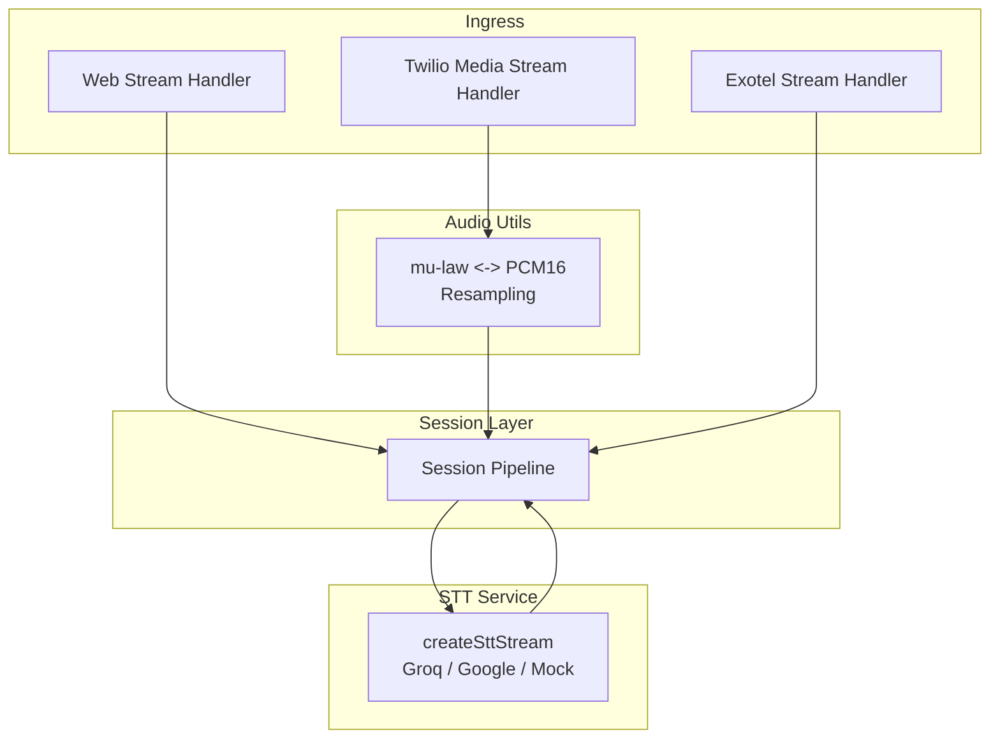
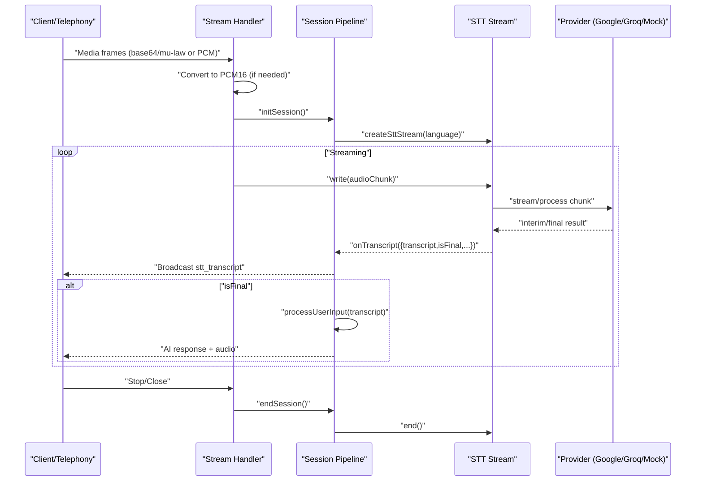
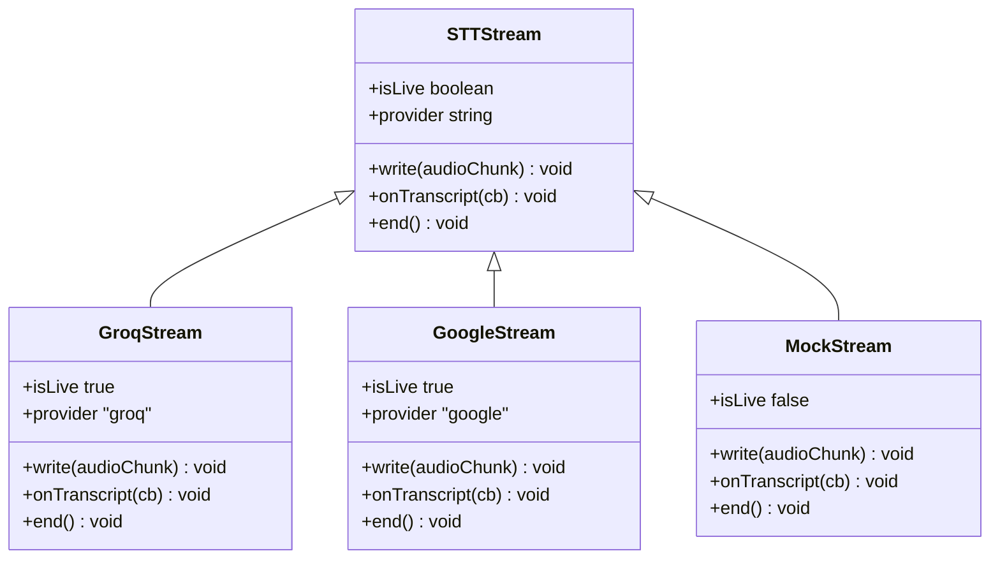
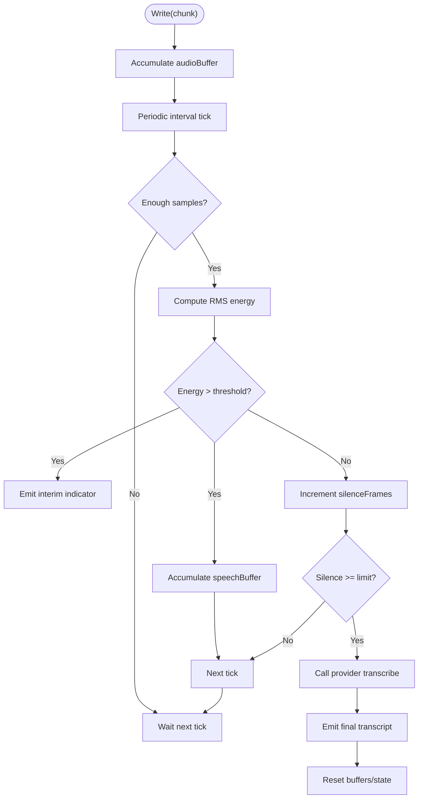
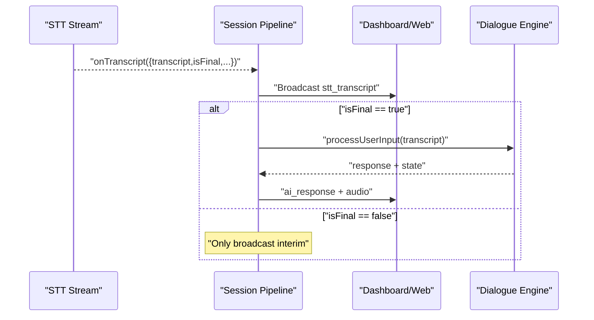
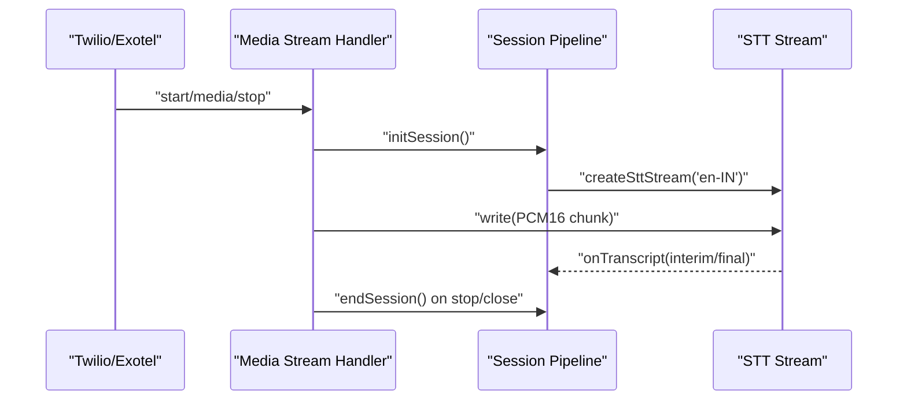
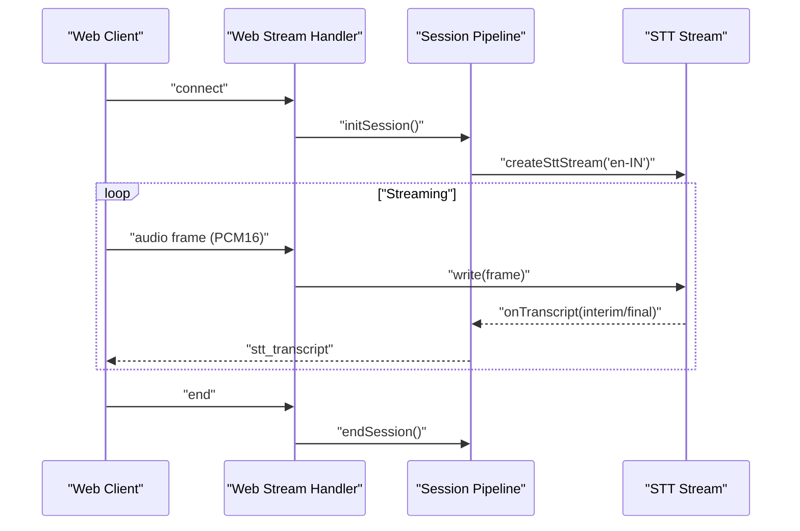
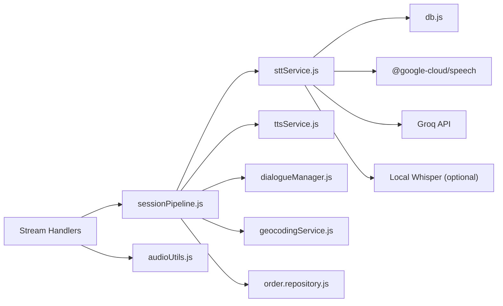

# Streaming Transcription Pipeline

<cite>
**Referenced Files in This Document**
- [sttService.js](file://server/src/services/sttService.js)
- [sessionPipeline.js](file://server/src/websocket/sessionPipeline.js)
- [webStreamHandler.js](file://server/src/websocket/webStreamHandler.js)
- [mediaStreamHandler.js](file://server/src/websocket/mediaStreamHandler.js)
- [exotelStreamHandler.js](file://server/src/websocket/exotelStreamHandler.js)
- [audioUtils.js](file://server/src/utils/audioUtils.js)
</cite>

## Table of Contents
1. [Introduction](#introduction)
2. [Project Structure](#project-structure)
3. [Core Components](#core-components)
4. [Architecture Overview](#architecture-overview)
5. [Detailed Component Analysis](#detailed-component-analysis)
6. [Dependency Analysis](#dependency-analysis)
7. [Performance Considerations](#performance-considerations)
8. [Troubleshooting Guide](#troubleshooting-guide)
9. [Conclusion](#conclusion)
10. [Appendices](#appendices)

## Introduction
This document explains the streaming transcription architecture that powers real-time audio processing and incremental transcript updates across voice call workflows and web applications. It focuses on the unified streaming interface provided by createSttStream, the chunk-based processing pipeline that accumulates audio, detects speech boundaries, and triggers transcription at appropriate intervals, and the callback mechanism for interim and final transcripts. It also covers error handling in streaming contexts and resource cleanup procedures, with practical integration examples for telephony (Twilio/Exotel) and web clients.

## Project Structure
The streaming transcription system spans a small set of focused modules:
- STT service: provider-agnostic streaming abstraction and batch transcription utilities
- Session pipeline: orchestrates sessions, wires up STT callbacks, and drives dialogue flow
- Stream handlers: adapt incoming media from different sources (web, Twilio, Exotel) into the session pipeline
- Audio utilities: codec conversions required by telephony providers

**Diagram sources**
- [webStreamHandler.js:1-81](file://server/src/websocket/webStreamHandler.js#L1-L81)
- [mediaStreamHandler.js:1-69](file://server/src/websocket/mediaStreamHandler.js#L1-L69)
- [exotelStreamHandler.js:1-80](file://server/src/websocket/exotelStreamHandler.js#L1-L80)
- [sessionPipeline.js:1-437](file://server/src/websocket/sessionPipeline.js#L1-L437)
- [sttService.js:1-603](file://server/src/services/sttService.js#L1-L603)
- [audioUtils.js:1-84](file://server/src/utils/audioUtils.js#L1-L84)

**Section sources**
- [webStreamHandler.js:1-81](file://server/src/websocket/webStreamHandler.js#L1-L81)
- [mediaStreamHandler.js:1-69](file://server/src/websocket/mediaStreamHandler.js#L1-L69)
- [exotelStreamHandler.js:1-80](file://server/src/websocket/exotelStreamHandler.js#L1-L80)
- [sessionPipeline.js:1-437](file://server/src/websocket/sessionPipeline.js#L1-L437)
- [sttService.js:1-603](file://server/src/services/sttService.js#L1-L603)
- [audioUtils.js:1-84](file://server/src/utils/audioUtils.js#L1-L84)

## Core Components
- Unified streaming interface: createSttStream returns an object with write(), onTranscript(cb), and end() methods, abstracting provider-specific behavior behind a consistent API.
- Provider implementations:
  - Groq Whisper (batch mode with VAD-like chunking): accumulates audio, uses RMS energy to detect speech/silence, emits interim indicators during speech, and sends final transcripts after silence thresholds.
  - Google Cloud STT (streaming): streams audio chunks directly to the provider’s streamingRecognize stream; emits interim and final results as they arrive.
  - Mock STT (development): simulates speech detection and progressive transcript output for local development without credentials.
- Session pipeline: initializes STT streams per session, subscribes to onTranscript, broadcasts interim/final transcripts to dashboards and web clients, and processes final transcripts through the dialogue engine.
- Stream handlers: normalize incoming media formats and forward PCM16 chunks to sttStream.write().
- Audio utilities: convert between mu-law and PCM16 and resample where necessary to meet STT expectations.

**Section sources**
- [sttService.js:325-603](file://server/src/services/sttService.js#L325-L603)
- [sessionPipeline.js:24-111](file://server/src/websocket/sessionPipeline.js#L24-L111)
- [mediaStreamHandler.js:40-49](file://server/src/websocket/mediaStreamHandler.js#L40-L49)
- [exotelStreamHandler.js:45-56](file://server/src/websocket/exotelStreamHandler.js#L45-L56)
- [audioUtils.js:21-33](file://server/src/utils/audioUtils.js#L21-L33)

## Architecture Overview
The pipeline ingests audio from multiple sources, converts it to a common format (PCM16), feeds it into a provider-agnostic STT stream, and reacts to interim and final transcript events to drive conversation state and TTS responses.

**Diagram sources**
- [mediaStreamHandler.js:40-49](file://server/src/websocket/mediaStreamHandler.js#L40-L49)
- [exotelStreamHandler.js:45-56](file://server/src/websocket/exotelStreamHandler.js#L45-L56)
- [sessionPipeline.js:24-111](file://server/src/websocket/sessionPipeline.js#L24-L111)
- [sttService.js:325-603](file://server/src/services/sttService.js#L325-L603)

## Detailed Component Analysis

### Unified STT Stream Interface: createSttStream
- Purpose: Provide a single entry point to obtain a streaming transcription session regardless of provider.
- Behavior:
  - Selects provider based on environment configuration.
  - Returns an object implementing:
    - write(audioChunk): feed PCM16 audio chunks
    - onTranscript(cb): register callbacks for interim/final transcripts
    - end(): finalize stream and clean up resources
  - Provides metadata flags like isLive and provider for diagnostics.

**Diagram sources**
- [sttService.js:325-603](file://server/src/services/sttService.js#L325-L603)

**Section sources**
- [sttService.js:325-352](file://server/src/services/sttService.js#L325-L352)

### Chunk-Based Processing and Speech Boundary Detection
- Groq path (batch-mode with VAD-like logic):
  - Accumulates audio in memory.
  - Computes RMS energy over short windows to detect speech vs silence.
  - Emits interim indicators while speech is detected.
  - After a configured silence threshold, triggers transcription via groqWhisperStt and emits a final transcript.
  - On end(), flushes any remaining speech buffer.
- Google path (native streaming):
  - Streams audio chunks directly to the provider’s streamingRecognize.
  - Interim and final results are emitted as they arrive from the provider.
- Mock path (development):
  - Simulates speech detection and progressive transcript fragments until silence threshold, then emits a final phrase.

**Diagram sources**
- [sttService.js:358-454](file://server/src/services/sttService.js#L358-L454)
- [sttService.js:521-603](file://server/src/services/sttService.js#L521-L603)

**Section sources**
- [sttService.js:358-454](file://server/src/services/sttService.js#L358-L454)
- [sttService.js:521-603](file://server/src/services/sttService.js#L521-L603)

### Callback Mechanism for Interim and Final Transcripts
- The STT stream invokes registered callbacks with a consistent payload containing:
  - transcript: current text fragment or final sentence
  - isFinal: boolean indicating if this is the final result for a speech segment
  - confidence: numeric confidence score when available
  - language: detected or configured language code
- The session pipeline subscribes to these callbacks to:
  - Broadcast interim and final transcripts to dashboards and web clients
  - Trigger dialogue processing only on final transcripts

**Diagram sources**
- [sessionPipeline.js:54-73](file://server/src/websocket/sessionPipeline.js#L54-L73)
- [sttService.js:477-515](file://server/src/services/sttService.js#L477-L515)

**Section sources**
- [sessionPipeline.js:54-73](file://server/src/websocket/sessionPipeline.js#L54-L73)
- [sttService.js:477-515](file://server/src/services/sttService.js#L477-L515)

### Error Handling in Streaming Contexts
- Provider errors:
  - Google stream logs stream-level errors and continues operation.
  - Groq transcription errors are caught and logged; interim indicators still function.
- Session-level errors:
  - Dialogue processing errors are logged and do not crash the session; processing flag is cleared in finally blocks.
- Resource safety:
  - Streams guard against writing to destroyed streams.
  - Intervals are cleared on end() to prevent leaks.

**Section sources**
- [sttService.js:494-496](file://server/src/services/sttService.js#L494-L496)
- [sttService.js:415-417](file://server/src/services/sttService.js#L415-L417)
- [sessionPipeline.js:214-218](file://server/src/websocket/sessionPipeline.js#L214-L218)

### Resource Cleanup Procedures
- endSession calls sttStream.end() to stop intervals and finalize provider streams.
- For telephony flows, connection close events trigger endSession to ensure cleanup.
- Session state and DB records are updated to mark calls completed.

**Section sources**
- [sessionPipeline.js:394-437](file://server/src/websocket/sessionPipeline.js#L394-L437)
- [mediaStreamHandler.js:52-67](file://server/src/websocket/mediaStreamHandler.js#L52-L67)
- [exotelStreamHandler.js:60-77](file://server/src/websocket/exotelStreamHandler.js#L60-L77)

### Integration Examples

#### Voice Call Workflows (Twilio/Exotel)
- Ingest:
  - Twilio: Convert mu-law to PCM16 using audioUtils.mulawToPcm16 before writing to sttStream.
  - Exotel: Forward base64-encoded audio payloads directly to sttStream.write.
- Flow:
  - Initialize session with initSession to create STT stream and subscribe to transcripts.
  - Send greeting via sendGreeting.
  - On media events, write audio chunks to sttStream.
  - On stop/close, call endSession to finalize and clean up.

**Diagram sources**
- [mediaStreamHandler.js:21-49](file://server/src/websocket/mediaStreamHandler.js#L21-L49)
- [exotelStreamHandler.js:23-56](file://server/src/websocket/exotelStreamHandler.js#L23-L56)
- [sessionPipeline.js:24-111](file://server/src/websocket/sessionPipeline.js#L24-L111)

**Section sources**
- [mediaStreamHandler.js:21-49](file://server/src/websocket/mediaStreamHandler.js#L21-L49)
- [exotelStreamHandler.js:23-56](file://server/src/websocket/exotelStreamHandler.js#L23-L56)
- [audioUtils.js:21-33](file://server/src/utils/audioUtils.js#L21-L33)

#### Web Applications
- Two modes:
  - Real-time streaming: send raw PCM16 frames; handler writes them to sttStream for live transcription.
  - Batch transcription: send encoded audio (e.g., m4a) as base64; handler uses transcribeAudioBuffer to get a final transcript and process it.
- Responses:
  - Interim and final transcripts are sent back to the client as stt_transcript messages.
  - AI responses include synthesized audio and state updates.

**Diagram sources**
- [webStreamHandler.js:23-70](file://server/src/websocket/webStreamHandler.js#L23-L70)
- [sessionPipeline.js:54-73](file://server/src/websocket/sessionPipeline.js#L54-L73)

**Section sources**
- [webStreamHandler.js:23-70](file://server/src/websocket/webStreamHandler.js#L23-L70)

## Dependency Analysis
- STT service depends on:
  - Database for catalog hints (enhances accuracy via speechContexts).
  - Optional external providers (Google Cloud, Groq) and local Whisper pipeline.
- Session pipeline depends on:
  - STT service for transcription.
  - TTS service for audio responses.
  - Dialogue manager for conversation state.
  - Geocoding and order services for post-processing.
- Stream handlers depend on:
  - Session pipeline for lifecycle management.
  - Audio utilities for codec conversion (telephony paths).

**Diagram sources**
- [sttService.js:12-13](file://server/src/services/sttService.js#L12-L13)
- [sttService.js:459-477](file://server/src/services/sttService.js#L459-L477)
- [sessionPipeline.js:1-16](file://server/src/websocket/sessionPipeline.js#L1-L16)
- [mediaStreamHandler.js:1-3](file://server/src/websocket/mediaStreamHandler.js#L1-L3)
- [exotelStreamHandler.js:1-2](file://server/src/websocket/exotelStreamHandler.js#L1-L2)

**Section sources**
- [sttService.js:12-13](file://server/src/services/sttService.js#L12-L13)
- [sttService.js:459-477](file://server/src/services/sttService.js#L459-L477)
- [sessionPipeline.js:1-16](file://server/src/websocket/sessionPipeline.js#L1-L16)
- [mediaStreamHandler.js:1-3](file://server/src/websocket/mediaStreamHandler.js#L1-L3)
- [exotelStreamHandler.js:1-2](file://server/src/websocket/exotelStreamHandler.js#L1-L2)

## Performance Considerations
- Chunk size and buffering:
  - Providers expect specific sample rates and encodings; ensure PCM16 at 8kHz or 16kHz as required.
  - Avoid excessive buffering; process intervals run every ~100ms to balance latency and CPU usage.
- VAD thresholds:
  - RMS thresholds and silence frame counts control when final transcripts are emitted; tune based on environment noise.
- Memory caps:
  - Sessions cap stored audio chunks to prevent unbounded memory growth during long calls.
- Provider selection:
  - Use Google streaming for lowest latency when available; fall back to Groq batch with VAD-like chunking or mock for development.

[No sources needed since this section provides general guidance]

## Troubleshooting Guide
- No transcripts received:
  - Verify provider configuration (AI_STT_PROVIDER, GROQ_API_KEY).
  - Ensure audio chunks are PCM16 and correctly sized; check codec conversions for telephony paths.
- High latency or missed segments:
  - Adjust silence thresholds and interval frequency in STT implementation.
  - Confirm network connectivity to provider APIs.
- Errors in streaming:
  - Check provider stream error logs and fallback behavior.
  - Validate that end() is called on session termination to release resources.

**Section sources**
- [sttService.js:494-496](file://server/src/services/sttService.js#L494-L496)
- [sttService.js:415-417](file://server/src/services/sttService.js#L415-L417)
- [mediaStreamHandler.js:57-59](file://server/src/websocket/mediaStreamHandler.js#L57-L59)
- [exotelStreamHandler.js:68-70](file://server/src/websocket/exotelStreamHandler.js#L68-L70)

## Conclusion
The streaming transcription pipeline provides a robust, provider-agnostic foundation for real-time audio processing. By standardizing the streaming interface with createSttStream and integrating it into session pipelines, the system supports diverse ingestion channels (web, Twilio, Exotel) while delivering low-latency interim updates and reliable final transcripts. Proper error handling and resource cleanup ensure stability under varying conditions, and the modular design allows easy swapping of providers or enhancements to VAD and chunking strategies.

[No sources needed since this section summarizes without analyzing specific files]

## Appendices

### Implementation Checklist for Integrating Streaming Transcription
- Configure provider via environment variables (AI_STT_PROVIDER, GROQ_API_KEY).
- Initialize session with initSession to create STT stream and subscribe to transcripts.
- Normalize incoming audio to PCM16 before calling sttStream.write.
- Handle interim and final transcripts appropriately in your UI or workflow.
- Ensure endSession is called on connection close to finalize streams and persist data.

**Section sources**
- [sttService.js:325-352](file://server/src/services/sttService.js#L325-L352)
- [sessionPipeline.js:24-111](file://server/src/websocket/sessionPipeline.js#L24-L111)
- [mediaStreamHandler.js:40-49](file://server/src/websocket/mediaStreamHandler.js#L40-L49)
- [exotelStreamHandler.js:45-56](file://server/src/websocket/exotelStreamHandler.js#L45-L56)