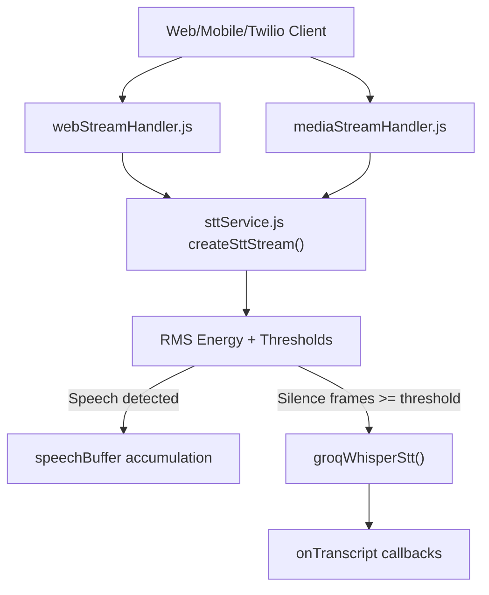
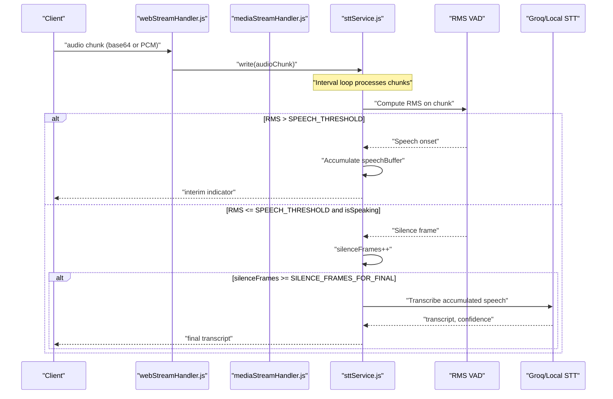
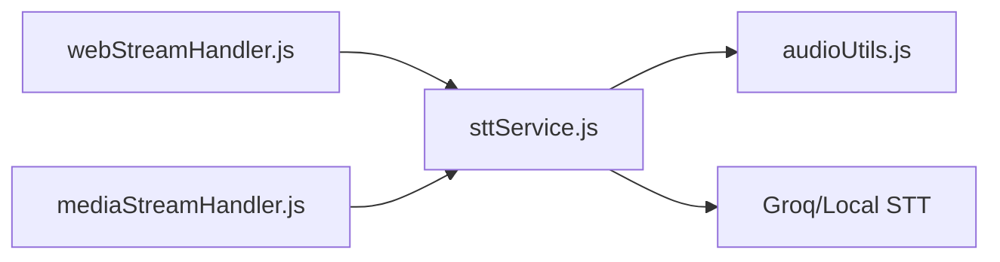

# Voice Activity Detection (VAD)

<cite>
**Referenced Files in This Document**
- [sttService.js](file://server/src/services/sttService.js)
- [audioUtils.js](file://server/src/utils/audioUtils.js)
- [webStreamHandler.js](file://server/src/websocket/webStreamHandler.js)
- [mediaStreamHandler.js](file://server/src/websocket/mediaStreamHandler.js)
- [ttsService.js](file://server/src/services/ttsService.js)
</cite>

## Table of Contents
1. [Introduction](#introduction)
2. [Project Structure](#project-structure)
3. [Core Components](#core-components)
4. [Architecture Overview](#architecture-overview)
5. [Detailed Component Analysis](#detailed-component-analysis)
6. [Dependency Analysis](#dependency-analysis)
7. [Performance Considerations](#performance-considerations)
8. [Troubleshooting Guide](#troubleshooting-guide)
9. [Conclusion](#conclusion)

## Introduction
This document explains the Voice Activity Detection (VAD) implementation used to distinguish speech from silence and background noise by analyzing audio chunks with RMS energy. It covers the threshold-based approach, frame counting for silence detection, real-time speech boundary detection, and how VAD parameters influence transcription accuracy. It also provides tuning guidance for different environments and troubleshooting strategies for noisy audio scenarios.

## Project Structure
The VAD logic is implemented within the server-side STT service as a streaming pipeline that:
- Receives audio chunks via WebSocket handlers
- Computes RMS energy per chunk
- Applies thresholds to detect speech onset and offset
- Accumulates speech segments and triggers transcription when silence persists for a configured number of frames

**Diagram sources**
- [webStreamHandler.js:23-70](file://server/src/websocket/webStreamHandler.js#L23-L70)
- [mediaStreamHandler.js:40-49](file://server/src/websocket/mediaStreamHandler.js#L40-L49)
- [sttService.js:329-454](file://server/src/services/sttService.js#L329-L454)

**Section sources**
- [webStreamHandler.js:23-70](file://server/src/websocket/webStreamHandler.js#L23-L70)
- [mediaStreamHandler.js:40-49](file://server/src/websocket/mediaStreamHandler.js#L40-L49)
- [sttService.js:329-454](file://server/src/services/sttService.js#L329-L454)

## Core Components
- RMS-based VAD:
  - Computes RMS energy over each incoming audio chunk
  - Compares against a speech threshold to determine if speech is present
- Frame counting:
  - Counts consecutive silent frames after speech onset to detect end-of-speech
- Streaming buffers:
  - Maintains an audio buffer for processing and a speech buffer for accumulating utterances
- Provider-specific streams:
  - Groq Whisper batch mode with VAD-like chunking
  - Mock stream for development with identical VAD behavior

Key behaviors:
- When RMS exceeds the threshold, the system marks speech onset, resets silence counters, and accumulates audio into a speech buffer
- While speaking, it periodically emits interim indicators
- When silence frames reach a configured count, it finalizes the utterance and sends it to the STT provider

**Section sources**
- [sttService.js:358-454](file://server/src/services/sttService.js#L358-L454)
- [sttService.js:521-602](file://server/src/services/sttService.js#L521-L602)

## Architecture Overview
The VAD operates inside the STT streaming layer. Audio arrives via WebSocket handlers, gets converted to PCM16 where necessary, and is fed into the STT stream. The stream’s interval loop computes RMS energy and applies thresholds to manage speech boundaries.

**Diagram sources**
- [webStreamHandler.js:23-70](file://server/src/websocket/webStreamHandler.js#L23-L70)
- [mediaStreamHandler.js:40-49](file://server/src/websocket/mediaStreamHandler.js#L40-L49)
- [sttService.js:358-454](file://server/src/services/sttService.js#L358-L454)

## Detailed Component Analysis

### RMS Energy Calculation
- For each processed chunk, the code reads PCM16 samples and computes RMS energy:
  - Iterates through samples, squares them, sums, then divides by the number of samples and takes the square root
- This metric represents the average power of the audio segment and is used to detect whether speech is present

Complexity:
- O(N) per chunk where N is the number of samples considered (capped at a fixed maximum per iteration)

Optimization opportunities:
- Use vectorized operations or typed array math for faster RMS computation
- Precompute constants or use incremental updates if chunk sizes are consistent

**Section sources**
- [sttService.js:366-379](file://server/src/services/sttService.js#L366-L379)
- [sttService.js:538-551](file://server/src/services/sttService.js#L538-L551)

### Threshold-Based Speech Detection
- A constant threshold determines when RMS energy indicates speech presence
- In the mock stream, this is explicitly defined; in the Groq stream, a hard-coded value is used
- If RMS exceeds the threshold, the system transitions to “speaking” state, resets silence counters, and begins accumulating audio

Impact on accuracy:
- Lower thresholds may increase false positives (noise classified as speech)
- Higher thresholds may miss quiet speech, increasing false negatives

**Section sources**
- [sttService.js:380-389](file://server/src/services/sttService.js#L380-L389)
- [sttService.js:553-561](file://server/src/services/sttService.js#L553-L561)

### Silence Frames and End-of-Speech Detection
- While speaking, each silent frame increments a counter
- When the counter reaches a configured limit, the system considers the utterance complete and triggers transcription
- This mechanism prevents premature cuts during brief pauses and avoids merging separate utterances too aggressively

Trade-offs:
- Larger counts delay finalization but reduce mid-sentence splits
- Smaller counts finalize quickly but risk cutting off trailing words

**Section sources**
- [sttService.js:390-418](file://server/src/services/sttService.js#L390-L418)
- [sttService.js:574-587](file://server/src/services/sttService.js#L574-L587)

### Real-Time Speech Boundary Detection
- The streaming loop runs at a fixed interval, ensuring near-real-time processing
- Interim indicators are emitted while speech is ongoing to provide responsive UI feedback
- Final transcripts are emitted only after silence detection criteria are met

Latency considerations:
- Interval frequency affects responsiveness vs CPU usage
- Buffer sizes and minimum chunk lengths impact latency and stability

**Section sources**
- [sttService.js:366-422](file://server/src/services/sttService.js#L366-L422)
- [sttService.js:538-588](file://server/src/services/sttService.js#L538-L588)

### VAD Parameters and Their Impact
- SPEECH_THRESHOLD: Controls sensitivity to audio energy. Typical default observed is 500.
  - Lower values increase sensitivity (more likely to detect speech), but may raise false positives in noisy environments
  - Higher values reduce sensitivity (fewer false positives), but may miss soft speech
- SILENCE_FRAMES_FOR_FINAL: Number of consecutive silent frames required to finalize an utterance. Observed default is 12.
  - Larger values allow longer pauses without splitting utterances, improving continuity but increasing finalization delay
  - Smaller values finalize faster but can split natural pauses into multiple utterances

Recommended tuning ranges:
- Quiet office: SPEECH_THRESHOLD around 400–600; SILENCE_FRAMES_FOR_FINAL around 10–14
- Noisy environment: SPEECH_THRESHOLD around 600–900; SILENCE_FRAMES_FOR_FINAL around 12–18
- Fast-paced conversation: SILENCE_FRAMES_FOR_FINAL around 8–12 to reduce lag

Note: These are practical guidelines based on observed defaults and typical audio characteristics. Validate with your data.

**Section sources**
- [sttService.js:380-418](file://server/src/services/sttService.js#L380-L418)
- [sttService.js:553-587](file://server/src/services/sttService.js#L553-L587)

### Audio Processing Pipeline Integration
- Web clients send base64-encoded audio; the handler decodes and forwards chunks to the STT stream
- Twilio PSTN media arrives as mu-law; it is converted to PCM16 before being written to the STT stream
- The STT stream handles both providers and mock modes with consistent VAD behavior

Codec conversions:
- Mu-law to PCM16 conversion ensures compatibility with RMS calculation and STT engines
- Resampling utilities support format normalization when needed

**Section sources**
- [webStreamHandler.js:23-70](file://server/src/websocket/webStreamHandler.js#L23-L70)
- [mediaStreamHandler.js:40-49](file://server/src/websocket/mediaStreamHandler.js#L40-L49)
- [audioUtils.js:26-33](file://server/src/utils/audioUtils.js#L26-L33)
- [audioUtils.js:76-83](file://server/src/utils/audioUtils.js#L76-L83)

### TTS Duration Utility
- Provides duration calculation for mu-law buffers, useful for monitoring and debugging audio flow
- Not directly part of VAD, but relevant for end-to-end latency analysis

**Section sources**
- [ttsService.js:184-186](file://server/src/services/ttsService.js#L184-L186)

## Dependency Analysis
The VAD depends on:
- Incoming audio streams from web and telephony handlers
- PCM16 sample access for RMS computation
- STT provider interfaces for transcription
- Optional codec utilities for format conversion

**Diagram sources**
- [webStreamHandler.js:23-70](file://server/src/websocket/webStreamHandler.js#L23-L70)
- [mediaStreamHandler.js:40-49](file://server/src/websocket/mediaStreamHandler.js#L40-L49)
- [sttService.js:329-454](file://server/src/services/sttService.js#L329-L454)
- [audioUtils.js:26-33](file://server/src/utils/audioUtils.js#L26-L33)

**Section sources**
- [webStreamHandler.js:23-70](file://server/src/websocket/webStreamHandler.js#L23-L70)
- [mediaStreamHandler.js:40-49](file://server/src/websocket/mediaStreamHandler.js#L40-L49)
- [sttService.js:329-454](file://server/src/services/sttService.js#L329-L454)
- [audioUtils.js:26-33](file://server/src/utils/audioUtils.js#L26-L33)

## Performance Considerations
- Chunk size and sampling:
  - Minimum chunk length ensures sufficient samples for stable RMS estimation
  - Capping samples per iteration reduces CPU load
- Interval frequency:
  - Balances responsiveness with processing overhead
- Memory management:
  - Clearing buffers after processing prevents unbounded growth
- Codec conversions:
  - Mu-law to PCM16 conversion adds CPU cost; ensure it is only applied when necessary

Recommendations:
- Monitor CPU usage under load and adjust interval frequency
- Profile RMS computation paths for potential vectorization
- Tune thresholds based on measured false positive/negative rates in target environments

[No sources needed since this section provides general guidance]

## Troubleshooting Guide
Common issues and remedies:
- Excessive false positives in noisy environments:
  - Increase SPEECH_THRESHOLD to reduce sensitivity to background noise
  - Consider adding pre-filtering or noise suppression upstream
- Frequent utterance splits due to short pauses:
  - Increase SILENCE_FRAMES_FOR_FINAL to tolerate longer pauses before finalizing
- Missed soft speech:
  - Decrease SPEECH_THRESHOLD to capture quieter voices
- High latency in finalization:
  - Reduce SILENCE_FRAMES_FOR_FINAL for quicker response, balancing split risks
- Incorrect audio format causing poor RMS estimates:
  - Ensure mu-law to PCM16 conversion is applied for telephony streams
  - Verify sample rate and bit depth consistency

Validation steps:
- Log RMS values across representative audio clips to calibrate thresholds
- Measure time between speech onset and finalization to assess responsiveness
- Compare interim vs final transcript timing to tune frame counts

**Section sources**
- [sttService.js:366-418](file://server/src/services/sttService.js#L366-L418)
- [sttService.js:538-587](file://server/src/services/sttService.js#L538-L587)
- [audioUtils.js:26-33](file://server/src/utils/audioUtils.js#L26-L33)

## Conclusion
The VAD implementation uses RMS energy thresholds and frame counting to robustly detect speech boundaries in real-time audio streams. By tuning SPEECH_THRESHOLD and SILENCE_FRAMES_FOR_FINAL, you can adapt the system to diverse environments—from quiet offices to noisy call centers—while maintaining accurate transcription and responsive user feedback. Integrating with codec utilities and streaming handlers ensures compatibility across web and telephony sources. Continuous monitoring and calibration will help optimize performance and accuracy over time.

[No sources needed since this section summarizes without analyzing specific files]