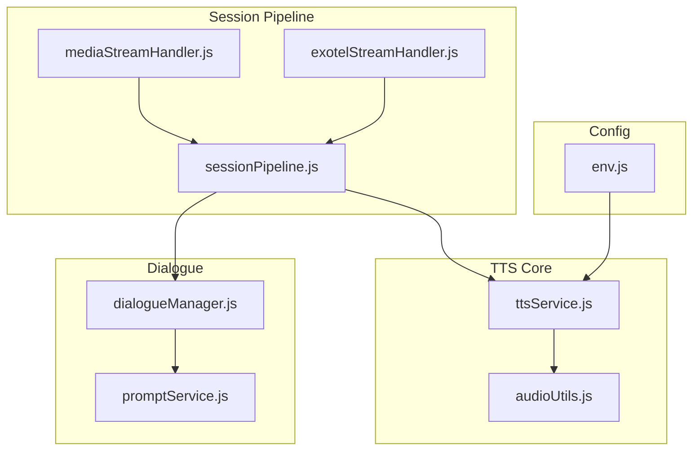
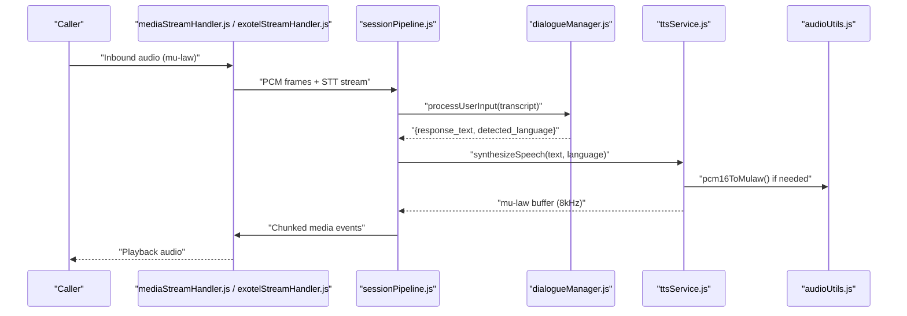
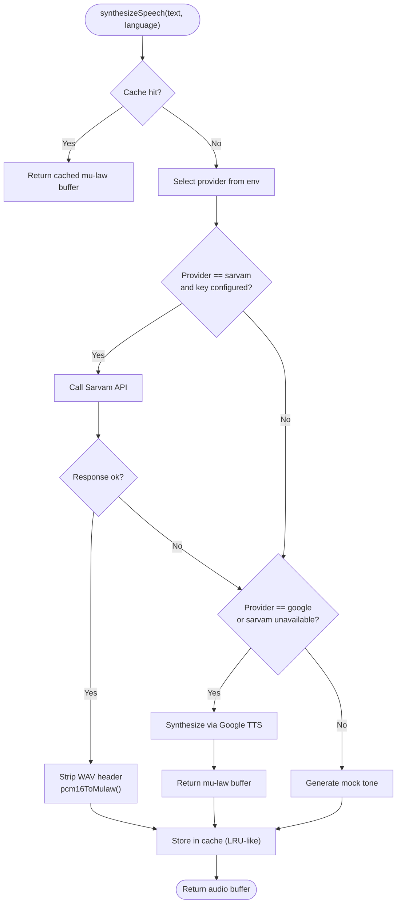
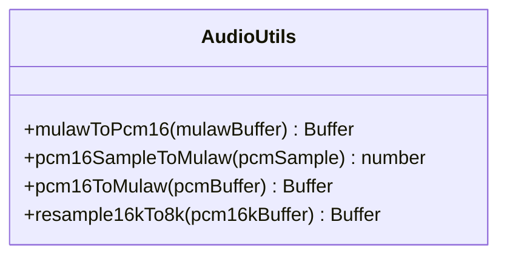
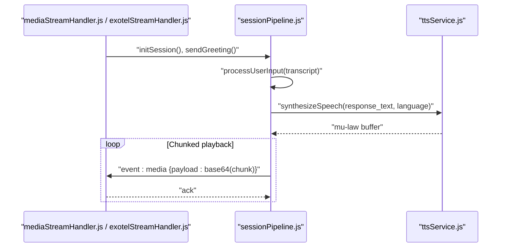
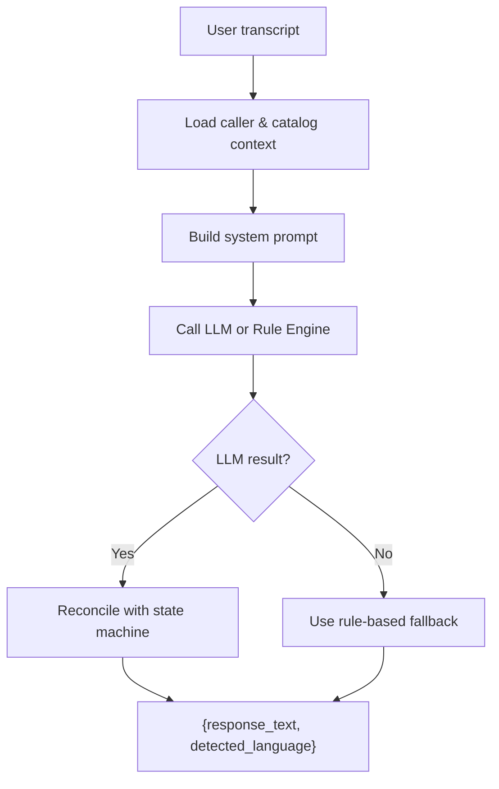
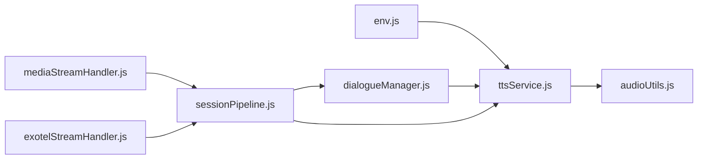

# Text-to-Speech Service

<cite>
**Referenced Files in This Document**
- [ttsService.js](file://server/src/services/ttsService.js)
- [audioUtils.js](file://server/src/utils/audioUtils.js)
- [sessionPipeline.js](file://server/src/websocket/sessionPipeline.js)
- [mediaStreamHandler.js](file://server/src/websocket/mediaStreamHandler.js)
- [exotelStreamHandler.js](file://server/src/websocket/exotelStreamHandler.js)
- [dialogueManager.js](file://server/src/services/dialogueManager.js)
- [promptService.js](file://server/src/services/promptService.js)
- [env.js](file://server/src/config/env.js)
</cite>

## Table of Contents
1. [Introduction](#introduction)
2. [Project Structure](#project-structure)
3. [Core Components](#core-components)
4. [Architecture Overview](#architecture-overview)
5. [Detailed Component Analysis](#detailed-component-analysis)
6. [Dependency Analysis](#dependency-analysis)
7. [Performance Considerations](#performance-considerations)
8. [Troubleshooting Guide](#troubleshooting-guide)
9. [Conclusion](#conclusion)
10. [Appendices](#appendices)

## Introduction
This document explains the Text-to-Speech (TTS) synthesis service that powers bilingual (English and Tamil) voice responses for a food ordering assistant. It covers provider integration, voice customization options, speech rate control, audio format generation, streaming playback, latency optimization, fallback mechanisms, and practical examples for conversational flows such as order placement. The service is designed to deliver natural-sounding speech with low latency while maintaining consistent voice characteristics across conversations.

## Project Structure
The TTS functionality is implemented as a modular service integrated into the real-time voice session pipeline:
- TTS providers are abstracted behind a unified interface with caching and fallbacks.
- Audio codecs are converted to telephony-friendly formats (mu-law at 8kHz).
- Streaming handlers push synthesized audio chunks back to telephony or web clients.
- Dialogue management determines language and response text before synthesis.

**Diagram sources**
- [sessionPipeline.js:224-294](file://server/src/websocket/sessionPipeline.js#L224-L294)
- [mediaStreamHandler.js:1-69](file://server/src/websocket/mediaStreamHandler.js#L1-L69)
- [exotelStreamHandler.js:1-80](file://server/src/websocket/exotelStreamHandler.js#L1-L80)
- [ttsService.js:1-187](file://server/src/services/ttsService.js#L1-L187)
- [audioUtils.js:1-84](file://server/src/utils/audioUtils.js#L1-L84)
- [dialogueManager.js:36-84](file://server/src/services/dialogueManager.js#L36-L84)
- [promptService.js:33-94](file://server/src/services/promptService.js#L33-L94)
- [env.js:1-42](file://server/src/config/env.js#L1-L42)

**Section sources**
- [sessionPipeline.js:224-294](file://server/src/websocket/sessionPipeline.js#L224-L294)
- [ttsService.js:1-187](file://server/src/services/ttsService.js#L1-L187)
- [audioUtils.js:1-84](file://server/src/utils/audioUtils.js#L1-L84)
- [mediaStreamHandler.js:1-69](file://server/src/websocket/mediaStreamHandler.js#L1-L69)
- [exotelStreamHandler.js:1-80](file://server/src/websocket/exotelStreamHandler.js#L1-L80)
- [dialogueManager.js:36-84](file://server/src/services/dialogueManager.js#L36-L84)
- [promptService.js:33-94](file://server/src/services/promptService.js#L33-L94)
- [env.js:1-42](file://server/src/config/env.js#L1-L42)

## Core Components
- TTS Service: Multi-provider synthesis with caching and fallbacks; outputs mu-law audio buffers suitable for telephony.
- Audio Utilities: Codec conversion between PCM16 and mu-law, and resampling utilities.
- Session Pipeline: Orchestrates user input processing, dialogue state, and audio response streaming.
- Stream Handlers: Ingest media from Twilio/Exotel and route it to STT; send synthesized audio back.
- Dialogue Manager & Prompt Service: Generate bilingual spoken responses and detect language for TTS routing.
- Environment Configuration: Validates required keys and defaults for TTS providers.

Key capabilities:
- Bilingual output: English (en-IN) and Tamil (ta-IN), with mixed-language support.
- Voice customization: speaker selection, pitch, pace/speaking rate, loudness per provider.
- Audio formats: mu-law at 8kHz for telephony; PCM16 conversions when needed.
- Streaming synthesis: chunked playback to minimize perceived latency.
- Fallback chain: Sarvam AI → Google Cloud → Mock generator.

**Section sources**
- [ttsService.js:22-70](file://server/src/services/ttsService.js#L22-L70)
- [ttsService.js:75-120](file://server/src/services/ttsService.js#L75-L120)
- [ttsService.js:125-148](file://server/src/services/ttsService.js#L125-L148)
- [ttsService.js:154-179](file://server/src/services/ttsService.js#L154-L179)
- [audioUtils.js:21-71](file://server/src/utils/audioUtils.js#L21-L71)
- [sessionPipeline.js:224-294](file://server/src/websocket/sessionPipeline.js#L224-L294)
- [dialogueManager.js:36-84](file://server/src/services/dialogueManager.js#L36-L84)
- [promptService.js:33-94](file://server/src/services/promptService.js#L33-L94)
- [env.js:1-42](file://server/src/config/env.js#L1-L42)

## Architecture Overview
The TTS service integrates into a real-time call flow:
- Incoming audio from telephony is decoded and streamed to STT.
- STT produces transcripts fed into the dialogue manager.
- Dialogue manager returns a spoken response and detected language.
- TTS synthesizes audio in the appropriate language and codec.
- Synthesized audio is streamed back to the caller via WebSocket chunks.

**Diagram sources**
- [mediaStreamHandler.js:1-69](file://server/src/websocket/mediaStreamHandler.js#L1-L69)
- [exotelStreamHandler.js:1-80](file://server/src/websocket/exotelStreamHandler.js#L1-L80)
- [sessionPipeline.js:132-219](file://server/src/websocket/sessionPipeline.js#L132-L219)
- [sessionPipeline.js:224-294](file://server/src/websocket/sessionPipeline.js#L224-L294)
- [dialogueManager.js:36-84](file://server/src/services/dialogueManager.js#L36-L84)
- [ttsService.js:22-70](file://server/src/services/ttsService.js#L22-L70)
- [audioUtils.js:64-71](file://server/src/utils/audioUtils.js#L64-L71)

## Detailed Component Analysis

### TTS Service: Provider Abstraction, Caching, and Fallbacks
- Provider selection: Uses an environment variable to choose the active provider; falls back through providers on errors or missing credentials.
- Caching: In-memory cache keyed by provider, language, and normalized text reduces repeated synthesis for static prompts.
- Providers:
  - Sarvam AI: Configurable speaker, pitch, pace, loudness, sample rate; returns base64-encoded WAV which is stripped and converted to mu-law.
  - Google Cloud: Chooses voice based on language; outputs mu-law directly.
  - Mock: Generates short tones proportional to word count; useful for development without credentials.
- Duration helper: Computes duration from mu-law buffer length assuming 8kHz sampling.

**Diagram sources**
- [ttsService.js:22-70](file://server/src/services/ttsService.js#L22-L70)
- [ttsService.js:75-120](file://server/src/services/ttsService.js#L75-L120)
- [ttsService.js:125-148](file://server/src/services/ttsService.js#L125-L148)
- [ttsService.js:154-179](file://server/src/services/ttsService.js#L154-L179)
- [audioUtils.js:64-71](file://server/src/utils/audioUtils.js#L64-L71)

**Section sources**
- [ttsService.js:22-70](file://server/src/services/ttsService.js#L22-L70)
- [ttsService.js:75-120](file://server/src/services/ttsService.js#L75-L120)
- [ttsService.js:125-148](file://server/src/services/ttsService.js#L125-L148)
- [ttsService.js:154-179](file://server/src/services/ttsService.js#L154-L179)
- [ttsService.js:181-186](file://server/src/services/ttsService.js#L181-L186)

### Audio Utilities: Codec Conversion and Resampling
- Mu-law encoding/decoding: Efficiently converts between PCM16 and mu-law using precomputed tables and bit manipulation.
- Resampling: Simple decimation from 16kHz to 8kHz PCM16 where necessary.
- Integration points: Used by TTS providers to produce telephony-compatible audio streams.

**Diagram sources**
- [audioUtils.js:21-83](file://server/src/utils/audioUtils.js#L21-L83)

**Section sources**
- [audioUtils.js:21-83](file://server/src/utils/audioUtils.js#L21-L83)

### Session Pipeline: Streaming Synthesis and Playback
- Greeting and turn processing: Initializes sessions, sends initial greeting, processes user input, and triggers audio response.
- Streaming synthesis: Chunks mu-law buffers into fixed-size frames and sends them over WebSocket to telephony or web clients.
- Error handling: On synthesis failure, still returns text and state to keep the conversation flowing.

**Diagram sources**
- [sessionPipeline.js:116-127](file://server/src/websocket/sessionPipeline.js#L116-L127)
- [sessionPipeline.js:132-219](file://server/src/websocket/sessionPipeline.js#L132-L219)
- [sessionPipeline.js:224-294](file://server/src/websocket/sessionPipeline.js#L224-L294)
- [mediaStreamHandler.js:1-69](file://server/src/websocket/mediaStreamHandler.js#L1-L69)
- [exotelStreamHandler.js:1-80](file://server/src/websocket/exotelStreamHandler.js#L1-L80)

**Section sources**
- [sessionPipeline.js:116-127](file://server/src/websocket/sessionPipeline.js#L116-L127)
- [sessionPipeline.js:132-219](file://server/src/websocket/sessionPipeline.js#L132-L219)
- [sessionPipeline.js:224-294](file://server/src/websocket/sessionPipeline.js#L224-L294)

### Dialogue Manager and Prompt Service: Bilingual Responses and Language Detection
- Dialogue flow: Builds context from catalog and caller profile, calls LLM or rule engine, and returns structured response including detected language.
- Prompt guidance: Encourages concise, natural bilingual speech and enforces constraints like not inventing prices.
- Language detection: Guides TTS to select the correct language code for synthesis.

**Diagram sources**
- [dialogueManager.js:36-84](file://server/src/services/dialogueManager.js#L36-L84)
- [dialogueManager.js:90-132](file://server/src/services/dialogueManager.js#L90-L132)
- [dialogueManager.js:137-200](file://server/src/services/dialogueManager.js#L137-L200)
- [promptService.js:33-94](file://server/src/services/promptService.js#L33-L94)

**Section sources**
- [dialogueManager.js:36-84](file://server/src/services/dialogueManager.js#L36-L84)
- [dialogueManager.js:90-132](file://server/src/services/dialogueManager.js#L90-L132)
- [dialogueManager.js:137-200](file://server/src/services/dialogueManager.js#L137-L200)
- [promptService.js:33-94](file://server/src/services/promptService.js#L33-L94)

### Environment Configuration: Provider Keys and Defaults
- Validates environment variables including provider keys.
- Provides safe defaults for development and ensures production readiness.

**Section sources**
- [env.js:1-42](file://server/src/config/env.js#L1-L42)

## Dependency Analysis
- TTS depends on audio utilities for codec conversion and on environment configuration for provider selection.
- Session pipeline orchestrates TTS within the broader voice workflow and handles streaming to telephony/web clients.
- Dialogue manager influences TTS behavior via language detection and response text generation.

**Diagram sources**
- [env.js:1-42](file://server/src/config/env.js#L1-L42)
- [ttsService.js:1-187](file://server/src/services/ttsService.js#L1-L187)
- [audioUtils.js:1-84](file://server/src/utils/audioUtils.js#L1-L84)
- [dialogueManager.js:36-84](file://server/src/services/dialogueManager.js#L36-L84)
- [sessionPipeline.js:224-294](file://server/src/websocket/sessionPipeline.js#L224-L294)
- [mediaStreamHandler.js:1-69](file://server/src/websocket/mediaStreamHandler.js#L1-L69)
- [exotelStreamHandler.js:1-80](file://server/src/websocket/exotelStreamHandler.js#L1-L80)

**Section sources**
- [ttsService.js:1-187](file://server/src/services/ttsService.js#L1-L187)
- [audioUtils.js:1-84](file://server/src/utils/audioUtils.js#L1-L84)
- [dialogueManager.js:36-84](file://server/src/services/dialogueManager.js#L36-L84)
- [sessionPipeline.js:224-294](file://server/src/websocket/sessionPipeline.js#L224-L294)
- [mediaStreamHandler.js:1-69](file://server/src/websocket/mediaStreamHandler.js#L1-L69)
- [exotelStreamHandler.js:1-80](file://server/src/websocket/exotelStreamHandler.js#L1-L80)
- [env.js:1-42](file://server/src/config/env.js#L1-L42)

## Performance Considerations
- Latency optimization:
  - Immediate streaming: Synthesized audio is chunked and sent immediately to reduce time-to-first-hear.
  - Provider timeouts: Requests include timeouts to prevent long stalls.
  - Caching: Repeated prompts are served from memory cache to avoid network calls.
- Quality settings:
  - Speaking rate and pitch tuned for natural cadence.
  - Loudness adjustments improve clarity over telephony channels.
- Memory management:
  - Chunk sizes balance throughput and memory usage.
  - Audio bytes capped per session to prevent unbounded growth.
- Fallback resilience:
  - Graceful degradation to alternative providers or mock synthesis ensures continuity.

[No sources needed since this section provides general guidance]

## Troubleshooting Guide
Common issues and resolutions:
- Missing provider key:
  - Symptom: Synthesis fails for preferred provider and falls back.
  - Action: Ensure the required environment variable is set; verify provider availability.
- Empty audio response:
  - Symptom: No audio played despite successful request.
  - Action: Check provider payload structure and ensure audio content exists; inspect logs for empty audio errors.
- Codec mismatch:
  - Symptom: Distorted or silent playback.
  - Action: Confirm mu-law at 8kHz output; use audio utilities to convert PCM16 to mu-law when needed.
- High latency:
  - Symptom: Delayed responses.
  - Action: Enable caching for static prompts; consider switching to a faster provider; review chunk sizes and network conditions.
- Session memory pressure:
  - Symptom: Increased memory usage during long calls.
  - Action: Verify chunk limits and ensure proper session cleanup; monitor audio bytes cap.

**Section sources**
- [ttsService.js:40-60](file://server/src/services/ttsService.js#L40-L60)
- [ttsService.js:102-119](file://server/src/services/ttsService.js#L102-L119)
- [audioUtils.js:64-71](file://server/src/utils/audioUtils.js#L64-L71)
- [sessionPipeline.js:224-294](file://server/src/websocket/sessionPipeline.js#L224-L294)

## Conclusion
The TTS service delivers robust, bilingual voice synthesis with provider flexibility, quality tuning, and low-latency streaming. Its layered architecture—provider abstraction, codec conversion, session orchestration, and dialogue-driven language detection—ensures reliable operation under varying conditions. With caching, fallbacks, and careful memory management, it supports real-time conversational experiences for food ordering scenarios across English and Tamil.

[No sources needed since this section summarizes without analyzing specific files]

## Appendices

### Voice Customization Options
- Sarvam AI:
  - Speaker: Fixed female voice for consistency.
  - Pitch: Adjustable to fine-tune tone.
  - Pace: Slightly elevated speaking rate for natural flow.
  - Loudness: Boosted for telephony clarity.
  - Sample rate: 8kHz for telephony compatibility.
- Google Cloud:
  - Voices: Language-specific voices selected by language code.
  - Encoding: mu-law at 8kHz.
  - Rate and pitch: Tuned for natural cadence.

**Section sources**
- [ttsService.js:88-98](file://server/src/services/ttsService.js#L88-L98)
- [ttsService.js:129-145](file://server/src/services/ttsService.js#L129-L145)

### Examples: Food Ordering Conversations
- Greeting and menu inquiry:
  - User: “Hello” or “What do you have?”
  - Assistant: Welcomes caller and lists available items; language detected as mixed or English.
- Adding items and asking total:
  - User: “I want two Chicken Biryani.”
  - Assistant: Confirms items and provides total; may ask for delivery address.
- Address confirmation and order confirmation:
  - User: “Deliver to 42 DB Road, RS Puram.”
  - Assistant: Asks for final confirmation; upon yes, confirms order and proceeds asynchronously.

These flows are driven by the dialogue manager’s rules and prompts, with TTS synthesizing responses in the detected language.

**Section sources**
- [dialogueManager.js:145-168](file://server/src/services/dialogueManager.js#L145-L168)
- [dialogueManager.js:170-194](file://server/src/services/dialogueManager.js#L170-L194)
- [promptService.js:33-94](file://server/src/services/promptService.js#L33-L94)

### Handling Special Characters and Numbers
- The dialogue manager and prompt service instruct the model to speak naturally and avoid inventing monetary values, focusing on item names and quantities.
- TTS receives clean text from the dialogue layer; numbers and currency symbols are rendered according to provider capabilities.

**Section sources**
- [promptService.js:33-94](file://server/src/services/promptService.js#L33-L94)
- [dialogueManager.js:170-194](file://server/src/services/dialogueManager.js#L170-L194)

### Maintaining Consistent Voice Characteristics
- Use a fixed speaker for Sarvam AI to maintain consistent timbre across sessions.
- Keep pitch, pace, and loudness stable to preserve brand voice identity.
- Prefer the same provider per deployment to avoid voice drift.

**Section sources**
- [ttsService.js:88-98](file://server/src/services/ttsService.js#L88-L98)

### Audio Buffer Management and Streaming
- Chunk size: Fixed-size frames for efficient WebSocket transmission.
- Memory cap: Per-session audio bytes limit prevents excessive memory usage.
- Streaming: Immediate chunked playback minimizes perceived latency.

**Section sources**
- [sessionPipeline.js:224-294](file://server/src/websocket/sessionPipeline.js#L224-L294)

### Fallback Mechanisms for Degraded Service Conditions
- Provider fallback chain: Sarvam AI → Google Cloud → Mock generator.
- Timeouts: Prevent long waits on provider failures.
- Graceful degradation: Conversation continues even if audio synthesis fails; text and state are still returned.

**Section sources**
- [ttsService.js:40-60](file://server/src/services/ttsService.js#L40-L60)
- [ttsService.js:82-100](file://server/src/services/ttsService.js#L82-L100)
- [sessionPipeline.js:282-293](file://server/src/websocket/sessionPipeline.js#L282-L293)