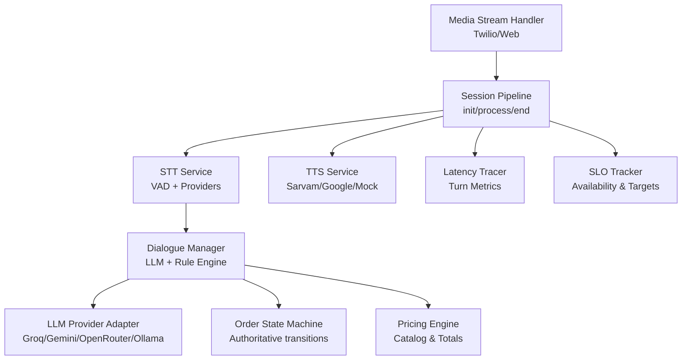
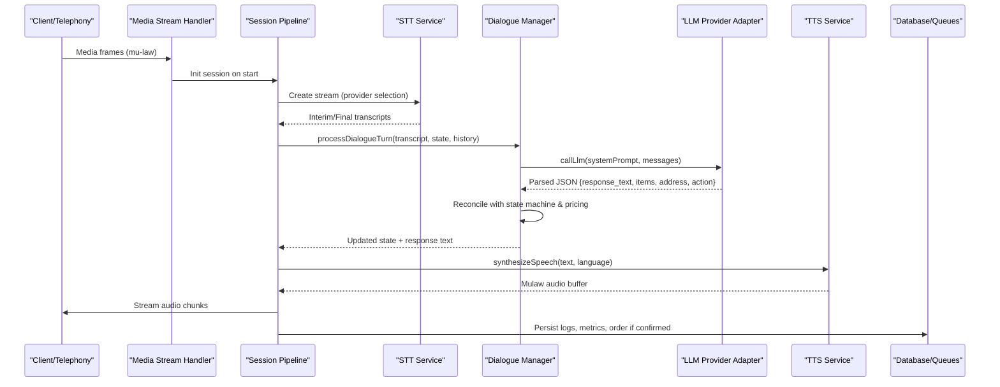
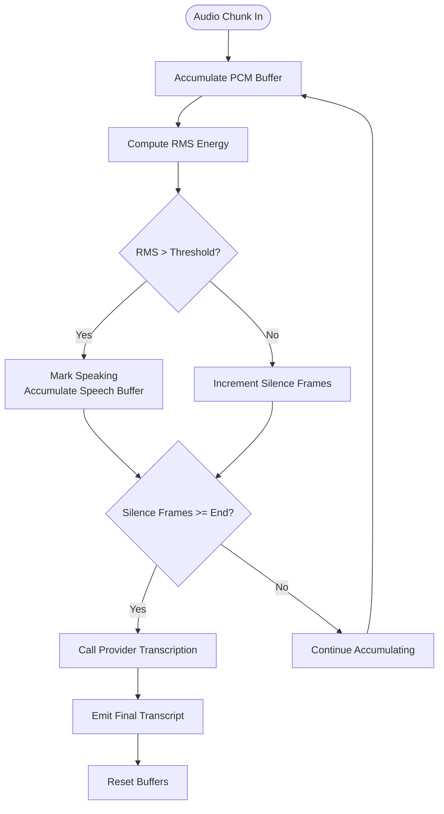
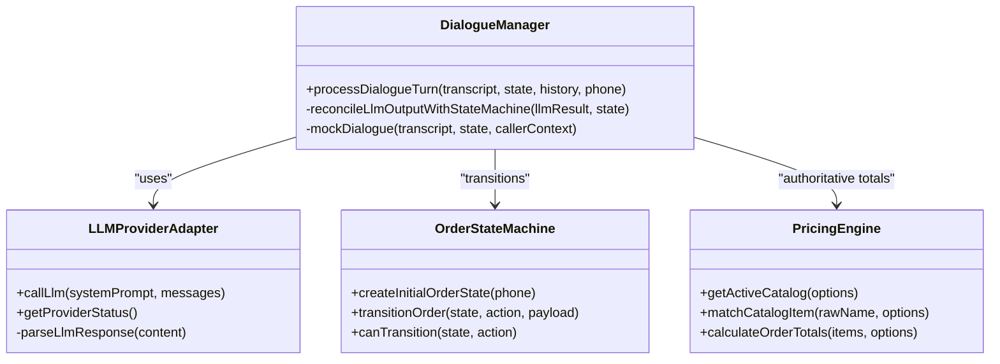
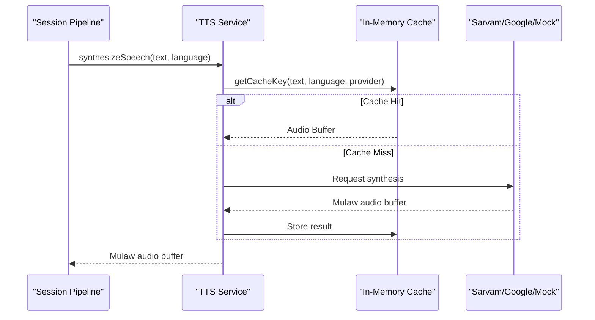
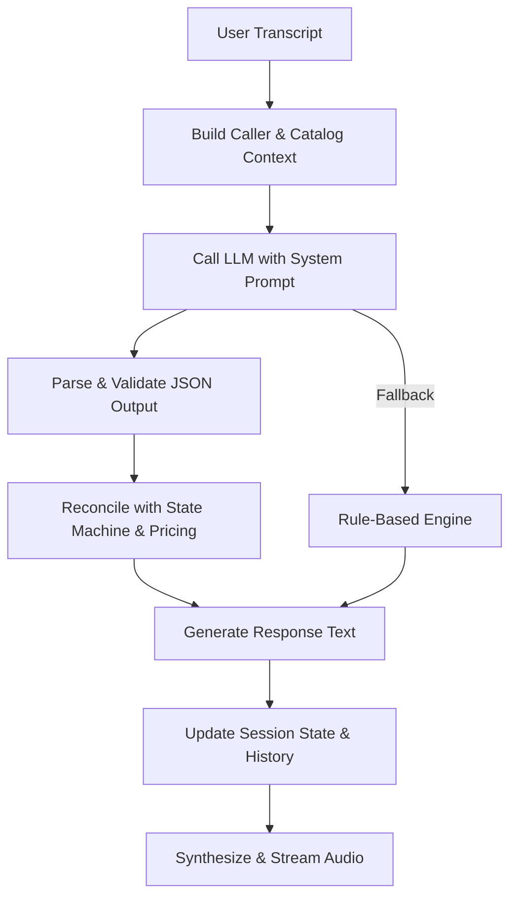
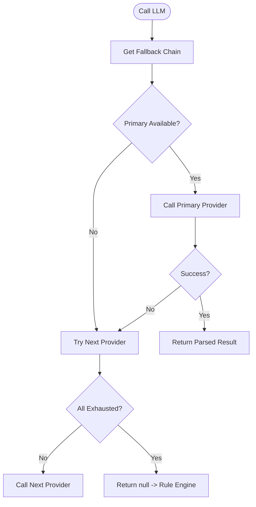
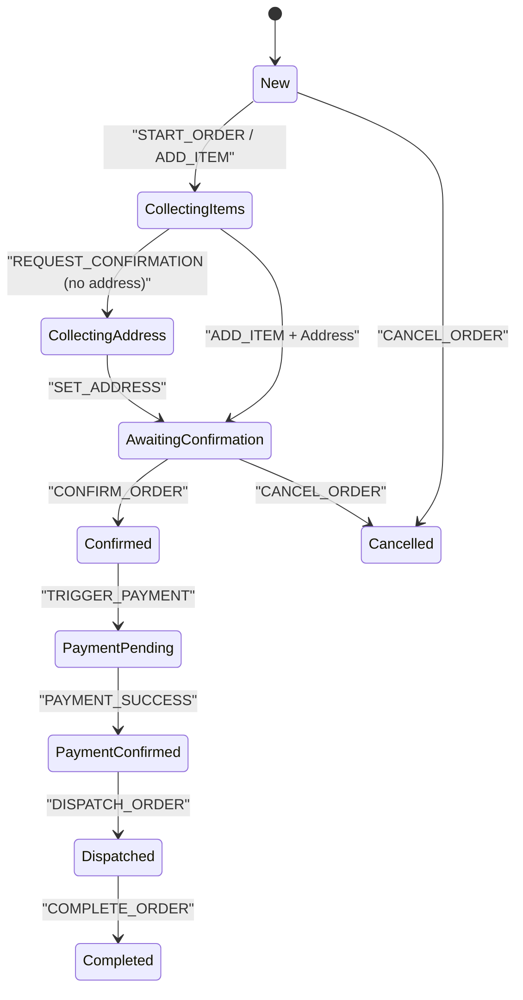
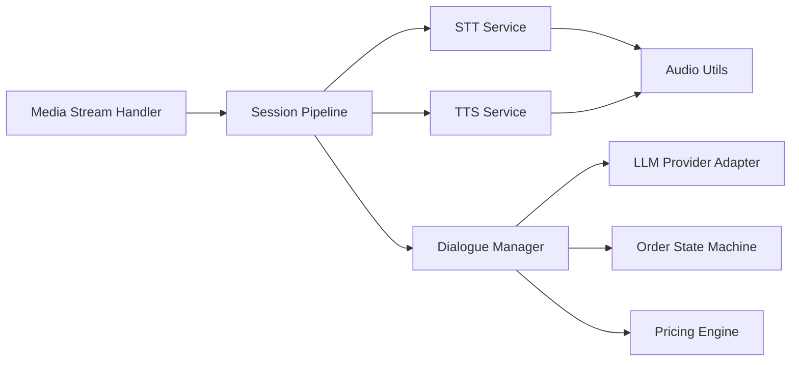

# Voice Processing Engine

<cite>
**Referenced Files in This Document**
- [sttService.js](file://server/src/services/sttService.js)
- [ttsService.js](file://server/src/services/ttsService.js)
- [dialogueManager.js](file://server/src/services/dialogueManager.js)
- [llmProviderAdapter.js](file://server/src/services/llmProviderAdapter.js)
- [promptService.js](file://server/src/services/promptService.js)
- [sessionPipeline.js](file://server/src/websocket/sessionPipeline.js)
- [mediaStreamHandler.js](file://server/src/websocket/mediaStreamHandler.js)
- [orderStateMachine.js](file://server/src/domain/orders/orderStateMachine.js)
- [pricingEngine.js](file://server/src/domain/orders/pricingEngine.js)
- [audioUtils.js](file://server/src/utils/audioUtils.js)
- [latencyTracer.js](file://server/src/services/latencyTracer.js)
- [sloTracker.js](file://server/src/services/sloTracker.js)
</cite>

## Table of Contents
1. [Introduction](#introduction)
2. [Project Structure](#project-structure)
3. [Core Components](#core-components)
4. [Architecture Overview](#architecture-overview)
5. [Detailed Component Analysis](#detailed-component-analysis)
6. [Dependency Analysis](#dependency-analysis)
7. [Performance Considerations](#performance-considerations)
8. [Troubleshooting Guide](#troubleshooting-guide)
9. [Conclusion](#conclusion)

## Introduction
This document describes the Voice Processing Engine that enables bilingual (English and Tamil) voice interactions for food ordering. It covers:
- Speech-to-text with noise filtering and speaker activity detection
- Natural language understanding for intent recognition and entity extraction in a restaurant context
- Text-to-speech synthesis with voice customization and latency optimization
- Dialogue management to maintain conversation state across multi-turn interactions
- LLM provider abstraction with automatic fallback between services
- Quality metrics, performance tuning, and fallback mechanisms for service degradation

The system is designed for low-latency, resilient voice calls from telephony providers (e.g., Twilio), web clients, and mobile apps, while ensuring authoritative pricing and order state control.

## Project Structure
At a high level, the voice pipeline spans WebSocket media handling, STT streaming, dialogue processing, TTS synthesis, and order fulfillment. Key modules include:
- Media stream handlers for telephony and web sources
- Session pipeline orchestrating STT, dialogue, and TTS
- STT service supporting multiple providers with VAD-based chunking
- TTS service with caching and provider fallback
- Dialogue manager integrating LLMs and rule-based fallback
- LLM provider adapter with auto-fallback cascade
- Prompt service for versioned conversational prompts
- Order state machine and pricing engine for authoritative decisions
- Latency tracer and SLO tracker for quality monitoring

**Diagram sources**
- [mediaStreamHandler.js:1-69](file://server/src/websocket/mediaStreamHandler.js#L1-L69)
- [sessionPipeline.js:1-437](file://server/src/websocket/sessionPipeline.js#L1-L437)
- [sttService.js:1-603](file://server/src/services/sttService.js#L1-L603)
- [dialogueManager.js:1-302](file://server/src/services/dialogueManager.js#L1-L302)
- [llmProviderAdapter.js:1-283](file://server/src/services/llmProviderAdapter.js#L1-L283)
- [orderStateMachine.js:1-325](file://server/src/domain/orders/orderStateMachine.js#L1-L325)
- [pricingEngine.js:1-117](file://server/src/domain/orders/pricingEngine.js#L1-L117)
- [ttsService.js:1-187](file://server/src/services/ttsService.js#L1-L187)
- [latencyTracer.js:1-133](file://server/src/services/latencyTracer.js#L1-L133)
- [sloTracker.js:1-65](file://server/src/services/sloTracker.js#L1-L65)

**Section sources**
- [mediaStreamHandler.js:1-69](file://server/src/websocket/mediaStreamHandler.js#L1-L69)
- [sessionPipeline.js:1-437](file://server/src/websocket/sessionPipeline.js#L1-L437)

## Core Components
- STT Service: Multi-provider transcription with VAD-based chunking, phrase hints, and fallback to local Whisper or mock.
- TTS Service: Multi-provider synthesis with caching, voice parameters, and telephony-optimized audio formats.
- Dialogue Manager: Maintains conversation state, integrates LLM outputs with deterministic state machine and pricing.
- LLM Provider Adapter: Universal router with auto-fallback across Groq, Gemini, OpenRouter, and Ollama; strict JSON parsing and validation.
- Prompt Service: Versioned system prompts tailored for bilingual Tamil/English ordering.
- Session Pipeline: Orchestrates end-to-end flow from media ingestion to response playback and order confirmation.
- Order State Machine & Pricing Engine: Authoritative transitions and calculations ensuring “AI suggests; code decides.”
- Audio Utilities: Codec conversions (mu-law ↔ PCM16) and resampling for telephony compatibility.
- Latency Tracer & SLO Tracker: Turn-level metrics and service-level objective monitoring.

**Section sources**
- [sttService.js:1-603](file://server/src/services/sttService.js#L1-L603)
- [ttsService.js:1-187](file://server/src/services/ttsService.js#L1-L187)
- [dialogueManager.js:1-302](file://server/src/services/dialogueManager.js#L1-L302)
- [llmProviderAdapter.js:1-283](file://server/src/services/llmProviderAdapter.js#L1-L283)
- [promptService.js:1-115](file://server/src/services/promptService.js#L1-L115)
- [sessionPipeline.js:1-437](file://server/src/websocket/sessionPipeline.js#L1-L437)
- [orderStateMachine.js:1-325](file://server/src/domain/orders/orderStateMachine.js#L1-L325)
- [pricingEngine.js:1-117](file://server/src/domain/orders/pricingEngine.js#L1-L117)
- [audioUtils.js:1-84](file://server/src/utils/audioUtils.js#L1-L84)
- [latencyTracer.js:1-133](file://server/src/services/latencyTracer.js#L1-L133)
- [sloTracker.js:1-65](file://server/src/services/sloTracker.js#L1-L65)

## Architecture Overview
The voice pipeline processes incoming audio streams, transcribes speech, understands intents/entities via LLM or rules, synthesizes responses, and manages orders authoritatively.

**Diagram sources**
- [mediaStreamHandler.js:1-69](file://server/src/websocket/mediaStreamHandler.js#L1-L69)
- [sessionPipeline.js:1-437](file://server/src/websocket/sessionPipeline.js#L1-L437)
- [sttService.js:1-603](file://server/src/services/sttService.js#L1-L603)
- [dialogueManager.js:1-302](file://server/src/services/dialogueManager.js#L1-L302)
- [llmProviderAdapter.js:1-283](file://server/src/services/llmProviderAdapter.js#L1-L283)
- [ttsService.js:1-187](file://server/src/services/ttsService.js#L1-L187)

## Detailed Component Analysis

### Speech-to-Text (STT) with Noise Filtering and Speaker Activity Detection
- Provider selection: Configurable via environment variables; supports Groq Whisper, Google Cloud STT, local Whisper Tiny, and mock.
- Noise filtering and VAD: Energy-based RMS thresholding detects speech vs silence, accumulates audio chunks, and triggers transcription at end-of-speech.
- Phrase hints: Catalog-derived hints improve accuracy for food terms and quantities in both English and Tamil.
- Streaming interface: write/onTranscript/end pattern abstracts provider differences; interim results are emitted during speech.
- Fallback chain: If primary provider fails, attempts local Whisper or mock; ensures continuity in development or degraded environments.

**Diagram sources**
- [sttService.js:358-454](file://server/src/services/sttService.js#L358-L454)
- [sttService.js:521-603](file://server/src/services/sttService.js#L521-L603)

**Section sources**
- [sttService.js:1-603](file://server/src/services/sttService.js#L1-L603)

### Natural Language Understanding (NLU) for Food Ordering
- Intent recognition: The LLM extracts intents such as ADD_ITEM, SET_ADDRESS, CONFIRM_ORDER, CANCEL_ORDER, REQUEST_CONFIRMATION, GREETING.
- Entity extraction: Captures item names, quantities, delivery addresses, landmarks, and detected language.
- Prompt engineering: Versioned prompts guide the model to produce structured JSON output aligned with allowed actions and constraints.
- Deterministic reconciliation: LLM proposals are validated against the order state machine and authoritative pricing engine to ensure correctness.

**Diagram sources**
- [dialogueManager.js:1-302](file://server/src/services/dialogueManager.js#L1-L302)
- [llmProviderAdapter.js:1-283](file://server/src/services/llmProviderAdapter.js#L1-L283)
- [orderStateMachine.js:1-325](file://server/src/domain/orders/orderStateMachine.js#L1-L325)
- [pricingEngine.js:1-117](file://server/src/domain/orders/pricingEngine.js#L1-L117)

**Section sources**
- [dialogueManager.js:1-302](file://server/src/services/dialogueManager.js#L1-L302)
- [promptService.js:1-115](file://server/src/services/promptService.js#L1-L115)

### Text-to-Speech (TTS) Synthesis with Voice Customization and Latency Optimization
- Provider selection: Sarvam AI Bulbul (optimized for Tamil and Indian English accents), Google Cloud TTS, and mock generator.
- Voice customization: Parameters like pitch, pace, loudness, and sample rate are tuned for natural telephony playback.
- Caching: In-memory cache reduces repeated synthesis latency for static prompts and common phrases.
- Telephony format: Outputs mulaw audio at 8kHz for efficient streaming over telephony channels.

**Diagram sources**
- [ttsService.js:1-187](file://server/src/services/ttsService.js#L1-L187)

**Section sources**
- [ttsService.js:1-187](file://server/src/services/ttsService.js#L1-L187)

### Dialogue Management for Context and Multi-Turn Interactions
- Conversation history: Maintains recent turns to provide context for LLM and rule-based responses.
- State persistence: Updates ephemeral session store and database records for state and transcript snapshots.
- Fallback behavior: If LLM fails, uses a deterministic rule engine to handle greetings, menu inquiries, confirmations, cancellations, and address collection.
- Integration with geocoding and notifications: On order confirmation, asynchronously geocodes addresses and dispatches notifications.

**Diagram sources**
- [dialogueManager.js:1-302](file://server/src/services/dialogueManager.js#L1-L302)
- [sessionPipeline.js:1-437](file://server/src/websocket/sessionPipeline.js#L1-L437)

**Section sources**
- [dialogueManager.js:1-302](file://server/src/services/dialogueManager.js#L1-L302)
- [sessionPipeline.js:1-437](file://server/src/websocket/sessionPipeline.js#L1-L437)

### LLM Provider Abstraction and Fallback Cascade
- Supported providers: Ollama (local), Groq, Gemini, OpenRouter.
- Auto-fallback: Primary provider configured via environment variable; cascades to others if unavailable or failing.
- Strict parsing: Enforces JSON schema with allowed actions and sanitizes extracted entities to prevent price invention.
- Status reporting: Exposes provider configuration status and fallback chain for observability.

**Diagram sources**
- [llmProviderAdapter.js:1-283](file://server/src/services/llmProviderAdapter.js#L1-L283)

**Section sources**
- [llmProviderAdapter.js:1-283](file://server/src/services/llmProviderAdapter.js#L1-L283)

### Authoritative Order State Machine and Pricing
- State machine: Governs lifecycle transitions (new → collecting items/address → awaiting confirmation → confirmed → payment/dispatch/completion/cancel).
- Action validation: Ensures only legal transitions occur based on current state.
- Pricing engine: Calculates subtotal, GST tax, delivery fees, and total using catalog data; matches spoken items to official catalog entries.
- Reconciliation: LLM proposals are reconciled with state machine and pricing to enforce “AI suggests; code decides.”

**Diagram sources**
- [orderStateMachine.js:1-325](file://server/src/domain/orders/orderStateMachine.js#L1-L325)

**Section sources**
- [orderStateMachine.js:1-325](file://server/src/domain/orders/orderStateMachine.js#L1-L325)
- [pricingEngine.js:1-117](file://server/src/domain/orders/pricingEngine.js#L1-L117)

### Audio Utilities and Telephony Compatibility
- Codec conversion: mu-law ↔ PCM16 for telephony providers sending/receiving 8kHz mu-law.
- Resampling: Simple decimation from 16kHz to 8kHz when needed.
- Integration: Used by media stream handler and TTS service to ensure consistent audio formats across the pipeline.

**Section sources**
- [audioUtils.js:1-84](file://server/src/utils/audioUtils.js#L1-L84)
- [mediaStreamHandler.js:1-69](file://server/src/websocket/mediaStreamHandler.js#L1-L69)
- [ttsService.js:1-187](file://server/src/services/ttsService.js#L1-L187)

## Dependency Analysis
The voice pipeline exhibits clear separation of concerns:
- Media handlers depend on session pipeline for orchestration.
- Session pipeline depends on STT, TTS, dialogue manager, latency tracer, and queues.
- Dialogue manager depends on LLM provider adapter, prompt service, order state machine, and pricing engine.
- LLM provider adapter encapsulates external dependencies (Groq, Gemini, OpenRouter, Ollama).
- STT and TTS services encapsulate provider-specific logic and fallbacks.

**Diagram sources**
- [mediaStreamHandler.js:1-69](file://server/src/websocket/mediaStreamHandler.js#L1-L69)
- [sessionPipeline.js:1-437](file://server/src/websocket/sessionPipeline.js#L1-L437)
- [sttService.js:1-603](file://server/src/services/sttService.js#L1-L603)
- [ttsService.js:1-187](file://server/src/services/ttsService.js#L1-L187)
- [dialogueManager.js:1-302](file://server/src/services/dialogueManager.js#L1-L302)
- [llmProviderAdapter.js:1-283](file://server/src/services/llmProviderAdapter.js#L1-L283)
- [orderStateMachine.js:1-325](file://server/src/domain/orders/orderStateMachine.js#L1-L325)
- [pricingEngine.js:1-117](file://server/src/domain/orders/pricingEngine.js#L1-L117)
- [audioUtils.js:1-84](file://server/src/utils/audioUtils.js#L1-L84)

**Section sources**
- [sessionPipeline.js:1-437](file://server/src/websocket/sessionPipeline.js#L1-L437)
- [dialogueManager.js:1-302](file://server/src/services/dialogueManager.js#L1-L302)

## Performance Considerations
- STT latency: VAD-based chunking minimizes network calls; batch mode with energy thresholds reduces overhead.
- TTS latency: In-memory caching avoids repeated synthesis; optimized voice parameters reduce bandwidth.
- LLM latency: Provider fallback cascade selects fastest available; timeouts prevent long hangs.
- Memory limits: Per-session audio buffers capped to prevent memory growth.
- Observability: Turn-level latency tracing and SLO tracking enable continuous tuning.

[No sources needed since this section provides general guidance]

## Troubleshooting Guide
Common issues and mitigations:
- STT provider failure: Falls back to local Whisper or mock; check environment keys and network connectivity.
- LLM provider failure: Automatic fallback to next provider; verify API keys and quotas; monitor provider status.
- TTS synthesis errors: Falls back to mock; ensure telephony codec conversion is correct; check cached entries.
- Order state inconsistencies: Rely on state machine transitions; validate actions before applying changes.
- High latency: Inspect turn metrics; identify bottlenecks in STT, LLM, or TTS stages; adjust provider selection or caching.

**Section sources**
- [sttService.js:1-603](file://server/src/services/sttService.js#L1-L603)
- [llmProviderAdapter.js:1-283](file://server/src/services/llmProviderAdapter.js#L1-L283)
- [ttsService.js:1-187](file://server/src/services/ttsService.js#L1-L187)
- [latencyTracer.js:1-133](file://server/src/services/latencyTracer.js#L1-L133)
- [sloTracker.js:1-65](file://server/src/services/sloTracker.js#L1-L65)

## Conclusion
The Voice Processing Engine delivers robust, bilingual voice interactions for food ordering with strong resilience and performance. By combining multi-provider STT/TTS, intelligent dialogue management, authoritative state and pricing, and comprehensive observability, it ensures reliable operation even under service degradation. The modular architecture allows easy extension and switching of providers, while maintaining strict control over business-critical outcomes.

[No sources needed since this section summarizes without analyzing specific files]