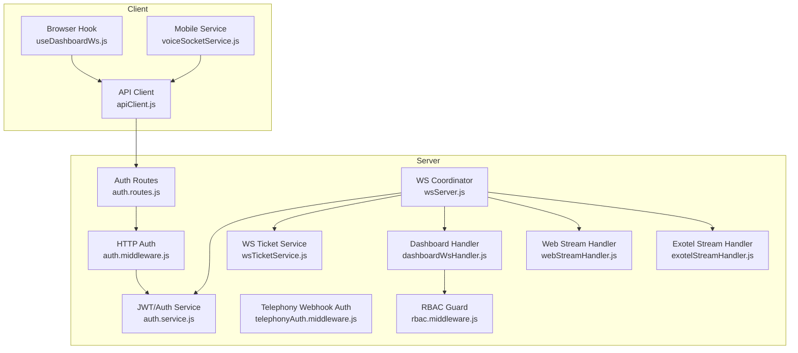
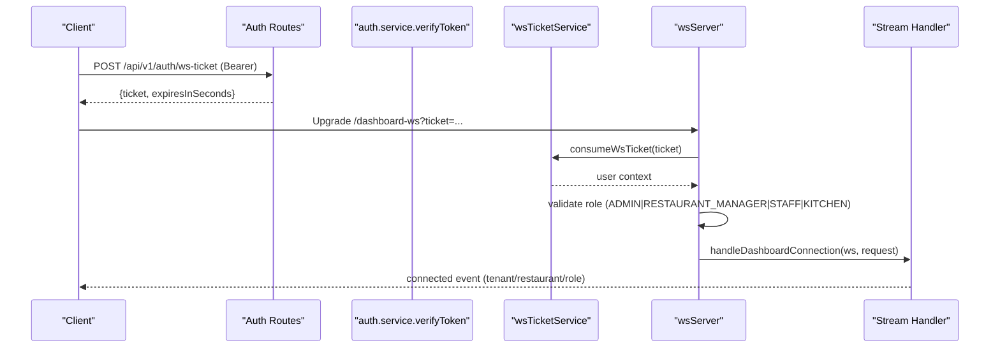
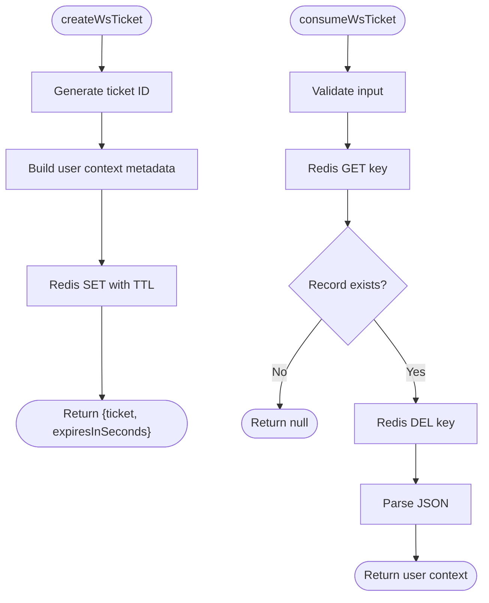
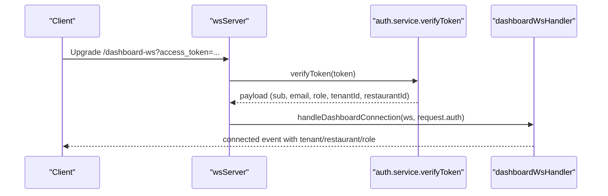
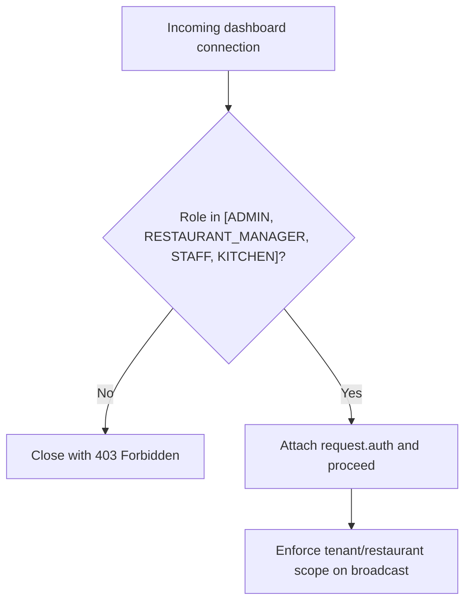
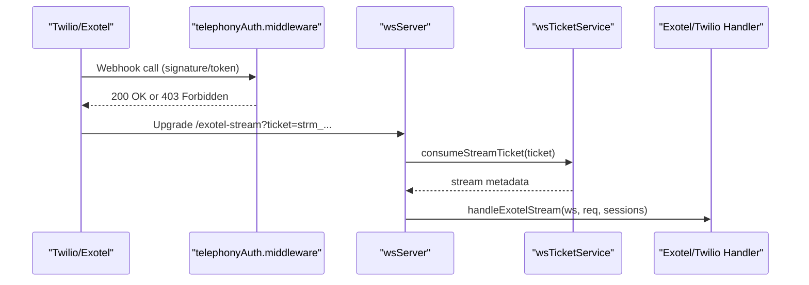
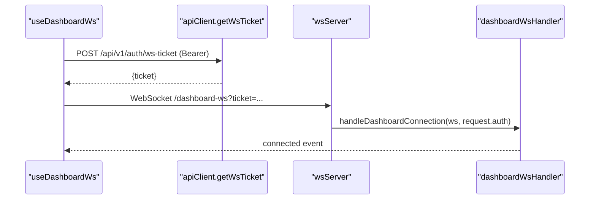
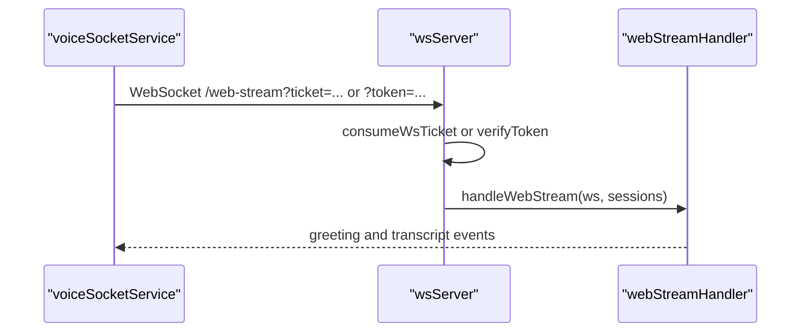
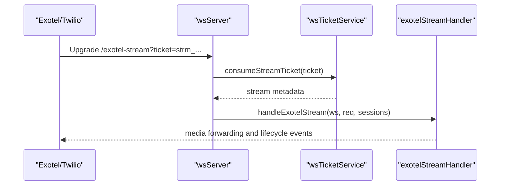
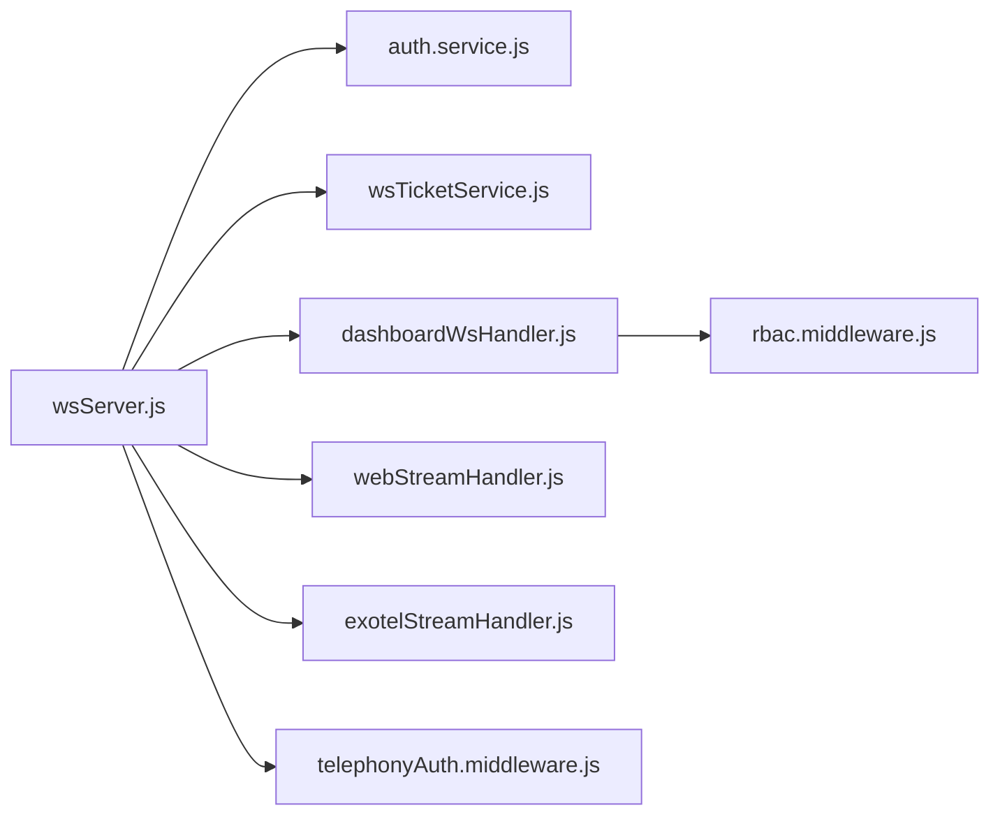

# Authentication Flow & Token Management

<cite>
**Referenced Files in This Document**
- [wsTicketService.js](file://server/src/services/wsTicketService.js)
- [auth.service.js](file://server/src/services/auth.service.js)
- [auth.middleware.js](file://server/src/middleware/auth.middleware.js)
- [rbac.middleware.js](file://server/src/middleware/rbac.middleware.js)
- [telephonyAuth.middleware.js](file://server/src/middleware/telephonyAuth.middleware.js)
- [wsServer.js](file://server/src/websocket/wsServer.js)
- [dashboardWsHandler.js](file://server/src/websocket/dashboardWsHandler.js)
- [webStreamHandler.js](file://server/src/websocket/webStreamHandler.js)
- [exotelStreamHandler.js](file://server/src/websocket/exotelStreamHandler.js)
- [useDashboardWs.js](file://client/src/hooks/useDashboardWs.js)
- [apiClient.js](file://client/src/services/apiClient.js)
- [voiceSocketService.js](file://mobile/src/services/voiceSocketService.js)
- [auth.routes.js](file://server/src/routes/auth.routes.js)
</cite>

## Table of Contents
1. [Introduction](#introduction)
2. [Project Structure](#project-structure)
3. [Core Components](#core-components)
4. [Architecture Overview](#architecture-overview)
5. [Detailed Component Analysis](#detailed-component-analysis)
6. [Dependency Analysis](#dependency-analysis)
7. [Performance Considerations](#performance-considerations)
8. [Troubleshooting Guide](#troubleshooting-guide)
9. [Conclusion](#conclusion)

## Introduction
This document explains Inkiro’s multi-layered authentication system for WebSocket connections. It covers:
- Ticket-based authentication using wsTicketService for secure, single-use access tokens
- JWT verification via verifyToken and its integration with different connection types
- Role-based access control (RBAC) for dashboard connections
- Client-side authentication patterns for dashboard, web voice streams, and telephony streams
- Error handling patterns and production security considerations

## Project Structure
The authentication flow spans server services, middleware, WebSocket handlers, and client hooks/services:
- Server services: ticket generation/consumption and JWT operations
- Middleware: HTTP auth and RBAC guards
- WebSocket coordinator: upgrade-time authentication per path
- Handlers: per-stream logic after successful auth
- Clients: browser hook and mobile service that obtain tickets/tokens and connect

**Diagram sources**
- [wsServer.js:17-147](file://server/src/websocket/wsServer.js#L17-L147)
- [auth.routes.js:7-12](file://server/src/routes/auth.routes.js#L7-L12)
- [auth.middleware.js:10-51](file://server/src/middleware/auth.middleware.js#L10-L51)
- [rbac.middleware.js:15-29](file://server/src/middleware/rbac.middleware.js#L15-L29)
- [telephonyAuth.middleware.js:58-91](file://server/src/middleware/telephonyAuth.middleware.js#L58-L91)
- [auth.service.js:50-120](file://server/src/services/auth.service.js#L50-L120)
- [wsTicketService.js:11-85](file://server/src/services/wsTicketService.js#L11-L85)
- [dashboardWsHandler.js:10-38](file://server/src/websocket/dashboardWsHandler.js#L10-L38)
- [webStreamHandler.js:7-22](file://server/src/websocket/webStreamHandler.js#L7-L22)
- [exotelStreamHandler.js:9-42](file://server/src/websocket/exotelStreamHandler.js#L9-L42)
- [useDashboardWs.js:49-56](file://client/src/hooks/useDashboardWs.js#L49-L56)
- [apiClient.js:58-66](file://client/src/services/apiClient.js#L58-L66)
- [voiceSocketService.js:11-27](file://mobile/src/services/voiceSocketService.js#L11-L27)

**Section sources**
- [wsServer.js:17-147](file://server/src/websocket/wsServer.js#L17-L147)
- [auth.routes.js:7-12](file://server/src/routes/auth.routes.js#L7-L12)

## Core Components
- wsTicketService: Creates short-lived, single-use tickets for dashboard/web and stream-specific tickets for telephony; persists to Redis with TTL and atomically consumes them.
- auth.service: Issues and verifies JWTs with strict issuer/audience and enforces minimum secret length; provides token pair rotation.
- auth.middleware: Extracts Bearer or query token, verifies via verifyToken, and attaches identity to request.
- rbac.middleware: Enforces allowed roles including ADMIN override.
- telephonyAuth.middleware: Validates provider webhook signatures (Twilio HMAC-SHA1, Exotel token).
- wsServer: Centralized upgrade-time authentication per path, routing to appropriate handler.
- Handlers: Per-stream logic post-auth (dashboard, web voice, exotel).

**Section sources**
- [wsTicketService.js:11-85](file://server/src/services/wsTicketService.js#L11-L85)
- [auth.service.js:50-120](file://server/src/services/auth.service.js#L50-L120)
- [auth.middleware.js:10-51](file://server/src/middleware/auth.middleware.js#L10-L51)
- [rbac.middleware.js:15-29](file://server/src/middleware/rbac.middleware.js#L15-L29)
- [telephonyAuth.middleware.js:58-91](file://server/src/middleware/telephonyAuth.middleware.js#L58-L91)
- [wsServer.js:23-116](file://server/src/websocket/wsServer.js#L23-L116)
- [dashboardWsHandler.js:10-38](file://server/src/websocket/dashboardWsHandler.js#L10-L38)
- [webStreamHandler.js:7-22](file://server/src/websocket/webStreamHandler.js#L7-L22)
- [exotelStreamHandler.js:9-42](file://server/src/websocket/exotelStreamHandler.js#L9-L42)

## Architecture Overview
The system uses a layered approach:
- HTTP layer: JWT-based auth for API endpoints and WS ticket issuance
- Upgrade layer: Path-specific authentication at WebSocket upgrade time
- Stream layer: Post-auth processing with tenant/restaurant scoping and role checks

**Diagram sources**
- [auth.routes.js:9-11](file://server/src/routes/auth.routes.js#L9-L11)
- [apiClient.js:58-66](file://client/src/services/apiClient.js#L58-L66)
- [wsServer.js:34-72](file://server/src/websocket/wsServer.js#L34-L72)
- [wsTicketService.js:31-46](file://server/src/services/wsTicketService.js#L31-L46)
- [dashboardWsHandler.js:10-38](file://server/src/websocket/dashboardWsHandler.js#L10-L38)

## Detailed Component Analysis

### Ticket-Based Authentication (wsTicketService)
- Creation: Generates unique tickets with prefixes (wst_ for dashboard/web, strm_ for telephony), stores JSON metadata in Redis with TTL, and returns the ticket string.
- Consumption: Atomically reads and deletes the ticket to ensure single-use semantics across distributed instances.
- TTLs: Short-lived for dashboard/web (seconds) and slightly longer for telephony streams.

**Diagram sources**
- [wsTicketService.js:11-26](file://server/src/services/wsTicketService.js#L11-L26)
- [wsTicketService.js:31-46](file://server/src/services/wsTicketService.js#L31-L46)

**Section sources**
- [wsTicketService.js:11-85](file://server/src/services/wsTicketService.js#L11-L85)

### JWT Verification (verifyToken) and Integration
- Issuance: Short-lived access tokens with strict issuer/audience and required tenant/restaurant context.
- Verification: Uses jose to validate signature and claims; throws standardized errors on failure.
- Integration points:
  - HTTP routes via authMiddleware
  - WebSocket upgrade for /dashboard-ws and /web-stream when no ticket is provided
  - Dashboard handler validates roles from verified claims

**Diagram sources**
- [auth.service.js:50-72](file://server/src/services/auth.service.js#L50-L72)
- [auth.service.js:110-120](file://server/src/services/auth.service.js#L110-L120)
- [wsServer.js:34-72](file://server/src/websocket/wsServer.js#L34-L72)
- [dashboardWsHandler.js:10-38](file://server/src/websocket/dashboardWsHandler.js#L10-L38)

**Section sources**
- [auth.service.js:50-120](file://server/src/services/auth.service.js#L50-L120)
- [wsServer.js:34-72](file://server/src/websocket/wsServer.js#L34-L72)
- [dashboardWsHandler.js:10-38](file://server/src/websocket/dashboardWsHandler.js#L10-L38)

### Role-Based Access Control (RBAC) for Dashboard
- Allowed roles: ADMIN, RESTAURANT_MANAGER, STAFF, KITCHEN
- Enforcement:
  - At WebSocket upgrade for /dashboard-ws, invalid roles are rejected
  - Broadcasts enforce tenant/restaurant boundaries with ADMIN override

**Diagram sources**
- [rbac.middleware.js:3-8](file://server/src/middleware/rbac.middleware.js#L3-L8)
- [rbac.middleware.js:15-29](file://server/src/middleware/rbac.middleware.js#L15-L29)
- [wsServer.js:52-58](file://server/src/websocket/wsServer.js#L52-L58)
- [dashboardWsHandler.js:43-68](file://server/src/websocket/dashboardWsHandler.js#L43-L68)

**Section sources**
- [rbac.middleware.js:15-29](file://server/src/middleware/rbac.middleware.js#L15-L29)
- [wsServer.js:52-58](file://server/src/websocket/wsServer.js#L52-L58)
- [dashboardWsHandler.js:43-68](file://server/src/websocket/dashboardWsHandler.js#L43-L68)

### Telephony Stream Authentication
- Provider webhook validation: Twilio HMAC-SHA1 and Exotel token verification
- Stream tickets: Telephony flows use stream tickets (strm_) validated during WebSocket upgrade for /media-stream and /exotel-stream

**Diagram sources**
- [telephonyAuth.middleware.js:10-53](file://server/src/middleware/telephonyAuth.middleware.js#L10-L53)
- [telephonyAuth.middleware.js:58-91](file://server/src/middleware/telephonyAuth.middleware.js#L58-L91)
- [wsServer.js:99-116](file://server/src/websocket/wsServer.js#L99-L116)
- [wsTicketService.js:52-85](file://server/src/services/wsTicketService.js#L52-L85)
- [exotelStreamHandler.js:9-42](file://server/src/websocket/exotelStreamHandler.js#L9-L42)

**Section sources**
- [telephonyAuth.middleware.js:10-53](file://server/src/middleware/telephonyAuth.middleware.js#L10-L53)
- [wsServer.js:99-116](file://server/src/websocket/wsServer.js#L99-L116)
- [wsTicketService.js:52-85](file://server/src/services/wsTicketService.js#L52-L85)
- [exotelStreamHandler.js:9-42](file://server/src/websocket/exotelStreamHandler.js#L9-L42)

### Client-Side Authentication Examples

#### Dashboard Connections (Browser)
- Obtain a single-use ticket from /api/v1/auth/ws-ticket using a valid Bearer token
- Connect to /dashboard-ws with ?ticket=... or fallback to ?access_token=...
- Reconnect with exponential backoff on close/error

**Diagram sources**
- [useDashboardWs.js:49-56](file://client/src/hooks/useDashboardWs.js#L49-L56)
- [apiClient.js:58-66](file://client/src/services/apiClient.js#L58-L66)
- [wsServer.js:34-72](file://server/src/websocket/wsServer.js#L34-L72)
- [dashboardWsHandler.js:10-38](file://server/src/websocket/dashboardWsHandler.js#L10-L38)

**Section sources**
- [useDashboardWs.js:49-56](file://client/src/hooks/useDashboardWs.js#L49-L56)
- [apiClient.js:58-66](file://client/src/services/apiClient.js#L58-L66)

#### Web Voice Streams (Strict Authentication)
- Accepts either a single-use ticket or a valid JWT
- Strict mode in production: rejects unauthenticated upgrades
- After auth, initializes session and processes audio/text messages

**Diagram sources**
- [wsServer.js:74-97](file://server/src/websocket/wsServer.js#L74-L97)
- [webStreamHandler.js:7-22](file://server/src/websocket/webStreamHandler.js#L7-L22)
- [voiceSocketService.js:11-27](file://mobile/src/services/voiceSocketService.js#L11-L27)

**Section sources**
- [wsServer.js:74-97](file://server/src/websocket/wsServer.js#L74-L97)
- [webStreamHandler.js:7-22](file://server/src/websocket/webStreamHandler.js#L7-L22)
- [voiceSocketService.js:11-27](file://mobile/src/services/voiceSocketService.js#L11-L27)

#### Telephony Streams (Stream-Specific Tickets)
- Telephony providers call webhook endpoints validated by telephonyAuth.middleware
- Media streams authenticate via stream tickets (strm_) during WebSocket upgrade
- Exotel handler initializes session and forwards media to STT pipeline

**Diagram sources**
- [wsServer.js:99-116](file://server/src/websocket/wsServer.js#L99-L116)
- [wsTicketService.js:52-85](file://server/src/services/wsTicketService.js#L52-L85)
- [exotelStreamHandler.js:9-42](file://server/src/websocket/exotelStreamHandler.js#L9-L42)

**Section sources**
- [wsServer.js:99-116](file://server/src/websocket/wsServer.js#L99-L116)
- [wsTicketService.js:52-85](file://server/src/services/wsTicketService.js#L52-L85)
- [exotelStreamHandler.js:9-42](file://server/src/websocket/exotelStreamHandler.js#L9-L42)

## Dependency Analysis
Key dependencies and coupling:
- wsServer depends on auth.service and wsTicketService for all upgrade paths
- Handlers depend on wsServer-provided request.auth or request.streamMeta
- RBAC guard used implicitly in dashboard upgrade and explicitly in broadcast scoping
- Telephony middleware decouples provider-specific validations from stream handlers

**Diagram sources**
- [wsServer.js:17-147](file://server/src/websocket/wsServer.js#L17-L147)
- [auth.service.js:50-120](file://server/src/services/auth.service.js#L50-L120)
- [wsTicketService.js:11-85](file://server/src/services/wsTicketService.js#L11-L85)
- [dashboardWsHandler.js:10-38](file://server/src/websocket/dashboardWsHandler.js#L10-L38)
- [webStreamHandler.js:7-22](file://server/src/websocket/webStreamHandler.js#L7-L22)
- [exotelStreamHandler.js:9-42](file://server/src/websocket/exotelStreamHandler.js#L9-L42)
- [rbac.middleware.js:15-29](file://server/src/middleware/rbac.middleware.js#L15-L29)
- [telephonyAuth.middleware.js:58-91](file://server/src/middleware/telephonyAuth.middleware.js#L58-L91)

**Section sources**
- [wsServer.js:17-147](file://server/src/websocket/wsServer.js#L17-L147)

## Performance Considerations
- Redis-backed tickets: Single-use with TTL reduces storage footprint and ensures scalability across instances
- JWT verification: Stateless and fast; keep secrets strong and rotations minimal
- Payload limits: WebSocket max payload set to prevent abuse
- Heartbeat liveness: Periodic ping/pong cleans stale connections

[No sources needed since this section provides general guidance]

## Troubleshooting Guide
Common error scenarios and responses:
- Missing or invalid JWT: 401 Unauthorized on WebSocket upgrade or API calls
- Invalid role for dashboard: 403 Forbidden during upgrade
- Unauthenticated telephony webhook: 403 Forbidden with provider-specific message
- Failed ticket consumption: Connection rejected due to expired or missing ticket

Mitigations:
- Ensure environment variables for JWT_SECRET and provider tokens are configured
- Validate client-side ticket acquisition before connecting
- Monitor logs for upgrade errors and unauthorized attempts

**Section sources**
- [auth.service.js:110-120](file://server/src/services/auth.service.js#L110-L120)
- [wsServer.js:52-72](file://server/src/websocket/wsServer.js#L52-L72)
- [wsServer.js:90-97](file://server/src/websocket/wsServer.js#L90-L97)
- [wsServer.js:108-116](file://server/src/websocket/wsServer.js#L108-L116)
- [telephonyAuth.middleware.js:58-91](file://server/src/middleware/telephonyAuth.middleware.js#L58-L91)

## Conclusion
Inkiro’s WebSocket authentication combines short-lived tickets and JWTs to provide secure, scalable access control across multiple stream types. The design enforces strict role checks for dashboards, validates telephony provider webhooks, and isolates tenant/restaurant contexts. Following the documented client patterns and production security practices ensures robust and maintainable real-time communication.