# Connection Lifecycle & Session Management

<cite>
**Referenced Files in This Document**
- [wsServer.js](file://server/src/websocket/wsServer.js)
- [dashboardWsHandler.js](file://server/src/websocket/dashboardWsHandler.js)
- [webStreamHandler.js](file://server/src/websocket/webStreamHandler.js)
- [mediaStreamHandler.js](file://server/src/websocket/mediaStreamHandler.js)
- [exotelStreamHandler.js](file://server/src/websocket/exotelStreamHandler.js)
- [sessionPipeline.js](file://server/src/websocket/sessionPipeline.js)
- [sessionStore.js](file://server/src/infra/sessionStore.js)
- [wsTicketService.js](file://server/src/services/wsTicketService.js)
- [auth.service.js](file://server/src/services/auth.service.js)
- [useDashboardWs.js](file://client/src/hooks/useDashboardWs.js)
- [voiceSocketService.js](file://mobile/src/services/voiceSocketService.js)
</cite>

## Table of Contents
1. Introduction
2. Project Structure
3. Core Components
4. Architecture Overview
5. Detailed Component Analysis
6. Dependency Analysis
7. Performance Considerations
8. Troubleshooting Guide
9. Conclusion
10. Appendices

## Introduction
This document explains the complete WebSocket connection lifecycle in Inkiro, from HTTP upgrade handshake to session initialization, authentication validation, multi-stream routing, and graceful termination. It covers four distinct streams:
- /dashboard-ws for admin interfaces
- /web-stream for browser voice calls
- /media-stream for Twilio integrations
- /exotel-stream for Exotel telephony

It also documents the in-memory Map used for active sessions, Redis-backed ephemeral session persistence, error recovery mechanisms, cleanup procedures, and client-side connection patterns with reconnection strategies.

## Project Structure
The WebSocket subsystem is centered around a coordinator that performs per-path authentication and routes upgrades to specialized handlers. A shared in-memory Map tracks active sessions across handlers, while Redis provides distributed, short-lived session metadata.

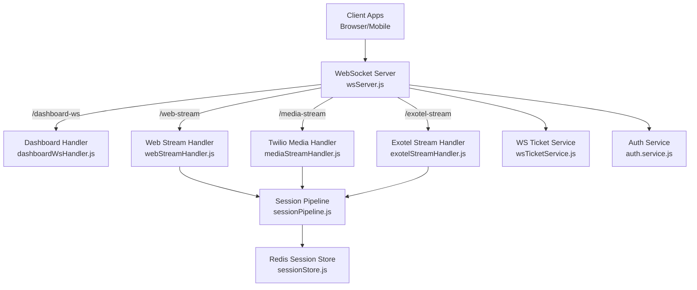

**Diagram sources**
- [wsServer.js:17-147](file://server/src/websocket/wsServer.js#L17-L147)
- [dashboardWsHandler.js:10-38](file://server/src/websocket/dashboardWsHandler.js#L10-L38)
- [webStreamHandler.js:7-21](file://server/src/websocket/webStreamHandler.js#L7-L21)
- [mediaStreamHandler.js:7-38](file://server/src/websocket/mediaStreamHandler.js#L7-L38)
- [exotelStreamHandler.js:9-42](file://server/src/websocket/exotelStreamHandler.js#L9-L42)
- [sessionPipeline.js:24-111](file://server/src/websocket/sessionPipeline.js#L24-L111)
- [sessionStore.js:13-65](file://server/src/infra/sessionStore.js#L13-L65)
- [wsTicketService.js:11-86](file://server/src/services/wsTicketService.js#L11-L86)
- [auth.service.js:110-120](file://server/src/services/auth.service.js#L110-L120)

**Section sources**
- [wsServer.js:17-147](file://server/src/websocket/wsServer.js#L17-L147)

## Core Components
- WebSocket Coordinator: Performs path-based routing, per-stream authentication, and upgrade orchestration. Maintains an in-memory Map of active sessions and a heartbeat liveness check.
- Handlers: Specialized per stream (dashboard, web, twilio, exotel). Each initializes or consumes sessions and manages message flows.
- Session Pipeline: Orchestrates STT/TTS, dialogue processing, order confirmation, and end-of-call cleanup. Persists state to Redis and updates DB records.
- Session Store: Redis-backed ephemeral store for cross-instance discovery and TTL-managed session metadata.
- Authentication: Single-use tickets for dashboard/web and stream tickets for telephony; JWT verification for token-based access.

Key responsibilities:
- Multi-stream upgrade with strict authorization checks
- Shared in-memory session tracking via a Map passed into handlers
- Ephemeral Redis persistence for distributed visibility
- Heartbeat-based dead connection cleanup
- Graceful session teardown and resource release

**Section sources**
- [wsServer.js:11-161](file://server/src/websocket/wsServer.js#L11-L161)
- [sessionPipeline.js:24-111](file://server/src/websocket/sessionPipeline.js#L24-L111)
- [sessionStore.js:1-92](file://server/src/infra/sessionStore.js#L1-L92)
- [wsTicketService.js:1-86](file://server/src/services/wsTicketService.js#L1-L86)
- [auth.service.js:110-120](file://server/src/services/auth.service.js#L110-L120)

## Architecture Overview
The system uses a single WebSocket server instance bound to an existing HTTP server. On each upgrade request, it validates the path, authenticates using either single-use tickets or tokens, then delegates to the appropriate handler. All handlers share a global in-memory Map for live sessions. The pipeline integrates STT/TTS, dialogue management, and async workers for dispatch and notifications.

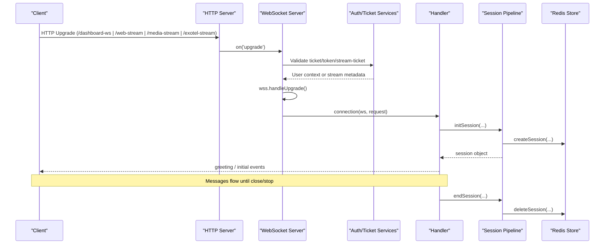

**Diagram sources**
- [wsServer.js:23-147](file://server/src/websocket/wsServer.js#L23-L147)
- [wsTicketService.js:11-86](file://server/src/services/wsTicketService.js#L11-L86)
- [auth.service.js:110-120](file://server/src/services/auth.service.js#L110-L120)
- [sessionPipeline.js:24-111](file://server/src/websocket/sessionPipeline.js#L24-L111)
- [sessionStore.js:13-65](file://server/src/infra/sessionStore.js#L13-L65)

## Detailed Component Analysis

### WebSocket Coordinator (wsServer.js)
- Path validation: Only allows /dashboard-ws, /web-stream, /media-stream, /exotel-stream. Others receive 404 and socket destroy.
- Authentication:
  - /dashboard-ws: Accepts single-use ticket or Bearer token; enforces role allowlist; dev fallback when not in production.
  - /web-stream: Accepts single-use ticket or token; no demo bypass in production.
  - /media-stream and /exotel-stream: Require stream ticket; otherwise unauthorized in production.
- Upgrade: Delegates to ws.handleUpgrade and emits 'connection' with enriched request.
- Liveness: Ping/pong every 30 seconds; terminates unresponsive clients.
- Session Map: Exposes a shared Map to handlers for active session tracking.

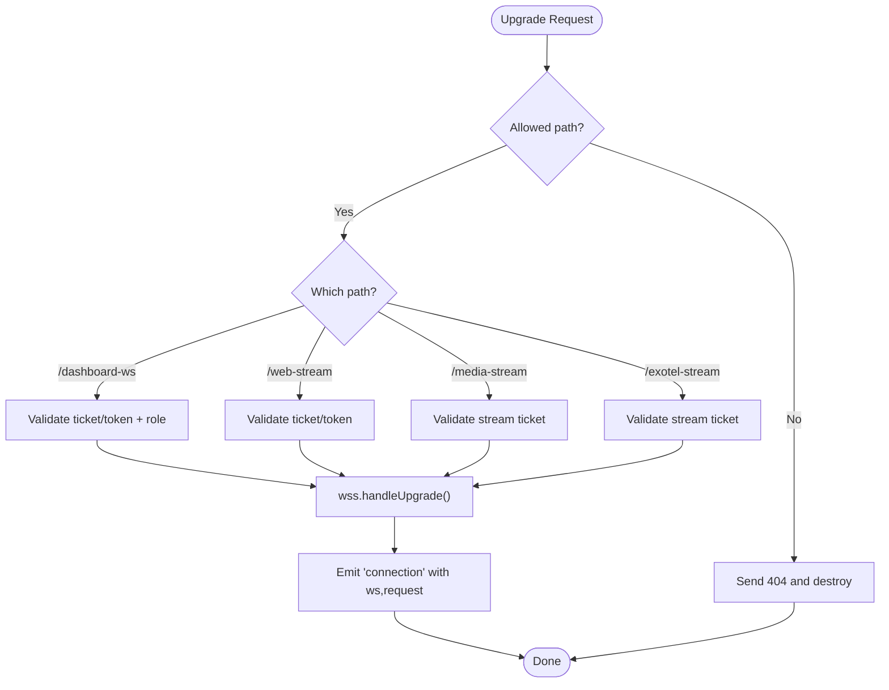

**Diagram sources**
- [wsServer.js:23-147](file://server/src/websocket/wsServer.js#L23-L147)

**Section sources**
- [wsServer.js:23-147](file://server/src/websocket/wsServer.js#L23-L147)
- [wsServer.js:149-161](file://server/src/websocket/wsServer.js#L149-L161)

### Dashboard WebSocket Handler (/dashboard-ws)
- Requires authenticated user context; closes with code if missing.
- Tracks connected clients in a Set and sends an initial handshake with tenant/restaurant/role.
- Broadcasts events with tenant/restaurant scoping to ensure fail-closed isolation.

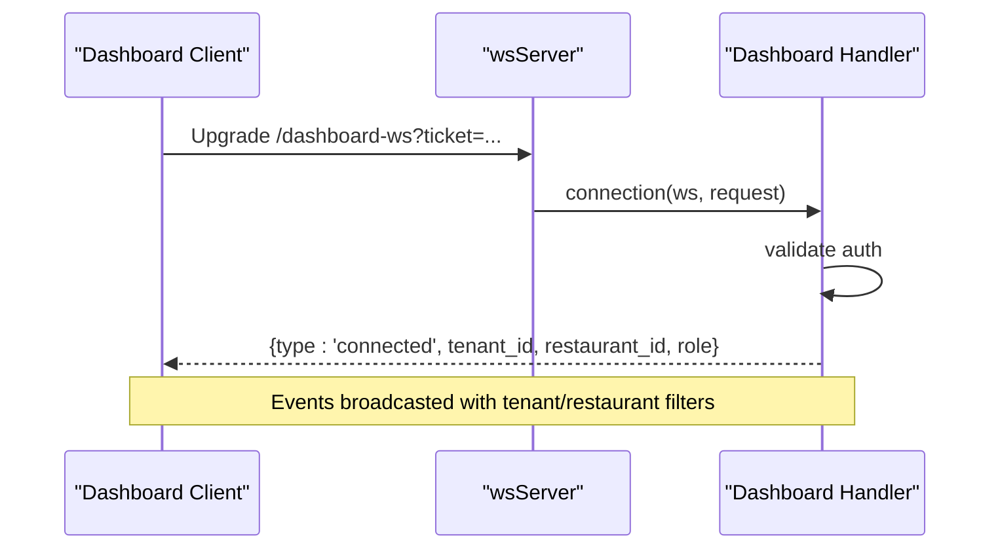

**Diagram sources**
- [dashboardWsHandler.js:10-38](file://server/src/websocket/dashboardWsHandler.js#L10-L38)
- [dashboardWsHandler.js:43-68](file://server/src/websocket/dashboardWsHandler.js#L43-L68)

**Section sources**
- [dashboardWsHandler.js:10-68](file://server/src/websocket/dashboardWsHandler.js#L10-L68)

### Web Stream Handler (/web-stream)
- Initializes a voice session with source 'web', sets tenant/restaurant context, and sends a greeting.
- Handles messages:
  - audio: base64-encoded audio buffer transcribed via STT; transcript processed through dialogue pipeline; response streamed back.
  - text: direct text input processed by dialogue pipeline.
  - end: triggers session end and cleanup.
- Stores audio chunks up to a limit for later transcription/persistence.

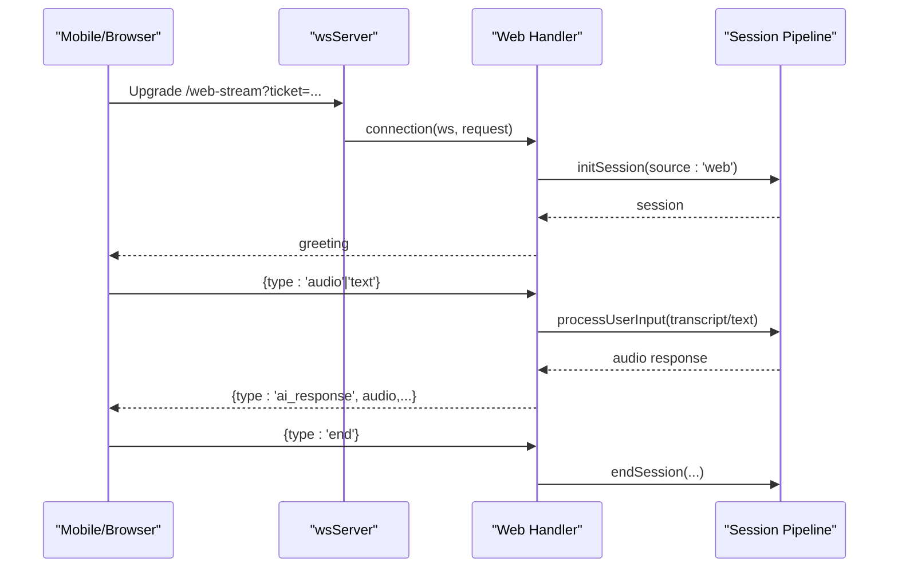

**Diagram sources**
- [webStreamHandler.js:7-81](file://server/src/websocket/webStreamHandler.js#L7-L81)
- [sessionPipeline.js:24-111](file://server/src/websocket/sessionPipeline.js#L24-L111)

**Section sources**
- [webStreamHandler.js:7-81](file://server/src/websocket/webStreamHandler.js#L7-L81)

### Twilio Media Stream Handler (/media-stream)
- Parses Twilio AgentStream events:
  - start: extracts streamSid/callSid, creates session with source 'twilio', sends greeting.
  - media: converts Mu-law to PCM16, writes to STT stream, stores audio chunks.
  - stop: ends session.
- Uses streamMeta attached during upgrade for tenant/restaurant context.

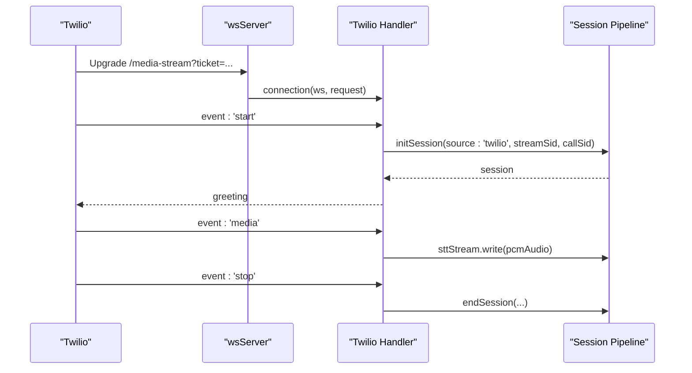

**Diagram sources**
- [mediaStreamHandler.js:7-69](file://server/src/websocket/mediaStreamHandler.js#L7-L69)
- [sessionPipeline.js:24-111](file://server/src/websocket/sessionPipeline.js#L24-L111)

**Section sources**
- [mediaStreamHandler.js:7-69](file://server/src/websocket/mediaStreamHandler.js#L7-L69)

### Exotel Stream Handler (/exotel-stream)
- Similar to Twilio but tailored to Exotel’s AgentStream payload shapes.
- Extracts streamSid/callSid/callerPhone, initializes session with source 'exotel', sends greeting.
- Writes incoming media to STT stream and ends session on stop/close.

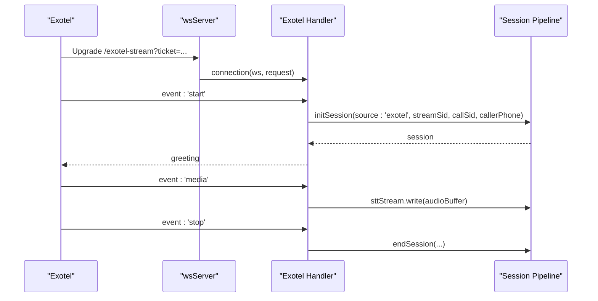

**Diagram sources**
- [exotelStreamHandler.js:9-80](file://server/src/websocket/exotelStreamHandler.js#L9-L80)
- [sessionPipeline.js:24-111](file://server/src/websocket/sessionPipeline.js#L24-L111)

**Section sources**
- [exotelStreamHandler.js:9-80](file://server/src/websocket/exotelStreamHandler.js#L9-L80)

### Session Pipeline (sessionPipeline.js)
- initSession:
  - Validates tenant/restaurant context.
  - Creates STT stream, builds session object, registers STT transcript listener.
  - Persists ephemeral session to Redis and inserts DB record for calls.
  - Broadcasts call_started to dashboard.
- sendGreeting: processes initial turn and returns synthesized speech.
- processUserInput:
  - Updates conversation history, logs events, runs dialogue engine, measures latency, broadcasts AI response, sends audio response immediately.
  - On confirmed orders, triggers geocoding, order creation, dispatch queue, notification queue, and dashboard broadcast.
- sendAudioResponse:
  - Synthesizes speech and streams chunks to telephony providers or sends base64 audio to web clients.
  - Handles errors gracefully and still informs web clients.
- endSession:
  - Ends STT stream, updates DB status, offloads recording to worker queue, broadcasts call_ended, deletes in-memory and Redis sessions.

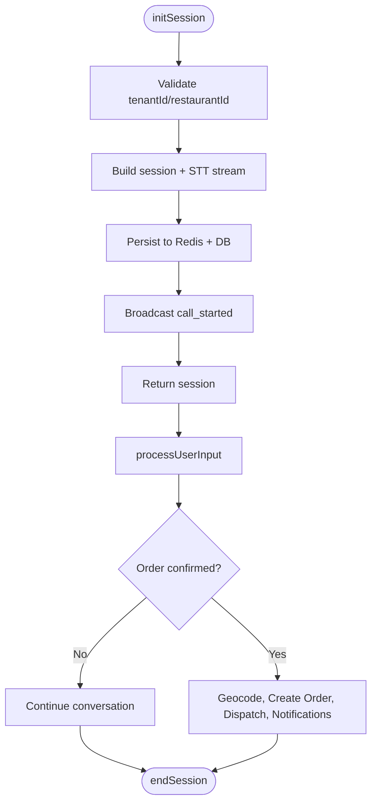

**Diagram sources**
- [sessionPipeline.js:24-111](file://server/src/websocket/sessionPipeline.js#L24-L111)
- [sessionPipeline.js:132-219](file://server/src/websocket/sessionPipeline.js#L132-L219)
- [sessionPipeline.js:224-294](file://server/src/websocket/sessionPipeline.js#L224-L294)
- [sessionPipeline.js:299-389](file://server/src/websocket/sessionPipeline.js#L299-L389)
- [sessionPipeline.js:394-437](file://server/src/websocket/sessionPipeline.js#L394-L437)

**Section sources**
- [sessionPipeline.js:24-437](file://server/src/websocket/sessionPipeline.js#L24-L437)

### Session Store (sessionStore.js)
- Redis-backed ephemeral store with prefix keys and TTL.
- Functions: createSession, getSession, updateSession, deleteSession, touchSession, listActiveSessions.
- Supports filtering by tenantId and restaurantId for cluster-wide discovery.

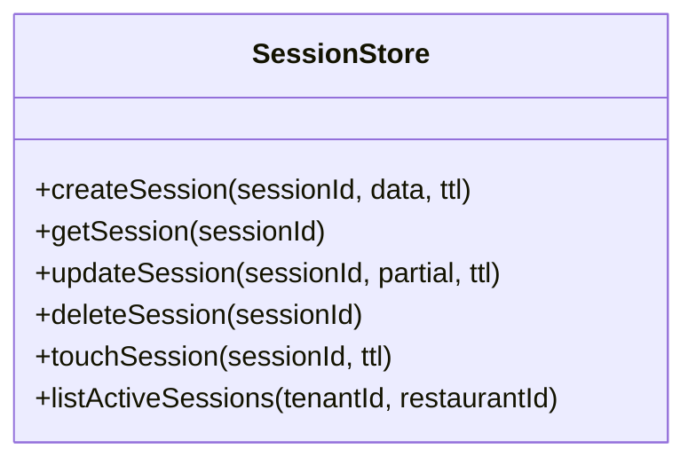

**Diagram sources**
- [sessionStore.js:13-92](file://server/src/infra/sessionStore.js#L13-L92)

**Section sources**
- [sessionStore.js:1-92](file://server/src/infra/sessionStore.js#L1-L92)

### Authentication and Tickets
- WS Ticket Service:
  - createWsTicket/createStreamTicket: generate single-use tickets stored in Redis with TTLs (short-lived).
  - consumeWsTicket/consumeStreamTicket: atomic get-and-delete to enforce single use.
- Auth Service:
  - verifyToken: validates JWT with issuer/audience constraints.
  - generateToken/generateTokenPair: issues short-lived access tokens with tenant context.

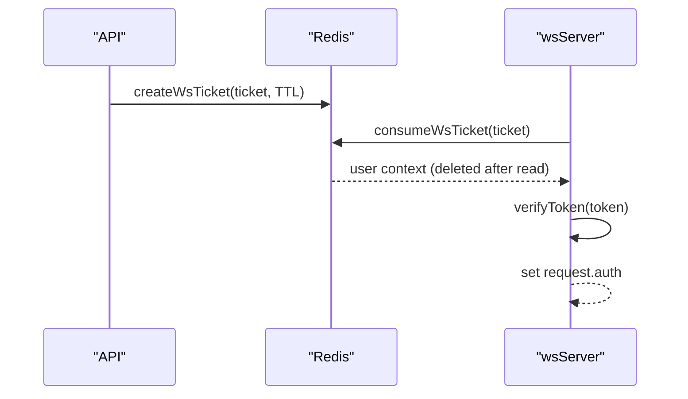

**Diagram sources**
- [wsTicketService.js:11-86](file://server/src/services/wsTicketService.js#L11-L86)
- [auth.service.js:110-120](file://server/src/services/auth.service.js#L110-L120)
- [wsServer.js:34-116](file://server/src/websocket/wsServer.js#L34-L116)

**Section sources**
- [wsTicketService.js:1-86](file://server/src/services/wsTicketService.js#L1-L86)
- [auth.service.js:110-120](file://server/src/services/auth.service.js#L110-L120)
- [wsServer.js:34-116](file://server/src/websocket/wsServer.js#L34-L116)

## Dependency Analysis
- wsServer depends on:
  - wsTicketService for single-use tickets
  - auth.service for JWT verification
  - dashboardWsHandler, webStreamHandler, mediaStreamHandler, exotelStreamHandler for per-path logic
  - sessionPipeline indirectly via handlers for session lifecycle
- Handlers depend on:
  - sessionPipeline for session init, processing, and end
  - sessionStore for Redis-backed ephemeral state
- sessionPipeline depends on:
  - services (STT/TTS, dialogue manager, geocoding)
  - queues (dispatch, notification, recording)
  - dashboardWsHandler for broadcasting events

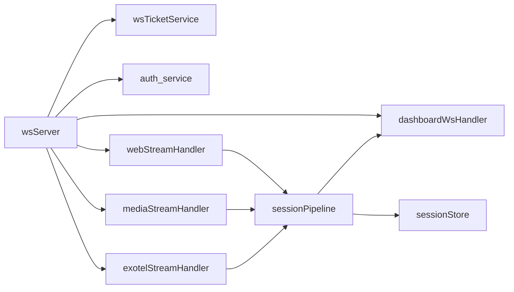

**Diagram sources**
- [wsServer.js:1-10](file://server/src/websocket/wsServer.js#L1-L10)
- [webStreamHandler.js:1-2](file://server/src/websocket/webStreamHandler.js#L1-L2)
- [mediaStreamHandler.js:1-3](file://server/src/websocket/mediaStreamHandler.js#L1-L3)
- [exotelStreamHandler.js:1-2](file://server/src/websocket/exotelStreamHandler.js#L1-L2)
- [sessionPipeline.js:1-16](file://server/src/websocket/sessionPipeline.js#L1-L16)
- [sessionStore.js:1-2](file://server/src/infra/sessionStore.js#L1-L2)

**Section sources**
- [wsServer.js:1-10](file://server/src/websocket/wsServer.js#L1-L10)
- [sessionPipeline.js:1-16](file://server/src/websocket/sessionPipeline.js#L1-L16)

## Performance Considerations
- Payload limits: Max payload set to 512KB to prevent oversized messages.
- Audio chunking: Telephony streams send small chunks (e.g., 640 bytes) to reduce latency and memory pressure.
- Memory caps: Active call memory capped at 2MB per session; audio chunks limited to avoid unbounded growth.
- Heartbeat: 30-second ping interval detects dead connections promptly.
- Async offloading: Order fulfillment, notifications, and recordings are queued to workers to keep the main loop responsive.

[No sources needed since this section provides general guidance]

## Troubleshooting Guide
Common issues and resolutions:
- Unauthorized stream attempts:
  - Ensure stream tickets are generated and valid within TTL before connecting to /media-stream or /exotel-stream.
  - Verify NODE_ENV handling; in production, missing tickets result in 401.
- Dashboard connection failures:
  - Provide a valid single-use ticket or Bearer token; ensure roles are allowed.
  - Dev mode may allow fallback; production requires proper credentials.
- Stuck or dead connections:
  - Heartbeat will terminate unresponsive clients; check network/firewall issues.
- Session not found:
  - Confirm initSession was called and Redis connectivity is healthy; check Redis TTL and key prefixes.
- Audio not playing:
  - For web clients, ensure readyState is OPEN before sending; handle TTS errors gracefully.
  - For telephony, confirm Mu-law to PCM conversion and correct streamSid usage.

**Section sources**
- [wsServer.js:23-127](file://server/src/websocket/wsServer.js#L23-L127)
- [dashboardWsHandler.js:10-38](file://server/src/websocket/dashboardWsHandler.js#L10-L38)
- [sessionPipeline.js:224-294](file://server/src/websocket/sessionPipeline.js#L224-L294)
- [mediaStreamHandler.js:40-55](file://server/src/websocket/mediaStreamHandler.js#L40-L55)
- [exotelStreamHandler.js:45-67](file://server/src/websocket/exotelStreamHandler.js#L45-L67)

## Conclusion
Inkiro’s WebSocket subsystem implements a robust, multi-stream architecture with strong authentication, shared session tracking, and resilient cleanup. The coordinator centralizes upgrade handling and security, while specialized handlers manage domain-specific flows. The session pipeline ensures low-latency interactions and reliable order processing, backed by Redis for distributed visibility and workers for scalability. Clients implement reconnection strategies and proper message handling to maintain stable connections under varying network conditions.

[No sources needed since this section summarizes without analyzing specific files]

## Appendices

### Client-Side Connection Patterns and Reconnection Strategies

#### Dashboard Client (/dashboard-ws)
- Obtains a single-use ticket or uses stored token to connect to /dashboard-ws.
- Implements exponential backoff reconnection with jitter and caps max delay.
- Refreshes stats on relevant events and handles auth changes by reconnecting.

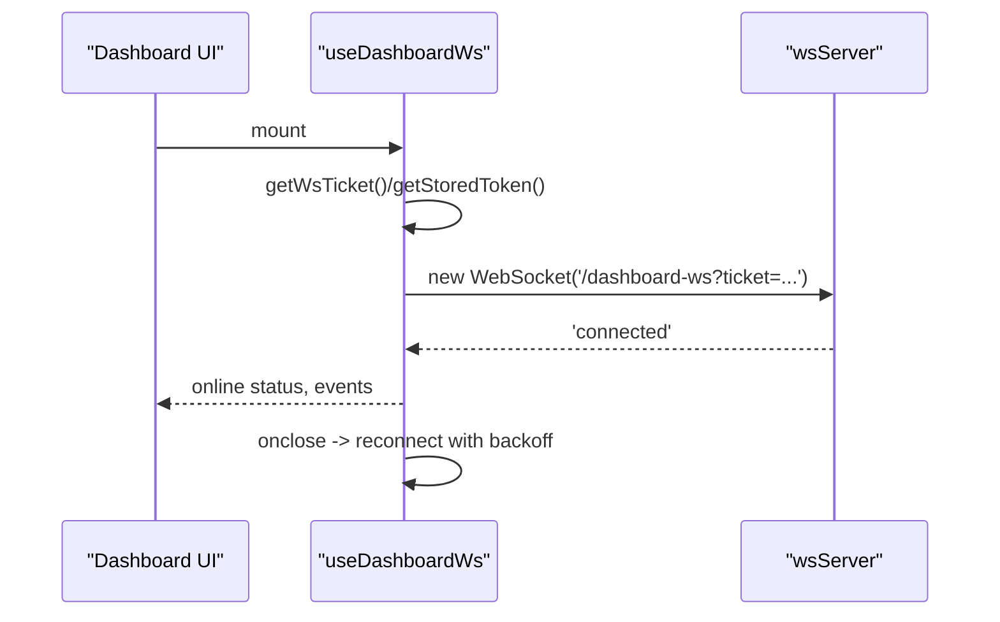

**Diagram sources**
- [useDashboardWs.js:45-109](file://client/src/hooks/useDashboardWs.js#L45-L109)

**Section sources**
- [useDashboardWs.js:45-109](file://client/src/hooks/useDashboardWs.js#L45-L109)

#### Mobile/Web Voice Client (/web-stream)
- Connects to /web-stream with a ticket or token.
- Sends 'start' handshake, streams audio or text, listens for AI responses.
- Sends 'end' on disconnect to trigger server-side cleanup.

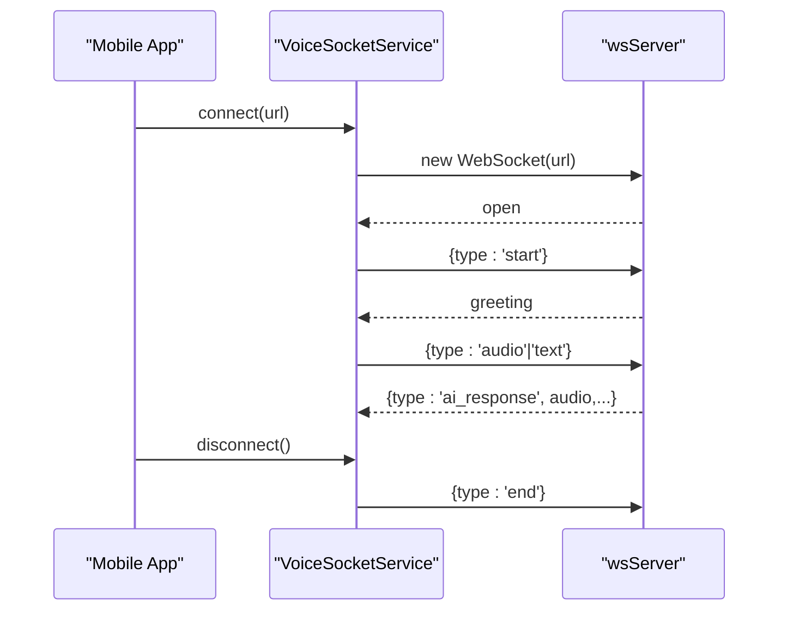

**Diagram sources**
- [voiceSocketService.js:11-99](file://mobile/src/services/voiceSocketService.js#L11-L99)
- [webStreamHandler.js:23-81](file://server/src/websocket/webStreamHandler.js#L23-L81)

**Section sources**
- [voiceSocketService.js:11-99](file://mobile/src/services/voiceSocketService.js#L11-L99)
- [webStreamHandler.js:23-81](file://server/src/websocket/webStreamHandler.js#L23-L81)

### Error Recovery and Cleanup Procedures
- Server-side:
  - Upgrade errors return 500 and destroy sockets.
  - Unauthorized paths return 404; invalid credentials return 401/403.
  - Heartbeat terminates stale connections.
  - endSession cleans STT streams, updates DB, offloads recordings, and removes sessions from Map and Redis.
- Client-side:
  - Dashboard hook uses exponential backoff reconnection and clears timeouts on unmount.
  - Mobile service emits events for open/error/close and supports explicit disconnect with 'end'.

**Section sources**
- [wsServer.js:122-127](file://server/src/websocket/wsServer.js#L122-L127)
- [wsServer.js:149-161](file://server/src/websocket/wsServer.js#L149-L161)
- [sessionPipeline.js:394-437](file://server/src/websocket/sessionPipeline.js#L394-L437)
- [useDashboardWs.js:80-109](file://client/src/hooks/useDashboardWs.js#L80-L109)
- [voiceSocketService.js:91-99](file://mobile/src/services/voiceSocketService.js#L91-L99)