# Connection Management & Authentication

<cite>
**Referenced Files in This Document**
- [wsServer.js](file://server/src/websocket/wsServer.js)
- [wsTicketService.js](file://server/src/services/wsTicketService.js)
- [dashboardWsHandler.js](file://server/src/websocket/dashboardWsHandler.js)
- [webStreamHandler.js](file://server/src/websocket/webStreamHandler.js)
- [exotelStreamHandler.js](file://server/src/websocket/exotelStreamHandler.js)
- [mediaStreamHandler.js](file://server/src/websocket/mediaStreamHandler.js)
- [sessionPipeline.js](file://server/src/websocket/sessionPipeline.js)
- [auth.service.js](file://server/src/services/auth.service.js)
- [rbac.middleware.js](file://server/src/middleware/rbac.middleware.js)
- [telephonyAuth.middleware.js](file://server/src/middleware/telephonyAuth.middleware.js)
- [apiClient.js](file://client/src/services/apiClient.js)
- [useDashboardWs.js](file://client/src/hooks/useDashboardWs.js)
- [voiceSocketService.js](file://mobile/src/services/voiceSocketService.js)
</cite>

## Table of Contents
1. Introduction
2. Project Structure
3. Core Components
4. Architecture Overview
5. Detailed Component Analysis
6. Dependency Analysis
7. Performance Considerations
8. Troubleshooting Guide
9. Conclusion
10. Appendices

## Introduction
This document explains how Inkiro manages WebSocket connections and authenticates them across three connection types:
- Dashboard connections for administrative and operational staff
- Web voice streams for browser/mobile audio sessions
- Telephony streams for PSTN calls via Twilio or Exotel

It covers the multi-stream upgrade authentication flow, ticket-based one-time access tokens, role-based access control (RBAC), session lifecycle, heartbeat liveness checks, and client-side connection patterns with error handling and reconnection strategies.

## Project Structure
The server exposes a single WebSocket coordinator that routes incoming upgrade requests to specialized handlers based on path:
- /dashboard-ws: dashboard real-time events
- /web-stream: browser/mobile voice sessions
- /media-stream: Twilio media stream
- /exotel-stream: Exotel AgentStream

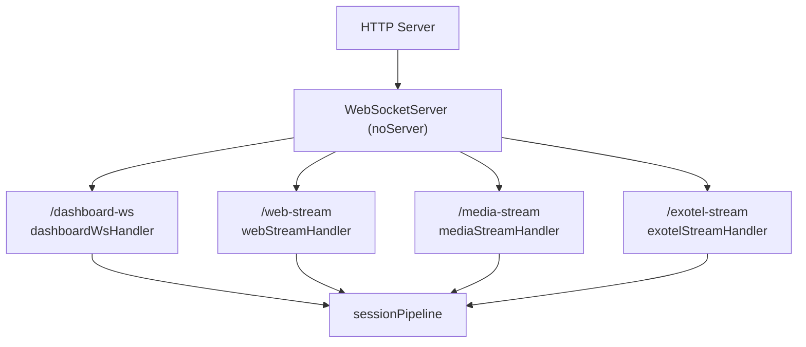

**Diagram sources**
- [wsServer.js:17-147](file://server/src/websocket/wsServer.js#L17-L147)
- [dashboardWsHandler.js:10-38](file://server/src/websocket/dashboardWsHandler.js#L10-L38)
- [webStreamHandler.js:7-22](file://server/src/websocket/webStreamHandler.js#L7-L22)
- [mediaStreamHandler.js:7-38](file://server/src/websocket/mediaStreamHandler.js#L7-L38)
- [exotelStreamHandler.js:9-42](file://server/src/websocket/exotelStreamHandler.js#L9-L42)
- [sessionPipeline.js:24-111](file://server/src/websocket/sessionPipeline.js#L24-L111)

**Section sources**
- [wsServer.js:17-147](file://server/src/websocket/wsServer.js#L17-L147)

## Core Components
- WebSocket Coordinator: centralizes upgrade routing, per-path authentication, and heartbeat.
- Ticket Service: issues and consumes short-lived, single-use tickets for secure upgrades.
- Auth Service: JWT issuance and verification for dashboard and web voice streams.
- Stream Handlers: per-connection-type logic for initialization, message processing, and teardown.
- Session Pipeline: shared voice session state, STT/TTS orchestration, order confirmation, and cleanup.
- RBAC Middleware: enforces allowed roles for dashboard access.
- Telephony Auth: validates provider signatures and stream tickets for telephony paths.
- Client Libraries: React hook and mobile service for resilient connections and reconnection.

**Section sources**
- [wsServer.js:17-160](file://server/src/websocket/wsServer.js#L17-L160)
- [wsTicketService.js:11-85](file://server/src/services/wsTicketService.js#L11-L85)
- [auth.service.js:50-120](file://server/src/services/auth.service.js#L50-L120)
- [dashboardWsHandler.js:10-69](file://server/src/websocket/dashboardWsHandler.js#L10-L69)
- [webStreamHandler.js:7-81](file://server/src/websocket/webStreamHandler.js#L7-L81)
- [mediaStreamHandler.js:7-69](file://server/src/websocket/mediaStreamHandler.js#L7-L69)
- [exotelStreamHandler.js:9-80](file://server/src/websocket/exotelStreamHandler.js#L9-L80)
- [sessionPipeline.js:24-437](file://server/src/websocket/sessionPipeline.js#L24-L437)
- [rbac.middleware.js:3-32](file://server/src/middleware/rbac.middleware.js#L3-L32)
- [telephonyAuth.middleware.js:10-92](file://server/src/middleware/telephonyAuth.middleware.js#L10-L92)
- [apiClient.js:58-66](file://client/src/services/apiClient.js#L58-L66)
- [useDashboardWs.js:45-109](file://client/src/hooks/useDashboardWs.js#L45-L109)
- [voiceSocketService.js:11-99](file://mobile/src/services/voiceSocketService.js#L11-L99)

## Architecture Overview
The system uses a unified upgrade handler that performs per-path authentication before upgrading to WebSocket. After upgrade, each handler initializes a session and delegates ongoing processing to the shared pipeline. A global heartbeat ensures dead connections are terminated promptly.

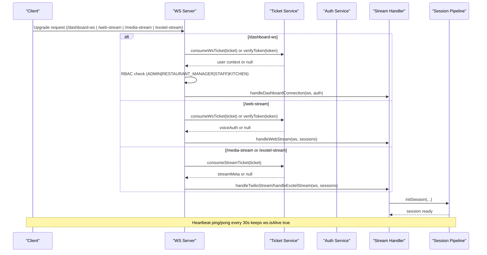

**Diagram sources**
- [wsServer.js:23-147](file://server/src/websocket/wsServer.js#L23-L147)
- [wsTicketService.js:31-85](file://server/src/services/wsTicketService.js#L31-L85)
- [auth.service.js:110-120](file://server/src/services/auth.service.js#L110-L120)
- [dashboardWsHandler.js:10-38](file://server/src/websocket/dashboardWsHandler.js#L10-L38)
- [webStreamHandler.js:7-22](file://server/src/websocket/webStreamHandler.js#L7-L22)
- [mediaStreamHandler.js:7-38](file://server/src/websocket/mediaStreamHandler.js#L7-L38)
- [exotelStreamHandler.js:9-42](file://server/src/websocket/exotelStreamHandler.js#L9-L42)
- [sessionPipeline.js:24-111](file://server/src/websocket/sessionPipeline.js#L24-L111)

## Detailed Component Analysis

### Multi-Stream Upgrade Authentication
- Path gating: only four paths are accepted; others receive 404 and socket destroy.
- Dashboard (/dashboard-ws):
  - Accepts either a single-use ticket or a Bearer token.
  - Validates role against ADMIN, RESTAURANT_MANAGER, STAFF, KITCHEN.
  - Dev fallback allows a synthetic admin user when not in production.
- Web Voice (/web-stream):
  - Accepts ticket or token; no demo bypass in production.
- Telephony (/media-stream, /exotel-stream):
  - Requires a stream ticket validated by consumeStreamTicket.
  - In production, missing ticket results in 401.

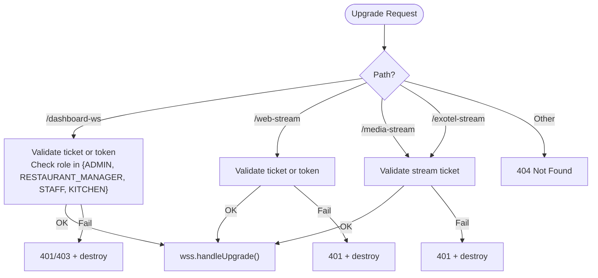

**Diagram sources**
- [wsServer.js:23-127](file://server/src/websocket/wsServer.js#L23-L127)
- [rbac.middleware.js:3-32](file://server/src/middleware/rbac.middleware.js#L3-L32)

**Section sources**
- [wsServer.js:23-127](file://server/src/websocket/wsServer.js#L23-L127)

### Ticket-Based Authentication Flow (wsTicketService)
- createWsTicket: generates a short-lived, single-use ticket stored in Redis with TTL.
- consumeWsTicket: atomically reads and deletes the ticket to ensure one-time use.
- createStreamTicket/consumeStreamTicket: similar mechanism for telephony streams with longer TTL.

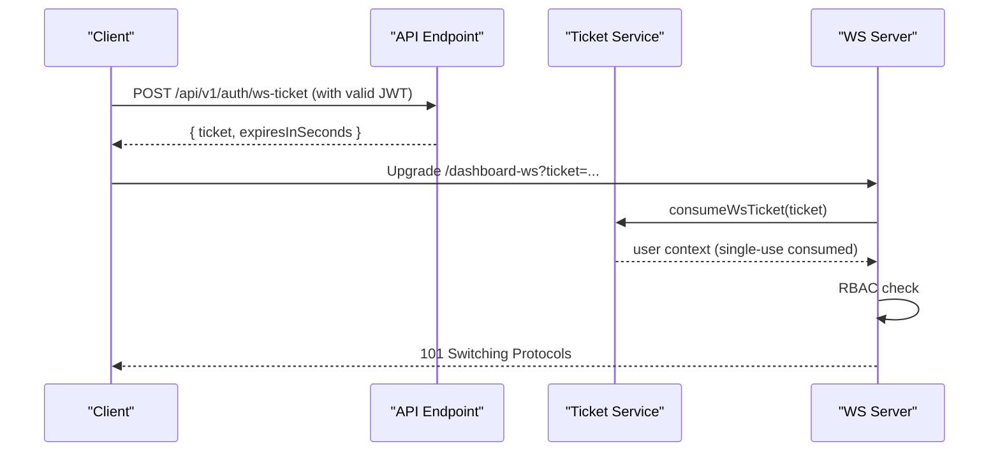

**Diagram sources**
- [wsTicketService.js:11-46](file://server/src/services/wsTicketService.js#L11-L46)
- [wsTicketService.js:52-85](file://server/src/services/wsTicketService.js#L52-L85)
- [wsServer.js:34-72](file://server/src/websocket/wsServer.js#L34-L72)
- [apiClient.js:58-66](file://client/src/services/apiClient.js#L58-L66)

**Section sources**
- [wsTicketService.js:11-85](file://server/src/services/wsTicketService.js#L11-L85)
- [wsServer.js:34-72](file://server/src/websocket/wsServer.js#L34-L72)
- [apiClient.js:58-66](file://client/src/services/apiClient.js#L58-L66)

### Role-Based Access Control for Dashboard
- Allowed roles: ADMIN, RESTAURANT_MANAGER, STAFF, KITCHEN.
- If a user’s role is not in the allowed set, the upgrade is rejected with 403.
- Admin can override tenant-scoped broadcasts where applicable.

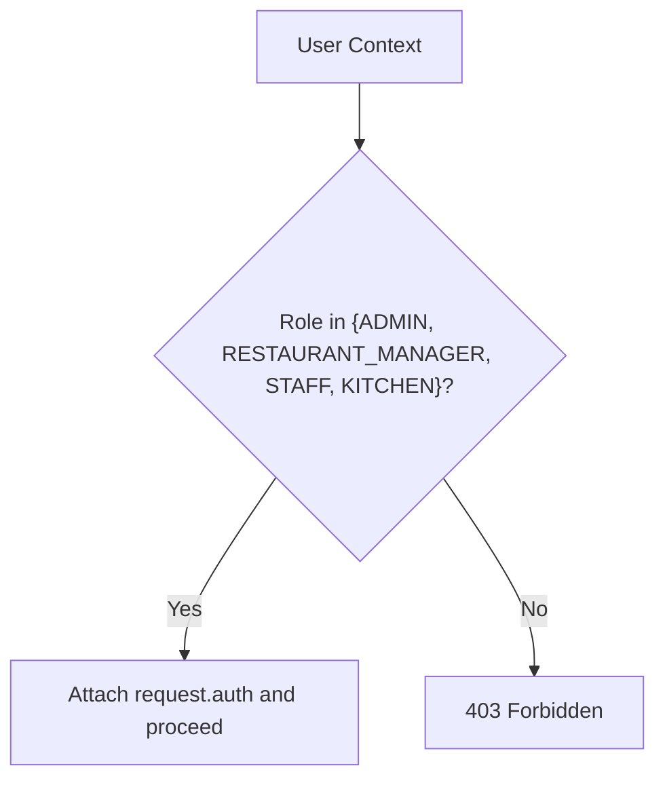

**Diagram sources**
- [wsServer.js:52-58](file://server/src/websocket/wsServer.js#L52-L58)
- [rbac.middleware.js:3-32](file://server/src/middleware/rbac.middleware.js#L3-L32)

**Section sources**
- [wsServer.js:52-58](file://server/src/websocket/wsServer.js#L52-L58)
- [rbac.middleware.js:3-32](file://server/src/middleware/rbac.middleware.js#L3-L32)

### Connection Lifecycle and Session Initialization
- Upgrade handshake: performed after per-path authentication.
- Session creation:
  - Each handler calls initSession with source-specific metadata and tenant/restaurant context.
  - STT stream is created and wired to transcript callbacks.
  - Initial greeting is sent via sendGreeting.
- Message processing:
  - Web: JSON messages with audio/text; binary chunks forwarded to STT stream.
  - Telephony: event-driven start/media/stop; audio payloads written to STT stream.
- Termination:
  - On close or stop, endSession finalizes DB records, offloads recording, broadcasts call ended, and cleans up.

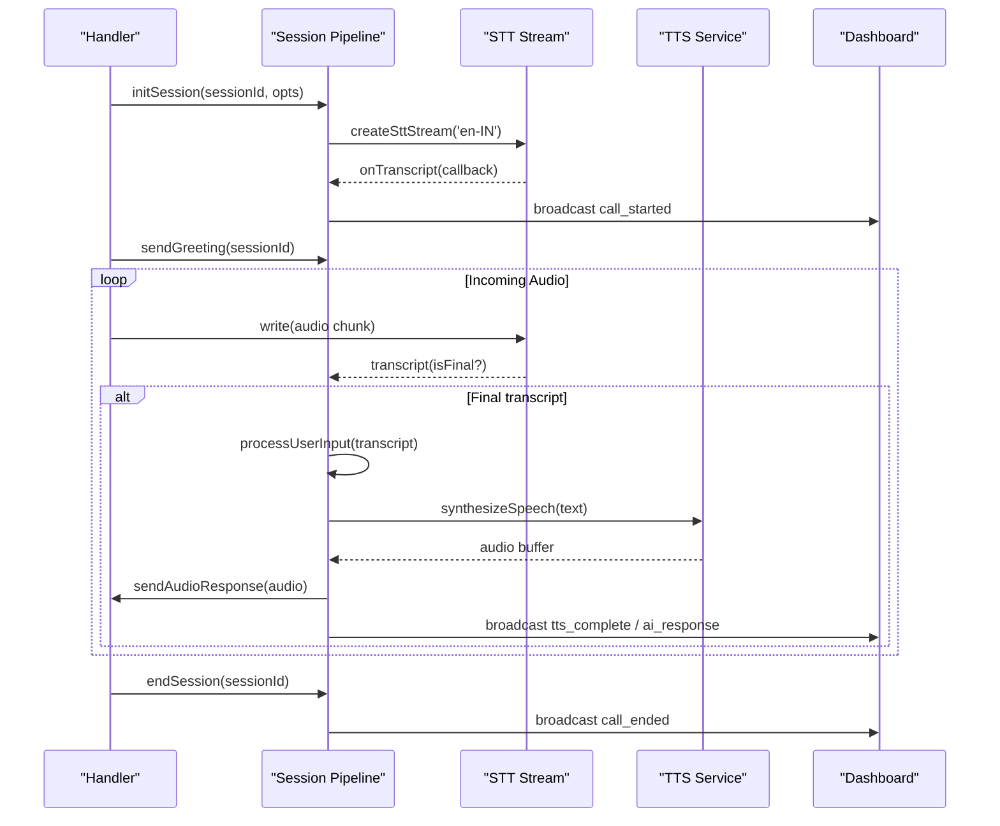

**Diagram sources**
- [webStreamHandler.js:23-79](file://server/src/websocket/webStreamHandler.js#L23-L79)
- [mediaStreamHandler.js:40-55](file://server/src/websocket/mediaStreamHandler.js#L40-L55)
- [exotelStreamHandler.js:45-66](file://server/src/websocket/exotelStreamHandler.js#L45-L66)
- [sessionPipeline.js:24-111](file://server/src/websocket/sessionPipeline.js#L24-L111)
- [sessionPipeline.js:132-219](file://server/src/websocket/sessionPipeline.js#L132-L219)
- [sessionPipeline.js:224-294](file://server/src/websocket/sessionPipeline.js#L224-L294)
- [sessionPipeline.js:394-437](file://server/src/websocket/sessionPipeline.js#L394-L437)

**Section sources**
- [webStreamHandler.js:7-81](file://server/src/websocket/webStreamHandler.js#L7-L81)
- [mediaStreamHandler.js:7-69](file://server/src/websocket/mediaStreamHandler.js#L7-L69)
- [exotelStreamHandler.js:9-80](file://server/src/websocket/exotelStreamHandler.js#L9-L80)
- [sessionPipeline.js:24-437](file://server/src/websocket/sessionPipeline.js#L24-L437)

### Heartbeat Mechanism (Ping/Pong Liveness)
- Every 30 seconds, the server pings all connected clients.
- Clients respond with pong; if not received within interval, the connection is terminated.
- ws.isAlive flag tracks responsiveness per connection.

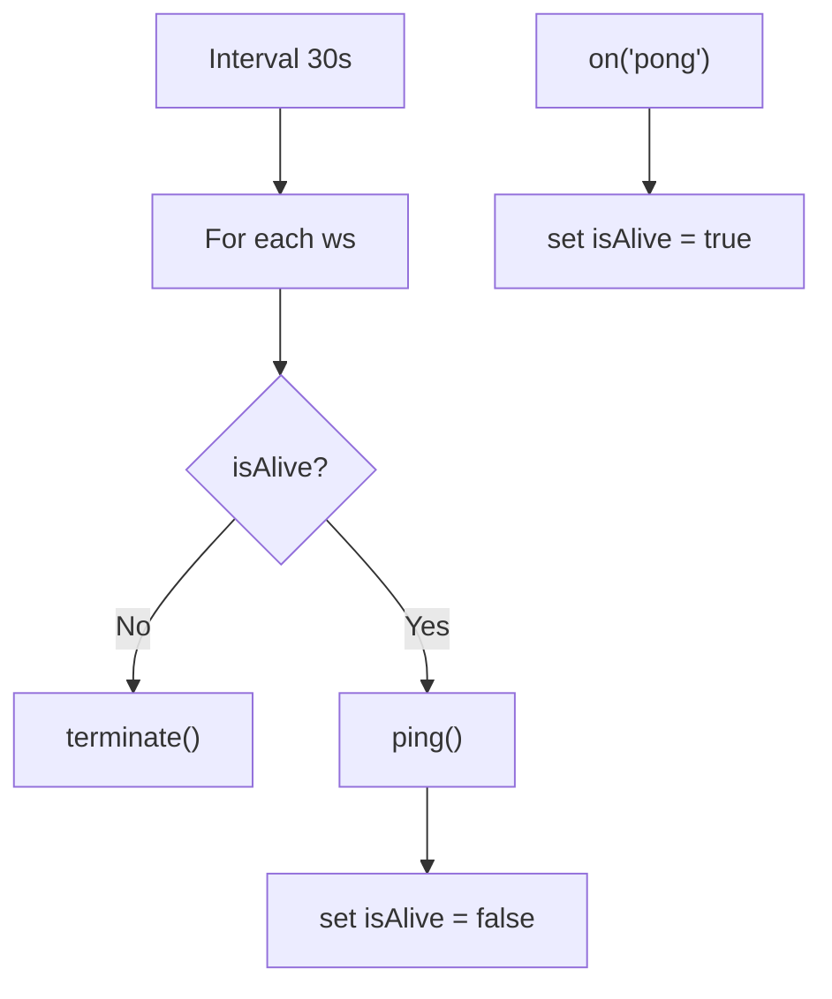

**Diagram sources**
- [wsServer.js:149-158](file://server/src/websocket/wsServer.js#L149-L158)
- [wsServer.js:129-137](file://server/src/websocket/wsServer.js#L129-L137)

**Section sources**
- [wsServer.js:129-158](file://server/src/websocket/wsServer.js#L129-L158)

### Telephony Stream Authentication
- Stream tickets are required for both Twilio and Exotel paths.
- In production, missing or invalid tickets result in 401.
- Additional webhook signature validation exists for inbound telephony webhooks (separate from WebSocket upgrade).

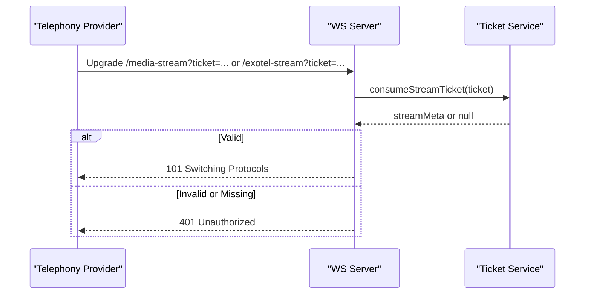

**Diagram sources**
- [wsServer.js:99-116](file://server/src/websocket/wsServer.js#L99-L116)
- [wsTicketService.js:52-85](file://server/src/services/wsTicketService.js#L52-L85)
- [telephonyAuth.middleware.js:10-92](file://server/src/middleware/telephonyAuth.middleware.js#L10-L92)

**Section sources**
- [wsServer.js:99-116](file://server/src/websocket/wsServer.js#L99-L116)
- [telephonyAuth.middleware.js:10-92](file://server/src/middleware/telephonyAuth.middleware.js#L10-L92)

### Client Connection Examples and Reconnection Strategies

#### Dashboard (React Hook)
- Acquires a single-use ticket via API before connecting.
- Connects to /dashboard-ws with ticket or bearer token.
- Implements exponential backoff reconnection on close.
- Listens for events and updates local stats.

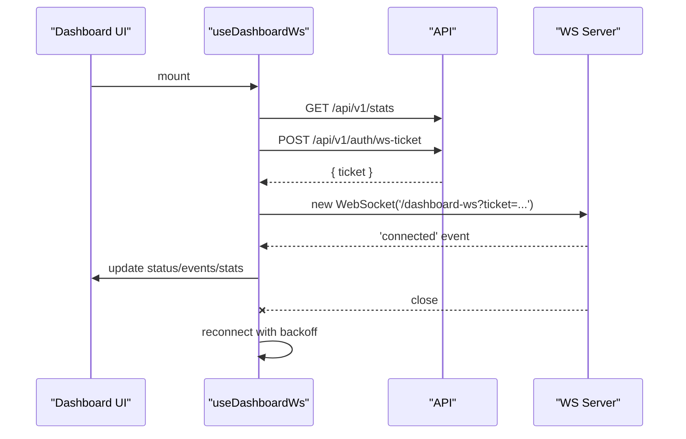

**Diagram sources**
- [useDashboardWs.js:45-109](file://client/src/hooks/useDashboardWs.js#L45-L109)
- [apiClient.js:58-66](file://client/src/services/apiClient.js#L58-L66)

**Section sources**
- [useDashboardWs.js:45-109](file://client/src/hooks/useDashboardWs.js#L45-L109)
- [apiClient.js:58-66](file://client/src/services/apiClient.js#L58-L66)

#### Web Voice Stream (Mobile Service)
- Establishes WebSocket to /web-stream with ticket/token.
- Sends start handshake, then streams audio chunks or text.
- Handles open/message/close/error events and emits typed events to consumers.

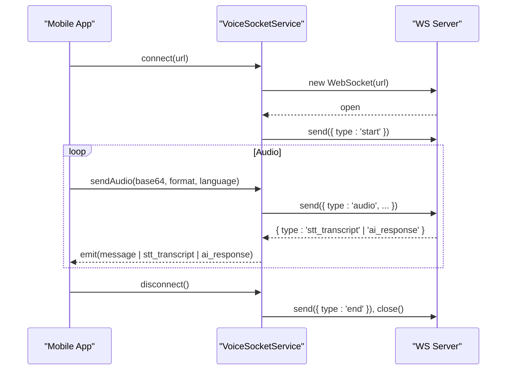

**Diagram sources**
- [voiceSocketService.js:11-99](file://mobile/src/services/voiceSocketService.js#L11-L99)
- [webStreamHandler.js:23-79](file://server/src/websocket/webStreamHandler.js#L23-L79)

**Section sources**
- [voiceSocketService.js:11-99](file://mobile/src/services/voiceSocketService.js#L11-L99)
- [webStreamHandler.js:23-79](file://server/src/websocket/webStreamHandler.js#L23-L79)

## Dependency Analysis
- wsServer depends on:
  - wsTicketService for ticket consumption
  - auth.service for token verification
  - Per-path handlers for routing
  - sessionPipeline for shared voice processing
- Handlers depend on:
  - sessionPipeline for init/sendGreeting/process/end
  - STT/TTS services through pipeline
- Client code depends on:
  - apiClient for ticket acquisition and token management
  - useDashboardWs for dashboard WS lifecycle
  - voiceSocketService for mobile voice WS lifecycle

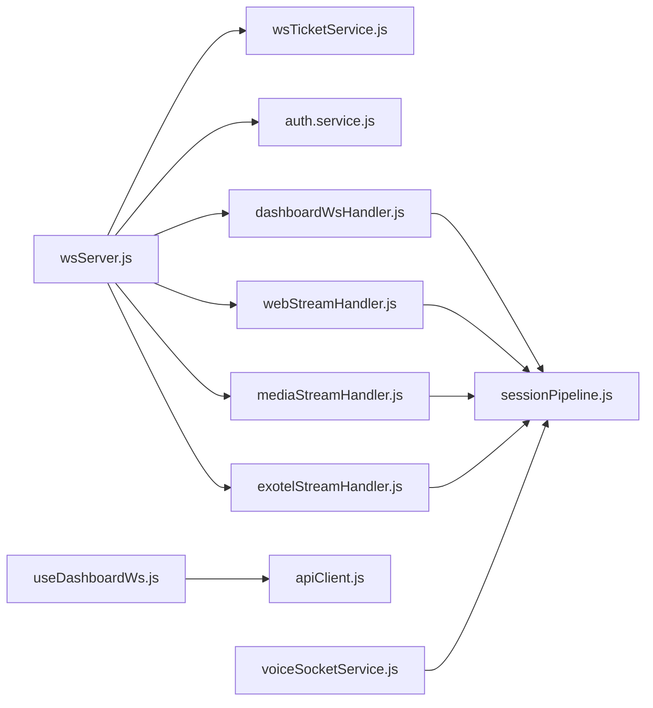

**Diagram sources**
- [wsServer.js:1-10](file://server/src/websocket/wsServer.js#L1-L10)
- [wsServer.js:129-147](file://server/src/websocket/wsServer.js#L129-L147)
- [dashboardWsHandler.js:1-38](file://server/src/websocket/dashboardWsHandler.js#L1-L38)
- [webStreamHandler.js:1-22](file://server/src/websocket/webStreamHandler.js#L1-L22)
- [mediaStreamHandler.js:1-38](file://server/src/websocket/mediaStreamHandler.js#L1-L38)
- [exotelStreamHandler.js:1-42](file://server/src/websocket/exotelStreamHandler.js#L1-L42)
- [sessionPipeline.js:1-16](file://server/src/websocket/sessionPipeline.js#L1-L16)
- [useDashboardWs.js:1-14](file://client/src/hooks/useDashboardWs.js#L1-L14)
- [apiClient.js:1-66](file://client/src/services/apiClient.js#L1-L66)
- [voiceSocketService.js:1-26](file://mobile/src/services/voiceSocketService.js#L1-L26)

**Section sources**
- [wsServer.js:1-10](file://server/src/websocket/wsServer.js#L1-L10)
- [sessionPipeline.js:1-16](file://server/src/websocket/sessionPipeline.js#L1-L16)

## Performance Considerations
- Payload limits: max payload set to 512KB to prevent oversized messages.
- Heartbeat interval: 30 seconds balances liveness detection with overhead.
- Audio buffering: sessions cap audioChunks to avoid unbounded memory growth.
- Streaming: telephony responses are chunked to reduce latency and bandwidth spikes.
- Async offloading: order dispatch, notifications, and recording are queued to workers to keep hot paths responsive.

[No sources needed since this section provides general guidance]

## Troubleshooting Guide
Common issues and diagnostics:
- 401 Unauthorized on upgrade:
  - Ensure ticket is present and not expired; confirm consumeWsTicket/consumeStreamTicket returns data.
  - Verify JWT secret configuration and token issuer/audience settings.
- 403 Forbidden on dashboard:
  - Confirm user role is one of ADMIN, RESTAURANT_MANAGER, STAFF, KITCHEN.
- No pong received:
  - Check client WebSocket implementation responds to ping; verify network/firewall rules.
- Session not starting:
  - Validate tenantId and restaurantId are provided; pipeline throws if missing.
- Audio not transcribing:
  - Ensure correct format/language parameters and that STT stream is active.
- Order not confirmed:
  - Check queue workers and database writes; review broadcastToDashboard logs for order_confirmed.

**Section sources**
- [wsServer.js:52-63](file://server/src/websocket/wsServer.js#L52-L63)
- [wsServer.js:90-96](file://server/src/websocket/wsServer.js#L90-L96)
- [wsServer.js:108-115](file://server/src/websocket/wsServer.js#L108-L115)
- [sessionPipeline.js:24-30](file://server/src/websocket/sessionPipeline.js#L24-L30)
- [sessionPipeline.js:394-437](file://server/src/websocket/sessionPipeline.js#L394-L437)

## Conclusion
Inkiro’s WebSocket architecture centralizes upgrade authentication per connection type, enforces strict role-based access for dashboards, and leverages single-use tickets for secure, scalable connections. The shared session pipeline standardizes voice processing across web and telephony streams, while robust heartbeats and graceful termination ensure reliability. Client libraries implement resilient reconnection and clear event models to simplify integration.

[No sources needed since this section summarizes without analyzing specific files]

## Appendices

### Example: Dashboard Client Connection Establishment
- Obtain a ticket via API endpoint using a valid JWT.
- Connect to /dashboard-ws with ?ticket=... or ?access_token=....
- Handle 'connected' event and listen for real-time events.
- Implement exponential backoff reconnection on close.

**Section sources**
- [useDashboardWs.js:45-109](file://client/src/hooks/useDashboardWs.js#L45-L109)
- [apiClient.js:58-66](file://client/src/services/apiClient.js#L58-L66)

### Example: Mobile Voice Stream Client
- Connect to /web-stream with ticket/token.
- Send start handshake, then stream audio chunks or text.
- Handle stt_transcript and ai_response events.
- Send end and close on disconnect.

**Section sources**
- [voiceSocketService.js:11-99](file://mobile/src/services/voiceSocketService.js#L11-L99)
- [webStreamHandler.js:23-79](file://server/src/websocket/webStreamHandler.js#L23-L79)