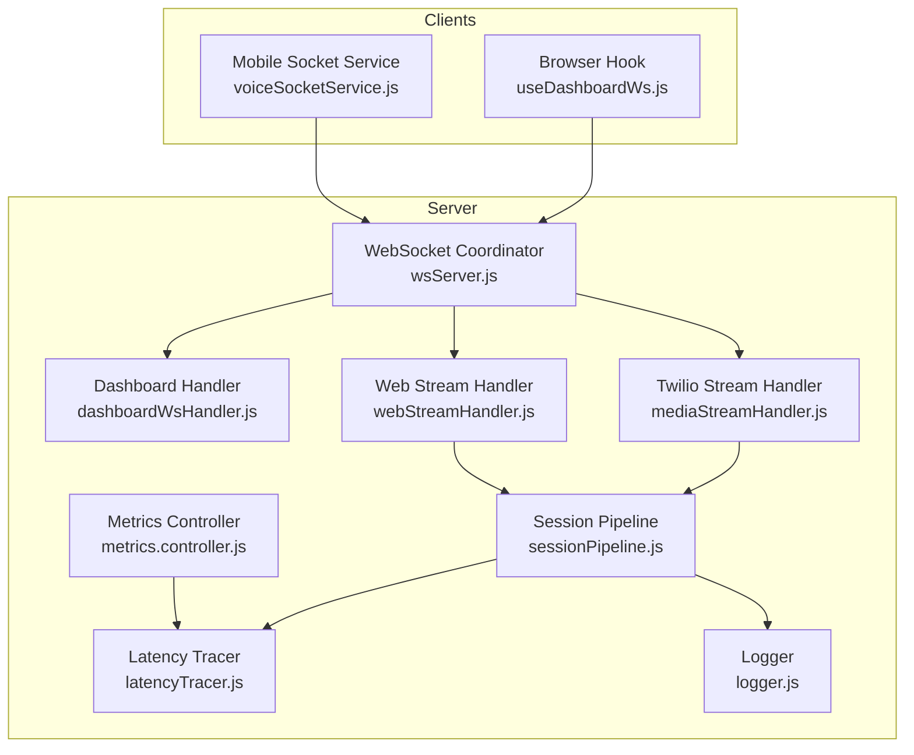
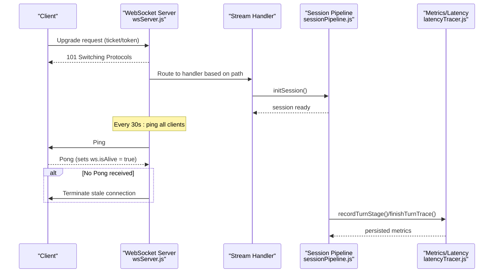
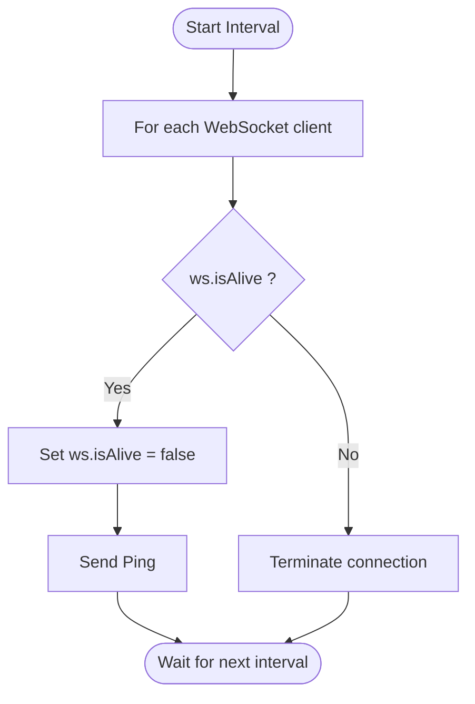
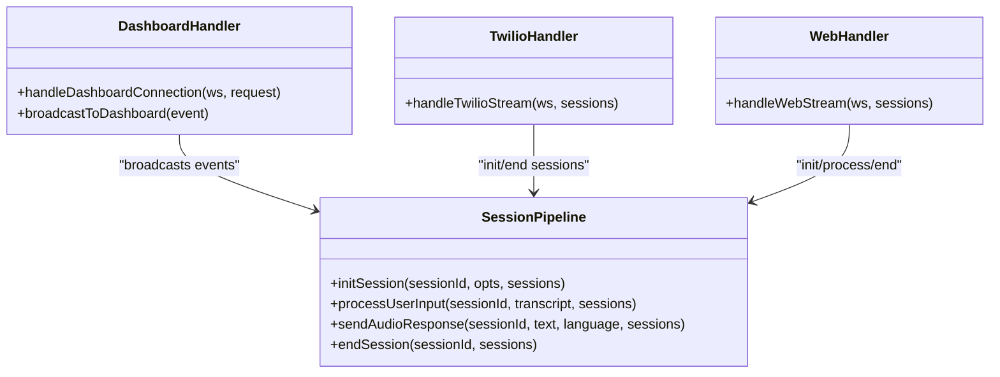
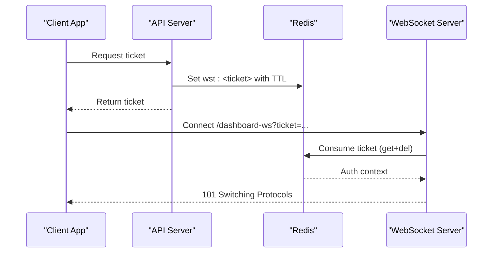
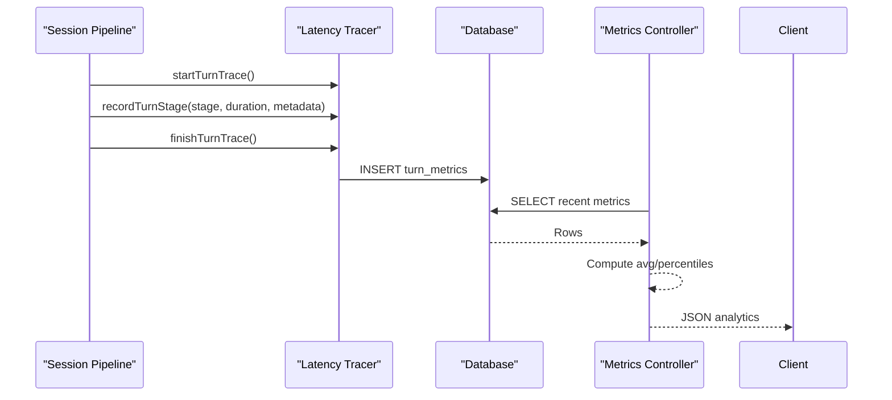
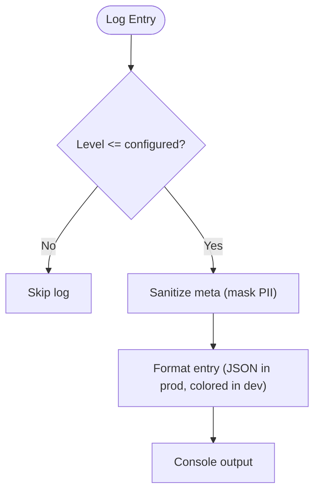
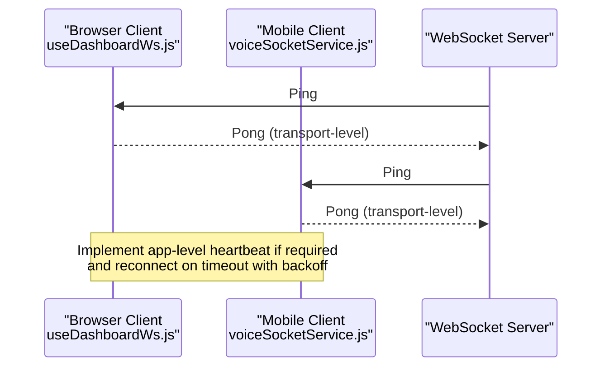
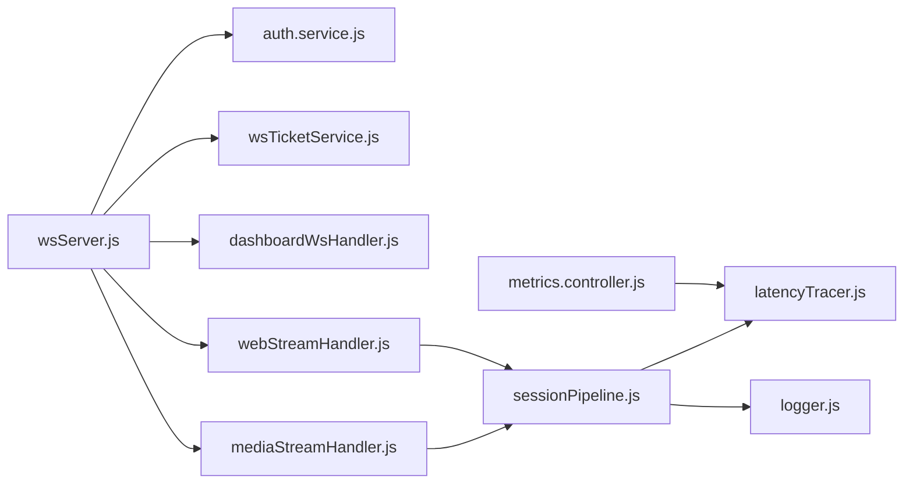

# Health Monitoring & Heartbeat System

<cite>
**Referenced Files in This Document**
- [wsServer.js](file://server/src/websocket/wsServer.js)
- [dashboardWsHandler.js](file://server/src/websocket/dashboardWsHandler.js)
- [mediaStreamHandler.js](file://server/src/websocket/mediaStreamHandler.js)
- [webStreamHandler.js](file://server/src/websocket/webStreamHandler.js)
- [sessionPipeline.js](file://server/src/websocket/sessionPipeline.js)
- [wsTicketService.js](file://server/src/services/wsTicketService.js)
- [latencyTracer.js](file://server/src/services/latencyTracer.js)
- [metrics.controller.js](file://server/src/controllers/metrics.controller.js)
- [metrics.routes.js](file://server/src/routes/metrics.routes.js)
- [logger.js](file://server/src/utils/logger.js)
- [useDashboardWs.js](file://client/src/hooks/useDashboardWs.js)
- [voiceSocketService.js](file://mobile/src/services/voiceSocketService.js)
</cite>

## Table of Contents
1. [Introduction](#introduction)
2. [Project Structure](#project-structure)
3. [Core Components](#core-components)
4. [Architecture Overview](#architecture-overview)
5. [Detailed Component Analysis](#detailed-component-analysis)
6. [Dependency Analysis](#dependency-analysis)
7. [Performance Considerations](#performance-considerations)
8. [Troubleshooting Guide](#troubleshooting-guide)
9. [Conclusion](#conclusion)
10. [Appendices](#appendices)

## Introduction
This document explains the WebSocket health monitoring and heartbeat system in Inkiro. It focuses on the server-side ping/pong liveness checks that run every 30 seconds to detect dead connections, the isAlive flag tracking mechanism, automatic termination of unresponsive clients, connection cleanup, metrics collection for performance indicators, logging strategies, client-side heartbeat considerations, and scaling guidance for high-traffic environments with many concurrent connections.

## Project Structure
The WebSocket subsystem spans several modules:
- Server-side coordinator and upgrade handling
- Stream handlers for telephony and web audio
- Session lifecycle management
- Authentication via short-lived tickets
- Latency tracing and metrics endpoints
- Client hooks and mobile socket service

**Diagram sources**
- [wsServer.js:17-160](file://server/src/websocket/wsServer.js#L17-L160)
- [dashboardWsHandler.js:10-38](file://server/src/websocket/dashboardWsHandler.js#L10-L38)
- [mediaStreamHandler.js:7-68](file://server/src/websocket/mediaStreamHandler.js#L7-L68)
- [webStreamHandler.js:7-80](file://server/src/websocket/webStreamHandler.js#L7-L80)
- [sessionPipeline.js:24-111](file://server/src/websocket/sessionPipeline.js#L24-L111)
- [latencyTracer.js:12-90](file://server/src/services/latencyTracer.js#L12-L90)
- [metrics.controller.js:9-17](file://server/src/controllers/metrics.controller.js#L9-L17)
- [logger.js:83-129](file://server/src/utils/logger.js#L83-L129)
- [useDashboardWs.js:45-109](file://client/src/hooks/useDashboardWs.js#L45-L109)
- [voiceSocketService.js:11-57](file://mobile/src/services/voiceSocketService.js#L11-L57)

**Section sources**
- [wsServer.js:17-160](file://server/src/websocket/wsServer.js#L17-L160)
- [dashboardWsHandler.js:10-38](file://server/src/websocket/dashboardWsHandler.js#L10-L38)
- [mediaStreamHandler.js:7-68](file://server/src/websocket/mediaStreamHandler.js#L7-L68)
- [webStreamHandler.js:7-80](file://server/src/websocket/webStreamHandler.js#L7-L80)
- [sessionPipeline.js:24-111](file://server/src/websocket/sessionPipeline.js#L24-L111)
- [latencyTracer.js:12-90](file://server/src/services/latencyTracer.js#L12-L90)
- [metrics.controller.js:9-17](file://server/src/controllers/metrics.controller.js#L9-L17)
- [logger.js:83-129](file://server/src/utils/logger.js#L83-L129)
- [useDashboardWs.js:45-109](file://client/src/hooks/useDashboardWs.js#L45-L109)
- [voiceSocketService.js:11-57](file://mobile/src/services/voiceSocketService.js#L11-L57)

## Core Components
- WebSocket coordinator: Initializes the server, handles upgrades, authenticates per-path, sets up isAlive and pong listeners, and starts a 30-second ping interval to terminate stale connections.
- Stream handlers: Manage Twilio and Web Audio sessions, initialize sessions, process media/messages, and end sessions on close.
- Session pipeline: Creates and manages voice sessions, orchestrates STT/LLM/TTS flows, persists metrics, and broadcasts events to dashboards.
- Ticket service: Issues single-use, time-bounded tickets for secure WebSocket upgrades across distributed instances.
- Metrics and logging: Tracks turn latencies, exposes analytics, and logs structured events with PII masking.

**Section sources**
- [wsServer.js:17-160](file://server/src/websocket/wsServer.js#L17-L160)
- [mediaStreamHandler.js:7-68](file://server/src/websocket/mediaStreamHandler.js#L7-L68)
- [webStreamHandler.js:7-80](file://server/src/websocket/webStreamHandler.js#L7-L80)
- [sessionPipeline.js:24-111](file://server/src/websocket/sessionPipeline.js#L24-L111)
- [wsTicketService.js:11-86](file://server/src/services/wsTicketService.js#L11-L86)
- [latencyTracer.js:12-90](file://server/src/services/latencyTracer.js#L12-L90)
- [metrics.controller.js:9-17](file://server/src/controllers/metrics.controller.js#L9-L17)
- [logger.js:83-129](file://server/src/utils/logger.js#L83-L129)

## Architecture Overview
The system uses a central WebSocket server that routes upgrades to specialized handlers. Each connection maintains an isAlive flag updated by pong responses. A periodic liveness check pings all clients; those not responding are terminated. Sessions are created and managed through a pipeline that records latency metrics and emits dashboard events. Clients connect using tickets or tokens and can implement reconnection logic.

**Diagram sources**
- [wsServer.js:129-160](file://server/src/websocket/wsServer.js#L129-L160)
- [mediaStreamHandler.js:21-38](file://server/src/websocket/mediaStreamHandler.js#L21-L38)
- [webStreamHandler.js:14-21](file://server/src/websocket/webStreamHandler.js#L14-L21)
- [sessionPipeline.js:24-111](file://server/src/websocket/sessionPipeline.js#L24-L111)
- [latencyTracer.js:12-90](file://server/src/services/latencyTracer.js#L12-L90)

## Detailed Component Analysis

### WebSocket Liveness and Heartbeat
- The server sets ws.isAlive = true on connection and updates it on each pong event.
- A 30-second interval iterates all clients: if isAlive is false, the connection is terminated; otherwise, it resets isAlive to false and sends a ping.
- This ensures dead or unresponsive clients are cleaned up automatically.

**Diagram sources**
- [wsServer.js:149-156](file://server/src/websocket/wsServer.js#L149-L156)
- [wsServer.js:129-136](file://server/src/websocket/wsServer.js#L129-L136)

**Section sources**
- [wsServer.js:129-160](file://server/src/websocket/wsServer.js#L129-L160)

### Connection Handlers and Session Lifecycle
- Dashboard handler: Authenticates via ticket or token, tracks connected clients, logs connection events, and sends initial handshake.
- Twilio stream handler: Parses stream events, initializes sessions, forwards audio chunks, and ends sessions on stop/close.
- Web stream handler: Initializes sessions, processes text/audio messages, transcribes audio, and triggers dialogue processing.
- Session pipeline: Manages STT streams, dialogue turns, TTS responses, order confirmation workflows, and broadcast events. Ends sessions by cleaning resources and persisting data.

**Diagram sources**
- [dashboardWsHandler.js:10-38](file://server/src/websocket/dashboardWsHandler.js#L10-L38)
- [mediaStreamHandler.js:7-68](file://server/src/websocket/mediaStreamHandler.js#L7-L68)
- [webStreamHandler.js:7-80](file://server/src/websocket/webStreamHandler.js#L7-L80)
- [sessionPipeline.js:24-111](file://server/src/websocket/sessionPipeline.js#L24-L111)
- [sessionPipeline.js:394-436](file://server/src/websocket/sessionPipeline.js#L394-L436)

**Section sources**
- [dashboardWsHandler.js:10-38](file://server/src/websocket/dashboardWsHandler.js#L10-L38)
- [mediaStreamHandler.js:7-68](file://server/src/websocket/mediaStreamHandler.js#L7-L68)
- [webStreamHandler.js:7-80](file://server/src/websocket/webStreamHandler.js#L7-L80)
- [sessionPipeline.js:24-111](file://server/src/websocket/sessionPipeline.js#L24-L111)
- [sessionPipeline.js:394-436](file://server/src/websocket/sessionPipeline.js#L394-L436)

### Authentication and Tickets
- Short-lived, single-use tickets are issued and consumed atomically via Redis to support multi-instance deployments.
- Dashboard and web-stream upgrades accept either a ticket or bearer token; telephony streams use stream tickets.

**Diagram sources**
- [wsTicketService.js:11-46](file://server/src/services/wsTicketService.js#L11-L46)
- [wsTicketService.js:52-86](file://server/src/services/wsTicketService.js#L52-L86)
- [wsServer.js:34-116](file://server/src/websocket/wsServer.js#L34-L116)

**Section sources**
- [wsTicketService.js:11-86](file://server/src/services/wsTicketService.js#L11-L86)
- [wsServer.js:34-116](file://server/src/websocket/wsServer.js#L34-L116)

### Metrics Collection and Performance Indicators
- Turn-level latency is recorded across VAD, STT, LLM, and TTS stages and persisted to the database.
- An endpoint exposes aggregated analytics including averages and percentiles.

**Diagram sources**
- [sessionPipeline.js:132-219](file://server/src/websocket/sessionPipeline.js#L132-L219)
- [latencyTracer.js:12-90](file://server/src/services/latencyTracer.js#L12-L90)
- [latencyTracer.js:95-132](file://server/src/services/latencyTracer.js#L95-L132)
- [metrics.controller.js:9-17](file://server/src/controllers/metrics.controller.js#L9-L17)
- [metrics.routes.js:4-7](file://server/src/routes/metrics.routes.js#L4-L7)

**Section sources**
- [latencyTracer.js:12-132](file://server/src/services/latencyTracer.js#L12-L132)
- [metrics.controller.js:9-17](file://server/src/controllers/metrics.controller.js#L9-L17)
- [metrics.routes.js:4-7](file://server/src/routes/metrics.routes.js#L4-L7)

### Logging Strategy
- Structured logger outputs human-friendly logs in development and JSON in production.
- PII masking protects phone numbers in logs.
- Voice turn logs include stage durations and warnings when budgets are exceeded.

**Diagram sources**
- [logger.js:8-21](file://server/src/utils/logger.js#L8-L21)
- [logger.js:22-41](file://server/src/utils/logger.js#L22-L41)
- [logger.js:43-81](file://server/src/utils/logger.js#L43-L81)
- [logger.js:83-129](file://server/src/utils/logger.js#L83-L129)

**Section sources**
- [logger.js:8-129](file://server/src/utils/logger.js#L8-L129)

### Client-Side Heartbeat Responses and Timeouts
- The server initiates pings; browsers typically respond to pongs automatically at the transport layer. If you need explicit application-level heartbeats, send periodic messages from the client and handle timeouts by reconnecting with exponential backoff.
- The dashboard hook demonstrates robust reconnection and status tracking.
- The mobile socket service provides a resilient wrapper with open/message/error/close events and graceful disconnect.

**Diagram sources**
- [wsServer.js:149-156](file://server/src/websocket/wsServer.js#L149-L156)
- [useDashboardWs.js:45-109](file://client/src/hooks/useDashboardWs.js#L45-L109)
- [voiceSocketService.js:11-57](file://mobile/src/services/voiceSocketService.js#L11-L57)

**Section sources**
- [useDashboardWs.js:45-109](file://client/src/hooks/useDashboardWs.js#L45-L109)
- [voiceSocketService.js:11-57](file://mobile/src/services/voiceSocketService.js#L11-L57)

## Dependency Analysis
- The WebSocket coordinator depends on authentication services and ticket utilities to authorize upgrades.
- Stream handlers depend on the session pipeline to manage voice sessions and orchestrate STT/LLM/TTS.
- The session pipeline depends on latency tracing and logging for observability and on queues/workers for async tasks.
- Metrics controller depends on the latency tracer to expose analytics.

**Diagram sources**
- [wsServer.js:17-160](file://server/src/websocket/wsServer.js#L17-L160)
- [wsTicketService.js:11-86](file://server/src/services/wsTicketService.js#L11-L86)
- [mediaStreamHandler.js:7-68](file://server/src/websocket/mediaStreamHandler.js#L7-L68)
- [webStreamHandler.js:7-80](file://server/src/websocket/webStreamHandler.js#L7-L80)
- [sessionPipeline.js:24-111](file://server/src/websocket/sessionPipeline.js#L24-L111)
- [latencyTracer.js:12-90](file://server/src/services/latencyTracer.js#L12-L90)
- [metrics.controller.js:9-17](file://server/src/controllers/metrics.controller.js#L9-L17)

**Section sources**
- [wsServer.js:17-160](file://server/src/websocket/wsServer.js#L17-L160)
- [wsTicketService.js:11-86](file://server/src/services/wsTicketService.js#L11-L86)
- [mediaStreamHandler.js:7-68](file://server/src/websocket/mediaStreamHandler.js#L7-L68)
- [webStreamHandler.js:7-80](file://server/src/websocket/webStreamHandler.js#L7-L80)
- [sessionPipeline.js:24-111](file://server/src/websocket/sessionPipeline.js#L24-L111)
- [latencyTracer.js:12-90](file://server/src/services/latencyTracer.js#L12-L90)
- [metrics.controller.js:9-17](file://server/src/controllers/metrics.controller.js#L9-L17)

## Performance Considerations
- Memory caps: Active call audio buffers are bounded to prevent memory growth during long sessions.
- Payload limits: Maximum payload size is set to avoid oversized messages.
- Periodic cleanup: The 30-second ping interval proactively terminates stale connections, freeing sockets and memory.
- Asynchronous offloading: Order fulfillment, notifications, and recording persistence are queued to workers to keep the hot path fast.
- Metrics sampling: Latency traces are persisted asynchronously and queried with limits to reduce overhead.

[No sources needed since this section provides general guidance]

## Troubleshooting Guide
- Stale connections: If clients do not respond to pings, they will be terminated by the server’s liveness check. Verify client network stability and ensure transports allow pong responses.
- Authentication failures: Ensure tickets are valid and not expired; verify token presence and roles for dashboard access.
- Session errors: Check session pipeline logs for STT/LLM/TTS errors and ensure tenant context is provided.
- Metrics gaps: Confirm that turn traces are started and finished; validate database writes and query limits.
- Logging issues: Adjust log level and inspect structured logs for correlation IDs and masked PII.

**Section sources**
- [wsServer.js:129-160](file://server/src/websocket/wsServer.js#L129-L160)
- [dashboardWsHandler.js:10-38](file://server/src/websocket/dashboardWsHandler.js#L10-L38)
- [sessionPipeline.js:132-219](file://server/src/websocket/sessionPipeline.js#L132-L219)
- [latencyTracer.js:12-90](file://server/src/services/latencyTracer.js#L12-L90)
- [logger.js:8-129](file://server/src/utils/logger.js#L8-L129)

## Conclusion
Inkiro’s WebSocket health monitoring relies on a simple yet effective ping/pong loop with an isAlive flag to detect and terminate dead connections every 30 seconds. Stream handlers and the session pipeline manage voice sessions, while latency tracing and structured logging provide deep observability. Clients should implement robust reconnection and optional application-level heartbeats. With memory caps, payload limits, and asynchronous offloading, the system scales to handle high traffic and large numbers of concurrent connections.

[No sources needed since this section summarizes without analyzing specific files]

## Appendices

### Example: Client-Side Heartbeat Response Patterns
- Browser: Rely on transport-level pong responses; optionally send periodic messages and reconnect with exponential backoff on close/error.
- Mobile: Use the provided socket service to manage lifecycle events and send/receive messages; ensure graceful disconnect and reconnection.

**Section sources**
- [useDashboardWs.js:45-109](file://client/src/hooks/useDashboardWs.js#L45-L109)
- [voiceSocketService.js:11-57](file://mobile/src/services/voiceSocketService.js#L11-L57)

### Scaling and Memory Management Tips
- Keep payloads small and enforce max payload sizes.
- Bound in-memory buffers per session to prevent memory leaks.
- Use tickets stored in Redis for horizontal scalability across multiple server instances.
- Offload heavy work to queues and workers to maintain low-latency paths.
- Monitor latency percentiles and adjust thresholds or providers accordingly.

[No sources needed since this section provides general guidance]