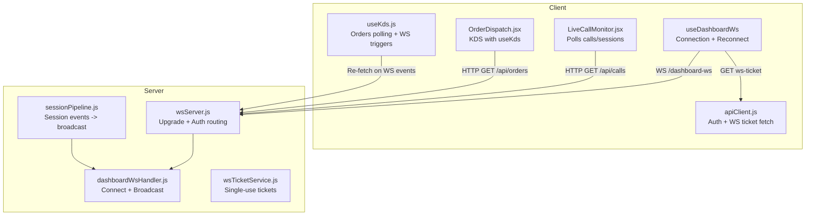
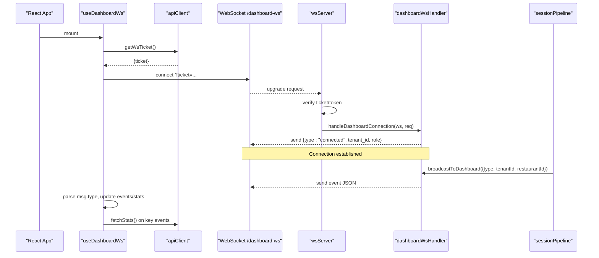
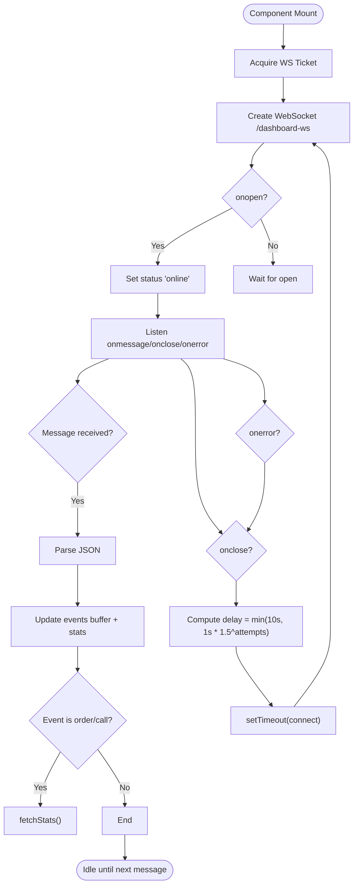
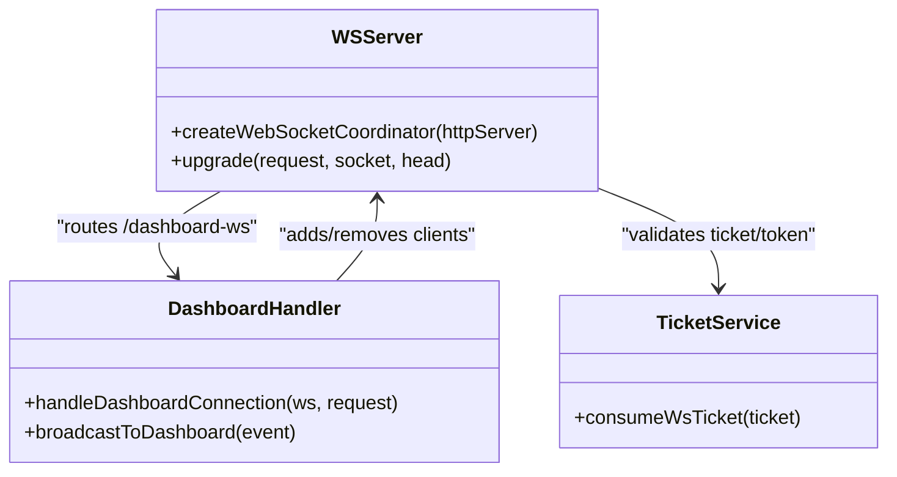
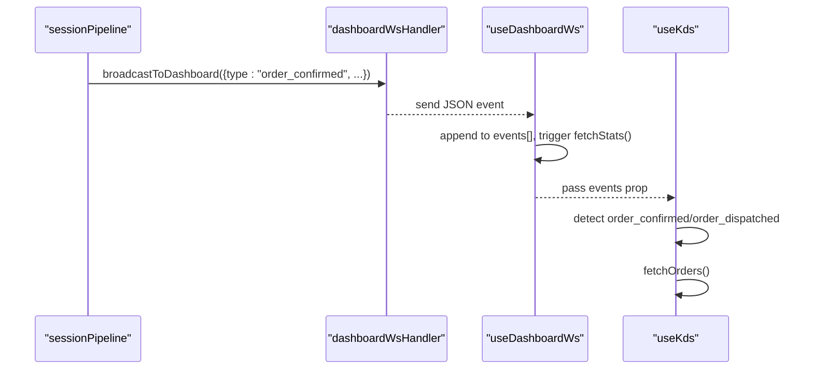
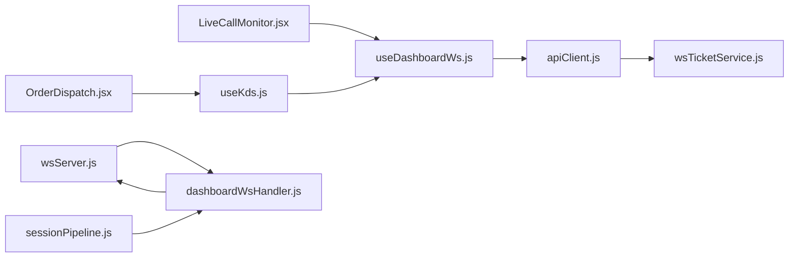

# Client Integration

<cite>
**Referenced Files in This Document**
- [useDashboardWs.js](file://client/src/hooks/useDashboardWs.js)
- [apiClient.js](file://client/src/services/apiClient.js)
- [LiveCallMonitor.jsx](file://client/src/components/LiveCallMonitor.jsx)
- [OrderDispatch.jsx](file://client/src/components/OrderDispatch.jsx)
- [useKds.js](file://client/src/hooks/useKds.js)
- [wsServer.js](file://server/src/websocket/wsServer.js)
- [dashboardWsHandler.js](file://server/src/websocket/dashboardWsHandler.js)
- [sessionPipeline.js](file://server/src/websocket/sessionPipeline.js)
- [wsTicketService.js](file://server/src/services/wsTicketService.js)
</cite>

## Table of Contents
1. [Introduction](#introduction)
2. [Project Structure](#project-structure)
3. [Core Components](#core-components)
4. [Architecture Overview](#architecture-overview)
5. [Detailed Component Analysis](#detailed-component-analysis)
6. [Dependency Analysis](#dependency-analysis)
7. [Performance Considerations](#performance-considerations)
8. [Troubleshooting Guide](#troubleshooting-guide)
9. [Conclusion](#conclusion)

## Introduction
This document explains how the React dashboard integrates with server-side WebSockets to deliver real-time updates for calls, orders, and metrics. It focuses on the useDashboardWs hook for connection management, automatic reconnection, event subscription patterns, and how components consume live data. It also covers the server-side WebSocket lifecycle, authentication handshake, broadcasting rules, and error handling. Practical examples include live call monitoring, order status updates, and dynamic metric visualization, along with performance and troubleshooting guidance.

## Project Structure
The client uses a custom hook to manage a single authenticated WebSocket connection to /dashboard-ws. The server authenticates connections via short-lived tickets or bearer tokens, enforces tenant boundaries, and broadcasts events to matching clients. Components subscribe to events and update UI state accordingly.

**Diagram sources**
- [useDashboardWs.js:1-128](file://client/src/hooks/useDashboardWs.js#L1-L128)
- [apiClient.js:58-66](file://client/src/services/apiClient.js#L58-L66)
- [wsServer.js:23-72](file://server/src/websocket/wsServer.js#L23-L72)
- [dashboardWsHandler.js:10-38](file://server/src/websocket/dashboardWsHandler.js#L10-L38)
- [sessionPipeline.js:102-108](file://server/src/websocket/sessionPipeline.js#L102-L108)
- [wsTicketService.js:11-26](file://server/src/services/wsTicketService.js#L11-L26)

**Section sources**
- [useDashboardWs.js:1-128](file://client/src/hooks/useDashboardWs.js#L1-L128)
- [wsServer.js:17-72](file://server/src/websocket/wsServer.js#L17-L72)
- [dashboardWsHandler.js:10-68](file://server/src/websocket/dashboardWsHandler.js#L10-L68)
- [sessionPipeline.js:102-108](file://server/src/websocket/sessionPipeline.js#L102-L108)
- [wsTicketService.js:11-26](file://server/src/services/wsTicketService.js#L11-L26)

## Core Components
- useDashboardWs: Manages WebSocket lifecycle, authentication, auto-reconnect with exponential backoff, event buffering, and stats synchronization.
- apiClient: Provides token storage, refresh rotation, and WS ticket acquisition.
- LiveCallMonitor: Displays active sessions and call history; polls REST endpoints for current state.
- OrderDispatch and useKds: Kitchen Display System that reacts to WebSocket order events and polls orders periodically.

Key responsibilities:
- Authentication handshake via single-use tickets or bearer tokens.
- Event subscription by type (e.g., call_started, call_ended, order_confirmed).
- Graceful disconnect and reconnect on network errors or auth changes.
- Efficient state updates using local event buffers and targeted refetches.

**Section sources**
- [useDashboardWs.js:14-124](file://client/src/hooks/useDashboardWs.js#L14-L124)
- [apiClient.js:9-66](file://client/src/services/apiClient.js#L9-L66)
- [LiveCallMonitor.jsx:10-32](file://client/src/components/LiveCallMonitor.jsx#L10-L32)
- [useKds.js:14-47](file://client/src/hooks/useKds.js#L14-L47)

## Architecture Overview
The client establishes an authenticated WebSocket connection to /dashboard-ws using either a single-use ticket or a bearer token. The server validates credentials, attaches tenant context, and sends an initial connected handshake. Throughout the session, the server broadcasts events scoped to tenant and restaurant boundaries. The client listens for specific event types and updates UI state or triggers refetches as needed.

**Diagram sources**
- [useDashboardWs.js:45-109](file://client/src/hooks/useDashboardWs.js#L45-L109)
- [apiClient.js:58-66](file://client/src/services/apiClient.js#L58-L66)
- [wsServer.js:34-72](file://server/src/websocket/wsServer.js#L34-L72)
- [dashboardWsHandler.js:10-38](file://server/src/websocket/dashboardWsHandler.js#L10-L38)
- [sessionPipeline.js:102-108](file://server/src/websocket/sessionPipeline.js#L102-L108)

## Detailed Component Analysis

### useDashboardWs: Connection Management and Reconnection
- Authentication: Acquires a single-use ticket via API and connects to /dashboard-ws with query parameters. Falls back to bearer token if available.
- Lifecycle:
  - onopen: sets status online, resets reconnect attempts.
  - onmessage: parses JSON, appends to bounded event buffer, updates stats for call events, and triggers stats refresh on order/call events.
  - onclose: sets status offline, schedules reconnect with exponential backoff capped at a maximum delay.
  - onerror: closes socket to trigger reconnect flow.
  - Cleanup: cancels timers, removes auth change listener, and closes socket on unmount.
- Stats Sync: Periodically polls /api/v1/stats and refreshes on certain events to keep metrics consistent.

**Diagram sources**
- [useDashboardWs.js:45-109](file://client/src/hooks/useDashboardWs.js#L45-L109)

**Section sources**
- [useDashboardWs.js:14-124](file://client/src/hooks/useDashboardWs.js#L14-L124)

### Server-Side WebSocket Lifecycle and Broadcasting
- Upgrade and Auth:
  - Validates path and supports /dashboard-ws, /web-stream, /media-stream, /exotel-stream.
  - For /dashboard-ws, accepts single-use tickets or bearer tokens; enforces role-based access.
  - Attaches user context to request.auth and proceeds to handler.
- Connection Handling:
  - Adds client to dashboardClients set.
  - Sends initial connected handshake including tenant and role info.
  - Handles close/error events to maintain client set integrity.
- Broadcasting:
  - Filters events by tenantId and restaurantId unless marked global.
  - Ensures only authorized clients receive events.

**Diagram sources**
- [wsServer.js:17-72](file://server/src/websocket/wsServer.js#L17-L72)
- [dashboardWsHandler.js:10-68](file://server/src/websocket/dashboardWsHandler.js#L10-L68)
- [wsTicketService.js:31-46](file://server/src/services/wsTicketService.js#L31-L46)

**Section sources**
- [wsServer.js:23-72](file://server/src/websocket/wsServer.js#L23-L72)
- [dashboardWsHandler.js:10-68](file://server/src/websocket/dashboardWsHandler.js#L10-L68)
- [wsTicketService.js:11-46](file://server/src/services/wsTicketService.js#L11-L46)

### Event Subscription Patterns and Real-Time Updates
- Event Types Handled by useDashboardWs:
  - call_started: increments active_calls in local stats.
  - call_ended: decrements active_calls safely.
  - order_confirmed, order_dispatched: triggers stats refresh.
- Additional Events Broadcast by Server:
  - stt_transcript, user_speech, ai_response, tts_complete during voice sessions.
  - dtmf_reorder from telephony webhooks.
  - order_status_updated, pin_confirmed from workers.
- How Components Subscribe:
  - useDashboardWs exposes events array; components can filter by type.
  - useKds listens to incoming dashboardEvents and triggers order refetch when relevant events arrive.

**Diagram sources**
- [sessionPipeline.js:377-385](file://server/src/websocket/sessionPipeline.js#L377-L385)
- [dashboardWsHandler.js:43-68](file://server/src/websocket/dashboardWsHandler.js#L43-L68)
- [useDashboardWs.js:63-77](file://client/src/hooks/useDashboardWs.js#L63-L77)
- [useKds.js:39-47](file://client/src/hooks/useKds.js#L39-L47)

**Section sources**
- [useDashboardWs.js:63-77](file://client/src/hooks/useDashboardWs.js#L63-L77)
- [useKds.js:39-47](file://client/src/hooks/useKds.js#L39-L47)
- [sessionPipeline.js:54-73](file://server/src/websocket/sessionPipeline.js#L54-L73)
- [sessionPipeline.js:150-188](file://server/src/websocket/sessionPipeline.js#L150-L188)
- [sessionPipeline.js:236-244](file://server/src/websocket/sessionPipeline.js#L236-L244)
- [telephony.controller.js:71-80](file://server/src/controllers/telephony.controller.js#L71-L80)
- [outbox.worker.js:49-69](file://server/src/workers/outbox.worker.js#L49-L69)

### Real-Time Features Examples

#### Live Call Monitoring
- Polling: LiveCallMonitor periodically fetches active sessions and call history via REST endpoints.
- Real-Time Enhancements:
  - Use useDashboardWs to listen for call_started and call_ended events to update active call counts instantly without full refetch.
  - Optionally subscribe to stt_transcript and ai_response events to show live transcripts and AI responses per session.

**Section sources**
- [LiveCallMonitor.jsx:10-32](file://client/src/components/LiveCallMonitor.jsx#L10-L32)
- [useDashboardWs.js:63-77](file://client/src/hooks/useDashboardWs.js#L63-L77)
- [sessionPipeline.js:54-73](file://server/src/websocket/sessionPipeline.js#L54-L73)

#### Order Status Updates (KDS)
- Polling: useKds fetches orders every 8 seconds and filters by status.
- Real-Time Triggers:
  - When dashboardEvents include order_confirmed or order_dispatched, useKds triggers a refetch to reflect new orders or status changes immediately.
- Optimistic UI:
  - updateOrderStatus applies optimistic updates locally and refetches on failure to ensure consistency.

**Section sources**
- [useKds.js:20-63](file://client/src/hooks/useKds.js#L20-L63)
- [OrderDispatch.jsx:5-14](file://client/src/components/OrderDispatch.jsx#L5-L14)
- [useKds.js:39-47](file://client/src/hooks/useKds.js#L39-L47)

#### Dynamic Metric Visualization
- Metrics Source:
  - useDashboardWs periodically fetches /api/v1/stats and updates stats state.
  - Certain events (call_started, call_ended, order_confirmed, order_dispatched) trigger immediate stats refresh.
- UI Usage:
  - Components can render total_calls, active_calls, total_orders, confirmed_orders, revenue, avg_latency_ms based on stats state.

**Section sources**
- [useDashboardWs.js:29-43](file://client/src/hooks/useDashboardWs.js#L29-L43)
- [useDashboardWs.js:63-77](file://client/src/hooks/useDashboardWs.js#L63-L77)

## Dependency Analysis
- Client Dependencies:
  - useDashboardWs depends on apiClient for token and ticket management.
  - LiveCallMonitor and OrderDispatch depend on REST APIs and optionally on useDashboardWs events for real-time updates.
  - useKds depends on dashboardEvents to trigger order refetches.
- Server Dependencies:
  - wsServer routes upgrades and performs authentication before handing off to handlers.
  - dashboardWsHandler manages client set and broadcasts events with tenant scoping.
  - sessionPipeline emits events throughout voice session lifecycle and order confirmation flows.
  - wsTicketService provides single-use tickets stored in Redis for secure, scalable auth.

**Diagram sources**
- [useDashboardWs.js:1-128](file://client/src/hooks/useDashboardWs.js#L1-L128)
- [apiClient.js:1-128](file://client/src/services/apiClient.js#L1-L128)
- [wsServer.js:17-162](file://server/src/websocket/wsServer.js#L17-L162)
- [dashboardWsHandler.js:10-68](file://server/src/websocket/dashboardWsHandler.js#L10-L68)
- [sessionPipeline.js:1-437](file://server/src/websocket/sessionPipeline.js#L1-L437)
- [wsTicketService.js:1-86](file://server/src/services/wsTicketService.js#L1-L86)

**Section sources**
- [useDashboardWs.js:1-128](file://client/src/hooks/useDashboardWs.js#L1-L128)
- [apiClient.js:1-128](file://client/src/services/apiClient.js#L1-L128)
- [wsServer.js:17-162](file://server/src/websocket/wsServer.js#L17-L162)
- [dashboardWsHandler.js:10-68](file://server/src/websocket/dashboardWsHandler.js#L10-L68)
- [sessionPipeline.js:1-437](file://server/src/websocket/sessionPipeline.js#L1-L437)
- [wsTicketService.js:1-86](file://server/src/services/wsTicketService.js#L1-L86)

## Performance Considerations
- Event Buffering:
  - useDashboardWs maintains a bounded events array (last 50 messages) to prevent memory growth and excessive re-renders.
- Targeted Refetches:
  - Stats are refreshed only on relevant events rather than on every message, reducing API load.
- Polling Intervals:
  - LiveCallMonitor polls every 4 seconds; useKds polls every 8 seconds. Tune intervals based on expected event frequency and UI responsiveness needs.
- Optimistic UI:
  - useKds applies optimistic updates for order status transitions and refetches on failure to avoid stale states.
- Tenant Scoping:
  - Server-side broadcasting enforces tenant and restaurant boundaries, ensuring clients receive only relevant events and minimizing unnecessary processing.
- Heartbeat and Liveness:
  - Server pings clients every 30 seconds and terminates inactive connections to free resources.

[No sources needed since this section provides general guidance]

## Troubleshooting Guide
Common Issues and Resolutions:
- Connection Drops:
  - Symptom: serverStatus switches to offline; events stop updating.
  - Resolution: Automatic reconnection with exponential backoff is handled by useDashboardWs. Ensure network stability and verify server health.
- Authentication Failures:
  - Symptom: 401/403 responses or immediate close with reason.
  - Resolution: Verify valid ticket or bearer token; check role permissions for /dashboard-ws. Ensure tokens are refreshed via apiClient when 401 occurs.
- Memory Leaks:
  - Symptom: Growing events array or lingering listeners.
  - Resolution: useDashboardWs caps events to last 50 and cleans up listeners and timeouts on unmount. Avoid storing large payloads in events; prefer targeted state updates.
- Component Unmounting:
  - Symptom: Errors after navigation or modal close.
  - Resolution: Hook cleanup closes WebSocket and clears timers. Ensure no external references hold onto the socket.
- Cross-Tenant Leakage:
  - Symptom: Clients receiving events not scoped to their tenant/restaurant.
  - Resolution: Server enforces tenant boundaries in broadcastToDashboard. Validate event payload includes correct tenantId and restaurantId.

**Section sources**
- [useDashboardWs.js:80-109](file://client/src/hooks/useDashboardWs.js#L80-L109)
- [apiClient.js:89-119](file://client/src/services/apiClient.js#L89-L119)
- [dashboardWsHandler.js:13-16](file://server/src/websocket/dashboardWsHandler.js#L13-L16)
- [dashboardWsHandler.js:43-68](file://server/src/websocket/dashboardWsHandler.js#L43-L68)
- [wsServer.js:34-72](file://server/src/websocket/wsServer.js#L34-L72)

## Conclusion
The client-side WebSocket integration centers around useDashboardWs, which provides robust connection management, authentication via single-use tickets or bearer tokens, automatic reconnection, and efficient event handling. Server-side components enforce tenant scoping and broadcast relevant events to subscribed clients. Components like LiveCallMonitor and OrderDispatch leverage both polling and real-time events to deliver responsive dashboards. By following the patterns and guidelines outlined here, developers can implement reliable real-time features such as live call monitoring, order status updates, and dynamic metric visualization while maintaining performance and avoiding common pitfalls.

[No sources needed since this section summarizes without analyzing specific files]