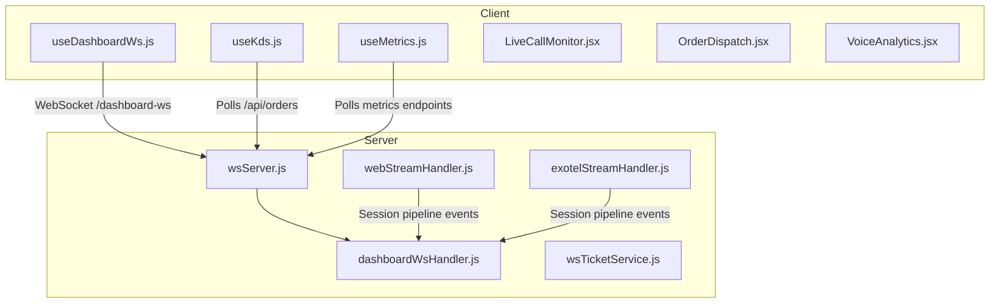
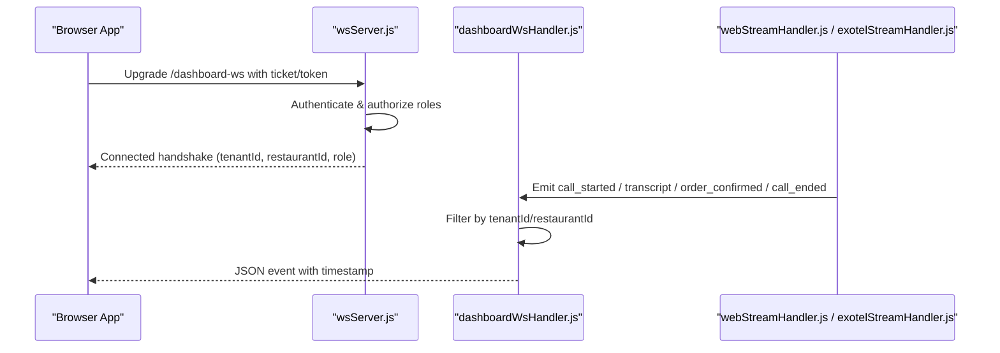
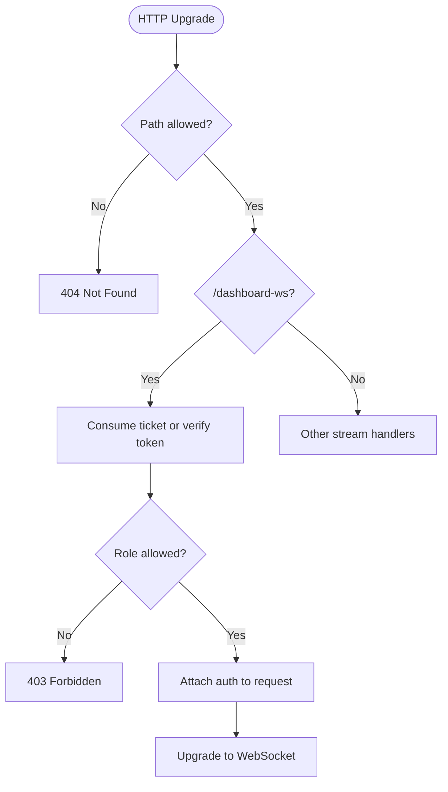
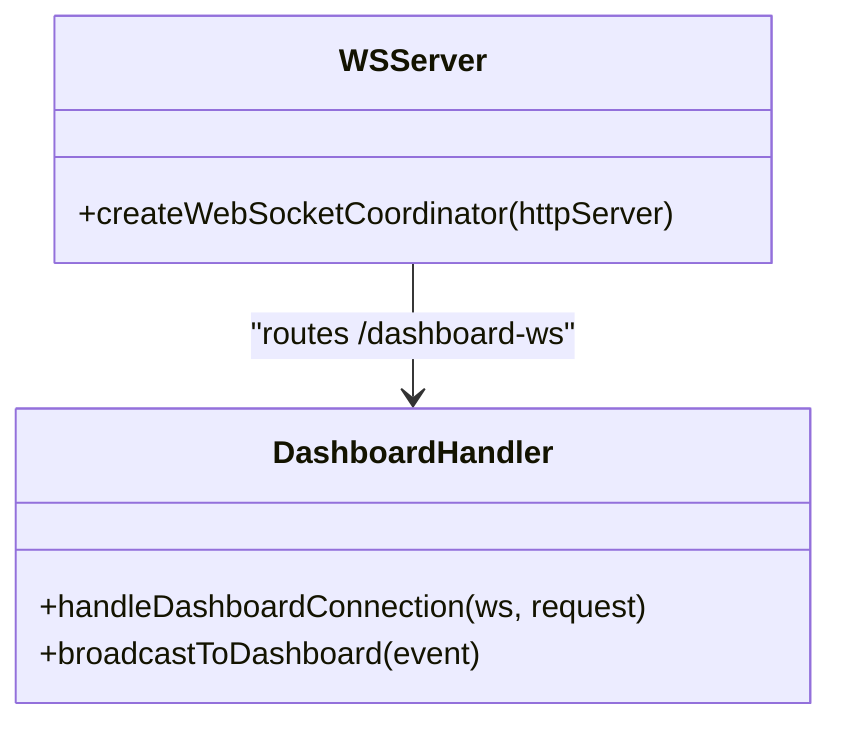
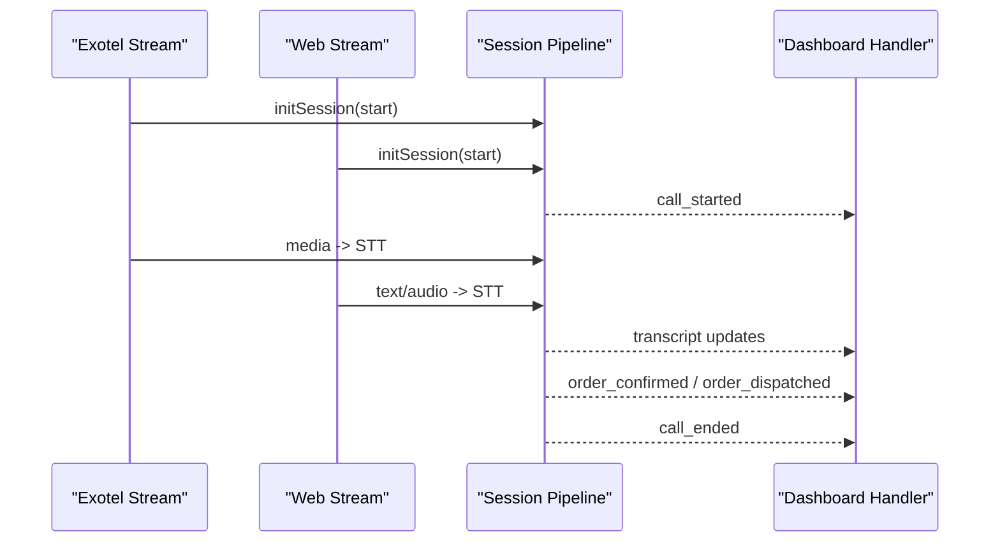
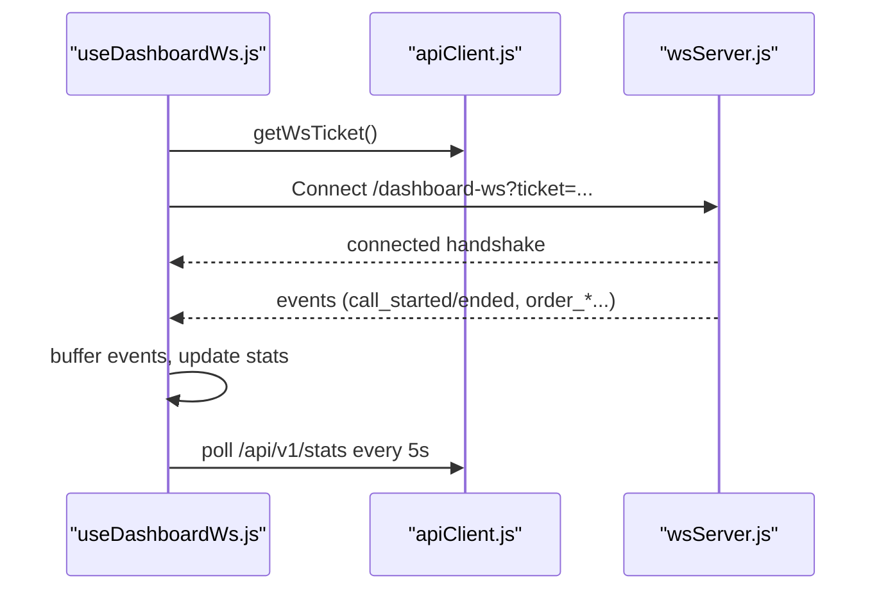
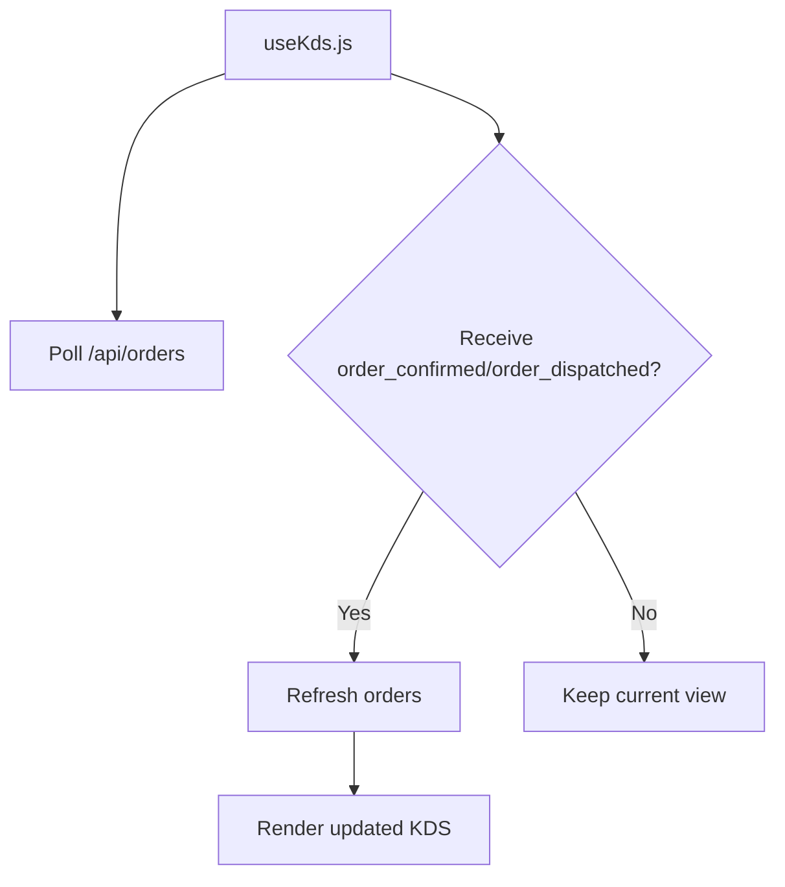
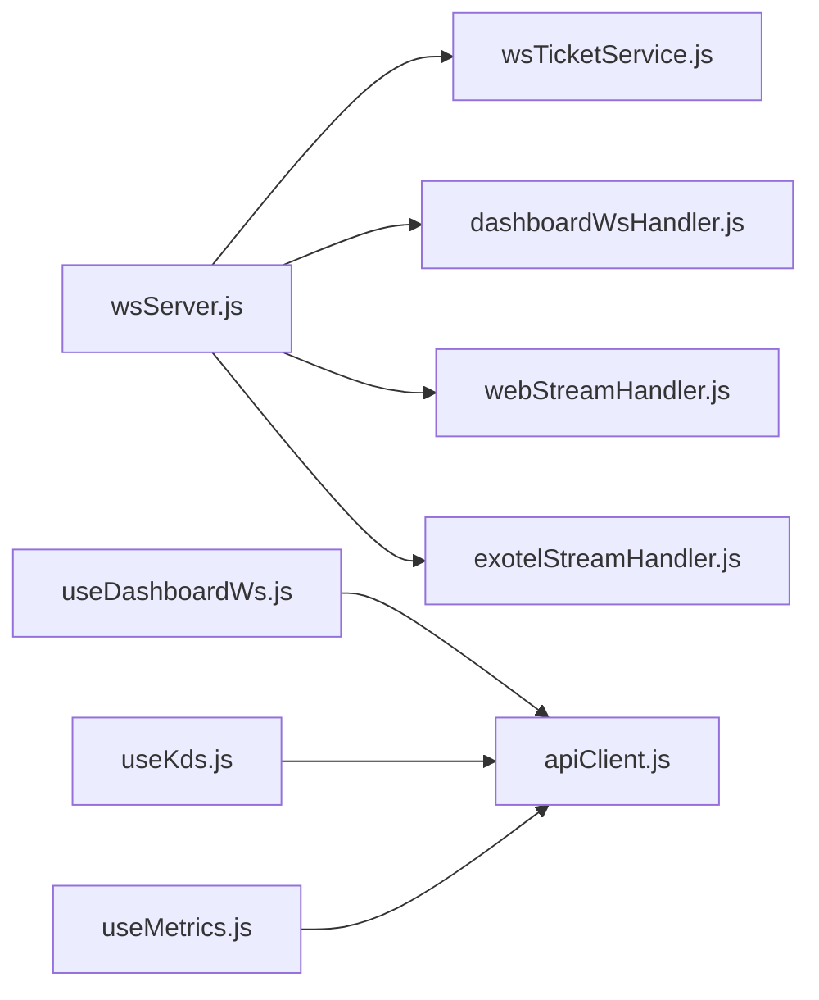

# Dashboard Real-time Updates

<cite>
**Referenced Files in This Document**
- [wsServer.js](file://server/src/websocket/wsServer.js)
- [dashboardWsHandler.js](file://server/src/websocket/dashboardWsHandler.js)
- [exotelStreamHandler.js](file://server/src/websocket/exotelStreamHandler.js)
- [webStreamHandler.js](file://server/src/websocket/webStreamHandler.js)
- [wsTicketService.js](file://server/src/services/wsTicketService.js)
- [useDashboardWs.js](file://client/src/hooks/useDashboardWs.js)
- [useKds.js](file://client/src/hooks/useKds.js)
- [useMetrics.js](file://client/src/hooks/useMetrics.js)
- [apiClient.js](file://client/src/services/apiClient.js)
- [LiveCallMonitor.jsx](file://client/src/components/LiveCallMonitor.jsx)
- [OrderDispatch.jsx](file://client/src/components/OrderDispatch.jsx)
- [VoiceAnalytics.jsx](file://client/src/components/VoiceAnalytics.jsx)
</cite>

## Table of Contents
1. [Introduction](#introduction)
2. [Project Structure](#project-structure)
3. [Core Components](#core-components)
4. [Architecture Overview](#architecture-overview)
5. [Detailed Component Analysis](#detailed-component-analysis)
6. [Dependency Analysis](#dependency-analysis)
7. [Performance Considerations](#performance-considerations)
8. [Troubleshooting Guide](#troubleshooting-guide)
9. [Conclusion](#conclusion)
10. [Appendices](#appendices)

## Introduction
This document explains how Inkiro’s dashboard receives real-time updates for call monitoring, order status changes, and system metrics via a WebSocket event system. It covers the server-side connection handling, tenant-scoped broadcasting, client-side React hooks for connection management, message formats, subscription model, and practical examples to build live dashboards. It also addresses performance considerations for high-frequency updates and efficient rendering.

## Project Structure
The real-time feature spans both server and client:
- Server: WebSocket upgrade and routing, authentication via single-use tickets or bearer tokens, tenant-scoped broadcast to dashboard clients, and telephony stream handlers that feed into the session pipeline.
- Client: A custom hook manages the dashboard WebSocket lifecycle (connect, reconnect, stats polling), while other hooks and components consume events to update UIs for calls, orders, and analytics.

**Diagram sources**
- [wsServer.js:17-146](file://server/src/websocket/wsServer.js#L17-L146)
- [dashboardWsHandler.js:10-68](file://server/src/websocket/dashboardWsHandler.js#L10-L68)
- [webStreamHandler.js:7-80](file://server/src/websocket/webStreamHandler.js#L7-L80)
- [exotelStreamHandler.js:9-79](file://server/src/websocket/exotelStreamHandler.js#L9-L79)
- [useDashboardWs.js:14-125](file://client/src/hooks/useDashboardWs.js#L14-L125)
- [useKds.js:14-80](file://client/src/hooks/useKds.js#L14-L80)
- [useMetrics.js:14-69](file://client/src/hooks/useMetrics.js#L14-L69)

**Section sources**
- [wsServer.js:17-146](file://server/src/websocket/wsServer.js#L17-L146)
- [dashboardWsHandler.js:10-68](file://server/src/websocket/dashboardWsHandler.js#L10-L68)
- [useDashboardWs.js:14-125](file://client/src/hooks/useDashboardWs.js#L14-L125)

## Core Components
- Dashboard WebSocket server: Upgrades HTTP to WebSocket, authenticates via single-use tickets or bearer tokens, and routes to the dashboard handler.
- Dashboard broadcast: Sends tenant-scoped events to connected dashboard clients with strict isolation by tenant and restaurant.
- Client coordinator hook: Manages connection, auto-reconnect with exponential backoff, event buffering, and periodic stats refresh.
- KDS integration: Polls orders and reacts to order-related WebSocket events to refresh the kitchen display.
- Metrics panel: Polls latency, queue health, and audit logs for observability.

**Section sources**
- [wsServer.js:34-72](file://server/src/websocket/wsServer.js#L34-L72)
- [dashboardWsHandler.js:43-68](file://server/src/websocket/dashboardWsHandler.js#L43-L68)
- [useDashboardWs.js:45-109](file://client/src/hooks/useDashboardWs.js#L45-L109)
- [useKds.js:39-47](file://client/src/hooks/useKds.js#L39-L47)
- [useMetrics.js:35-59](file://client/src/hooks/useMetrics.js#L35-L59)

## Architecture Overview
The dashboard uses a dedicated WebSocket endpoint for live updates. Authentication is enforced at upgrade time using short-lived tickets or bearer tokens. Once authenticated, clients receive tenant-scoped events. Telephony streams (Exotel/Twilio/Web) initiate sessions that produce events (call start/end, transcripts, order updates) which are broadcast to matching dashboard clients.

**Diagram sources**
- [wsServer.js:34-72](file://server/src/websocket/wsServer.js#L34-L72)
- [dashboardWsHandler.js:10-68](file://server/src/websocket/dashboardWsHandler.js#L10-L68)
- [webStreamHandler.js:14-59](file://server/src/websocket/webStreamHandler.js#L14-L59)
- [exotelStreamHandler.js:23-42](file://server/src/websocket/exotelStreamHandler.js#L23-L42)

## Detailed Component Analysis

### Server-Side WebSocket Routing and Authentication
- The WebSocket server accepts upgrades only on specific paths and enforces role-based access for the dashboard endpoint.
- Authentication supports single-use tickets (Redis-backed) or bearer tokens; production rejects unauthorized connections.
- Heartbeat liveness checks terminate stale connections.

**Diagram sources**
- [wsServer.js:23-72](file://server/src/websocket/wsServer.js#L23-L72)
- [wsTicketService.js:11-46](file://server/src/services/wsTicketService.js#L11-L46)

**Section sources**
- [wsServer.js:23-72](file://server/src/websocket/wsServer.js#L23-L72)
- [wsTicketService.js:11-46](file://server/src/services/wsTicketService.js#L11-L46)

### Dashboard Event Broadcasting and Tenant Isolation
- The dashboard handler maintains a set of connected clients and sends an initial handshake with tenant and role context.
- Broadcast filters events by tenant and restaurant unless marked global, ensuring zero cross-tenant leakage.
- Errors during send are logged without crashing the loop.

**Diagram sources**
- [dashboardWsHandler.js:10-68](file://server/src/websocket/dashboardWsHandler.js#L10-L68)
- [wsServer.js:138-146](file://server/src/websocket/wsServer.js#L138-L146)

**Section sources**
- [dashboardWsHandler.js:10-68](file://server/src/websocket/dashboardWsHandler.js#L10-L68)

### Telephony Streams to Dashboard Events
- Web and Exotel stream handlers initialize sessions, process audio/transcripts, and trigger state transitions that ultimately emit events to the dashboard.
- These handlers integrate with a shared session store and pipeline to coordinate multi-step flows (greeting, transcription, AI processing, order confirmation).

**Diagram sources**
- [exotelStreamHandler.js:23-42](file://server/src/websocket/exotelStreamHandler.js#L23-L42)
- [webStreamHandler.js:14-59](file://server/src/websocket/webStreamHandler.js#L14-L59)
- [dashboardWsHandler.js:43-68](file://server/src/websocket/dashboardWsHandler.js#L43-L68)

**Section sources**
- [exotelStreamHandler.js:23-42](file://server/src/websocket/exotelStreamHandler.js#L23-L42)
- [webStreamHandler.js:14-59](file://server/src/websocket/webStreamHandler.js#L14-L59)

### Client-Side WebSocket Coordinator (React Hook)
- Establishes a WebSocket connection using a single-use ticket or stored token.
- Buffers recent events locally (bounded array) and updates active call counts based on call start/end events.
- Periodically polls stats to keep counters consistent and handles reconnection with exponential backoff.

**Diagram sources**
- [useDashboardWs.js:45-109](file://client/src/hooks/useDashboardWs.js#L45-L109)
- [apiClient.js:58-66](file://client/src/services/apiClient.js#L58-L66)
- [wsServer.js:34-72](file://server/src/websocket/wsServer.js#L34-L72)

**Section sources**
- [useDashboardWs.js:45-109](file://client/src/hooks/useDashboardWs.js#L45-L109)
- [apiClient.js:58-66](file://client/src/services/apiClient.js#L58-L66)

### Kitchen Display System Integration
- Orders are polled periodically and refreshed when order-related events arrive from the dashboard WebSocket.
- Optimistic UI updates allow immediate feedback on status transitions, with server reconciliation on failure.

**Diagram sources**
- [useKds.js:20-47](file://client/src/hooks/useKds.js#L20-L47)

**Section sources**
- [useKds.js:20-47](file://client/src/hooks/useKds.js#L20-L47)

### Observability and Metrics
- The metrics hook aggregates latency percentiles, queue depths, audit logs, and engine status via REST endpoints.
- Refreshed at a fixed interval to provide near-real-time visibility into system health.

**Section sources**
- [useMetrics.js:35-59](file://client/src/hooks/useMetrics.js#L35-L59)

## Dependency Analysis
- wsServer depends on wsTicketService for secure, single-use ticket consumption and on dashboardWsHandler for route-specific logic.
- Stream handlers depend on the session pipeline to orchestrate call lifecycle and emit events.
- Client hooks depend on apiClient for authenticated requests and ticket acquisition; useKds and VoiceAnalytics rely on polling endpoints.

**Diagram sources**
- [wsServer.js:17-146](file://server/src/websocket/wsServer.js#L17-L146)
- [wsTicketService.js:11-86](file://server/src/services/wsTicketService.js#L11-L86)
- [useDashboardWs.js:14-125](file://client/src/hooks/useDashboardWs.js#L14-L125)
- [useKds.js:14-80](file://client/src/hooks/useKds.js#L14-L80)
- [useMetrics.js:14-69](file://client/src/hooks/useMetrics.js#L14-L69)
- [apiClient.js:1-128](file://client/src/services/apiClient.js#L1-L128)

**Section sources**
- [wsServer.js:17-146](file://server/src/websocket/wsServer.js#L17-L146)
- [wsTicketService.js:11-86](file://server/src/services/wsTicketService.js#L11-L86)
- [useDashboardWs.js:14-125](file://client/src/hooks/useDashboardWs.js#L14-L125)
- [useKds.js:14-80](file://client/src/hooks/useKds.js#L14-L80)
- [useMetrics.js:14-69](file://client/src/hooks/useMetrics.js#L14-L69)
- [apiClient.js:1-128](file://client/src/services/apiClient.js#L1-L128)

## Performance Considerations
- Event buffering: The client buffers recent events to a bounded array to avoid unbounded memory growth and excessive re-renders.
- Polling cadence: Stats and orders are polled at moderate intervals (seconds) to balance freshness with load.
- Reconnection strategy: Exponential backoff prevents thundering herds on reconnect storms.
- Tenant-scoped broadcasts: Filtering at the server reduces unnecessary network traffic to clients.
- Rendering efficiency: Components should minimize re-renders by deriving filtered views efficiently and avoiding heavy computations in render loops.

[No sources needed since this section provides general guidance]

## Troubleshooting Guide
- Connection failures: Ensure a valid ticket or bearer token is provided; check role authorization for dashboard access.
- No events received: Verify tenantId and restaurantId match the client’s context; confirm broadcast includes required identifiers.
- Frequent disconnects: Inspect heartbeat behavior and ensure clients remain alive; review error logs in the dashboard handler.
- Stale stats: Confirm stats polling is active and not blocked by token expiry; handle 401 flows via automatic refresh.

**Section sources**
- [wsServer.js:34-72](file://server/src/websocket/wsServer.js#L34-L72)
- [dashboardWsHandler.js:21-28](file://server/src/websocket/dashboardWsHandler.js#L21-L28)
- [useDashboardWs.js:80-109](file://client/src/hooks/useDashboardWs.js#L80-L109)
- [apiClient.js:89-119](file://client/src/services/apiClient.js#L89-L119)

## Conclusion
Inkiro’s dashboard real-time system combines secure, ticket-based WebSocket authentication with tenant-scoped broadcasting to deliver live updates for calls, orders, and metrics. The client-side hooks manage connection resilience and data binding, while server-side handlers ensure strict isolation and efficient delivery. By following the patterns outlined here, teams can implement robust live dashboards for call monitoring, order tracking, and dynamic metric visualization.

[No sources needed since this section summarizes without analyzing specific files]

## Appendices

### Message Formats and Subscription Model
- Connection handshake: Includes tenantId, restaurantId, role, and timestamp.
- Call events:
  - call_started: Increments active calls on the client.
  - call_ended: Decrements active calls on the client.
- Transcript updates: Emitted during speech-to-text processing; clients append to conversation history.
- Order events:
  - order_confirmed: Triggers order list refresh in KDS.
  - order_dispatched: Triggers order list refresh in KDS.
- Analytics streaming: Metrics are primarily polled via REST; dashboard events may include aggregated indicators but detailed metrics come from polling endpoints.

Subscription model:
- Clients connect once to /dashboard-ws and receive all tenant-scoped events. There is no per-event subscription API; filtering occurs server-side based on tenantId and restaurantId.

**Section sources**
- [dashboardWsHandler.js:31-37](file://server/src/websocket/dashboardWsHandler.js#L31-L37)
- [dashboardWsHandler.js:43-68](file://server/src/websocket/dashboardWsHandler.js#L43-L68)
- [useDashboardWs.js:63-77](file://client/src/hooks/useDashboardWs.js#L63-L77)
- [useKds.js:39-47](file://client/src/hooks/useKds.js#L39-L47)

### Example Implementations

#### Live Call Monitoring Dashboard
- Use the dashboard WebSocket to track call_started/call_ended events and maintain active call counts.
- Combine with periodic polling of call lists and sessions to show live sessions and call history.
- Integrate audio playback for recordings and display transcript turns for selected calls.

**Section sources**
- [useDashboardWs.js:63-77](file://client/src/hooks/useDashboardWs.js#L63-L77)
- [LiveCallMonitor.jsx:10-32](file://client/src/components/LiveCallMonitor.jsx#L10-L32)
- [LiveCallMonitor.jsx:74-155](file://client/src/components/LiveCallMonitor.jsx#L74-L155)

#### Real-Time Order Tracking (KDS)
- Listen for order_confirmed and order_dispatched events to refresh the order list.
- Provide optimistic UI updates for status transitions and reconcile with the server.
- Render group orders and display totals, payment status, and dispute actions.

**Section sources**
- [useKds.js:39-63](file://client/src/hooks/useKds.js#L39-L63)
- [OrderDispatch.jsx:33-40](file://client/src/components/OrderDispatch.jsx#L33-L40)
- [OrderDispatch.jsx:153-182](file://client/src/components/OrderDispatch.jsx#L153-L182)

#### Dynamic Metric Visualization
- Poll latency, queue health, and audit logs at regular intervals to populate charts and tables.
- Use loading states and error handling to maintain a responsive UI.

**Section sources**
- [useMetrics.js:35-59](file://client/src/hooks/useMetrics.js#L35-L59)
- [VoiceAnalytics.jsx:27-78](file://client/src/components/VoiceAnalytics.jsx#L27-L78)