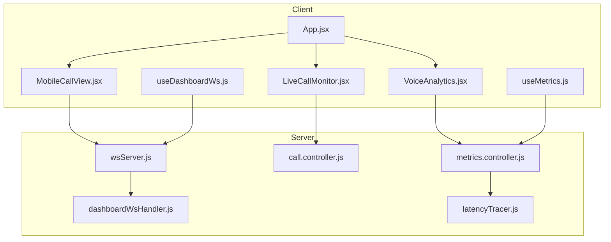
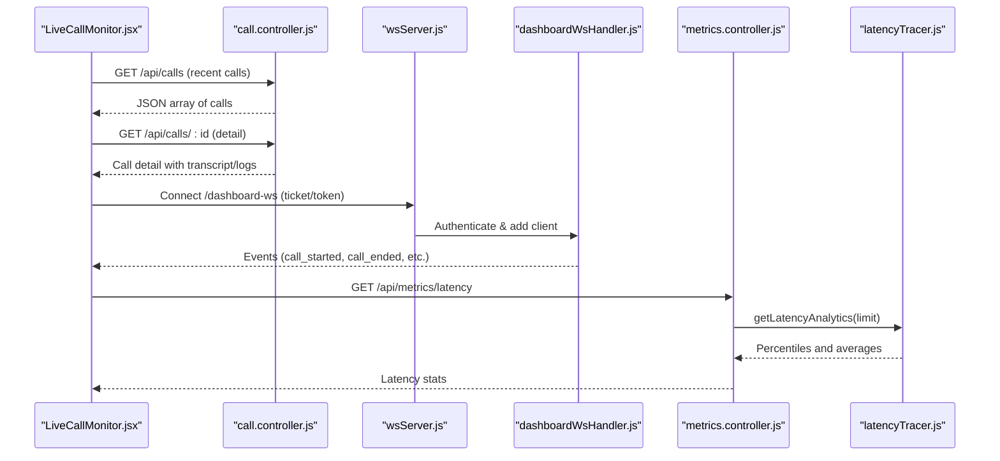
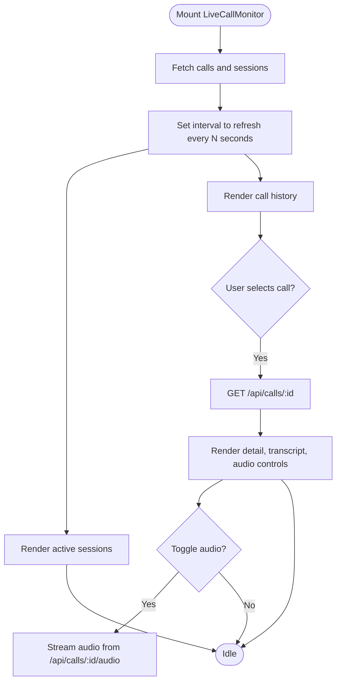
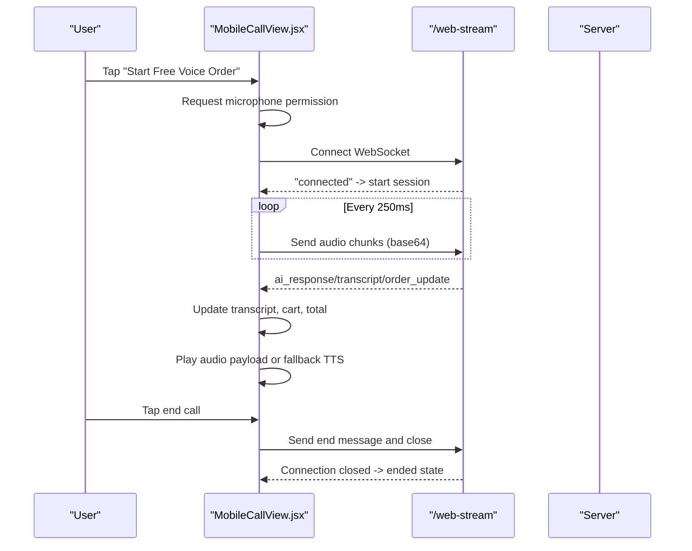
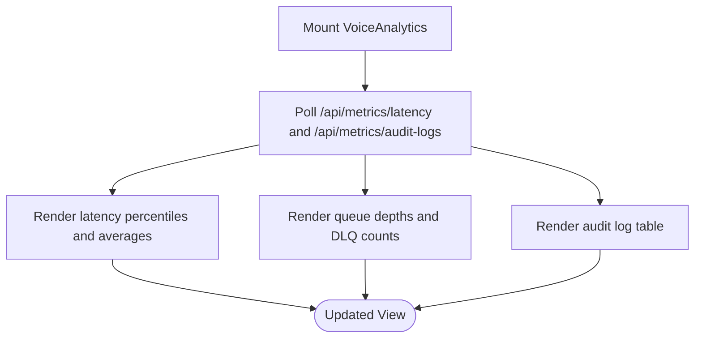
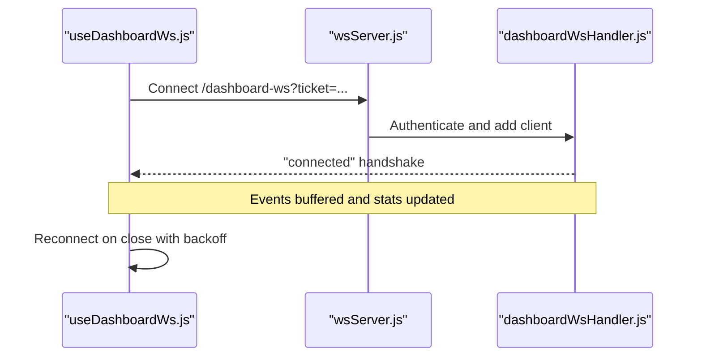
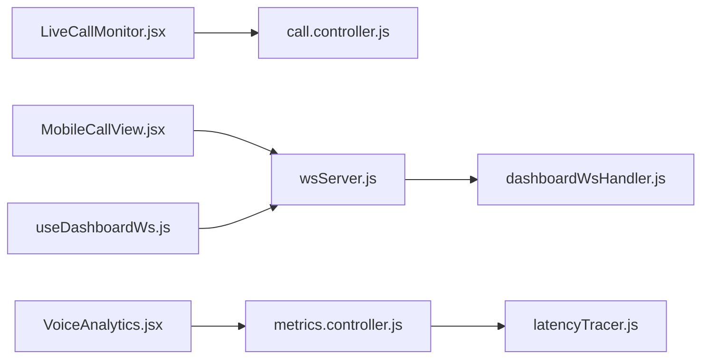

# Live Call Monitoring

<cite>
**Referenced Files in This Document**
- [LiveCallMonitor.jsx](file://client/src/components/LiveCallMonitor.jsx)
- [MobileCallView.jsx](file://client/src/components/MobileCallView.jsx)
- [VoiceAnalytics.jsx](file://client/src/components/VoiceAnalytics.jsx)
- [useDashboardWs.js](file://client/src/hooks/useDashboardWs.js)
- [useMetrics.js](file://client/src/hooks/useMetrics.js)
- [App.jsx](file://client/src/App.jsx)
- [dashboardWsHandler.js](file://server/src/websocket/dashboardWsHandler.js)
- [wsServer.js](file://server/src/websocket/wsServer.js)
- [call.controller.js](file://server/src/controllers/call.controller.js)
- [metrics.controller.js](file://server/src/controllers/metrics.controller.js)
- [latencyTracer.js](file://server/src/services/latencyTracer.js)
</cite>

## Table of Contents
1. [Introduction](#introduction)
2. [Project Structure](#project-structure)
3. [Core Components](#core-components)
4. [Architecture Overview](#architecture-overview)
5. [Detailed Component Analysis](#detailed-component-analysis)
6. [Dependency Analysis](#dependency-analysis)
7. [Performance Considerations](#performance-considerations)
8. [Troubleshooting Guide](#troubleshooting-guide)
9. [Conclusion](#conclusion)
10. [Appendices](#appendices)

## Introduction
This document explains the live call monitoring dashboard in Inkiro, focusing on how active calls are displayed in real time, how caller information and transcripts are shown, how call duration is tracked, and how voice analytics integrate to present performance indicators. It also covers WebSocket event subscription for call lifecycle updates, responsive design considerations across devices, accessibility features, and performance optimizations for handling multiple concurrent calls with efficient DOM updates.

## Project Structure
The live call monitoring feature spans client components, hooks, and server-side WebSocket handlers and controllers:
- Client:
  - LiveCallMonitor.jsx: Dashboard view for active sessions and call history with detail panels and audio playback.
  - MobileCallView.jsx: Full-screen mobile call experience with live transcript, timer, and media streaming.
  - VoiceAnalytics.jsx: Observability panel showing latency percentiles, queue health, and audit logs.
  - useDashboardWs.js: Real-time WebSocket coordinator for dashboard events and stats.
  - useMetrics.js: Hook that polls metrics endpoints for latency and audit data.
  - App.jsx: Orchestrates views and integrates dashboard WebSocket stats into top-level cards.
- Server:
  - wsServer.js: WebSocket upgrade and routing for /dashboard-ws and streaming endpoints.
  - dashboardWsHandler.js: Authentication, connection management, and tenant-scoped broadcast for dashboard clients.
  - call.controller.js: REST endpoints for call stats, recent calls, call details, and audio recordings.
  - metrics.controller.js + latencyTracer.js: Latency profiling and metrics retrieval for observability.

**Diagram sources**
- [App.jsx:1-161](file://client/src/App.jsx#L1-L161)
- [LiveCallMonitor.jsx:1-210](file://client/src/components/LiveCallMonitor.jsx#L1-L210)
- [MobileCallView.jsx:1-409](file://client/src/components/MobileCallView.jsx#L1-L409)
- [VoiceAnalytics.jsx:1-159](file://client/src/components/VoiceAnalytics.jsx#L1-L159)
- [useDashboardWs.js:1-128](file://client/src/hooks/useDashboardWs.js#L1-L128)
- [useMetrics.js:1-73](file://client/src/hooks/useMetrics.js#L1-L73)
- [wsServer.js:1-162](file://server/src/websocket/wsServer.js#L1-L162)
- [dashboardWsHandler.js:1-69](file://server/src/websocket/dashboardWsHandler.js#L1-L69)
- [call.controller.js:1-114](file://server/src/controllers/call.controller.js#L1-L114)
- [metrics.controller.js:1-29](file://server/src/controllers/metrics.controller.js#L1-L29)
- [latencyTracer.js:1-133](file://server/src/services/latencyTracer.js#L1-L133)

**Section sources**
- [App.jsx:1-161](file://client/src/App.jsx#L1-L161)
- [LiveCallMonitor.jsx:1-210](file://client/src/components/LiveCallMonitor.jsx#L1-L210)
- [MobileCallView.jsx:1-409](file://client/src/components/MobileCallView.jsx#L1-L409)
- [VoiceAnalytics.jsx:1-159](file://client/src/components/VoiceAnalytics.jsx#L1-L159)
- [useDashboardWs.js:1-128](file://client/src/hooks/useDashboardWs.js#L1-L128)
- [useMetrics.js:1-73](file://client/src/hooks/useMetrics.js#L1-L73)
- [wsServer.js:1-162](file://server/src/websocket/wsServer.js#L1-L162)
- [dashboardWsHandler.js:1-69](file://server/src/websocket/dashboardWsHandler.js#L1-L69)
- [call.controller.js:1-114](file://server/src/controllers/call.controller.js#L1-L114)
- [metrics.controller.js:1-29](file://server/src/controllers/metrics.controller.js#L1-L29)
- [latencyTracer.js:1-133](file://server/src/services/latencyTracer.js#L1-L133)

## Core Components
- LiveCallMonitor: Displays active sessions, call history, and detailed call view with transcript and audio playback. Polls REST endpoints periodically to refresh state.
- MobileCallView: Implements a full-screen mobile call flow with microphone capture, WebSocket streaming, live transcript, cart updates, and call timer.
- VoiceAnalytics: Shows latency percentiles (P50/P95), average STT/LLM/TTS times, background queue depths, and audit logs via metrics endpoints.
- useDashboardWs: Manages authenticated WebSocket connection to /dashboard-ws, buffers events, auto-reconnects with backoff, and updates global stats.
- useMetrics: Polls metrics endpoints for latency analytics, queue stats, audit logs, and engine status at intervals.

Key responsibilities:
- Real-time display of active calls and caller info.
- Transcript rendering from call detail payloads.
- Duration tracking during live calls.
- Subscription to WebSocket events for call lifecycle changes.
- Integration of voice analytics metrics for performance insights.

**Section sources**
- [LiveCallMonitor.jsx:1-210](file://client/src/components/LiveCallMonitor.jsx#L1-L210)
- [MobileCallView.jsx:1-409](file://client/src/components/MobileCallView.jsx#L1-L409)
- [VoiceAnalytics.jsx:1-159](file://client/src/components/VoiceAnalytics.jsx#L1-L159)
- [useDashboardWs.js:1-128](file://client/src/hooks/useDashboardWs.js#L1-L128)
- [useMetrics.js:1-73](file://client/src/hooks/useMetrics.js#L1-L73)

## Architecture Overview
The system combines REST polling for call history and detail with WebSocket streams for real-time updates. The dashboard uses an authenticated WebSocket channel to receive tenant-scoped events and update stats. Metrics are polled from dedicated endpoints backed by a latency tracer service.

**Diagram sources**
- [LiveCallMonitor.jsx:20-39](file://client/src/components/LiveCallMonitor.jsx#L20-L39)
- [call.controller.js:22-89](file://server/src/controllers/call.controller.js#L22-L89)
- [wsServer.js:34-72](file://server/src/websocket/wsServer.js#L34-L72)
- [dashboardWsHandler.js:10-38](file://server/src/websocket/dashboardWsHandler.js#L10-L38)
- [metrics.controller.js:9-28](file://server/src/controllers/metrics.controller.js#L9-L28)
- [latencyTracer.js:95-132](file://server/src/services/latencyTracer.js#L95-L132)

## Detailed Component Analysis

### LiveCallMonitor: Active Calls, Transcripts, Duration, Audio
- Active sessions:
  - Fetches sessions via REST and renders them with source labels and average latency.
  - Uses periodic polling to keep the list current.
- Call history and detail:
  - Lists recent calls; selecting a call fetches detail including transcript and logs.
  - Renders transcript turns with role-based avatars and bubbles.
- Audio playback:
  - Toggles audio playback using an HTML Audio element sourced from a recording endpoint.
- State management:
  - Local state tracks calls, sessions, selected call, and playing audio.
- Performance considerations:
  - Polling interval set to refresh both calls and sessions every few seconds.
  - Transcript rendering limited to visible area with scrollable container.

**Diagram sources**
- [LiveCallMonitor.jsx:10-32](file://client/src/components/LiveCallMonitor.jsx#L10-L32)
- [LiveCallMonitor.jsx:34-50](file://client/src/components/LiveCallMonitor.jsx#L34-L50)
- [LiveCallMonitor.jsx:113-205](file://client/src/components/LiveCallMonitor.jsx#L113-L205)
- [call.controller.js:65-114](file://server/src/controllers/call.controller.js#L65-L114)

**Section sources**
- [LiveCallMonitor.jsx:1-210](file://client/src/components/LiveCallMonitor.jsx#L1-L210)
- [call.controller.js:22-114](file://server/src/controllers/call.controller.js#L22-L114)

### MobileCallView: Real-time Transcript, Timer, Media Streaming
- Call lifecycle:
  - Starts call by requesting microphone permission and connecting to /web-stream.
  - Tracks call duration with a timer while connected.
- Real-time updates:
  - Handles AI responses, order updates, and user transcripts via WebSocket messages.
  - Updates live cart and totals when order state changes.
- Audio handling:
  - Streams captured audio to the server using MediaRecorder.
  - Plays AI audio payloads or falls back to browser TTS.
- Responsive design:
  - Optimized layout for mobile screens with large touch targets and clear visual states.

**Diagram sources**
- [MobileCallView.jsx:36-136](file://client/src/components/MobileCallView.jsx#L36-L136)
- [MobileCallView.jsx:138-174](file://client/src/components/MobileCallView.jsx#L138-L174)
- [MobileCallView.jsx:176-185](file://client/src/components/MobileCallView.jsx#L176-L185)
- [wsServer.js:74-97](file://server/src/websocket/wsServer.js#L74-L97)

**Section sources**
- [MobileCallView.jsx:1-409](file://client/src/components/MobileCallView.jsx#L1-L409)
- [wsServer.js:74-97](file://server/src/websocket/wsServer.js#L74-L97)

### VoiceAnalytics: Latency Metrics, Queue Health, Audit Logs
- Latency percentiles:
  - Displays P50 and P95 turn latencies and averages per stage (STT/LLM/TTS).
- Queue health:
  - Shows active/pending counts and dead-letter queue sizes for background workers.
- Audit trails:
  - Lists immutable state transition logs with timestamps, actions, resources, actors, and details.
- Data source:
  - Polls metrics endpoints for latency analytics and audit logs.

**Diagram sources**
- [VoiceAnalytics.jsx:1-159](file://client/src/components/VoiceAnalytics.jsx#L1-L159)
- [useMetrics.js:35-59](file://client/src/hooks/useMetrics.js#L35-L59)
- [metrics.controller.js:9-28](file://server/src/controllers/metrics.controller.js#L9-L28)
- [latencyTracer.js:95-132](file://server/src/services/latencyTracer.js#L95-L132)

**Section sources**
- [VoiceAnalytics.jsx:1-159](file://client/src/components/VoiceAnalytics.jsx#L1-L159)
- [useMetrics.js:1-73](file://client/src/hooks/useMetrics.js#L1-L73)
- [metrics.controller.js:1-29](file://server/src/controllers/metrics.controller.js#L1-L29)
- [latencyTracer.js:1-133](file://server/src/services/latencyTracer.js#L1-L133)

### WebSocket Event Subscription and Call Lifecycle Updates
- Dashboard WebSocket:
  - useDashboardWs connects to /dashboard-ws using single-use tickets or bearer tokens.
  - Buffers incoming events and updates global stats for active calls and other metrics.
  - Auto-reconnects with exponential backoff on disconnect.
- Server-side broadcasting:
  - dashboardWsHandler authenticates connections and enforces tenant/restaurant scoping.
  - Broadcast function sends events only to matching tenants and roles.

**Diagram sources**
- [useDashboardWs.js:45-109](file://client/src/hooks/useDashboardWs.js#L45-L109)
- [wsServer.js:34-72](file://server/src/websocket/wsServer.js#L34-L72)
- [dashboardWsHandler.js:10-38](file://server/src/websocket/dashboardWsHandler.js#L10-L38)

**Section sources**
- [useDashboardWs.js:1-128](file://client/src/hooks/useDashboardWs.js#L1-L128)
- [dashboardWsHandler.js:1-69](file://server/src/websocket/dashboardWsHandler.js#L1-L69)
- [wsServer.js:1-162](file://server/src/websocket/wsServer.js#L1-L162)

## Dependency Analysis
- Client dependencies:
  - LiveCallMonitor depends on call.controller endpoints for calls and details.
  - MobileCallView depends on /web-stream WebSocket handler for real-time media and transcript.
  - VoiceAnalytics depends on metrics.controller and latencyTracer for observability data.
  - useDashboardWs depends on wsServer and dashboardWsHandler for real-time events.
- Server dependencies:
  - wsServer routes upgrades to appropriate handlers based on path.
  - dashboardWsHandler manages tenant-scoped broadcasts and client lifecycle.
  - call.controller queries database for call stats and details.
  - metrics.controller delegates to latencyTracer for percentile calculations.

**Diagram sources**
- [LiveCallMonitor.jsx:20-39](file://client/src/components/LiveCallMonitor.jsx#L20-L39)
- [MobileCallView.jsx:55-108](file://client/src/components/MobileCallView.jsx#L55-L108)
- [VoiceAnalytics.jsx:6-13](file://client/src/components/VoiceAnalytics.jsx#L6-L13)
- [useDashboardWs.js:45-109](file://client/src/hooks/useDashboardWs.js#L45-L109)
- [wsServer.js:118-147](file://server/src/websocket/wsServer.js#L118-L147)
- [dashboardWsHandler.js:10-69](file://server/src/websocket/dashboardWsHandler.js#L10-L69)
- [metrics.controller.js:9-28](file://server/src/controllers/metrics.controller.js#L9-L28)
- [latencyTracer.js:95-132](file://server/src/services/latencyTracer.js#L95-L132)

**Section sources**
- [LiveCallMonitor.jsx:1-210](file://client/src/components/LiveCallMonitor.jsx#L1-L210)
- [MobileCallView.jsx:1-409](file://client/src/components/MobileCallView.jsx#L1-L409)
- [VoiceAnalytics.jsx:1-159](file://client/src/components/VoiceAnalytics.jsx#L1-L159)
- [useDashboardWs.js:1-128](file://client/src/hooks/useDashboardWs.js#L1-L128)
- [wsServer.js:1-162](file://server/src/websocket/wsServer.js#L1-L162)
- [dashboardWsHandler.js:1-69](file://server/src/websocket/dashboardWsHandler.js#L1-L69)
- [call.controller.js:1-114](file://server/src/controllers/call.controller.js#L1-L114)
- [metrics.controller.js:1-29](file://server/src/controllers/metrics.controller.js#L1-L29)
- [latencyTracer.js:1-133](file://server/src/services/latencyTracer.js#L1-L133)

## Performance Considerations
- Efficient polling:
  - LiveCallMonitor uses a fixed interval to refresh calls and sessions, balancing freshness with network load.
- Event buffering:
  - useDashboardWs limits buffered events to a maximum size to prevent memory growth.
- DOM updates:
  - Transcript sections use scrollable containers to limit rendered nodes and improve scrolling performance.
- Audio streaming:
  - MobileCallView streams small audio chunks at regular intervals to reduce latency and bandwidth usage.
- Metrics polling cadence:
  - useMetrics polls metrics endpoints at a moderate interval to avoid excessive requests.
- WebSocket liveness:
  - wsServer implements heartbeat checks to terminate stale connections and free resources.

[No sources needed since this section provides general guidance]

## Troubleshooting Guide
- WebSocket connection issues:
  - Ensure authentication ticket or token is valid before connecting to /dashboard-ws.
  - Check server logs for upgrade errors and unauthorized attempts.
- Missing call details:
  - Verify tenant and restaurant context in authenticated requests to call.controller endpoints.
  - Confirm call exists and has associated logs and recordings.
- Metrics not updating:
  - Validate metrics endpoints availability and permissions.
  - Inspect latency tracer persistence and query results.
- Audio playback failures:
  - Confirm recording files exist and are accessible.
  - Handle browser-specific audio decoding fallbacks gracefully.

**Section sources**
- [wsServer.js:34-72](file://server/src/websocket/wsServer.js#L34-L72)
- [call.controller.js:11-20](file://server/src/controllers/call.controller.js#L11-L20)
- [call.controller.js:65-114](file://server/src/controllers/call.controller.js#L65-L114)
- [metrics.controller.js:9-28](file://server/src/controllers/metrics.controller.js#L9-L28)
- [latencyTracer.js:64-89](file://server/src/services/latencyTracer.js#L64-L89)

## Conclusion
The live call monitoring dashboard in Inkiro combines REST polling and WebSocket streams to provide real-time visibility into active calls, caller information, transcripts, and durations. Voice analytics integrate latency profiling, queue health, and audit trails to support performance monitoring. The architecture emphasizes tenant-scoped security, efficient updates, and responsive design for both desktop and mobile experiences.

[No sources needed since this section summarizes without analyzing specific files]

## Appendices

### Implementing Custom Call Monitoring Views
- Use LiveCallMonitor patterns:
  - Poll call lists and details via REST endpoints.
  - Render transcripts with role-based styling and scrollable containers.
  - Integrate audio playback for recordings.
- Extend MobileCallView:
  - Connect to /web-stream for real-time media and transcript updates.
  - Manage microphone access and audio chunk streaming.
  - Update live cart and totals based on order state messages.

**Section sources**
- [LiveCallMonitor.jsx:20-50](file://client/src/components/LiveCallMonitor.jsx#L20-L50)
- [LiveCallMonitor.jsx:113-205](file://client/src/components/LiveCallMonitor.jsx#L113-L205)
- [MobileCallView.jsx:36-136](file://client/src/components/MobileCallView.jsx#L36-L136)
- [MobileCallView.jsx:138-174](file://client/src/components/MobileCallView.jsx#L138-L174)

### Real-Time Transcript Updates
- Subscribe to WebSocket events for transcript segments and finalize updates.
- Append new transcript entries to state and render within a scrollable feed.
- Ensure minimal re-renders by batching updates and limiting visible items.

**Section sources**
- [MobileCallView.jsx:67-108](file://client/src/components/MobileCallView.jsx#L67-L108)
- [useDashboardWs.js:63-77](file://client/src/hooks/useDashboardWs.js#L63-L77)

### Call Quality Metrics
- Display latency percentiles and stage averages from metrics endpoints.
- Monitor queue depths and dead-letter queues to detect bottlenecks.
- Review audit logs for state transitions impacting call quality.

**Section sources**
- [VoiceAnalytics.jsx:27-78](file://client/src/components/VoiceAnalytics.jsx#L27-L78)
- [useMetrics.js:35-59](file://client/src/hooks/useMetrics.js#L35-L59)
- [metrics.controller.js:9-28](file://server/src/controllers/metrics.controller.js#L9-L28)
- [latencyTracer.js:95-132](file://server/src/services/latencyTracer.js#L95-L132)

### Responsive Design and Accessibility
- Mobile-first layouts with large touch targets and clear visual states.
- Scrollable transcript areas to accommodate long conversations.
- Color-coded statuses and icons for quick recognition.
- Provide keyboard navigation and screen reader-friendly labels where applicable.

[No sources needed since this section provides general guidance]