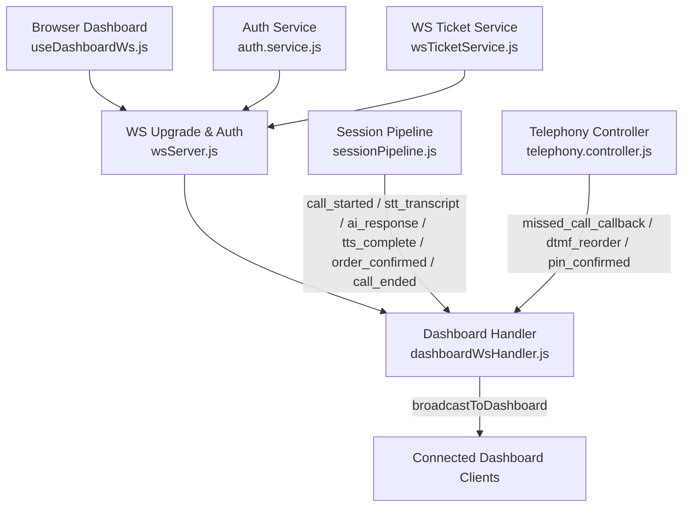
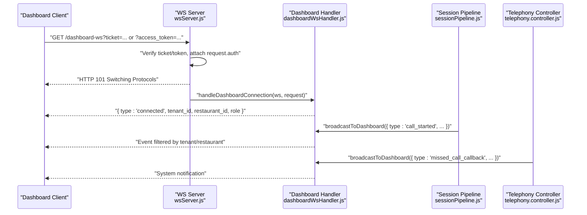
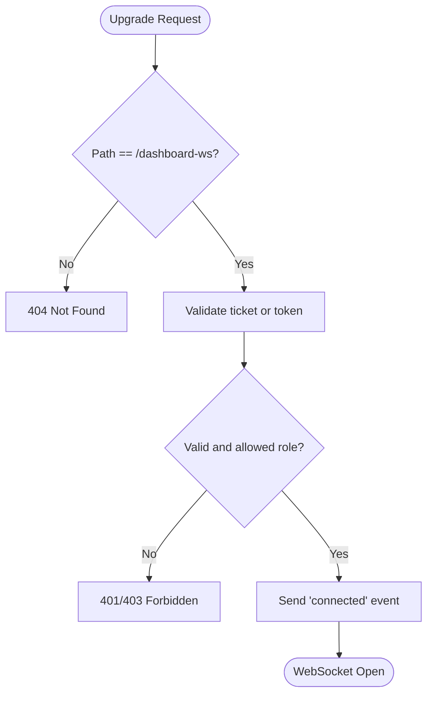
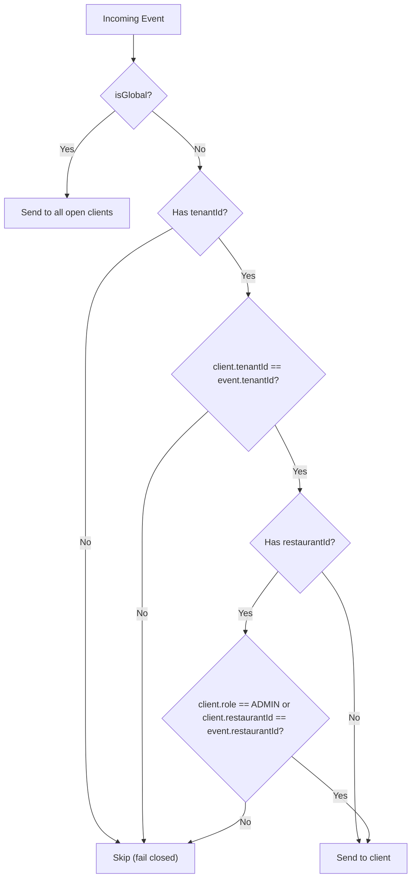
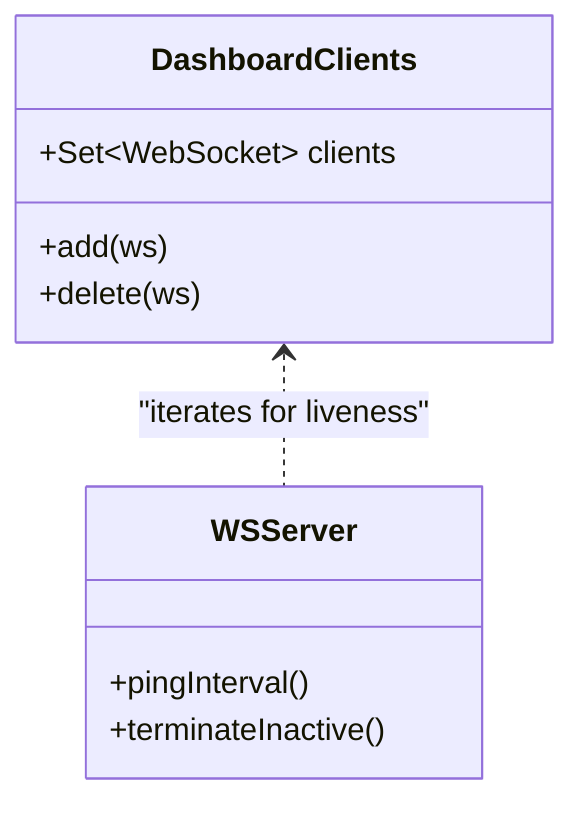
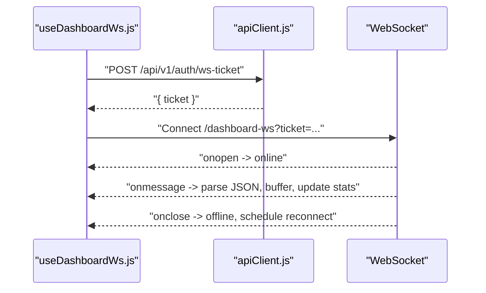
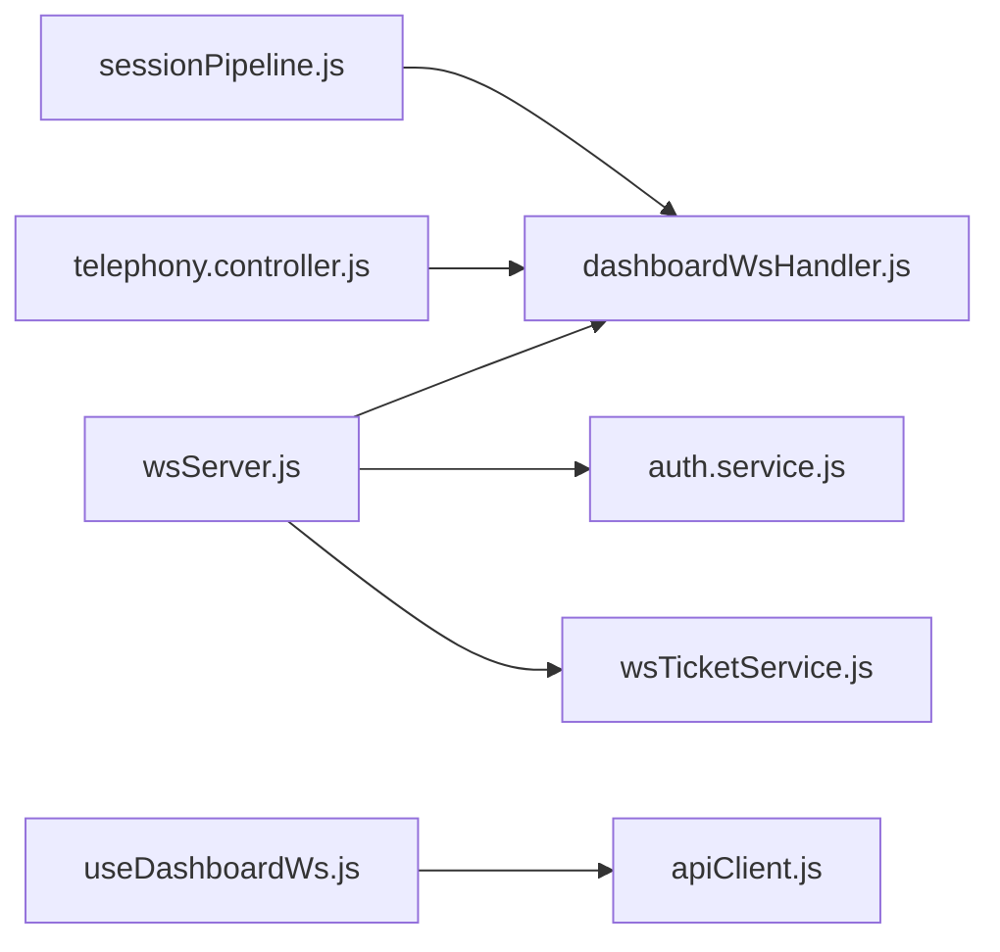

# WebSocket Event System

<cite>
**Referenced Files in This Document**
- [wsServer.js](file://server/src/websocket/wsServer.js)
- [dashboardWsHandler.js](file://server/src/websocket/dashboardWsHandler.js)
- [sessionPipeline.js](file://server/src/websocket/sessionPipeline.js)
- [telephony.controller.js](file://server/src/controllers/telephony.controller.js)
- [auth.service.js](file://server/src/services/auth.service.js)
- [wsTicketService.js](file://server/src/services/wsTicketService.js)
- [useDashboardWs.js](file://client/src/hooks/useDashboardWs.js)
- [useKds.js](file://client/src/hooks/useKds.js)
- [apiClient.js](file://client/src/services/apiClient.js)
</cite>

## Table of Contents
1. [Introduction](#introduction)
2. [Project Structure](#project-structure)
3. [Core Components](#core-components)
4. [Architecture Overview](#architecture-overview)
5. [Detailed Component Analysis](#detailed-component-analysis)
6. [Dependency Analysis](#dependency-analysis)
7. [Performance Considerations](#performance-considerations)
8. [Troubleshooting Guide](#troubleshooting-guide)
9. [Conclusion](#conclusion)

## Introduction
This document explains the WebSocket event system that powers real-time dashboard updates in Inkiro. It covers connection lifecycle (authentication, tenant isolation, client management), broadcast boundaries (tenant and restaurant), all event types (calls, orders, metrics, system notifications), message format, server-side broadcasting examples, error handling patterns, and security considerations for multi-tenant isolation and client authentication validation.

## Project Structure
The WebSocket subsystem spans server-side upgrade and routing, authenticated dashboard connections, session-driven call/order events, and a React hook on the client that connects, reconnects, and consumes events.

**Diagram sources**
- [wsServer.js:17-147](file://server/src/websocket/wsServer.js#L17-L147)
- [dashboardWsHandler.js:10-68](file://server/src/websocket/dashboardWsHandler.js#L10-L68)
- [sessionPipeline.js:24-111](file://server/src/websocket/sessionPipeline.js#L24-L111)
- [telephony.controller.js:15-87](file://server/src/controllers/telephony.controller.js#L15-L87)
- [auth.service.js:50-72](file://server/src/services/auth.service.js#L50-L72)
- [wsTicketService.js:11-26](file://server/src/services/wsTicketService.js#L11-L26)

**Section sources**
- [wsServer.js:17-147](file://server/src/websocket/wsServer.js#L17-L147)
- [dashboardWsHandler.js:10-68](file://server/src/websocket/dashboardWsHandler.js#L10-L68)
- [sessionPipeline.js:24-111](file://server/src/websocket/sessionPipeline.js#L24-L111)
- [telephony.controller.js:15-87](file://server/src/controllers/telephony.controller.js#L15-L87)
- [auth.service.js:50-72](file://server/src/services/auth.service.js#L50-L72)
- [wsTicketService.js:11-26](file://server/src/services/wsTicketService.js#L11-L26)

## Core Components
- WebSocket coordinator: upgrades HTTP to WebSocket, enforces path-based routing, authenticates via single-use tickets or bearer tokens, and attaches auth context to requests before dispatching to handlers.
- Dashboard handler: maintains an in-memory set of connected dashboard clients, performs strict tenant/restaurant filtering on broadcasts, and sends an initial handshake with tenant and restaurant context.
- Session pipeline: orchestrates voice sessions, emits call lifecycle events, transcript updates, AI responses, TTS completion, order confirmation, and call end events.
- Telephony controller: emits system notifications such as missed call callbacks, DTMF reorder actions, and pin-drop confirmations.
- Authentication services: generate short-lived access tokens and single-use WebSocket tickets; verify tokens and enforce audience/issuer constraints.
- Client hook: acquires a ticket or uses a stored token to connect, handles reconnection with exponential backoff, buffers recent events, and refreshes metrics on key events.

**Section sources**
- [wsServer.js:17-147](file://server/src/websocket/wsServer.js#L17-L147)
- [dashboardWsHandler.js:10-68](file://server/src/websocket/dashboardWsHandler.js#L10-L68)
- [sessionPipeline.js:24-111](file://server/src/websocket/sessionPipeline.js#L24-L111)
- [telephony.controller.js:15-87](file://server/src/controllers/telephony.controller.js#L15-L87)
- [auth.service.js:50-72](file://server/src/services/auth.service.js#L50-L72)
- [wsTicketService.js:11-26](file://server/src/services/wsTicketService.js#L11-L26)
- [useDashboardWs.js:45-109](file://client/src/hooks/useDashboardWs.js#L45-L109)

## Architecture Overview
The system follows a hub-and-spoke model:
- The WebSocket server coordinates upgrades and routes to handlers based on path.
- Dashboard clients authenticate using either a single-use ticket or a bearer token.
- All business processes emit events through a centralized broadcast function that enforces tenant and restaurant boundaries.
- The client hook manages connection lifecycle and reacts to specific event types to update UI and metrics.

**Diagram sources**
- [wsServer.js:23-72](file://server/src/websocket/wsServer.js#L23-L72)
- [dashboardWsHandler.js:10-37](file://server/src/websocket/dashboardWsHandler.js#L10-L37)
- [sessionPipeline.js:102-108](file://server/src/websocket/sessionPipeline.js#L102-L108)
- [telephony.controller.js:46-54](file://server/src/controllers/telephony.controller.js#L46-L54)

## Detailed Component Analysis

### Connection Lifecycle and Authentication
- Upgrade path: Only whitelisted paths are allowed (/media-stream, /web-stream, /dashboard-ws, /exotel-stream).
- Dashboard authentication: Accepts a single-use ticket or a bearer token. Role is validated against an allowlist. In production, missing credentials result in immediate rejection.
- Dev fallback: A development user context can be attached when no valid credentials are provided.
- Initial handshake: On successful connection, the server sends a connected event including tenant_id, restaurant_id, role, and timestamp.

**Diagram sources**
- [wsServer.js:23-72](file://server/src/websocket/wsServer.js#L23-L72)
- [dashboardWsHandler.js:10-37](file://server/src/websocket/dashboardWsHandler.js#L10-L37)

**Section sources**
- [wsServer.js:23-72](file://server/src/websocket/wsServer.js#L23-L72)
- [dashboardWsHandler.js:10-37](file://server/src/websocket/dashboardWsHandler.js#L10-L37)
- [auth.service.js:50-72](file://server/src/services/auth.service.js#L50-L72)
- [wsTicketService.js:11-26](file://server/src/services/wsTicketService.js#L11-L26)

### Tenant Isolation and Broadcast Boundaries
- Strict tenant boundary: Non-global events must include tenantId and match the client’s tenantId.
- Restaurant boundary: If restaurantId is present, only clients with matching restaurantId or ADMIN role receive the event.
- Global events: Events marked as global bypass tenant/restaurant filters.
- Fail-closed design: Mismatches silently skip delivery; errors during send are logged and do not crash the broadcaster.

**Diagram sources**
- [dashboardWsHandler.js:43-68](file://server/src/websocket/dashboardWsHandler.js#L43-L68)

**Section sources**
- [dashboardWsHandler.js:43-68](file://server/src/websocket/dashboardWsHandler.js#L43-L68)

### Client Management
- Connected clients: Maintained in an in-memory Set keyed by WebSocket instances.
- Cleanup: On close or error, clients are removed from the set.
- Liveness: A periodic ping/pong mechanism terminates unresponsive sockets.

**Diagram sources**
- [dashboardWsHandler.js:4-28](file://server/src/websocket/dashboardWsHandler.js#L4-L28)
- [wsServer.js:149-158](file://server/src/websocket/wsServer.js#L149-L158)

**Section sources**
- [dashboardWsHandler.js:4-28](file://server/src/websocket/dashboardWsHandler.js#L4-L28)
- [wsServer.js:149-158](file://server/src/websocket/wsServer.js#L149-L158)

### Broadcast Mechanism and Event Types
The broadcast function serializes events with a timestamp and delivers them to eligible clients. Key event types emitted across the system include:

- Call events
  - call_started: Emitted when a new voice session begins.
  - stt_transcript: Real-time speech-to-text updates.
  - user_speech: User input transcripts.
  - ai_response: Assistant response text and metadata.
  - tts_complete: Text-to-speech synthesis completion with duration and latency.
  - call_ended: Session termination with summary stats.

- Order state transitions
  - order_confirmed: When a call-driven order reaches confirmed status.
  - order_dispatched: Triggered by downstream dispatch flows (consumed by KDS).

- Metrics updates
  - The client refreshes metrics on call_started, call_ended, order_confirmed, and order_dispatched.

- System notifications
  - missed_call_callback: Missed call webhook results.
  - dtmf_reorder: Quick-reorder triggered by DTMF digits.
  - pin_confirmed: Delivery location pin confirmation.

Message structure
- type: Event identifier string.
- timestamp: ISO timestamp added by the broadcaster if not present.
- tenant_id: Present in handshake; used for filtering on non-global events.
- restaurant_id: Present in handshake; used for filtering on non-global events.
- payload: Event-specific fields (e.g., sessionId, orderId, phone, transcript, order snapshot, latencies).

Examples of server-side broadcasting
- Session start: Emits call_started with sessionId, tenantId, restaurantId, source.
- Transcript streaming: Emits stt_transcript per final transcript chunk.
- AI turn: Emits ai_response with response_text, state, provider/model, latency_ms.
- TTS complete: Emits tts_complete with text, audio_duration, latency_ms.
- Order confirmed: Emits order_confirmed with orderId, order snapshot, callerPhone.
- Call ended: Emits call_ended with summary (turn count, final state, avg latency).
- Telephony notifications: Emits missed_call_callback, dtmf_reorder, pin_confirmed.

**Section sources**
- [sessionPipeline.js:54-61](file://server/src/websocket/sessionPipeline.js#L54-L61)
- [sessionPipeline.js:102-108](file://server/src/websocket/sessionPipeline.js#L102-L108)
- [sessionPipeline.js:150-156](file://server/src/websocket/sessionPipeline.js#L150-L156)
- [sessionPipeline.js:178-188](file://server/src/websocket/sessionPipeline.js#L178-L188)
- [sessionPipeline.js:236-244](file://server/src/websocket/sessionPipeline.js#L236-L244)
- [sessionPipeline.js:377-385](file://server/src/websocket/sessionPipeline.js#L377-L385)
- [sessionPipeline.js:419-431](file://server/src/websocket/sessionPipeline.js#L419-L431)
- [telephony.controller.js:46-54](file://server/src/controllers/telephony.controller.js#L46-L54)
- [telephony.controller.js:63-87](file://server/src/controllers/telephony.controller.js#L63-L87)
- [telephony.controller.js:181-239](file://server/src/controllers/telephony.controller.js#L181-L239)
- [useDashboardWs.js:63-76](file://client/src/hooks/useDashboardWs.js#L63-L76)
- [useKds.js:39-47](file://client/src/hooks/useKds.js#L39-L47)

### Client-Side Consumption and Reconnection
- Connection: Acquires a single-use ticket or uses a stored token to connect to /dashboard-ws.
- Event buffering: Keeps the last N events in memory for UI rendering.
- Metrics sync: Refreshes server stats on key events (call and order lifecycle).
- Reconnect strategy: Exponential backoff with capped delay; closes and reconnects on auth changes.

**Diagram sources**
- [useDashboardWs.js:45-109](file://client/src/hooks/useDashboardWs.js#L45-L109)
- [apiClient.js:58-66](file://client/src/services/apiClient.js#L58-L66)

**Section sources**
- [useDashboardWs.js:45-109](file://client/src/hooks/useDashboardWs.js#L45-L109)
- [apiClient.js:58-66](file://client/src/services/apiClient.js#L58-L66)

## Dependency Analysis
- wsServer depends on:
  - dashboardWsHandler for dashboard connections.
  - media/web/exotel stream handlers for telephony streams.
  - auth.service for token verification.
  - wsTicketService for single-use ticket consumption.
- dashboardWsHandler depends on:
  - logger for diagnostics.
  - ws module for client readiness checks.
- sessionPipeline depends on:
  - database helpers, STT/TTS services, dialogue manager, geocoding service.
  - broadcastToDashboard for emitting events.
  - queue managers for async dispatch and notifications.
- telephony.controller depends on:
  - broadcastToDashboard for system notifications.
  - wsTicketService for stream tickets.
- Client useDashboardWs depends on:
  - apiClient for ticket acquisition and REST calls.
  - window events for auth change signaling.

**Diagram sources**
- [wsServer.js:1-9](file://server/src/websocket/wsServer.js#L1-L9)
- [dashboardWsHandler.js:1-2](file://server/src/websocket/dashboardWsHandler.js#L1-L2)
- [sessionPipeline.js:1-16](file://server/src/websocket/sessionPipeline.js#L1-L16)
- [telephony.controller.js:1-11](file://server/src/controllers/telephony.controller.js#L1-L11)
- [useDashboardWs.js:1-3](file://client/src/hooks/useDashboardWs.js#L1-L3)
- [apiClient.js:58-66](file://client/src/services/apiClient.js#L58-L66)

**Section sources**
- [wsServer.js:1-9](file://server/src/websocket/wsServer.js#L1-L9)
- [dashboardWsHandler.js:1-2](file://server/src/websocket/dashboardWsHandler.js#L1-L2)
- [sessionPipeline.js:1-16](file://server/src/websocket/sessionPipeline.js#L1-L16)
- [telephony.controller.js:1-11](file://server/src/controllers/telephony.controller.js#L1-L11)
- [useDashboardWs.js:1-3](file://client/src/hooks/useDashboardWs.js#L1-L3)
- [apiClient.js:58-66](file://client/src/services/apiClient.js#L58-L66)

## Performance Considerations
- Payload limits: Maximum payload size is enforced at the WebSocket server level to prevent oversized messages.
- Heartbeat: Periodic ping/pong detects dead connections and terminates them to free resources.
- Broadcasting efficiency: Iterates only over open clients with valid auth; errors per client are caught and logged without halting the loop.
- Client-side buffering: Limits event history to a fixed size to avoid unbounded memory growth.
- Metrics polling: Stats are polled at intervals and refreshed on significant events to reduce unnecessary network churn.

[No sources needed since this section provides general guidance]

## Troubleshooting Guide
Common issues and resolutions:
- Authentication failures
  - Missing or invalid ticket/token: Ensure the client obtains a fresh ticket or valid token before connecting.
  - Role restrictions: Only roles in the allowed list can connect to /dashboard-ws.
- Tenant/restaurant mismatch
  - Events not received: Verify that the client’s tenantId and restaurantId match the event’s scope unless the event is global.
- Connection drops
  - Unresponsive clients: The server terminates inactive connections after heartbeat timeouts.
  - Reconnect behavior: The client implements exponential backoff; check logs for repeated failures.
- Broadcast errors
  - Per-client send errors are logged; inspect logs for socket state issues.

**Section sources**
- [wsServer.js:23-72](file://server/src/websocket/wsServer.js#L23-L72)
- [dashboardWsHandler.js:21-28](file://server/src/websocket/dashboardWsHandler.js#L21-L28)
- [dashboardWsHandler.js:43-68](file://server/src/websocket/dashboardWsHandler.js#L43-L68)
- [useDashboardWs.js:80-109](file://client/src/hooks/useDashboardWs.js#L80-L109)

## Conclusion
Inkiro’s WebSocket event system provides secure, multi-tenant, real-time dashboards with strict tenant and restaurant boundaries. Connections are authenticated via single-use tickets or bearer tokens, and all broadcasts are filtered to ensure data isolation. The session pipeline and telephony controllers emit comprehensive call, order, and system events, while the client hook manages robust connectivity and reactive UI updates. The design emphasizes fail-closed security, efficient broadcasting, and resilient client behavior.

[No sources needed since this section summarizes without analyzing specific files]