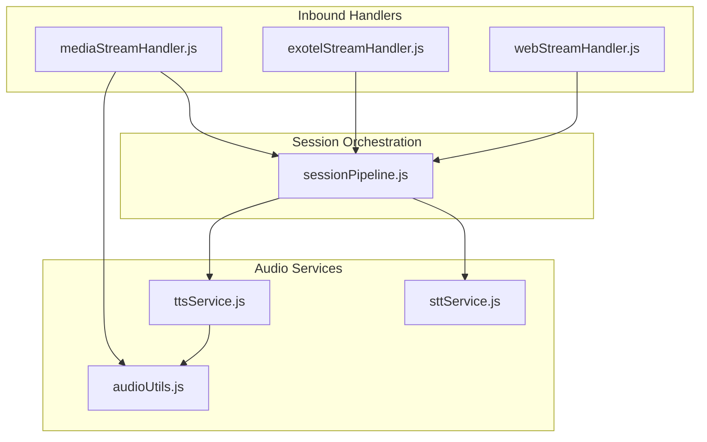
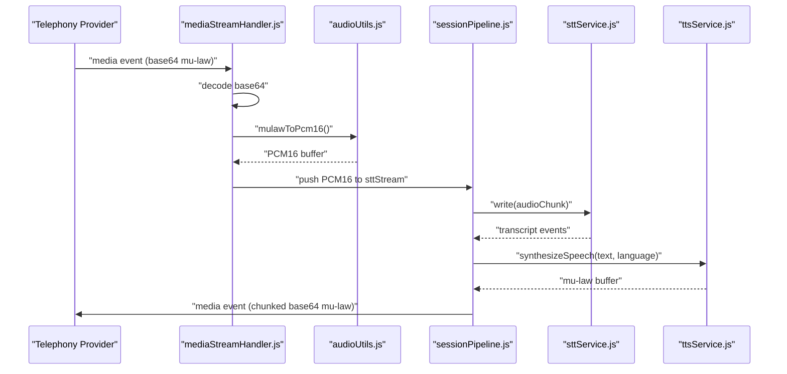
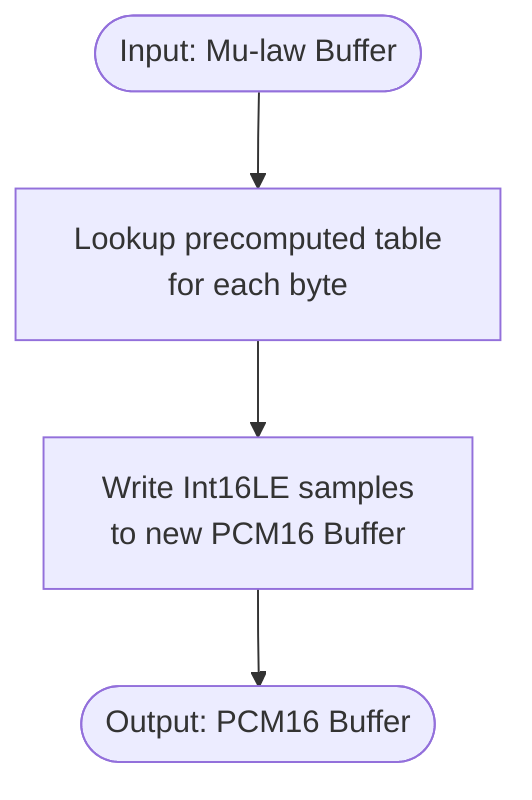
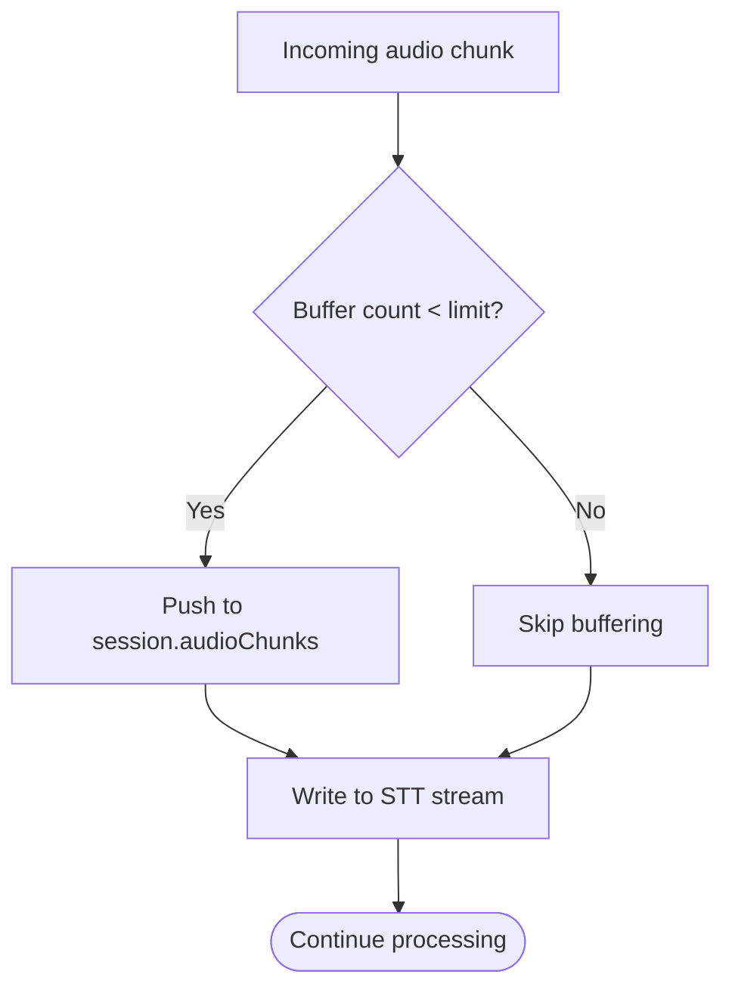
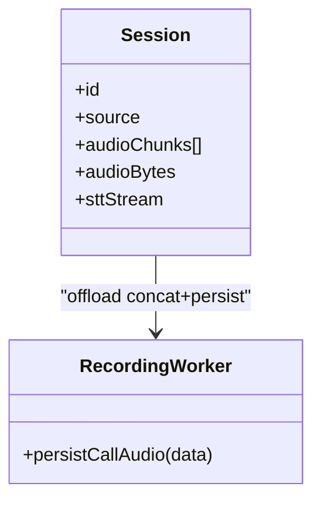
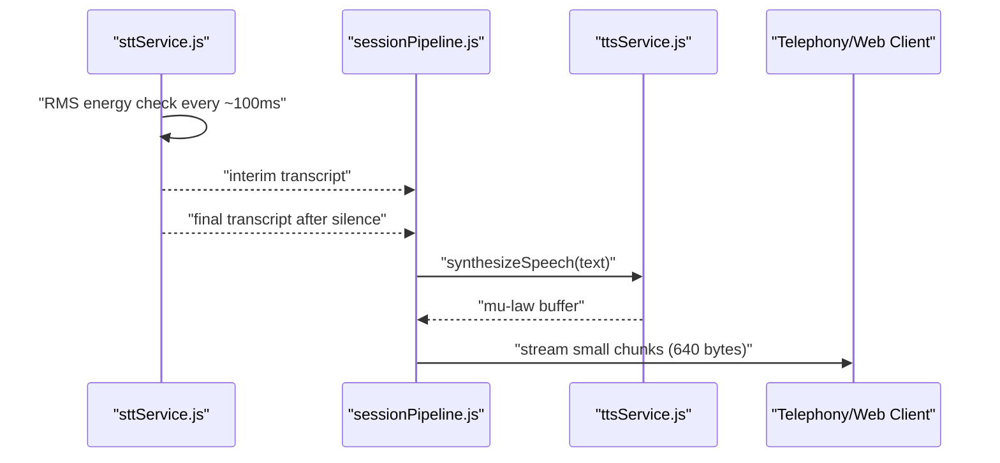
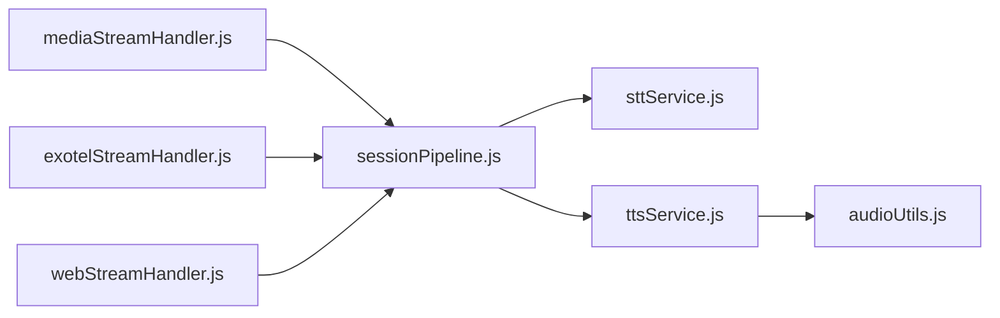

# Audio Processing & Conversion

<cite>
**Referenced Files in This Document**
- [audioUtils.js](file://server/src/utils/audioUtils.js)
- [mediaStreamHandler.js](file://server/src/websocket/mediaStreamHandler.js)
- [exotelStreamHandler.js](file://server/src/websocket/exotelStreamHandler.js)
- [webStreamHandler.js](file://server/src/websocket/webStreamHandler.js)
- [sessionPipeline.js](file://server/src/websocket/sessionPipeline.js)
- [sttService.js](file://server/src/services/sttService.js)
- [ttsService.js](file://server/src/services/ttsService.js)
</cite>

## Table of Contents
1. [Introduction](#introduction)
2. [Project Structure](#project-structure)
3. [Core Components](#core-components)
4. [Architecture Overview](#architecture-overview)
5. [Detailed Component Analysis](#detailed-component-analysis)
6. [Dependency Analysis](#dependency-analysis)
7. [Performance Considerations](#performance-considerations)
8. [Troubleshooting Guide](#troubleshooting-guide)
9. [Conclusion](#conclusion)

## Introduction
This document explains the audio processing utilities and format conversion capabilities used by the media streaming system to handle telephony and web audio streams. It focuses on:
- Mu-law to PCM16 conversion for telephony compatibility
- Audio chunking, buffering, and memory optimization strategies
- Audio quality parameters, compression settings, and latency optimization
- Handling different audio formats and implementing validation
- Managing large audio streams efficiently
- Troubleshooting audio quality issues and optimizing performance

## Project Structure
The audio pipeline spans WebSocket handlers, a session pipeline, STT/TTS services, and low-level audio utilities:
- WebSocket handlers receive raw or encoded audio from providers (Twilio, Exotel) or web clients
- The session pipeline orchestrates transcription, dialogue processing, and audio responses
- STT service transcribes audio using multiple providers with VAD-like chunking
- TTS service synthesizes speech and converts to telephony-friendly formats
- Audio utilities provide codec conversions and resampling

**Diagram sources**
- [mediaStreamHandler.js:1-69](file://server/src/websocket/mediaStreamHandler.js#L1-L69)
- [exotelStreamHandler.js:1-80](file://server/src/websocket/exotelStreamHandler.js#L1-L80)
- [webStreamHandler.js:1-81](file://server/src/websocket/webStreamHandler.js#L1-L81)
- [sessionPipeline.js:1-437](file://server/src/websocket/sessionPipeline.js#L1-L437)
- [sttService.js:1-603](file://server/src/services/sttService.js#L1-L603)
- [ttsService.js:1-187](file://server/src/services/ttsService.js#L1-L187)
- [audioUtils.js:1-84](file://server/src/utils/audioUtils.js#L1-L84)

**Section sources**
- [mediaStreamHandler.js:1-69](file://server/src/websocket/mediaStreamHandler.js#L1-L69)
- [exotelStreamHandler.js:1-80](file://server/src/websocket/exotelStreamHandler.js#L1-L80)
- [webStreamHandler.js:1-81](file://server/src/websocket/webStreamHandler.js#L1-L81)
- [sessionPipeline.js:1-437](file://server/src/websocket/sessionPipeline.js#L1-L437)
- [sttService.js:1-603](file://server/src/services/sttService.js#L1-L603)
- [ttsService.js:1-187](file://server/src/services/ttsService.js#L1-L187)
- [audioUtils.js:1-84](file://server/src/utils/audioUtils.js#L1-L84)

## Core Components
- Audio utilities: Mu-law/PCM16 conversion and resampling for telephony compatibility
- Inbound handlers: Normalize provider-specific audio into a common stream
- Session pipeline: Manage sessions, buffer chunks, orchestrate STT/TTS, and stream responses
- STT service: Multi-provider transcription with VAD-like chunking and fallbacks
- TTS service: Multi-provider synthesis with caching and telephony output encoding

Key responsibilities:
- Convert incoming telephony audio to PCM16 for STT
- Stream PCM16 to STT while buffering limited chunks for recording
- Synthesize TTS audio and encode to Mu-law for telephony playback
- Chunk outgoing audio for low-latency streaming

**Section sources**
- [audioUtils.js:1-84](file://server/src/utils/audioUtils.js#L1-L84)
- [sessionPipeline.js:18-111](file://server/src/websocket/sessionPipeline.js#L18-L111)
- [sttService.js:329-454](file://server/src/services/sttService.js#L329-L454)
- [ttsService.js:28-70](file://server/src/services/ttsService.js#L28-L70)

## Architecture Overview
End-to-end flow for inbound telephony audio:
- Provider sends base64-encoded Mu-law frames over WebSocket
- Handler decodes base64, converts Mu-law to PCM16, pushes to STT stream, and buffers for recording
- STT detects speech segments and returns transcripts
- Session pipeline processes dialogue and requests TTS
- TTS synthesizes audio and encodes to Mu-law; response is chunked and streamed back to provider

**Diagram sources**
- [mediaStreamHandler.js:40-49](file://server/src/websocket/mediaStreamHandler.js#L40-L49)
- [audioUtils.js:26-33](file://server/src/utils/audioUtils.js#L26-L33)
- [sessionPipeline.js:224-294](file://server/src/websocket/sessionPipeline.js#L224-L294)
- [sttService.js:329-454](file://server/src/services/sttService.js#L329-L454)
- [ttsService.js:28-70](file://server/src/services/ttsService.js#L28-L70)

## Detailed Component Analysis

### Mu-law to PCM16 Conversion Algorithm
- Precomputed decoding table maps each 8-bit Mu-law byte to a 16-bit linear PCM sample
- Decoding uses sign, exponent, and mantissa fields to reconstruct amplitude
- Encoding applies bias, clipping, exponent search, and mantissa extraction to produce Mu-law bytes
- Resampling supports down-sampling 16kHz PCM16 to 8kHz via simple decimation

**Diagram sources**
- [audioUtils.js:7-33](file://server/src/utils/audioUtils.js#L7-L33)

**Section sources**
- [audioUtils.js:7-33](file://server/src/utils/audioUtils.js#L7-L33)
- [audioUtils.js:40-71](file://server/src/utils/audioUtils.js#L40-L71)
- [audioUtils.js:73-83](file://server/src/utils/audioUtils.js#L73-L83)

### Audio Chunking Strategy and Buffer Management
- Incoming audio chunks are buffered per session up to a fixed count limit to support post-call recording
- A global memory cap constant defines an upper bound for active call memory usage
- Outgoing TTS audio is split into small chunks for low-latency streaming to providers and web clients
- On session end, buffered chunks are concatenated and offloaded asynchronously for persistence

**Diagram sources**
- [mediaStreamHandler.js:40-49](file://server/src/websocket/mediaStreamHandler.js#L40-L49)
- [exotelStreamHandler.js:45-57](file://server/src/websocket/exotelStreamHandler.js#L45-L57)
- [webStreamHandler.js:28-39](file://server/src/websocket/webStreamHandler.js#L28-L39)
- [sessionPipeline.js:18-52](file://server/src/websocket/sessionPipeline.js#L18-L52)
- [sessionPipeline.js:246-281](file://server/src/websocket/sessionPipeline.js#L246-L281)
- [sessionPipeline.js:407-416](file://server/src/websocket/sessionPipeline.js#L407-L416)

**Section sources**
- [mediaStreamHandler.js:40-49](file://server/src/websocket/mediaStreamHandler.js#L40-L49)
- [exotelStreamHandler.js:45-57](file://server/src/websocket/exotelStreamHandler.js#L45-L57)
- [webStreamHandler.js:28-39](file://server/src/websocket/webStreamHandler.js#L28-L39)
- [sessionPipeline.js:18-52](file://server/src/websocket/sessionPipeline.js#L18-L52)
- [sessionPipeline.js:246-281](file://server/src/websocket/sessionPipeline.js#L246-L281)
- [sessionPipeline.js:407-416](file://server/src/websocket/sessionPipeline.js#L407-L416)

### Memory Optimization Techniques
- Per-session buffer count limit prevents unbounded growth during long calls
- Global memory cap constant provides a safety boundary for active call memory
- Asynchronous recording worker offloads concatenation and persistence to avoid blocking the main loop
- TTS audio cache reduces redundant synthesis for repeated prompts

**Diagram sources**
- [sessionPipeline.js:35-52](file://server/src/websocket/sessionPipeline.js#L35-L52)
- [sessionPipeline.js:407-416](file://server/src/websocket/sessionPipeline.js#L407-L416)

**Section sources**
- [sessionPipeline.js:18-52](file://server/src/websocket/sessionPipeline.js#L18-L52)
- [sessionPipeline.js:407-416](file://server/src/websocket/sessionPipeline.js#L407-L416)
- [ttsService.js:14-17](file://server/src/services/ttsService.js#L14-L17)

### Audio Quality Parameters and Compression Settings
- Telephony streams use 8kHz sampling rate and Mu-law encoding for bandwidth efficiency
- STT accepts PCM16 at 8kHz or 16kHz; local Whisper path normalizes to 16kHz float32
- TTS outputs Mu-law at 8kHz for telephony playback; Google Cloud TTS can directly return Mu-law
- Mock TTS generates synthetic tones clamped to 16-bit range before Mu-law conversion

Quality considerations:
- Mu-law provides logarithmic quantization suitable for voice
- Down-sampling to 8kHz reduces bandwidth but limits high-frequency content
- Clipping prevention ensures no distortion when generating PCM samples

**Section sources**
- [audioUtils.js:73-83](file://server/src/utils/audioUtils.js#L73-L83)
- [sttService.js:151-168](file://server/src/services/sttService.js#L151-L168)
- [ttsService.js:75-120](file://server/src/services/ttsService.js#L75-L120)
- [ttsService.js:125-148](file://server/src/services/ttsService.js#L125-L148)
- [ttsService.js:154-179](file://server/src/services/ttsService.js#L154-L179)

### Latency Optimization Strategies
- Immediate TTS response streaming: TTS audio is sent in small chunks to minimize perceived latency
- VAD-like chunking in STT: Accumulate audio until silence thresholds trigger transcription
- Short processing intervals: STT checks energy every ~100ms to detect speech boundaries quickly
- Caching: Repeated TTS prompts are cached to avoid re-synthesis delays

**Diagram sources**
- [sttService.js:358-454](file://server/src/services/sttService.js#L358-L454)
- [sessionPipeline.js:224-294](file://server/src/websocket/sessionPipeline.js#L224-L294)
- [ttsService.js:28-70](file://server/src/services/ttsService.js#L28-L70)

**Section sources**
- [sttService.js:358-454](file://server/src/services/sttService.js#L358-L454)
- [sessionPipeline.js:224-294](file://server/src/websocket/sessionPipeline.js#L224-L294)
- [ttsService.js:28-70](file://server/src/services/ttsService.js#L28-L70)

### Handling Different Audio Formats and Validation
- Web handler supports both JSON messages with base64 audio and raw binary frames
- STT service handles WAV, MP3, M4A, and WebM via provider APIs or local model conversion
- Local Whisper path attempts to parse WAV and falls back to interpreting raw PCM16 as float32
- Provider handlers validate presence of payload and session state before processing

Validation patterns:
- Ensure session exists and is active
- Check message structure and payload presence
- Handle errors gracefully and log diagnostics

**Section sources**
- [webStreamHandler.js:23-70](file://server/src/websocket/webStreamHandler.js#L23-L70)
- [sttService.js:76-210](file://server/src/services/sttService.js#L76-L210)
- [sttService.js:151-168](file://server/src/services/sttService.js#L151-L168)
- [mediaStreamHandler.js:40-49](file://server/src/websocket/mediaStreamHandler.js#L40-L49)
- [exotelStreamHandler.js:45-57](file://server/src/websocket/exotelStreamHandler.js#L45-L57)

### Managing Large Audio Streams Efficiently
- Limit buffered chunks per session to prevent memory pressure
- Use small chunk sizes for outbound streaming to reduce latency and backpressure
- Offload heavy operations (concatenation, persistence) to background workers
- Use streaming interfaces for STT to process audio incrementally

**Section sources**
- [sessionPipeline.js:18-52](file://server/src/websocket/sessionPipeline.js#L18-L52)
- [sessionPipeline.js:246-281](file://server/src/websocket/sessionPipeline.js#L246-L281)
- [sessionPipeline.js:407-416](file://server/src/websocket/sessionPipeline.js#L407-L416)
- [sttService.js:329-454](file://server/src/services/sttService.js#L329-L454)

## Dependency Analysis
The audio pipeline exhibits clear layering and controlled coupling:
- Handlers depend on session pipeline for orchestration
- Session pipeline depends on STT and TTS services
- TTS depends on audio utilities for encoding
- STT may depend on external providers and local models

**Diagram sources**
- [mediaStreamHandler.js:1-69](file://server/src/websocket/mediaStreamHandler.js#L1-L69)
- [exotelStreamHandler.js:1-80](file://server/src/websocket/exotelStreamHandler.js#L1-L80)
- [webStreamHandler.js:1-81](file://server/src/websocket/webStreamHandler.js#L1-L81)
- [sessionPipeline.js:1-437](file://server/src/websocket/sessionPipeline.js#L1-L437)
- [sttService.js:1-603](file://server/src/services/sttService.js#L1-L603)
- [ttsService.js:1-187](file://server/src/services/ttsService.js#L1-L187)
- [audioUtils.js:1-84](file://server/src/utils/audioUtils.js#L1-L84)

**Section sources**
- [mediaStreamHandler.js:1-69](file://server/src/websocket/mediaStreamHandler.js#L1-L69)
- [exotelStreamHandler.js:1-80](file://server/src/websocket/exotelStreamHandler.js#L1-L80)
- [webStreamHandler.js:1-81](file://server/src/websocket/webStreamHandler.js#L1-L81)
- [sessionPipeline.js:1-437](file://server/src/websocket/sessionPipeline.js#L1-L437)
- [sttService.js:1-603](file://server/src/services/sttService.js#L1-L603)
- [ttsService.js:1-187](file://server/src/services/ttsService.js#L1-L187)
- [audioUtils.js:1-84](file://server/src/utils/audioUtils.js#L1-L84)

## Performance Considerations
- Use 8kHz Mu-law for telephony to minimize bandwidth and latency
- Keep outbound chunks small (e.g., 640 bytes) for smoother streaming
- Employ VAD-like thresholds to reduce unnecessary transcription overhead
- Cache frequent TTS prompts to avoid repeated synthesis
- Monitor RMS energy thresholds and silence frame counts to balance responsiveness and accuracy
- Avoid excessive buffering; enforce per-session limits and global memory caps

[No sources needed since this section provides general guidance]

## Troubleshooting Guide
Common issues and remedies:
- No audio playback: Verify TTS output is Mu-law at 8kHz and chunked correctly for the provider
- Poor transcription quality: Ensure PCM16 input matches expected sample rate; consider resampling if upstream differs
- High latency: Reduce chunk size, enable immediate streaming, and tune VAD thresholds
- Memory pressure: Enforce buffer limits and offload recording to background workers
- Provider errors: Check API keys and fallback chains; inspect logs for specific error messages

Diagnostic steps:
- Inspect session logs for STT events and TTS latencies
- Validate incoming payloads and base64 decoding
- Confirm WebSocket states before sending media events
- Review STT provider selection and fallback behavior

**Section sources**
- [mediaStreamHandler.js:57-67](file://server/src/websocket/mediaStreamHandler.js#L57-L67)
- [exotelStreamHandler.js:68-77](file://server/src/websocket/exotelStreamHandler.js#L68-L77)
- [webStreamHandler.js:71-79](file://server/src/websocket/webStreamHandler.js#L71-L79)
- [sessionPipeline.js:282-293](file://server/src/websocket/sessionPipeline.js#L282-L293)
- [sttService.js:494-515](file://server/src/services/sttService.js#L494-L515)

## Conclusion
The system implements a robust audio pipeline that converts telephony Mu-law to PCM16 for STT, streams audio efficiently with small chunks, and synthesizes TTS responses compatible with telephony codecs. It balances quality and latency through VAD-like chunking, caching, and careful buffer management. By following the guidelines and troubleshooting steps outlined here, you can optimize performance and resolve common audio issues effectively.

[No sources needed since this section summarizes without analyzing specific files]