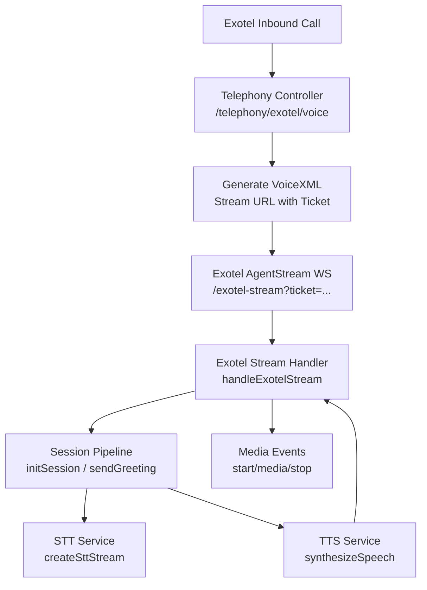
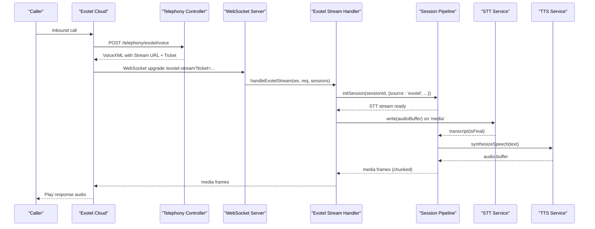
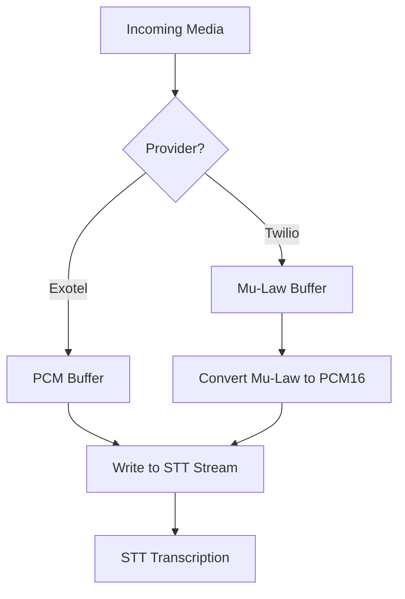
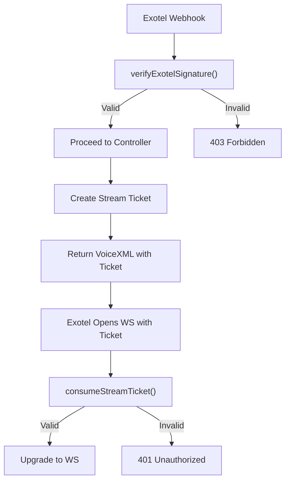
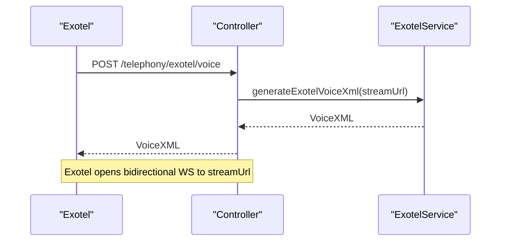
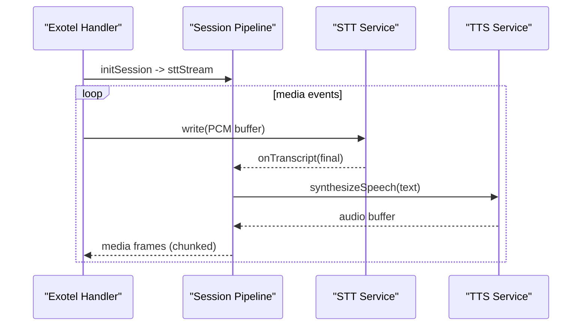
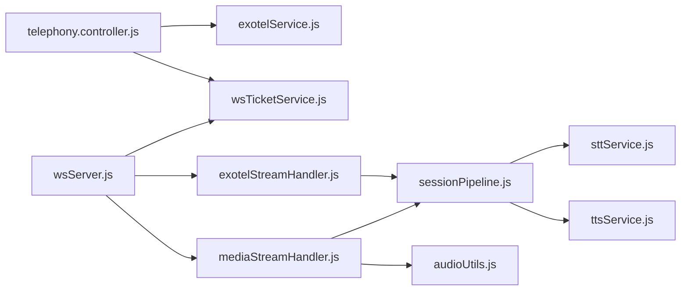

# Exotel Media Stream Handler

<cite>
**Referenced Files in This Document**
- [exotelStreamHandler.js](file://server/src/websocket/exotelStreamHandler.js)
- [mediaStreamHandler.js](file://server/src/websocket/mediaStreamHandler.js)
- [sessionPipeline.js](file://server/src/websocket/sessionPipeline.js)
- [exotelService.js](file://server/src/services/exotelService.js)
- [telephony.controller.js](file://server/src/controllers/telephony.controller.js)
- [telephony.routes.js](file://server/src/routes/telephony.routes.js)
- [wsServer.js](file://server/src/websocket/wsServer.js)
- [wsTicketService.js](file://server/src/services/wsTicketService.js)
- [audioUtils.js](file://server/src/utils/audioUtils.js)
- [sttService.js](file://server/src/services/sttService.js)
- [telephonyAuth.middleware.js](file://server/src/middleware/telephonyAuth.middleware.js)
</cite>

## Table of Contents
1. [Introduction](#introduction)
2. [Project Structure](#project-structure)
3. [Core Components](#core-components)
4. [Architecture Overview](#architecture-overview)
5. [Detailed Component Analysis](#detailed-component-analysis)
6. [Dependency Analysis](#dependency-analysis)
7. [Performance Considerations](#performance-considerations)
8. [Troubleshooting Guide](#troubleshooting-guide)
9. [Conclusion](#conclusion)
10. [Appendices](#appendices)

## Introduction
This document explains the Exotel media stream handler and how it differs from the Twilio implementation within the same system. It covers connection establishment, media stream processing, event handling patterns, Exotel-specific authentication, call routing, media configuration, audio processing, speech-to-text integration, configuration examples, error handling strategies, debugging techniques, and troubleshooting guidance for connectivity and audio quality issues.

## Project Structure
The telephony stack is organized into:
- Webhook endpoints that receive inbound calls and return XML to establish streaming
- WebSocket server that upgrades connections and routes to provider-specific handlers
- Provider handlers (Exotel/Twilio) that manage session lifecycle and media events
- Shared session pipeline that orchestrates STT, dialogue, TTS, order flow, and persistence
- Utilities for audio conversion and ticket-based secure stream access
- Middleware for webhook signature verification

**Diagram sources**
- [telephony.controller.js:15-23](file://server/src/controllers/telephony.controller.js#L15-L23)
- [exotelService.js:17-22](file://server/src/services/exotelService.js#L17-L22)
- [wsServer.js:99-146](file://server/src/websocket/wsServer.js#L99-L146)
- [exotelStreamHandler.js:9-79](file://server/src/websocket/exotelStreamHandler.js#L9-L79)
- [sessionPipeline.js:24-127](file://server/src/websocket/sessionPipeline.js#L24-L127)
- [sttService.js:329-352](file://server/src/services/sttService.js#L329-L352)

**Section sources**
- [telephony.routes.js:8-14](file://server/src/routes/telephony.routes.js#L8-L14)
- [telephony.controller.js:15-41](file://server/src/controllers/telephony.controller.js#L15-L41)
- [wsServer.js:17-161](file://server/src/websocket/wsServer.js#L17-L161)

## Core Components
- Exotel webhook handler: Receives inbound calls and returns VoiceXML instructing Exotel to open a bidirectional WebSocket stream to the server.
- Exotel stream handler: Manages Exotel AgentStream messages (connected/start/media/stop), initializes sessions, forwards audio to STT, and sends TTS responses back.
- Session pipeline: Creates STT streams, processes transcripts, manages conversation state, synthesizes TTS, persists orders, and handles cleanup.
- Audio utilities: Convert between mu-law and PCM formats as needed by providers and STT engines.
- Ticket service: Issues short-lived, single-use tickets to authorize WebSocket stream upgrades securely.
- Telephony auth middleware: Verifies webhook authenticity for Exotel and Twilio.

**Section sources**
- [exotelStreamHandler.js:9-79](file://server/src/websocket/exotelStreamHandler.js#L9-L79)
- [sessionPipeline.js:24-437](file://server/src/websocket/sessionPipeline.js#L24-L437)
- [audioUtils.js:1-84](file://server/src/utils/audioUtils.js#L1-L84)
- [wsTicketService.js:52-85](file://server/src/services/wsTicketService.js#L52-L85)
- [telephonyAuth.middleware.js:44-78](file://server/src/middleware/telephonyAuth.middleware.js#L44-L78)

## Architecture Overview
The Exotel flow uses an AgentStream bidirectional WebSocket. The controller returns VoiceXML that points to a secured WebSocket endpoint using a one-time ticket. The WebSocket server validates the ticket and routes the connection to the Exotel handler. The handler initializes a session, starts STT, and on each media event writes audio to STT. TTS responses are chunked and sent back as media frames.

**Diagram sources**
- [telephony.controller.js:15-23](file://server/src/controllers/telephony.controller.js#L15-L23)
- [exotelService.js:17-22](file://server/src/services/exotelService.js#L17-L22)
- [wsServer.js:99-146](file://server/src/websocket/wsServer.js#L99-L146)
- [exotelStreamHandler.js:23-57](file://server/src/websocket/exotelStreamHandler.js#L23-L57)
- [sessionPipeline.js:24-127](file://server/src/websocket/sessionPipeline.js#L24-L127)
- [sessionPipeline.js:224-294](file://server/src/websocket/sessionPipeline.js#L224-L294)

## Detailed Component Analysis

### Exotel vs Twilio: Differences and Similarities
- Connection establishment
  - Exotel: Returns VoiceXML with a Stream element pointing to /exotel-stream with bidirectional=true and pcm format at 8kHz.
  - Twilio: Returns TwiML with Connect/Stream to /media-stream; media is typically mu-law.
- Media format and conversion
  - Exotel: Sends PCM audio directly; no conversion required before writing to STT.
  - Twilio: Sends mu-law; converted to PCM16 via utility before STT ingestion.
- Event handling
  - Both use start/media/stop events and share the same session pipeline for STT/TTS and business logic.
- Outbound calling
  - Exotel supports triggerExotelOutboundCall to initiate calls with custom URLs.
  - Twilio outbound is not implemented in this snippet set.

**Diagram sources**
- [exotelStreamHandler.js:45-57](file://server/src/websocket/exotelStreamHandler.js#L45-L57)
- [mediaStreamHandler.js:40-50](file://server/src/websocket/mediaStreamHandler.js#L40-L50)
- [audioUtils.js:26-33](file://server/src/utils/audioUtils.js#L26-L33)

**Section sources**
- [exotelService.js:17-22](file://server/src/services/exotelService.js#L17-L22)
- [mediaStreamHandler.js:7-69](file://server/src/websocket/mediaStreamHandler.js#L7-L69)
- [exotelStreamHandler.js:9-79](file://server/src/websocket/exotelStreamHandler.js#L9-L79)

### Exotel Authentication and Security
- Webhook signature verification
  - Exotel webhooks are verified via header or query token; development mode allows bypass when configured.
- Stream ticket authorization
  - WebSocket upgrades to /exotel-stream require a valid stream ticket created by the controller and consumed once by the WebSocket server.

**Diagram sources**
- [telephonyAuth.middleware.js:44-78](file://server/src/middleware/telephonyAuth.middleware.js#L44-L78)
- [telephony.controller.js:15-23](file://server/src/controllers/telephony.controller.js#L15-L23)
- [wsTicketService.js:52-85](file://server/src/services/wsTicketService.js#L52-L85)
- [wsServer.js:99-116](file://server/src/websocket/wsServer.js#L99-L116)

**Section sources**
- [telephonyAuth.middleware.js:44-78](file://server/src/middleware/telephonyAuth.middleware.js#L44-L78)
- [wsTicketService.js:52-85](file://server/src/services/wsTicketService.js#L52-L85)
- [wsServer.js:99-116](file://server/src/websocket/wsServer.js#L99-L116)

### Call Routing and Media Configuration
- Inbound call routing
  - Exotel routes to /telephony/exotel/voice which returns VoiceXML with a Stream element to the secured WebSocket endpoint.
- Media configuration
  - Exotel Stream element specifies bidirectional streaming and PCM format at 8kHz.
- Outbound calls
  - Optional function triggers outbound calls with a custom URL and caller ID.

**Diagram sources**
- [telephony.controller.js:15-23](file://server/src/controllers/telephony.controller.js#L15-L23)
- [exotelService.js:17-22](file://server/src/services/exotelService.js#L17-L22)

**Section sources**
- [telephony.controller.js:15-23](file://server/src/controllers/telephony.controller.js#L15-L23)
- [exotelService.js:17-22](file://server/src/services/exotelService.js#L17-L22)
- [exotelService.js:38-83](file://server/src/services/exotelService.js#L38-L83)

### Audio Processing and Speech-to-Text Integration
- Exotel media events deliver PCM audio buffers directly to the STT stream.
- The session pipeline creates an STT stream based on environment configuration (Groq Whisper batch mode with VAD-like chunking, Google Cloud streaming, or mock).
- Final transcripts trigger dialogue processing and TTS synthesis.
- TTS audio is chunked and sent back to Exotel as media frames.

**Diagram sources**
- [exotelStreamHandler.js:45-57](file://server/src/websocket/exotelStreamHandler.js#L45-L57)
- [sessionPipeline.js:24-127](file://server/src/websocket/sessionPipeline.js#L24-L127)
- [sessionPipeline.js:224-294](file://server/src/websocket/sessionPipeline.js#L224-L294)
- [sttService.js:329-453](file://server/src/services/sttService.js#L329-L453)

**Section sources**
- [exotelStreamHandler.js:45-57](file://server/src/websocket/exotelStreamHandler.js#L45-L57)
- [sessionPipeline.js:24-127](file://server/src/websocket/sessionPipeline.js#L24-L127)
- [sessionPipeline.js:224-294](file://server/src/websocket/sessionPipeline.js#L224-L294)
- [sttService.js:329-453](file://server/src/services/sttService.js#L329-L453)

### Error Handling Strategies
- Webhook validation failures return 403 Forbidden.
- Unauthorized stream upgrades return 401 Unauthorized.
- Message parsing errors in stream handlers are caught and logged without crashing the connection.
- STT/TTS errors are logged and do not break the session; fallbacks or graceful degradation occur where applicable.
- Session cleanup ensures resources are released on stop or connection close.

**Section sources**
- [telephonyAuth.middleware.js:58-78](file://server/src/middleware/telephonyAuth.middleware.js#L58-L78)
- [wsServer.js:108-116](file://server/src/websocket/wsServer.js#L108-L116)
- [exotelStreamHandler.js:68-79](file://server/src/websocket/exotelStreamHandler.js#L68-L79)
- [sessionPipeline.js:394-437](file://server/src/websocket/sessionPipeline.js#L394-L437)

## Dependency Analysis
Key dependencies and relationships:
- Controllers depend on services to generate XML and create stream tickets.
- WebSocket server depends on ticket service for secure upgrades and routes to provider handlers.
- Provider handlers depend on session pipeline for STT/TTS orchestration.
- Session pipeline depends on STT/TTS services, geocoding, queues, and database.
- Audio utilities support Twilio’s mu-law conversion; Exotel uses PCM directly.

**Diagram sources**
- [telephony.controller.js:15-41](file://server/src/controllers/telephony.controller.js#L15-L41)
- [exotelService.js:17-83](file://server/src/services/exotelService.js#L17-L83)
- [wsServer.js:99-146](file://server/src/websocket/wsServer.js#L99-L146)
- [exotelStreamHandler.js:9-79](file://server/src/websocket/exotelStreamHandler.js#L9-L79)
- [mediaStreamHandler.js:7-69](file://server/src/websocket/mediaStreamHandler.js#L7-L69)
- [sessionPipeline.js:24-437](file://server/src/websocket/sessionPipeline.js#L24-L437)
- [sttService.js:329-453](file://server/src/services/sttService.js#L329-L453)
- [audioUtils.js:26-33](file://server/src/utils/audioUtils.js#L26-L33)

**Section sources**
- [telephony.controller.js:15-41](file://server/src/controllers/telephony.controller.js#L15-L41)
- [wsServer.js:99-146](file://server/src/websocket/wsServer.js#L99-L146)
- [exotelStreamHandler.js:9-79](file://server/src/websocket/exotelStreamHandler.js#L9-L79)
- [mediaStreamHandler.js:7-69](file://server/src/websocket/mediaStreamHandler.js#L7-L69)
- [sessionPipeline.js:24-437](file://server/src/websocket/sessionPipeline.js#L24-L437)

## Performance Considerations
- Chunk size for TTS media frames is tuned to balance latency and bandwidth.
- STT stream selection can be switched via environment variables to optimize cost/latency (e.g., Groq Whisper batch mode with energy-based silence detection).
- Memory cap per active call limits audio buffering to prevent memory growth.
- Heartbeat liveness checks terminate stale WebSocket connections.

[No sources needed since this section provides general guidance]

## Troubleshooting Guide
Common issues and resolutions specific to Exotel integration:

- Webhook rejected (403)
  - Ensure EXOTEL_API_TOKEN is correctly configured and matches Exotel’s expected value.
  - Verify headers or query parameters used for signature verification align with middleware expectations.
  - Check logs for “Rejected unauthenticated Exotel webhook” messages.

- Stream upgrade unauthorized (401)
  - Confirm the stream ticket was generated by the controller and passed in the WebSocket URL.
  - Ensure the ticket has not expired or been consumed already.
  - Validate PUBLIC_URL and port mapping so Exotel can reach the server.

- No audio or poor audio quality
  - Exotel expects PCM at 8kHz; ensure VoiceXML Stream element is configured accordingly.
  - If using Twilio alongside, confirm mu-law to PCM conversion is applied only for Twilio streams.
  - Monitor STT provider logs and latency metrics; switch provider if necessary.

- Session not ending or resources leaking
  - Verify stop events and WebSocket close handlers are invoked.
  - Check session cleanup routines and queue workers for persistent tasks.

- Debugging tips
  - Enable detailed logging in stream handlers and session pipeline.
  - Use dashboard WebSocket to observe real-time transcripts and TTS events.
  - Inspect Redis-backed tickets to verify creation and consumption timing.

**Section sources**
- [telephonyAuth.middleware.js:44-78](file://server/src/middleware/telephonyAuth.middleware.js#L44-L78)
- [wsServer.js:99-116](file://server/src/websocket/wsServer.js#L99-L116)
- [exotelService.js:17-22](file://server/src/services/exotelService.js#L17-L22)
- [mediaStreamHandler.js:40-50](file://server/src/websocket/mediaStreamHandler.js#L40-L50)
- [sessionPipeline.js:394-437](file://server/src/websocket/sessionPipeline.js#L394-L437)

## Conclusion
The Exotel media stream handler integrates seamlessly with the shared session pipeline, enabling robust voice interactions for Indian callers while maintaining security through webhook signatures and stream tickets. Compared to Twilio, Exotel simplifies audio handling by delivering PCM directly, reducing conversion overhead. The system supports flexible STT providers, efficient TTS chunking, and comprehensive error handling to ensure reliable operation in production environments.

[No sources needed since this section summarizes without analyzing specific files]

## Appendices

### Configuration Examples
- Environment variables for Exotel:
  - EXOTEL_SID, EXOTEL_API_KEY, EXOTEL_API_TOKEN, EXOTEL_SUB_DOMAIN, EXOTEL_CALLER_ID
- Public URL and ports:
  - PUBLIC_URL must resolve to a reachable address for Exotel callbacks and stream upgrades.
- STT provider selection:
  - AI_STT_PROVIDER controls which STT backend is used; GROQ_API_KEY enables Groq Whisper.

**Section sources**
- [exotelService.js:8-12](file://server/src/services/exotelService.js#L8-L12)
- [env.js:1-42](file://server/src/config/env.js#L1-L42)
- [sttService.js:329-352](file://server/src/services/sttService.js#L329-L352)