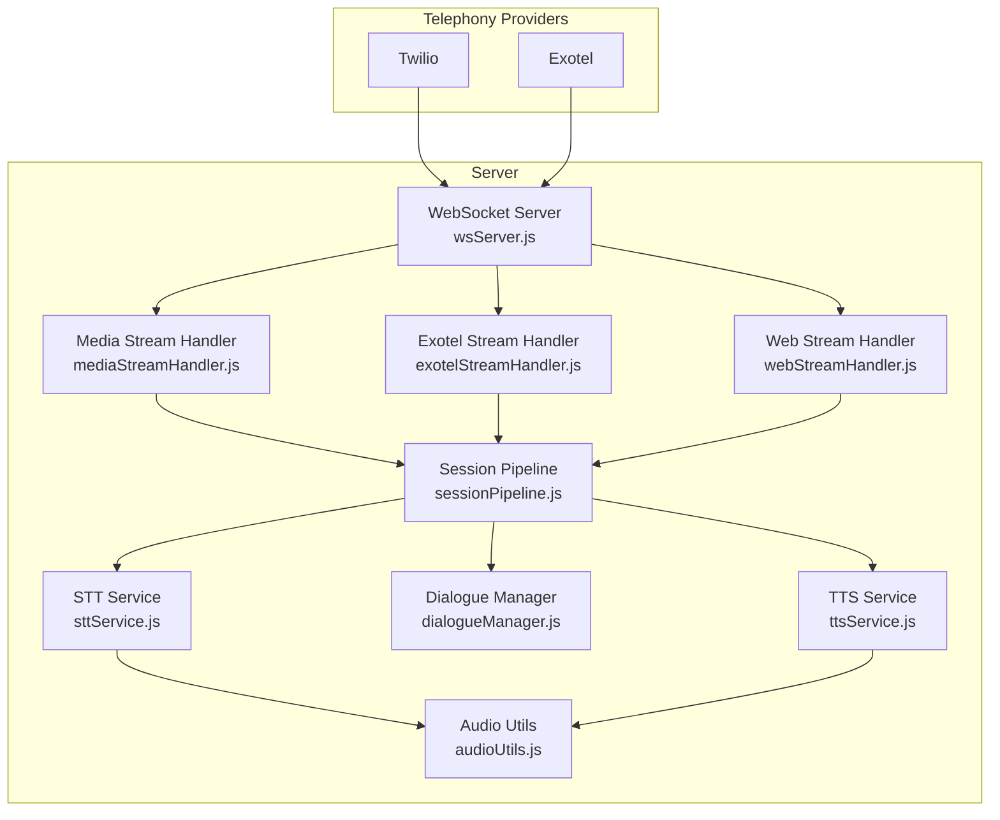
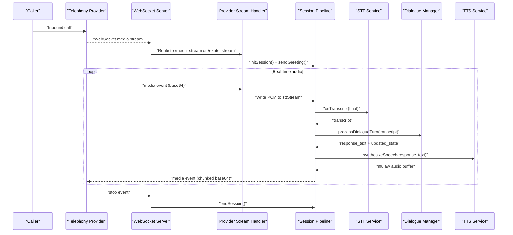
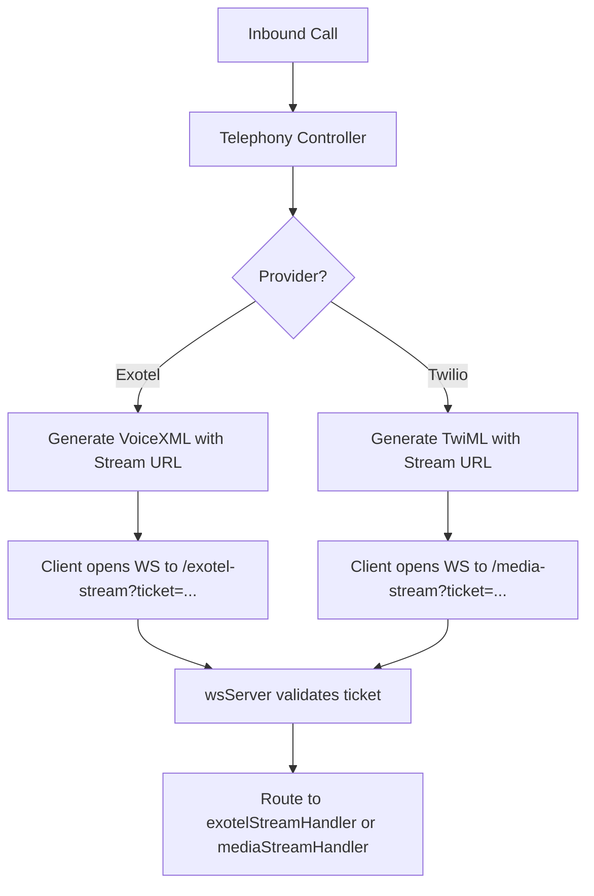
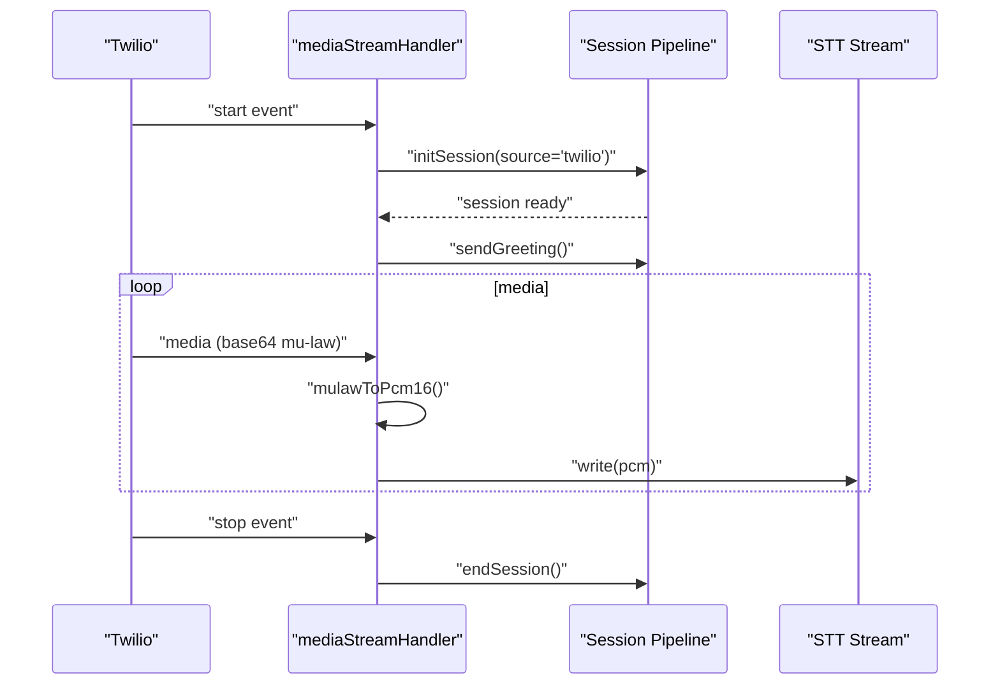
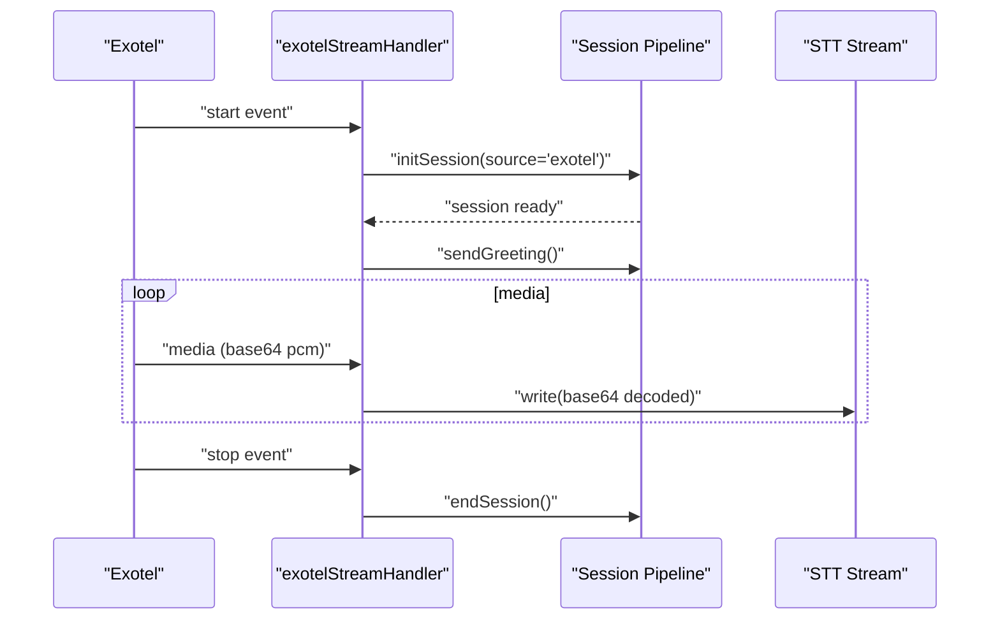
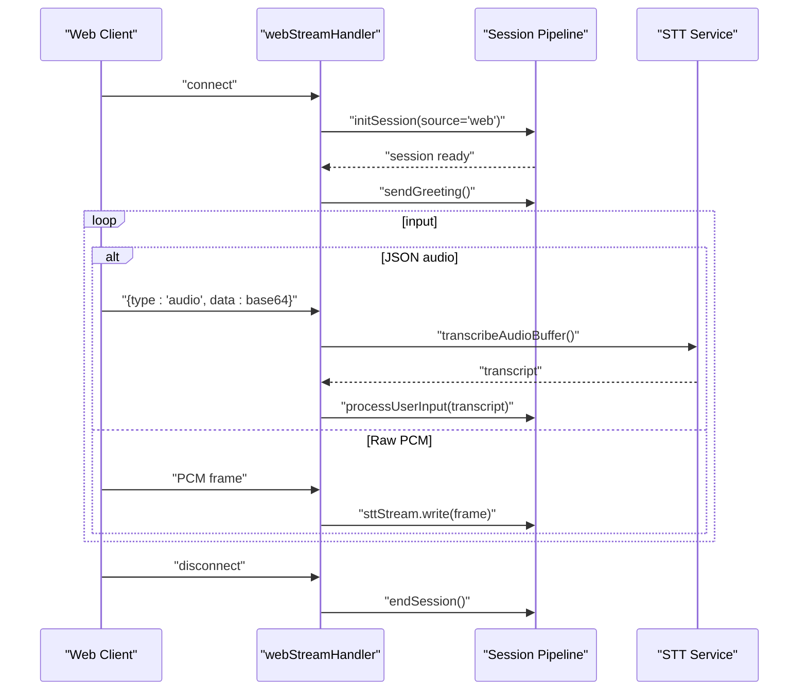
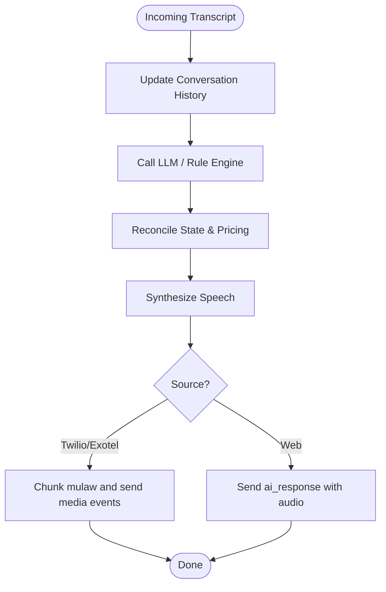
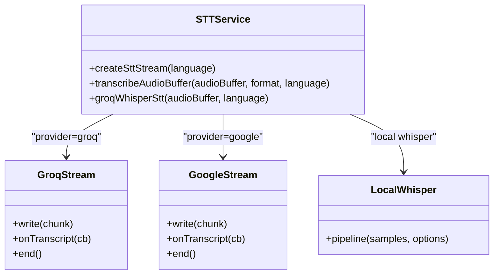
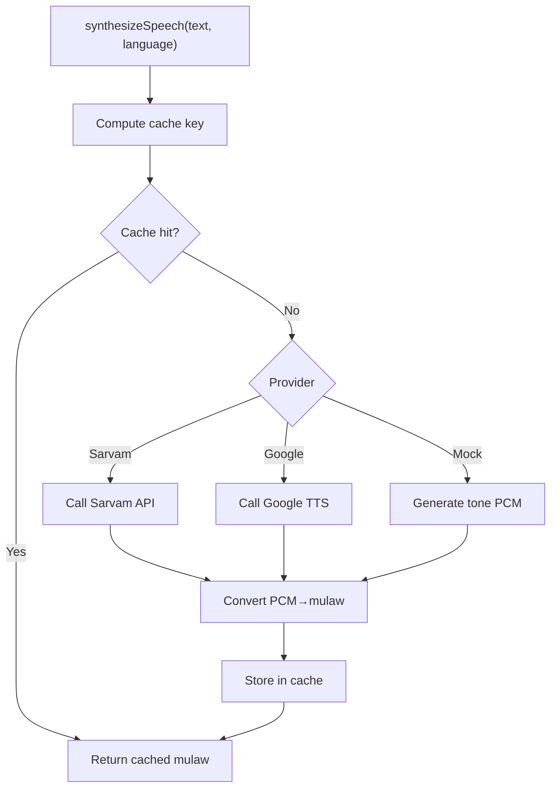
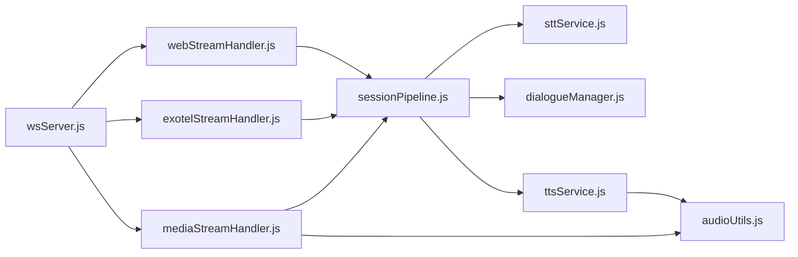

# Media Streaming & Voice Processing

<cite>
**Referenced Files in This Document**
- [mediaStreamHandler.js](file://server/src/websocket/mediaStreamHandler.js)
- [exotelStreamHandler.js](file://server/src/websocket/exotelStreamHandler.js)
- [webStreamHandler.js](file://server/src/websocket/webStreamHandler.js)
- [sessionPipeline.js](file://server/src/websocket/sessionPipeline.js)
- [sttService.js](file://server/src/services/sttService.js)
- [ttsService.js](file://server/src/services/ttsService.js)
- [audioUtils.js](file://server/src/utils/audioUtils.js)
- [dialogueManager.js](file://server/src/services/dialogueManager.js)
- [wsServer.js](file://server/src/websocket/wsServer.js)
- [telephony.controller.js](file://server/src/controllers/telephony.controller.js)
- [telephony.routes.js](file://server/src/routes/telephony.routes.js)
- [exotelService.js](file://server/src/services/exotelService.js)
- [env.js](file://server/src/config/env.js)
</cite>

## Table of Contents
1. [Introduction](#introduction)
2. [Project Structure](#project-structure)
3. [Core Components](#core-components)
4. [Architecture Overview](#architecture-overview)
5. [Detailed Component Analysis](#detailed-component-analysis)
6. [Dependency Analysis](#dependency-analysis)
7. [Performance Considerations](#performance-considerations)
8. [Troubleshooting Guide](#troubleshooting-guide)
9. [Conclusion](#conclusion)
10. [Appendices](#appendices)

## Introduction
This document explains the real-time media streaming and voice processing pipeline that powers Inkiro’s telephony integrations with Twilio and Exotel. It covers how inbound calls are streamed into the server, converted to text via speech-to-text (STT), processed by an AI dialogue engine, and synthesized back to audio via text-to-speech (TTS). It also details provider-specific handlers, audio format conversions, chunking strategies, latency optimization, bidirectional streaming, configuration options, and error recovery patterns.

## Project Structure
The media and voice pipeline is implemented on the server side under the websocket and services layers:
- Telephony webhooks route inbound calls to WebSocket endpoints for live media streaming.
- Provider-specific stream handlers normalize incoming media and forward it to a shared session pipeline.
- The session pipeline orchestrates STT, dialogue processing, TTS synthesis, and response delivery back to the caller or web client.
- Audio utilities handle codec conversions between telephony formats (mu-law) and engine-friendly formats (PCM16).

**Diagram sources**
- [wsServer.js:17-146](file://server/src/websocket/wsServer.js#L17-L146)
- [mediaStreamHandler.js:7-68](file://server/src/websocket/mediaStreamHandler.js#L7-L68)
- [exotelStreamHandler.js:9-79](file://server/src/websocket/exotelStreamHandler.js#L9-L79)
- [webStreamHandler.js:7-80](file://server/src/websocket/webStreamHandler.js#L7-L80)
- [sessionPipeline.js:24-111](file://server/src/websocket/sessionPipeline.js#L24-L111)
- [sttService.js:329-453](file://server/src/services/sttService.js#L329-L453)
- [ttsService.js:28-70](file://server/src/services/ttsService.js#L28-L70)
- [audioUtils.js:26-83](file://server/src/utils/audioUtils.js#L26-L83)

**Section sources**
- [wsServer.js:17-146](file://server/src/websocket/wsServer.js#L17-L146)
- [telephony.routes.js:8-22](file://server/src/routes/telephony.routes.js#L8-L22)
- [telephony.controller.js:15-41](file://server/src/controllers/telephony.controller.js#L15-L41)

## Core Components
- WebSocket coordinator authenticates and routes connections to provider-specific handlers.
- Media stream handlers parse provider events, convert audio formats, and push PCM chunks into the active session’s STT stream.
- Session pipeline initializes sessions, manages state, handles user turns, orchestrates STT/DIALOGUE/TTS, and streams responses back to providers or web clients.
- STT service supports multiple providers (Groq Whisper batch mode with VAD-like chunking, Google Cloud streaming, local Whisper, mock).
- TTS service synthesizes speech with caching and provider fallbacks, outputting mu-law for telephony playback.
- Audio utilities provide mu-law ↔ PCM16 conversion and resampling helpers.

**Section sources**
- [wsServer.js:17-146](file://server/src/websocket/wsServer.js#L17-L146)
- [mediaStreamHandler.js:7-68](file://server/src/websocket/mediaStreamHandler.js#L7-L68)
- [exotelStreamHandler.js:9-79](file://server/src/websocket/exotelStreamHandler.js#L9-L79)
- [sessionPipeline.js:24-111](file://server/src/websocket/sessionPipeline.js#L24-L111)
- [sttService.js:329-453](file://server/src/services/sttService.js#L329-L453)
- [ttsService.js:28-70](file://server/src/services/ttsService.js#L28-L70)
- [audioUtils.js:26-83](file://server/src/utils/audioUtils.js#L26-L83)

## Architecture Overview
End-to-end call flow from provider to AI and back:

**Diagram sources**
- [telephony.controller.js:15-41](file://server/src/controllers/telephony.controller.js#L15-L41)
- [wsServer.js:17-146](file://server/src/websocket/wsServer.js#L17-L146)
- [mediaStreamHandler.js:7-68](file://server/src/websocket/mediaStreamHandler.js#L7-L68)
- [exotelStreamHandler.js:9-79](file://server/src/websocket/exotelStreamHandler.js#L9-L79)
- [sessionPipeline.js:24-111](file://server/src/websocket/sessionPipeline.js#L24-L111)
- [sessionPipeline.js:132-219](file://server/src/websocket/sessionPipeline.js#L132-L219)
- [sessionPipeline.js:224-294](file://server/src/websocket/sessionPipeline.js#L224-L294)
- [sttService.js:329-453](file://server/src/services/sttService.js#L329-L453)
- [ttsService.js:28-70](file://server/src/services/ttsService.js#L28-L70)

## Detailed Component Analysis

### Telephony Webhook Routing and Stream Ticketing
- Exotel inbound webhook returns VoiceXML instructing Exotel to open a bidirectional WebSocket stream to the server endpoint with a one-time ticket.
- Twilio inbound webhook returns TwiML that connects the call to a media stream endpoint with a ticket.
- The WebSocket server validates tickets and upgrades the connection to the appropriate handler.

**Diagram sources**
- [telephony.controller.js:15-41](file://server/src/controllers/telephony.controller.js#L15-L41)
- [wsServer.js:99-116](file://server/src/websocket/wsServer.js#L99-L116)
- [wsServer.js:129-146](file://server/src/websocket/wsServer.js#L129-L146)

**Section sources**
- [telephony.routes.js:8-22](file://server/src/routes/telephony.routes.js#L8-L22)
- [telephony.controller.js:15-41](file://server/src/controllers/telephony.controller.js#L15-L41)
- [wsServer.js:99-146](file://server/src/websocket/wsServer.js#L99-L146)

### Twilio Media Stream Handler
- Parses connected/start/media/stop events.
- On start, initializes a session with source twilio and sends greeting.
- Converts base64 mu-law payload to PCM16 using audio utils and writes to the session’s STT stream.
- Buffers audio chunks up to a memory cap and ends session on stop/close.

**Diagram sources**
- [mediaStreamHandler.js:7-68](file://server/src/websocket/mediaStreamHandler.js#L7-L68)
- [audioUtils.js:26-33](file://server/src/utils/audioUtils.js#L26-L33)
- [sessionPipeline.js:24-111](file://server/src/websocket/sessionPipeline.js#L24-L111)

**Section sources**
- [mediaStreamHandler.js:7-68](file://server/src/websocket/mediaStreamHandler.js#L7-L68)
- [audioUtils.js:26-33](file://server/src/utils/audioUtils.js#L26-L33)

### Exotel AgentStream Handler
- Parses connected/start/media/stop events; normalizes stream/call IDs and caller info.
- Initializes session with source exotel and sends greeting.
- Writes raw base64 audio directly to the STT stream (expects PCM per Exotel config).
- Ends session on stop/close.

**Diagram sources**
- [exotelStreamHandler.js:9-79](file://server/src/websocket/exotelStreamHandler.js#L9-L79)
- [sessionPipeline.js:24-111](file://server/src/websocket/sessionPipeline.js#L24-L111)

**Section sources**
- [exotelStreamHandler.js:9-79](file://server/src/websocket/exotelStreamHandler.js#L9-L79)

### Web Stream Handler (Dashboard/Mobile)
- Creates a web session, sends greeting, and accepts either JSON messages with base64 audio or raw PCM frames.
- For JSON audio, transcribes via STT service and processes through dialogue pipeline.
- For raw PCM, forwards to STT stream for real-time transcription.

**Diagram sources**
- [webStreamHandler.js:7-80](file://server/src/websocket/webStreamHandler.js#L7-L80)
- [sttService.js:83-210](file://server/src/services/sttService.js#L83-L210)
- [sessionPipeline.js:132-219](file://server/src/websocket/sessionPipeline.js#L132-L219)

**Section sources**
- [webStreamHandler.js:7-80](file://server/src/websocket/webStreamHandler.js#L7-L80)

### Session Pipeline: STT → Dialogue → TTS
- Initializes session with tenant/restaurant context, creates STT stream, sets up transcript callbacks, persists call record, and broadcasts lifecycle events.
- Processes final transcripts by updating conversation history, invoking dialogue manager, recording latencies, and sending immediate TTS audio.
- Streams TTS audio back to providers in small chunks to minimize latency; for web clients, sends full audio payload.

**Diagram sources**
- [sessionPipeline.js:132-219](file://server/src/websocket/sessionPipeline.js#L132-L219)
- [sessionPipeline.js:224-294](file://server/src/websocket/sessionPipeline.js#L224-L294)

**Section sources**
- [sessionPipeline.js:24-111](file://server/src/websocket/sessionPipeline.js#L24-L111)
- [sessionPipeline.js:132-219](file://server/src/websocket/sessionPipeline.js#L132-L219)
- [sessionPipeline.js:224-294](file://server/src/websocket/sessionPipeline.js#L224-L294)

### STT Service: Multi-Provider Streaming
- Groq Whisper batch mode with VAD-like silence detection accumulates audio and triggers transcription when speech ends.
- Google Cloud STT streaming provides low-latency interim results.
- Local Whisper Tiny runs on-device CPU inference if configured.
- Mock STT simulates speech for development without credentials.

**Diagram sources**
- [sttService.js:329-453](file://server/src/services/sttService.js#L329-L453)
- [sttService.js:459-515](file://server/src/services/sttService.js#L459-L515)
- [sttService.js:18-43](file://server/src/services/sttService.js#L18-L43)

**Section sources**
- [sttService.js:83-210](file://server/src/services/sttService.js#L83-L210)
- [sttService.js:329-453](file://server/src/services/sttService.js#L329-L453)
- [sttService.js:459-515](file://server/src/services/sttService.js#L459-L515)

### TTS Service: Multi-Provider Synthesis and Caching
- Chooses provider based on environment variables, with Sarvam AI preferred for Indian accents, then Google Cloud, then mock.
- Caches synthesized audio by key to reduce repeated synthesis cost.
- Outputs mu-law audio suitable for telephony playback; converts PCM16 to mu-law for non-mu-law providers.

**Diagram sources**
- [ttsService.js:28-70](file://server/src/services/ttsService.js#L28-L70)
- [ttsService.js:75-120](file://server/src/services/ttsService.js#L75-L120)
- [ttsService.js:125-148](file://server/src/services/ttsService.js#L125-L148)
- [ttsService.js:154-179](file://server/src/services/ttsService.js#L154-L179)

**Section sources**
- [ttsService.js:28-70](file://server/src/services/ttsService.js#L28-L70)
- [ttsService.js:75-120](file://server/src/services/ttsService.js#L75-L120)
- [ttsService.js:125-148](file://server/src/services/ttsService.js#L125-L148)
- [ttsService.js:154-179](file://server/src/services/ttsService.js#L154-L179)

### Audio Utilities: Codec Conversion and Resampling
- Provides fast mu-law to PCM16 decoding using a precomputed table.
- Converts PCM16 buffers to mu-law for telephony playback.
- Includes simple resampling from 16kHz to 8kHz via decimation.

**Section sources**
- [audioUtils.js:26-83](file://server/src/utils/audioUtils.js#L26-L83)

## Dependency Analysis
Key dependencies and coupling:
- WebSocket server depends on telephony controllers and stream handlers; enforces authentication via tickets or tokens.
- Stream handlers depend on session pipeline for lifecycle management and on audio utilities for format conversion.
- Session pipeline depends on STT, dialogue manager, and TTS services; coordinates latency tracing and dashboard broadcasting.
- STT and TTS services encapsulate provider logic and can be switched via environment variables.

**Diagram sources**
- [wsServer.js:17-146](file://server/src/websocket/wsServer.js#L17-L146)
- [mediaStreamHandler.js:7-68](file://server/src/websocket/mediaStreamHandler.js#L7-L68)
- [exotelStreamHandler.js:9-79](file://server/src/websocket/exotelStreamHandler.js#L9-L79)
- [webStreamHandler.js:7-80](file://server/src/websocket/webStreamHandler.js#L7-L80)
- [sessionPipeline.js:24-111](file://server/src/websocket/sessionPipeline.js#L24-L111)
- [sttService.js:329-453](file://server/src/services/sttService.js#L329-L453)
- [ttsService.js:28-70](file://server/src/services/ttsService.js#L28-L70)
- [audioUtils.js:26-83](file://server/src/utils/audioUtils.js#L26-L83)

**Section sources**
- [wsServer.js:17-146](file://server/src/websocket/wsServer.js#L17-L146)
- [sessionPipeline.js:24-111](file://server/src/websocket/sessionPipeline.js#L24-L111)

## Performance Considerations
- Chunk size for telephony playback is set to a small fixed size to minimize latency and keep network packets manageable.
- STT uses VAD-like silence detection to batch audio efficiently for Groq Whisper, reducing API calls while maintaining responsiveness.
- TTS audio is cached in-memory to avoid redundant synthesis for repeated prompts.
- Memory cap limits accumulated audio bytes per session to prevent unbounded growth during long calls.
- Heartbeat liveness checks terminate stale WebSocket connections to free resources.

[No sources needed since this section provides general guidance]

## Troubleshooting Guide
Common issues and recovery strategies:
- Missing tenant/restaurant context: Session initialization enforces required context; ensure stream tickets carry correct metadata.
- STT provider errors: STT service falls back gracefully (e.g., from cloud to local or mock); check logs for provider-specific errors.
- TTS provider failures: TTS service falls back to next provider or mock; verify API keys and network connectivity.
- Network interruptions: WebSocket close events trigger session cleanup; ensure reconnection logic at client side and monitor dashboard events.
- High latency: Monitor turn traces and average latency metrics; consider switching STT provider or adjusting chunk sizes.

**Section sources**
- [sessionPipeline.js:24-30](file://server/src/websocket/sessionPipeline.js#L24-L30)
- [sttService.js:329-453](file://server/src/services/sttService.js#L329-L453)
- [ttsService.js:28-70](file://server/src/services/ttsService.js#L28-L70)
- [wsServer.js:149-158](file://server/src/websocket/wsServer.js#L149-L158)

## Conclusion
Inkiro’s media streaming and voice processing pipeline provides a robust, multi-provider architecture supporting Twilio and Exotel with real-time bidirectional audio streaming. The session pipeline integrates STT, AI dialogue, and TTS with careful attention to latency, memory usage, and error resilience. Configuration via environment variables enables flexible provider selection and tuning for audio quality and performance.

[No sources needed since this section summarizes without analyzing specific files]

## Appendices

### Configuration Options
- Telephony integration:
  - Exotel credentials and caller ID via environment variables used by Exotel service.
  - Twilio webhook endpoints configured via routes and controller logic.
- STT provider selection:
  - Environment variable selects provider; supports Groq Whisper, Google Cloud, local Whisper, and mock.
- TTS provider selection:
  - Environment variable selects provider; supports Sarvam AI, Google Cloud, and mock with in-memory caching.
- WebSocket server:
  - Max payload size configured to limit message size.
  - Public URL used to construct stream endpoints returned by telephony webhooks.

**Section sources**
- [exotelService.js:8-22](file://server/src/services/exotelService.js#L8-L22)
- [sttService.js:329-352](file://server/src/services/sttService.js#L329-L352)
- [ttsService.js:28-70](file://server/src/services/ttsService.js#L28-L70)
- [wsServer.js:18-21](file://server/src/websocket/wsServer.js#L18-L21)
- [env.js:3-24](file://server/src/config/env.js#L3-L24)

### Implementation Examples

#### Handling Audio Chunks
- Twilio: Convert base64 mu-law to PCM16 before writing to STT stream; accumulate chunks up to a memory cap.
- Exotel: Decode base64 PCM and write directly to STT stream; accumulate chunks up to a memory cap.
- Web: Accept JSON audio payloads or raw PCM frames; transcribe via STT service or forward to STT stream.

**Section sources**
- [mediaStreamHandler.js:40-49](file://server/src/websocket/mediaStreamHandler.js#L40-L49)
- [exotelStreamHandler.js:45-56](file://server/src/websocket/exotelStreamHandler.js#L45-L56)
- [webStreamHandler.js:23-70](file://server/src/websocket/webStreamHandler.js#L23-L70)

#### Managing Streaming State
- Initialize session with source, tenant, restaurant, and caller info; create STT stream and register transcript callback.
- Track conversation history, state transitions, and latencies; persist updates to database and ephemeral cache.
- Broadcast lifecycle events to dashboard for monitoring.

**Section sources**
- [sessionPipeline.js:24-111](file://server/src/websocket/sessionPipeline.js#L24-L111)
- [sessionPipeline.js:132-219](file://server/src/websocket/sessionPipeline.js#L132-L219)

#### Error Recovery During Network Interruptions
- WebSocket close events trigger session cleanup; STT stream is ended and recordings queued for persistence.
- Dashboard broadcasts call ended events with summary metrics.
- Ensure client-side reconnection and graceful degradation when audio cannot be sent.

**Section sources**
- [mediaStreamHandler.js:62-67](file://server/src/websocket/mediaStreamHandler.js#L62-L67)
- [exotelStreamHandler.js:73-78](file://server/src/websocket/exotelStreamHandler.js#L73-L78)
- [sessionPipeline.js:394-436](file://server/src/websocket/sessionPipeline.js#L394-L436)