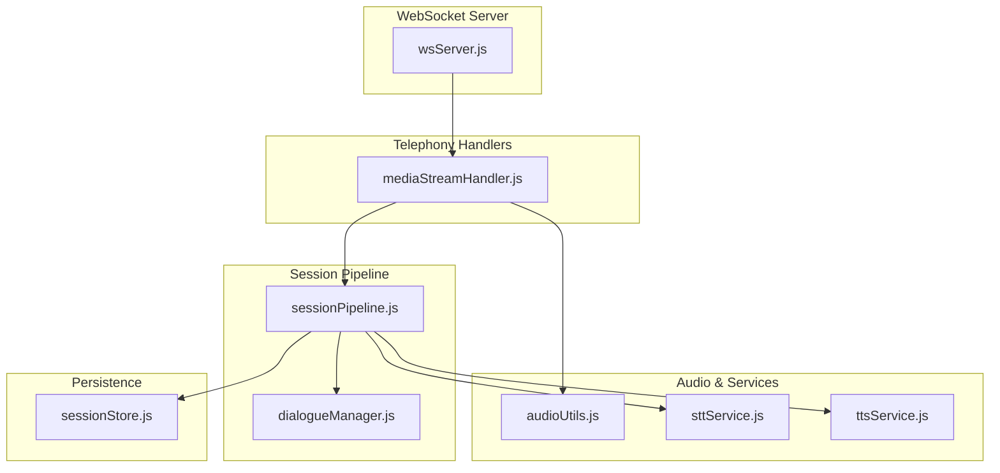
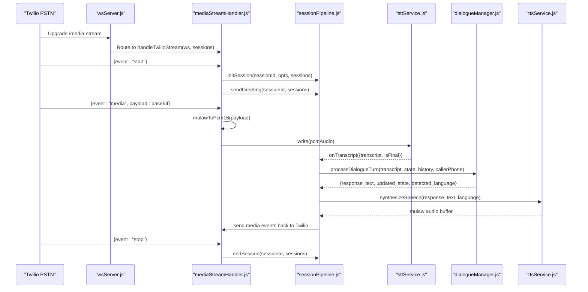
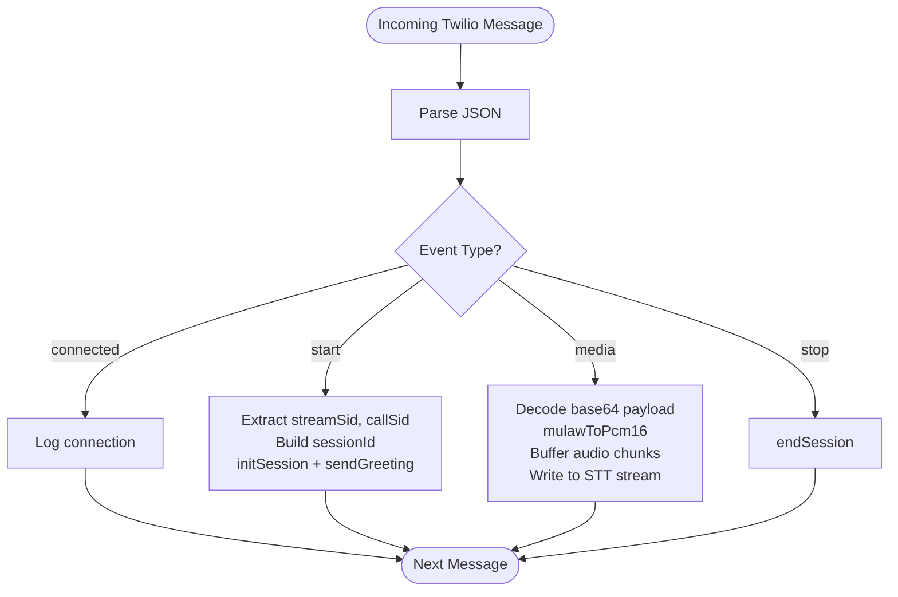
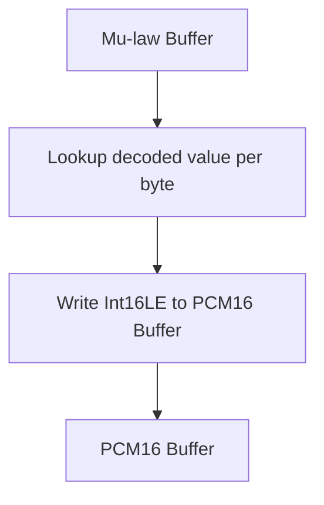
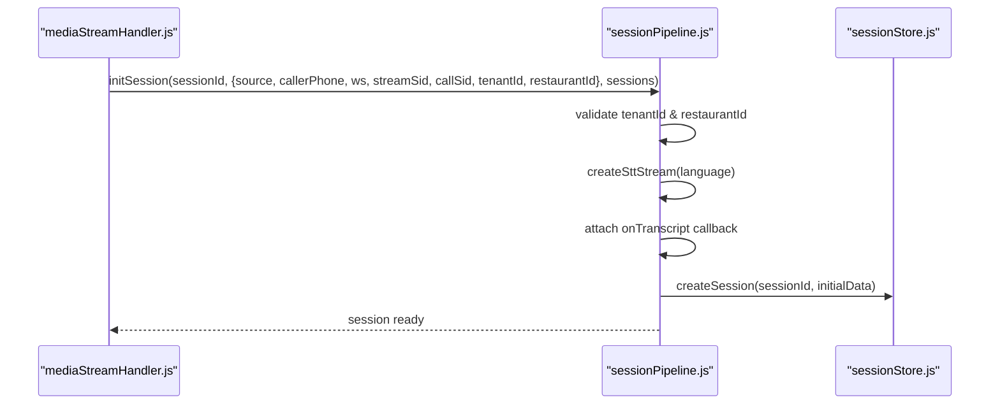
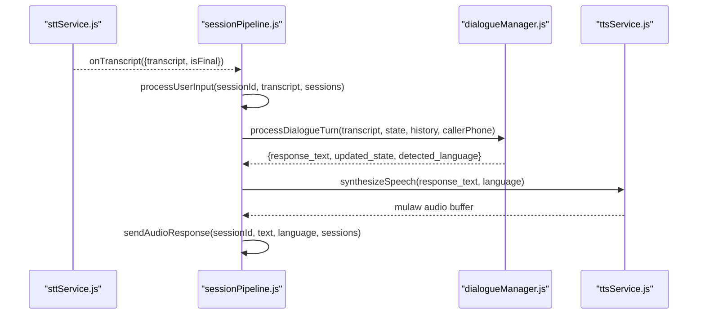
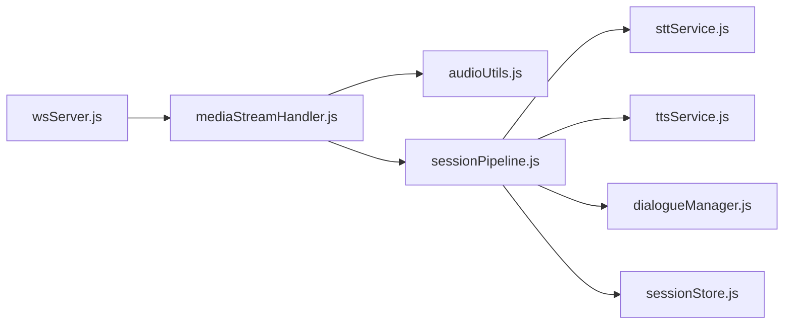

# Twilio Media Stream Handler

<cite>
**Referenced Files in This Document**
- [mediaStreamHandler.js](file://server/src/websocket/mediaStreamHandler.js)
- [audioUtils.js](file://server/src/utils/audioUtils.js)
- [sessionPipeline.js](file://server/src/websocket/sessionPipeline.js)
- [sttService.js](file://server/src/services/sttService.js)
- [ttsService.js](file://server/src/services/ttsService.js)
- [wsServer.js](file://server/src/websocket/wsServer.js)
- [dialogueManager.js](file://server/src/services/dialogueManager.js)
- [sessionStore.js](file://server/src/infra/sessionStore.js)
</cite>

## Table of Contents
1. [Introduction](#introduction)
2. [Project Structure](#project-structure)
3. [Core Components](#core-components)
4. [Architecture Overview](#architecture-overview)
5. [Detailed Component Analysis](#detailed-component-analysis)
6. [Dependency Analysis](#dependency-analysis)
7. [Performance Considerations](#performance-considerations)
8. [Troubleshooting Guide](#troubleshooting-guide)
9. [Conclusion](#conclusion)

## Introduction
This document explains the Twilio media stream handler implementation that processes incoming PSTN calls from Twilio over WebSocket connections. It covers how stream lifecycle events (connected, start, media, stop) are handled, audio format conversion from Mu-law to PCM16 using a utility function, session initialization with caller phone and tenant context, streaming state management, error recovery, and integration with the session pipeline for speech-to-text processing and response generation.

## Project Structure
The Twilio media stream handling is part of a broader real-time voice system:
- WebSocket server coordinates upgrades and routes telephony streams to dedicated handlers.
- The Twilio media stream handler manages event-driven processing of call audio and lifecycle.
- A session pipeline orchestrates STT, dialogue, TTS, order confirmation, and persistence.
- Audio utilities provide codec conversions and resampling helpers.
- Services implement STT and TTS with provider selection and fallbacks.
- Session store persists ephemeral voice session metadata.

**Diagram sources**
- [wsServer.js:17-146](file://server/src/websocket/wsServer.js#L17-L146)
- [mediaStreamHandler.js:7-68](file://server/src/websocket/mediaStreamHandler.js#L7-L68)
- [sessionPipeline.js:24-111](file://server/src/websocket/sessionPipeline.js#L24-L111)
- [audioUtils.js:26-33](file://server/src/utils/audioUtils.js#L26-L33)
- [sttService.js:329-352](file://server/src/services/sttService.js#L329-L352)
- [ttsService.js:28-70](file://server/src/services/ttsService.js#L28-L70)
- [sessionStore.js:13-29](file://server/src/infra/sessionStore.js#L13-L29)

**Section sources**
- [wsServer.js:17-146](file://server/src/websocket/wsServer.js#L17-L146)
- [mediaStreamHandler.js:7-68](file://server/src/websocket/mediaStreamHandler.js#L7-L68)

## Core Components
- Twilio Media Stream Handler: Routes Twilio WebSocket messages to appropriate lifecycle logic, converts audio, and integrates with the session pipeline.
- Audio Utilities: Provides Mu-law to PCM16 conversion and related helpers used by both STT and TTS flows.
- Session Pipeline: Initializes sessions, handles user input, orchestrates STT and TTS, updates state, persists data, and ends sessions.
- STT Service: Creates streaming transcription sessions with provider selection and fallbacks; emits transcripts back to the pipeline.
- TTS Service: Synthesizes text to telephony-compatible audio and returns mulaw buffers for playback.
- WebSocket Server: Authenticates and routes incoming WebSocket upgrades to the correct handler.
- Dialogue Manager: Processes conversational turns, maintains state, and produces responses.
- Session Store: Manages ephemeral voice session metadata with Redis-backed TTL.

**Section sources**
- [mediaStreamHandler.js:7-68](file://server/src/websocket/mediaStreamHandler.js#L7-L68)
- [audioUtils.js:26-33](file://server/src/utils/audioUtils.js#L26-L33)
- [sessionPipeline.js:24-111](file://server/src/websocket/sessionPipeline.js#L24-L111)
- [sttService.js:329-352](file://server/src/services/sttService.js#L329-L352)
- [ttsService.js:28-70](file://server/src/services/ttsService.js#L28-L70)
- [wsServer.js:17-146](file://server/src/websocket/wsServer.js#L17-L146)
- [dialogueManager.js:36-84](file://server/src/services/dialogueManager.js#L36-L84)
- [sessionStore.js:13-29](file://server/src/infra/sessionStore.js#L13-L29)

## Architecture Overview
The end-to-end flow for a Twilio PSTN call:
1. Twilio connects to /media-stream via WebSocket after authentication.
2. On 'start', the handler initializes a session with caller phone and tenant context.
3. Audio chunks arrive as 'media' events, converted from Mu-law to PCM16, then streamed to STT.
4. STT emits final transcripts which trigger dialogue processing and TTS.
5. TTS generates mulaw audio sent back to Twilio as 'media' events.
6. On 'stop' or connection close, the session is ended and resources cleaned up.

**Diagram sources**
- [wsServer.js:17-146](file://server/src/websocket/wsServer.js#L17-L146)
- [mediaStreamHandler.js:12-68](file://server/src/websocket/mediaStreamHandler.js#L12-L68)
- [sessionPipeline.js:24-111](file://server/src/websocket/sessionPipeline.js#L24-L111)
- [sessionPipeline.js:132-219](file://server/src/websocket/sessionPipeline.js#L132-L219)
- [sessionPipeline.js:224-294](file://server/src/websocket/sessionPipeline.js#L224-L294)
- [sttService.js:329-352](file://server/src/services/sttService.js#L329-L352)
- [ttsService.js:28-70](file://server/src/services/ttsService.js#L28-L70)

## Detailed Component Analysis

### Twilio Media Stream Handler
Responsibilities:
- Manage WebSocket message routing for Twilio events: connected, start, media, stop.
- Extract stream identifiers and call metadata during 'start'.
- Initialize session with caller phone and tenant context.
- Convert incoming Mu-law audio to PCM16 and forward to STT.
- Buffer audio chunks for recording and cleanup.
- End session on 'stop' or connection close.

Key behaviors:
- Session ID derived from callSid ensures uniqueness per call.
- Tenant and restaurant context sourced from stream metadata with safe defaults.
- Audio chunk buffering limited to prevent unbounded memory growth.
- Error handling logs message parsing errors without crashing the stream.

**Diagram sources**
- [mediaStreamHandler.js:12-68](file://server/src/websocket/mediaStreamHandler.js#L12-L68)

**Section sources**
- [mediaStreamHandler.js:7-68](file://server/src/websocket/mediaStreamHandler.js#L7-L68)

### Audio Format Conversion (Mu-law to PCM16)
Purpose:
- Telephony providers like Twilio send 8kHz 8-bit Mu-law audio.
- STT engines prefer 16kHz or 8kHz 16-bit linear PCM.
- The utility provides fast decoding using a precomputed table.

Implementation highlights:
- Precomputes a lookup table for Mu-law decoding to minimize CPU overhead.
- Converts each byte to a 16-bit PCM sample stored in little-endian order.
- Additional helpers support PCM16 to Mu-law conversion and resampling.

**Diagram sources**
- [audioUtils.js:8-33](file://server/src/utils/audioUtils.js#L8-L33)

**Section sources**
- [audioUtils.js:26-33](file://server/src/utils/audioUtils.js#L26-L33)

### Session Initialization and Context Setup
Process:
- Validate tenant and restaurant context; fail closed if missing.
- Create initial dialogue state based on caller phone.
- Instantiate STT stream with language configuration.
- Attach callbacks to emit transcripts to dashboard and web clients.
- Persist session to in-memory map and Redis ephemeral store.
- Record call metadata in database and update customer profile.

Error handling:
- Throws explicit AppError when required context is absent.
- Gracefully handles DB errors while continuing session setup.

**Diagram sources**
- [sessionPipeline.js:24-111](file://server/src/websocket/sessionPipeline.js#L24-L111)
- [sessionStore.js:13-29](file://server/src/infra/sessionStore.js#L13-L29)

**Section sources**
- [sessionPipeline.js:24-111](file://server/src/websocket/sessionPipeline.js#L24-L111)
- [sessionStore.js:13-29](file://server/src/infra/sessionStore.js#L13-L29)

### Handling Audio Chunks and Streaming State
Behavior:
- Each 'media' event contains a base64-encoded Mu-law payload.
- Decode to PCM16 and push into session.audioChunks with a cap to limit memory usage.
- Write PCM16 audio to STT stream for live transcription.
- Maintain session-level streaming state (isProcessing flag) to avoid concurrent processing.

State management:
- isProcessing prevents overlapping dialogue turns.
- Audio chunks are aggregated until session end for recording.

**Section sources**
- [mediaStreamHandler.js:40-49](file://server/src/websocket/mediaStreamHandler.js#L40-L49)
- [sessionPipeline.js:132-138](file://server/src/websocket/sessionPipeline.js#L132-L138)

### Integration with Session Pipeline for STT and TTS
Flow:
- STT stream emits final transcripts to processUserInput.
- Dialogue manager computes response and updated state.
- TTS synthesizes response into mulaw audio.
- For telephony sources, audio is chunked and sent back to Twilio as 'media' events.

Latency tracking:
- Turn traces record stages such as LLM and TTS latency.
- Dashboard broadcasts metrics for observability.

**Diagram sources**
- [sessionPipeline.js:54-73](file://server/src/websocket/sessionPipeline.js#L54-L73)
- [sessionPipeline.js:132-219](file://server/src/websocket/sessionPipeline.js#L132-L219)
- [sessionPipeline.js:224-294](file://server/src/websocket/sessionPipeline.js#L224-L294)
- [sttService.js:329-352](file://server/src/services/sttService.js#L329-L352)
- [ttsService.js:28-70](file://server/src/services/ttsService.js#L28-L70)

**Section sources**
- [sessionPipeline.js:54-73](file://server/src/websocket/sessionPipeline.js#L54-L73)
- [sessionPipeline.js:132-219](file://server/src/websocket/sessionPipeline.js#L132-L219)
- [sessionPipeline.js:224-294](file://server/src/websocket/sessionPipeline.js#L224-L294)

### Error Recovery and Cleanup
- Message parsing errors are caught and logged without disrupting the stream.
- Connection close triggers session end to release resources and persist recordings.
- STT stream is ended and audio chunks are offloaded to a worker queue for recording.
- Ephemeral session data is deleted from Redis.

**Section sources**
- [mediaStreamHandler.js:57-68](file://server/src/websocket/mediaStreamHandler.js#L57-L68)
- [sessionPipeline.js:394-436](file://server/src/websocket/sessionPipeline.js#L394-L436)

## Dependency Analysis
Key dependencies and relationships:
- WebSocket server routes to media stream handler.
- Media stream handler depends on audio utilities and session pipeline.
- Session pipeline depends on STT service, TTS service, dialogue manager, and session store.
- STT service supports multiple providers with fallbacks.
- TTS service uses audio utilities to produce mulaw output.

**Diagram sources**
- [wsServer.js:17-146](file://server/src/websocket/wsServer.js#L17-L146)
- [mediaStreamHandler.js:7-68](file://server/src/websocket/mediaStreamHandler.js#L7-L68)
- [sessionPipeline.js:24-111](file://server/src/websocket/sessionPipeline.js#L24-L111)
- [sttService.js:329-352](file://server/src/services/sttService.js#L329-L352)
- [ttsService.js:28-70](file://server/src/services/ttsService.js#L28-L70)
- [dialogueManager.js:36-84](file://server/src/services/dialogueManager.js#L36-L84)
- [sessionStore.js:13-29](file://server/src/infra/sessionStore.js#L13-L29)

**Section sources**
- [wsServer.js:17-146](file://server/src/websocket/wsServer.js#L17-L146)
- [mediaStreamHandler.js:7-68](file://server/src/websocket/mediaStreamHandler.js#L7-L68)
- [sessionPipeline.js:24-111](file://server/src/websocket/sessionPipeline.js#L24-L111)

## Performance Considerations
- Audio chunk buffering is capped to prevent memory growth during long calls.
- STT provider selection allows efficient local or cloud transcription with fallbacks.
- TTS caching reduces repeated synthesis for static prompts.
- Heartbeat liveness checks terminate stale WebSocket connections.
- Recording offloading to workers avoids blocking the main thread.

[No sources needed since this section provides general guidance]

## Troubleshooting Guide
Common issues and resolutions:
- Missing tenant or restaurant context: Ensure stream tickets include tenantId and restaurantId; otherwise session initialization fails closed.
- STT failures: Check provider configuration and credentials; fallback to mock or alternative provider.
- TTS failures: Verify provider keys; fallback to mock TTS generates placeholder audio.
- High memory usage: Monitor audioChunks size and ensure session end is called on disconnect.
- WebSocket drops: Use heartbeat mechanism to detect and clean up dead connections.

**Section sources**
- [sessionPipeline.js:24-30](file://server/src/websocket/sessionPipeline.js#L24-L30)
- [sttService.js:329-352](file://server/src/services/sttService.js#L329-L352)
- [ttsService.js:28-70](file://server/src/services/ttsService.js#L28-L70)
- [mediaStreamHandler.js:57-68](file://server/src/websocket/mediaStreamHandler.js#L57-L68)
- [wsServer.js:149-158](file://server/src/websocket/wsServer.js#L149-L158)

## Conclusion
The Twilio media stream handler provides a robust foundation for processing PSTN calls through WebSocket connections. It manages stream lifecycle events, performs efficient audio format conversion, initializes sessions with proper tenant context, and integrates seamlessly with the session pipeline for speech-to-text and text-to-speech workflows. With built-in error handling, performance safeguards, and observability features, it supports reliable real-time voice interactions for telephony use cases.

[No sources needed since this section summarizes without analyzing specific files]