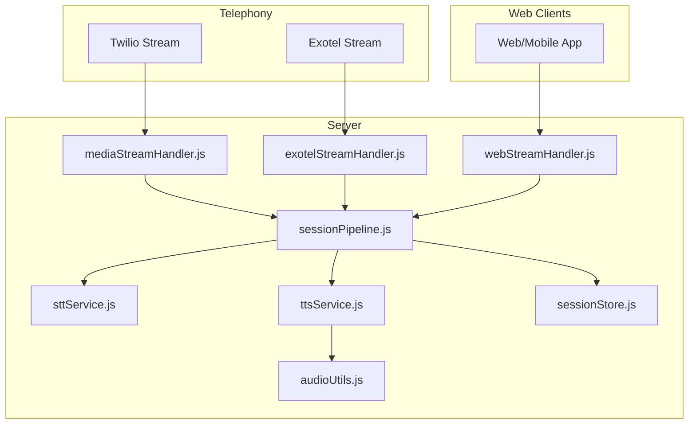
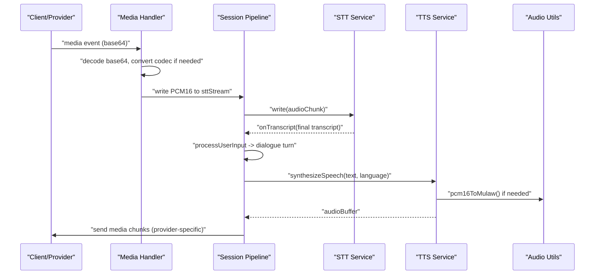
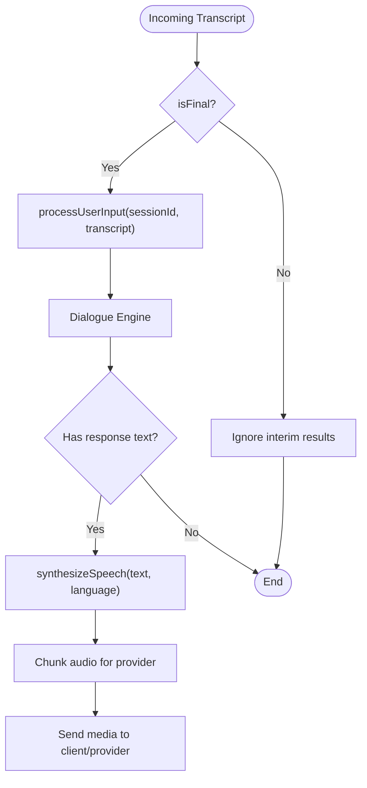
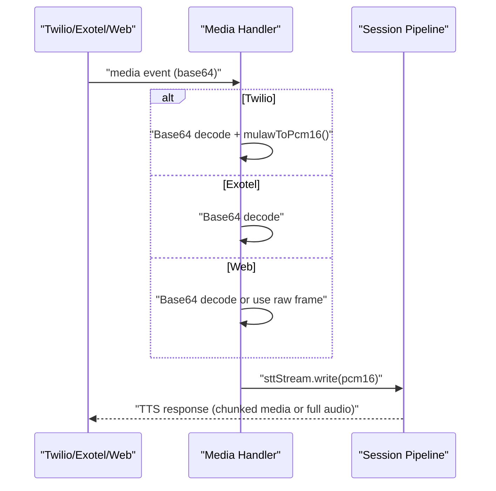
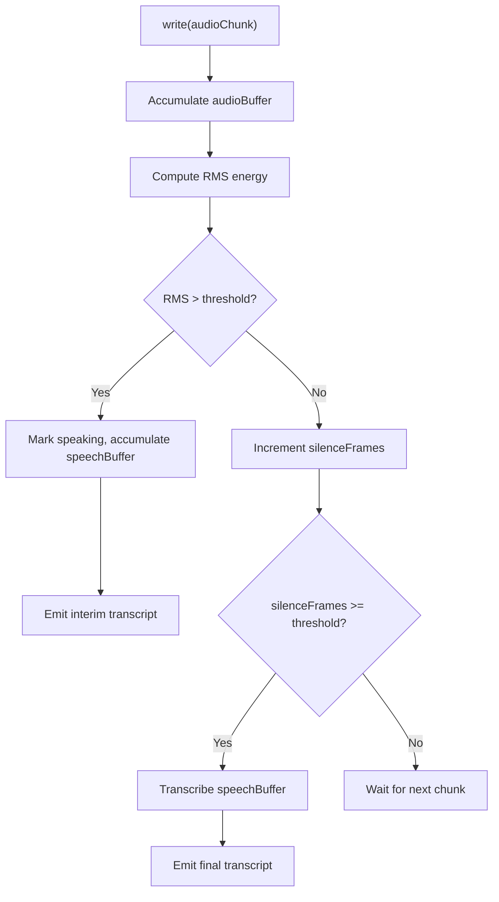
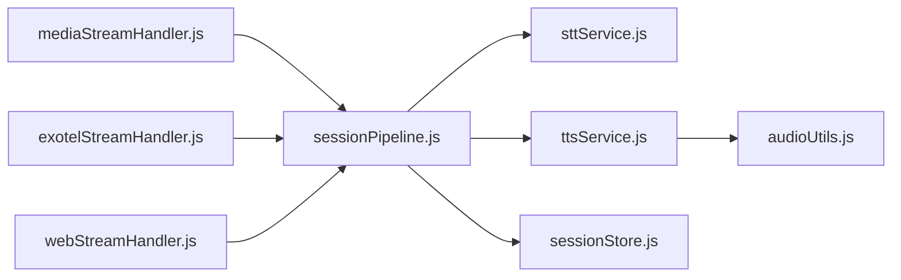

# Audio Streaming & Buffering

<cite>
**Referenced Files in This Document**
- [sessionPipeline.js](file://server/src/websocket/sessionPipeline.js)
- [mediaStreamHandler.js](file://server/src/websocket/mediaStreamHandler.js)
- [exotelStreamHandler.js](file://server/src/websocket/exotelStreamHandler.js)
- [webStreamHandler.js](file://server/src/websocket/webStreamHandler.js)
- [sttService.js](file://server/src/services/sttService.js)
- [ttsService.js](file://server/src/services/ttsService.js)
- [audioUtils.js](file://server/src/utils/audioUtils.js)
- [exotelService.js](file://server/src/services/exotelService.js)
- [sessionStore.js](file://server/src/infra/sessionStore.js)
</cite>

## Table of Contents
1. [Introduction](#introduction)
2. [Project Structure](#project-structure)
3. [Core Components](#core-components)
4. [Architecture Overview](#architecture-overview)
5. [Detailed Component Analysis](#detailed-component-analysis)
6. [Dependency Analysis](#dependency-analysis)
7. [Performance Considerations](#performance-considerations)
8. [Troubleshooting Guide](#troubleshooting-guide)
9. [Conclusion](#conclusion)
10. [Appendices](#appendices)

## Introduction
This document explains the audio streaming and buffering system within the voice session pipeline. It covers how incoming audio chunks are received, buffered, and processed with memory constraints (a 2MB cap per call), and details the bidirectional flow:
- Incoming speech-to-text streaming from telephony providers (Twilio, Exotel) and web clients
- Outgoing text-to-speech synthesis streamed back to callers or web clients

It also documents chunking strategies for different providers, base64 encoding and payload formatting, performance optimizations for audio processing and buffer management, error handling for network interruptions and streaming failures, and examples for configuration and debugging.

## Project Structure
The audio streaming system is implemented across WebSocket handlers, a central session pipeline, STT/TTS services, and utility modules for audio format conversion. The key files involved are:
- WebSocket handlers for Twilio, Exotel, and Web clients
- A session pipeline that orchestrates STT, dialogue processing, and TTS
- STT service supporting multiple providers and streaming modes
- TTS service with provider selection and caching
- Audio utilities for codec conversions and resampling
- Session store for ephemeral state persistence

**Diagram sources**
- [mediaStreamHandler.js:1-69](file://server/src/websocket/mediaStreamHandler.js#L1-L69)
- [exotelStreamHandler.js:1-80](file://server/src/websocket/exotelStreamHandler.js#L1-L80)
- [webStreamHandler.js:1-81](file://server/src/websocket/webStreamHandler.js#L1-L81)
- [sessionPipeline.js:1-437](file://server/src/websocket/sessionPipeline.js#L1-L437)
- [sttService.js:1-603](file://server/src/services/sttService.js#L1-L603)
- [ttsService.js:1-187](file://server/src/services/ttsService.js#L1-L187)
- [audioUtils.js:1-84](file://server/src/utils/audioUtils.js#L1-L84)
- [sessionStore.js:1-92](file://server/src/infra/sessionStore.js#L1-L92)

**Section sources**
- [mediaStreamHandler.js:1-69](file://server/src/websocket/mediaStreamHandler.js#L1-L69)
- [exotelStreamHandler.js:1-80](file://server/src/websocket/exotelStreamHandler.js#L1-L80)
- [webStreamHandler.js:1-81](file://server/src/websocket/webStreamHandler.js#L1-L81)
- [sessionPipeline.js:1-437](file://server/src/websocket/sessionPipeline.js#L1-L437)

## Core Components
- Session Pipeline: Initializes sessions, manages STT streams, processes user input, synthesizes responses, and handles order confirmation and session teardown.
- Media Handlers: Parse provider-specific media events, convert codecs as needed, and forward audio to STT while recording chunks for later persistence.
- STT Service: Provides streaming transcription via Groq Whisper (batch mode with VAD-like chunking), Google Cloud STT, or mock fallback; supports local Whisper Tiny for offline scenarios.
- TTS Service: Synthesizes speech using Sarvam AI, Google Cloud TTS, or mock generator; caches repeated prompts to reduce latency and bandwidth.
- Audio Utilities: Convert between mu-law and PCM16, resample sample rates, and support telephony requirements.
- Session Store: Ephemeral Redis-backed storage for active sessions with TTL-based expiration.

Key behaviors:
- Incoming audio is converted to PCM16 where necessary and written into an STT stream.
- Final transcripts trigger dialogue processing and immediate TTS response.
- Responses are chunked and sent back to the appropriate provider/client with correct encoding.
- Memory constraints are enforced by limiting recorded audio chunks and combining them at session end.

**Section sources**
- [sessionPipeline.js:18-111](file://server/src/websocket/sessionPipeline.js#L18-L111)
- [mediaStreamHandler.js:40-49](file://server/src/websocket/mediaStreamHandler.js#L40-L49)
- [exotelStreamHandler.js:45-57](file://server/src/websocket/exotelStreamHandler.js#L45-L57)
- [webStreamHandler.js:28-55](file://server/src/websocket/webStreamHandler.js#L28-L55)
- [sttService.js:329-454](file://server/src/services/sttService.js#L329-L454)
- [ttsService.js:28-70](file://server/src/services/ttsService.js#L28-L70)
- [audioUtils.js:21-83](file://server/src/utils/audioUtils.js#L21-L83)
- [sessionStore.js:13-55](file://server/src/infra/sessionStore.js#L13-L55)

## Architecture Overview
The system implements a bidirectional audio pipeline:
- Inbound: Telephony/Web clients send audio chunks via WebSocket. Handlers parse events, convert formats, and write to STT stream.
- Processing: STT stream detects speech boundaries and emits final transcripts. These are processed through the dialogue engine to generate assistant responses.
- Outbound: TTS synthesizes audio, which is then chunked and encoded appropriately for each provider/client and streamed back.

**Diagram sources**
- [mediaStreamHandler.js:40-49](file://server/src/websocket/mediaStreamHandler.js#L40-L49)
- [exotelStreamHandler.js:45-57](file://server/src/websocket/exotelStreamHandler.js#L45-L57)
- [webStreamHandler.js:28-55](file://server/src/websocket/webStreamHandler.js#L28-L55)
- [sessionPipeline.js:54-73](file://server/src/websocket/sessionPipeline.js#L54-L73)
- [sessionPipeline.js:132-198](file://server/src/websocket/sessionPipeline.js#L132-L198)
- [sessionPipeline.js:224-294](file://server/src/websocket/sessionPipeline.js#L224-L294)
- [sttService.js:329-454](file://server/src/services/sttService.js#L329-L454)
- [ttsService.js:28-70](file://server/src/services/ttsService.js#L28-L70)
- [audioUtils.js:64-71](file://server/src/utils/audioUtils.js#L64-L71)

## Detailed Component Analysis

### Session Pipeline
Responsibilities:
- Initialize sessions with tenant/restaurant context and STT stream
- Handle incoming transcripts and route to dialogue processing
- Synthesize and stream audio responses to providers/clients
- Manage order confirmation and session teardown

Memory constraints:
- A 2MB memory cap per active call is defined to bound in-memory buffers.
- Recorded audio chunks are limited to a maximum count to prevent unbounded growth.
- At session end, recorded chunks are combined and offloaded asynchronously for persistence.

**Diagram sources**
- [sessionPipeline.js:54-73](file://server/src/websocket/sessionPipeline.js#L54-L73)
- [sessionPipeline.js:132-198](file://server/src/websocket/sessionPipeline.js#L132-L198)
- [sessionPipeline.js:224-294](file://server/src/websocket/sessionPipeline.js#L224-L294)

**Section sources**
- [sessionPipeline.js:18-111](file://server/src/websocket/sessionPipeline.js#L18-L111)
- [sessionPipeline.js:132-198](file://server/src/websocket/sessionPipeline.js#L132-L198)
- [sessionPipeline.js:224-294](file://server/src/websocket/sessionPipeline.js#L224-L294)
- [sessionPipeline.js:394-437](file://server/src/websocket/sessionPipeline.js#L394-L437)

### Media Handlers (Twilio, Exotel, Web)
- Twilio: Parses media events, decodes base64, converts mu-law to PCM16, writes to STT stream, and records chunks up to a limit.
- Exotel: Similar flow but expects PCM format; decodes base64 directly and writes to STT stream.
- Web: Supports both raw binary frames and JSON payloads; can transcribe recorded audio buffers and process text inputs.

Chunking strategy:
- For telephony providers, outgoing TTS audio is split into small chunks (e.g., 640 bytes) and base64-encoded before sending.
- For web clients, full audio buffers are base64-encoded and sent as part of the response message.

**Diagram sources**
- [mediaStreamHandler.js:40-49](file://server/src/websocket/mediaStreamHandler.js#L40-L49)
- [exotelStreamHandler.js:45-57](file://server/src/websocket/exotelStreamHandler.js#L45-L57)
- [webStreamHandler.js:28-55](file://server/src/websocket/webStreamHandler.js#L28-L55)
- [sessionPipeline.js:246-281](file://server/src/websocket/sessionPipeline.js#L246-L281)

**Section sources**
- [mediaStreamHandler.js:1-69](file://server/src/websocket/mediaStreamHandler.js#L1-L69)
- [exotelStreamHandler.js:1-80](file://server/src/websocket/exotelStreamHandler.js#L1-L80)
- [webStreamHandler.js:1-81](file://server/src/websocket/webStreamHandler.js#L1-L81)

### STT Service
Providers and modes:
- Groq Whisper Large v3 Turbo: Batch mode with VAD-like chunking; accumulates audio until silence is detected, then transcribes.
- Google Cloud STT: Real-time streaming recognition with interim results.
- Local Whisper Tiny: Offline inference for development or constrained environments.
- Mock STT: Simulated transcription for development without credentials.

Streaming behavior:
- Writes audio chunks into an internal buffer.
- Detects speech boundaries using RMS energy thresholds.
- Emits interim and final transcripts to registered callbacks.

**Diagram sources**
- [sttService.js:358-454](file://server/src/services/sttService.js#L358-L454)
- [sttService.js:521-603](file://server/src/services/sttService.js#L521-L603)

**Section sources**
- [sttService.js:1-603](file://server/src/services/sttService.js#L1-L603)

### TTS Service
Providers and caching:
- Sarvam AI Bulbul: High-quality Indian accents; returns mulaw audio.
- Google Cloud TTS: WaveNet voices; returns mulaw audio.
- Mock TTS: Generates synthetic tones for development.

Caching:
- Repeated prompts are cached in-memory to reduce latency and API calls.
- Cache uses a key derived from provider, language, and trimmed text.

Output encoding:
- Telephony responses are mulaw-encoded PCM16 for compatibility with telephony networks.
- Web responses may be base64-encoded PCM16 depending on client expectations.

**Section sources**
- [ttsService.js:1-187](file://server/src/services/ttsService.js#L1-L187)

### Audio Utilities
Functions:
- mulawToPcm16: Converts 8kHz mu-law to PCM16 for STT engines.
- pcm16ToMulaw: Converts PCM16 to mu-law for telephony playback.
- resample16kTo8k: Downsamples 16kHz PCM16 to 8kHz by decimation.

These utilities ensure compatibility between telephony providers (mu-law) and STT engines (PCM16).

**Section sources**
- [audioUtils.js:1-84](file://server/src/utils/audioUtils.js#L1-L84)

### Exotel Integration
- Generates VoiceXML for bidirectional streaming with PCM format at 8kHz.
- Supports outbound call triggering and webhook parsing.

**Section sources**
- [exotelService.js:1-90](file://server/src/services/exotelService.js#L1-L90)

### Session Store
- Ephemeral Redis-backed storage for active sessions with TTL expiration.
- Supports create, get, update, delete, touch, and list operations filtered by tenant and restaurant.

**Section sources**
- [sessionStore.js:1-92](file://server/src/infra/sessionStore.js#L1-L92)

## Dependency Analysis
The components interact as follows:
- Media handlers depend on session pipeline for session lifecycle and STT/TTS orchestration.
- Session pipeline depends on STT and TTS services for transcription and synthesis.
- TTS service depends on audio utilities for codec conversion.
- All components rely on session store for ephemeral state management.

**Diagram sources**
- [mediaStreamHandler.js:1-69](file://server/src/websocket/mediaStreamHandler.js#L1-L69)
- [exotelStreamHandler.js:1-80](file://server/src/websocket/exotelStreamHandler.js#L1-L80)
- [webStreamHandler.js:1-81](file://server/src/websocket/webStreamHandler.js#L1-L81)
- [sessionPipeline.js:1-437](file://server/src/websocket/sessionPipeline.js#L1-L437)
- [sttService.js:1-603](file://server/src/services/sttService.js#L1-L603)
- [ttsService.js:1-187](file://server/src/services/ttsService.js#L1-L187)
- [audioUtils.js:1-84](file://server/src/utils/audioUtils.js#L1-L84)
- [sessionStore.js:1-92](file://server/src/infra/sessionStore.js#L1-L92)

**Section sources**
- [sessionPipeline.js:1-437](file://server/src/websocket/sessionPipeline.js#L1-L437)

## Performance Considerations
- Chunk size optimization:
  - Telephony responses are chunked into small segments (e.g., 640 bytes) to minimize latency and improve real-time playback.
  - STT streaming uses VAD-like chunking to detect speech boundaries efficiently.
- Buffer management:
  - Incoming audio chunks are recorded up to a fixed count to prevent unbounded memory growth.
  - A 2MB memory cap per active call bounds in-memory buffers.
- Codec conversion efficiency:
  - Precomputed lookup tables accelerate mu-law decoding.
  - Direct buffer operations minimize overhead during PCM/mu-law conversions.
- Caching:
  - TTS audio cache reduces repeated synthesis for static prompts.
  - STT hints loaded from catalog improve transcription accuracy and reduce retries.
- Asynchronous offloading:
  - Order confirmation, notifications, and audio persistence are offloaded to worker queues to keep the main pipeline responsive.

[No sources needed since this section provides general guidance]

## Troubleshooting Guide
Common issues and resolutions:
- Network interruptions:
  - WebSocket close events trigger session teardown; ensure cleanup of STT streams and recording queues.
  - Implement retry logic for transient errors in STT/TTS calls.
- Audio quality issues:
  - Verify correct codec conversion (mu-law to PCM16 for STT, PCM16 to mu-law for telephony).
  - Adjust RMS thresholds in STT service to better detect speech boundaries.
- Streaming failures:
  - Monitor logs for STT/TTS provider errors and fall back to alternative providers when configured.
  - Ensure base64 encoding/decoding matches provider expectations.
- Debugging approaches:
  - Use dashboard broadcasts to monitor transcripts, TTS completion, and latency metrics.
  - Inspect session state and recorded audio chunks during teardown for anomalies.

**Section sources**
- [mediaStreamHandler.js:57-67](file://server/src/websocket/mediaStreamHandler.js#L57-L67)
- [exotelStreamHandler.js:68-78](file://server/src/websocket/exotelStreamHandler.js#L68-L78)
- [webStreamHandler.js:71-79](file://server/src/websocket/webStreamHandler.js#L71-L79)
- [sessionPipeline.js:282-294](file://server/src/websocket/sessionPipeline.js#L282-L294)
- [sttService.js:494-496](file://server/src/services/sttService.js#L494-L496)
- [ttsService.js:102-105](file://server/src/services/ttsService.js#L102-L105)

## Conclusion
The audio streaming and buffering system provides a robust, provider-agnostic pipeline for real-time voice interactions. It balances low-latency streaming with memory constraints, supports multiple STT/TTS providers, and includes comprehensive error handling and performance optimizations. By following the documented chunking strategies and configuration options, teams can deploy reliable voice experiences across telephony and web platforms.

[No sources needed since this section summarizes without analyzing specific files]

## Appendices

### Audio Stream Configuration Examples
- STT provider selection:
  - Set environment variable to choose provider (e.g., groq, google, mock).
  - Configure API keys for external providers (e.g., GROQ_API_KEY).
- TTS provider selection:
  - Set environment variable to choose provider (e.g., sarvam, google, mock).
  - Configure API keys for external providers (e.g., SARVAM_API_KEY).
- Exotel integration:
  - Generate VoiceXML with bidirectional streaming URL and PCM format at 8kHz.
  - Trigger outbound calls with custom URLs for live streaming.

**Section sources**
- [sttService.js:329-352](file://server/src/services/sttService.js#L329-L352)
- [ttsService.js:28-70](file://server/src/services/ttsService.js#L28-L70)
- [exotelService.js:17-33](file://server/src/services/exotelService.js#L17-L33)

### Debugging Approaches
- Monitor dashboard broadcasts for transcripts, TTS completion, and latency metrics.
- Log STT/TTS provider responses and errors for troubleshooting.
- Inspect session state and recorded audio chunks during teardown to identify issues.

**Section sources**
- [sessionPipeline.js:54-73](file://server/src/websocket/sessionPipeline.js#L54-L73)
- [sessionPipeline.js:236-244](file://server/src/websocket/sessionPipeline.js#L236-L244)
- [sessionPipeline.js:419-431](file://server/src/websocket/sessionPipeline.js#L419-L431)