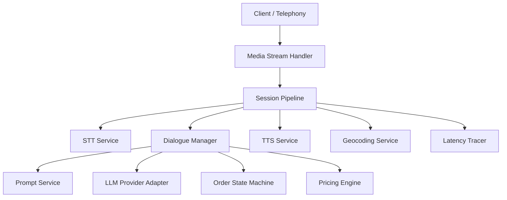
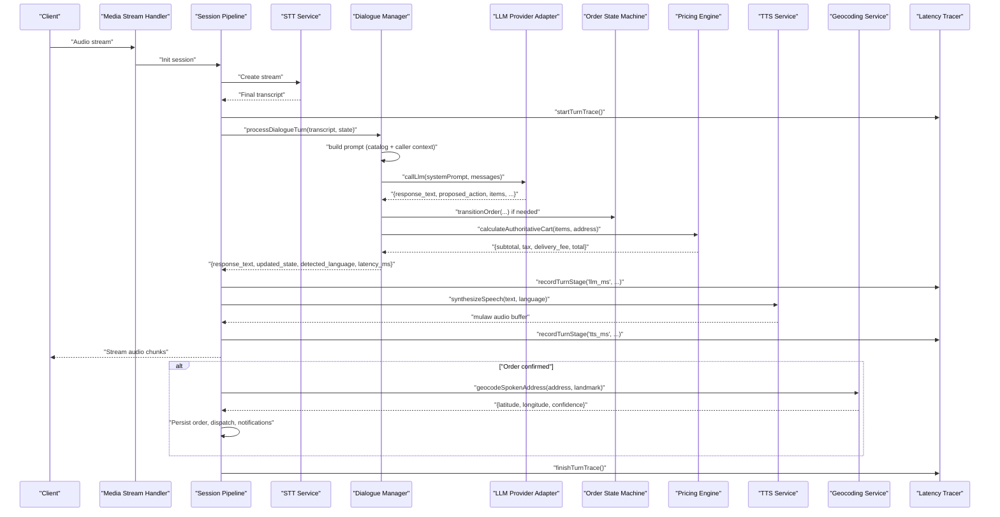
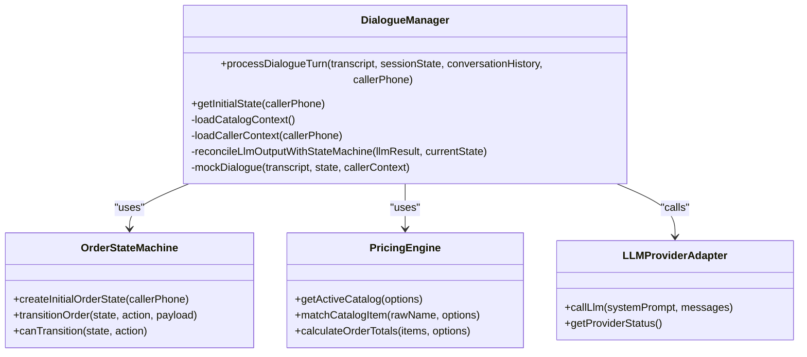
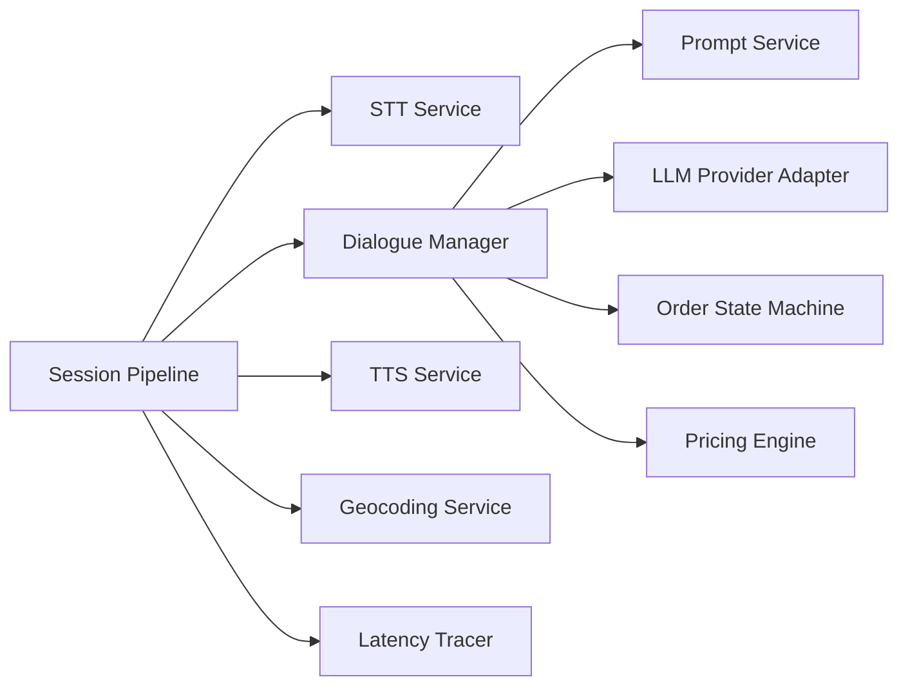

# Dialogue Processing & AI Integration

<cite>
**Referenced Files in This Document**
- [dialogueManager.js](file://server/src/services/dialogueManager.js)
- [llmProviderAdapter.js](file://server/src/services/llmProviderAdapter.js)
- [promptService.js](file://server/src/services/promptService.js)
- [sttService.js](file://server/src/services/sttService.js)
- [ttsService.js](file://server/src/services/ttsService.js)
- [orderStateMachine.js](file://server/src/domain/orders/orderStateMachine.js)
- [pricingEngine.js](file://server/src/domain/orders/pricingEngine.js)
- [sessionPipeline.js](file://server/src/websocket/sessionPipeline.js)
- [mediaStreamHandler.js](file://server/src/websocket/mediaStreamHandler.js)
- [latencyTracer.js](file://server/src/services/latencyTracer.js)
- [outputValidator.js](file://server/src/services/dialogue/outputValidator.js)
- [promptGuard.js](file://server/src/services/dialogue/promptGuard.js)
- [geocodingService.js](file://server/src/services/geocodingService.js)
</cite>

## Table of Contents
1. [Introduction](#introduction)
2. [Project Structure](#project-structure)
3. [Core Components](#core-components)
4. [Architecture Overview](#architecture-overview)
5. [Detailed Component Analysis](#detailed-component-analysis)
6. [Dependency Analysis](#dependency-analysis)
7. [Performance Considerations](#performance-considerations)
8. [Troubleshooting Guide](#troubleshooting-guide)
9. [Conclusion](#conclusion)
10. [Appendices](#appendices)

## Introduction
This document explains the dialogue processing engine that orchestrates AI-powered conversation management for voice-driven order taking. It covers how user transcripts are processed through the dialogue manager, including prompt generation, context maintenance, and response synthesis. It also documents integration with LLM providers, language detection, multi-turn conversation handling, state machine integration for order workflows, address resolution, latency tracing across STT, LLM, and TTS stages, and strategies for memory optimization and scaling under high volume.

## Project Structure
The dialogue engine is implemented on the server side with clear separation of concerns:
- Session pipeline coordinates real-time media streaming, STT, dialogue processing, TTS, and order confirmation flows.
- Dialogue manager builds prompts, calls LLMs, reconciles outputs with authoritative pricing and state machines, and falls back to a deterministic rule engine when needed.
- LLM provider adapter supports multiple providers with automatic fallback and strict JSON parsing/validation.
- STT service provides streaming transcription via Groq Whisper, Google Cloud, or local Whisper Tiny; mock mode supports development.
- TTS service synthesizes speech via Sarvam AI, Google Cloud, or a mock generator with caching.
- Domain services enforce business rules: order state machine and deterministic pricing engine.
- Latency tracer measures end-to-end turn latencies and persists metrics.
- Prompt guard sanitizes inputs against injection; output validator enforces schema and catalog alignment.
- Geocoding resolves spoken addresses to coordinates and triggers pin-drop if confidence is low.

**Diagram sources**
- [mediaStreamHandler.js:1-69](file://server/src/websocket/mediaStreamHandler.js#L1-L69)
- [sessionPipeline.js:1-437](file://server/src/websocket/sessionPipeline.js#L1-L437)
- [sttService.js:1-603](file://server/src/services/sttService.js#L1-L603)
- [dialogueManager.js:1-302](file://server/src/services/dialogueManager.js#L1-L302)
- [promptService.js:1-115](file://server/src/services/promptService.js#L1-L115)
- [llmProviderAdapter.js:1-283](file://server/src/services/llmProviderAdapter.js#L1-L283)
- [orderStateMachine.js:1-325](file://server/src/domain/orders/orderStateMachine.js#L1-L325)
- [pricingEngine.js:1-117](file://server/src/domain/orders/pricingEngine.js#L1-L117)
- [ttsService.js:1-187](file://server/src/services/ttsService.js#L1-L187)
- [geocodingService.js:1-161](file://server/src/services/geocodingService.js#L1-L161)
- [latencyTracer.js:1-133](file://server/src/services/latencyTracer.js#L1-L133)

**Section sources**
- [mediaStreamHandler.js:1-69](file://server/src/websocket/mediaStreamHandler.js#L1-L69)
- [sessionPipeline.js:1-437](file://server/src/websocket/sessionPipeline.js#L1-L437)

## Core Components
- Dialogue Manager: Orchestrates each conversation turn by building prompts, invoking LLMs, reconciling outputs with the state machine and pricing engine, and falling back to a deterministic rule engine when necessary.
- LLM Provider Adapter: Routes requests to configured providers (Ollama, Groq, Gemini, OpenRouter) with auto-fallback, strict JSON parsing, and latency tracking.
- Prompt Service: Manages versioned system prompts with caller context and menu data, enabling A/B testing and lifecycle control.
- STT Service: Multi-provider streaming transcription with VAD-like chunking, language hints, and fallbacks.
- TTS Service: Multi-provider speech synthesis with caching and telephony-friendly audio formats.
- Order State Machine: Authoritative transitions governing order lifecycle and actions.
- Pricing Engine: Deterministic calculation of totals, taxes, and delivery fees from catalog items.
- Session Pipeline: Real-time orchestration of media, STT, dialogue, TTS, geocoding, and order fulfillment.
- Latency Tracer: End-to-end timing measurement and persistence for STT, LLM, and TTS stages.
- Output Validator and Prompt Guard: Schema validation and input sanitization to protect pipelines.
- Geocoding Service: Address resolution and pin-drop workflow for ambiguous locations.

**Section sources**
- [dialogueManager.js:1-302](file://server/src/services/dialogueManager.js#L1-L302)
- [llmProviderAdapter.js:1-283](file://server/src/services/llmProviderAdapter.js#L1-L283)
- [promptService.js:1-115](file://server/src/services/promptService.js#L1-L115)
- [sttService.js:1-603](file://server/src/services/sttService.js#L1-L603)
- [ttsService.js:1-187](file://server/src/services/ttsService.js#L1-L187)
- [orderStateMachine.js:1-325](file://server/src/domain/orders/orderStateMachine.js#L1-L325)
- [pricingEngine.js:1-117](file://server/src/domain/orders/pricingEngine.js#L1-L117)
- [sessionPipeline.js:1-437](file://server/src/websocket/sessionPipeline.js#L1-L437)
- [latencyTracer.js:1-133](file://server/src/services/latencyTracer.js#L1-L133)
- [outputValidator.js:1-81](file://server/src/services/dialogue/outputValidator.js#L1-L81)
- [promptGuard.js:1-44](file://server/src/services/dialogue/promptGuard.js#L1-L44)
- [geocodingService.js:1-161](file://server/src/services/geocodingService.js#L1-L161)

## Architecture Overview
The system processes voice input into text via STT, constructs a contextual prompt using the prompt service, calls an LLM with provider fallback, validates and reconciles the output with the authoritative state machine and pricing engine, then synthesizes speech via TTS and streams it back to the client. The session pipeline manages multi-turn context, tracks latency, and handles order confirmation and geocoding.

**Diagram sources**
- [mediaStreamHandler.js:1-69](file://server/src/websocket/mediaStreamHandler.js#L1-L69)
- [sessionPipeline.js:1-437](file://server/src/websocket/sessionPipeline.js#L1-L437)
- [sttService.js:1-603](file://server/src/services/sttService.js#L1-L603)
- [dialogueManager.js:1-302](file://server/src/services/dialogueManager.js#L1-L302)
- [llmProviderAdapter.js:1-283](file://server/src/services/llmProviderAdapter.js#L1-L283)
- [orderStateMachine.js:1-325](file://server/src/domain/orders/orderStateMachine.js#L1-L325)
- [pricingEngine.js:1-117](file://server/src/domain/orders/pricingEngine.js#L1-L117)
- [ttsService.js:1-187](file://server/src/services/ttsService.js#L1-L187)
- [geocodingService.js:1-161](file://server/src/services/geocodingService.js#L1-L161)
- [latencyTracer.js:1-133](file://server/src/services/latencyTracer.js#L1-L133)

## Detailed Component Analysis

### Dialogue Manager
- Builds system prompts using catalog and caller context, maintains recent conversation history, and sends structured messages to the LLM.
- Reconciles LLM proposals with the authoritative state machine and pricing engine to ensure correctness and consistency.
- Falls back to a deterministic rule-based engine when LLM calls fail or return invalid results.
- Returns standardized responses including response text, updated state, detected language, provider info, and latency.

Key behaviors:
- Catalog context loading with fallback defaults.
- Caller context retrieval (profile, saved addresses, last order).
- State reconciliation: set address, compute authoritative totals, validate transitions, update status.
- Rule engine patterns: greetings, price inquiries, menu queries, confirm/cancel, address recognition, item matching.

**Section sources**
- [dialogueManager.js:1-302](file://server/src/services/dialogueManager.js#L1-L302)

#### Class Diagram: Dialogue Manager Interactions

**Diagram sources**
- [dialogueManager.js:1-302](file://server/src/services/dialogueManager.js#L1-L302)
- [orderStateMachine.js:1-325](file://server/src/domain/orders/orderStateMachine.js#L1-L325)
- [pricingEngine.js:1-117](file://server/src/domain/orders/pricingEngine.js#L1-L117)
- [llmProviderAdapter.js:1-283](file://server/src/services/llmProviderAdapter.js#L1-L283)

### LLM Provider Adapter
- Supports multiple providers (Ollama, Groq, Gemini, OpenRouter) with environment-based configuration and automatic fallback chain.
- Normalizes responses to a consistent format and parses strict JSON with allowed actions and safe item extraction.
- Tracks latency per provider call and logs model details.

Key behaviors:
- Fallback chain selection based on primary provider and availability.
- OpenAI-compatible calls with timeouts and error handling.
- Gemini SDK integration with model iteration and error handling.
- Strict JSON parsing and schema enforcement to prevent unsafe actions or malformed data.

**Section sources**
- [llmProviderAdapter.js:1-283](file://server/src/services/llmProviderAdapter.js#L1-L283)

### Prompt Service
- Versioned system prompts with configurable temperature and token limits.
- Injects caller profile, saved addresses, and last order context into prompts.
- Provides active prompt builder selection via environment variable.

Usage examples:
- v1: Initial bilingual Tamil/English conversational order-taking prompt.
- v2: Upgraded concise Tanglish prompt with dietary safeguards and upselling guidance.

**Section sources**
- [promptService.js:1-115](file://server/src/services/promptService.js#L1-L115)

### STT Service
- Multi-provider streaming transcription with VAD-like chunking and silence detection.
- Providers include Groq Whisper Large v3 Turbo, Google Cloud Speech-to-Text, and local Whisper Tiny; mock mode for development.
- Loads dynamic phrase hints from catalog to improve accuracy for Indian food terms.

Streaming behavior:
- Accumulates audio chunks, detects speech vs silence via RMS energy, emits interim and final transcripts.
- Converts PCM buffers to WAV for API calls and handles errors gracefully.

**Section sources**
- [sttService.js:1-603](file://server/src/services/sttService.js#L1-L603)

### TTS Service
- Multi-provider synthesis with caching to reduce repeated costs and latency.
- Providers include Sarvam AI Bulbul and Google Cloud Text-to-Speech; mock tone generator for development.
- Outputs mulaw audio suitable for telephony playback.

Caching strategy:
- In-memory cache keyed by provider, language, and text content.
- Evicts oldest entries when limit exceeded.

**Section sources**
- [ttsService.js:1-187](file://server/src/services/ttsService.js#L1-L187)

### Order State Machine
- Defines states and actions governing the full order lifecycle.
- Validates transitions and updates totals, history, and dispute fields.
- Enforces business rules such as requiring items and address before confirmation.

Key states: new, collecting_items, collecting_address, validating, awaiting_confirmation, confirmed, payment_pending, payment_confirmed, dispatch_pending, dispatched, completed, cancelled, needs_human.

**Section sources**
- [orderStateMachine.js:1-325](file://server/src/domain/orders/orderStateMachine.js#L1-L325)

### Pricing Engine
- Deterministic catalog and pricing calculations ensuring “AI suggests; code decides.”
- Matches spoken items to official catalog entries and computes subtotal, GST, delivery fee, and total accurately.
- Caches active catalog for performance.

**Section sources**
- [pricingEngine.js:1-117](file://server/src/domain/orders/pricingEngine.js#L1-L117)

### Session Pipeline
- Initializes sessions with tenant and restaurant context, creates STT stream, and sets up conversation history.
- Processes user input by calling dialogue manager, recording latencies, broadcasting dashboard events, and sending TTS audio.
- Handles order confirmation by geocoding addresses, persisting orders, dispatching kitchen orders, and sending notifications.
- Ends sessions, persists recordings, and cleans up resources.

Multi-turn handling:
- Maintains conversation history and recent turns for context.
- Updates ephemeral session store and database records.

**Section sources**
- [sessionPipeline.js:1-437](file://server/src/websocket/sessionPipeline.js#L1-L437)

### Media Stream Handler
- Bridges telephony media streams to the session pipeline.
- Decodes audio payloads, writes to STT stream, and manages session lifecycle events.

**Section sources**
- [mediaStreamHandler.js:1-69](file://server/src/websocket/mediaStreamHandler.js#L1-L69)

### Latency Tracer
- Starts traces per turn, records stage durations (VAD, STT, LLM, TTS), and finishes traces with aggregated metrics.
- Persists turn metrics to the database and provides analytics endpoints for percentiles and averages.

**Section sources**
- [latencyTracer.js:1-133](file://server/src/services/latencyTracer.js#L1-L133)

### Output Validator and Prompt Guard
- Output validator enforces schema constraints and cross-references extracted items against the active catalog.
- Prompt guard sanitizes user transcripts to neutralize potential prompt injection attempts and caps length to prevent token exhaustion.

**Section sources**
- [outputValidator.js:1-81](file://server/src/services/dialogue/outputValidator.js#L1-L81)
- [promptGuard.js:1-44](file://server/src/services/dialogue/promptGuard.js#L1-L44)

### Geocoding Service
- Resolves spoken addresses to GPS coordinates using Google Maps API with smart local fallback for Coimbatore landmarks.
- Generates pin-drop URLs when confidence is low and saves tokens to the database.

**Section sources**
- [geocodingService.js:1-161](file://server/src/services/geocodingService.js#L1-L161)

## Dependency Analysis
The dialogue engine exhibits strong cohesion within domain-specific modules and loose coupling via adapters and services:
- Dialogue Manager depends on Prompt Service, LLM Provider Adapter, Order State Machine, and Pricing Engine.
- Session Pipeline orchestrates STT, Dialogue Manager, TTS, Geocoding, and Latency Tracer.
- LLM Provider Adapter abstracts external providers behind a unified interface.
- STT and TTS services provide provider abstraction with fallbacks.
- Geocoding integrates external APIs with local fallback logic.

**Diagram sources**
- [sessionPipeline.js:1-437](file://server/src/websocket/sessionPipeline.js#L1-L437)
- [dialogueManager.js:1-302](file://server/src/services/dialogueManager.js#L1-L302)
- [sttService.js:1-603](file://server/src/services/sttService.js#L1-L603)
- [ttsService.js:1-187](file://server/src/services/ttsService.js#L1-L187)
- [geocodingService.js:1-161](file://server/src/services/geocodingService.js#L1-L161)
- [latencyTracer.js:1-133](file://server/src/services/latencyTracer.js#L1-L133)
- [promptService.js:1-115](file://server/src/services/promptService.js#L1-L115)
- [llmProviderAdapter.js:1-283](file://server/src/services/llmProviderAdapter.js#L1-L283)
- [orderStateMachine.js:1-325](file://server/src/domain/orders/orderStateMachine.js#L1-L325)
- [pricingEngine.js:1-117](file://server/src/domain/orders/pricingEngine.js#L1-L117)

**Section sources**
- [sessionPipeline.js:1-437](file://server/src/websocket/sessionPipeline.js#L1-L437)
- [dialogueManager.js:1-302](file://server/src/services/dialogueManager.js#L1-L302)

## Performance Considerations
- STT streaming uses VAD-like chunking to minimize latency while maintaining accuracy; fallbacks ensure resilience.
- LLM provider adapter implements timeout signals and cascading fallbacks to maintain responsiveness.
- TTS caching reduces repeated synthesis costs and improves response times for common prompts.
- Catalog caching avoids frequent database reads during prompt construction and item matching.
- Latency tracer captures per-stage timings to identify bottlenecks and optimize hot paths.
- Memory management includes audio chunk limits and ephemeral session stores to prevent unbounded growth.

[No sources needed since this section provides general guidance]

## Troubleshooting Guide
Common issues and recovery strategies:
- LLM provider failures: Automatic fallback to next provider; if all fail, dialogue manager switches to rule engine.
- Invalid LLM JSON: Strict parsing throws errors; adapter logs and continues to next provider; rule engine fallback ensures continuity.
- STT transcription errors: Graceful fallback to local Whisper or mock mode; intermediate transcripts keep conversation flowing.
- TTS synthesis errors: Fallback to next provider or mock generator; web clients receive text-only responses.
- Geocoding confidence low: Pin-drop URL generated and sent via notification queue to confirm precise location.
- State transition errors: State machine rejects illegal actions; dialogue manager adjusts state accordingly and prompts user for missing information.

**Section sources**
- [llmProviderAdapter.js:1-283](file://server/src/services/llmProviderAdapter.js#L1-L283)
- [dialogueManager.js:1-302](file://server/src/services/dialogueManager.js#L1-L302)
- [sttService.js:1-603](file://server/src/services/sttService.js#L1-L603)
- [ttsService.js:1-187](file://server/src/services/ttsService.js#L1-L187)
- [geocodingService.js:1-161](file://server/src/services/geocodingService.js#L1-L161)
- [orderStateMachine.js:1-325](file://server/src/domain/orders/orderStateMachine.js#L1-L325)

## Conclusion
The dialogue processing engine combines robust real-time streaming, intelligent prompt engineering, multi-provider LLM integration, and authoritative business logic to deliver reliable, low-latency voice interactions. Its modular architecture enables scalability, resilience, and continuous improvement through versioned prompts, latency tracing, and deterministic pricing and state management.

[No sources needed since this section summarizes without analyzing specific files]

## Appendices

### Example Workflows

#### Prompt Engineering Examples
- Use versioned prompts to inject caller profile, saved addresses, and last order context for personalized interactions.
- Configure temperature and token limits to balance creativity and determinism.

**Section sources**
- [promptService.js:1-115](file://server/src/services/promptService.js#L1-L115)

#### Response Formatting Examples
- LLM returns structured JSON with response text, proposed action, items, address, landmark, and detected language.
- Dialogue manager reconciles items and addresses with state machine and pricing engine to produce authoritative totals.

**Section sources**
- [llmProviderAdapter.js:1-283](file://server/src/services/llmProviderAdapter.js#L1-L283)
- [dialogueManager.js:1-302](file://server/src/services/dialogueManager.js#L1-L302)

#### Error Recovery Strategies
- Provider fallback cascade ensures continuity even when primary LLM fails.
- Rule engine fallback provides deterministic behavior when LLM outputs are invalid or unavailable.
- STT/TTS fallbacks maintain user experience during outages.

**Section sources**
- [llmProviderAdapter.js:1-283](file://server/src/services/llmProviderAdapter.js#L1-L283)
- [dialogueManager.js:1-302](file://server/src/services/dialogueManager.js#L1-L302)
- [sttService.js:1-603](file://server/src/services/sttService.js#L1-L603)
- [ttsService.js:1-187](file://server/src/services/ttsService.js#L1-L187)

### Conversation Context Management and Scaling
- Maintain recent conversation history to preserve context while limiting memory usage.
- Use ephemeral session stores for fast access and periodic persistence to databases.
- Implement provider timeouts and retries to handle high-volume scenarios gracefully.
- Cache catalog and frequently used TTS outputs to reduce external dependencies and latency.

**Section sources**
- [sessionPipeline.js:1-437](file://server/src/websocket/sessionPipeline.js#L1-L437)
- [promptService.js:1-115](file://server/src/services/promptService.js#L1-L115)
- [ttsService.js:1-187](file://server/src/services/ttsService.js#L1-L187)
- [pricingEngine.js:1-117](file://server/src/domain/orders/pricingEngine.js#L1-L117)