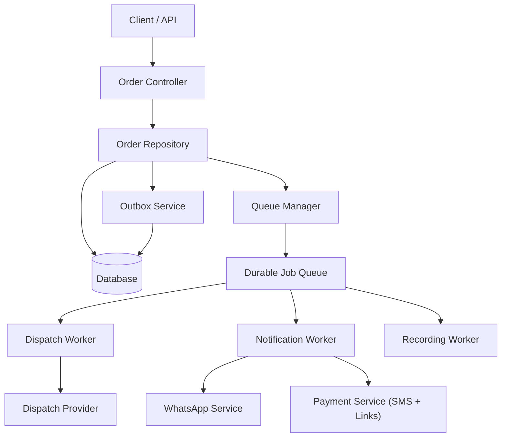
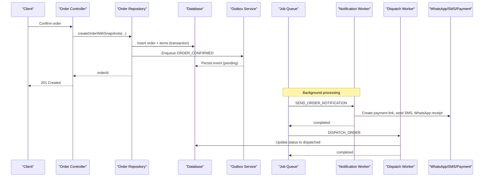
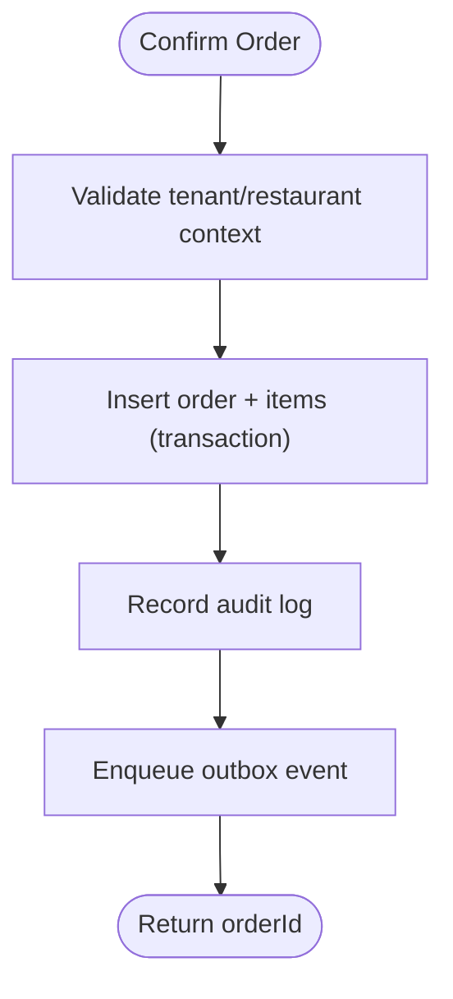
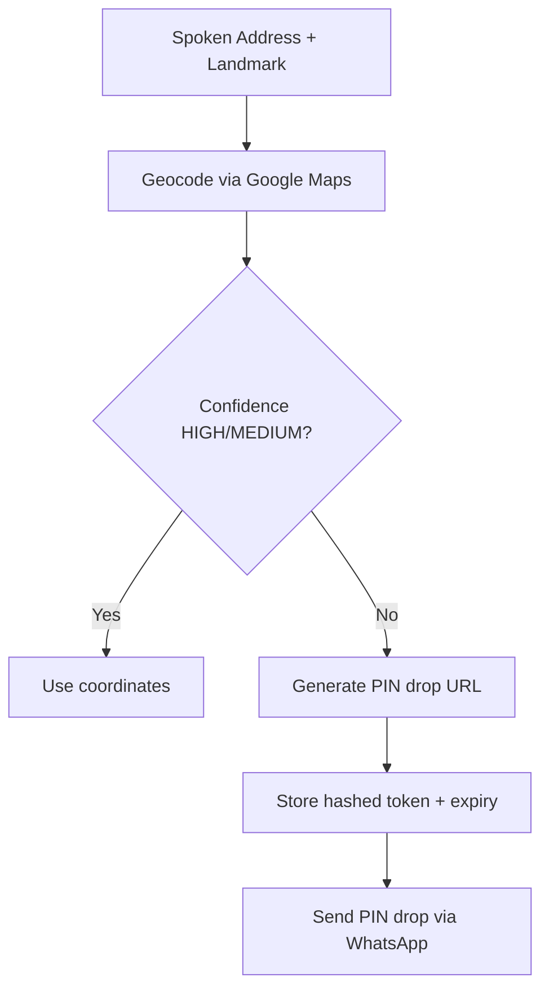
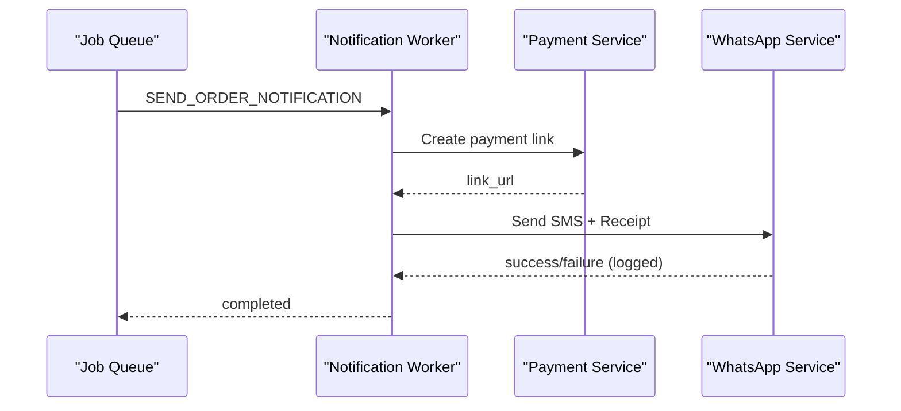
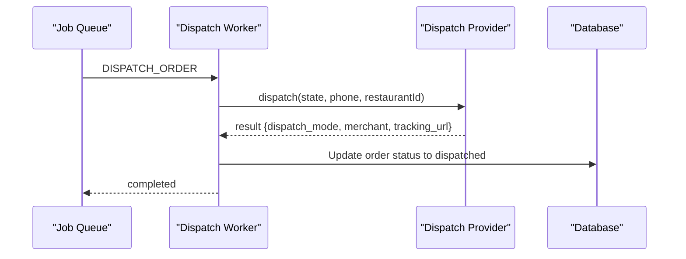
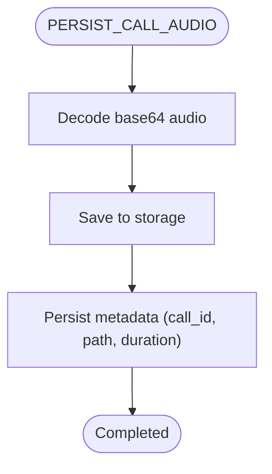
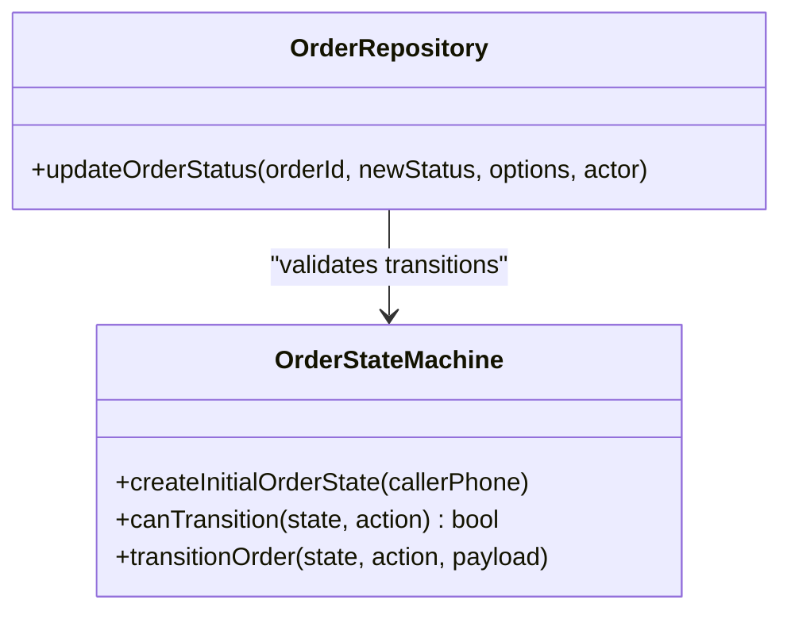
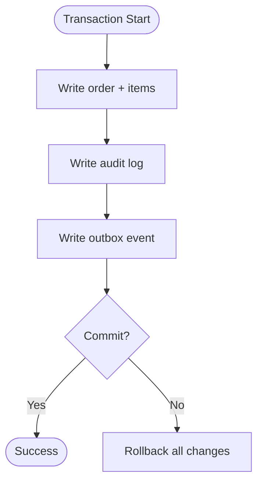
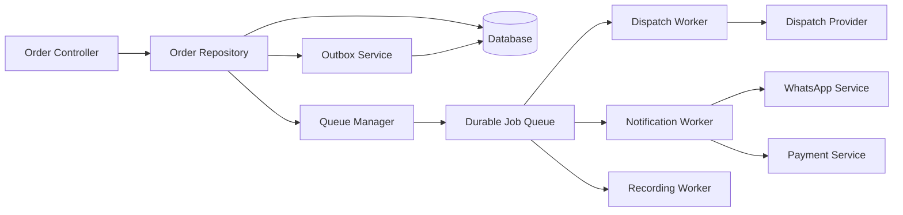

# Order Fulfillment & Async Processing

<cite>
**Referenced Files in This Document**
- [order.controller.js](file://server/src/controllers/order.controller.js)
- [order.repository.js](file://server/src/domain/orders/order.repository.js)
- [orderStateMachine.js](file://server/src/domain/orders/orderStateMachine.js)
- [jobQueue.js](file://server/src/queue/jobQueue.js)
- [queueManager.js](file://server/src/queue/queueManager.js)
- [dispatch.worker.js](file://server/src/workers/dispatch.worker.js)
- [notification.worker.js](file://server/src/workers/notification.worker.js)
- [recording.worker.js](file://server/src/workers/recording.worker.js)
- [geocodingService.js](file://server/src/services/geocodingService.js)
- [whatsappService.js](file://server/src/services/whatsappService.js)
- [paymentService.js](file://server/src/services/paymentService.js)
- [outbox.service.js](file://server/src/services/outbox.service.js)
- [007_durable_job_queue.sql](file://server/src/db/migrations/007_durable_job_queue.sql)
- [004_pin_tokens_and_security.sql](file://server/src/db/migrations/004_pin_tokens_and_security.sql)
- [order.schema.js](file://server/src/schemas/order.schema.js)
</cite>

## Table of Contents
1. Introduction
2. Project Structure
3. Core Components
4. Architecture Overview
5. Detailed Component Analysis
6. Dependency Analysis
7. Performance Considerations
8. Troubleshooting Guide
9. Conclusion

## Introduction
This document explains the order fulfillment system that processes confirmed orders asynchronously. It covers the end-to-end workflow from order confirmation to dispatch, including geocoding delivery addresses, generating PIN drop links for precise location confirmation, and persisting orders with item snapshots. It also documents the queue-based worker coordination for dispatch, notifications, and recording tasks, along with error handling, idempotency, and transactional consistency patterns used across the system.

## Project Structure
The order fulfillment flow spans controllers, domain repositories, services, queues, workers, and database migrations:
- Controllers expose APIs for order queries and status updates.
- The repository persists orders and line-item snapshots within transactions and emits outbox events.
- Services handle geocoding, payments, WhatsApp messaging, and SMS.
- Queues provide durable, database-backed job processing with retries and dead-letter routing.
- Workers implement background tasks for dispatch, notifications, and audio recording persistence.
- Migrations define durable job tables and secure PIN token storage.

**Diagram sources**
- [order.controller.js:22-63](file://server/src/controllers/order.controller.js#L22-L63)
- [order.repository.js:24-143](file://server/src/domain/orders/order.repository.js#L24-L143)
- [outbox.service.js:8-30](file://server/src/services/outbox.service.js#L8-L30)
- [queueManager.js:1-12](file://server/src/queue/queueManager.js#L1-L12)
- [jobQueue.js:14-76](file://server/src/queue/jobQueue.js#L14-L76)
- [dispatch.worker.js:12-53](file://server/src/workers/dispatch.worker.js#L12-L53)
- [notification.worker.js:10-71](file://server/src/workers/notification.worker.js#L10-L71)
- [recording.worker.js:10-50](file://server/src/workers/recording.worker.js#L10-L50)

**Section sources**
- [order.controller.js:22-63](file://server/src/controllers/order.controller.js#L22-L63)
- [order.repository.js:24-143](file://server/src/domain/orders/order.repository.js#L24-L143)
- [queueManager.js:1-12](file://server/src/queue/queueManager.js#L1-L12)

## Core Components
- Order Repository: Persists orders and item snapshots atomically, validates state transitions, writes audit logs, and enqueues outbox events for downstream processing.
- Durable Job Queue: Database-backed queue with atomic claiming, retry with exponential backoff, stale recovery, and DLQ routing.
- Workers:
  - Dispatch Worker: Integrates with dispatch providers (e.g., ONDC or POS), updates order status, and broadcasts to dashboard.
  - Notification Worker: Creates payment links, sends SMS, and delivers WhatsApp receipts and pin-drop requests.
  - Recording Worker: Saves call recordings to storage and persists metadata.
- Geocoding Service: Resolves spoken addresses to coordinates with confidence scoring; generates single-use PIN drop tokens and URLs when needed.
- Outbox Service: Ensures reliable event emission alongside business transactions with claim-and-process semantics.

**Section sources**
- [order.repository.js:24-143](file://server/src/domain/orders/order.repository.js#L24-L143)
- [jobQueue.js:14-76](file://server/src/queue/jobQueue.js#L14-L76)
- [dispatch.worker.js:12-53](file://server/src/workers/dispatch.worker.js#L12-L53)
- [notification.worker.js:10-71](file://server/src/workers/notification.worker.js#L10-L71)
- [recording.worker.js:10-50](file://server/src/workers/recording.worker.js#L10-L50)
- [geocodingService.js:21-161](file://server/src/services/geocodingService.js#L21-L161)
- [outbox.service.js:8-30](file://server/src/services/outbox.service.js#L8-L30)

## Architecture Overview
The system uses a transactional outbox pattern combined with durable job queues to decouple order confirmation from side effects like notifications and dispatch. Orders are persisted with snapshots, then events are emitted to the outbox. Workers consume jobs reliably, integrate with external services, and update order states consistently.

**Diagram sources**
- [order.repository.js:24-143](file://server/src/domain/orders/order.repository.js#L24-L143)
- [outbox.service.js:8-30](file://server/src/services/outbox.service.js#L8-L30)
- [jobQueue.js:48-76](file://server/src/queue/jobQueue.js#L48-L76)
- [notification.worker.js:10-71](file://server/src/workers/notification.worker.js#L10-L71)
- [dispatch.worker.js:12-53](file://server/src/workers/dispatch.worker.js#L12-L53)

## Detailed Component Analysis

### Order Confirmation Workflow
- Input validation and context scoping ensure tenant and restaurant isolation.
- Order creation persists master record and line-item snapshots atomically.
- Audit logging records creation details.
- An outbox event is enqueued to trigger asynchronous notifications and dispatch.

**Diagram sources**
- [order.repository.js:24-143](file://server/src/domain/orders/order.repository.js#L24-L143)

**Section sources**
- [order.repository.js:24-143](file://server/src/domain/orders/order.repository.js#L24-L143)

### Geocoding and PIN Drop Generation
- Spoken address plus landmark is resolved to GPS coordinates using Google Maps with a smart local fallback.
- Confidence levels guide whether to request a PIN drop via WhatsApp.
- Single-use, time-expiring PIN tokens are stored securely and linked to orders.

**Diagram sources**
- [geocodingService.js:21-161](file://server/src/services/geocodingService.js#L21-L161)
- [004_pin_tokens_and_security.sql:5-15](file://server/src/db/migrations/004_pin_tokens_and_security.sql#L5-L15)

**Section sources**
- [geocodingService.js:21-161](file://server/src/services/geocodingService.js#L21-L161)
- [004_pin_tokens_and_security.sql:5-15](file://server/src/db/migrations/004_pin_tokens_and_security.sql#L5-L15)

### Notification Worker (SMS, WhatsApp, Payment Links)
- Skips non-PSTN sessions.
- Creates payment links and sends SMS confirmations.
- Sends rich WhatsApp receipts and pin-drop requests.
- Errors are logged without failing the entire job unless critical.

**Diagram sources**
- [notification.worker.js:10-71](file://server/src/workers/notification.worker.js#L10-L71)
- [paymentService.js:25-61](file://server/src/services/paymentService.js#L25-L61)
- [whatsappService.js:24-77](file://server/src/services/whatsappService.js#L24-L77)

**Section sources**
- [notification.worker.js:10-71](file://server/src/workers/notification.worker.js#L10-L71)
- [paymentService.js:25-61](file://server/src/services/paymentService.js#L25-L61)
- [whatsappService.js:24-77](file://server/src/services/whatsappService.js#L24-L77)

### Dispatch Worker (ONDC/POS Integration)
- Retrieves provider via provider registry.
- Dispatches order and transitions order state to dispatched.
- Broadcasts real-time updates to the dashboard.

**Diagram sources**
- [dispatch.worker.js:12-53](file://server/src/workers/dispatch.worker.js#L12-L53)

**Section sources**
- [dispatch.worker.js:12-53](file://server/src/workers/dispatch.worker.js#L12-L53)

### Recording Worker (Audio Persistence)
- Accepts base64 PCM chunks or full buffer.
- Calculates duration and saves to storage.
- Persists recording metadata with dispute status defaults.

**Diagram sources**
- [recording.worker.js:10-50](file://server/src/workers/recording.worker.js#L10-L50)

**Section sources**
- [recording.worker.js:10-50](file://server/src/workers/recording.worker.js#L10-L50)

### Order State Machine and Status Updates
- Centralized state machine defines valid transitions and actions.
- Repository enforces state transitions and optimistic concurrency control.
- Schema validation ensures only allowed statuses are accepted by APIs.

**Diagram sources**
- [orderStateMachine.js:46-325](file://server/src/domain/orders/orderStateMachine.js#L46-L325)
- [order.repository.js:220-287](file://server/src/domain/orders/order.repository.js#L220-L287)

**Section sources**
- [orderStateMachine.js:46-325](file://server/src/domain/orders/orderStateMachine.js#L46-L325)
- [order.repository.js:220-287](file://server/src/domain/orders/order.repository.js#L220-L287)
- [order.schema.js:3-21](file://server/src/schemas/order.schema.js#L3-L21)

### Transaction Management, Data Consistency, and Rollback Strategies
- All order mutations use database transactions to ensure atomicity.
- Optimistic locking prevents concurrent updates from overwriting each other.
- Outbox events are written within the same transaction as order changes, guaranteeing eventual consistency.
- Durable job queue supports retries with exponential backoff and moves unrecoverable jobs to a dead-letter queue.
- Stale job recovery reclaims work from crashed workers.

**Diagram sources**
- [order.repository.js:58-143](file://server/src/domain/orders/order.repository.js#L58-L143)
- [outbox.service.js:8-30](file://server/src/services/outbox.service.js#L8-L30)
- [jobQueue.js:107-212](file://server/src/queue/jobQueue.js#L107-L212)

**Section sources**
- [order.repository.js:58-143](file://server/src/domain/orders/order.repository.js#L58-L143)
- [outbox.service.js:8-30](file://server/src/services/outbox.service.js#L8-L30)
- [jobQueue.js:107-212](file://server/src/queue/jobQueue.js#L107-L212)

## Dependency Analysis
- Controllers depend on repositories for data access and on services for cross-cutting concerns.
- Repositories depend on database abstractions and emit outbox events.
- Queues coordinate workers through durable job tables.
- Workers depend on integration services (WhatsApp, SMS, payment, dispatch).
- Migrations define durable structures for jobs and PIN tokens.

**Diagram sources**
- [order.controller.js:22-63](file://server/src/controllers/order.controller.js#L22-L63)
- [order.repository.js:24-143](file://server/src/domain/orders/order.repository.js#L24-L143)
- [outbox.service.js:8-30](file://server/src/services/outbox.service.js#L8-L30)
- [queueManager.js:1-12](file://server/src/queue/queueManager.js#L1-L12)
- [jobQueue.js:14-76](file://server/src/queue/jobQueue.js#L14-L76)
- [dispatch.worker.js:12-53](file://server/src/workers/dispatch.worker.js#L12-L53)
- [notification.worker.js:10-71](file://server/src/workers/notification.worker.js#L10-L71)
- [recording.worker.js:10-50](file://server/src/workers/recording.worker.js#L10-L50)

**Section sources**
- [queueManager.js:1-12](file://server/src/queue/queueManager.js#L1-L12)
- [jobQueue.js:14-76](file://server/src/queue/jobQueue.js#L14-L76)
- [007_durable_job_queue.sql:5-22](file://server/src/db/migrations/007_durable_job_queue.sql#L5-L22)

## Performance Considerations
- Use database-backed durable queues to avoid message loss under load or crashes.
- Limit concurrency per queue to balance throughput and resource usage.
- Employ optimistic concurrency to reduce contention on hot order rows.
- Batch outbox claims to process multiple events per worker cycle.
- Prefer asynchronous workers for I/O-bound operations (messaging, payments, storage).
- Cache frequently accessed catalog or pricing data where appropriate to reduce DB pressure.

## Troubleshooting Guide
- Illegal state transitions: Ensure order status changes follow the defined state machine and schema constraints.
- Optimistic lock conflicts: Refresh client state and retry updates with the latest version.
- Dead-letter queue jobs: Inspect last_error and adjust retry policies or fix upstream dependencies.
- Stale jobs: Verify worker liveness and recovery mechanisms reclaim stuck jobs.
- External service failures: Check environment configuration for WhatsApp, SMS, and payment providers; monitor logs for provider errors.

**Section sources**
- [order.repository.js:220-287](file://server/src/domain/orders/order.repository.js#L220-L287)
- [order.schema.js:3-21](file://server/src/schemas/order.schema.js#L3-L21)
- [jobQueue.js:182-212](file://server/src/queue/jobQueue.js#L182-L212)
- [outbox.service.js:119-141](file://server/src/services/outbox.service.js#L119-L141)

## Conclusion
The order fulfillment system combines robust transactional persistence, authoritative state management, and resilient async processing to deliver reliable order confirmation, geocoding, PIN drop workflows, and dispatch. The durable job queue and outbox pattern ensure consistency even under failures, while dedicated workers isolate I/O-heavy tasks. This design provides scalability, observability, and maintainability for high-volume food order processing.