# Session Lifecycle Management

<cite>
**Referenced Files in This Document**
- [sessionPipeline.js](file://server/src/websocket/sessionPipeline.js)
- [wsServer.js](file://server/src/websocket/wsServer.js)
- [mediaStreamHandler.js](file://server/src/websocket/mediaStreamHandler.js)
- [webStreamHandler.js](file://server/src/websocket/webStreamHandler.js)
- [exotelStreamHandler.js](file://server/src/websocket/exotelStreamHandler.js)
- [sessionStore.js](file://server/src/infra/sessionStore.js)
- [redisClient.js](file://server/src/infra/redisClient.js)
- [latencyTracer.js](file://server/src/services/latencyTracer.js)
- [dialogueManager.js](file://server/src/services/dialogueManager.js)
- [wsTicketService.js](file://server/src/services/wsTicketService.js)
- [db.js](file://server/src/db.js)
- [001_initial_multitenant_schema.sql](file://server/src/db/migrations/001_initial_multitenant_schema.sql)
</cite>

## Table of Contents
1. Introduction
2. Project Structure
3. Core Components
4. Architecture Overview
5. Detailed Component Analysis
6. Dependency Analysis
7. Performance Considerations
8. Troubleshooting Guide
9. Conclusion

## Introduction
This document explains the voice session lifecycle management system from initialization to termination. It covers tenant context validation, session state initialization, ephemeral and persistent storage integration, conversation history management, latency tracking, error handling, timeout and cleanup procedures, and the relationship between sessions and WebSocket connections including reconnection handling.

## Project Structure
The voice session system is implemented on the server side with clear separation of concerns:
- WebSocket coordination and upgrade authentication
- Stream handlers for telephony (Twilio, Exotel) and web clients
- Session pipeline orchestrating STT, dialogue, TTS, order confirmation, and cleanup
- Ephemeral session store backed by Redis (or in-memory fallback)
- Persistent storage via SQLite schema and helpers
- Latency tracing and metrics persistence
- Ticket-based authentication for secure upgrades

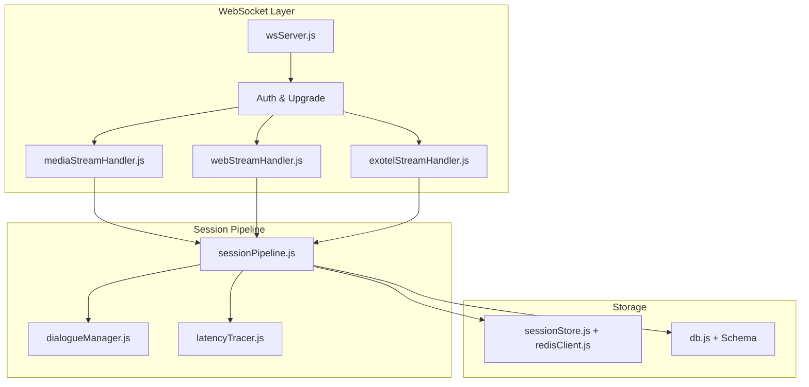

**Diagram sources**
- [wsServer.js:17-147](file://server/src/websocket/wsServer.js#L17-L147)
- [mediaStreamHandler.js:7-69](file://server/src/websocket/mediaStreamHandler.js#L7-L69)
- [webStreamHandler.js:7-81](file://server/src/websocket/webStreamHandler.js#L7-L81)
- [exotelStreamHandler.js:9-80](file://server/src/websocket/exotelStreamHandler.js#L9-L80)
- [sessionPipeline.js:24-111](file://server/src/websocket/sessionPipeline.js#L24-L111)
- [sessionStore.js:13-65](file://server/src/infra/sessionStore.js#L13-L65)
- [redisClient.js:82-125](file://server/src/infra/redisClient.js#L82-L125)
- [db.js:11-43](file://server/src/db.js#L11-L43)
- [001_initial_multitenant_schema.sql:129-148](file://server/src/db/migrations/001_initial_multitenant_schema.sql#L129-L148)

**Section sources**
- [wsServer.js:17-147](file://server/src/websocket/wsServer.js#L17-L147)
- [sessionPipeline.js:24-111](file://server/src/websocket/sessionPipeline.js#L24-L111)
- [sessionStore.js:13-65](file://server/src/infra/sessionStore.js#L13-L65)
- [redisClient.js:82-125](file://server/src/infra/redisClient.js#L82-L125)
- [db.js:11-43](file://server/src/db.js#L11-L43)
- [001_initial_multitenant_schema.sql:129-148](file://server/src/db/migrations/001_initial_multitenant_schema.sql#L129-L148)

## Core Components
- WebSocket coordinator: Handles HTTP upgrade, path routing, and per-path authentication using tickets or tokens; maintains a shared in-memory Map of active sessions.
- Stream handlers: Translate provider-specific events into session lifecycle calls (init, process input, end).
- Session pipeline: Orchestrates STT stream creation, transcript processing, dialogue turn execution, TTS synthesis, order confirmation, and cleanup.
- Session store: Ephemeral Redis-backed cache for active sessions with TTL and cluster-aware listing.
- Database layer: Persists call records, transcripts, state snapshots, and order artifacts; provides helper functions for customer profiles and addresses.
- Latency tracer: Tracks stage-level latencies per turn and persists metrics.
- Dialogue manager: Builds prompts, calls LLM, reconciles outputs with authoritative state machine and pricing engine, and falls back to rule-based logic.
- Ticket service: Issues single-use tickets for dashboard/web and telephony streams, persisted in Redis with short TTLs.

**Section sources**
- [wsServer.js:17-147](file://server/src/websocket/wsServer.js#L17-L147)
- [mediaStreamHandler.js:7-69](file://server/src/websocket/mediaStreamHandler.js#L7-L69)
- [webStreamHandler.js:7-81](file://server/src/websocket/webStreamHandler.js#L7-L81)
- [exotelStreamHandler.js:9-80](file://server/src/websocket/exotelStreamHandler.js#L9-L80)
- [sessionPipeline.js:24-437](file://server/src/websocket/sessionPipeline.js#L24-L437)
- [sessionStore.js:13-92](file://server/src/infra/sessionStore.js#L13-L92)
- [redisClient.js:82-125](file://server/src/infra/redisClient.js#L82-L125)
- [db.js:60-120](file://server/src/db.js#L60-L120)
- [latencyTracer.js:12-90](file://server/src/services/latencyTracer.js#L12-L90)
- [dialogueManager.js:36-132](file://server/src/services/dialogueManager.js#L36-L132)
- [wsTicketService.js:11-85](file://server/src/services/wsTicketService.js#L11-L85)

## Architecture Overview
The system supports multiple inbound channels (Twilio, Exotel, Web) that all converge into a unified session pipeline. Each channel authenticates via tickets or tokens during WebSocket upgrade. Once authenticated, the handler initializes a session, starts an STT stream, and processes final transcripts through the dialogue manager. Responses are synthesized via TTS and streamed back to the appropriate client. Order confirmations trigger asynchronous workers for dispatch and notifications. Latency is tracked per turn and persisted.

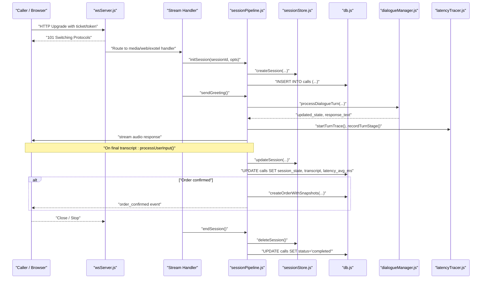

**Diagram sources**
- [wsServer.js:23-147](file://server/src/websocket/wsServer.js#L23-L147)
- [mediaStreamHandler.js:21-55](file://server/src/websocket/mediaStreamHandler.js#L21-L55)
- [webStreamHandler.js:14-61](file://server/src/websocket/webStreamHandler.js#L14-L61)
- [exotelStreamHandler.js:23-66](file://server/src/websocket/exotelStreamHandler.js#L23-L66)
- [sessionPipeline.js:24-111](file://server/src/websocket/sessionPipeline.js#L24-L111)
- [sessionPipeline.js:132-219](file://server/src/websocket/sessionPipeline.js#L132-L219)
- [sessionPipeline.js:224-294](file://server/src/websocket/sessionPipeline.js#L224-L294)
- [sessionPipeline.js:299-389](file://server/src/websocket/sessionPipeline.js#L299-L389)
- [sessionPipeline.js:394-437](file://server/src/websocket/sessionPipeline.js#L394-L437)
- [sessionStore.js:13-65](file://server/src/infra/sessionStore.js#L13-L65)
- [db.js:60-120](file://server/src/db.js#L60-L120)
- [latencyTracer.js:12-90](file://server/src/services/latencyTracer.js#L12-L90)

## Detailed Component Analysis

### WebSocket Upgrade and Connection Lifecycle
- Path-based routing: /media-stream (Twilio), /web-stream (browser/mobile), /dashboard-ws (admin), /exotel-stream (Exotel).
- Authentication:
  - Dashboard and web streams accept single-use tickets or bearer tokens; tickets are consumed atomically and invalidated after use.
  - Telephony streams require stream tickets validated against Redis entries with short TTLs.
- In-memory session registry: A shared Map holds active sessions keyed by sessionId for low-latency access.
- Heartbeat: Periodic ping/pong to detect dead connections and terminate them.

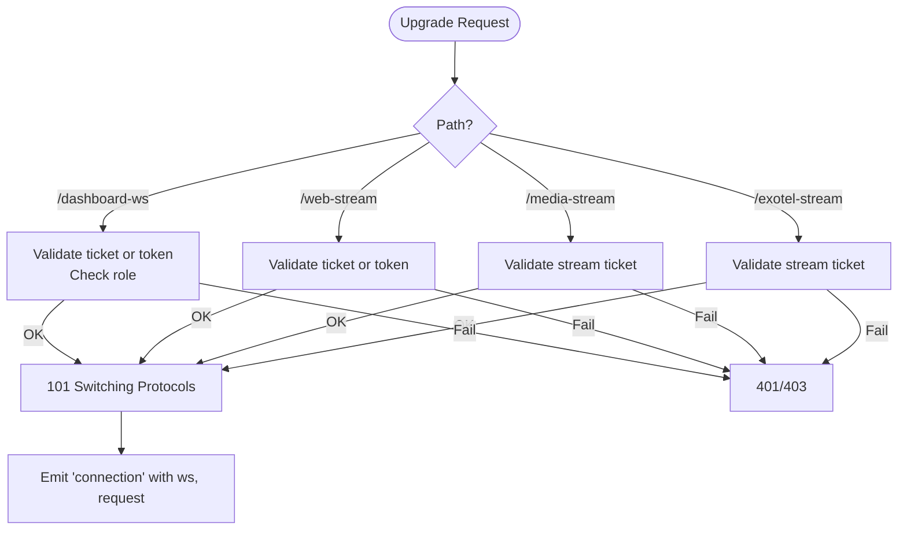

**Diagram sources**
- [wsServer.js:23-147](file://server/src/websocket/wsServer.js#L23-L147)
- [wsTicketService.js:11-85](file://server/src/services/wsTicketService.js#L11-L85)

**Section sources**
- [wsServer.js:23-147](file://server/src/websocket/wsServer.js#L23-L147)
- [wsTicketService.js:11-85](file://server/src/services/wsTicketService.js#L11-L85)

### Session Initialization and Tenant Context Validation
- initSession enforces explicit tenantId and restaurantId; fails closed if missing.
- Creates STT stream, initializes session state, sets up conversation history, and attaches metadata (source, callerPhone, streamSid/callSid).
- Persists initial state to both in-memory Map and Redis ephemeral store; inserts a row in calls table; optionally upserts customer profile.
- Broadcasts call_started event to dashboard.

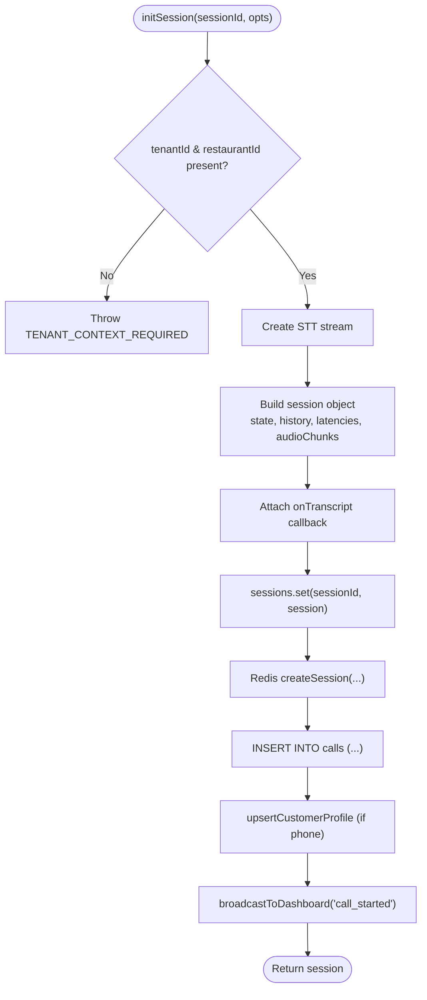

**Diagram sources**
- [sessionPipeline.js:24-111](file://server/src/websocket/sessionPipeline.js#L24-L111)

**Section sources**
- [sessionPipeline.js:24-111](file://server/src/websocket/sessionPipeline.js#L24-L111)

### Conversation Turn Processing and State Transitions
- processUserInput:
  - Guards concurrent processing with isProcessing flag.
  - Starts latency trace, appends user message to history, logs to DB if available.
  - Calls dialogueManager.processDialogueTurn to obtain updated state and response text.
  - Records LLM latency stage, updates session latencies, persists call logs and call state/transcript/avg latency.
  - Sends immediate TTS audio response for lowest latency.
  - If state becomes confirmed, triggers asynchronous order fulfillment.
- Dialogue reconciliation:
  - Reconciles LLM proposals with authoritative pricing and state machine transitions.
  - Enforces collection of items and address before confirmation.

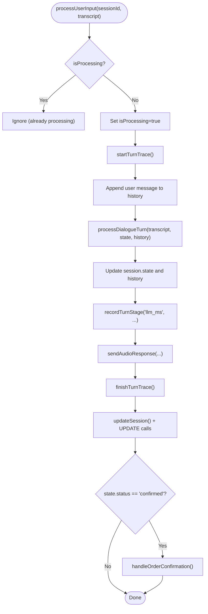

**Diagram sources**
- [sessionPipeline.js:132-219](file://server/src/websocket/sessionPipeline.js#L132-L219)
- [dialogueManager.js:36-132](file://server/src/services/dialogueManager.js#L36-L132)

**Section sources**
- [sessionPipeline.js:132-219](file://server/src/websocket/sessionPipeline.js#L132-L219)
- [dialogueManager.js:36-132](file://server/src/services/dialogueManager.js#L36-L132)

### Audio Response Streaming and Channel-Specific Handling
- sendAudioResponse synthesizes speech and streams chunks to the correct channel:
  - Twilio/Exotel: sends media frames with base64 payload.
  - Web: sends ai_response messages with base64 audio and metadata.
- Error handling returns partial responses when synthesis fails.

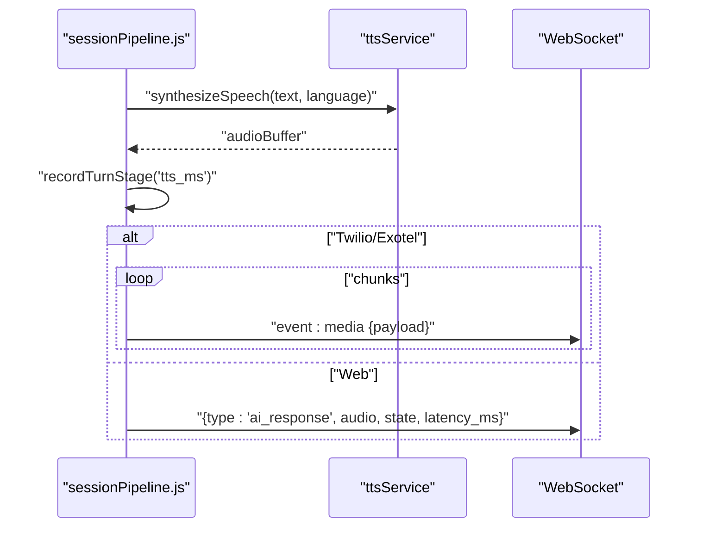

**Diagram sources**
- [sessionPipeline.js:224-294](file://server/src/websocket/sessionPipeline.js#L224-L294)

**Section sources**
- [sessionPipeline.js:224-294](file://server/src/websocket/sessionPipeline.js#L224-L294)

### Order Confirmation and Asynchronous Fulfillment
- When state reaches confirmed:
  - Geocodes spoken address asynchronously and saves it; may trigger pin-drop messaging.
  - Persists master order with item snapshots authoritatively.
  - Offloads kitchen dispatch and notification sending to queues/workers.
  - Updates call record with order_id and increments customer order count.

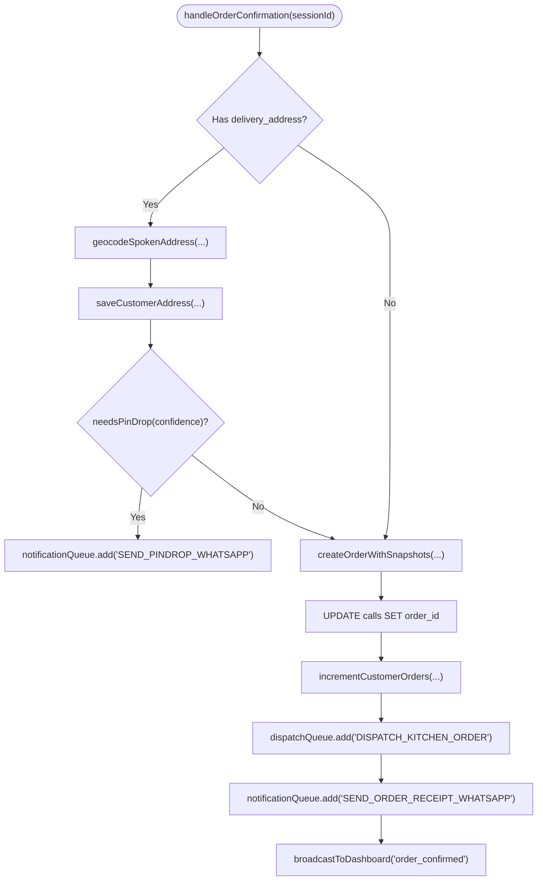

**Diagram sources**
- [sessionPipeline.js:299-389](file://server/src/websocket/sessionPipeline.js#L299-L389)

**Section sources**
- [sessionPipeline.js:299-389](file://server/src/websocket/sessionPipeline.js#L299-L389)

### Session Termination and Resource Cleanup
- endSession:
  - Ends STT stream.
  - Marks call completed in database with ended_at timestamp.
  - Offloads combined audio recording to worker queue.
  - Broadcasts call_ended summary.
  - Removes session from memory and deletes ephemeral Redis entry.

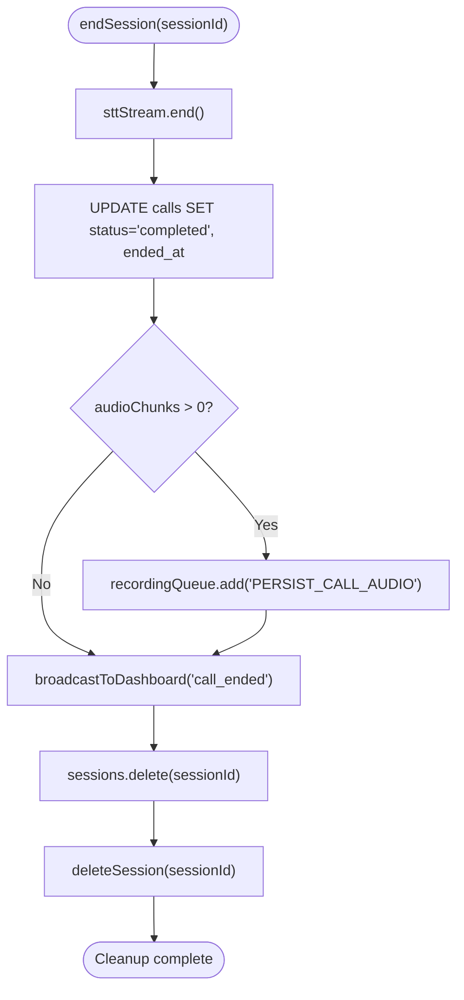

**Diagram sources**
- [sessionPipeline.js:394-437](file://server/src/websocket/sessionPipeline.js#L394-L437)

**Section sources**
- [sessionPipeline.js:394-437](file://server/src/websocket/sessionPipeline.js#L394-L437)

### Ephemeral and Persistent Storage Integration
- Ephemeral store:
  - Redis-backed with TTL (default 1 hour); supports get/update/delete/touch/listActiveSessions.
  - In development, uses in-memory adapter with TTL simulation.
- Persistent store:
  - SQLite schema includes tables for tenants, restaurants, customers, calls, orders, recordings, and related entities.
  - Session pipeline writes call records, transcripts, state snapshots, and average latency; order confirmation writes orders and links call_id.

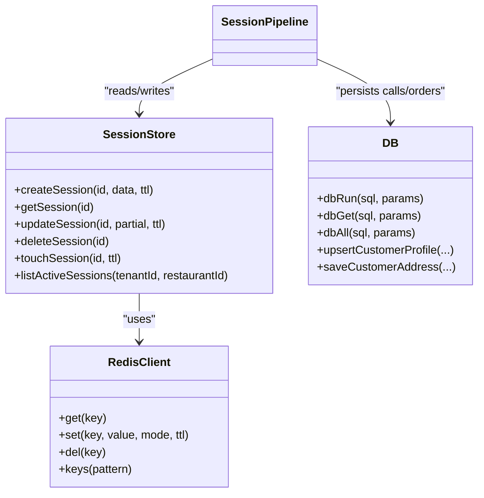

**Diagram sources**
- [sessionStore.js:13-92](file://server/src/infra/sessionStore.js#L13-L92)
- [redisClient.js:82-125](file://server/src/infra/redisClient.js#L82-L125)
- [db.js:60-120](file://server/src/db.js#L60-L120)
- [001_initial_multitenant_schema.sql:129-221](file://server/src/db/migrations/001_initial_multitenant_schema.sql#L129-L221)

**Section sources**
- [sessionStore.js:13-92](file://server/src/infra/sessionStore.js#L13-L92)
- [redisClient.js:82-125](file://server/src/infra/redisClient.js#L82-L125)
- [db.js:60-120](file://server/src/db.js#L60-L120)
- [001_initial_multitenant_schema.sql:129-221](file://server/src/db/migrations/001_initial_multitenant_schema.sql#L129-L221)

### Latency Tracking Mechanisms
- startTurnTrace initializes per-turn timing across VAD, STT, LLM, TTS stages.
- recordTurnStage captures stage durations and metadata.
- finishTurnTrace computes total measured vs stage sum, logs metrics, and persists to turn_metrics table.
- The pipeline records llm_ms and tts_ms stages around dialogue and TTS steps.

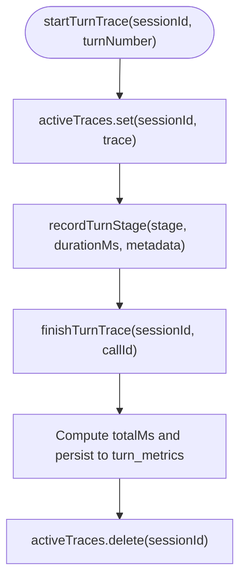

**Diagram sources**
- [latencyTracer.js:12-90](file://server/src/services/latencyTracer.js#L12-L90)
- [sessionPipeline.js:132-219](file://server/src/websocket/sessionPipeline.js#L132-L219)

**Section sources**
- [latencyTracer.js:12-90](file://server/src/services/latencyTracer.js#L12-L90)
- [sessionPipeline.js:132-219](file://server/src/websocket/sessionPipeline.js#L132-L219)

### Relationship Between Sessions and WebSocket Connections
- Each stream handler binds a session to its WebSocket instance and forwards media/messages accordingly.
- On connection close or stop events, handlers invoke endSession to ensure cleanup.
- The WebSocket server performs periodic liveness checks and terminates unresponsive connections.

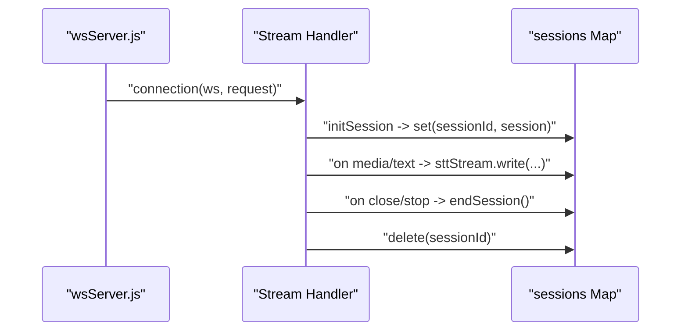

**Diagram sources**
- [wsServer.js:129-147](file://server/src/websocket/wsServer.js#L129-L147)
- [mediaStreamHandler.js:21-69](file://server/src/websocket/mediaStreamHandler.js#L21-L69)
- [webStreamHandler.js:14-81](file://server/src/websocket/webStreamHandler.js#L14-L81)
- [exotelStreamHandler.js:23-80](file://server/src/websocket/exotelStreamHandler.js#L23-L80)

**Section sources**
- [wsServer.js:129-147](file://server/src/websocket/wsServer.js#L129-L147)
- [mediaStreamHandler.js:21-69](file://server/src/websocket/mediaStreamHandler.js#L21-L69)
- [webStreamHandler.js:14-81](file://server/src/websocket/webStreamHandler.js#L14-L81)
- [exotelStreamHandler.js:23-80](file://server/src/websocket/exotelStreamHandler.js#L23-L80)

## Dependency Analysis
- wsServer depends on wsTicketService for authentication and routes to specific stream handlers.
- Stream handlers depend on sessionPipeline for lifecycle orchestration.
- sessionPipeline depends on:
  - sessionStore for ephemeral caching
  - db for persistent call/order records
  - dialogueManager for conversational state and actions
  - latencyTracer for performance metrics
  - queueManager for async dispatch and notifications
- redisClient provides either external Redis or in-memory fallback for tickets and sessions.

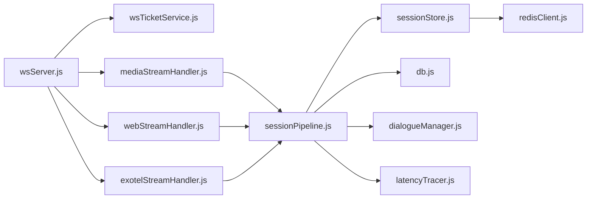

**Diagram sources**
- [wsServer.js:17-147](file://server/src/websocket/wsServer.js#L17-L147)
- [wsTicketService.js:11-85](file://server/src/services/wsTicketService.js#L11-L85)
- [mediaStreamHandler.js:7-69](file://server/src/websocket/mediaStreamHandler.js#L7-L69)
- [webStreamHandler.js:7-81](file://server/src/websocket/webStreamHandler.js#L7-L81)
- [exotelStreamHandler.js:9-80](file://server/src/websocket/exotelStreamHandler.js#L9-L80)
- [sessionPipeline.js:24-437](file://server/src/websocket/sessionPipeline.js#L24-L437)
- [sessionStore.js:13-92](file://server/src/infra/sessionStore.js#L13-L92)
- [redisClient.js:82-125](file://server/src/infra/redisClient.js#L82-L125)
- [db.js:60-120](file://server/src/db.js#L60-L120)
- [latencyTracer.js:12-90](file://server/src/services/latencyTracer.js#L12-L90)
- [dialogueManager.js:36-132](file://server/src/services/dialogueManager.js#L36-L132)

**Section sources**
- [wsServer.js:17-147](file://server/src/websocket/wsServer.js#L17-L147)
- [sessionPipeline.js:24-437](file://server/src/websocket/sessionPipeline.js#L24-L437)
- [sessionStore.js:13-92](file://server/src/infra/sessionStore.js#L13-L92)
- [redisClient.js:82-125](file://server/src/infra/redisClient.js#L82-L125)
- [db.js:60-120](file://server/src/db.js#L60-L120)
- [latencyTracer.js:12-90](file://server/src/services/latencyTracer.js#L12-L90)
- [dialogueManager.js:36-132](file://server/src/services/dialogueManager.js#L36-L132)

## Performance Considerations
- Low-latency audio streaming: Immediate TTS response sent to minimize round-trip time.
- Chunked media transmission: Media frames sent in small chunks to reduce buffering delays.
- Ephemeral caching: Redis-backed session store reduces DB pressure for frequent reads/writes during active sessions.
- Async offloading: Order fulfillment, notifications, and recording persistence are queued to avoid blocking the main flow.
- Heartbeat monitoring: Prevents resource leaks from stale connections.

[No sources needed since this section provides general guidance]

## Troubleshooting Guide
- Missing tenant context:
  - Symptom: Session initialization fails immediately.
  - Cause: tenantId or restaurantId not provided.
  - Action: Ensure stream tickets include tenant and restaurant identifiers.
- WebSocket upgrade failures:
  - Symptom: 401/403 responses during upgrade.
  - Cause: Invalid or expired tickets/tokens; insufficient roles for dashboard.
  - Action: Regenerate tickets; verify token validity and roles.
- STT/TTS errors:
  - Symptom: No audio or incomplete responses.
  - Cause: Service errors or network issues.
  - Action: Check logs; handle fallback responses; retry or degrade gracefully.
- Stale sessions:
  - Symptom: Memory grows; sessions not cleaned up.
  - Cause: Connection drops without close/stop events.
  - Action: Rely on heartbeat termination; ensure handlers call endSession on close.
- Redis connectivity:
  - Symptom: Session store operations fail in production.
  - Cause: Missing REDIS_URL or connection errors.
  - Action: Configure REDIS_URL; monitor logs; in dev, in-memory adapter is used automatically.

**Section sources**
- [sessionPipeline.js:24-30](file://server/src/websocket/sessionPipeline.js#L24-L30)
- [wsServer.js:34-116](file://server/src/websocket/wsServer.js#L34-L116)
- [sessionPipeline.js:282-294](file://server/src/websocket/sessionPipeline.js#L282-L294)
- [wsServer.js:149-158](file://server/src/websocket/wsServer.js#L149-L158)
- [redisClient.js:82-125](file://server/src/infra/redisClient.js#L82-L125)

## Conclusion
The voice session lifecycle system provides a robust, multi-channel architecture with strict tenant isolation, ephemeral caching, persistent auditing, and detailed latency tracking. It ensures reliable session initialization, efficient conversation processing, and safe cleanup. By leveraging tickets for secure upgrades, Redis for fast state, and queues for background work, the system balances responsiveness with durability. Proper error handling and heartbeats protect resources and maintain operational stability.

[No sources needed since this section summarizes without analyzing specific files]