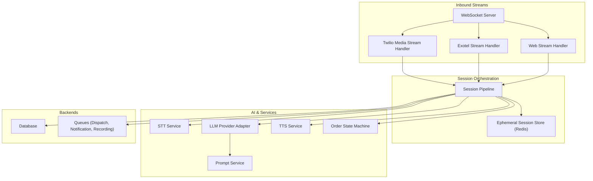
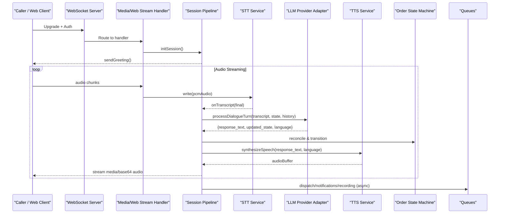
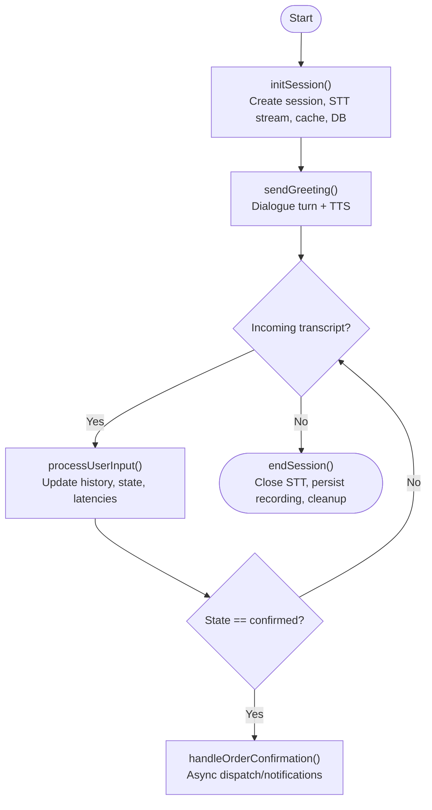
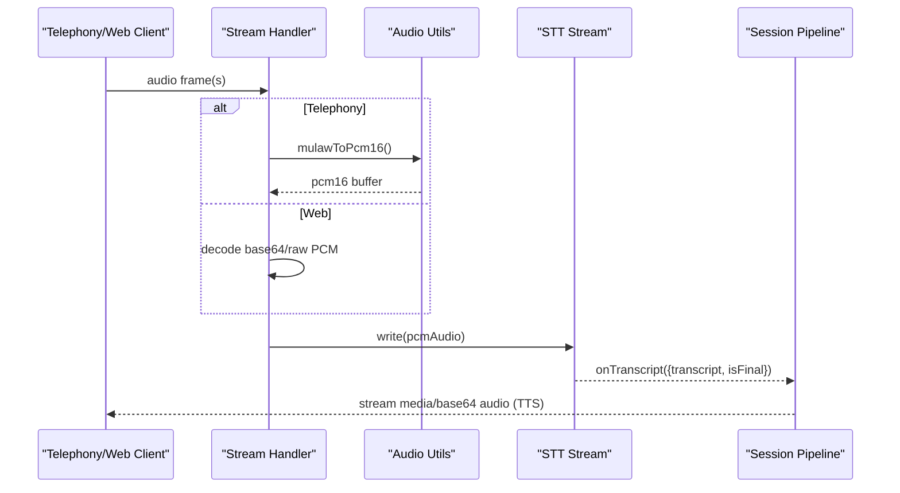
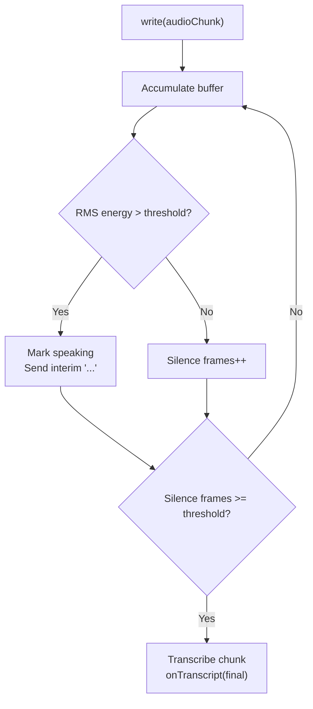
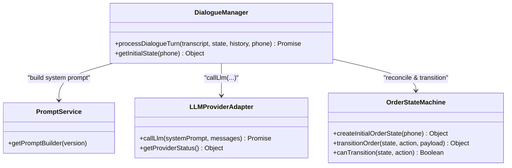
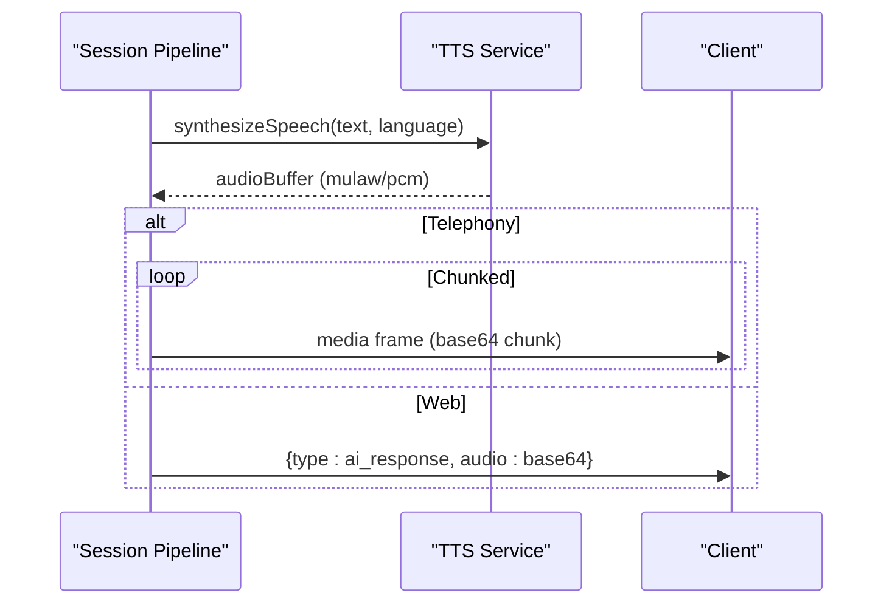
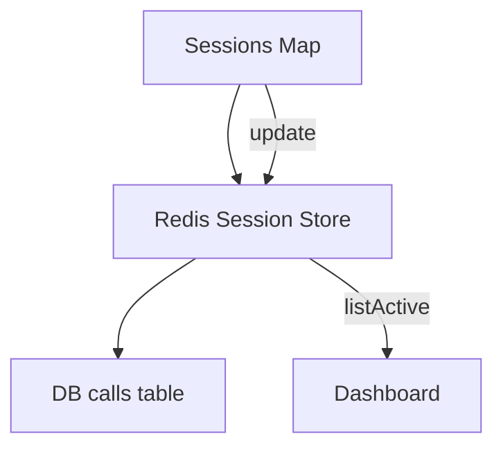
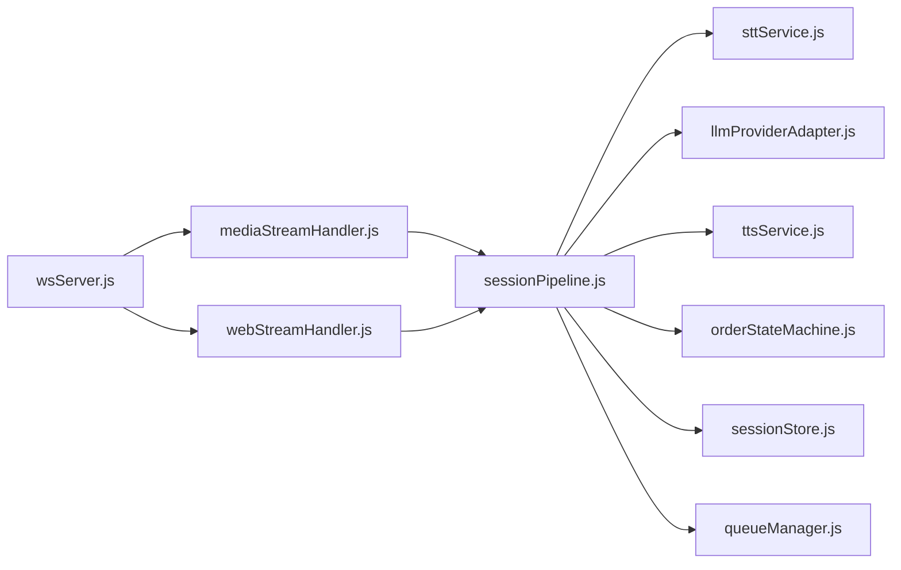

# Voice Session Pipeline

<cite>
**Referenced Files in This Document**
- [sessionPipeline.js](file://server/src/websocket/sessionPipeline.js)
- [mediaStreamHandler.js](file://server/src/websocket/mediaStreamHandler.js)
- [webStreamHandler.js](file://server/src/websocket/webStreamHandler.js)
- [wsServer.js](file://server/src/websocket/wsServer.js)
- [sttService.js](file://server/src/services/sttService.js)
- [ttsService.js](file://server/src/services/ttsService.js)
- [dialogueManager.js](file://server/src/services/dialogueManager.js)
- [promptService.js](file://server/src/services/promptService.js)
- [llmProviderAdapter.js](file://server/src/services/llmProviderAdapter.js)
- [orderStateMachine.js](file://server/src/domain/orders/orderStateMachine.js)
- [audioUtils.js](file://server/src/utils/audioUtils.js)
- [sessionStore.js](file://server/src/infra/sessionStore.js)
- [env.js](file://server/src/config/env.js)
</cite>

## Table of Contents
1. [Introduction](#introduction)
2. [Project Structure](#project-structure)
3. [Core Components](#core-components)
4. [Architecture Overview](#architecture-overview)
5. [Detailed Component Analysis](#detailed-component-analysis)
6. [Dependency Analysis](#dependency-analysis)
7. [Performance Considerations](#performance-considerations)
8. [Troubleshooting Guide](#troubleshooting-guide)
9. [Conclusion](#conclusion)
10. [Appendices](#appendices)

## Introduction
This document explains the voice session pipeline that orchestrates end-to-end call processing: from session initialization and greeting delivery, through bidirectional audio streaming to speech-to-text (STT), AI dialogue processing with prompt management and response generation, to text-to-speech (TTS) synthesis and streaming back to callers or web clients. It also covers session state management, error handling during network interruptions, performance optimization techniques, and configuration options for audio quality, latency thresholds, and timeouts.

## Project Structure
The voice pipeline is implemented on the server side with a WebSocket-based architecture that supports multiple inbound streams (Twilio PSTN media stream, Exotel, and Web Audio). The core orchestration lives in the session pipeline, which coordinates STT, LLM-driven dialogue, TTS, order state transitions, and asynchronous dispatch/notification workflows.

**Diagram sources**
- [wsServer.js:17-146](file://server/src/websocket/wsServer.js#L17-L146)
- [mediaStreamHandler.js:7-68](file://server/src/websocket/mediaStreamHandler.js#L7-L68)
- [webStreamHandler.js:7-80](file://server/src/websocket/webStreamHandler.js#L7-L80)
- [sessionPipeline.js:24-111](file://server/src/websocket/sessionPipeline.js#L24-L111)
- [sttService.js:329-352](file://server/src/services/sttService.js#L329-L352)
- [llmProviderAdapter.js:226-262](file://server/src/services/llmProviderAdapter.js#L226-L262)
- [promptService.js:112-114](file://server/src/services/promptService.js#L112-L114)
- [ttsService.js:28-70](file://server/src/services/ttsService.js#L28-L70)
- [orderStateMachine.js:46-68](file://server/src/domain/orders/orderStateMachine.js#L46-L68)
- [sessionStore.js:13-29](file://server/src/infra/sessionStore.js#L13-L29)

**Section sources**
- [wsServer.js:17-146](file://server/src/websocket/wsServer.js#L17-L146)
- [mediaStreamHandler.js:7-68](file://server/src/websocket/mediaStreamHandler.js#L7-L68)
- [webStreamHandler.js:7-80](file://server/src/websocket/webStreamHandler.js#L7-L80)
- [sessionPipeline.js:24-111](file://server/src/websocket/sessionPipeline.js#L24-L111)

## Core Components
- WebSocket Coordinator: Accepts and authenticates connections for telephony and web streams, then routes to appropriate handlers.
- Media Stream Handlers: Convert incoming audio formats, buffer chunks, and forward to STT; manage session lifecycle events.
- Session Pipeline: Orchestrates STT transcription, dialogue turns, TTS synthesis, order state transitions, and async fulfillment.
- STT Service: Multi-provider streaming/batch transcription with VAD-like chunking and fallbacks.
- LLM Provider Adapter: Universal router with provider fallback cascade and strict JSON parsing/validation.
- Prompt Service: Versioned system prompts with caller context and menu injection.
- TTS Service: Multi-provider synthesis with caching and telephony-friendly codec conversion.
- Order State Machine: Authoritative state transitions and pricing reconciliation.
- Ephemeral Session Store: Redis-backed session persistence with TTL and multi-instance discovery.

**Section sources**
- [wsServer.js:17-146](file://server/src/websocket/wsServer.js#L17-L146)
- [mediaStreamHandler.js:7-68](file://server/src/websocket/mediaStreamHandler.js#L7-L68)
- [webStreamHandler.js:7-80](file://server/src/websocket/webStreamHandler.js#L7-L80)
- [sessionPipeline.js:24-437](file://server/src/websocket/sessionPipeline.js#L24-L437)
- [sttService.js:329-603](file://server/src/services/sttService.js#L329-L603)
- [llmProviderAdapter.js:17-283](file://server/src/services/llmProviderAdapter.js#L17-L283)
- [promptService.js:8-114](file://server/src/services/promptService.js#L8-L114)
- [ttsService.js:14-187](file://server/src/services/ttsService.js#L14-L187)
- [orderStateMachine.js:8-325](file://server/src/domain/orders/orderStateMachine.js#L8-L325)
- [sessionStore.js:1-92](file://server/src/infra/sessionStore.js#L1-L92)

## Architecture Overview
The pipeline follows a real-time, event-driven flow:
- Inbound audio arrives via WebSocket streams (Twilio/Exotel/Web).
- Audio chunks are buffered, converted if needed, and streamed into an STT session.
- Final transcripts trigger dialogue turns processed by the LLM adapter with versioned prompts.
- Dialogue results update the authoritative order state machine and generate spoken responses via TTS.
- Responses are streamed back as media frames (telephony) or base64 audio (web).
- Order confirmations trigger asynchronous dispatch and notifications; recordings are persisted off the hot path.

**Diagram sources**
- [wsServer.js:17-146](file://server/src/websocket/wsServer.js#L17-L146)
- [mediaStreamHandler.js:21-55](file://server/src/websocket/mediaStreamHandler.js#L21-L55)
- [webStreamHandler.js:23-69](file://server/src/websocket/webStreamHandler.js#L23-L69)
- [sessionPipeline.js:54-127](file://server/src/websocket/sessionPipeline.js#L54-L127)
- [sttService.js:358-453](file://server/src/services/sttService.js#L358-L453)
- [llmProviderAdapter.js:226-262](file://server/src/services/llmProviderAdapter.js#L226-L262)
- [ttsService.js:28-70](file://server/src/services/ttsService.js#L28-L70)
- [orderStateMachine.js:154-325](file://server/src/domain/orders/orderStateMachine.js#L154-L325)

## Detailed Component Analysis

### Session Lifecycle Management
- Initialization: Creates an in-memory session object, initializes STT stream, persists ephemeral session metadata, records DB row, and broadcasts start events.
- Greeting: Triggers a dialogue turn with empty input to produce a welcome message and immediately synthesizes audio.
- Turn Processing: Enforces single-turn processing guard, logs events, updates conversation history, tracks latencies, and persists state changes.
- Termination: Ends STT stream, finalizes DB status, offloads recording to worker queue, broadcasts summary, and cleans up sessions.

**Diagram sources**
- [sessionPipeline.js:24-111](file://server/src/websocket/sessionPipeline.js#L24-L111)
- [sessionPipeline.js:116-127](file://server/src/websocket/sessionPipeline.js#L116-L127)
- [sessionPipeline.js:132-219](file://server/src/websocket/sessionPipeline.js#L132-L219)
- [sessionPipeline.js:299-389](file://server/src/websocket/sessionPipeline.js#L299-L389)
- [sessionPipeline.js:394-437](file://server/src/websocket/sessionPipeline.js#L394-L437)

**Section sources**
- [sessionPipeline.js:24-111](file://server/src/websocket/sessionPipeline.js#L24-L111)
- [sessionPipeline.js:116-127](file://server/src/websocket/sessionPipeline.js#L116-L127)
- [sessionPipeline.js:132-219](file://server/src/websocket/sessionPipeline.js#L132-L219)
- [sessionPipeline.js:394-437](file://server/src/websocket/sessionPipeline.js#L394-L437)

### Bidirectional Audio Streaming
- Twilio/Exotel: Receives mu-law frames, converts to PCM16, buffers chunks, writes to STT stream, and streams TTS output back as media frames.
- Web: Accepts base64-encoded audio files or raw PCM, transcribes via batch API or streaming, returns interim/final transcripts, and sends TTS audio as base64.

**Diagram sources**
- [mediaStreamHandler.js:40-49](file://server/src/websocket/mediaStreamHandler.js#L40-L49)
- [webStreamHandler.js:28-69](file://server/src/websocket/webStreamHandler.js#L28-L69)
- [audioUtils.js:26-33](file://server/src/utils/audioUtils.js#L26-L33)
- [sttService.js:358-453](file://server/src/services/sttService.js#L358-L453)

**Section sources**
- [mediaStreamHandler.js:7-68](file://server/src/websocket/mediaStreamHandler.js#L7-L68)
- [webStreamHandler.js:7-80](file://server/src/websocket/webStreamHandler.js#L7-L80)
- [audioUtils.js:1-84](file://server/src/utils/audioUtils.js#L1-L84)

### STT Processing and Buffering
- Providers: Groq Whisper (batch with VAD-like chunking), Google Cloud streaming, local Whisper Tiny, and mock fallback.
- Buffering: Accumulates audio until silence detection triggers transcription; emits interim and final transcripts.
- Language Handling: Supports Tamil and English with hints loaded from catalog.

**Diagram sources**
- [sttService.js:358-453](file://server/src/services/sttService.js#L358-L453)
- [sttService.js:521-603](file://server/src/services/sttService.js#L521-L603)

**Section sources**
- [sttService.js:329-603](file://server/src/services/sttService.js#L329-L603)

### AI Dialogue Processing and Prompt Management
- Prompt Builder: Versioned system prompts inject catalog and caller context; default v2 used unless configured otherwise.
- LLM Adapter: Calls primary provider with fallback cascade (Ollama/Groq/Gemini/OpenRouter); parses and validates JSON strictly.
- Reconciliation: Applies proposed actions to the authoritative order state machine and recalculates pricing.

**Diagram sources**
- [promptService.js:8-114](file://server/src/services/promptService.js#L8-L114)
- [llmProviderAdapter.js:17-283](file://server/src/services/llmProviderAdapter.js#L17-L283)
- [dialogueManager.js:36-84](file://server/src/services/dialogueManager.js#L36-L84)
- [orderStateMachine.js:46-325](file://server/src/domain/orders/orderStateMachine.js#L46-L325)

**Section sources**
- [promptService.js:8-114](file://server/src/services/promptService.js#L8-L114)
- [llmProviderAdapter.js:17-283](file://server/src/services/llmProviderAdapter.js#L17-L283)
- [dialogueManager.js:36-84](file://server/src/services/dialogueManager.js#L36-L84)
- [orderStateMachine.js:46-325](file://server/src/domain/orders/orderStateMachine.js#L46-L325)

### Text-to-Speech Synthesis and Streaming
- Providers: Sarvam AI, Google Cloud TTS, and mock generator; selected via environment variable with fallback chain.
- Caching: In-memory cache keyed by provider/language/text reduces repeated synthesis cost.
- Streaming: For telephony, audio is chunked and sent as media frames; for web, full base64 audio is returned.

**Diagram sources**
- [ttsService.js:28-70](file://server/src/services/ttsService.js#L28-L70)
- [sessionPipeline.js:224-294](file://server/src/websocket/sessionPipeline.js#L224-L294)

**Section sources**
- [ttsService.js:14-187](file://server/src/services/ttsService.js#L14-L187)
- [sessionPipeline.js:224-294](file://server/src/websocket/sessionPipeline.js#L224-L294)

### Session State Management
- In-memory Map: Active sessions tracked per process with guards against concurrent processing.
- Ephemeral Persistence: Redis-backed session store with TTL and tenant/restaurant scoping for distributed discovery.
- Database Records: Call rows updated with session state, transcript snapshots, and average latency.

**Diagram sources**
- [wsServer.js:11-12](file://server/src/websocket/wsServer.js#L11-L12)
- [sessionStore.js:13-92](file://server/src/infra/sessionStore.js#L13-L92)
- [sessionPipeline.js:77-111](file://server/src/websocket/sessionPipeline.js#L77-L111)
- [sessionPipeline.js:199-213](file://server/src/websocket/sessionPipeline.js#L199-L213)

**Section sources**
- [wsServer.js:11-12](file://server/src/websocket/wsServer.js#L11-L12)
- [sessionStore.js:13-92](file://server/src/infra/sessionStore.js#L13-L92)
- [sessionPipeline.js:77-111](file://server/src/websocket/sessionPipeline.js#L77-L111)
- [sessionPipeline.js:199-213](file://server/src/websocket/sessionPipeline.js#L199-L213)

### Error Handling During Network Interruptions
- STT Stream Errors: Logged and ignored where appropriate; fallback providers invoked automatically.
- LLM Provider Failures: Cascade to next provider; if all fail, fallback to rule engine.
- TTS Errors: Logs errors and still returns minimal response for web clients; telephony continues with available audio.
- Connection Close: Ensures session termination and cleanup even on abrupt disconnects.

**Section sources**
- [sttService.js:494-515](file://server/src/services/sttService.js#L494-L515)
- [llmProviderAdapter.js:234-262](file://server/src/services/llmProviderAdapter.js#L234-L262)
- [sessionPipeline.js:282-294](file://server/src/websocket/sessionPipeline.js#L282-L294)
- [mediaStreamHandler.js:62-68](file://server/src/websocket/mediaStreamHandler.js#L62-L68)

### Performance Optimization Techniques
- Audio Chunk Size: Telephony media frames use fixed chunk sizes for low-latency streaming.
- Memory Cap: Limits active call memory usage to prevent unbounded growth.
- STT VAD-like Chunking: Reduces transcription overhead by detecting silence boundaries.
- TTS Caching: Avoids redundant synthesis for repeated prompts.
- Async Offloading: Dispatch, notifications, and recording persisted asynchronously to keep hot path fast.
- Heartbeat: WebSocket liveness checks terminate dead connections promptly.

**Section sources**
- [sessionPipeline.js:18-18](file://server/src/websocket/sessionPipeline.js#L18-L18)
- [sttService.js:366-422](file://server/src/services/sttService.js#L366-L422)
- [ttsService.js:14-17](file://server/src/services/ttsService.js#L14-L17)
- [sessionPipeline.js:299-389](file://server/src/websocket/sessionPipeline.js#L299-L389)
- [wsServer.js:149-158](file://server/src/websocket/wsServer.js#L149-L158)

## Dependency Analysis
The pipeline exhibits clear separation of concerns:
- Handlers depend on the session pipeline for lifecycle and orchestration.
- Session pipeline depends on STT, LLM adapter, TTS, order state machine, and queues.
- LLM adapter abstracts provider differences and provides robust fallback.
- STT and TTS services encapsulate provider-specific logic and codecs.

**Diagram sources**
- [wsServer.js:17-146](file://server/src/websocket/wsServer.js#L17-L146)
- [mediaStreamHandler.js:7-68](file://server/src/websocket/mediaStreamHandler.js#L7-L68)
- [webStreamHandler.js:7-80](file://server/src/websocket/webStreamHandler.js#L7-L80)
- [sessionPipeline.js:24-437](file://server/src/websocket/sessionPipeline.js#L24-L437)

**Section sources**
- [wsServer.js:17-146](file://server/src/websocket/wsServer.js#L17-L146)
- [sessionPipeline.js:24-437](file://server/src/websocket/sessionPipeline.js#L24-L437)

## Performance Considerations
- Configure STT provider based on latency requirements:
  - Use Groq Whisper for high accuracy with batch mode and VAD-like chunking.
  - Use Google Cloud streaming for lower latency when credentials are available.
  - Use local Whisper Tiny for offline development scenarios.
- Tune TTS provider and caching:
  - Prefer Sarvam AI for Indian accents; enable caching to reduce latency for repeated prompts.
- Set timeouts appropriately:
  - STT and LLM calls include timeouts to avoid hanging requests.
- Monitor latencies:
  - Track per-turn latencies and average across sessions for SLOs.
- Optimize audio codecs:
  - Ensure mu-law for telephony and PCM16 for STT engines to minimize conversions.

[No sources needed since this section provides general guidance]

## Troubleshooting Guide
- No STT Output:
  - Verify STT provider configuration and API keys; check fallback behavior and logs.
- LLM Errors:
  - Check provider availability and fallback chain; ensure valid JSON output parsing.
- TTS Failures:
  - Validate provider keys; inspect cached entries and fallback to mock if needed.
- Connection Drops:
  - Ensure heartbeat mechanism terminates dead connections; verify session cleanup on close.
- High Memory Usage:
  - Review audio chunk buffering limits and session caps; monitor active sessions.

**Section sources**
- [sttService.js:494-515](file://server/src/services/sttService.js#L494-L515)
- [llmProviderAdapter.js:234-262](file://server/src/services/llmProviderAdapter.js#L234-L262)
- [ttsService.js:40-60](file://server/src/services/ttsService.js#L40-L60)
- [mediaStreamHandler.js:62-68](file://server/src/websocket/mediaStreamHandler.js#L62-L68)
- [sessionPipeline.js:18-18](file://server/src/websocket/sessionPipeline.js#L18-L18)

## Conclusion
The voice session pipeline provides a robust, scalable architecture for real-time voice interactions. It integrates multi-provider STT and TTS, resilient LLM routing, authoritative order state management, and efficient streaming. With configurable providers, caching, and asynchronous offloading, it balances latency, accuracy, and reliability while supporting diverse deployment environments.

[No sources needed since this section summarizes without analyzing specific files]

## Appendices

### Configuration Options
- Environment Variables:
  - AI_STT_PROVIDER: Select STT provider (groq/google/mock).
  - AI_TTS_PROVIDER: Select TTS provider (sarvam/google/mock).
  - AI_LLM_PROVIDER: Primary LLM provider (ollama/groq/gemini/openrouter).
  - AI_PROMPT_VERSION: Prompt version (v1/v2).
  - GROQ_API_KEY, SARVAM_API_KEY, GEMINI_API_KEY, OPENROUTER_API_KEY: Provider credentials.
  - PORT, NODE_ENV, DB_PATH, REDIS_URL, CORS_ORIGINS, ENCRYPTION_KEY, GOOGLE_MAPS_API_KEY: System settings.
- Timeouts and Thresholds:
  - STT and LLM calls use timeouts to prevent hangs.
  - STT uses RMS-based silence thresholds to detect speech boundaries.
  - TTS uses in-memory cache with max entries to balance memory and speed.
- Audio Quality:
  - Telephony expects mu-law at 8kHz; STT prefers PCM16 at 8kHz/16kHz.
  - Codec conversions handled by audio utilities to ensure compatibility.

**Section sources**
- [env.js:3-24](file://server/src/config/env.js#L3-L24)
- [sttService.js:329-352](file://server/src/services/sttService.js#L329-L352)
- [ttsService.js:28-70](file://server/src/services/ttsService.js#L28-L70)
- [audioUtils.js:1-84](file://server/src/utils/audioUtils.js#L1-L84)