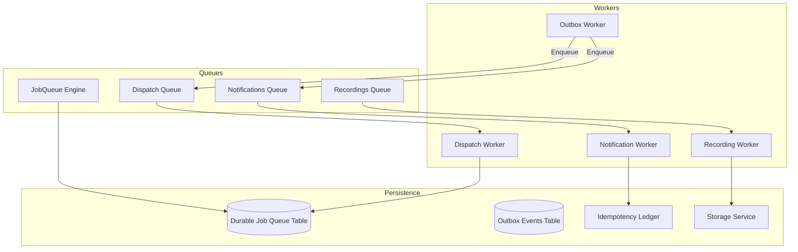
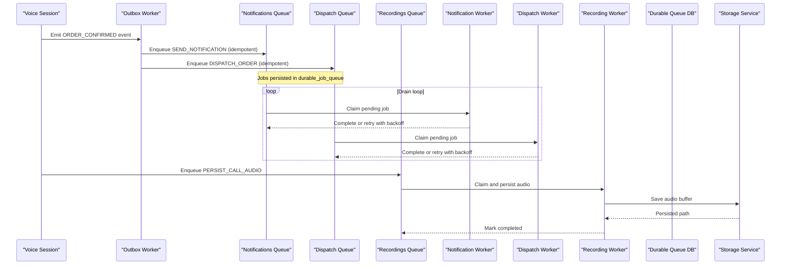
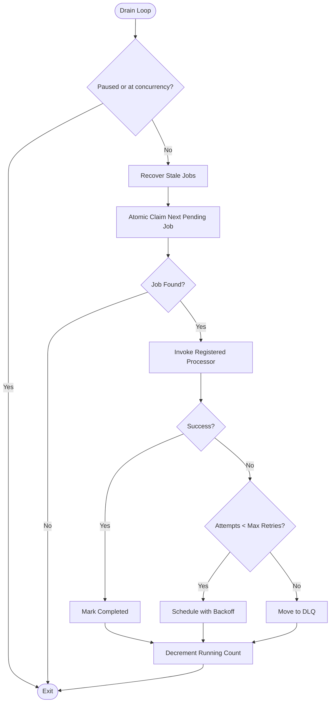
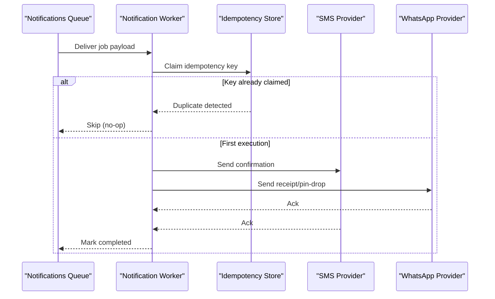
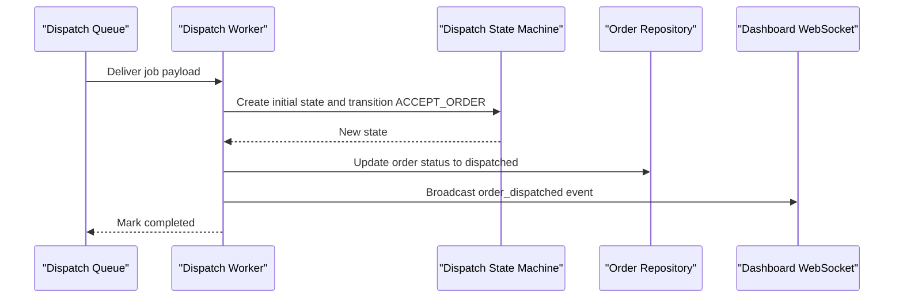
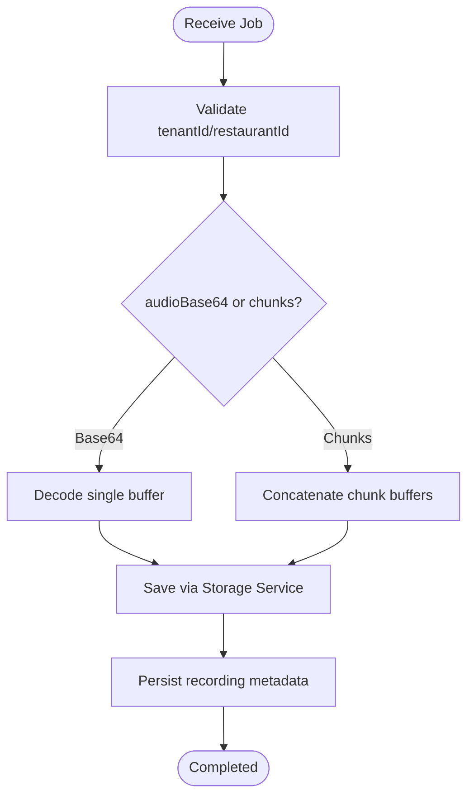
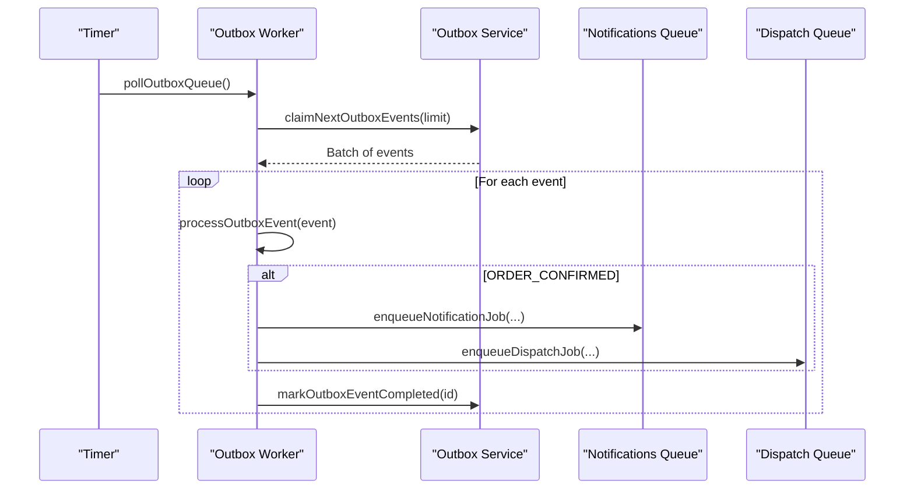
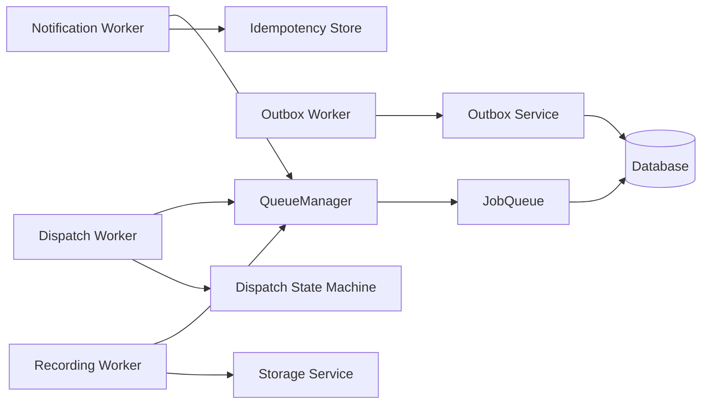

# Asynchronous Processing & Queues

<cite>
**Referenced Files in This Document**
- [jobQueue.js](file://server/src/queue/jobQueue.js)
- [queueManager.js](file://server/src/queue/queueManager.js)
- [dispatch.worker.js](file://server/src/workers/dispatch.worker.js)
- [notification.worker.js](file://server/src/workers/notification.worker.js)
- [recording.worker.js](file://server/src/workers/recording.worker.js)
- [outbox.worker.js](file://server/src/workers/outbox.worker.js)
- [007_durable_job_queue.sql](file://server/src/db/migrations/007_durable_job_queue.sql)
- [idempotencyStore.js](file://server/src/infra/idempotencyStore.js)
- [storageService.js](file://server/src/infra/storageService.js)
- [outbox.service.js](file://server/src/services/outbox.service.js)
- [dispatchStateMachine.js](file://server/src/domain/dispatch/dispatchStateMachine.js)
- [app.js](file://server/src/app.js)
</cite>

## Table of Contents
1. [Introduction](#introduction)
2. [Project Structure](#project-structure)
3. [Core Components](#core-components)
4. [Architecture Overview](#architecture-overview)
5. [Detailed Component Analysis](#detailed-component-analysis)
6. [Dependency Analysis](#dependency-analysis)
7. [Performance Considerations](#performance-considerations)
8. [Troubleshooting Guide](#troubleshooting-guide)
9. [Conclusion](#conclusion)
10. [Appendices](#appendices)

## Introduction
This document explains the asynchronous processing system that handles background tasks triggered by voice sessions. It covers a durable, database-backed queue engine, dedicated queues for notifications, dispatching orders, and persisting call recordings, plus an outbox worker that fans out events to these queues. You will learn how jobs are enqueued, processed with retry/backoff, recovered from crashes, monitored, and scaled. It also includes guidance on adding new queue types, implementing custom workers, monitoring health, and optimizing performance and reliability.

## Project Structure
The async system is implemented as:
- A durable job queue engine backed by a relational database table
- Three named queues: notifications, dispatch, recordings
- Dedicated worker modules that register processors for specific job types
- An outbox worker that polls domain events and enqueues downstream jobs
- Idempotency guarantees via Redis + DB ledger
- Storage service for audio recordings (local and optional cloud)

**Diagram sources**
- [jobQueue.js:14-32](file://server/src/queue/jobQueue.js#L14-L32)
- [queueManager.js:7-11](file://server/src/queue/queueManager.js#L7-L11)
- [outbox.worker.js:97-127](file://server/src/workers/outbox.worker.js#L97-L127)
- [007_durable_job_queue.sql:5-21](file://server/src/db/migrations/007_durable_job_queue.sql#L5-L21)
- [idempotencyStore.js:10-42](file://server/src/infra/idempotencyStore.js#L10-L42)
- [storageService.js:15-90](file://server/src/infra/storageService.js#L15-L90)

**Section sources**
- [jobQueue.js:14-32](file://server/src/queue/jobQueue.js#L14-L32)
- [queueManager.js:7-11](file://server/src/queue/queueManager.js#L7-L11)
- [outbox.worker.js:97-127](file://server/src/workers/outbox.worker.js#L97-L127)
- [007_durable_job_queue.sql:5-21](file://server/src/db/migrations/007_durable_job_queue.sql#L5-L21)

## Core Components
- Durable JobQueue: A database-backed queue with atomic claiming, crash recovery, exponential backoff retries, and DLQ routing for failed jobs.
- Named Queues: Notifications, Dispatch, Recordings, each with configured concurrency and retry policies.
- Workers: Modules that register explicit processors per job type; they implement business logic like sending messages, dispatching orders, and saving recordings.
- Outbox Worker: Polls outbox events and enqueues downstream jobs with idempotency keys.
- Idempotency Store: Prevents duplicate side effects using Redis cache and DB uniqueness constraints.
- Storage Service: Persists audio buffers locally and optionally to cloud storage.

Key behaviors:
- Zero-lost jobs across process restarts due to persistence and stale-job recovery.
- Strict processor registration per job type prevents accidental misrouting.
- Backoff scheduling uses scheduled_at to defer retries.
- DLQ marks unrecoverable jobs for inspection.

**Section sources**
- [jobQueue.js:48-76](file://server/src/queue/jobQueue.js#L48-L76)
- [jobQueue.js:92-102](file://server/src/queue/jobQueue.js#L92-L102)
- [jobQueue.js:107-212](file://server/src/queue/jobQueue.js#L107-L212)
- [queueManager.js:7-11](file://server/src/queue/queueManager.js#L7-L11)
- [outbox.service.js:8-30](file://server/src/services/outbox.service.js#L8-L30)
- [idempotencyStore.js:10-42](file://server/src/infra/idempotencyStore.js#L10-L42)
- [storageService.js:15-90](file://server/src/infra/storageService.js#L15-L90)

## Architecture Overview
The system combines a durable job queue with an outbox pattern to ensure reliable delivery of side effects after order confirmation. The outbox worker claims events atomically and enqueues typed jobs into dedicated queues. Each queue runs multiple concurrent workers with backoff and DLQ handling.

**Diagram sources**
- [outbox.worker.js:14-92](file://server/src/workers/outbox.worker.js#L14-L92)
- [queueManager.js:80-102](file://server/src/queue/queueManager.js#L80-L102)
- [jobQueue.js:107-212](file://server/src/queue/jobQueue.js#L107-L212)
- [recording.worker.js:10-50](file://server/src/workers/recording.worker.js#L10-L50)
- [storageService.js:40-90](file://server/src/infra/storageService.js#L40-L90)

## Detailed Component Analysis

### Durable JobQueue Engine
- Concurrency control: configurable per queue instance; limits simultaneous processing.
- Atomic claim: transactional select-and-update ensures only one worker processes a job.
- Crash recovery: stale jobs older than a threshold revert to pending.
- Retry policy: exponential backoff with max retries; beyond limit moves to DLQ.
- Monitoring: stats endpoint returns counts by status.

**Diagram sources**
- [jobQueue.js:107-212](file://server/src/queue/jobQueue.js#L107-L212)

**Section sources**
- [jobQueue.js:14-32](file://server/src/queue/jobQueue.js#L14-L32)
- [jobQueue.js:48-76](file://server/src/queue/jobQueue.js#L48-L76)
- [jobQueue.js:92-102](file://server/src/queue/jobQueue.js#L92-L102)
- [jobQueue.js:107-212](file://server/src/queue/jobQueue.js#L107-L212)
- [jobQueue.js:214-248](file://server/src/queue/jobQueue.js#L214-L248)

### Notification Queue and Worker
- Purpose: Send SMS and WhatsApp receipts, payment links, and pin-drop requests.
- Idempotency: Uses idempotency keys to avoid duplicate messaging.
- Job types: SEND_NOTIFICATION, SEND_ORDER_RECEIPT_WHATSAPP, SEND_PINDROP_WHATSAPP.
- Behavior: Skips non-PSTN browser sessions; gracefully handles provider failures.

**Diagram sources**
- [notification.worker.js:10-69](file://server/src/workers/notification.worker.js#L10-L69)
- [idempotencyStore.js:10-42](file://server/src/infra/idempotencyStore.js#L10-L42)

**Section sources**
- [queueManager.js:17-43](file://server/src/queue/queueManager.js#L17-L43)
- [notification.worker.js:10-69](file://server/src/workers/notification.worker.js#L10-L69)
- [idempotencyStore.js:10-42](file://server/src/infra/idempotencyStore.js#L10-L42)

### Dispatch Queue and Worker
- Purpose: Dispatch orders to kitchen or external providers (e.g., ONDC).
- State machine: Enforces valid transitions for dispatch lifecycle.
- Job types: DISPATCH_ORDER, DISPATCH_KITCHEN_ORDER.
- Outcome: Updates order status and broadcasts to dashboard.

**Diagram sources**
- [dispatch.worker.js:12-53](file://server/src/workers/dispatch.worker.js#L12-L53)
- [dispatchStateMachine.js:30-47](file://server/src/domain/dispatch/dispatchStateMachine.js#L30-L47)
- [dispatchStateMachine.js:82-146](file://server/src/domain/dispatch/dispatchStateMachine.js#L82-L146)

**Section sources**
- [queueManager.js:45-59](file://server/src/queue/queueManager.js#L45-L59)
- [dispatch.worker.js:12-53](file://server/src/workers/dispatch.worker.js#L12-L53)
- [dispatchStateMachine.js:9-28](file://server/src/domain/dispatch/dispatchStateMachine.js#L9-L28)
- [dispatchStateMachine.js:30-47](file://server/src/domain/dispatch/dispatchStateMachine.js#L30-L47)
- [dispatchStateMachine.js:82-146](file://server/src/domain/dispatch/dispatchStateMachine.js#L82-L146)

### Recording Queue and Worker
- Purpose: Persist call recordings from PCM buffers and record metadata.
- Input formats: Single base64 audio or array of chunks; concatenates if needed.
- Output: Saves to local filesystem and optionally uploads to cloud storage; persists DB row with duration and dispute status.

**Diagram sources**
- [recording.worker.js:10-50](file://server/src/workers/recording.worker.js#L10-L50)
- [storageService.js:40-90](file://server/src/infra/storageService.js#L40-L90)

**Section sources**
- [queueManager.js:61-72](file://server/src/queue/queueManager.js#L61-L72)
- [recording.worker.js:10-50](file://server/src/workers/recording.worker.js#L10-L50)
- [storageService.js:40-90](file://server/src/infra/storageService.js#L40-L90)

### Outbox Worker
- Purpose: Reliable fan-out from domain events to queues with locking and backoff.
- Mechanism: Claims batches of pending events atomically; processes with lock; marks completed or failed with retry schedule.
- Integration: Enqueues notification and dispatch jobs with idempotency keys; broadcasts updates to dashboard.

**Diagram sources**
- [outbox.worker.js:97-127](file://server/src/workers/outbox.worker.js#L97-L127)
- [outbox.service.js:54-93](file://server/src/services/outbox.service.js#L54-L93)
- [outbox.service.js:110-140](file://server/src/services/outbox.service.js#L110-L140)

**Section sources**
- [outbox.worker.js:14-92](file://server/src/workers/outbox.worker.js#L14-L92)
- [outbox.service.js:8-30](file://server/src/services/outbox.service.js#L8-L30)
- [outbox.service.js:54-93](file://server/src/services/outbox.service.js#L54-L93)
- [outbox.service.js:110-140](file://server/src/services/outbox.service.js#L110-L140)

### Message Formats, Priorities, and Scaling
- Message format: Jobs carry a type string and a data object; payloads are serialized to JSON and stored in the durable queue table.
- Priority: FIFO within a queue by insertion order (ordered by id); no priority field is used.
- Scaling:
  - Per-queue concurrency controls parallelism.
  - Multiple worker processes can run concurrently; each has its own drain loop and claims jobs atomically.
  - Outbox worker polls periodically; tune interval based on throughput needs.

**Section sources**
- [jobQueue.js:48-76](file://server/src/queue/jobQueue.js#L48-L76)
- [jobQueue.js:107-143](file://server/src/queue/jobQueue.js#L107-L143)
- [queueManager.js:7-11](file://server/src/queue/queueManager.js#L7-L11)
- [outbox.worker.js:121-127](file://server/src/workers/outbox.worker.js#L121-L127)

### Adding New Queue Types and Custom Workers
Steps to add a new queue and worker:
1. Define a new queue instance with desired concurrency and retries.
2. Register a processor function for the job type(s).
3. Implement a worker module that registers handlers for your job types.
4. Enqueue jobs from services or controllers using helper functions.
5. Add tests to verify processing and idempotency.

Example references:
- Creating a queue and registering processors: [queueManager.js:7-11](file://server/src/queue/queueManager.js#L7-L11), [queueManager.js:15-75](file://server/src/queue/queueManager.js#L15-L75)
- Worker registration pattern: [dispatch.worker.js:52-53](file://server/src/workers/dispatch.worker.js#L52-L53), [notification.worker.js:58-69](file://server/src/workers/notification.worker.js#L58-L69), [recording.worker.js:10-50](file://server/src/workers/recording.worker.js#L10-L50)
- Enqueue helpers: [queueManager.js:80-102](file://server/src/queue/queueManager.js#L80-L102)
- Test example of dynamic processor registration: [release_gate_2.test.js:24-34](file://server/tests/release_gate_2.test.js#L24-L34)

**Section sources**
- [queueManager.js:7-11](file://server/src/queue/queueManager.js#L7-L11)
- [queueManager.js:15-75](file://server/src/queue/queueManager.js#L15-L75)
- [queueManager.js:80-102](file://server/src/queue/queueManager.js#L80-L102)
- [dispatch.worker.js:52-53](file://server/src/workers/dispatch.worker.js#L52-L53)
- [notification.worker.js:58-69](file://server/src/workers/notification.worker.js#L58-L69)
- [recording.worker.js:10-50](file://server/src/workers/recording.worker.js#L10-L50)
- [release_gate_2.test.js:24-34](file://server/tests/release_gate_2.test.js#L24-L34)

### Monitoring Queue Health
- Queue stats: Use getStats to retrieve counts by status (pending, processing, completed, dlq) and pause state.
- Health endpoints: Application readiness checks include database connectivity; integrate queue stats into /health if needed.
- Observability: Log messages around job processing, retries, and DLQ movements help diagnose issues.

**Section sources**
- [jobQueue.js:214-235](file://server/src/queue/jobQueue.js#L214-L235)
- [queueManager.js:104-110](file://server/src/queue/queueManager.js#L104-L110)
- [app.js:63-80](file://server/src/app.js#L63-L80)

## Dependency Analysis
- JobQueue depends on database access and emits events for added/completed/failed.
- QueueManager composes named queues and registers processors; provides enqueue helpers.
- Workers depend on services (whatsapp, payment, storage) and domain state machines.
- Outbox worker depends on outbox service for atomic claiming and marking outcomes.
- Idempotency store bridges Redis and DB to prevent duplicates.

**Diagram sources**
- [jobQueue.js:14-32](file://server/src/queue/jobQueue.js#L14-L32)
- [queueManager.js:7-11](file://server/src/queue/queueManager.js#L7-L11)
- [outbox.worker.js:97-127](file://server/src/workers/outbox.worker.js#L97-L127)
- [outbox.service.js:54-93](file://server/src/services/outbox.service.js#L54-L93)
- [dispatchStateMachine.js:30-47](file://server/src/domain/dispatch/dispatchStateMachine.js#L30-L47)
- [idempotencyStore.js:10-42](file://server/src/infra/idempotencyStore.js#L10-L42)
- [storageService.js:40-90](file://server/src/infra/storageService.js#L40-L90)

**Section sources**
- [jobQueue.js:14-32](file://server/src/queue/jobQueue.js#L14-L32)
- [queueManager.js:7-11](file://server/src/queue/queueManager.js#L7-L11)
- [outbox.worker.js:97-127](file://server/src/workers/outbox.worker.js#L97-L127)
- [outbox.service.js:54-93](file://server/src/services/outbox.service.js#L54-L93)
- [dispatchStateMachine.js:30-47](file://server/src/domain/dispatch/dispatchStateMachine.js#L30-L47)
- [idempotencyStore.js:10-42](file://server/src/infra/idempotencyStore.js#L10-L42)
- [storageService.js:40-90](file://server/src/infra/storageService.js#L40-L90)

## Performance Considerations
- Tune concurrency per queue to match I/O characteristics:
  - Notifications: higher concurrency for fast network calls.
  - Dispatch: moderate concurrency to avoid overwhelming providers.
  - Recordings: lower concurrency due to CPU encoding and disk I/O.
- Use scheduled_at for backoff to reduce DB contention during retries.
- Prefer idempotency keys to safely increase concurrency without duplication risks.
- Monitor DLQ growth; investigate recurring errors and adjust retry policies.
- Ensure storage backend is optimized (local SSD or cloud object storage) and consider batching writes where applicable.

[No sources needed since this section provides general guidance]

## Troubleshooting Guide
Common issues and remedies:
- No processor registered for job type:
  - Symptom: Job moved to DLQ immediately.
  - Action: Register a processor for the job type before draining starts.
- Duplicate notifications or dispatches:
  - Symptom: Side effects executed more than once.
  - Action: Ensure idempotency keys are set and consistent; verify Redis and DB uniqueness.
- Stuck processing jobs:
  - Symptom: Jobs remain in processing state.
  - Action: Verify stale recovery thresholds; check worker liveness and logs.
- High DLQ volume:
  - Symptom: Many jobs marked failed.
  - Action: Inspect last_error fields; fix transient dependencies or adjust retry/backoff.
- Audio not saved:
  - Symptom: Missing recordings post-call.
  - Action: Confirm storage permissions and paths; validate input buffers and tenant/restaurant IDs.

**Section sources**
- [jobQueue.js:153-170](file://server/src/queue/jobQueue.js#L153-L170)
- [jobQueue.js:182-207](file://server/src/queue/jobQueue.js#L182-L207)
- [idempotencyStore.js:10-42](file://server/src/infra/idempotencyStore.js#L10-L42)
- [outbox.service.js:110-140](file://server/src/services/outbox.service.js#L110-L140)
- [recording.worker.js:10-50](file://server/src/workers/recording.worker.js#L10-L50)

## Conclusion
The system provides robust, scalable, and observable background processing for voice-triggered workflows. Durable queues with atomic claiming, crash recovery, and DLQ routing ensure reliability. Idempotency safeguards prevent duplicates while enabling safe scaling. The outbox pattern decouples domain events from side effects, improving resilience. With clear patterns for adding new queues and workers, and comprehensive monitoring hooks, teams can evolve the system confidently.

[No sources needed since this section summarizes without analyzing specific files]

## Appendices

### Queue Health and Metrics Integration
- Expose getAllQueueStats via API to integrate with dashboards.
- Combine with application health endpoints to report queue backlog and DLQ counts.

**Section sources**
- [queueManager.js:104-110](file://server/src/queue/queueManager.js#L104-L110)
- [app.js:63-80](file://server/src/app.js#L63-L80)

### Example: Adding a New Queue Type
- Create a new queue instance with appropriate concurrency and retries.
- Register a processor for your job type(s).
- Implement a worker module to handle the job logic.
- Enqueue jobs using helper functions or direct queue.add calls.
- Add tests to assert behavior and idempotency.

**Section sources**
- [queueManager.js:7-11](file://server/src/queue/queueManager.js#L7-L11)
- [queueManager.js:15-75](file://server/src/queue/queueManager.js#L15-L75)
- [queueManager.js:80-102](file://server/src/queue/queueManager.js#L80-L102)
- [release_gate_2.test.js:24-34](file://server/tests/release_gate_2.test.js#L24-L34)