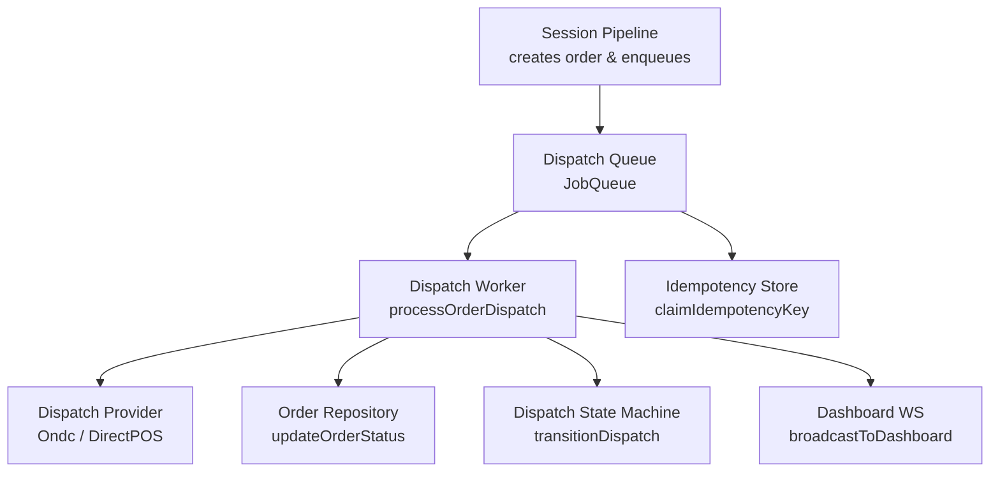
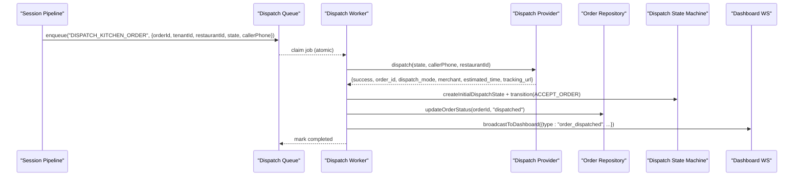
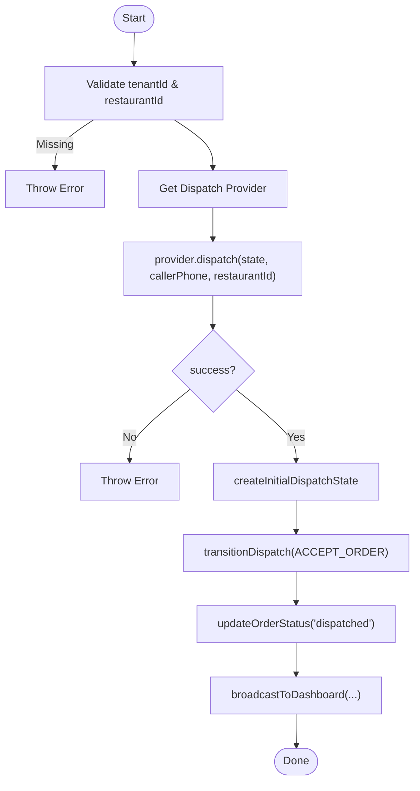
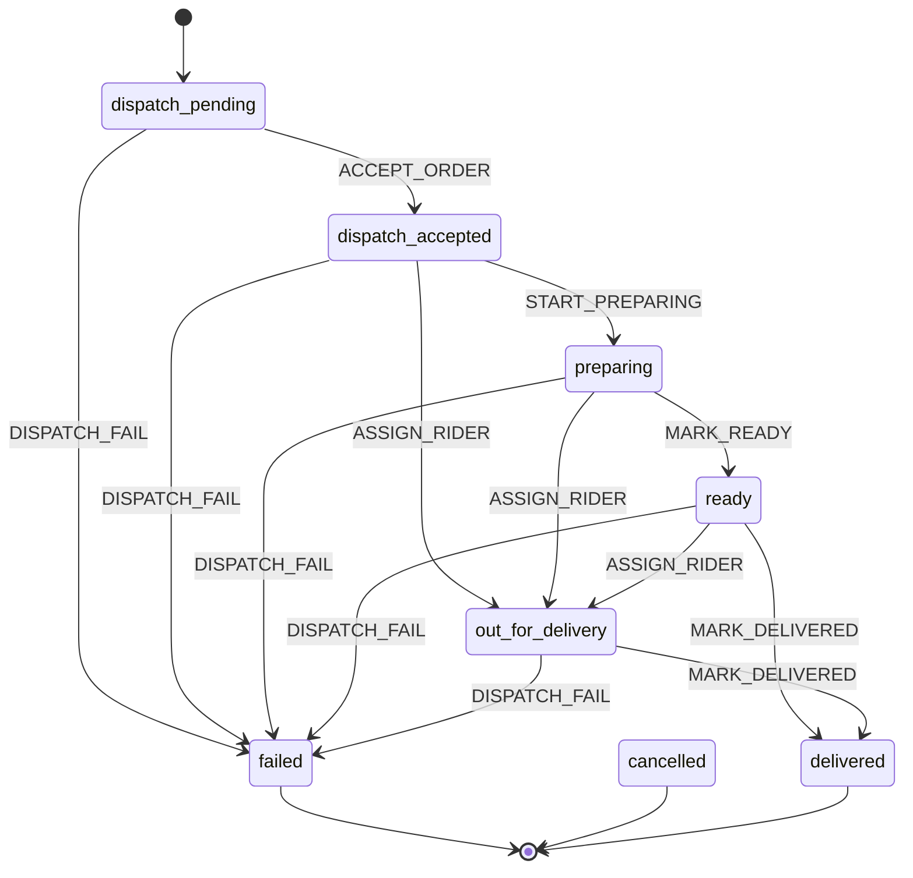
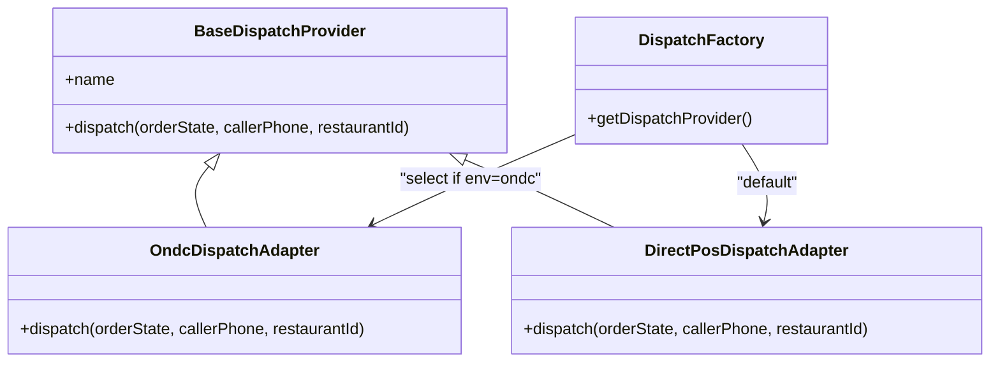
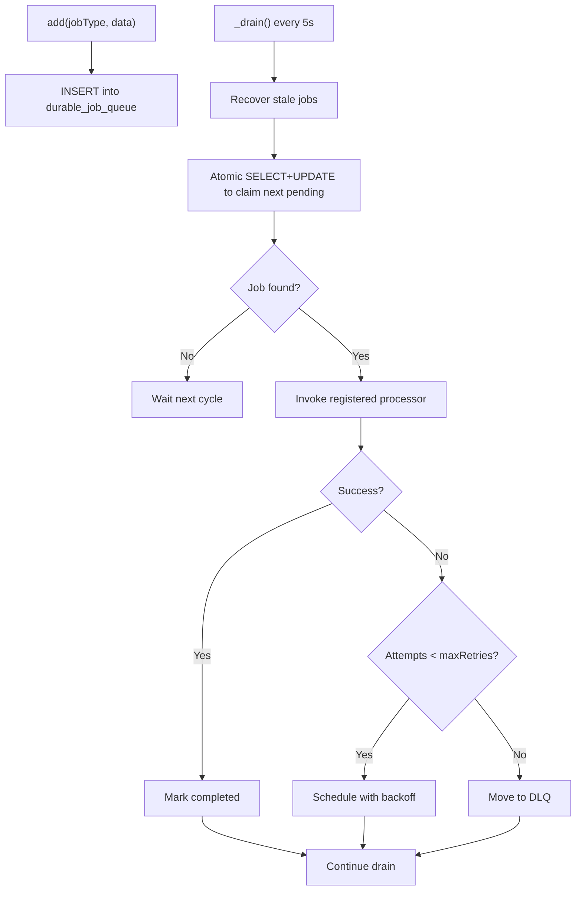
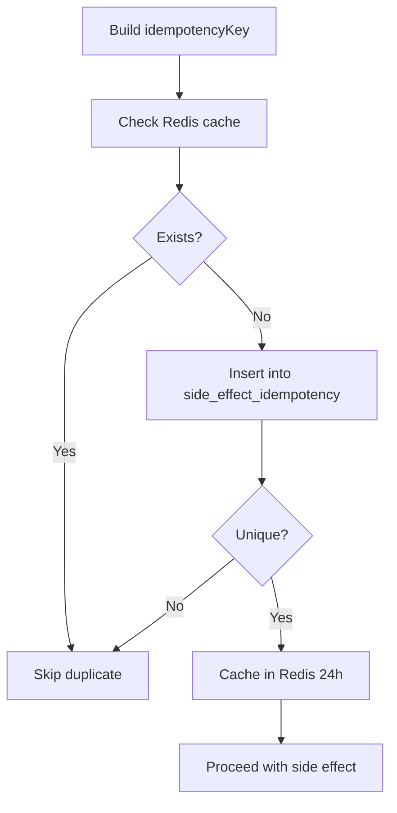
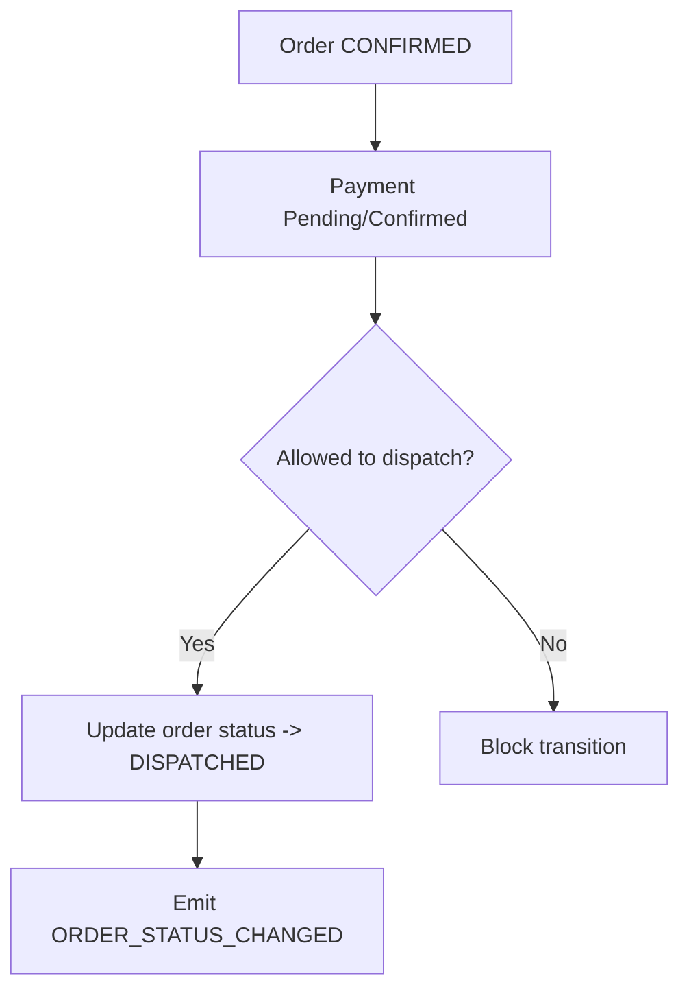
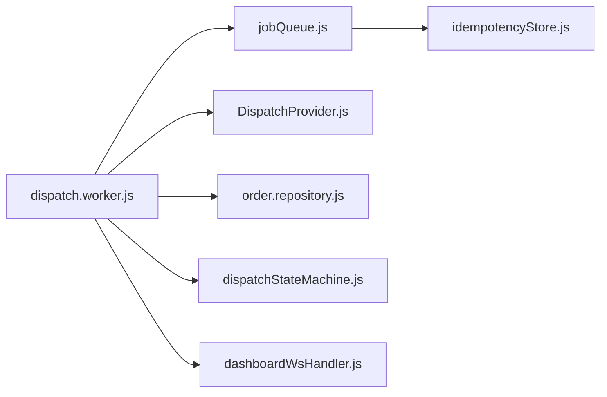

# Dispatch Worker Processing

<cite>
**Referenced Files in This Document**
- [dispatch.worker.js](file://server/src/workers/dispatch.worker.js)
- [dispatchStateMachine.js](file://server/src/domain/dispatch/dispatchStateMachine.js)
- [DispatchProvider.js](file://server/src/integrations/dispatch/DispatchProvider.js)
- [jobQueue.js](file://server/src/queue/jobQueue.js)
- [queueManager.js](file://server/src/queue/queueManager.js)
- [order.repository.js](file://server/src/domain/orders/order.repository.js)
- [idempotencyStore.js](file://server/src/infra/idempotencyStore.js)
- [dashboardWsHandler.js](file://server/src/websocket/dashboardWsHandler.js)
- [orderStateMachine.js](file://server/src/domain/orders/orderStateMachine.js)
- [sessionPipeline.js](file://server/src/websocket/sessionPipeline.js)
</cite>

## Table of Contents
1. [Introduction](#introduction)
2. [Project Structure](#project-structure)
3. [Core Components](#core-components)
4. [Architecture Overview](#architecture-overview)
5. [Detailed Component Analysis](#detailed-component-analysis)
6. [Dependency Analysis](#dependency-analysis)
7. [Performance Considerations](#performance-considerations)
8. [Troubleshooting Guide](#troubleshooting-guide)
9. [Conclusion](#conclusion)
10. [Appendices](#appendices)

## Introduction
This document explains the dispatch worker that manages kitchen order preparation and fulfillment workflows. It covers how DISPATCH_ORDER jobs are processed, order state transitions, integration with the dispatch state machine for lifecycle management, idempotency protection to prevent duplicate dispatches, and operational concerns such as error recovery, timeouts, and monitoring. It also provides guidance on handling kitchen capacity constraints and implementing custom dispatch rules.

## Project Structure
The dispatch pipeline spans several modules:
- Queue layer: durable job queue with atomic claiming, retries, and DLQ routing
- Worker: processes dispatch jobs, updates orders, and broadcasts events
- State machines: separate order lifecycle and dispatch lifecycle
- Integrations: pluggable dispatch providers (ONDC or direct POS)
- Idempotency: Redis + DB-backed deduplication for side effects
- Observability: WebSocket dashboard broadcasting and SLO tracking

**Diagram sources**
- [sessionPipeline.js:335-364](file://server/src/websocket/sessionPipeline.js#L335-L364)
- [jobQueue.js:48-76](file://server/src/queue/jobQueue.js#L48-L76)
- [dispatch.worker.js:12-53](file://server/src/workers/dispatch.worker.js#L12-L53)
- [DispatchProvider.js:24-85](file://server/src/integrations/dispatch/DispatchProvider.js#L24-L85)
- [order.repository.js:220-287](file://server/src/domain/orders/order.repository.js#L220-L287)
- [dispatchStateMachine.js:30-146](file://server/src/domain/dispatch/dispatchStateMachine.js#L30-L146)
- [dashboardWsHandler.js:43-68](file://server/src/websocket/dashboardWsHandler.js#L43-L68)
- [idempotencyStore.js:10-42](file://server/src/infra/idempotencyStore.js#L10-L42)

**Section sources**
- [sessionPipeline.js:335-364](file://server/src/websocket/sessionPipeline.js#L335-L364)
- [jobQueue.js:14-76](file://server/src/queue/jobQueue.js#L14-L76)
- [dispatch.worker.js:12-56](file://server/src/workers/dispatch.worker.js#L12-L56)

## Core Components
- Durable Job Queue: database-backed queue with concurrency control, retry with exponential backoff, stale job recovery, and dead-letter queue.
- Dispatch Worker: consumes DISPATCH_ORDER and DISPATCH_KITCHEN_ORDER jobs, invokes provider, transitions dispatch state, updates order status, and broadcasts to dashboard.
- Dispatch State Machine: defines states and allowed transitions for the dispatch/kitchen lifecycle independent from order status.
- Dispatch Providers: pluggable adapters for ONDC Beckn and direct POS; environment-driven selection and fallback.
- Order Repository: authoritative persistence for orders with strict state transition validation and audit logging.
- Idempotency Store: prevents duplicate dispatch side effects using Redis cache and unique DB constraint.
- Dashboard Broadcasting: real-time event push to tenant-scoped dashboard clients.

**Section sources**
- [jobQueue.js:14-250](file://server/src/queue/jobQueue.js#L14-L250)
- [dispatch.worker.js:12-56](file://server/src/workers/dispatch.worker.js#L12-L56)
- [dispatchStateMachine.js:9-146](file://server/src/domain/dispatch/dispatchStateMachine.js#L9-L146)
- [DispatchProvider.js:11-93](file://server/src/integrations/dispatch/DispatchProvider.js#L11-L93)
- [order.repository.js:220-287](file://server/src/domain/orders/order.repository.js#L220-L287)
- [idempotencyStore.js:10-42](file://server/src/infra/idempotencyStore.js#L10-L42)
- [dashboardWsHandler.js:43-68](file://server/src/websocket/dashboardWsHandler.js#L43-L68)

## Architecture Overview
The end-to-end flow starts when an order is confirmed in the session pipeline, which persists the order and enqueues a kitchen dispatch job. The dispatch worker picks up the job, calls the active dispatch provider, transitions the dispatch state machine, updates the order status, and broadcasts the result to dashboards.

**Diagram sources**
- [sessionPipeline.js:335-364](file://server/src/websocket/sessionPipeline.js#L335-L364)
- [jobQueue.js:107-181](file://server/src/queue/jobQueue.js#L107-L181)
- [dispatch.worker.js:12-53](file://server/src/workers/dispatch.worker.js#L12-L53)
- [DispatchProvider.js:24-85](file://server/src/integrations/dispatch/DispatchProvider.js#L24-L85)
- [order.repository.js:220-287](file://server/src/domain/orders/order.repository.js#L220-L287)
- [dispatchStateMachine.js:30-146](file://server/src/domain/dispatch/dispatchStateMachine.js#L30-L146)
- [dashboardWsHandler.js:43-68](file://server/src/websocket/dashboardWsHandler.js#L43-L68)

## Detailed Component Analysis

### Dispatch Worker: processOrderDispatch
- Validates tenant and restaurant context.
- Invokes the active dispatch provider based on environment configuration.
- Creates initial dispatch state and transitions to accepted upon successful dispatch.
- Updates order status to dispatched via repository.
- Broadcasts a real-time event to dashboards with dispatch details.
- Registers processors for both DISPATCH_ORDER and DISPATCH_KITCHEN_ORDER job types.

**Diagram sources**
- [dispatch.worker.js:12-53](file://server/src/workers/dispatch.worker.js#L12-L53)

**Section sources**
- [dispatch.worker.js:12-56](file://server/src/workers/dispatch.worker.js#L12-L56)

### Dispatch State Machine
- Defines explicit states: pending, accepted, preparing, ready, out_for_delivery, delivered, failed, cancelled.
- Enforces legal transitions per action (accept, start preparing, mark ready, assign rider, mark delivered, fail, cancel).
- Maintains an immutable history of transitions with timestamps and payload summaries.

**Diagram sources**
- [dispatchStateMachine.js:9-146](file://server/src/domain/dispatch/dispatchStateMachine.js#L9-L146)

**Section sources**
- [dispatchStateMachine.js:9-146](file://server/src/domain/dispatch/dispatchStateMachine.js#L9-L146)

### Dispatch Providers (ONDC and Direct POS)
- Base provider abstracts dispatch interface.
- ONDC adapter performs search/select/init/confirm and returns standardized result; on failure, falls back to direct POS.
- Direct POS adapter creates a local order ID and returns standardized result.
- Factory selects provider by environment variable; defaults to direct POS.

**Diagram sources**
- [DispatchProvider.js:11-93](file://server/src/integrations/dispatch/DispatchProvider.js#L11-L93)

**Section sources**
- [DispatchProvider.js:11-93](file://server/src/integrations/dispatch/DispatchProvider.js#L11-L93)

### Durable Job Queue
- Persists jobs to a database table with fields for queue name, job type, payload, max retries, status, and scheduling.
- Atomic claim-and-update pattern ensures only one worker processes a job at a time.
- Supports scheduled execution, exponential backoff retries, and DLQ routing after max retries.
- Recovers stale processing jobs locked by crashed workers older than a threshold.
- Provides stats and pause/resume controls.

**Diagram sources**
- [jobQueue.js:48-211](file://server/src/queue/jobQueue.js#L48-L211)

**Section sources**
- [jobQueue.js:14-250](file://server/src/queue/jobQueue.js#L14-L250)

### Idempotency Protection
- Uses a composite key strategy: category + tenant + restaurant + unique identifier.
- Fast path via Redis cache; persistent fallback via unique constraint in a side-effect ledger table.
- Prevents duplicate dispatch notifications and dispatch operations across retries and process restarts.

**Diagram sources**
- [idempotencyStore.js:10-42](file://server/src/infra/idempotencyStore.js#L10-L42)

**Section sources**
- [idempotencyStore.js:10-42](file://server/src/infra/idempotencyStore.js#L10-L42)
- [queueManager.js:46-57](file://server/src/queue/queueManager.js#L46-L57)

### Order Status Transitions and Kitchen Integration
- Order state machine allows transitioning to dispatched once payment is confirmed or directly from certain states depending on business rules.
- Repository enforces valid transitions and optimistic versioning to avoid concurrent updates.
- After successful dispatch, order status is updated to dispatched and an outbox event is emitted for downstream consumers.

**Diagram sources**
- [orderStateMachine.js:119-133](file://server/src/domain/orders/orderStateMachine.js#L119-L133)
- [order.repository.js:220-287](file://server/src/domain/orders/order.repository.js#L220-L287)

**Section sources**
- [orderStateMachine.js:8-147](file://server/src/domain/orders/orderStateMachine.js#L8-L147)
- [order.repository.js:220-287](file://server/src/domain/orders/order.repository.js#L220-L287)

### Real-Time Dashboard Updates
- On successful dispatch, the worker broadcasts a structured event including order ID, dispatch mode, merchant, estimated time, tracking URL, and current dispatch state.
- Broadcasting is tenant-scoped and role-aware to ensure correct visibility.

**Section sources**
- [dispatch.worker.js:32-43](file://server/src/workers/dispatch.worker.js#L32-L43)
- [dashboardWsHandler.js:43-68](file://server/src/websocket/dashboardWsHandler.js#L43-L68)

## Dependency Analysis
- The dispatch worker depends on:
  - Queue manager for job consumption
  - Dispatch provider for external orchestration
  - Order repository for status updates
  - Dispatch state machine for lifecycle transitions
  - Dashboard WS for real-time updates
  - Idempotency store for deduplication

**Diagram sources**
- [dispatch.worker.js:1-6](file://server/src/workers/dispatch.worker.js#L1-L6)
- [jobQueue.js:1-4](file://server/src/queue/jobQueue.js#L1-L4)
- [DispatchProvider.js:9-10](file://server/src/integrations/dispatch/DispatchProvider.js#L9-L10)
- [order.repository.js:1-4](file://server/src/domain/orders/order.repository.js#L1-L4)
- [dispatchStateMachine.js:1-7](file://server/src/domain/dispatch/dispatchStateMachine.js#L1-L7)
- [dashboardWsHandler.js:1-3](file://server/src/websocket/dashboardWsHandler.js#L1-L3)
- [idempotencyStore.js:1-3](file://server/src/infra/idempotencyStore.js#L1-L3)

**Section sources**
- [dispatch.worker.js:1-6](file://server/src/workers/dispatch.worker.js#L1-L6)
- [jobQueue.js:1-4](file://server/src/queue/jobQueue.js#L1-L4)
- [DispatchProvider.js:9-10](file://server/src/integrations/dispatch/DispatchProvider.js#L9-L10)
- [order.repository.js:1-4](file://server/src/domain/orders/order.repository.js#L1-L4)
- [dispatchStateMachine.js:1-7](file://server/src/domain/dispatch/dispatchStateMachine.js#L1-L7)
- [dashboardWsHandler.js:1-3](file://server/src/websocket/dashboardWsHandler.js#L1-L3)
- [idempotencyStore.js:1-3](file://server/src/infra/idempotencyStore.js#L1-L3)

## Performance Considerations
- Concurrency: The dispatch queue supports configurable concurrency to handle bursts while avoiding overload.
- Retries: Exponential backoff reduces pressure during transient failures.
- Stale Recovery: Crashed worker locks are recovered automatically to prevent job starvation.
- Idempotency: Redis-backed fast-path deduplication minimizes redundant work.
- Observability: Dashboard broadcasting enables live monitoring; queue stats provide operational insights.

[No sources needed since this section provides general guidance]

## Troubleshooting Guide
- Duplicate dispatch prevention: Ensure idempotency keys include order and status context; verify Redis availability and DB unique constraints.
- Failed provider calls: ONDC adapter falls back to direct POS; check logs for provider errors and network issues.
- Illegal state transitions: Validate order status before calling updateOrderStatus; use repository’s built-in checks.
- Queue backlog: Inspect queue stats for queued, running, completed, and DLQ counts; adjust concurrency and max retries as needed.
- Dashboard not updating: Confirm tenant and restaurant scoping in broadcast payloads and client authentication.

**Section sources**
- [idempotencyStore.js:10-42](file://server/src/infra/idempotencyStore.js#L10-L42)
- [DispatchProvider.js:24-85](file://server/src/integrations/dispatch/DispatchProvider.js#L24-L85)
- [order.repository.js:220-287](file://server/src/domain/orders/order.repository.js#L220-L287)
- [jobQueue.js:214-234](file://server/src/queue/jobQueue.js#L214-L234)
- [dashboardWsHandler.js:43-68](file://server/src/websocket/dashboardWsHandler.js#L43-L68)

## Conclusion
The dispatch worker orchestrates kitchen order fulfillment through a robust, durable queue, a pluggable dispatch provider layer, and a dedicated dispatch state machine. It integrates tightly with order persistence and real-time dashboards while enforcing idempotency to maintain consistency. Operational features like retries, stale recovery, and DLQ routing ensure resilience under failures.

[No sources needed since this section summarizes without analyzing specific files]

## Appendices

### Example: Dispatching Orders
- From session confirmation, enqueue a kitchen dispatch job with order context and tenant/restaurant identifiers.
- The worker will call the configured provider, transition dispatch state, update order status, and broadcast results.

**Section sources**
- [sessionPipeline.js:335-364](file://server/src/websocket/sessionPipeline.js#L335-L364)
- [dispatch.worker.js:12-53](file://server/src/workers/dispatch.worker.js#L12-L53)

### Handling Kitchen Capacity Constraints
- Use queue concurrency limits to cap parallel dispatch attempts.
- Implement custom dispatch rules by extending the provider or adding pre-checks before calling provider.dispatch.
- Monitor queue stats and DLQ growth to detect capacity bottlenecks.

**Section sources**
- [jobQueue.js:14-31](file://server/src/queue/jobQueue.js#L14-L31)
- [jobQueue.js:214-234](file://server/src/queue/jobQueue.js#L214-L234)
- [DispatchProvider.js:79-85](file://server/src/integrations/dispatch/DispatchProvider.js#L79-L85)

### Implementing Custom Dispatch Rules
- Extend BaseDispatchProvider and implement dispatch logic tailored to your POS or kitchen system.
- Register a new provider via environment configuration or factory extension.
- Integrate with the dispatch state machine to reflect kitchen-specific milestones (e.g., preparing, ready).

**Section sources**
- [DispatchProvider.js:11-93](file://server/src/integrations/dispatch/DispatchProvider.js#L11-L93)
- [dispatchStateMachine.js:9-146](file://server/src/domain/dispatch/dispatchStateMachine.js#L9-L146)

### Error Recovery and Timeout Handling
- Jobs retry with exponential backoff and move to DLQ after max retries.
- Stale locks are recovered to reprocess jobs stuck due to crashes.
- For long-running provider calls, consider wrapping with timeouts at the provider level and mapping timeouts to retryable errors.

**Section sources**
- [jobQueue.js:182-211](file://server/src/queue/jobQueue.js#L182-L211)
- [jobQueue.js:92-102](file://server/src/queue/jobQueue.js#L92-L102)

### Monitoring Dispatch Pipeline Health
- Use queue stats endpoints to track queued, running, completed, and DLQ counts.
- Observe dashboard broadcasts for real-time visibility into dispatch outcomes.
- Leverage SLO metrics to correlate dispatch performance with overall system health.

**Section sources**
- [jobQueue.js:214-234](file://server/src/queue/jobQueue.js#L214-L234)
- [dashboardWsHandler.js:43-68](file://server/src/websocket/dashboardWsHandler.js#L43-L68)