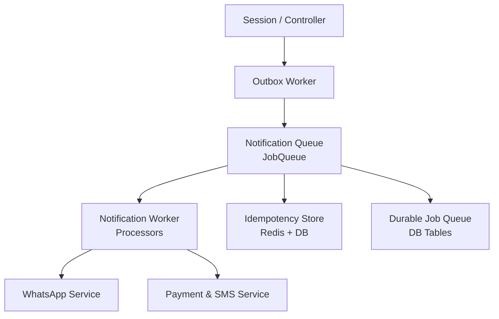
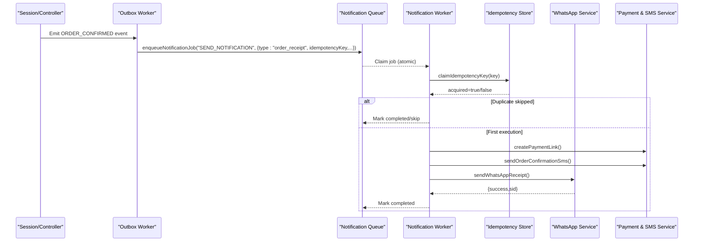
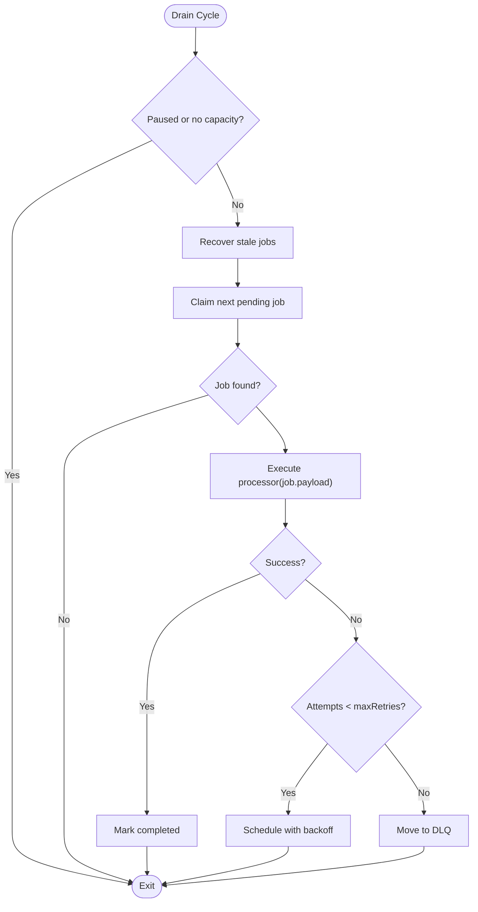
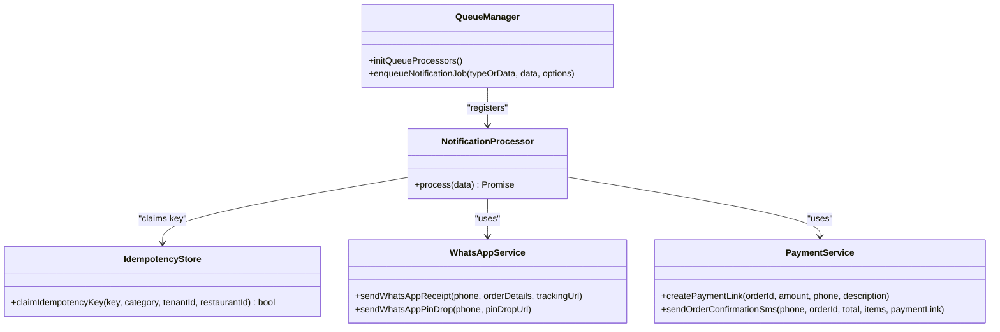
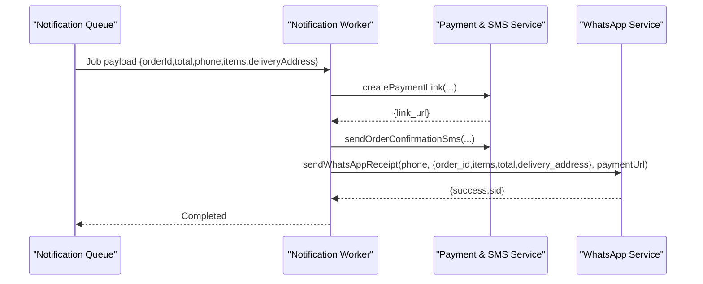
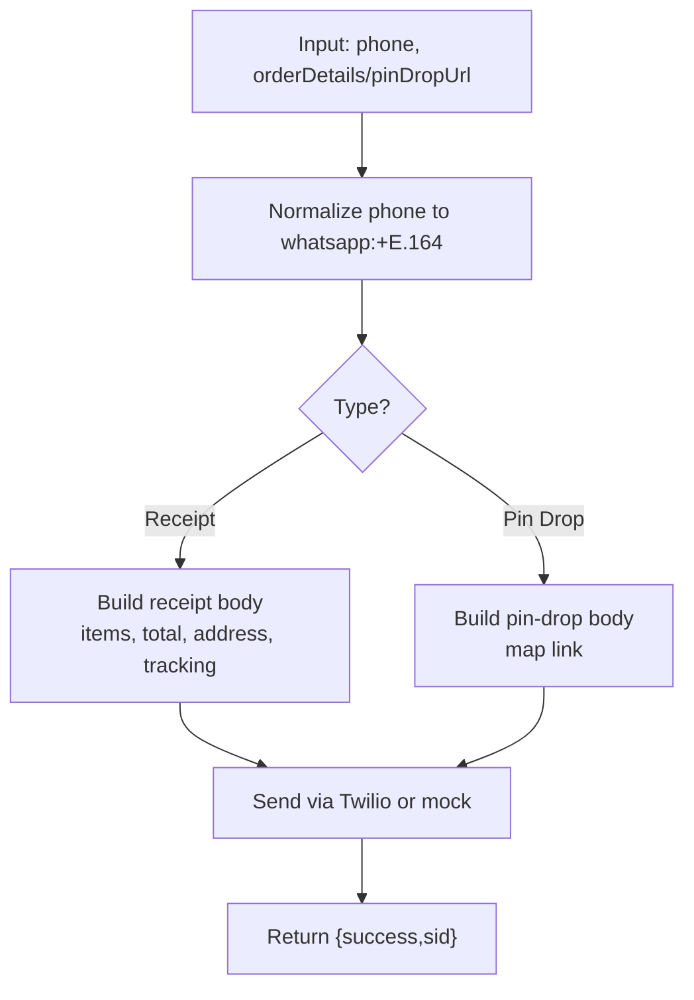
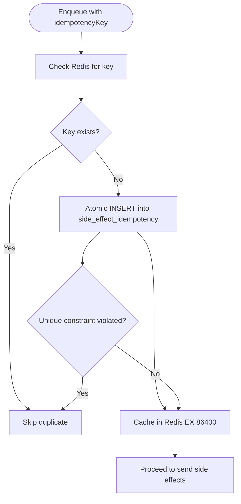
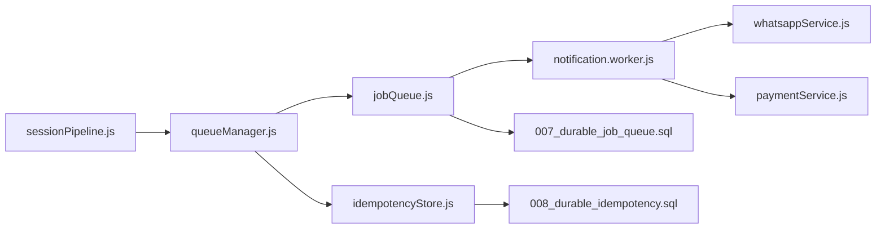

# Notification Worker Processing

<cite>
**Referenced Files in This Document**
- [notification.worker.js](file://server/src/workers/notification.worker.js)
- [whatsappService.js](file://server/src/services/whatsappService.js)
- [jobQueue.js](file://server/src/queue/jobQueue.js)
- [queueManager.js](file://server/src/queue/queueManager.js)
- [idempotencyStore.js](file://server/src/infra/idempotencyStore.js)
- [paymentService.js](file://server/src/services/paymentService.js)
- [007_durable_job_queue.sql](file://server/src/db/migrations/007_durable_job_queue.sql)
- [008_durable_idempotency.sql](file://server/src/db/migrations/008_durable_idempotency.sql)
- [outbox.worker.js](file://server/src/workers/outbox.worker.js)
- [sessionPipeline.js](file://server/src/websocket/sessionPipeline.js)
- [rateLimit.middleware.js](file://server/src/middleware/rateLimit.middleware.js)
</cite>

## Table of Contents
1. Introduction
2. Project Structure
3. Core Components
4. Architecture Overview
5. Detailed Component Analysis
6. Dependency Analysis
7. Performance Considerations
8. Troubleshooting Guide
9. Conclusion

## Introduction
This document explains the notification worker system that sends order receipts and location requests via WhatsApp, along with SMS confirmations and payment links. It focuses on how SEND_NOTIFICATION jobs are processed, message formatting, recipient validation, delivery confirmation, idempotency key generation to prevent duplicates, supported notification types (order_receipt and pin_drop_request), examples of triggering notifications, handling failures, implementing custom types, rate limiting, queuing, and retry strategies for reliable delivery.

## Project Structure
The notification pipeline spans several modules:
- Queues: durable database-backed job queue with explicit processors per job type
- Workers: background workers that process specific job types
- Services: WhatsApp and SMS providers with fallbacks
- Idempotency: Redis + DB ledger to prevent duplicate side effects
- Outbox and session handlers: trigger notifications from business events

**Diagram sources**
- [queueManager.js:15-43](file://server/src/queue/queueManager.js#L15-L43)
- [jobQueue.js:14-76](file://server/src/queue/jobQueue.js#L14-L76)
- [notification.worker.js:10-69](file://server/src/workers/notification.worker.js#L10-L69)
- [whatsappService.js:24-109](file://server/src/services/whatsappService.js#L24-L109)
- [paymentService.js:25-113](file://server/src/services/paymentService.js#L25-L113)
- [idempotencyStore.js:10-42](file://server/src/infra/idempotencyStore.js#L10-L42)
- [007_durable_job_queue.sql:5-22](file://server/src/db/migrations/007_durable_job_queue.sql#L5-L22)
- [008_durable_idempotency.sql:5-14](file://server/src/db/migrations/008_durable_idempotency.sql#L5-L14)

**Section sources**
- [queueManager.js:1-122](file://server/src/queue/queueManager.js#L1-L122)
- [jobQueue.js:1-250](file://server/src/queue/jobQueue.js#L1-L250)
- [notification.worker.js:1-72](file://server/src/workers/notification.worker.js#L1-L72)
- [whatsappService.js:1-114](file://server/src/services/whatsappService.js#L1-L114)
- [paymentService.js:1-114](file://server/src/services/paymentService.js#L1-L114)
- [idempotencyStore.js:1-43](file://server/src/infra/idempotencyStore.js#L1-L43)
- [007_durable_job_queue.sql:1-22](file://server/src/db/migrations/007_durable_job_queue.sql#L1-L22)
- [008_durable_idempotency.sql:1-14](file://server/src/db/migrations/008_durable_idempotency.sql#L1-L14)

## Core Components
- Durable Job Queue: Database-backed queue with atomic claiming, retries with exponential backoff, DLQ routing, and stale job recovery.
- Notification Queue Manager: Registers processors for SEND_NOTIFICATION and other queues; enforces idempotency before sending side effects.
- Notification Worker: Explicit processors for order receipt and pin-drop messages; also handles legacy job names for compatibility.
- WhatsApp Service: Formats rich receipts and pin-drop prompts; integrates with Twilio or falls back to mock logging.
- Payment & SMS Service: Generates payment links and sends SMS confirmations; includes mock fallbacks.
- Idempotency Store: Claims unique keys across Redis and DB to prevent duplicate external side effects.
- Outbox Worker and Session Pipeline: Emit events that enqueue notifications when orders are confirmed or locations need pinning.

Key responsibilities:
- Enqueue jobs with explicit job types and payloads
- Validate recipients and skip non-PSTN sessions where appropriate
- Format messages for WhatsApp and SMS
- Ensure idempotent execution of side effects
- Retry failed jobs with backoff and move to DLQ after max attempts

**Section sources**
- [jobQueue.js:14-212](file://server/src/queue/jobQueue.js#L14-L212)
- [queueManager.js:15-78](file://server/src/queue/queueManager.js#L15-L78)
- [notification.worker.js:10-69](file://server/src/workers/notification.worker.js#L10-L69)
- [whatsappService.js:24-109](file://server/src/services/whatsappService.js#L24-L109)
- [paymentService.js:25-113](file://server/src/services/paymentService.js#L25-L113)
- [idempotencyStore.js:10-42](file://server/src/infra/idempotencyStore.js#L10-L42)

## Architecture Overview
End-to-end flow for order confirmation and location request notifications:

**Diagram sources**
- [outbox.worker.js:20-36](file://server/src/workers/outbox.worker.js#L20-L36)
- [queueManager.js:17-43](file://server/src/queue/queueManager.js#L17-L43)
- [jobQueue.js:107-181](file://server/src/queue/jobQueue.js#L107-L181)
- [notification.worker.js:10-55](file://server/src/workers/notification.worker.js#L10-L55)
- [idempotencyStore.js:10-42](file://server/src/infra/idempotencyStore.js#L10-L42)
- [paymentService.js:25-113](file://server/src/services/paymentService.js#L25-L113)
- [whatsappService.js:24-109](file://server/src/services/whatsappService.js#L24-L109)

## Detailed Component Analysis

### Job Queue Engine
- Adds jobs to a durable table with status tracking, scheduled_at, attempts, and max_retries.
- Periodically drains pending jobs, claims them atomically, and executes registered processors.
- Implements exponential backoff and moves exhausted jobs to DLQ.
- Recovers stale processing jobs locked by crashed workers.

**Diagram sources**
- [jobQueue.js:107-212](file://server/src/queue/jobQueue.js#L107-L212)

**Section sources**
- [jobQueue.js:14-250](file://server/src/queue/jobQueue.js#L14-L250)
- [007_durable_job_queue.sql:5-22](file://server/src/db/migrations/007_durable_job_queue.sql#L5-L22)

### Notification Queue Manager and Processors
- Registers a generic SEND_NOTIFICATION processor that routes by data.type.
- Enforces idempotency using claimIdempotencyKey before sending side effects.
- Supports order_receipt and pin_drop_request types.
- Provides helper functions to enqueue jobs with flexible signatures.

**Diagram sources**
- [queueManager.js:15-78](file://server/src/queue/queueManager.js#L15-L78)
- [idempotencyStore.js:10-42](file://server/src/infra/idempotencyStore.js#L10-L42)
- [whatsappService.js:24-109](file://server/src/services/whatsappService.js#L24-L109)
- [paymentService.js:25-113](file://server/src/services/paymentService.js#L25-L113)

**Section sources**
- [queueManager.js:15-78](file://server/src/queue/queueManager.js#L15-L78)

### Notification Worker (Explicit Processors)
- Handles legacy job names for backward compatibility: SEND_ORDER_NOTIFICATION and SEND_ORDER_RECEIPT_WHATSAPP.
- Processes order alerts: creates payment link, sends SMS, sends WhatsApp receipt.
- Processes pin-drop requests: sends WhatsApp prompt with map link.
- Skips non-PSTN browser test sessions.

**Diagram sources**
- [notification.worker.js:10-69](file://server/src/workers/notification.worker.js#L10-L69)
- [paymentService.js:25-113](file://server/src/services/paymentService.js#L25-L113)
- [whatsappService.js:24-109](file://server/src/services/whatsappService.js#L24-L109)

**Section sources**
- [notification.worker.js:10-69](file://server/src/workers/notification.worker.js#L10-L69)

### WhatsApp Service Message Formatting
- Order receipt: itemized list, totals, delivery address, optional landmark, tracking URL, reorder hint.
- Pin-drop request: concise prompt with map link.
- Phone normalization to whatsapp:+E.164 format.
- Twilio integration with mock fallback for development.

**Diagram sources**
- [whatsappService.js:24-109](file://server/src/services/whatsappService.js#L24-L109)

**Section sources**
- [whatsappService.js:24-109](file://server/src/services/whatsappService.js#L24-L109)

### Idempotency Key Generation and Duplicate Prevention
- Keys are constructed at enqueue time (e.g., notif_receipt_order_{orderId}).
- claimIdempotencyKey checks Redis first, then attempts atomic DB insert; caches result in Redis for 24 hours.
- Prevents duplicate WhatsApp/SMS/Payment link creation if the same key is re-enqueued.

**Diagram sources**
- [idempotencyStore.js:10-42](file://server/src/infra/idempotencyStore.js#L10-L42)
- [008_durable_idempotency.sql:5-14](file://server/src/db/migrations/008_durable_idempotency.sql#L5-L14)

**Section sources**
- [idempotencyStore.js:10-42](file://server/src/infra/idempotencyStore.js#L10-L42)
- [queueManager.js:17-43](file://server/src/queue/queueManager.js#L17-L43)

### Triggering Notifications
- From session pipeline: On order confirmation, enqueue SEND_ORDER_RECEIPT_WHATSAPP with order details.
- From outbox worker: On ORDER_CONFIRMED event, enqueue SEND_NOTIFICATION with type order_receipt and idempotency key.
- For pin-drop: When geocoding confidence requires verification, enqueue SEND_PINDROP_WHATSAPP with pin URL.

Examples:
- Order receipt: enqueueNotificationJob('SEND_NOTIFICATION', {type:'order_receipt', idempotencyKey:`notif_receipt_order_${orderId}`, phone, orderId, items, total, address, landmark})
- Pin drop: notificationQueue.add('SEND_PINDROP_WHATSAPP', {phone, pinUrl})

**Section sources**
- [sessionPipeline.js:321-375](file://server/src/websocket/sessionPipeline.js#L321-L375)
- [outbox.worker.js:20-36](file://server/src/workers/outbox.worker.js#L20-L36)
- [queueManager.js:80-86](file://server/src/queue/queueManager.js#L80-L86)

### Handling Delivery Failures and Retries
- JobQueue retries with exponential backoff up to maxRetries; errors are recorded and jobs rescheduled.
- After exhausting retries, jobs move to DLQ; consumers can inspect last_error and reprocess manually.
- WhatsApp and SMS services log errors and return success for mock paths; production failures surface as exceptions handled by queue.

Operational guidance:
- Monitor queue stats (pending, processing, completed, dlq).
- Investigate DLQ entries for persistent failures.
- Adjust concurrency and maxRetries based on throughput needs.

**Section sources**
- [jobQueue.js:182-212](file://server/src/queue/jobQueue.js#L182-L212)
- [whatsappService.js:82-109](file://server/src/services/whatsappService.js#L82-L109)
- [paymentService.js:25-113](file://server/src/services/paymentService.js#L25-L113)

### Implementing Custom Notification Types
- Add a new branch in the SEND_NOTIFICATION processor to handle a new data.type.
- Optionally register a dedicated job type and processor for clarity.
- Provide an idempotency key strategy tailored to the new side effect.
- Update enqueue helpers if needed.

Steps:
1. Extend queueManager processor logic for the new type.
2. Create or reuse service methods for message formatting and delivery.
3. Generate idempotency keys that uniquely identify the side effect scope.
4. Test with both real and mock providers.

**Section sources**
- [queueManager.js:17-43](file://server/src/queue/queueManager.js#L17-L43)
- [whatsappService.js:24-109](file://server/src/services/whatsappService.js#L24-L109)

### Rate Limiting, Message Queuing, and Retry Strategies
- API-level rate limiting protects endpoints; not directly applied to background jobs.
- Background jobs rely on durable queue concurrency limits and backoff retries.
- For high-volume scenarios, consider:
  - Increasing queue concurrency for notificationQueue
  - Tuning initialBackoffMs and maxRetries
  - Using separate queues per channel (e.g., WhatsApp vs SMS)
  - Adding circuit breakers around external calls

**Section sources**
- [rateLimit.middleware.js:8-51](file://server/src/middleware/rateLimit.middleware.js#L8-L51)
- [jobQueue.js:14-32](file://server/src/queue/jobQueue.js#L14-L32)
- [queueManager.js:8-10](file://server/src/queue/queueManager.js#L8-L10)

## Dependency Analysis

**Diagram sources**
- [sessionPipeline.js:321-375](file://server/src/websocket/sessionPipeline.js#L321-L375)
- [queueManager.js:15-86](file://server/src/queue/queueManager.js#L15-L86)
- [jobQueue.js:14-76](file://server/src/queue/jobQueue.js#L14-L76)
- [notification.worker.js:10-69](file://server/src/workers/notification.worker.js#L10-L69)
- [whatsappService.js:24-109](file://server/src/services/whatsappService.js#L24-L109)
- [paymentService.js:25-113](file://server/src/services/paymentService.js#L25-L113)
- [007_durable_job_queue.sql:5-22](file://server/src/db/migrations/007_durable_job_queue.sql#L5-L22)
- [008_durable_idempotency.sql:5-14](file://server/src/db/migrations/008_durable_idempotency.sql#L5-L14)

**Section sources**
- [sessionPipeline.js:321-375](file://server/src/websocket/sessionPipeline.js#L321-L375)
- [queueManager.js:15-86](file://server/src/queue/queueManager.js#L15-L86)
- [jobQueue.js:14-76](file://server/src/queue/jobQueue.js#L14-L76)
- [notification.worker.js:10-69](file://server/src/workers/notification.worker.js#L10-L69)
- [whatsappService.js:24-109](file://server/src/services/whatsappService.js#L24-L109)
- [paymentService.js:25-113](file://server/src/services/paymentService.js#L25-L113)
- [007_durable_job_queue.sql:5-22](file://server/src/db/migrations/007_durable_job_queue.sql#L5-L22)
- [008_durable_idempotency.sql:5-14](file://server/src/db/migrations/008_durable_idempotency.sql#L5-L14)

## Performance Considerations
- Concurrency: notificationQueue concurrency set to 10; adjust based on provider limits and infrastructure capacity.
- Backoff: Exponential backoff reduces load during transient failures; tune initialBackoffMs and maxRetries.
- Idempotency caching: Redis TTL of 24 hours avoids repeated DB lookups for recent duplicates.
- External provider limits: Respect Twilio/Razorpay rate limits; add application-level throttling if necessary.
- Monitoring: Use queue stats to track queued, running, completed, and DLQ counts; alert on DLQ growth.

[No sources needed since this section provides general guidance]

## Troubleshooting Guide
Common issues and resolutions:
- Duplicate notifications: Verify idempotency keys are unique per side effect; check Redis cache and DB ledger.
- Jobs stuck in processing: Stale locks recovered automatically; ensure worker processes are healthy.
- DLQ accumulation: Inspect last_error; fix underlying provider or data issues; reprocess jobs.
- WhatsApp delivery failures: Confirm Twilio credentials and sandbox configuration; review logs for error messages.
- SMS failures: Validate Twilio account settings and phone number formats; use mock mode for testing.

**Section sources**
- [jobQueue.js:182-212](file://server/src/queue/jobQueue.js#L182-L212)
- [whatsappService.js:82-109](file://server/src/services/whatsappService.js#L82-L109)
- [paymentService.js:25-113](file://server/src/services/paymentService.js#L25-L113)
- [idempotencyStore.js:10-42](file://server/src/infra/idempotencyStore.js#L10-L42)

## Conclusion
The notification worker system provides robust, idempotent, and durable delivery of order receipts and location requests via WhatsApp and SMS. The durable job queue ensures reliability through retries and DLQ handling, while idempotency prevents duplicate side effects. By following the patterns outlined here—explicit job types, idempotency keys, and clear separation of concerns—you can extend the system with custom notification types and scale reliably under load.

[No sources needed since this section summarizes without analyzing specific files]