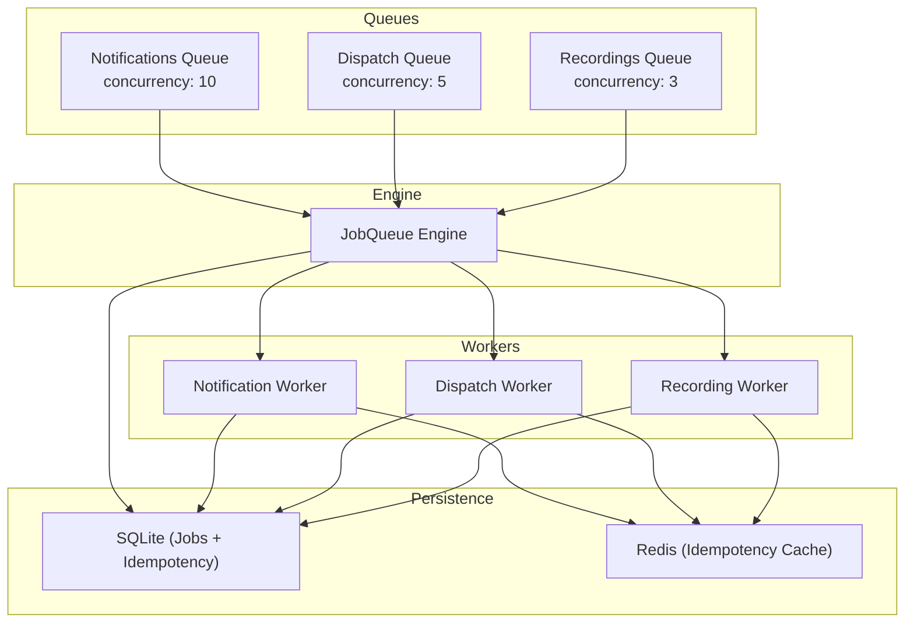
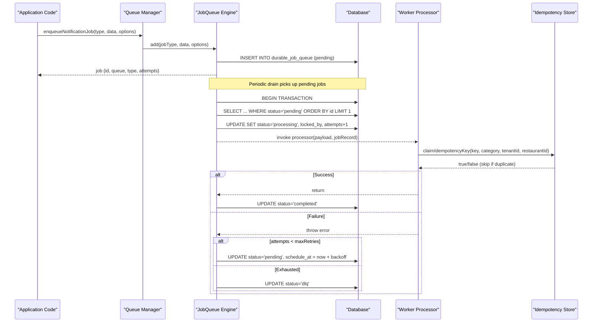
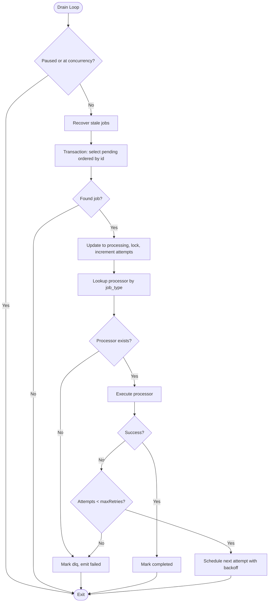
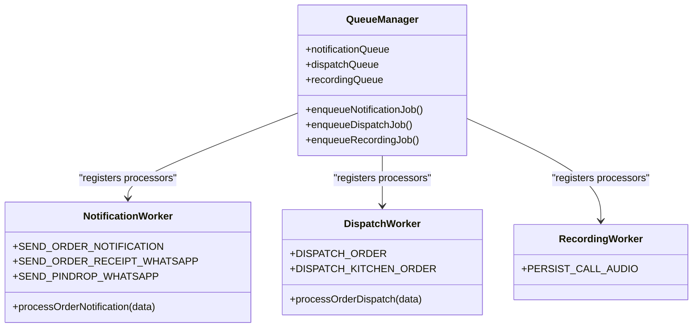
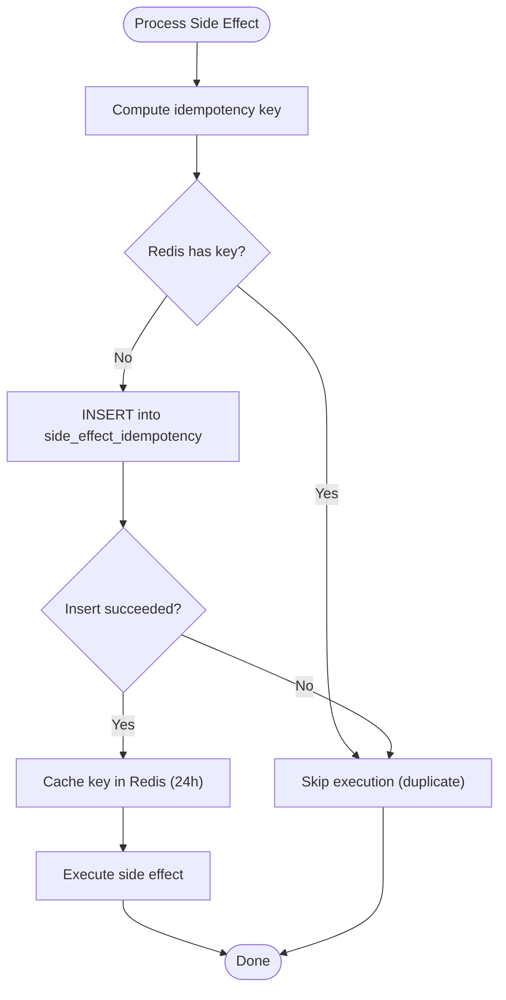
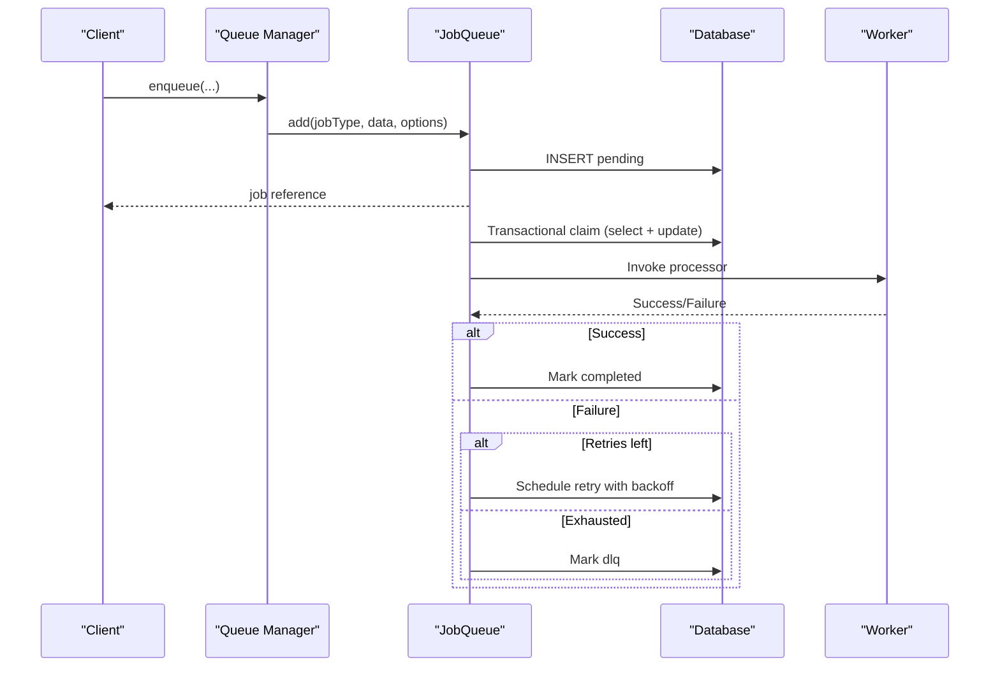
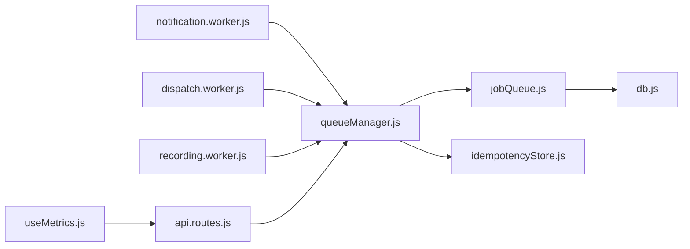

# Queue Architecture & Job Management

<cite>
**Referenced Files in This Document**
- [jobQueue.js](file://server/src/queue/jobQueue.js)
- [queueManager.js](file://server/src/queue/queueManager.js)
- [notification.worker.js](file://server/src/workers/notification.worker.js)
- [dispatch.worker.js](file://server/src/workers/dispatch.worker.js)
- [recording.worker.js](file://server/src/workers/recording.worker.js)
- [007_durable_job_queue.sql](file://server/src/db/migrations/007_durable_job_queue.sql)
- [008_durable_idempotency.sql](file://server/src/db/migrations/008_durable_idempotency.sql)
- [idempotencyStore.js](file://server/src/infra/idempotencyStore.js)
- [db.js](file://server/src/db.js)
- [api.routes.js](file://server/src/routes/api.routes.js)
- [useMetrics.js](file://client/src/hooks/useMetrics.js)
</cite>

## Table of Contents
1. [Introduction](#introduction)
2. [Project Structure](#project-structure)
3. [Core Components](#core-components)
4. [Architecture Overview](#architecture-overview)
5. [Detailed Component Analysis](#detailed-component-analysis)
6. [Dependency Analysis](#dependency-analysis)
7. [Performance Considerations](#performance-considerations)
8. [Troubleshooting Guide](#troubleshooting-guide)
9. [Conclusion](#conclusion)
10. [Appendices](#appendices)

## Introduction
This document explains the queue architecture and job management system that powers asynchronous processing for notifications, dispatching, and call recordings. It covers the durable, database-backed JobQueue engine, three dedicated queues with specific concurrency limits, the end-to-end job lifecycle (including retries and dead-letter handling), idempotency protection to prevent duplicate side effects, and operational guidance for adding new jobs, configuring parameters, monitoring health, and scaling for high throughput.

## Project Structure
The queue subsystem is implemented as a reusable engine plus dedicated workers:
- Engine: A database-backed, durable job queue with atomic claiming, retry/backoff, and DLQ routing.
- Queues: Three named queues with distinct concurrency and retry policies.
- Workers: Handlers for each job type per queue.
- Persistence: SQLite tables for jobs and an idempotency ledger; optional Redis caching for idempotency checks.
- Monitoring: API endpoints to expose queue stats consumed by the frontend dashboard.

**Diagram sources**
- [jobQueue.js:14-32](file://server/src/queue/jobQueue.js#L14-L32)
- [queueManager.js:7-10](file://server/src/queue/queueManager.js#L7-L10)
- [notification.worker.js:57-71](file://server/src/workers/notification.worker.js#L57-L71)
- [dispatch.worker.js:52-55](file://server/src/workers/dispatch.worker.js#L52-L55)
- [recording.worker.js:10-50](file://server/src/workers/recording.worker.js#L10-L50)
- [007_durable_job_queue.sql:5-21](file://server/src/db/migrations/007_durable_job_queue.sql#L5-L21)
- [008_durable_idempotency.sql:5-13](file://server/src/db/migrations/008_durable_idempotency.sql#L5-L13)
- [idempotencyStore.js:10-42](file://server/src/infra/idempotencyStore.js#L10-L42)

**Section sources**
- [jobQueue.js:14-32](file://server/src/queue/jobQueue.js#L14-L32)
- [queueManager.js:7-10](file://server/src/queue/queueManager.js#L7-L10)
- [007_durable_job_queue.sql:5-21](file://server/src/db/migrations/007_durable_job_queue.sql#L5-L21)
- [008_durable_idempotency.sql:5-13](file://server/src/db/migrations/008_durable_idempotency.sql#L5-L13)

## Core Components
- JobQueue engine: A durable, database-backed queue that persists jobs, claims them atomically, handles retries with exponential backoff, routes failures to a dead-letter state, and supports pause/resume and stats.
- Dedicated queues:
  - Notifications (concurrency: 10): Sends receipts, SMS confirmations, and pin-drop messages.
  - Dispatch (concurrency: 5): Dispatches orders via provider integration and updates order status.
  - Recordings (concurrency: 3): Persists audio recordings and records metadata.
- Idempotency store: Prevents duplicate side effects using a combination of Redis cache and a durable database ledger.
- Monitoring: Exposes queue statistics via API for dashboards.

Key responsibilities:
- Enqueueing: Persisted insertion into durable_job_queue with queue_name, job_type, payload, max_retries, scheduled_at.
- Processing: Atomic claim within a transaction, processor lookup, execution, completion or retry/DLQ update.
- Recovery: Stale processing jobs older than a threshold are reclaimed to pending.
- Metrics: Aggregated counts per status per queue.

**Section sources**
- [jobQueue.js:48-76](file://server/src/queue/jobQueue.js#L48-L76)
- [jobQueue.js:107-212](file://server/src/queue/jobQueue.js#L107-L212)
- [jobQueue.js:214-235](file://server/src/queue/jobQueue.js#L214-L235)
- [queueManager.js:7-10](file://server/src/queue/queueManager.js#L7-L10)
- [idempotencyStore.js:10-42](file://server/src/infra/idempotencyStore.js#L10-L42)

## Architecture Overview
The system uses a durable, database-backed queue engine with explicit processors per job type. Jobs are persisted before being processed, ensuring durability across process restarts. Each worker registers handlers for specific job types on its queue. The engine enforces concurrency limits per queue and implements retry with exponential backoff, moving exhausted jobs to a dead-letter state. Idempotency keys protect external side effects from duplication.

**Diagram sources**
- [queueManager.js:80-102](file://server/src/queue/queueManager.js#L80-L102)
- [jobQueue.js:48-76](file://server/src/queue/jobQueue.js#L48-L76)
- [jobQueue.js:107-212](file://server/src/queue/jobQueue.js#L107-L212)
- [idempotencyStore.js:10-42](file://server/src/infra/idempotencyStore.js#L10-L42)

## Detailed Component Analysis

### JobQueue Engine
Responsibilities:
- Concurrency control per queue instance.
- Atomic job claiming within a transaction to avoid double-processing.
- Stale job recovery for crashed workers.
- Retry with exponential backoff capped at a maximum interval.
- Dead-letter routing when retries are exhausted or no processor is registered.
- Stats aggregation and pause/resume controls.

Key behaviors:
- Add/enqueue: Inserts a row with status 'pending' and emits events.
- Drain loop: Runs every few seconds, recovers stale jobs, claims one pending job per iteration respecting concurrency.
- Processor dispatch: Looks up handler by job_type; unsupported types go directly to DLQ.
- Completion/failure: Updates status to 'completed' or schedules retry/DLQ accordingly.

**Diagram sources**
- [jobQueue.js:107-212](file://server/src/queue/jobQueue.js#L107-L212)

**Section sources**
- [jobQueue.js:14-32](file://server/src/queue/jobQueue.js#L14-L32)
- [jobQueue.js:48-76](file://server/src/queue/jobQueue.js#L48-L76)
- [jobQueue.js:92-102](file://server/src/queue/jobQueue.js#L92-L102)
- [jobQueue.js:107-212](file://server/src/queue/jobQueue.js#L107-L212)
- [jobQueue.js:214-235](file://server/src/queue/jobQueue.js#L214-L235)

### Dedicated Queues and Processors
- Notifications (concurrency: 10, maxRetries: 3)
  - Job types: SEND_NOTIFICATION, SEND_ORDER_NOTIFICATION, SEND_ORDER_RECEIPT_WHATSAPP, SEND_PINDROP_WHATSAPP
  - Responsibilities: Send SMS confirmations, WhatsApp receipts, and pin-drop links.
  - Idempotency: Uses idempotency key derived from order/phone/type to avoid duplicates.
- Dispatch (concurrency: 5, maxRetries: 3)
  - Job types: DISPATCH_ORDER, DISPATCH_KITCHEN_ORDER
  - Responsibilities: Call dispatch provider, transition order state, broadcast to dashboard.
  - Idempotency: Uses idempotency key based on order and status.
- Recordings (concurrency: 3, maxRetries: 2)
  - Job types: PERSIST_CALL_AUDIO
  - Responsibilities: Save PCM buffers to storage, persist recording metadata.
  - Idempotency: Not used here; relies on unique call identifiers and storage semantics.

**Diagram sources**
- [queueManager.js:15-75](file://server/src/queue/queueManager.js#L15-L75)
- [notification.worker.js:57-71](file://server/src/workers/notification.worker.js#L57-L71)
- [dispatch.worker.js:52-55](file://server/src/workers/dispatch.worker.js#L52-L55)
- [recording.worker.js:10-50](file://server/src/workers/recording.worker.js#L10-L50)

**Section sources**
- [queueManager.js:7-10](file://server/src/queue/queueManager.js#L7-L10)
- [queueManager.js:15-75](file://server/src/queue/queueManager.js#L15-L75)
- [notification.worker.js:10-69](file://server/src/workers/notification.worker.js#L10-L69)
- [dispatch.worker.js:12-50](file://server/src/workers/dispatch.worker.js#L12-L50)
- [recording.worker.js:10-50](file://server/src/workers/recording.worker.js#L10-L50)

### Idempotency Protection
- Purpose: Ensure that external side effects (e.g., sending messages, dispatching orders) are executed exactly once even if jobs are retried or duplicated.
- Mechanism:
  - Redis fast-path check for recent keys.
  - Database insert into side_effect_idempotency table as authoritative source of truth.
  - On success, cache key in Redis for 24 hours to reduce DB load.
- Usage:
  - Notification and dispatch processors compute an idempotency key from domain fields and claim it before performing side effects.

**Diagram sources**
- [idempotencyStore.js:10-42](file://server/src/infra/idempotencyStore.js#L10-L42)

**Section sources**
- [idempotencyStore.js:10-42](file://server/src/infra/idempotencyStore.js#L10-L42)
- [008_durable_idempotency.sql:5-13](file://server/src/db/migrations/008_durable_idempotency.sql#L5-L13)

### Job Lifecycle: From Enqueue to Completion
- Enqueue: Application calls queue manager helpers which delegate to JobQueue.add, persisting a pending job.
- Scheduling: Jobs can be scheduled for later via scheduled_at; the drain loop only picks due jobs.
- Claiming: Within a transaction, the engine selects the oldest pending job and marks it processing with a lock.
- Processing: The appropriate worker processor runs; idempotency is checked for side-effect safety.
- Completion: On success, status becomes completed; on failure, either retry with backoff or move to DLQ after exhausting retries.
- Recovery: If a worker crashes while processing, stale locks are reclaimed and jobs revert to pending.

**Diagram sources**
- [queueManager.js:80-102](file://server/src/queue/queueManager.js#L80-L102)
- [jobQueue.js:48-76](file://server/src/queue/jobQueue.js#L48-L76)
- [jobQueue.js:107-212](file://server/src/queue/jobQueue.js#L107-L212)

**Section sources**
- [jobQueue.js:48-76](file://server/src/queue/jobQueue.js#L48-L76)
- [jobQueue.js:107-212](file://server/src/queue/jobQueue.js#L107-L212)

## Dependency Analysis
- JobQueue depends on:
  - Database layer for persistence and transactions.
  - Logger for error reporting.
- QueueManager depends on:
  - JobQueue instances for each queue.
  - Services for side effects (WhatsApp, storage).
  - Idempotency store for deduplication.
- Workers depend on:
  - Their respective queues.
  - Domain services and integrations (e.g., dispatch provider, storage service).
- Monitoring depends on:
  - Queue stats exposed via API routes.
  - Frontend metrics hook polling /api/queues.

**Diagram sources**
- [jobQueue.js:1-3](file://server/src/queue/jobQueue.js#L1-L3)
- [queueManager.js:1-5](file://server/src/queue/queueManager.js#L1-L5)
- [notification.worker.js:1-3](file://server/src/workers/notification.worker.js#L1-L3)
- [dispatch.worker.js:1-5](file://server/src/workers/dispatch.worker.js#L1-L5)
- [recording.worker.js:1-3](file://server/src/workers/recording.worker.js#L1-L3)
- [api.routes.js:6,32:6-32](file://server/src/routes/api.routes.js#L6-L32)
- [useMetrics.js:35-48](file://client/src/hooks/useMetrics.js#L35-L48)

**Section sources**
- [jobQueue.js:1-3](file://server/src/queue/jobQueue.js#L1-L3)
- [queueManager.js:1-5](file://server/src/queue/queueManager.js#L1-L5)
- [api.routes.js:6,32:6-32](file://server/src/routes/api.routes.js#L6-L32)
- [useMetrics.js:35-48](file://client/src/hooks/useMetrics.js#L35-L48)

## Performance Considerations
- Concurrency tuning:
  - Notifications: concurrency 10 suitable for I/O-bound messaging.
  - Dispatch: concurrency 5 balances provider rate limits and throughput.
  - Recordings: concurrency 3 protects storage and CPU-intensive encoding.
- Database performance:
  - Use WAL mode and indexes already defined for queue queries.
  - Keep payloads small; prefer references for large blobs.
- Retry strategy:
  - Exponential backoff reduces burst pressure on downstream systems.
  - Cap backoff to avoid long delays; adjust maxRetries per queue needs.
- Idempotency caching:
  - Redis cache reduces DB contention for duplicate detection.
- Monitoring:
  - Track queue depths, running counts, and DLQ sizes to detect bottlenecks.
- Scaling:
  - Horizontal scaling: run multiple server processes; each maintains its own JobQueue timers but shares the same database, so atomic claiming prevents duplicates.
  - Vertical scaling: increase concurrency per queue based on resource capacity and downstream limits.
- High-throughput techniques:
  - Batch operations where possible (e.g., batched storage writes).
  - Tune scheduled_at to spread load spikes.
  - Monitor slow queries and adjust indexes if needed.

[No sources needed since this section provides general guidance]

## Troubleshooting Guide
Common issues and resolutions:
- No processor registered for job type:
  - Symptom: Job moves directly to DLQ with an error indicating unsupported job type.
  - Resolution: Register a processor for the job type on the correct queue.
- Duplicate side effects:
  - Symptom: Messages sent twice or dispatch actions repeated.
  - Resolution: Ensure idempotency key is set and consistent; verify Redis availability and DB constraints.
- Jobs stuck in processing:
  - Symptom: Jobs remain in processing beyond expected time.
  - Resolution: Engine reclaims stale locks automatically; ensure worker processes are healthy.
- DLQ growth:
  - Symptom: Increasing number of jobs in DLQ.
  - Resolution: Investigate last_error, fix root cause, and reprocess or archive as appropriate.
- Monitoring gaps:
  - Symptom: Dashboard not showing queue stats.
  - Resolution: Verify /api/queues endpoint returns data and frontend polling is active.

**Section sources**
- [jobQueue.js:155-170](file://server/src/queue/jobQueue.js#L155-L170)
- [jobQueue.js:182-207](file://server/src/queue/jobQueue.js#L182-L207)
- [idempotencyStore.js:10-42](file://server/src/infra/idempotencyStore.js#L10-L42)
- [api.routes.js:32](file://server/src/routes/api.routes.js#L32)
- [useMetrics.js:35-48](file://client/src/hooks/useMetrics.js#L35-L48)

## Conclusion
The queue system provides durable, scalable, and safe asynchronous processing through a robust JobQueue engine and dedicated workers. With explicit concurrency settings, idempotency safeguards, and comprehensive retry/DLQ handling, it supports high-throughput scenarios while maintaining reliability. Operators can monitor health via APIs and scale horizontally or vertically based on workload characteristics.

[No sources needed since this section summarizes without analyzing specific files]

## Appendices

### Adding a New Job Type
Steps:
- Choose the appropriate queue (notifications, dispatch, or recordings) based on domain.
- Define a processor function in the corresponding worker file.
- Register the processor with the queue using the explicit job type string.
- If the job triggers external side effects, compute and use an idempotency key.
- Test enqueueing and verify behavior under retries and failures.

Example references:
- Registering processors: [queueManager.js:15-75](file://server/src/queue/queueManager.js#L15-L75)
- Worker registration patterns: [notification.worker.js:57-71](file://server/src/workers/notification.worker.js#L57-L71), [dispatch.worker.js:52-55](file://server/src/workers/dispatch.worker.js#L52-L55), [recording.worker.js:10-50](file://server/src/workers/recording.worker.js#L10-L50)

**Section sources**
- [queueManager.js:15-75](file://server/src/queue/queueManager.js#L15-L75)
- [notification.worker.js:57-71](file://server/src/workers/notification.worker.js#L57-L71)
- [dispatch.worker.js:52-55](file://server/src/workers/dispatch.worker.js#L52-L55)
- [recording.worker.js:10-50](file://server/src/workers/recording.worker.js#L10-L50)

### Configuring Queue Parameters
- Concurrency: Set per queue in queueManager initialization.
- Max retries: Configure per queue or override per job via options.
- Backoff: Engine applies exponential backoff; tune initialBackoffMs if needed.
- Scheduled jobs: Provide scheduled_at to delay execution.

References:
- Queue creation and defaults: [queueManager.js:7-10](file://server/src/queue/queueManager.js#L7-L10)
- Job options and backoff logic: [jobQueue.js:15-21](file://server/src/queue/jobQueue.js#L15-L21), [jobQueue.js:182-195](file://server/src/queue/jobQueue.js#L182-L195)

**Section sources**
- [queueManager.js:7-10](file://server/src/queue/queueManager.js#L7-L10)
- [jobQueue.js:15-21](file://server/src/queue/jobQueue.js#L15-L21)
- [jobQueue.js:182-195](file://server/src/queue/jobQueue.js#L182-L195)

### Monitoring Queue Health
- API endpoint: GET /api/queues returns stats for all queues.
- Frontend: useMetrics hook polls /api/queues and displays queue depths and DLQ counts.
- Key metrics: queued (pending), running (processing), completed, dlq, isPaused.

References:
- Stats exposure: [queueManager.js:104-110](file://server/src/queue/queueManager.js#L104-L110)
- Route definition: [api.routes.js:32](file://server/src/routes/api.routes.js#L32)
- Frontend consumption: [useMetrics.js:35-48](file://client/src/hooks/useMetrics.js#L35-L48)

**Section sources**
- [queueManager.js:104-110](file://server/src/queue/queueManager.js#L104-L110)
- [api.routes.js:32](file://server/src/routes/api.routes.js#L32)
- [useMetrics.js:35-48](file://client/src/hooks/useMetrics.js#L35-L48)

### Scaling and Load Balancing Strategies
- Horizontal scaling:
  - Run multiple server instances sharing the same database; atomic claiming ensures no duplicate processing.
  - Increase process count to match available CPU/memory and downstream rate limits.
- Vertical scaling:
  - Adjust concurrency per queue based on observed utilization and latency.
- Downstream protection:
  - Respect provider rate limits (e.g., dispatch providers, messaging services).
  - Use backoff and DLQ to handle transient failures gracefully.
- Storage considerations:
  - Offload large payloads (e.g., audio) to object storage; keep queue payloads lightweight.
- Observability:
  - Track queue depths, DLQ growth, and processing latency to guide scaling decisions.

[No sources needed since this section provides general guidance]