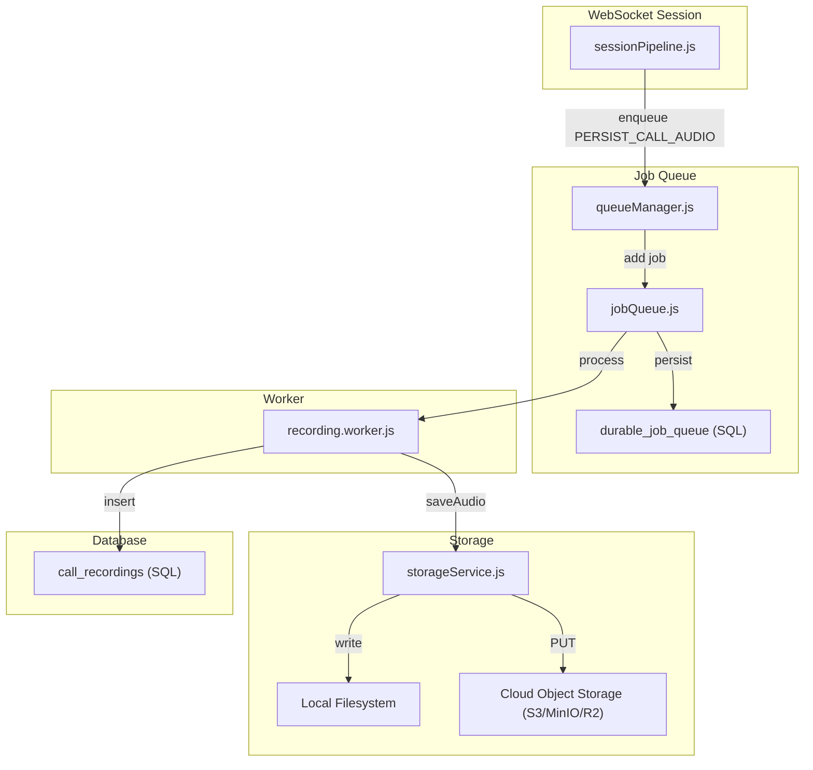
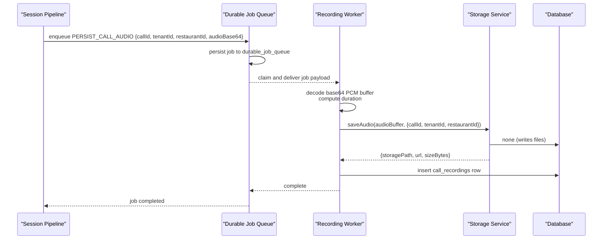
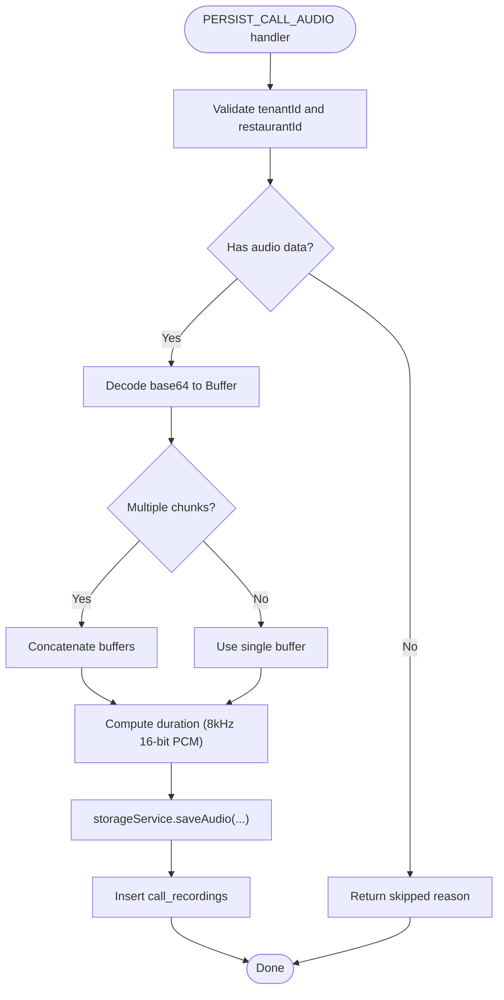
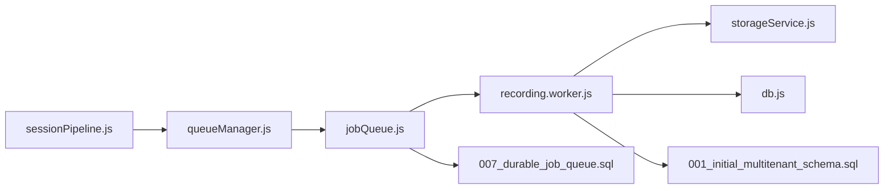

# Recording Worker Processing

<cite>
**Referenced Files in This Document**
- [recording.worker.js](file://server/src/workers/recording.worker.js)
- [queueManager.js](file://server/src/queue/queueManager.js)
- [jobQueue.js](file://server/src/queue/jobQueue.js)
- [storageService.js](file://server/src/infra/storageService.js)
- [audioUtils.js](file://server/src/utils/audioUtils.js)
- [sessionPipeline.js](file://server/src/websocket/sessionPipeline.js)
- [db.js](file://server/src/db.js)
- [007_durable_job_queue.sql](file://server/src/db/migrations/007_durable_job_queue.sql)
- [001_initial_multitenant_schema.sql](file://server/src/db/migrations/001_initial_multitenant_schema.sql)
</cite>

## Table of Contents
1. Introduction
2. Project Structure
3. Core Components
4. Architecture Overview
5. Detailed Component Analysis
6. Dependency Analysis
7. Performance Considerations
8. Troubleshooting Guide
9. Conclusion

## Introduction
This document explains the recording worker that persists voice call audio recordings to storage. It covers the PERSIST_CALL_AUDIO job processing, audio buffer handling, file format considerations, metadata extraction and persistence, tenant isolation, access controls via storage keys, and integration with the storage service. It also provides guidance on memory management for large buffers, streaming upload strategies, and storage quota management.

## Project Structure
The recording pipeline spans several modules:
- Session pipeline enqueues recording jobs at call end.
- A durable job queue persists and schedules jobs with retry and DLQ semantics.
- The recording worker processes PERSIST_CALL_AUDIO jobs, decodes audio buffers, saves files with tenant-scoped keys, and records metadata.
- Storage service writes local files and optionally uploads to cloud object storage with multi-tenant directory scoping.
- Database migrations define the durable job queue and call recordings tables.

**Diagram sources**
- [sessionPipeline.js:400-416](file://server/src/websocket/sessionPipeline.js#L400-L416)
- [queueManager.js:96-102](file://server/src/queue/queueManager.js#L96-L102)
- [jobQueue.js:47-76](file://server/src/queue/jobQueue.js#L47-L76)
- [007_durable_job_queue.sql:5-22](file://server/src/db/migrations/007_durable_job_queue.sql#L5-L22)
- [recording.worker.js:10-49](file://server/src/workers/recording.worker.js#L10-L49)
- [storageService.js:25-90](file://server/src/infra/storageService.js#L25-L90)
- [001_initial_multitenant_schema.sql:213-221](file://server/src/db/migrations/001_initial_multitenant_schema.sql#L213-L221)

**Section sources**
- [sessionPipeline.js:400-416](file://server/src/websocket/sessionPipeline.js#L400-L416)
- [queueManager.js:96-102](file://server/src/queue/queueManager.js#L96-L102)
- [jobQueue.js:47-76](file://server/src/queue/jobQueue.js#L47-L76)
- [007_durable_job_queue.sql:5-22](file://server/src/db/migrations/007_durable_job_queue.sql#L5-L22)
- [recording.worker.js:10-49](file://server/src/workers/recording.worker.js#L10-L49)
- [storageService.js:25-90](file://server/src/infra/storageService.js#L25-L90)
- [001_initial_multitenant_schema.sql:213-221](file://server/src/db/migrations/001_initial_multitenant_schema.sql#L213-L221)

## Core Components
- Recording Worker: Processes PERSIST_CALL_AUDIO jobs, handles base64 PCM buffers, computes duration, persists audio via storage service, and records metadata.
- Durable Job Queue: Persists jobs to a database table, claims them atomically, retries with exponential backoff, and routes failures to a dead-letter queue.
- Storage Service: Generates multi-tenant object keys, writes local WAV files, and optionally uploads to cloud object storage; returns playback URLs.
- Audio Utilities: Codec conversion utilities for telephony audio (mu-law and PCM), and resampling helpers.
- Session Pipeline: Aggregates audio chunks during a call and enqueues a PERSIST_CALL_AUDIO job at session end.

Key responsibilities and interactions are detailed in the following sections.

**Section sources**
- [recording.worker.js:10-49](file://server/src/workers/recording.worker.js#L10-L49)
- [jobQueue.js:14-212](file://server/src/queue/jobQueue.js#L14-L212)
- [storageService.js:15-90](file://server/src/infra/storageService.js#L15-L90)
- [audioUtils.js:1-84](file://server/src/utils/audioUtils.js#L1-L84)
- [sessionPipeline.js:400-416](file://server/src/websocket/sessionPipeline.js#L400-L416)

## Architecture Overview
The end-to-end flow:
1. During a call, audio chunks are accumulated in the session.
2. At call end, the session pipeline concatenates chunks into a base64-encoded buffer and enqueues a PERSIST_CALL_AUDIO job.
3. The durable job queue stores the job, claims it, and invokes the recording worker processor.
4. The worker decodes the base64 buffer, calculates duration, saves the audio via storage service, and inserts a recording record.
5. Storage service writes a WAV file under a tenant-scoped path and optionally uploads to cloud storage.

**Diagram sources**
- [sessionPipeline.js:400-416](file://server/src/websocket/sessionPipeline.js#L400-L416)
- [jobQueue.js:47-76](file://server/src/queue/jobQueue.js#L47-L76)
- [jobQueue.js:107-212](file://server/src/queue/jobQueue.js#L107-L212)
- [recording.worker.js:10-49](file://server/src/workers/recording.worker.js#L10-L49)
- [storageService.js:25-90](file://server/src/infra/storageService.js#L25-L90)
- [db.js:196-202](file://server/src/db.js#L196-L202)
- [007_durable_job_queue.sql:5-22](file://server/src/db/migrations/007_durable_job_queue.sql#L5-L22)
- [001_initial_multitenant_schema.sql:213-221](file://server/src/db/migrations/001_initial_multitenant_schema.sql#L213-L221)

## Detailed Component Analysis

### PERSIST_CALL_AUDIO Job Processing
- Input validation: Requires tenantId and restaurantId; otherwise fails fast.
- Audio decoding: Accepts either a single base64 audio string or an array of base64 chunks; decodes to Buffer and concatenates if needed.
- Duration calculation: Assumes 8 kHz, 16-bit PCM (2 bytes per sample) to compute duration in seconds.
- Storage: Delegates to storage service with tenant and restaurant context.
- Metadata: Inserts a call_recordings row with call identifiers, audio path, duration, and dispute status.

**Diagram sources**
- [recording.worker.js:10-49](file://server/src/workers/recording.worker.js#L10-L49)

**Section sources**
- [recording.worker.js:10-49](file://server/src/workers/recording.worker.js#L10-L49)

### Audio Buffer Handling and Format Conversion
- Current worker expects PCM16 at 8 kHz when computing duration; ensure upstream encoding matches this assumption.
- If upstream audio is mu-law (common for telephony providers), convert using provided utilities before saving or processing.
- Resampling utilities allow converting between 16 kHz and 8 kHz PCM16 if needed.

Recommended usage patterns:
- Convert mu-law to PCM16 before buffering or prior to duration calculation.
- Use resampling only when downstream components require a different sample rate.

**Section sources**
- [audioUtils.js:21-84](file://server/src/utils/audioUtils.js#L21-L84)
- [recording.worker.js:31-33](file://server/src/workers/recording.worker.js#L31-L33)

### Storage Integration and Tenant Isolation
- Multi-tenant key generation: Keys include tenantId, restaurantId, year/month folders, and a unique call identifier with .wav extension.
- Local persistence: Writes WAV files under a tenant-scoped directory structure.
- Cloud upload: When configured, performs HTTP PUT to a cloud endpoint with appropriate headers and body.
- Playback URL: Returns a URL derived from public host and call identifier for retrieval.

Access control considerations:
- Enforce tenant and restaurant checks at API boundaries before serving audio.
- Use signed URLs or short-lived tokens for playback to prevent unauthorized access.

**Section sources**
- [storageService.js:25-90](file://server/src/infra/storageService.js#L25-L90)

### Metadata Extraction and Persistence
- Duration: Computed from buffer length assuming 8 kHz, 16-bit PCM.
- Call identifiers: callId and optional callSid are persisted alongside audio path and dispute status.
- Database schema: call_recordings table stores these fields with timestamps.

**Section sources**
- [recording.worker.js:31-49](file://server/src/workers/recording.worker.js#L31-L49)
- [db.js:196-202](file://server/src/db.js#L196-L202)
- [001_initial_multitenant_schema.sql:213-221](file://server/src/db/migrations/001_initial_multitenant_schema.sql#L213-L221)

### Enqueuing Recordings from Sessions
- At session end, audio chunks are concatenated and encoded to base64, then enqueued with call identifiers and tenant context.
- The queue manager exposes a helper to enqueue recording jobs consistently.

**Section sources**
- [sessionPipeline.js:400-416](file://server/src/websocket/sessionPipeline.js#L400-L416)
- [queueManager.js:96-102](file://server/src/queue/queueManager.js#L96-L102)

### Durable Job Queue Behavior
- Jobs are persisted to durable_job_queue with status transitions: pending -> processing -> completed/dlq.
- Atomic claiming prevents duplicate processing across workers.
- Stale job recovery reclaims jobs locked by crashed workers after a timeout.
- Retry policy uses exponential backoff; persistent failures move to DLQ.

**Section sources**
- [jobQueue.js:14-212](file://server/src/queue/jobQueue.js#L14-L212)
- [007_durable_job_queue.sql:5-22](file://server/src/db/migrations/007_durable_job_queue.sql#L5-L22)

## Dependency Analysis

**Diagram sources**
- [sessionPipeline.js:400-416](file://server/src/websocket/sessionPipeline.js#L400-L416)
- [queueManager.js:96-102](file://server/src/queue/queueManager.js#L96-L102)
- [jobQueue.js:47-76](file://server/src/queue/jobQueue.js#L47-L76)
- [recording.worker.js:10-49](file://server/src/workers/recording.worker.js#L10-L49)
- [storageService.js:25-90](file://server/src/infra/storageService.js#L25-L90)
- [db.js:196-202](file://server/src/db.js#L196-L202)
- [007_durable_job_queue.sql:5-22](file://server/src/db/migrations/007_durable_job_queue.sql#L5-L22)
- [001_initial_multitenant_schema.sql:213-221](file://server/src/db/migrations/001_initial_multitenant_schema.sql#L213-L221)

**Section sources**
- [queueManager.js:96-102](file://server/src/queue/queueManager.js#L96-L102)
- [jobQueue.js:47-76](file://server/src/queue/jobQueue.js#L47-L76)
- [recording.worker.js:10-49](file://server/src/workers/recording.worker.js#L10-L49)
- [storageService.js:25-90](file://server/src/infra/storageService.js#L25-L90)
- [db.js:196-202](file://server/src/db.js#L196-L202)
- [007_durable_job_queue.sql:5-22](file://server/src/db/migrations/007_durable_job_queue.sql#L5-L22)
- [001_initial_multitenant_schema.sql:213-221](file://server/src/db/migrations/001_initial_multitenant_schema.sql#L213-L221)

## Performance Considerations
- Memory management for large buffers:
  - Avoid holding entire call audio in memory when possible. Stream chunks to disk or use temporary files to reduce peak memory.
  - For very long calls, consider writing intermediate segments and concatenating at the end, or implement chunked uploads.
- Streaming uploads:
  - Replace in-memory PUT with streaming upload to cloud storage to minimize memory footprint.
  - Use multipart upload for large objects to improve reliability and performance.
- Compression and quality:
  - Current implementation writes WAV (PCM). For storage efficiency, consider transcoding to compressed formats (e.g., Opus or AAC) post-save, balancing quality and retention costs.
  - Ensure codec conversions preserve sample rate and bit depth requirements for downstream analytics.
- Retention policies:
  - Implement lifecycle rules on object storage to auto-expire recordings after a defined period.
  - Periodic cleanup jobs can delete local files and corresponding DB rows based on retention windows.
- Concurrency and throughput:
  - Tune queue concurrency and maxRetries to match I/O capacity.
  - Monitor DLQ growth and set up alerts for persistent failures.

[No sources needed since this section provides general guidance]

## Troubleshooting Guide
Common issues and resolutions:
- Missing tenant context:
  - Error: Explicit tenantId and restaurantId required.
  - Resolution: Ensure session and enqueue paths propagate tenantId and restaurantId.
- No audio captured:
  - Outcome: Job returns skipped with reason indicating no audio chunks.
  - Resolution: Verify upstream audio capture and chunk aggregation logic.
- Incorrect audio format assumptions:
  - Symptom: Duration mismatch or playback issues.
  - Resolution: Confirm 8 kHz, 16-bit PCM assumption; apply mu-law to PCM16 conversion if needed.
- Cloud upload failures:
  - Symptom: Warning logs about failed cloud upload; file retained locally.
  - Resolution: Check environment configuration for cloud endpoints and credentials; validate network connectivity.
- Job stuck or retried excessively:
  - Cause: Processor errors or unhandled exceptions.
  - Resolution: Inspect DLQ entries and last_error; fix underlying issues; adjust maxRetries/backoff if necessary.

Operational tips:
- Monitor queue stats (pending, processing, completed, dlq) to detect bottlenecks.
- Log storage sizes and durations to track growth and plan capacity.
- Set up alerts for DLQ spikes and storage write failures.

**Section sources**
- [recording.worker.js:13-27](file://server/src/workers/recording.worker.js#L13-L27)
- [storageService.js:63-77](file://server/src/infra/storageService.js#L63-L77)
- [jobQueue.js:182-207](file://server/src/queue/jobQueue.js#L182-L207)

## Conclusion
The recording worker reliably persists voice call audio with tenant isolation and structured metadata. It integrates with a durable job queue for resilience and a storage service that supports local and cloud backends. To scale effectively, adopt streaming uploads, compression where appropriate, and robust retention policies. Ensure correct audio format handling and enforce access controls at retrieval time to maintain security and compliance.

[No sources needed since this section summarizes without analyzing specific files]