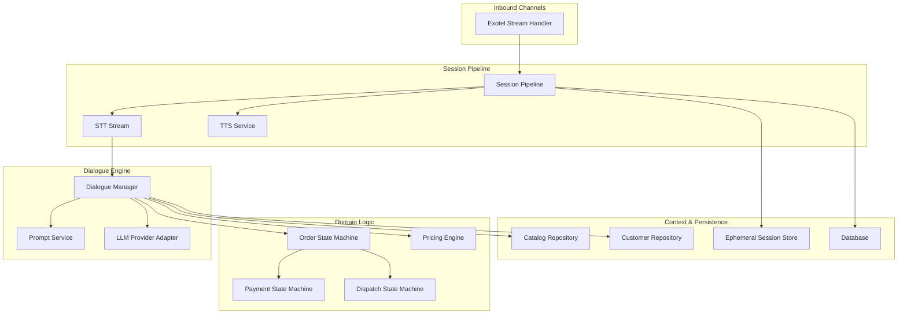
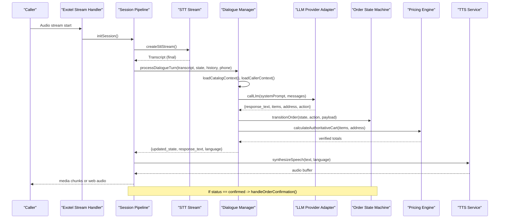
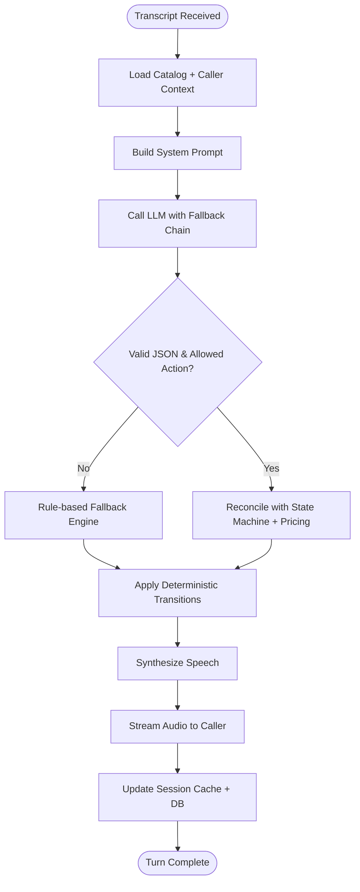
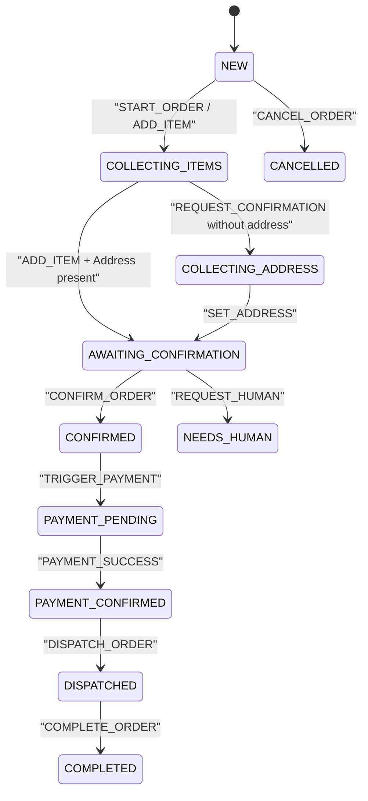
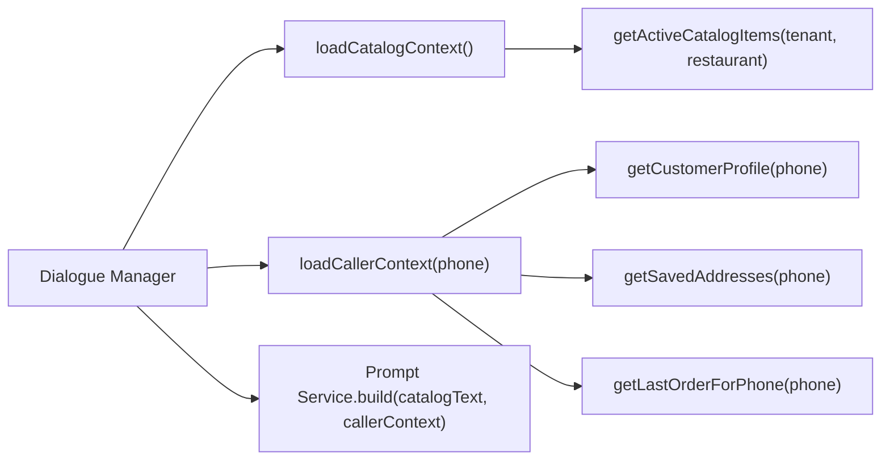
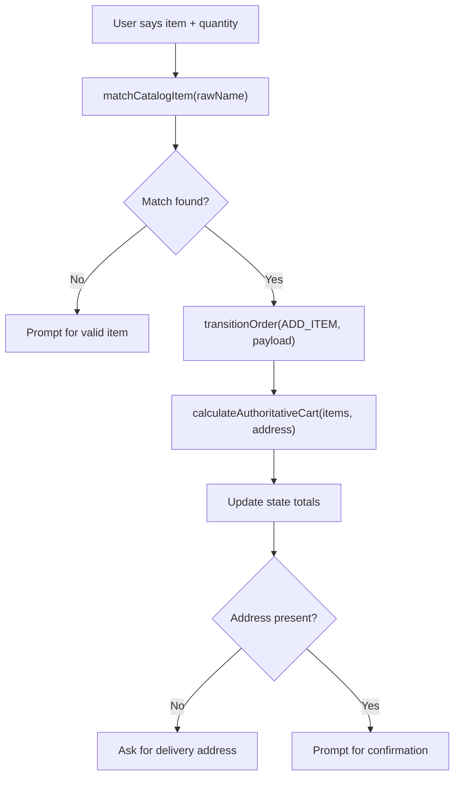
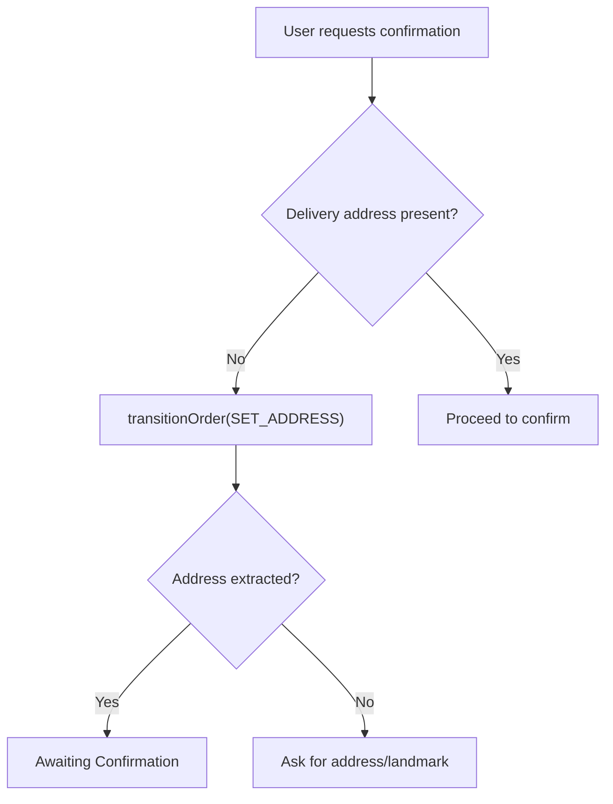
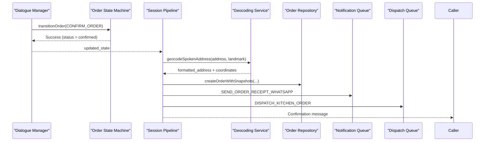
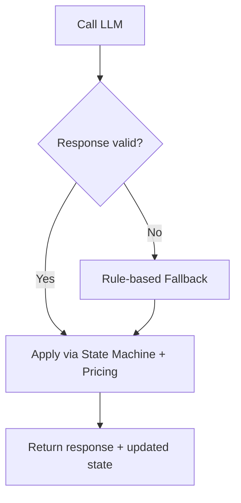
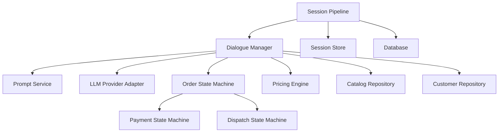

# Conversation Flow Management

<cite>
**Referenced Files in This Document**
- [dialogueManager.js](file://server/src/services/dialogueManager.js)
- [orderStateMachine.js](file://server/src/domain/orders/orderStateMachine.js)
- [dispatchStateMachine.js](file://server/src/domain/dispatch/dispatchStateMachine.js)
- [paymentStateMachine.js](file://server/src/domain/payments/paymentStateMachine.js)
- [sessionPipeline.js](file://server/src/websocket/sessionPipeline.js)
- [promptService.js](file://server/src/services/promptService.js)
- [pricingEngine.js](file://server/src/domain/orders/pricingEngine.js)
- [llmProviderAdapter.js](file://server/src/services/llmProviderAdapter.js)
- [customer.repository.js](file://server/src/domain/customers/customer.repository.js)
- [catalog.repository.js](file://server/src/domain/catalog/catalog.repository.js)
- [db.js](file://server/src/db.js)
- [sessionStore.js](file://server/src/infra/sessionStore.js)
- [exotelStreamHandler.js](file://server/src/websocket/exotelStreamHandler.js)
</cite>

## Table of Contents
1. [Introduction](#introduction)
2. [Project Structure](#project-structure)
3. [Core Components](#core-components)
4. [Architecture Overview](#architecture-overview)
5. [Detailed Component Analysis](#detailed-component-analysis)
6. [Dependency Analysis](#dependency-analysis)
7. [Performance Considerations](#performance-considerations)
8. [Troubleshooting Guide](#troubleshooting-guide)
9. [Conclusion](#conclusion)
10. [Appendices](#appendices)

## Introduction
This document explains how the dialogue orchestration engine manages conversation flows across multi-turn voice interactions. It covers:
- Conversational state management and turn-taking between callers and AI
- Context loading for customer profiles, saved addresses, last orders, and catalog data
- State machine integration ensuring consistent progression from greeting to order confirmation
- Handling interruptions and domain-specific patterns (item collection, address gathering, confirmation)
- Customization points for conversation flows and fallback behavior

The system is designed around a strict principle: “AI suggests; code decides.” The LLM proposes actions and extracts entities, while deterministic state machines and pricing engines enforce authoritative transitions and calculations.

## Project Structure
At a high level, the conversation flow spans these layers:
- WebSocket handlers initialize sessions and stream audio transcripts to the pipeline
- Session pipeline orchestrates STT, dialogue turns, TTS, and post-processing
- Dialogue manager composes prompts with context, calls LLMs, reconciles outputs, and applies state machine transitions
- Domain state machines govern order, payment, and dispatch lifecycles deterministically
- Repositories and services load catalog and customer context and persist outcomes

**Diagram sources**
- [exotelStreamHandler.js:23-42](file://server/src/websocket/exotelStreamHandler.js#L23-L42)
- [sessionPipeline.js:24-127](file://server/src/websocket/sessionPipeline.js#L24-L127)
- [dialogueManager.js:36-84](file://server/src/services/dialogueManager.js#L36-L84)
- [promptService.js:14-61](file://server/src/services/promptService.js#L14-L61)
- [llmProviderAdapter.js:226-262](file://server/src/services/llmProviderAdapter.js#L226-L262)
- [orderStateMachine.js:154-324](file://server/src/domain/orders/orderStateMachine.js#L154-L324)
- [pricingEngine.js:16-71](file://server/src/domain/orders/pricingEngine.js#L16-L71)
- [catalog.repository.js:23-46](file://server/src/domain/catalog/catalog.repository.js#L23-L46)
- [customer.repository.js:7-12](file://server/src/domain/customers/customer.repository.js#L7-L12)
- [sessionStore.js:13-29](file://server/src/infra/sessionStore.js#L13-L29)
- [db.js:124-194](file://server/src/db.js#L124-L194)

**Section sources**
- [exotelStreamHandler.js:23-42](file://server/src/websocket/exotelStreamHandler.js#L23-L42)
- [sessionPipeline.js:24-127](file://server/src/websocket/sessionPipeline.js#L24-L127)
- [dialogueManager.js:36-84](file://server/src/services/dialogueManager.js#L36-L84)

## Core Components
- Session Pipeline: Initializes voice sessions, streams audio to STT, processes final transcripts, persists state, and triggers fulfillment on confirmation.
- Dialogue Manager: Builds prompts with catalog and caller context, calls LLMs with provider fallback, reconciles proposed actions with authoritative state machines and pricing, and returns deterministic responses.
- Order State Machine: Authoritative lifecycle for orders with strict transitions for item collection, address gathering, validation, confirmation, payment, dispatch, completion, cancellation, and human escalation.
- Payment State Machine: Independent lifecycle for payments (COD, online link creation, processing, success/failure/expiry/refund).
- Dispatch State Machine: Independent lifecycle for kitchen and delivery operations.
- Pricing Engine: Deterministic catalog matching and authoritative totals calculation with tax and delivery fees.
- Prompt Service: Versioned system prompts that inject caller profile, saved addresses, last order, and menu context into LLM requests.
- LLM Provider Adapter: Multi-provider router with auto-fallback and strict JSON parsing/validation.
- Context Services: Catalog and customer repositories provide tenant-scoped data; database helpers manage profiles, addresses, and last orders.
- Ephemeral Session Store: Redis-backed cache for fast session state persistence and distribution.

**Section sources**
- [sessionPipeline.js:24-127](file://server/src/websocket/sessionPipeline.js#L24-L127)
- [dialogueManager.js:36-84](file://server/src/services/dialogueManager.js#L36-L84)
- [orderStateMachine.js:8-41](file://server/src/domain/orders/orderStateMachine.js#L8-L41)
- [paymentStateMachine.js:9-28](file://server/src/domain/payments/paymentStateMachine.js#L9-L28)
- [dispatchStateMachine.js:9-28](file://server/src/domain/dispatch/dispatchStateMachine.js#L9-L28)
- [pricingEngine.js:16-71](file://server/src/domain/orders/pricingEngine.js#L16-L71)
- [promptService.js:14-115](file://server/src/services/promptService.js#L14-L115)
- [llmProviderAdapter.js:16-68](file://server/src/services/llmProviderAdapter.js#L16-L68)
- [catalog.repository.js:23-46](file://server/src/domain/catalog/catalog.repository.js#L23-L46)
- [customer.repository.js:7-12](file://server/src/domain/customers/customer.repository.js#L7-L12)
- [db.js:124-194](file://server/src/db.js#L124-L194)
- [sessionStore.js:13-29](file://server/src/infra/sessionStore.js#L13-L29)

## Architecture Overview
The conversation flow follows a deterministic pipeline:
1. Inbound audio arrives via Exotel/WebSocket and is streamed to STT.
2. Final transcripts trigger a dialogue turn.
3. Dialogue manager loads catalog and caller context, builds a prompt, and calls LLM(s).
4. LLM output is parsed and validated; proposed actions are reconciled with the order state machine and pricing engine.
5. Responses are synthesized to speech and streamed back to the caller.
6. On order confirmation, asynchronous workers handle geocoding, order persistence, notifications, and dispatch.

**Diagram sources**
- [exotelStreamHandler.js:23-42](file://server/src/websocket/exotelStreamHandler.js#L23-L42)
- [sessionPipeline.js:54-127](file://server/src/websocket/sessionPipeline.js#L54-L127)
- [dialogueManager.js:36-84](file://server/src/services/dialogueManager.js#L36-L84)
- [llmProviderAdapter.js:226-262](file://server/src/services/llmProviderAdapter.js#L226-L262)
- [orderStateMachine.js:154-324](file://server/src/domain/orders/orderStateMachine.js#L154-L324)
- [pricingEngine.js:76-117](file://server/src/domain/orders/pricingEngine.js#L76-L117)

## Detailed Component Analysis

### Conversation Turn Processing
- The session pipeline captures final transcripts and invokes the dialogue manager with current session state and recent conversation history.
- The dialogue manager loads catalog and caller context, constructs a versioned prompt, and calls the LLM adapter.
- LLM output is parsed and strictly validated; only allowed actions are accepted.
- Reconciliation ensures proposed items and addresses are applied authoritatively through the order state machine and pricing engine.
- The pipeline synthesizes speech and streams it back to the caller, then updates ephemeral session storage and database records.

**Diagram sources**
- [sessionPipeline.js:132-198](file://server/src/websocket/sessionPipeline.js#L132-L198)
- [dialogueManager.js:36-84](file://server/src/services/dialogueManager.js#L36-L84)
- [llmProviderAdapter.js:169-215](file://server/src/services/llmProviderAdapter.js#L169-L215)
- [orderStateMachine.js:154-324](file://server/src/domain/orders/orderStateMachine.js#L154-L324)

**Section sources**
- [sessionPipeline.js:132-198](file://server/src/websocket/sessionPipeline.js#L132-L198)
- [dialogueManager.js:36-84](file://server/src/services/dialogueManager.js#L36-L84)
- [llmProviderAdapter.js:169-215](file://server/src/services/llmProviderAdapter.js#L169-L215)

### State Machine Integration (Order Lifecycle)
- The order state machine defines explicit states and allowed transitions for each phase: new, collecting items, collecting address, validating, awaiting confirmation, confirmed, payment pending/confirmed, dispatched, completed, cancelled, needs human.
- Actions like START_ORDER, ADD_ITEM, SET_ADDRESS, REQUEST_CONFIRMATION, CONFIRM_ORDER, CANCEL_ORDER, TRIGGER_PAYMENT, PAYMENT_SUCCESS, DISPATCH_ORDER, COMPLETE_ORDER, REQUEST_HUMAN are enforced by canTransition checks.
- The dialogue manager uses transitionOrder to apply changes authoritatively, ensuring illegal transitions are rejected and totals are recalculated.

**Diagram sources**
- [orderStateMachine.js:8-41](file://server/src/domain/orders/orderStateMachine.js#L8-L41)
- [orderStateMachine.js:73-148](file://server/src/domain/orders/orderStateMachine.js#L73-L148)
- [orderStateMachine.js:154-324](file://server/src/domain/orders/orderStateMachine.js#L154-L324)

**Section sources**
- [orderStateMachine.js:73-148](file://server/src/domain/orders/orderStateMachine.js#L73-L148)
- [orderStateMachine.js:154-324](file://server/src/domain/orders/orderStateMachine.js#L154-L324)

### Context Loading Mechanisms
- Catalog context: Active items are loaded from the catalog repository with tenant and restaurant scoping; results are cached briefly to reduce latency.
- Caller context: Customer profile, saved addresses, and last order are fetched concurrently for personalization and recommendations.
- Prompt injection: Versioned prompts include caller profile details, dietary preferences, saved addresses, last order summary, and menu items to guide LLM behavior.

**Diagram sources**
- [dialogueManager.js:7-34](file://server/src/services/dialogueManager.js#L7-L34)
- [pricingEngine.js:16-45](file://server/src/domain/orders/pricingEngine.js#L16-L45)
- [catalog.repository.js:23-46](file://server/src/domain/catalog/catalog.repository.js#L23-L46)
- [db.js:124-194](file://server/src/db.js#L124-L194)
- [promptService.js:14-61](file://server/src/services/promptService.js#L14-L61)

**Section sources**
- [dialogueManager.js:7-34](file://server/src/services/dialogueManager.js#L7-L34)
- [pricingEngine.js:16-45](file://server/src/domain/orders/pricingEngine.js#L16-L45)
- [catalog.repository.js:23-46](file://server/src/domain/catalog/catalog.repository.js#L23-L46)
- [db.js:124-194](file://server/src/db.js#L124-L194)
- [promptService.js:14-61](file://server/src/services/promptService.js#L14-L61)

### Item Collection Phase
- The rule engine recognizes quantities and matches spoken item names to official catalog entries using fuzzy matching.
- Items are added via transitionOrder(ADD_ITEM), which merges duplicates and updates totals.
- After adding items, the system re-verifies cart authoritatively using the pricing engine to ensure correct subtotal, tax, delivery fee, and total.

**Diagram sources**
- [dialogueManager.js:252-284](file://server/src/services/dialogueManager.js#L252-L284)
- [pricingEngine.js:50-71](file://server/src/domain/orders/pricingEngine.js#L50-L71)
- [orderStateMachine.js:173-195](file://server/src/domain/orders/orderStateMachine.js#L173-L195)

**Section sources**
- [dialogueManager.js:252-284](file://server/src/services/dialogueManager.js#L252-L284)
- [pricingEngine.js:50-71](file://server/src/domain/orders/pricingEngine.js#L50-L71)
- [orderStateMachine.js:173-195](file://server/src/domain/orders/orderStateMachine.js#L173-L195)

### Address Gathering Phase
- When confirmation is requested without an address, the state transitions to collecting_address.
- The rule engine detects address-related keywords and extracts landmarks when present.
- Setting the address moves the state to awaiting_confirmation if items exist, otherwise remains in item collection.

**Diagram sources**
- [dialogueManager.js:196-250](file://server/src/services/dialogueManager.js#L196-L250)
- [orderStateMachine.js:216-243](file://server/src/domain/orders/orderStateMachine.js#L216-L243)

**Section sources**
- [dialogueManager.js:196-250](file://server/src/services/dialogueManager.js#L196-L250)
- [orderStateMachine.js:216-243](file://server/src/domain/orders/orderStateMachine.js#L216-L243)

### Order Confirmation Phase
- Confirmation requires items and a delivery address; otherwise, the state machine rejects the transition with specific errors.
- Upon successful confirmation, the session pipeline asynchronously handles geocoding, saving addresses, creating the master order with snapshots, incrementing customer order counts, queuing dispatch and notifications, and broadcasting events.

**Diagram sources**
- [orderStateMachine.js:245-261](file://server/src/domain/orders/orderStateMachine.js#L245-L261)
- [sessionPipeline.js:299-389](file://server/src/websocket/sessionPipeline.js#L299-L389)

**Section sources**
- [orderStateMachine.js:245-261](file://server/src/domain/orders/orderStateMachine.js#L245-L261)
- [sessionPipeline.js:299-389](file://server/src/websocket/sessionPipeline.js#L299-L389)

### Interruptions and Fallback Behavior
- If LLM providers fail or return invalid output, the system falls back to a deterministic rule engine that handles greetings, price inquiries, menu questions, confirmation/cancellation, address recognition, and item addition.
- The rule engine maintains state consistency and provides natural responses even when AI components are unavailable.

**Diagram sources**
- [dialogueManager.js:60-84](file://server/src/services/dialogueManager.js#L60-L84)
- [dialogueManager.js:137-301](file://server/src/services/dialogueManager.js#L137-L301)
- [llmProviderAdapter.js:226-262](file://server/src/services/llmProviderAdapter.js#L226-L262)

**Section sources**
- [dialogueManager.js:60-84](file://server/src/services/dialogueManager.js#L60-L84)
- [dialogueManager.js:137-301](file://server/src/services/dialogueManager.js#L137-L301)
- [llmProviderAdapter.js:226-262](file://server/src/services/llmProviderAdapter.js#L226-L262)

### Customizing Conversation Flows
- Prompt versions: Use different prompt builders to adjust tone, safety rules, upselling behavior, and output format constraints.
- Provider configuration: Set primary provider and environment keys to control fallback chain and model selection.
- Rule engine customization: Extend pattern matching for domain-specific intents (e.g., promotions, dietary filters, special instructions).
- State machine extensions: Add new actions and transitions carefully, ensuring canTransition guards and transitionOrder logic remain consistent.

**Section sources**
- [promptService.js:14-115](file://server/src/services/promptService.js#L14-L115)
- [llmProviderAdapter.js:16-68](file://server/src/services/llmProviderAdapter.js#L16-L68)
- [dialogueManager.js:137-301](file://server/src/services/dialogueManager.js#L137-L301)
- [orderStateMachine.js:73-148](file://server/src/domain/orders/orderStateMachine.js#L73-L148)

## Dependency Analysis
Key dependencies and relationships:
- Session Pipeline depends on STT/TTS services, dialogue manager, geocoding service, session store, and queues for async work.
- Dialogue Manager depends on prompt service, LLM adapter, order state machine, and pricing engine; also loads catalog and customer context via repositories and database helpers.
- Order/Payment/Dispatch state machines are independent but coordinated by higher-level services during fulfillment.
- Catalog and customer repositories enforce tenant isolation and provide accurate context for personalization and pricing.

**Diagram sources**
- [sessionPipeline.js:24-127](file://server/src/websocket/sessionPipeline.js#L24-L127)
- [dialogueManager.js:36-84](file://server/src/services/dialogueManager.js#L36-L84)
- [orderStateMachine.js:154-324](file://server/src/domain/orders/orderStateMachine.js#L154-L324)
- [paymentStateMachine.js:86-149](file://server/src/domain/payments/paymentStateMachine.js#L86-L149)
- [dispatchStateMachine.js:82-146](file://server/src/domain/dispatch/dispatchStateMachine.js#L82-L146)
- [catalog.repository.js:23-46](file://server/src/domain/catalog/catalog.repository.js#L23-L46)
- [customer.repository.js:7-12](file://server/src/domain/customers/customer.repository.js#L7-L12)
- [sessionStore.js:13-29](file://server/src/infra/sessionStore.js#L13-L29)
- [db.js:124-194](file://server/src/db.js#L124-L194)

**Section sources**
- [sessionPipeline.js:24-127](file://server/src/websocket/sessionPipeline.js#L24-L127)
- [dialogueManager.js:36-84](file://server/src/services/dialogueManager.js#L36-L84)
- [orderStateMachine.js:154-324](file://server/src/domain/orders/orderStateMachine.js#L154-L324)

## Performance Considerations
- Catalog caching reduces repeated database queries for active items within short intervals.
- Ephemeral session store uses Redis for low-latency read/write of session state across distributed instances.
- LLM provider fallback chain minimizes downtime and improves responsiveness by trying multiple providers.
- Streaming audio in small chunks reduces latency for TTS playback.
- Asynchronous queues offload non-critical tasks (notifications, dispatch, recording) to keep the main conversation path fast.

[No sources needed since this section provides general guidance]

## Troubleshooting Guide
Common issues and diagnostics:
- LLM failures: Check provider configuration and environment keys; review fallback logs and ensure at least one provider is available.
- Invalid LLM output: Ensure prompts enforce JSON structure; verify parse and validation steps reject malformed responses.
- Illegal state transitions: Review canTransition logic and ensure actions match current order state; inspect error messages returned by transition functions.
- Missing context: Verify tenant and restaurant IDs are set; ensure catalog and customer repositories return scoped data.
- Session persistence: Confirm Redis connectivity and TTL settings; check database writes for call logs and state updates.

**Section sources**
- [llmProviderAdapter.js:226-262](file://server/src/services/llmProviderAdapter.js#L226-L262)
- [llmProviderAdapter.js:169-215](file://server/src/services/llmProviderAdapter.js#L169-L215)
- [orderStateMachine.js:154-163](file://server/src/domain/orders/orderStateMachine.js#L154-L163)
- [catalog.repository.js:23-46](file://server/src/domain/catalog/catalog.repository.js#L23-L46)
- [sessionStore.js:13-29](file://server/src/infra/sessionStore.js#L13-L29)
- [sessionPipeline.js:132-198](file://server/src/websocket/sessionPipeline.js#L132-L198)

## Conclusion
The conversation flow management system combines flexible AI suggestions with strict, deterministic enforcement via state machines and pricing engines. This design ensures reliable, auditable order lifecycles while maintaining natural, responsive voice interactions. Context loading personalizes conversations, and asynchronous workflows keep the real-time path efficient. Customization points allow adaptation to domain-specific requirements without compromising authority and correctness.

[No sources needed since this section summarizes without analyzing specific files]

## Appendices

### Example: Customizing Conversation Flows
- Adjust prompt versions to change tone, safety rules, and upselling strategies.
- Configure provider chain to prioritize speed or reliability based on environment.
- Extend rule patterns for domain-specific intents such as promotions, dietary restrictions, or special instructions.
- Introduce new state machine actions cautiously, updating both canTransition and transitionOrder to maintain consistency.

**Section sources**
- [promptService.js:14-115](file://server/src/services/promptService.js#L14-L115)
- [llmProviderAdapter.js:16-68](file://server/src/services/llmProviderAdapter.js#L16-L68)
- [dialogueManager.js:137-301](file://server/src/services/dialogueManager.js#L137-L301)
- [orderStateMachine.js:73-148](file://server/src/domain/orders/orderStateMachine.js#L73-L148)