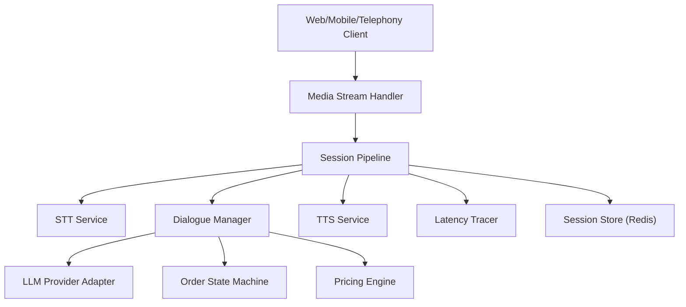
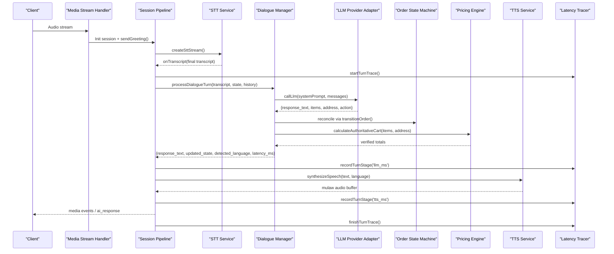
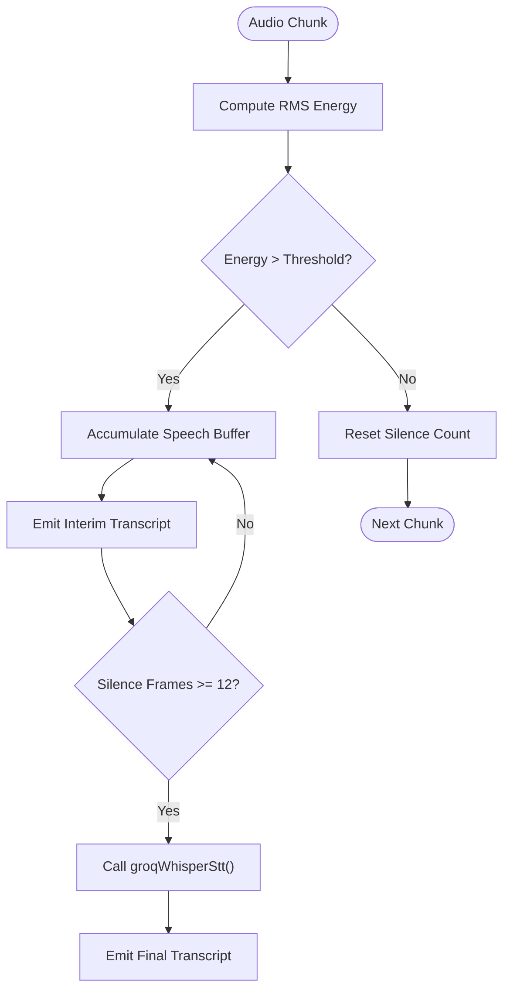
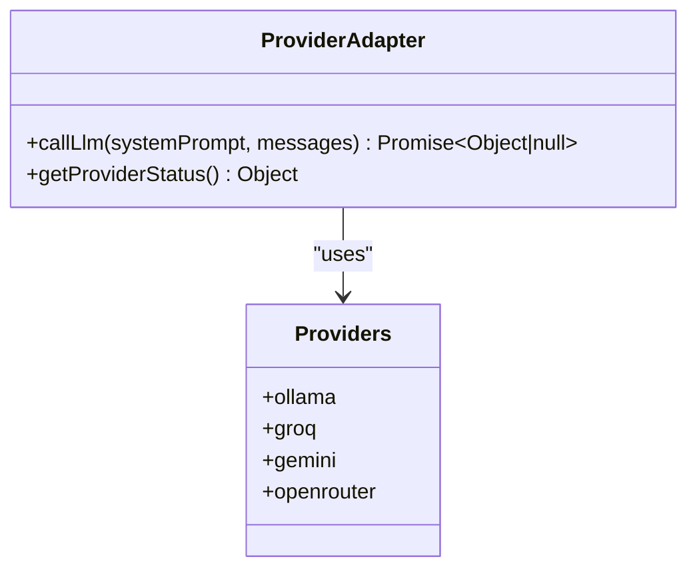
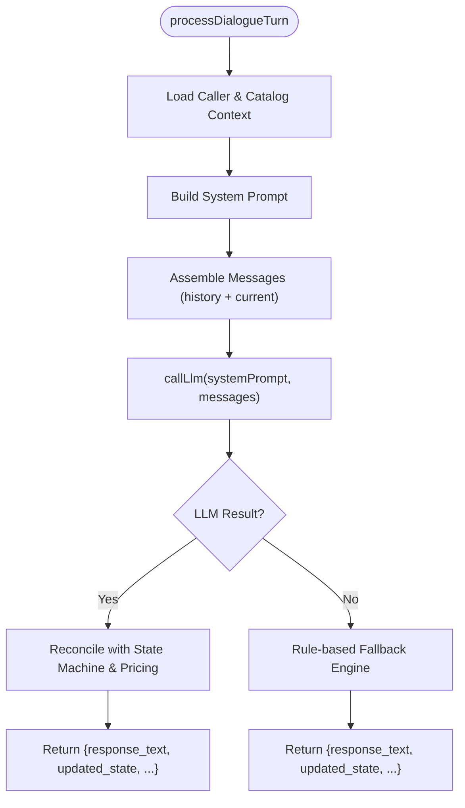
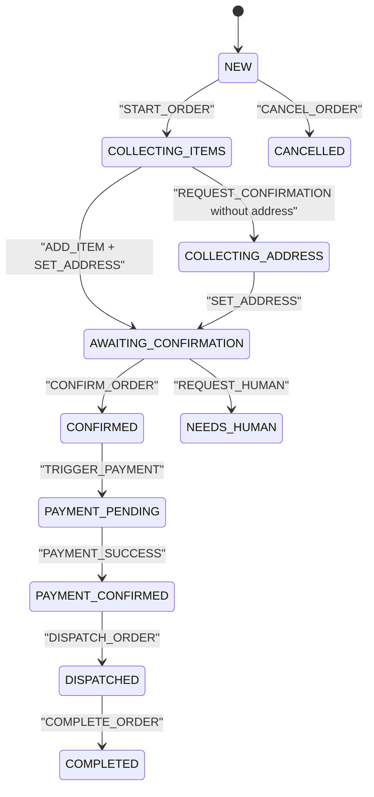
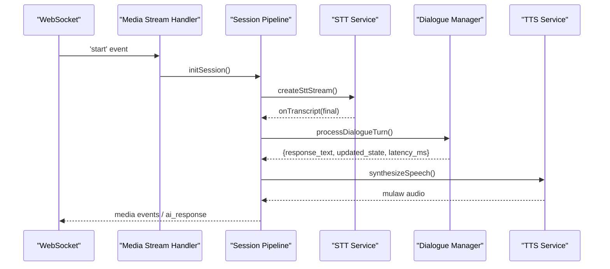
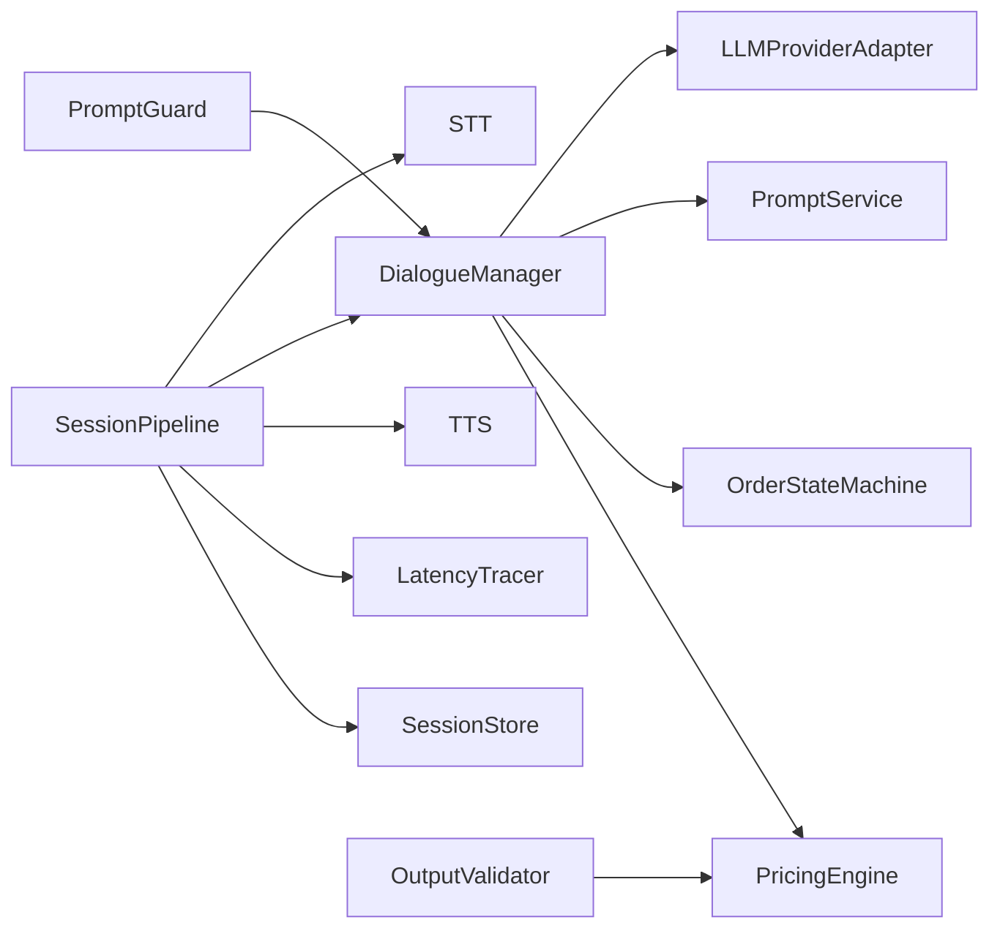

# Dialogue Orchestration Engine

<cite>
**Referenced Files in This Document**
- [sessionPipeline.js](file://server/src/websocket/sessionPipeline.js)
- [mediaStreamHandler.js](file://server/src/websocket/mediaStreamHandler.js)
- [dialogueManager.js](file://server/src/services/dialogueManager.js)
- [sttService.js](file://server/src/services/sttService.js)
- [ttsService.js](file://server/src/services/ttsService.js)
- [llmProviderAdapter.js](file://server/src/services/llmProviderAdapter.js)
- [promptService.js](file://server/src/services/promptService.js)
- [orderStateMachine.js](file://server/src/domain/orders/orderStateMachine.js)
- [pricingEngine.js](file://server/src/domain/orders/pricingEngine.js)
- [outputValidator.js](file://server/src/services/dialogue/outputValidator.js)
- [promptGuard.js](file://server/src/services/dialogue/promptGuard.js)
- [latencyTracer.js](file://server/src/services/latencyTracer.js)
- [sessionStore.js](file://server/src/infra/sessionStore.js)
</cite>

## Table of Contents
1. Introduction
2. Project Structure
3. Core Components
4. Architecture Overview
5. Detailed Component Analysis
6. Dependency Analysis
7. Performance Considerations
8. Troubleshooting Guide
9. Conclusion
10. Appendices

## Introduction
This document explains the dialogue orchestration engine that manages real-time conversational flow between callers and the AI system. It covers how speech-to-text transcripts are processed through natural language understanding, intent detection, state reconciliation, and response generation. It also documents integration with STT providers (Groq Whisper, Google Cloud), LLM providers (Ollama, Groq, Gemini, OpenRouter), and TTS providers (Sarvam, Google Cloud, mock). The system supports multi-language interactions (English/Tamil), maintains conversation context, and applies latency optimization strategies for voice conversations. Examples are provided for customizing flows, adding intents, implementing domain-specific responses, and handling edge cases.

## Project Structure
The orchestration spans WebSocket handlers, session management, STT streaming, LLM routing, prompt building, deterministic pricing/state machines, and TTS synthesis. Key modules:
- Real-time media ingestion and session lifecycle
- Speech-to-text streaming with provider selection and fallbacks
- Dialogue turn processing with LLM or rule-based fallback
- Authoritative order state machine and pricing engine
- Text-to-speech synthesis with caching and provider fallback
- Latency tracing and metrics persistence

**Diagram sources**
- [mediaStreamHandler.js:1-69](file://server/src/websocket/mediaStreamHandler.js#L1-L69)
- [sessionPipeline.js:1-437](file://server/src/websocket/sessionPipeline.js#L1-L437)
- [sttService.js:1-603](file://server/src/services/sttService.js#L1-L603)
- [dialogueManager.js:1-302](file://server/src/services/dialogueManager.js#L1-L302)
- [llmProviderAdapter.js:1-283](file://server/src/services/llmProviderAdapter.js#L1-L283)
- [orderStateMachine.js:1-325](file://server/src/domain/orders/orderStateMachine.js#L1-L325)
- [pricingEngine.js:1-117](file://server/src/domain/orders/pricingEngine.js#L1-L117)
- [ttsService.js:1-187](file://server/src/services/ttsService.js#L1-L187)
- [latencyTracer.js:1-133](file://server/src/services/latencyTracer.js#L1-L133)
- [sessionStore.js:1-92](file://server/src/infra/sessionStore.js#L1-L92)

**Section sources**
- [mediaStreamHandler.js:1-69](file://server/src/websocket/mediaStreamHandler.js#L1-L69)
- [sessionPipeline.js:1-437](file://server/src/websocket/sessionPipeline.js#L1-L437)

## Core Components
- STT Service: Multi-provider transcription with streaming support, VAD-like chunking, and catalog-aware hints.
- LLM Provider Adapter: Universal router with auto-fallback across providers; strict JSON parsing and schema validation.
- Prompt Service: Versioned system prompts with caller context and menu injection; supports A/B versions.
- Dialogue Manager: Orchestrates turns, builds messages, calls LLM, reconciles outputs with authoritative state machine and pricing, and falls back to a rule engine.
- Order State Machine: Deterministic transitions for order lifecycle; enforces business rules.
- Pricing Engine: Catalog lookup, item matching, and authoritative totals calculation.
- TTS Service: Multi-provider synthesis with caching and telephony-friendly audio formats.
- Session Pipeline: Real-time pipeline connecting STT, dialogue, TTS, and async fulfillment; tracks latencies and persists state.
- Latency Tracer: End-to-end timing per turn with metrics persistence.
- Session Store: Ephemeral Redis-backed session storage for distributed sessions.

**Section sources**
- [sttService.js:1-603](file://server/src/services/sttService.js#L1-L603)
- [llmProviderAdapter.js:1-283](file://server/src/services/llmProviderAdapter.js#L1-L283)
- [promptService.js:1-115](file://server/src/services/promptService.js#L1-L115)
- [dialogueManager.js:1-302](file://server/src/services/dialogueManager.js#L1-L302)
- [orderStateMachine.js:1-325](file://server/src/domain/orders/orderStateMachine.js#L1-L325)
- [pricingEngine.js:1-117](file://server/src/domain/orders/pricingEngine.js#L1-L117)
- [ttsService.js:1-187](file://server/src/services/ttsService.js#L1-L187)
- [sessionPipeline.js:1-437](file://server/src/websocket/sessionPipeline.js#L1-L437)
- [latencyTracer.js:1-133](file://server/src/services/latencyTracer.js#L1-L133)
- [sessionStore.js:1-92](file://server/src/infra/sessionStore.js#L1-L92)

## Architecture Overview
End-to-end flow from voice input to spoken response:

**Diagram sources**
- [mediaStreamHandler.js:1-69](file://server/src/websocket/mediaStreamHandler.js#L1-L69)
- [sessionPipeline.js:1-437](file://server/src/websocket/sessionPipeline.js#L1-L437)
- [sttService.js:1-603](file://server/src/services/sttService.js#L1-L603)
- [dialogueManager.js:1-302](file://server/src/services/dialogueManager.js#L1-L302)
- [llmProviderAdapter.js:1-283](file://server/src/services/llmProviderAdapter.js#L1-L283)
- [orderStateMachine.js:1-325](file://server/src/domain/orders/orderStateMachine.js#L1-L325)
- [pricingEngine.js:1-117](file://server/src/domain/orders/pricingEngine.js#L1-L117)
- [ttsService.js:1-187](file://server/src/services/ttsService.js#L1-L187)
- [latencyTracer.js:1-133](file://server/src/services/latencyTracer.js#L1-L133)

## Detailed Component Analysis

### STT Service (Multi-Provider Streaming)
- Providers: Groq Whisper (batch mode with VAD-like chunking), Google Cloud streaming, local Whisper Tiny, and mock.
- Features:
  - Voice activity detection via RMS energy thresholds to segment speech.
  - Contextual hints loaded from catalog to improve accuracy.
  - Language hints for Tamil/English; returns language codes and confidence.
  - Streaming interface with write/onTranscript/end methods compatible with web/telephony streams.
- Fallback chain: Groq -> Local Whisper -> Mock.

**Diagram sources**
- [sttService.js:358-454](file://server/src/services/sttService.js#L358-L454)
- [sttService.js:521-602](file://server/src/services/sttService.js#L521-L602)

**Section sources**
- [sttService.js:1-603](file://server/src/services/sttService.js#L1-L603)

### LLM Provider Adapter (Universal Router)
- Supports Ollama (local), Groq, Gemini, OpenRouter with automatic fallback chain based on environment configuration.
- Strict JSON parsing and schema validation to extract response text, proposed actions, items, addresses, landmarks, and detected language.
- Returns standardized result including provider, model, and latency.

**Diagram sources**
- [llmProviderAdapter.js:1-283](file://server/src/services/llmProviderAdapter.js#L1-L283)

**Section sources**
- [llmProviderAdapter.js:1-283](file://server/src/services/llmProviderAdapter.js#L1-L283)

### Prompt Service (Versioned System Prompts)
- Manages versioned prompts with caller context and menu injection.
- v1 and v2 variants include bilingual instructions, dietary safeguards, upselling guidance, and strict JSON output requirements.
- Active version selected via environment variable.

**Section sources**
- [promptService.js:1-115](file://server/src/services/promptService.js#L1-L115)

### Dialogue Manager (Orchestrator)
- Builds system prompt using prompt service and loads catalog and caller context.
- Constructs message history (last 10 turns) and sends to LLM.
- Reconciles LLM proposals with authoritative state machine and pricing engine.
- Falls back to a deterministic rule engine if LLM fails or is disabled.
- Returns response text, updated state, detected language, provider/model, and latency.

**Diagram sources**
- [dialogueManager.js:36-84](file://server/src/services/dialogueManager.js#L36-L84)
- [dialogueManager.js:93-132](file://server/src/services/dialogueManager.js#L93-L132)
- [dialogueManager.js:137-301](file://server/src/services/dialogueManager.js#L137-L301)

**Section sources**
- [dialogueManager.js:1-302](file://server/src/services/dialogueManager.js#L1-L302)

### Order State Machine and Pricing Engine
- State machine defines states and allowed transitions for order lifecycle; ensures business rules like requiring items and address before confirmation.
- Pricing engine matches items against active catalog and calculates authoritative totals (subtotal, tax, delivery fee, total) deterministically.

**Diagram sources**
- [orderStateMachine.js:8-41](file://server/src/domain/orders/orderStateMachine.js#L8-L41)
- [orderStateMachine.js:154-325](file://server/src/domain/orders/orderStateMachine.js#L154-L325)

**Section sources**
- [orderStateMachine.js:1-325](file://server/src/domain/orders/orderStateMachine.js#L1-L325)
- [pricingEngine.js:1-117](file://server/src/domain/orders/pricingEngine.js#L1-L117)

### TTS Service (Multi-Provider Synthesis)
- Providers: Sarvam AI (Bulbul), Google Cloud TTS, and mock tone generator.
- In-memory cache for repeated prompts to reduce latency.
- Outputs mulaw audio buffers suitable for telephony playback; includes duration helper.

**Section sources**
- [ttsService.js:1-187](file://server/src/services/ttsService.js#L1-L187)

### Session Pipeline (Real-Time Orchestration)
- Initializes sessions, sets up STT streaming, processes final transcripts, invokes dialogue manager, synthesizes TTS, and streams audio back to clients.
- Tracks latencies per stage and persists call logs and metrics.
- On order confirmation, asynchronously geocodes addresses, persists orders, dispatches kitchen orders, and sends notifications.

**Diagram sources**
- [mediaStreamHandler.js:1-69](file://server/src/websocket/mediaStreamHandler.js#L1-L69)
- [sessionPipeline.js:24-127](file://server/src/websocket/sessionPipeline.js#L24-L127)
- [sessionPipeline.js:132-219](file://server/src/websocket/sessionPipeline.js#L132-L219)
- [sessionPipeline.js:224-294](file://server/src/websocket/sessionPipeline.js#L224-L294)

**Section sources**
- [sessionPipeline.js:1-437](file://server/src/websocket/sessionPipeline.js#L1-L437)

### Output Validator and Prompt Guard
- Output validator enforces structured decision schema and cross-references extracted items against the active catalog; clamps quantities and normalizes fields.
- Prompt guard sanitizes user transcripts to prevent prompt injection and limits length to avoid token exhaustion.

**Section sources**
- [outputValidator.js:1-81](file://server/src/services/dialogue/outputValidator.js#L1-L81)
- [promptGuard.js:1-44](file://server/src/services/dialogue/promptGuard.js#L1-L44)

### Latency Tracer and Session Store
- Latency tracer records per-turn stages (VAD, STT, LLM, TTS) and persists metrics to database; provides analytics endpoints.
- Session store uses Redis for ephemeral, distributed session state with TTL and listing capabilities.

**Section sources**
- [latencyTracer.js:1-133](file://server/src/services/latencyTracer.js#L1-L133)
- [sessionStore.js:1-92](file://server/src/infra/sessionStore.js#L1-L92)

## Dependency Analysis
Key dependencies and relationships:
- Session Pipeline depends on STT, Dialogue Manager, TTS, Latency Tracer, and Session Store.
- Dialogue Manager depends on LLM Provider Adapter, Prompt Service, Order State Machine, and Pricing Engine.
- STT Service integrates with external APIs (Groq, Google Cloud) and local models; uses catalog hints for accuracy.
- TTS Service integrates with Sarvam and Google Cloud; caches responses for performance.
- Output Validator depends on Pricing Engine for catalog cross-reference.
- Prompt Guard protects inputs to Dialogue Manager and LLM.

**Diagram sources**
- [sessionPipeline.js:1-437](file://server/src/websocket/sessionPipeline.js#L1-L437)
- [dialogueManager.js:1-302](file://server/src/services/dialogueManager.js#L1-L302)
- [sttService.js:1-603](file://server/src/services/sttService.js#L1-L603)
- [ttsService.js:1-187](file://server/src/services/ttsService.js#L1-L187)
- [llmProviderAdapter.js:1-283](file://server/src/services/llmProviderAdapter.js#L1-L283)
- [promptService.js:1-115](file://server/src/services/promptService.js#L1-L115)
- [orderStateMachine.js:1-325](file://server/src/domain/orders/orderStateMachine.js#L1-L325)
- [pricingEngine.js:1-117](file://server/src/domain/orders/pricingEngine.js#L1-L117)
- [outputValidator.js:1-81](file://server/src/services/dialogue/outputValidator.js#L1-L81)
- [promptGuard.js:1-44](file://server/src/services/dialogue/promptGuard.js#L1-L44)
- [latencyTracer.js:1-133](file://server/src/services/latencyTracer.js#L1-L133)
- [sessionStore.js:1-92](file://server/src/infra/sessionStore.js#L1-L92)

**Section sources**
- [sessionPipeline.js:1-437](file://server/src/websocket/sessionPipeline.js#L1-L437)
- [dialogueManager.js:1-302](file://server/src/services/dialogueManager.js#L1-L302)

## Performance Considerations
- STT:
  - Use Groq Whisper batch mode with VAD-like chunking to minimize latency while maintaining accuracy.
  - Leverage catalog hints to boost recognition of food terms and numbers in both English and Tamil.
- LLM:
  - Configure primary provider for speed (e.g., Groq) with fallback to Gemini/OpenRouter for resilience.
  - Keep conversation history limited to last 10 turns to reduce token usage and latency.
- TTS:
  - Enable in-memory caching for static prompts to avoid repeated synthesis.
  - Prefer Sarvam for Tamil/Indian English accents; fall back to Google Cloud or mock as needed.
- State and Pricing:
  - Rely on deterministic state machine and pricing engine to avoid expensive recomputation and ensure correctness.
- Latency Tracking:
  - Use latency tracer to measure and optimize each stage; persist metrics for analysis.
- Session Management:
  - Use Redis-backed ephemeral sessions for low-latency state access across distributed instances.

[No sources needed since this section provides general guidance]

## Troubleshooting Guide
Common issues and recovery strategies:
- STT failures:
  - If Groq API errors occur, the system falls back to local Whisper or mock; verify environment keys and network connectivity.
  - Check VAD thresholds and silence detection parameters if transcripts are incomplete.
- LLM failures:
  - If all providers fail, the system falls back to the rule engine; review provider configurations and API keys.
  - Validate JSON output parsing; malformed responses trigger fallback.
- TTS failures:
  - If Sarvam or Google Cloud TTS fails, mock TTS provides audible feedback; check API keys and quotas.
  - Ensure mulaw conversion and sample rate settings are correct for telephony playback.
- State inconsistencies:
  - Reconciliation step ensures authoritative pricing and valid transitions; inspect state machine logs for illegal transitions.
- Latency spikes:
  - Use latency tracer to identify bottlenecks; adjust provider choices or chunk sizes accordingly.
- Security:
  - Prompt guard neutralizes injection attempts; monitor logs for redacted patterns.

**Section sources**
- [sttService.js:1-603](file://server/src/services/sttService.js#L1-L603)
- [llmProviderAdapter.js:1-283](file://server/src/services/llmProviderAdapter.js#L1-L283)
- [ttsService.js:1-187](file://server/src/services/ttsService.js#L1-L187)
- [dialogueManager.js:1-302](file://server/src/services/dialogueManager.js#L1-L302)
- [promptGuard.js:1-44](file://server/src/services/dialogue/promptGuard.js#L1-L44)
- [latencyTracer.js:1-133](file://server/src/services/latencyTracer.js#L1-L133)

## Conclusion
The dialogue orchestration engine provides a robust, multi-provider, and resilient pipeline for real-time voice conversations. It combines intelligent NLU with deterministic state management and pricing to ensure accurate order handling. With built-in fallbacks, caching, and comprehensive latency tracking, it optimizes performance and reliability for voice interactions in English and Tamil. Customization points exist for prompts, intents, and domain-specific responses, enabling flexible adaptation to different restaurant domains and languages.

[No sources needed since this section summarizes without analyzing specific files]

## Appendices

### Customizing Dialogue Flows
- Adjust system prompts via prompt service versions to change tone, upselling behavior, and safety constraints.
- Modify rule-based fallback logic in the dialogue manager to add new intents or refine responses.

**Section sources**
- [promptService.js:1-115](file://server/src/services/promptService.js#L1-L115)
- [dialogueManager.js:137-301](file://server/src/services/dialogueManager.js#L137-L301)

### Adding New Intents
- Extend the allowed actions set in the LLM provider adapter to include new intents.
- Implement corresponding transitions in the order state machine and update dialogue manager reconciliation logic.

**Section sources**
- [llmProviderAdapter.js:163-215](file://server/src/services/llmProviderAdapter.js#L163-L215)
- [orderStateMachine.js:24-41](file://server/src/domain/orders/orderStateMachine.js#L24-L41)
- [dialogueManager.js:93-132](file://server/src/services/dialogueManager.js#L93-L132)

### Implementing Domain-Specific Responses
- Update prompt versions to reflect domain-specific vocabulary and rules.
- Enhance STT hints by loading additional phrases from the catalog to improve recognition.

**Section sources**
- [promptService.js:1-115](file://server/src/services/promptService.js#L1-L115)
- [sttService.js:45-74](file://server/src/services/sttService.js#L45-L74)

### Handling Edge Cases in Voice Conversations
- Handle silent or noisy inputs via VAD thresholds and fallback transcripts.
- Manage interruptions by resetting silence counts and re-evaluating speech segments.
- Ensure graceful degradation when providers are unavailable by falling back to rule engine and mock TTS.

**Section sources**
- [sttService.js:358-454](file://server/src/services/sttService.js#L358-L454)
- [dialogueManager.js:74-84](file://server/src/services/dialogueManager.js#L74-L84)
- [ttsService.js:57-70](file://server/src/services/ttsService.js#L57-L70)

### Performance Tuning Recommendations
- Choose fast LLM providers for primary use and configure fallback chains appropriately.
- Optimize STT chunk sizes and VAD thresholds to balance latency and accuracy.
- Cache frequent TTS outputs and limit conversation history size.
- Monitor latency metrics and adjust provider selections based on performance data.

[No sources needed since this section provides general guidance]

### Quality Assurance for Voice Interactions
- Validate LLM outputs against strict schemas and cross-reference items with the catalog.
- Sanitize user inputs to prevent prompt injection and token exhaustion.
- Track end-to-end latency and log provider details for continuous improvement.

**Section sources**
- [outputValidator.js:1-81](file://server/src/services/dialogue/outputValidator.js#L1-L81)
- [promptGuard.js:1-44](file://server/src/services/dialogue/promptGuard.js#L1-L44)
- [latencyTracer.js:1-133](file://server/src/services/latencyTracer.js#L1-L133)