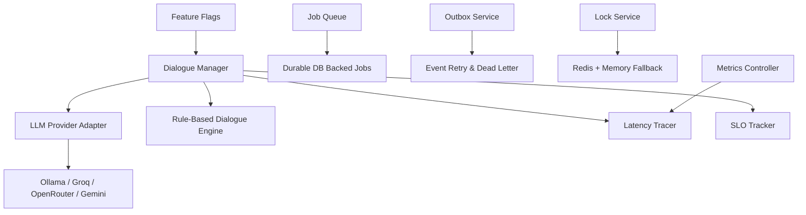
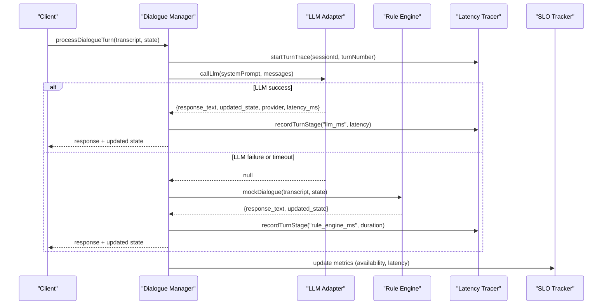
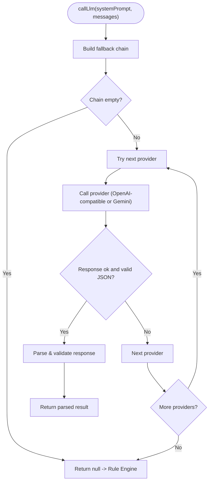
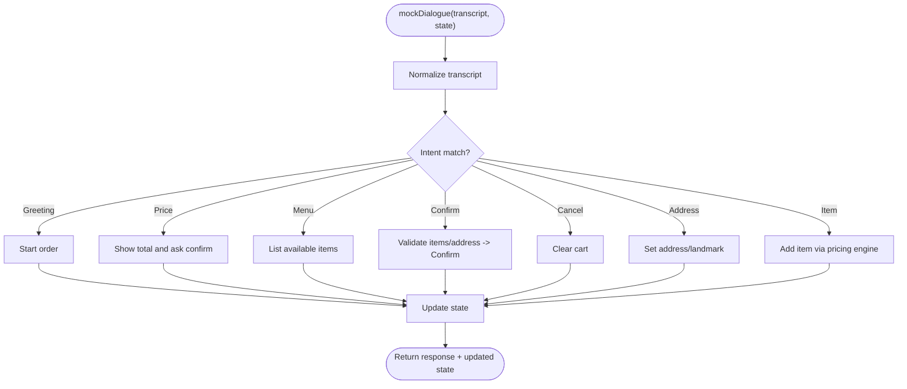
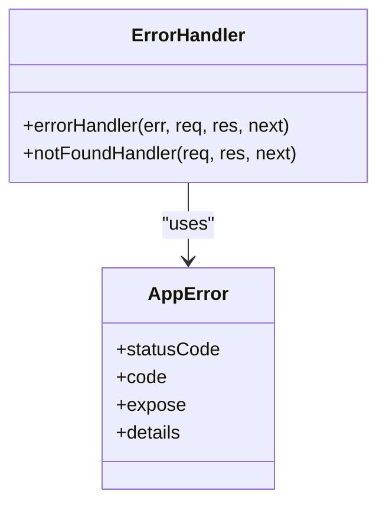
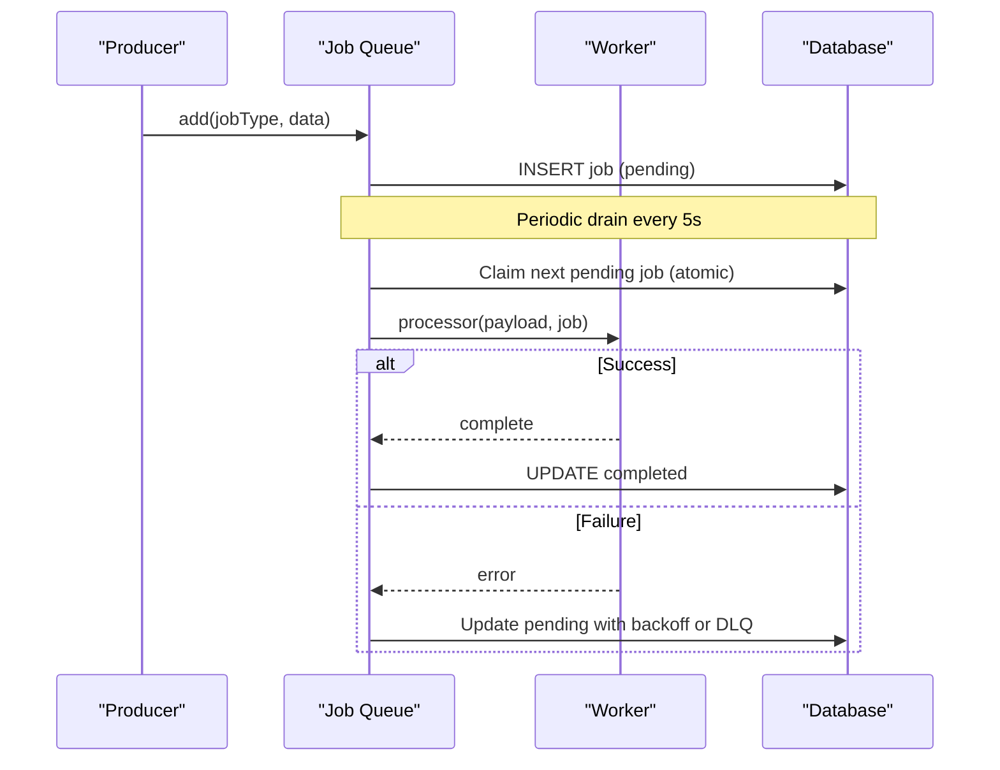
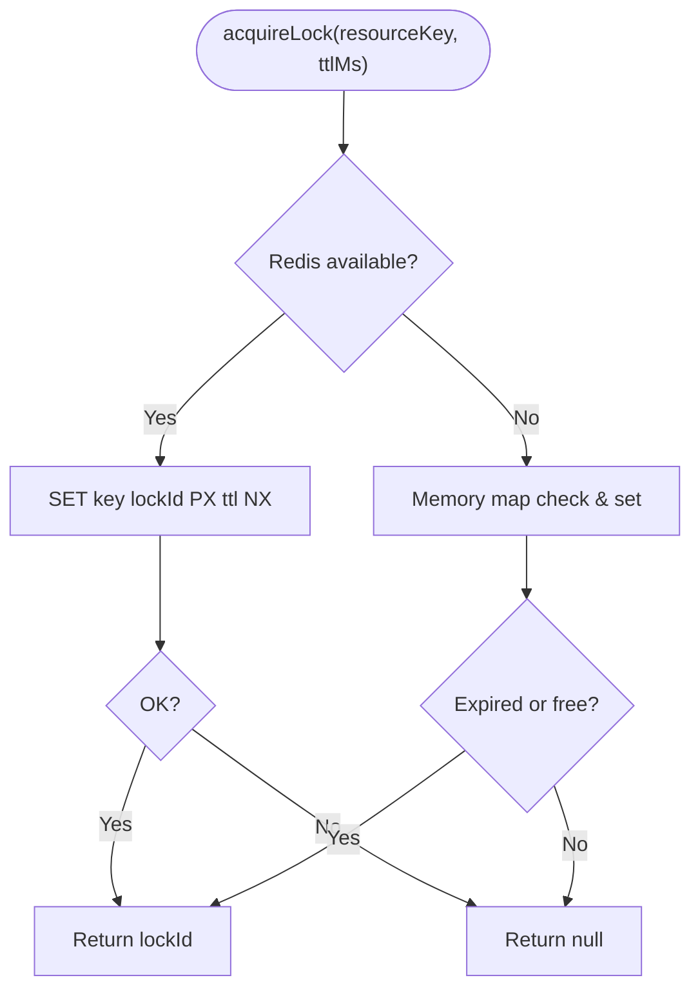
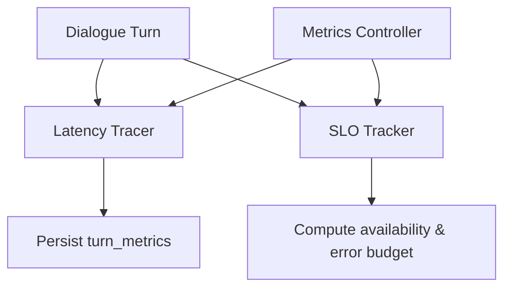
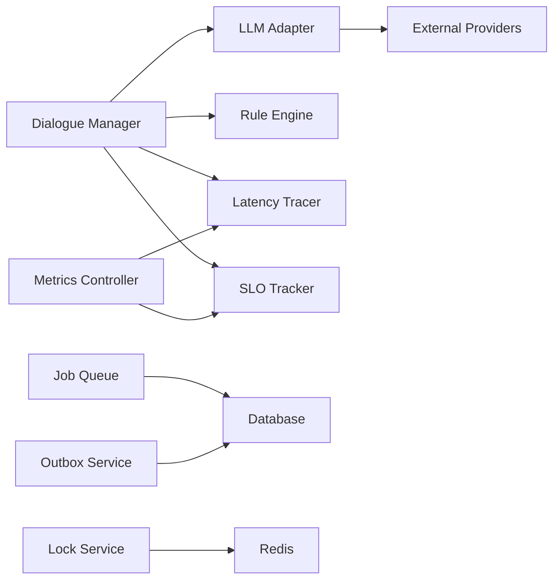

# Fallback Mechanisms & Error Recovery

<cite>
**Referenced Files in This Document**
- [dialogueManager.js](file://server/src/services/dialogueManager.js)
- [llmProviderAdapter.js](file://server/src/services/llmProviderAdapter.js)
- [errorHandler.middleware.js](file://server/src/middleware/errorHandler.middleware.js)
- [AppError.js](file://server/src/utils/AppError.js)
- [sloTracker.js](file://server/src/services/sloTracker.js)
- [latencyTracer.js](file://server/src/services/latencyTracer.js)
- [jobQueue.js](file://server/src/queue/jobQueue.js)
- [outbox.service.js](file://server/src/services/outbox.service.js)
- [lockService.js](file://server/src/infra/lockService.js)
- [metrics.controller.js](file://server/src/controllers/metrics.controller.js)
- [featureFlag.service.js](file://server/src/services/featureFlag.service.js)
- [dialogue.test.js](file://server/tests/dialogue.test.js)
</cite>

## Table of Contents
1. [Introduction](#introduction)
2. [Project Structure](#project-structure)
3. [Core Components](#core-components)
4. [Architecture Overview](#architecture-overview)
5. [Detailed Component Analysis](#detailed-component-analysis)
6. [Dependency Analysis](#dependency-analysis)
7. [Performance Considerations](#performance-considerations)
8. [Troubleshooting Guide](#troubleshooting-guide)
9. [Conclusion](#conclusion)
10. [Appendices](#appendices)

## Introduction
This document explains the dialogue orchestration engine’s fallback and error recovery systems. It covers:
- Intelligent fallback from LLM-based responses to a deterministic, rule-based dialogue engine when external services fail or time out.
- Smart humanlike dialogue logic that provides consistent, context-aware responses based on conversation state and intent patterns.
- Robust error detection and recovery including retry with exponential backoff, durable queues, atomic locking, and graceful degradation.
- Monitoring and alerting via SLO metrics, latency tracing, and observability endpoints.
- Guidelines for implementing custom fallback logic and testing error scenarios.

## Project Structure
The resilience features are implemented across several modules:
- Dialogue orchestration and fallback routing
- Multi-provider LLM adapter with auto-fallback chain
- Centralized error handling middleware
- Durable job queue and outbox pattern for reliable side effects
- Distributed locking with in-memory fallback
- Latency tracing and SLO tracking for performance monitoring
- Feature flags for runtime control of behavior

**Diagram sources**
- [dialogueManager.js:36-84](file://server/src/services/dialogueManager.js#L36-L84)
- [llmProviderAdapter.js:51-68](file://server/src/services/llmProviderAdapter.js#L51-L68)
- [latencyTracer.js:12-27](file://server/src/services/latencyTracer.js#L12-L27)
- [sloTracker.js:7-13](file://server/src/services/sloTracker.js#L7-L13)
- [jobQueue.js:14-32](file://server/src/queue/jobQueue.js#L14-L32)
- [outbox.service.js:8-30](file://server/src/services/outbox.service.js#L8-L30)
- [lockService.js:14-38](file://server/src/infra/lockService.js#L14-L38)
- [metrics.controller.js:9-17](file://server/src/controllers/metrics.controller.js#L9-L17)
- [featureFlag.service.js:9-27](file://server/src/services/featureFlag.service.js#L9-L27)

**Section sources**
- [dialogueManager.js:36-84](file://server/src/services/dialogueManager.js#L36-L84)
- [llmProviderAdapter.js:51-68](file://server/src/services/llmProviderAdapter.js#L51-L68)
- [latencyTracer.js:12-27](file://server/src/services/latencyTracer.js#L12-L27)
- [sloTracker.js:7-13](file://server/src/services/sloTracker.js#L7-L13)
- [jobQueue.js:14-32](file://server/src/queue/jobQueue.js#L14-L32)
- [outbox.service.js:8-30](file://server/src/services/outbox.service.js#L8-L30)
- [lockService.js:14-38](file://server/src/infra/lockService.js#L14-L38)
- [metrics.controller.js:9-17](file://server/src/controllers/metrics.controller.js#L9-L17)
- [featureFlag.service.js:9-27](file://server/src/services/featureFlag.service.js#L9-L27)

## Core Components
- Intelligent LLM fallback cascade: The adapter attempts multiple providers in order and returns null if all fail, signaling the caller to use the rule engine.
- Deterministic rule engine: Provides fast, predictable responses grounded in conversation state and catalog pricing.
- Centralized error handling: Normalizes errors, prevents sensitive details from leaking, and logs structured diagnostics.
- Durable execution: Job queue and outbox ensure retries with exponential backoff and dead-letter handling.
- Concurrency safety: Lock service ensures exclusive processing with Redis-backed distributed locks and memory fallback.
- Observability: Latency tracer records per-stage timings; SLO tracker computes availability and error budgets; metrics controller exposes analytics.

**Section sources**
- [llmProviderAdapter.js:226-262](file://server/src/services/llmProviderAdapter.js#L226-L262)
- [dialogueManager.js:74-84](file://server/src/services/dialogueManager.js#L74-L84)
- [errorHandler.middleware.js:9-36](file://server/src/middleware/errorHandler.middleware.js#L9-L36)
- [jobQueue.js:173-211](file://server/src/queue/jobQueue.js#L173-L211)
- [outbox.service.js:119-140](file://server/src/services/outbox.service.js#L119-L140)
- [lockService.js:14-38](file://server/src/infra/lockService.js#L14-L38)
- [latencyTracer.js:29-90](file://server/src/services/latencyTracer.js#L29-L90)
- [sloTracker.js:15-64](file://server/src/services/sloTracker.js#L15-L64)

## Architecture Overview
The dialogue flow prioritizes LLM responses but degrades gracefully to a rule-based engine. All stages are traced for latency and aggregated into SLO metrics. Side effects are persisted atomically via outbox events and processed by durable queues with retries.

**Diagram sources**
- [dialogueManager.js:36-84](file://server/src/services/dialogueManager.js#L36-L84)
- [llmProviderAdapter.js:226-262](file://server/src/services/llmProviderAdapter.js#L226-L262)
- [latencyTracer.js:29-90](file://server/src/services/latencyTracer.js#L29-L90)
- [sloTracker.js:15-64](file://server/src/services/sloTracker.js#L15-L64)

## Detailed Component Analysis

### Intelligent LLM Fallback Cascade
- Provider selection: Builds a fallback chain based on environment configuration, ensuring only configured providers are attempted.
- Auto-retry across providers: Attempts primary provider first, then others in sequence; any failure triggers the next provider.
- Timeout and validation: HTTP calls include timeouts; responses are parsed and validated to strict schema before returning.
- Graceful degradation: If all providers fail or none are configured, returns null to signal fallback to rule engine.

**Diagram sources**
- [llmProviderAdapter.js:51-68](file://server/src/services/llmProviderAdapter.js#L51-L68)
- [llmProviderAdapter.js:72-117](file://server/src/services/llmProviderAdapter.js#L72-L117)
- [llmProviderAdapter.js:169-215](file://server/src/services/llmProviderAdapter.js#L169-L215)
- [llmProviderAdapter.js:226-262](file://server/src/services/llmProviderAdapter.js#L226-L262)

**Section sources**
- [llmProviderAdapter.js:51-68](file://server/src/services/llmProviderAdapter.js#L51-L68)
- [llmProviderAdapter.js:72-117](file://server/src/services/llmProviderAdapter.js#L72-L117)
- [llmProviderAdapter.js:169-215](file://server/src/services/llmProviderAdapter.js#L169-L215)
- [llmProviderAdapter.js:226-262](file://server/src/services/llmProviderAdapter.js#L226-L262)

### Smart Humanlike Dialogue Engine (Rule-Based)
- Context-aware state transitions: Uses an order state machine to manage conversation flow (greeting, item collection, address, confirmation).
- Deterministic pricing: Reconciles proposed items with authoritative pricing and calculates totals, taxes, and delivery fees.
- Intent recognition: Detects intents like greetings, price inquiries, menu requests, confirmations, cancellations, and address setting.
- Language and tone: Responds in mixed languages appropriate to user input and maintains friendly, helpful tone.

**Diagram sources**
- [dialogueManager.js:137-301](file://server/src/services/dialogueManager.js#L137-L301)
- [dialogueManager.js:93-132](file://server/src/services/dialogueManager.js#L93-L132)

**Section sources**
- [dialogueManager.js:137-301](file://server/src/services/dialogueManager.js#L137-L301)
- [dialogueManager.js:93-132](file://server/src/services/dialogueManager.js#L93-L132)

### Centralized Error Handling and Standardization
- Structured logging: Captures correlation IDs, status codes, and request paths without exposing internals.
- Controlled exposure: Only safe errors are exposed to clients; internal errors return generic messages.
- Consistent error model: AppError standardizes status codes, codes, and optional details.

**Diagram sources**
- [AppError.js:7-16](file://server/src/utils/AppError.js#L7-L16)
- [errorHandler.middleware.js:9-36](file://server/src/middleware/errorHandler.middleware.js#L9-L36)

**Section sources**
- [AppError.js:7-16](file://server/src/utils/AppError.js#L7-L16)
- [errorHandler.middleware.js:9-36](file://server/src/middleware/errorHandler.middleware.js#L9-L36)

### Durable Execution: Job Queue and Outbox Pattern
- Durable job queue: Persists jobs to database, claims them atomically, handles crashes by recovering stale jobs, and routes unknown types to DLQ.
- Exponential backoff: Retries with increasing delays; moves to DLQ after max retries.
- Outbox events: Atomic event enqueueing, claiming, and marking completion/failure with backoff scheduling.

**Diagram sources**
- [jobQueue.js:48-76](file://server/src/queue/jobQueue.js#L48-L76)
- [jobQueue.js:107-211](file://server/src/queue/jobQueue.js#L107-L211)
- [outbox.service.js:8-30](file://server/src/services/outbox.service.js#L8-L30)
- [outbox.service.js:119-140](file://server/src/services/outbox.service.js#L119-L140)

**Section sources**
- [jobQueue.js:48-76](file://server/src/queue/jobQueue.js#L48-L76)
- [jobQueue.js:107-211](file://server/src/queue/jobQueue.js#L107-L211)
- [outbox.service.js:8-30](file://server/src/services/outbox.service.js#L8-L30)
- [outbox.service.js:119-140](file://server/src/services/outbox.service.js#L119-L140)

### Concurrency Safety: Distributed Locking with Fallback
- Redis-backed locks: Acquire exclusive access using atomic SET NX PX with TTL.
- In-memory fallback: When Redis is unavailable, uses local mutex with expiration to prevent concurrent processing within a single process.
- Safe release: Releases lock only if current lockId matches, preventing accidental unlocks.

**Diagram sources**
- [lockService.js:14-38](file://server/src/infra/lockService.js#L14-L38)
- [lockService.js:40-68](file://server/src/infra/lockService.js#L40-L68)

**Section sources**
- [lockService.js:14-38](file://server/src/infra/lockService.js#L14-L38)
- [lockService.js:40-68](file://server/src/infra/lockService.js#L40-L68)

### Observability: Latency Tracing and SLO Metrics
- Latency tracer: Records per-turn stage durations (VAD, STT, LLM, TTS), persists metrics, and computes percentiles.
- SLO tracker: Computes availability, latency targets, and error budget remaining over a rolling window.
- Metrics controller: Exposes latency analytics and audit logs for debugging and monitoring.

**Diagram sources**
- [latencyTracer.js:12-90](file://server/src/services/latencyTracer.js#L12-L90)
- [latencyTracer.js:95-132](file://server/src/services/latencyTracer.js#L95-L132)
- [sloTracker.js:15-64](file://server/src/services/sloTracker.js#L15-L64)
- [metrics.controller.js:9-17](file://server/src/controllers/metrics.controller.js#L9-L17)

**Section sources**
- [latencyTracer.js:12-90](file://server/src/services/latencyTracer.js#L12-L90)
- [latencyTracer.js:95-132](file://server/src/services/latencyTracer.js#L95-L132)
- [sloTracker.js:15-64](file://server/src/services/sloTracker.js#L15-L64)
- [metrics.controller.js:9-17](file://server/src/controllers/metrics.controller.js#L9-L17)

### Runtime Control: Feature Flags
- Dynamic toggles: Enable/disable features per tenant or globally.
- Safe rollouts: Use flags to gradually enable new fallback behaviors or degrade features under load.

**Section sources**
- [featureFlag.service.js:9-27](file://server/src/services/featureFlag.service.js#L9-L27)
- [featureFlag.service.js:30-44](file://server/src/services/featureFlag.service.js#L30-L44)

## Dependency Analysis
- Dialogue Manager depends on LLM Adapter for AI responses and falls back to Rule Engine when needed.
- LLM Adapter depends on environment configuration and external APIs; includes timeouts and parsing/validation.
- Latency Tracer and SLO Tracker depend on database persistence for metrics aggregation.
- Job Queue and Outbox depend on database transactions and atomic updates for durability.
- Lock Service depends on Redis with in-memory fallback for concurrency control.
- Metrics Controller exposes observability endpoints backed by Latency Tracer and Audit Service.

**Diagram sources**
- [dialogueManager.js:36-84](file://server/src/services/dialogueManager.js#L36-L84)
- [llmProviderAdapter.js:226-262](file://server/src/services/llmProviderAdapter.js#L226-L262)
- [latencyTracer.js:12-90](file://server/src/services/latencyTracer.js#L12-L90)
- [sloTracker.js:15-64](file://server/src/services/sloTracker.js#L15-L64)
- [jobQueue.js:107-211](file://server/src/queue/jobQueue.js#L107-L211)
- [outbox.service.js:8-30](file://server/src/services/outbox.service.js#L8-L30)
- [lockService.js:14-38](file://server/src/infra/lockService.js#L14-L38)
- [metrics.controller.js:9-17](file://server/src/controllers/metrics.controller.js#L9-L17)

**Section sources**
- [dialogueManager.js:36-84](file://server/src/services/dialogueManager.js#L36-L84)
- [llmProviderAdapter.js:226-262](file://server/src/services/llmProviderAdapter.js#L226-L262)
- [latencyTracer.js:12-90](file://server/src/services/latencyTracer.js#L12-L90)
- [sloTracker.js:15-64](file://server/src/services/sloTracker.js#L15-L64)
- [jobQueue.js:107-211](file://server/src/queue/jobQueue.js#L107-L211)
- [outbox.service.js:8-30](file://server/src/services/outbox.service.js#L8-L30)
- [lockService.js:14-38](file://server/src/infra/lockService.js#L14-L38)
- [metrics.controller.js:9-17](file://server/src/controllers/metrics.controller.js#L9-L17)

## Performance Considerations
- LLM timeouts: Ensure external provider calls respect timeouts to avoid blocking conversations.
- Rule engine speed: Deterministic responses provide low-latency fallback during outages.
- Database-backed queues: Avoid message loss and support scaling with atomic claims and crash recovery.
- Lock contention: Prefer Redis locks for distributed environments; memory fallback reduces risk in single-process scenarios.
- Metric overhead: Persist turn metrics asynchronously to minimize impact on hot paths.

[No sources needed since this section provides general guidance]

## Troubleshooting Guide
- Diagnose LLM failures:
  - Check provider configuration and API keys; review fallback chain and logs for specific provider errors.
  - Validate response parsing and schema compliance; inspect raw content if parsing fails.
- Identify slow turns:
  - Use latency analytics to find bottlenecks (STT, LLM, TTS); compare P50/P95/P99 trends.
- Monitor SLO breaches:
  - Review availability and error budget; investigate spikes in slow calls or error rates.
- Debug job failures:
  - Inspect DLQ entries and retry counts; adjust backoff and max retries as needed.
- Handle concurrency issues:
  - Verify lock acquisition and release; ensure Redis connectivity or rely on memory fallback.
- Centralized errors:
  - Use correlation IDs to trace requests through middleware and services; avoid exposing internal stack traces.

**Section sources**
- [llmProviderAdapter.js:226-262](file://server/src/services/llmProviderAdapter.js#L226-L262)
- [latencyTracer.js:95-132](file://server/src/services/latencyTracer.js#L95-L132)
- [sloTracker.js:15-64](file://server/src/services/sloTracker.js#L15-L64)
- [jobQueue.js:173-211](file://server/src/queue/jobQueue.js#L173-L211)
- [lockService.js:14-38](file://server/src/infra/lockService.js#L14-L38)
- [errorHandler.middleware.js:9-36](file://server/src/middleware/errorHandler.middleware.js#L9-L36)

## Conclusion
The dialogue orchestration engine implements a robust, multi-layered approach to resilience:
- Intelligent LLM fallback ensures continuity even when external services fail.
- Deterministic rule-based responses maintain user experience during outages.
- Durable queues and outbox patterns guarantee reliable side effects with retries and dead-letter handling.
- Distributed locking prevents race conditions with graceful fallbacks.
- Comprehensive observability enables proactive monitoring and rapid diagnosis.

[No sources needed since this section summarizes without analyzing specific files]

## Appendices

### Implementing Custom Fallback Logic
- Extend the LLM adapter:
  - Add new providers to the configuration and fallback chain.
  - Implement provider-specific call functions and normalize outputs to the expected schema.
- Enhance the rule engine:
  - Add new intent patterns and state transitions.
  - Integrate with domain services (pricing, catalog) to keep responses authoritative.
- Configure feature flags:
  - Toggle new fallback behaviors per tenant or globally for safe rollouts.

**Section sources**
- [llmProviderAdapter.js:17-49](file://server/src/services/llmProviderAdapter.js#L17-L49)
- [llmProviderAdapter.js:226-262](file://server/src/services/llmProviderAdapter.js#L226-L262)
- [dialogueManager.js:137-301](file://server/src/services/dialogueManager.js#L137-L301)
- [featureFlag.service.js:9-27](file://server/src/services/featureFlag.service.js#L9-L27)

### Testing Error Scenarios
- Simulate LLM failures:
  - Disable providers or introduce network errors to verify fallback to rule engine.
- Validate retries and backoff:
  - Inject transient failures in job processors; confirm exponential backoff and DLQ routing.
- Stress test concurrency:
  - Run multiple workers to ensure locks prevent duplicate processing.
- Measure observability:
  - Assert latency metrics and SLO calculations reflect expected outcomes.

**Section sources**
- [dialogue.test.js:10-15](file://server/tests/dialogue.test.js#L10-L15)
- [dialogue.test.js:21-86](file://server/tests/dialogue.test.js#L21-L86)
- [jobQueue.js:173-211](file://server/src/queue/jobQueue.js#L173-L211)
- [lockService.js:14-38](file://server/src/infra/lockService.js#L14-L38)
- [latencyTracer.js:95-132](file://server/src/services/latencyTracer.js#L95-L132)
- [sloTracker.js:15-64](file://server/src/services/sloTracker.js#L15-L64)