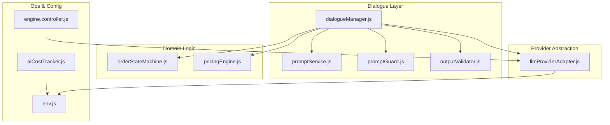
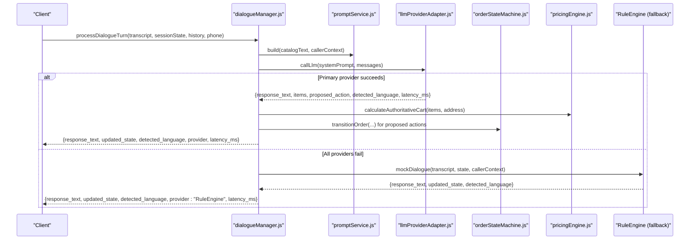
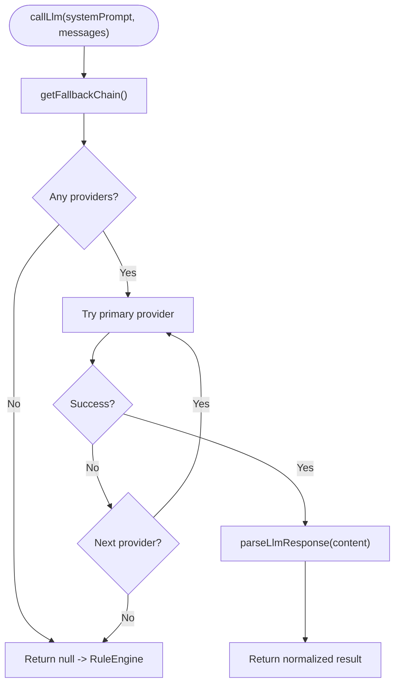
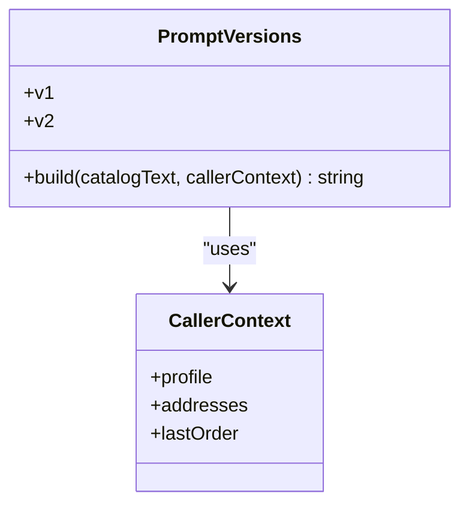
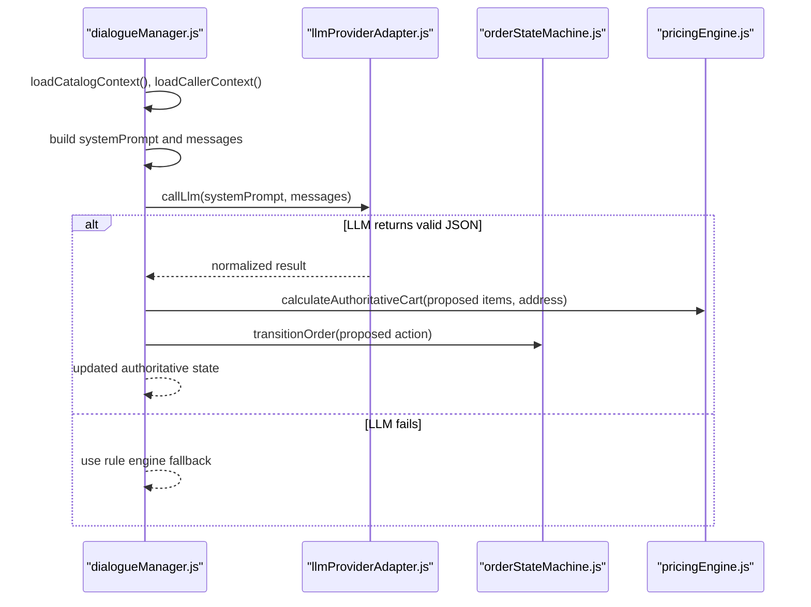
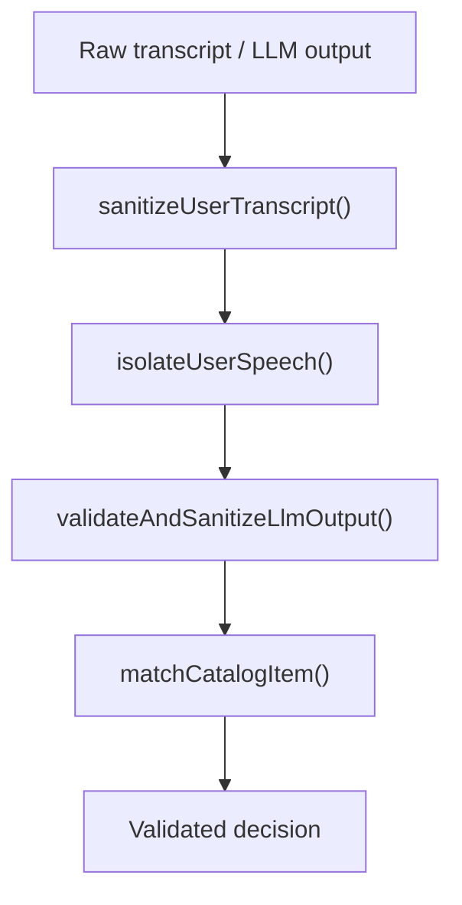
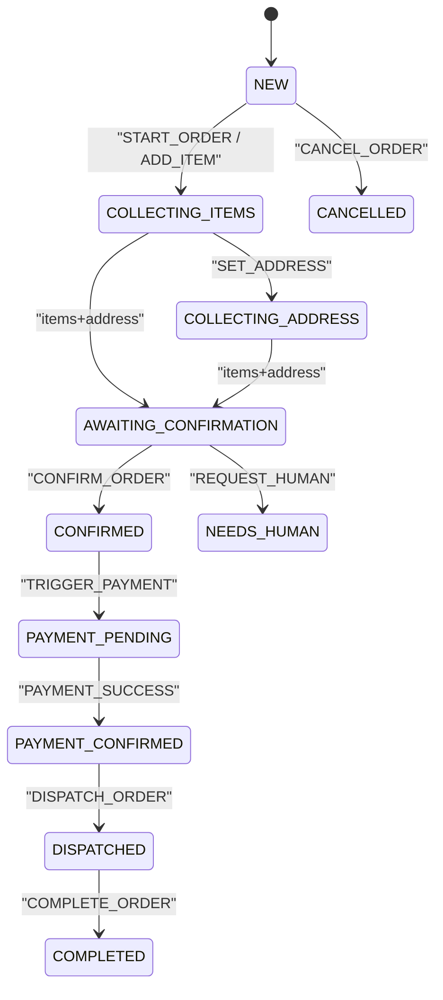
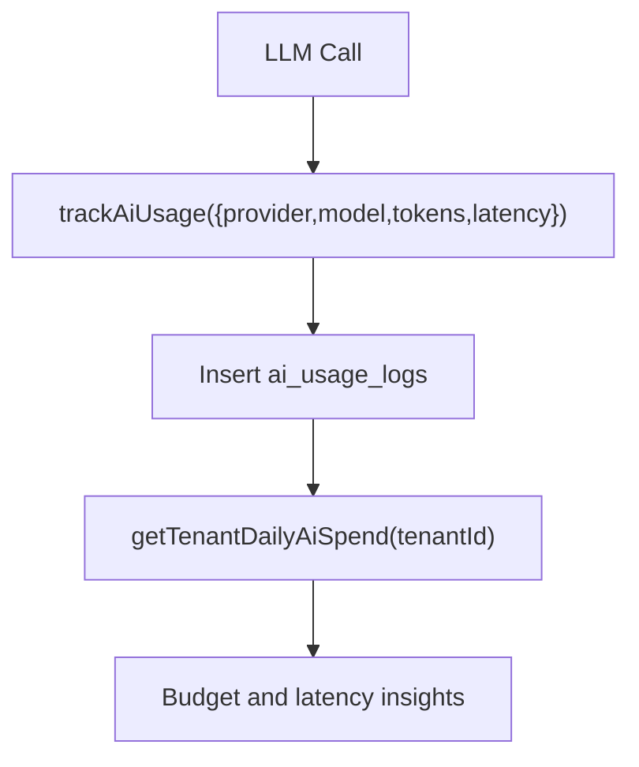
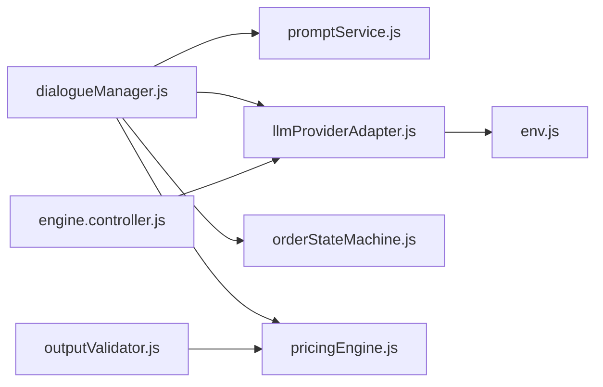

# LLM Provider Adapters

<cite>
**Referenced Files in This Document**
- [llmProviderAdapter.js](file://server/src/services/llmProviderAdapter.js)
- [promptService.js](file://server/src/services/promptService.js)
- [dialogueManager.js](file://server/src/services/dialogueManager.js)
- [aiCostTracker.js](file://server/src/services/aiCostTracker.js)
- [outputValidator.js](file://server/src/services/dialogue/outputValidator.js)
- [promptGuard.js](file://server/src/services/dialogue/promptGuard.js)
- [orderStateMachine.js](file://server/src/domain/orders/orderStateMachine.js)
- [pricingEngine.js](file://server/src/domain/orders/pricingEngine.js)
- [env.js](file://server/src/config/env.js)
- [engine.controller.js](file://server/src/controllers/engine.controller.js)
</cite>

## Table of Contents
1. [Introduction](#introduction)
2. [Project Structure](#project-structure)
3. [Core Components](#core-components)
4. [Architecture Overview](#architecture-overview)
5. [Detailed Component Analysis](#detailed-component-analysis)
6. [Dependency Analysis](#dependency-analysis)
7. [Performance Considerations](#performance-considerations)
8. [Troubleshooting Guide](#troubleshooting-guide)
9. [Conclusion](#conclusion)
10. [Appendices](#appendices)

## Introduction
This document explains the LLM provider adapters that enable flexible integration with multiple large language model services for voice commerce scenarios. It covers:
- The adapter pattern used to abstract differences between providers
- Prompt engineering strategies for consistent, structured responses
- Intelligent response generation and state reconciliation for ordering flows
- Provider selection logic and fallback mechanisms
- Cost tracking and optimization techniques
- How prompts are built dynamically using customer data, catalog context, and conversation history
- Guidance for adding new providers, customizing prompts, and monitoring performance and reliability

## Project Structure
The LLM pipeline is implemented across several focused modules:
- Provider abstraction and routing: llmProviderAdapter.js
- Prompt versioning and building: promptService.js
- Dialogue orchestration and fallback: dialogueManager.js
- Output validation and safety: outputValidator.js, promptGuard.js
- Authoritative pricing and state machine: pricingEngine.js, orderStateMachine.js
- Environment configuration and status endpoints: env.js, engine.controller.js
- Usage and cost tracking: aiCostTracker.js

**Diagram sources**
- [dialogueManager.js:36-84](file://server/src/services/dialogueManager.js#L36-L84)
- [llmProviderAdapter.js:17-68](file://server/src/services/llmProviderAdapter.js#L17-L68)
- [promptService.js:8-115](file://server/src/services/promptService.js#L8-L115)
- [orderStateMachine.js:8-41](file://server/src/domain/orders/orderStateMachine.js#L8-L41)
- [pricingEngine.js:16-45](file://server/src/domain/orders/pricingEngine.js#L16-L45)
- [env.js:3-24](file://server/src/config/env.js#L3-L24)
- [engine.controller.js:6-24](file://server/src/controllers/engine.controller.js#L6-L24)
- [aiCostTracker.js:16-57](file://server/src/services/aiCostTracker.js#L16-L57)

**Section sources**
- [dialogueManager.js:36-84](file://server/src/services/dialogueManager.js#L36-L84)
- [llmProviderAdapter.js:17-68](file://server/src/services/llmProviderAdapter.js#L17-L68)
- [promptService.js:8-115](file://server/src/services/promptService.js#L8-L115)
- [orderStateMachine.js:8-41](file://server/src/domain/orders/orderStateMachine.js#L8-L41)
- [pricingEngine.js:16-45](file://server/src/domain/orders/pricingEngine.js#L16-L45)
- [env.js:3-24](file://server/src/config/env.js#L3-L24)
- [engine.controller.js:6-24](file://server/src/controllers/engine.controller.js#L6-L24)
- [aiCostTracker.js:16-57](file://server/src/services/aiCostTracker.js#L16-L57)

## Core Components
- LLM Provider Adapter: Implements a unified interface to call multiple providers (Ollama, Groq, Gemini, OpenRouter), normalizes responses, and enforces a strict JSON schema. It also builds a fallback chain based on environment configuration and availability.
- Prompt Service: Provides versioned system prompts that embed menu catalog and caller context, ensuring consistent extraction behavior and safe instructions.
- Dialogue Manager: Orchestrates each turn by loading catalog and caller context, building messages, calling the LLM adapter, reconciling outputs with the authoritative state machine and pricing engine, and falling back to a deterministic rule engine when needed.
- Output Validator and Prompt Guard: Validate LLM decisions against business rules and protect against prompt injection or token exhaustion attacks.
- Order State Machine and Pricing Engine: Provide deterministic transitions and authoritative pricing calculations to ensure correctness regardless of LLM suggestions.
- AI Cost Tracker: Records usage metrics and estimated costs per model/provider for observability and budgeting.
- Environment and Status: Centralized environment validation and an endpoint to inspect configured providers and their readiness.

**Section sources**
- [llmProviderAdapter.js:17-68](file://server/src/services/llmProviderAdapter.js#L17-L68)
- [promptService.js:8-115](file://server/src/services/promptService.js#L8-L115)
- [dialogueManager.js:36-84](file://server/src/services/dialogueManager.js#L36-L84)
- [outputValidator.js:4-81](file://server/src/services/dialogue/outputValidator.js#L4-L81)
- [promptGuard.js:8-44](file://server/src/services/dialogue/promptGuard.js#L8-L44)
- [orderStateMachine.js:8-41](file://server/src/domain/orders/orderStateMachine.js#L8-L41)
- [pricingEngine.js:76-117](file://server/src/domain/orders/pricingEngine.js#L76-L117)
- [aiCostTracker.js:16-57](file://server/src/services/aiCostTracker.js#L16-L57)
- [env.js:3-24](file://server/src/config/env.js#L3-L24)
- [engine.controller.js:6-24](file://server/src/controllers/engine.controller.js#L6-L24)

## Architecture Overview
The system uses an adapter pattern to decouple business logic from specific LLM providers. Each provider is configured once and accessed through a single entry point. Responses are normalized and validated before being applied to the authoritative state and pricing. A robust fallback mechanism ensures continuity even if primary providers fail.

**Diagram sources**
- [dialogueManager.js:36-84](file://server/src/services/dialogueManager.js#L36-L84)
- [llmProviderAdapter.js:226-262](file://server/src/services/llmProviderAdapter.js#L226-L262)
- [pricingEngine.js:76-117](file://server/src/domain/orders/pricingEngine.js#L76-L117)
- [orderStateMachine.js:154-325](file://server/src/domain/orders/orderStateMachine.js#L154-L325)

## Detailed Component Analysis

### LLM Provider Adapter
- Supports multiple providers via a unified interface: Ollama (local), Groq, Gemini, OpenRouter.
- Builds a fallback chain based on environment variables; skips unavailable providers.
- Normalizes all provider responses into a common structure and parses strict JSON output.
- Enforces allowed actions and sanitizes extracted items to prevent price fabrication.
- Exposes provider status for monitoring.

**Diagram sources**
- [llmProviderAdapter.js:53-68](file://server/src/services/llmProviderAdapter.js#L53-L68)
- [llmProviderAdapter.js:226-262](file://server/src/services/llmProviderAdapter.js#L226-L262)
- [llmProviderAdapter.js:169-215](file://server/src/services/llmProviderAdapter.js#L169-L215)

**Section sources**
- [llmProviderAdapter.js:17-68](file://server/src/services/llmProviderAdapter.js#L17-L68)
- [llmProviderAdapter.js:72-117](file://server/src/services/llmProviderAdapter.js#L72-L117)
- [llmProviderAdapter.js:123-159](file://server/src/services/llmProviderAdapter.js#L123-L159)
- [llmProviderAdapter.js:169-215](file://server/src/services/llmProviderAdapter.js#L169-L215)
- [llmProviderAdapter.js:226-283](file://server/src/services/llmProviderAdapter.js#L226-L283)

### Prompt Engineering and Versioning
- Versioned prompts allow A/B testing and controlled rollouts.
- Prompts include:
  - Caller profile and preferences
  - Saved addresses and last order context
  - Active menu catalog with categories and dietary tags
  - Strict JSON output schema and behavioral constraints
- The active prompt builder can be selected via environment variable.

**Diagram sources**
- [promptService.js:8-115](file://server/src/services/promptService.js#L8-L115)

**Section sources**
- [promptService.js:8-115](file://server/src/services/promptService.js#L8-L115)

### Dialogue Orchestration and Reconciliation
- Loads catalog and caller context asynchronously.
- Builds messages including recent conversation history and current order state.
- Calls LLM adapter; if successful, reconciles extracted items and actions with the authoritative state machine and pricing engine.
- Falls back to a deterministic rule engine if LLM calls fail or return invalid data.

**Diagram sources**
- [dialogueManager.js:36-84](file://server/src/services/dialogueManager.js#L36-L84)
- [dialogueManager.js:93-132](file://server/src/services/dialogueManager.js#L93-L132)
- [pricingEngine.js:76-117](file://server/src/domain/orders/pricingEngine.js#L76-L117)
- [orderStateMachine.js:154-325](file://server/src/domain/orders/orderStateMachine.js#L154-L325)

**Section sources**
- [dialogueManager.js:36-84](file://server/src/services/dialogueManager.js#L36-L84)
- [dialogueManager.js:93-132](file://server/src/services/dialogueManager.js#L93-L132)
- [dialogueManager.js:137-302](file://server/src/services/dialogueManager.js#L137-L302)

### Output Validation and Safety
- Validates LLM decision structures against a strict schema and cross-references items with the active catalog.
- Sanitizes user transcripts to neutralize prompt injection attempts and caps length to mitigate token exhaustion.
- Wraps untrusted user speech in isolated boundaries to reduce risk of instruction leakage.

**Diagram sources**
- [promptGuard.js:8-44](file://server/src/services/dialogue/promptGuard.js#L8-L44)
- [outputValidator.js:4-81](file://server/src/services/dialogue/outputValidator.js#L4-L81)
- [pricingEngine.js:50-71](file://server/src/domain/orders/pricingEngine.js#L50-L71)

**Section sources**
- [promptGuard.js:8-44](file://server/src/services/dialogue/promptGuard.js#L8-L44)
- [outputValidator.js:4-81](file://server/src/services/dialogue/outputValidator.js#L4-L81)

### Authoritative State Machine and Pricing
- Defines explicit states and allowed transitions to prevent out-of-order operations.
- Ensures totals, taxes, and delivery fees are calculated deterministically from catalog prices.
- Integrates with dialogue manager to enforce business rules over LLM suggestions.

**Diagram sources**
- [orderStateMachine.js:8-41](file://server/src/domain/orders/orderStateMachine.js#L8-L41)
- [orderStateMachine.js:154-325](file://server/src/domain/orders/orderStateMachine.js#L154-L325)

**Section sources**
- [orderStateMachine.js:8-41](file://server/src/domain/orders/orderStateMachine.js#L8-L41)
- [orderStateMachine.js:154-325](file://server/src/domain/orders/orderStateMachine.js#L154-L325)
- [pricingEngine.js:76-117](file://server/src/domain/orders/pricingEngine.js#L76-L117)

### Cost Tracking and Optimization
- Tracks token usage and estimated cost per request, keyed by tenant and restaurant.
- Aggregates daily spend and latency for monitoring and budgeting.
- Uses model-specific rates to estimate costs accurately.

**Diagram sources**
- [aiCostTracker.js:16-57](file://server/src/services/aiCostTracker.js#L16-L57)
- [aiCostTracker.js:62-87](file://server/src/services/aiCostTracker.js#L62-L87)

**Section sources**
- [aiCostTracker.js:16-57](file://server/src/services/aiCostTracker.js#L16-L57)
- [aiCostTracker.js:62-87](file://server/src/services/aiCostTracker.js#L62-L87)

## Dependency Analysis
Key dependencies and relationships:
- dialogueManager depends on promptService, llmProviderAdapter, orderStateMachine, and pricingEngine.
- llmProviderAdapter depends on environment variables for provider configuration and keys.
- outputValidator depends on pricingEngine for catalog item matching.
- engine.controller exposes provider status derived from llmProviderAdapter.

**Diagram sources**
- [dialogueManager.js:1-6](file://server/src/services/dialogueManager.js#L1-L6)
- [llmProviderAdapter.js:13-49](file://server/src/services/llmProviderAdapter.js#L13-L49)
- [outputValidator.js:1-3](file://server/src/services/dialogue/outputValidator.js#L1-L3)
- [engine.controller.js:1-24](file://server/src/controllers/engine.controller.js#L1-L24)

**Section sources**
- [dialogueManager.js:1-6](file://server/src/services/dialogueManager.js#L1-L6)
- [llmProviderAdapter.js:13-49](file://server/src/services/llmProviderAdapter.js#L13-L49)
- [outputValidator.js:1-3](file://server/src/services/dialogue/outputValidator.js#L1-L3)
- [engine.controller.js:1-24](file://server/src/controllers/engine.controller.js#L1-L24)

## Performance Considerations
- Provider fallback chain minimizes downtime and optimizes latency by trying the fastest available provider first.
- Gemini multi-model iteration tries multiple models until one responds successfully.
- Catalog caching reduces repeated database reads during prompt building.
- Strict JSON parsing and schema validation avoid expensive retries due to malformed outputs.
- Timeouts on HTTP requests prevent hanging calls to slow or unresponsive providers.

[No sources needed since this section provides general guidance]

## Troubleshooting Guide
Common issues and resolutions:
- Missing API keys: Ensure required environment variables are set for chosen providers.
- Empty or invalid LLM output: The adapter validates JSON and enforces allowed actions; check logs for parse errors.
- Provider failures: The system automatically falls back to subsequent providers; verify the fallback chain via status endpoint.
- Prompt injection attempts: User transcripts are sanitized and isolated; monitor guard logs for redactions.
- Incorrect pricing: Authoritative pricing is always recalculated from catalog; do not trust LLM-invented prices.

**Section sources**
- [llmProviderAdapter.js:72-117](file://server/src/services/llmProviderAdapter.js#L72-L117)
- [llmProviderAdapter.js:169-215](file://server/src/services/llmProviderAdapter.js#L169-L215)
- [promptGuard.js:8-44](file://server/src/services/dialogue/promptGuard.js#L8-L44)
- [pricingEngine.js:76-117](file://server/src/domain/orders/pricingEngine.js#L76-L117)

## Conclusion
The LLM provider adapters implement a robust, extensible architecture that abstracts provider differences, ensures consistent structured outputs, and integrates tightly with authoritative business logic. Through versioned prompts, strict validation, and deterministic state and pricing, the system delivers reliable voice commerce experiences while maintaining flexibility to add new providers and optimize costs.

[No sources needed since this section summarizes without analyzing specific files]

## Appendices

### Adding a New LLM Provider
Steps to integrate a new provider:
- Add provider configuration in the provider registry with base URL, model(s), environment key, and format.
- If the provider uses a non-OpenAI-compatible API, implement a dedicated call function similar to existing ones.
- Ensure the adapter’s fallback chain includes the new provider and that environment checks are correct.
- Update cost tracker rates if applicable.
- Verify via the status endpoint and test end-to-end in dialogue flow.

**Section sources**
- [llmProviderAdapter.js:17-49](file://server/src/services/llmProviderAdapter.js#L17-L49)
- [llmProviderAdapter.js:72-117](file://server/src/services/llmProviderAdapter.js#L72-L117)
- [aiCostTracker.js:5-11](file://server/src/services/aiCostTracker.js#L5-L11)
- [engine.controller.js:6-24](file://server/src/controllers/engine.controller.js#L6-L24)

### Customizing Prompts for Specific Use Cases
- Select or create a new prompt version in the prompt service with tailored instructions, temperature, and token limits.
- Include additional contextual blocks (e.g., dietary safeguards, upselling rules) in the build function.
- Switch active prompt version via environment variable to control rollout.

**Section sources**
- [promptService.js:8-115](file://server/src/services/promptService.js#L8-L115)

### Monitoring Provider Performance and Reliability
- Use the status endpoint to inspect configured providers and fallback chain.
- Track latency and provider usage via AI cost tracker logs and aggregated daily reports.
- Monitor guard logs for prompt injection attempts and output validator warnings.

**Section sources**
- [engine.controller.js:6-24](file://server/src/controllers/engine.controller.js#L6-L24)
- [aiCostTracker.js:62-87](file://server/src/services/aiCostTracker.js#L62-L87)
- [promptGuard.js:8-44](file://server/src/services/dialogue/promptGuard.js#L8-L44)