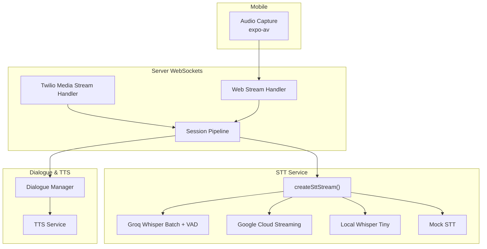
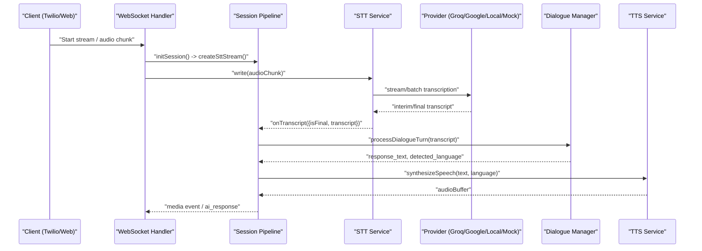
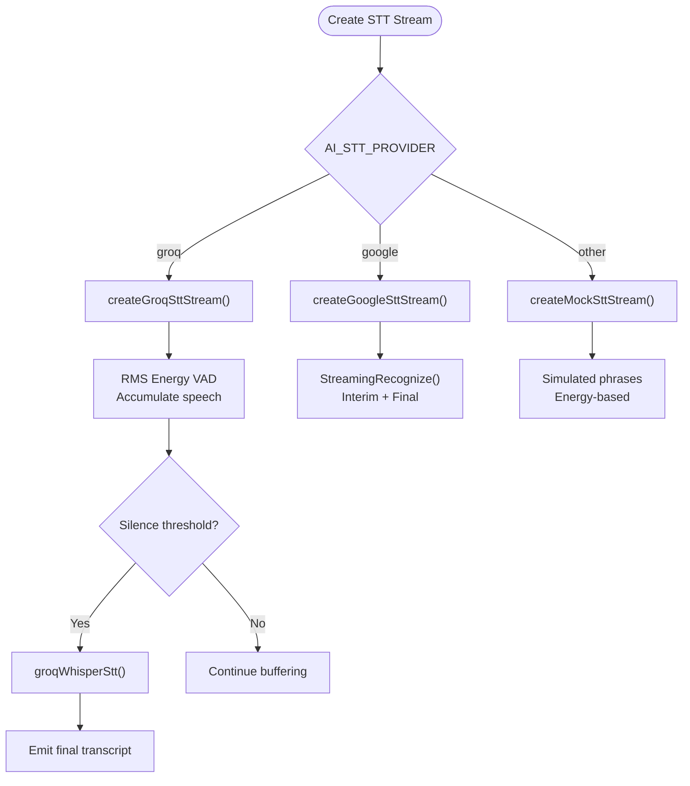
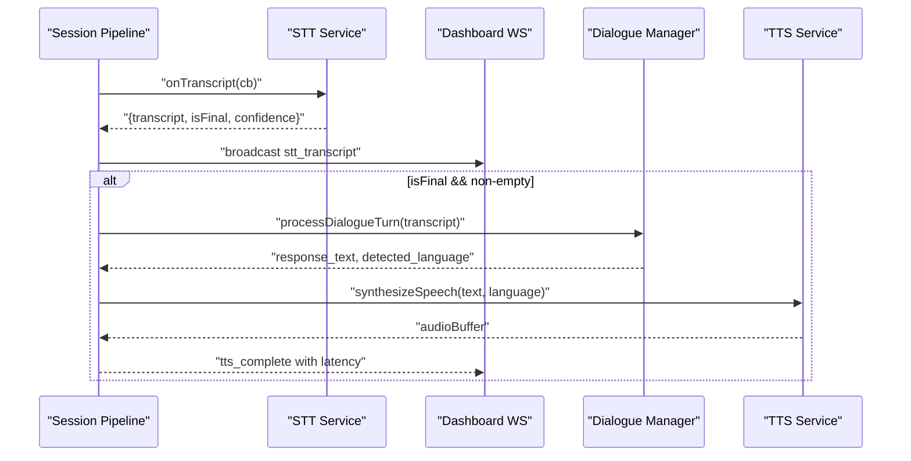
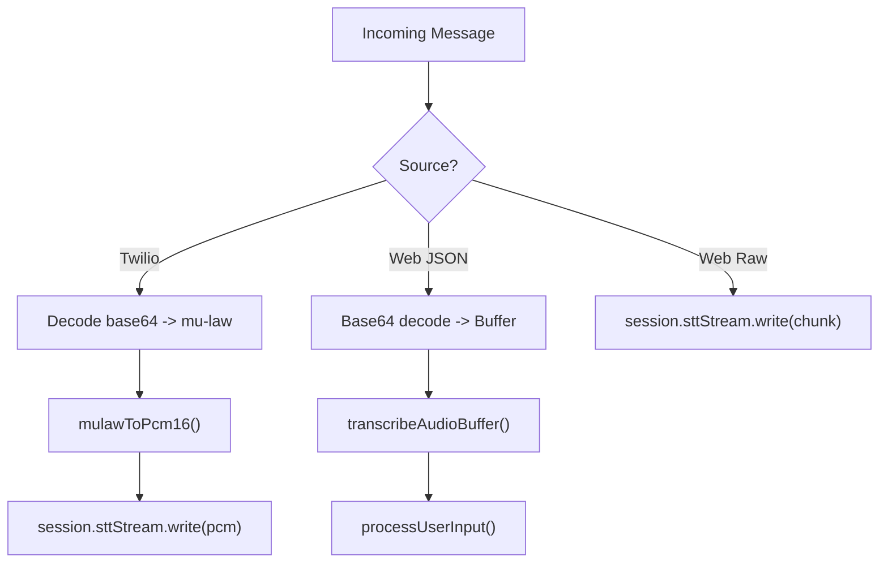
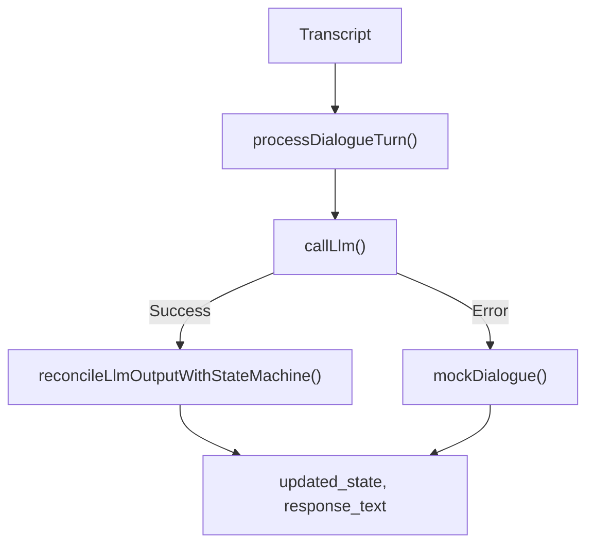
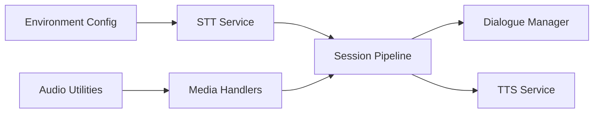

# Speech-to-Text Integration

<cite>
**Referenced Files in This Document**
- [sttService.js](file://server/src/services/sttService.js)
- [mediaStreamHandler.js](file://server/src/websocket/mediaStreamHandler.js)
- [webStreamHandler.js](file://server/src/websocket/webStreamHandler.js)
- [sessionPipeline.js](file://server/src/websocket/sessionPipeline.js)
- [audioUtils.js](file://server/src/utils/audioUtils.js)
- [env.js](file://server/src/config/env.js)
- [engine.controller.js](file://server/src/controllers/engine.controller.js)
- [dialogueManager.js](file://server/src/services/dialogueManager.js)
- [audioManager.js](file://mobile/src/services/audioManager.js)
</cite>

## Table of Contents
1. [Introduction](#introduction)
2. [Project Structure](#project-structure)
3. [Core Components](#core-components)
4. [Architecture Overview](#architecture-overview)
5. [Detailed Component Analysis](#detailed-component-analysis)
6. [Dependency Analysis](#dependency-analysis)
7. [Performance Considerations](#performance-considerations)
8. [Troubleshooting Guide](#troubleshooting-guide)
9. [Conclusion](#conclusion)
10. [Appendices](#appendices)

## Introduction
This document explains how the dialogue orchestration engine integrates speech-to-text (STT) to process real-time audio streams and generate accurate transcripts for voice conversations. It covers streaming architecture, bilingual support (English/Tamil), latency optimization strategies, provider integration (Groq Whisper, Google Cloud STT, local Whisper, mock fallback), error handling, configuration options, and performance monitoring.

## Project Structure
The STT pipeline spans server-side WebSocket handlers, a session orchestrator, an STT service with multiple providers, audio utilities for codec conversion, and mobile capture logic. The key files are:
- Server STT service and providers
- WebSocket media handlers for Twilio PSTN and web clients
- Session pipeline that wires STT to dialogue processing and TTS responses
- Audio utilities for mu-law/PCM conversions and resampling
- Environment configuration for provider selection and keys
- Mobile audio capture and playback

**Diagram sources**
- [mediaStreamHandler.js:7-68](file://server/src/websocket/mediaStreamHandler.js#L7-L68)
- [webStreamHandler.js:7-80](file://server/src/websocket/webStreamHandler.js#L7-L80)
- [sessionPipeline.js:24-111](file://server/src/websocket/sessionPipeline.js#L24-L111)
- [sttService.js:329-352](file://server/src/services/sttService.js#L329-L352)
- [sttService.js:358-454](file://server/src/services/sttService.js#L358-L454)
- [sttService.js:459-515](file://server/src/services/sttService.js#L459-L515)
- [sttService.js:18-43](file://server/src/services/sttService.js#L18-L43)
- [sttService.js:521-602](file://server/src/services/sttService.js#L521-L602)

**Section sources**
- [mediaStreamHandler.js:7-68](file://server/src/websocket/mediaStreamHandler.js#L7-L68)
- [webStreamHandler.js:7-80](file://server/src/websocket/webStreamHandler.js#L7-L80)
- [sessionPipeline.js:24-111](file://server/src/websocket/sessionPipeline.js#L24-L111)
- [sttService.js:329-352](file://server/src/services/sttService.js#L329-L352)

## Core Components
- STT Service: Multi-provider abstraction with Groq Whisper batch mode, Google Cloud streaming, local Whisper Tiny, and mock fallback. Provides both file transcription and streaming sessions.
- Session Pipeline: Initializes STT stream per call, routes final transcripts into dialogue processing, and sends TTS audio back to callers.
- Media Handlers: Convert incoming telephony audio (mu-law) to PCM16 and feed it to STT; handle web audio messages and buffer management.
- Audio Utilities: mu-law/PCM16 conversion and resampling to meet provider requirements.
- Configuration: Provider selection via environment variables and API keys.

Key responsibilities:
- Real-time audio ingestion and format normalization
- Provider routing and fallbacks
- Bilingual language hints and detection
- Latency tracking and dashboard broadcasting
- Error handling and graceful degradation

**Section sources**
- [sttService.js:1-10](file://server/src/services/sttService.js#L1-L10)
- [sttService.js:83-210](file://server/src/services/sttService.js#L83-L210)
- [sttService.js:329-352](file://server/src/services/sttService.js#L329-L352)
- [sessionPipeline.js:24-111](file://server/src/websocket/sessionPipeline.js#L24-L111)
- [audioUtils.js:1-84](file://server/src/utils/audioUtils.js#L1-L84)
- [env.js:1-42](file://server/src/config/env.js#L1-L42)

## Architecture Overview
The system supports two primary input paths:
- Twilio PSTN: mu-law audio is converted to PCM16 and streamed to STT.
- Web/Mobile: Base64-encoded audio or raw PCM chunks are sent over WebSocket and processed by STT.

Once a final transcript is produced, the session pipeline triggers dialogue processing and synthesizes a spoken response.

**Diagram sources**
- [mediaStreamHandler.js:21-55](file://server/src/websocket/mediaStreamHandler.js#L21-L55)
- [webStreamHandler.js:23-69](file://server/src/websocket/webStreamHandler.js#L23-L69)
- [sessionPipeline.js:24-111](file://server/src/websocket/sessionPipeline.js#L24-L111)
- [sttService.js:329-352](file://server/src/services/sttService.js#L329-L352)
- [sttService.js:358-454](file://server/src/services/sttService.js#L358-L454)
- [sttService.js:459-515](file://server/src/services/sttService.js#L459-L515)

## Detailed Component Analysis

### STT Service: Multi-Provider Abstraction
- Provider selection: Determined by environment variable AI_STT_PROVIDER; defaults to mock if not set.
- Providers:
  - Groq Whisper Large v3 Turbo: Batch transcription with built-in VAD-like silence detection to segment speech before sending to the API.
  - Google Cloud STT v2: Native streaming recognition with interim results and alternative languages.
  - Local Whisper Tiny: On-device inference using Transformers.js for offline capability.
  - Mock STT: Development-mode simulation with energy-based speech detection and simulated phrases.
- Language support:
  - Hints passed to providers based on language code (e.g., 'ta' vs 'en').
  - Google provider uses alternativeLanguageCodes to improve bilingual accuracy.
- Catalog hints: Enriches provider contexts with food-related terms to improve recognition accuracy.

**Diagram sources**
- [sttService.js:329-352](file://server/src/services/sttService.js#L329-L352)
- [sttService.js:358-454](file://server/src/services/sttService.js#L358-L454)
- [sttService.js:459-515](file://server/src/services/sttService.js#L459-L515)
- [sttService.js:521-602](file://server/src/services/sttService.js#L521-L602)

**Section sources**
- [sttService.js:18-43](file://server/src/services/sttService.js#L18-L43)
- [sttService.js:83-210](file://server/src/services/sttService.js#L83-L210)
- [sttService.js:218-294](file://server/src/services/sttService.js#L218-L294)
- [sttService.js:329-352](file://server/src/services/sttService.js#L329-L352)
- [sttService.js:358-454](file://server/src/services/sttService.js#L358-L454)
- [sttService.js:459-515](file://server/src/services/sttService.js#L459-L515)
- [sttService.js:521-602](file://server/src/services/sttService.js#L521-L602)

### Session Pipeline: Orchestration and Latency Tracking
- Initializes STT stream per session and binds transcript callbacks.
- Broadcasts interim and final transcripts to dashboard and web clients.
- Routes final transcripts to dialogue processing and immediately synthesizes TTS audio for low-latency feedback.
- Tracks latencies per turn and persists summaries.

**Diagram sources**
- [sessionPipeline.js:24-111](file://server/src/websocket/sessionPipeline.js#L24-L111)
- [sessionPipeline.js:132-219](file://server/src/websocket/sessionPipeline.js#L132-L219)
- [sessionPipeline.js:224-294](file://server/src/websocket/sessionPipeline.js#L224-L294)

**Section sources**
- [sessionPipeline.js:24-111](file://server/src/websocket/sessionPipeline.js#L24-L111)
- [sessionPipeline.js:132-219](file://server/src/websocket/sessionPipeline.js#L132-L219)
- [sessionPipeline.js:224-294](file://server/src/websocket/sessionPipeline.js#L224-L294)

### Media Handlers: Ingestion and Format Conversion
- Twilio handler: Converts base64 mu-law to PCM16 and writes to STT stream; buffers recent audio chunks for recording.
- Web handler: Accepts JSON audio payloads or raw PCM chunks; transcribes recorded audio files via transcribeAudioBuffer when needed.

**Diagram sources**
- [mediaStreamHandler.js:12-55](file://server/src/websocket/mediaStreamHandler.js#L12-L55)
- [webStreamHandler.js:23-69](file://server/src/websocket/webStreamHandler.js#L23-L69)
- [audioUtils.js:26-33](file://server/src/utils/audioUtils.js#L26-L33)

**Section sources**
- [mediaStreamHandler.js:12-55](file://server/src/websocket/mediaStreamHandler.js#L12-L55)
- [webStreamHandler.js:23-69](file://server/src/websocket/webStreamHandler.js#L23-L69)
- [audioUtils.js:26-33](file://server/src/utils/audioUtils.js#L26-L33)

### Dialogue Manager: Intent Handling and State Machine
- Processes user transcripts into conversation state transitions.
- Reconciles LLM proposals with authoritative pricing and order state machine.
- Falls back to rule-based engine if LLM adapter fails.

**Diagram sources**
- [dialogueManager.js:36-84](file://server/src/services/dialogueManager.js#L36-L84)
- [dialogueManager.js:93-132](file://server/src/services/dialogueManager.js#L93-L132)
- [dialogueManager.js:137-302](file://server/src/services/dialogueManager.js#L137-L302)

**Section sources**
- [dialogueManager.js:36-84](file://server/src/services/dialogueManager.js#L36-L84)
- [dialogueManager.js:93-132](file://server/src/services/dialogueManager.js#L93-L132)
- [dialogueManager.js:137-302](file://server/src/services/dialogueManager.js#L137-L302)

### Mobile Audio Capture and Playback
- Captures high-quality audio and returns base64 data for server-side transcription.
- Uses native speech synthesis for AI responses on device.

**Section sources**
- [audioManager.js:10-31](file://mobile/src/services/audioManager.js#L10-L31)
- [audioManager.js:36-90](file://mobile/src/services/audioManager.js#L36-L90)
- [audioManager.js:95-131](file://mobile/src/services/audioManager.js#L95-L131)

## Dependency Analysis
- STT Service depends on:
  - Environment variables for provider selection and credentials.
  - Optional external libraries: @google-cloud/speech, @xenova/transformers, wavefile.
- Session Pipeline depends on:
  - STT Service for transcription.
  - Dialogue Manager for intent processing.
  - TTS Service for audio synthesis.
  - Dashboard WebSocket for telemetry.
- Media Handlers depend on:
  - Audio Utilities for codec conversion.
  - Session Pipeline for lifecycle management.

**Diagram sources**
- [env.js:1-42](file://server/src/config/env.js#L1-L42)
- [sttService.js:329-352](file://server/src/services/sttService.js#L329-L352)
- [sessionPipeline.js:24-111](file://server/src/websocket/sessionPipeline.js#L24-L111)
- [mediaStreamHandler.js:1-68](file://server/src/websocket/mediaStreamHandler.js#L1-L68)
- [audioUtils.js:1-84](file://server/src/utils/audioUtils.js#L1-L84)

**Section sources**
- [env.js:1-42](file://server/src/config/env.js#L1-L42)
- [sttService.js:329-352](file://server/src/services/sttService.js#L329-L352)
- [sessionPipeline.js:24-111](file://server/src/websocket/sessionPipeline.js#L24-L111)
- [mediaStreamHandler.js:1-68](file://server/src/websocket/mediaStreamHandler.js#L1-L68)
- [audioUtils.js:1-84](file://server/src/utils/audioUtils.js#L1-L84)

## Performance Considerations
- VAD-based chunking for Groq Whisper:
  - RMS energy threshold determines speech vs silence to minimize network calls and reduce latency.
  - Interim indicators provide immediate feedback while accumulating audio.
- Streaming vs batch:
  - Google Cloud STT provides true streaming with interim results for lower perceived latency.
  - Groq Whisper batch mode segments speech locally and sends concise chunks.
- Language hints and alternative languages:
  - Passing language codes and alternativeLanguageCodes improves bilingual accuracy and reduces misrecognition.
- Memory limits:
  - Session-level audio buffer cap prevents excessive memory usage during long calls.
- Telemetry:
  - Latency tracing records per-turn stages (LLM, TTS) and broadcasts metrics for monitoring.

[No sources needed since this section provides general guidance]

## Troubleshooting Guide
Common issues and mitigations:
- Missing provider credentials:
  - If GROQ_API_KEY is absent, STT falls back to local Whisper or mock depending on configuration.
  - If Google Cloud STT initialization fails, the system falls back to mock STT.
- Poor audio quality:
  - Ensure proper codec conversion (mu-law to PCM16) and correct sample rates.
  - Use catalog hints to improve recognition of domain-specific terms.
- Network errors:
  - Timeouts and HTTP errors are caught; logs indicate failures and fallback behavior.
- Monitoring:
  - Use dashboard broadcasts for stt_transcript, tts_complete, and call events to observe latency and success rates.
  - Engine status endpoint exposes configured providers and availability flags.

**Section sources**
- [sttService.js:146-149](file://server/src/services/sttService.js#L146-L149)
- [sttService.js:186-188](file://server/src/services/sttService.js#L186-L188)
- [sttService.js:340-347](file://server/src/services/sttService.js#L340-L347)
- [sttService.js:494-496](file://server/src/services/sttService.js#L494-L496)
- [engine.controller.js:6-24](file://server/src/controllers/engine.controller.js#L6-L24)

## Conclusion
The STT integration provides a robust, multi-provider pipeline that supports real-time transcription for English and Tamil, with strong fallback mechanisms and performance optimizations. By combining VAD-based chunking, streaming where available, and catalog-aware hints, the system delivers accurate transcripts with low latency. The session pipeline ensures seamless handoff to dialogue processing and TTS, while telemetry enables ongoing monitoring and tuning.

[No sources needed since this section summarizes without analyzing specific files]

## Appendices

### Configuration Options
- Provider selection:
  - AI_STT_PROVIDER: Chooses STT provider ('groq', 'google', or default to mock).
  - GROQ_API_KEY: Required for Groq Whisper transcription.
  - GOOGLE_APPLICATION_CREDENTIALS: Required for Google Cloud STT.
- Language hints:
  - Pass language codes ('en' or 'ta') to providers; Google uses alternativeLanguageCodes for bilingual support.
- Sensitivity and noise handling:
  - RMS thresholds and silence frame counts control speech segmentation in Groq and mock modes.
  - Catalog hints improve recognition accuracy for domain vocabulary.
- Performance monitoring:
  - Dashboard broadcasts include transcript events, TTS completion, and latency metrics.
  - Engine status endpoint reports provider configurations and availability.

**Section sources**
- [env.js:1-42](file://server/src/config/env.js#L1-L42)
- [sttService.js:83-210](file://server/src/services/sttService.js#L83-L210)
- [sttService.js:329-352](file://server/src/services/sttService.js#L329-L352)
- [sttService.js:358-454](file://server/src/services/sttService.js#L358-L454)
- [sttService.js:459-515](file://server/src/services/sttService.js#L459-L515)
- [engine.controller.js:6-24](file://server/src/controllers/engine.controller.js#L6-L24)