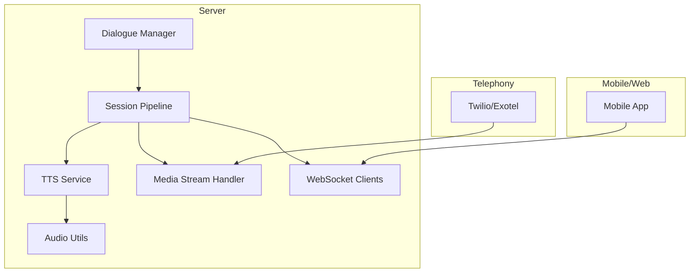
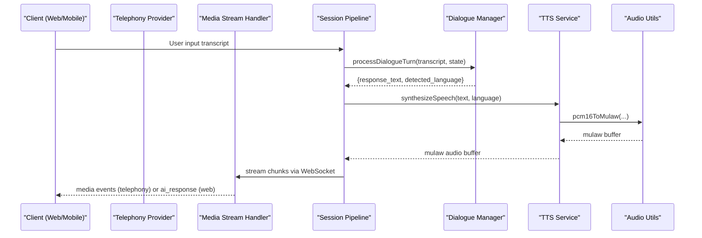
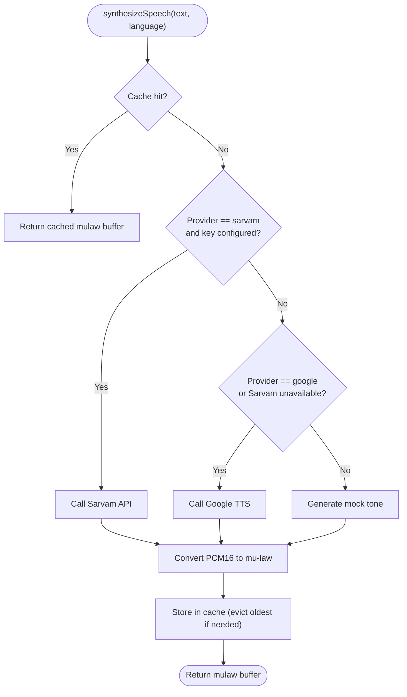
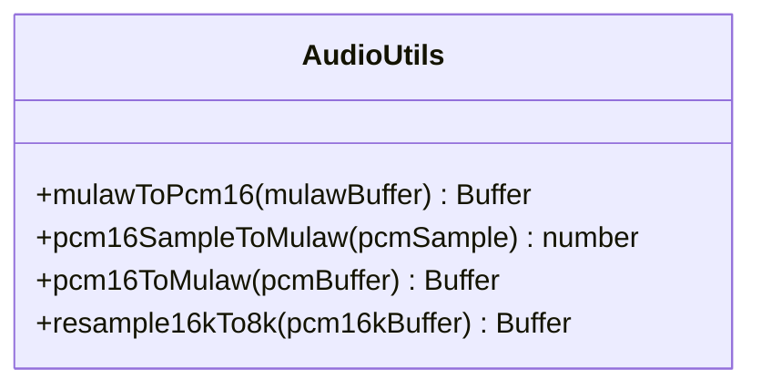
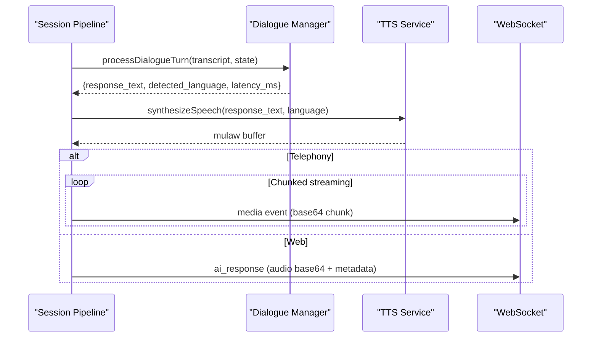
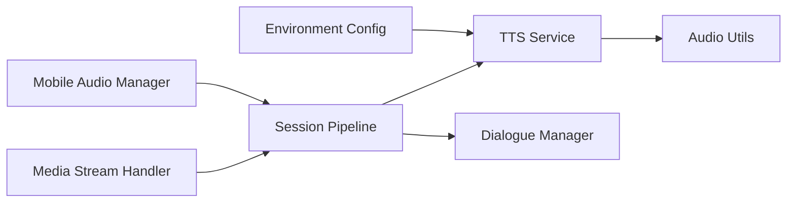

# Text-to-Speech Synthesis

<cite>
**Referenced Files in This Document**
- [ttsService.js](file://server/src/services/ttsService.js)
- [audioUtils.js](file://server/src/utils/audioUtils.js)
- [sessionPipeline.js](file://server/src/websocket/sessionPipeline.js)
- [mediaStreamHandler.js](file://server/src/websocket/mediaStreamHandler.js)
- [env.js](file://server/src/config/env.js)
- [dialogueManager.js](file://server/src/services/dialogueManager.js)
- [audioManager.js](file://mobile/src/services/audioManager.js)
</cite>

## Table of Contents
1. [Introduction](#introduction)
2. [Project Structure](#project-structure)
3. [Core Components](#core-components)
4. [Architecture Overview](#architecture-overview)
5. [Detailed Component Analysis](#detailed-component-analysis)
6. [Dependency Analysis](#dependency-analysis)
7. [Performance Considerations](#performance-considerations)
8. [Troubleshooting Guide](#troubleshooting-guide)
9. [Conclusion](#conclusion)
10. [Appendices](#appendices)

## Introduction
This document explains how the dialogue orchestration engine converts generated text responses into natural-sounding speech for voice conversations. It covers TTS provider integrations, voice customization options (including accent selection and speaking rate), multilingual support for English and Tamil, real-time audio streaming, buffer management, quality optimization techniques, configuration guidance, edge case handling, and performance monitoring for latency and audio quality.

## Project Structure
The TTS pipeline spans server-side services and utilities that synthesize speech, convert audio formats, stream media to telephony or web clients, and integrate with the dialogue flow:

- TTS service provides multi-provider synthesis and caching
- Audio utilities handle codec conversions and resampling
- Session pipeline orchestrates turn processing, TTS invocation, and streaming
- Media stream handler ingests telephony audio and forwards it to STT
- Environment config validates required keys for providers
- Dialogue manager produces response text and language hints
- Mobile audio manager handles playback on mobile clients

**Diagram sources**
- [sessionPipeline.js:116-294](file://server/src/websocket/sessionPipeline.js#L116-L294)
- [ttsService.js:22-70](file://server/src/services/ttsService.js#L22-L70)
- [audioUtils.js:21-83](file://server/src/utils/audioUtils.js#L21-L83)
- [mediaStreamHandler.js:1-69](file://server/src/websocket/mediaStreamHandler.js#L1-L69)

**Section sources**
- [sessionPipeline.js:1-437](file://server/src/websocket/sessionPipeline.js#L1-L437)
- [ttsService.js:1-187](file://server/src/services/ttsService.js#L1-L187)
- [audioUtils.js:1-84](file://server/src/utils/audioUtils.js#L1-L84)
- [mediaStreamHandler.js:1-69](file://server/src/websocket/mediaStreamHandler.js#L1-L69)
- [env.js:1-42](file://server/src/config/env.js#L1-L42)
- [dialogueManager.js:36-84](file://server/src/services/dialogueManager.js#L36-L84)
- [audioManager.js:92-131](file://mobile/src/services/audioManager.js#L92-L131)

## Core Components
- TTS Service: Multi-provider synthesis with fallbacks, caching, and format conversion
- Audio Utilities: Mu-law/PCM conversions and resampling for telephony compatibility
- Session Pipeline: Orchestrates user turns, invokes TTS, streams audio chunks, and tracks metrics
- Media Stream Handler: Bridges telephony media streams to STT and session lifecycle
- Environment Config: Validates provider keys and runtime settings
- Dialogue Manager: Produces response text and detected language for TTS routing
- Mobile Audio Manager: Plays synthesized or native speech on mobile devices

**Section sources**
- [ttsService.js:22-70](file://server/src/services/ttsService.js#L22-L70)
- [audioUtils.js:21-83](file://server/src/utils/audioUtils.js#L21-L83)
- [sessionPipeline.js:116-294](file://server/src/websocket/sessionPipeline.js#L116-L294)
- [mediaStreamHandler.js:1-69](file://server/src/websocket/mediaStreamHandler.js#L1-L69)
- [env.js:1-42](file://server/src/config/env.js#L1-L42)
- [dialogueManager.js:36-84](file://server/src/services/dialogueManager.js#L36-L84)
- [audioManager.js:92-131](file://mobile/src/services/audioManager.js#L92-L131)

## Architecture Overview
End-to-end flow from transcript to spoken response:

**Diagram sources**
- [sessionPipeline.js:132-294](file://server/src/websocket/sessionPipeline.js#L132-L294)
- [ttsService.js:22-70](file://server/src/services/ttsService.js#L22-L70)
- [audioUtils.js:59-71](file://server/src/utils/audioUtils.js#L59-L71)
- [mediaStreamHandler.js:1-69](file://server/src/websocket/mediaStreamHandler.js#L1-L69)

## Detailed Component Analysis

### TTS Service: Providers, Caching, and Format Conversion
- Provider selection:
  - Chooses provider based on environment variable; supports Sarvam AI, Google Cloud TTS, and a mock generator for local development
  - Implements fallback chain: Sarvam → Google → Mock
- Multilingual support:
  - Language codes map to regional variants for English (en-IN) and Tamil (ta-IN)
  - Detects language prefix to select appropriate voice/language mapping
- Voice customization:
  - Speaker identity, pitch, pace, loudness, and sample rate are configured per provider call
  - Speaking rate is explicitly set in provider requests
- Caching:
  - In-memory cache keyed by provider, language, and normalized text reduces repeated synthesis for static prompts
  - LRU-style eviction when cache exceeds configured limit
- Output format:
  - Returns 8kHz mu-law buffers suitable for telephony playback
  - Converts PCM16 to mu-law using utility functions

**Diagram sources**
- [ttsService.js:22-70](file://server/src/services/ttsService.js#L22-L70)
- [ttsService.js:75-120](file://server/src/services/ttsService.js#L75-L120)
- [ttsService.js:125-148](file://server/src/services/ttsService.js#L125-L148)
- [ttsService.js:154-179](file://server/src/services/ttsService.js#L154-L179)
- [audioUtils.js:59-71](file://server/src/utils/audioUtils.js#L59-L71)

**Section sources**
- [ttsService.js:22-70](file://server/src/services/ttsService.js#L22-L70)
- [ttsService.js:75-120](file://server/src/services/ttsService.js#L75-L120)
- [ttsService.js:125-148](file://server/src/services/ttsService.js#L125-L148)
- [ttsService.js:154-179](file://server/src/services/ttsService.js#L154-L179)
- [audioUtils.js:59-71](file://server/src/utils/audioUtils.js#L59-L71)

### Audio Utilities: Codec Conversions and Resampling
- Mu-law ↔ PCM16 conversion:
  - Precomputed decoding table for efficient mu-law to PCM16 conversion
  - Sample-wise encoding from PCM16 to mu-law for telephony output
- Resampling:
  - Simple decimation to downsample 16kHz PCM16 to 8kHz PCM16 for compatibility with telephony pipelines

**Diagram sources**
- [audioUtils.js:21-83](file://server/src/utils/audioUtils.js#L21-L83)

**Section sources**
- [audioUtils.js:21-83](file://server/src/utils/audioUtils.js#L21-L83)

### Session Pipeline: Orchestration, Streaming, and Metrics
- Turn processing:
  - Receives final transcripts, updates conversation history, and calls dialogue manager
  - Tracks latencies and records stages for observability
- TTS integration:
  - Invokes TTS service with response text and detected language
  - Computes TTS latency and broadcasts completion metrics
- Streaming:
  - For telephony (Twilio/Exotel): sends fixed-size mu-law chunks over WebSocket media events
  - For web: sends base64-encoded audio payload along with metadata
- Memory management:
  - Enforces memory cap per active call and manages audio chunk accumulation
- Order confirmation:
  - Asynchronously persists orders, geocodes addresses, and dispatches notifications

**Diagram sources**
- [sessionPipeline.js:132-294](file://server/src/websocket/sessionPipeline.js#L132-L294)

**Section sources**
- [sessionPipeline.js:116-294](file://server/src/websocket/sessionPipeline.js#L116-L294)
- [sessionPipeline.js:18-19](file://server/src/websocket/sessionPipeline.js#L18-L19)

### Media Stream Handler: Telephony Ingestion
- Handles incoming telephony media streams:
  - Initializes sessions on stream start
  - Decodes mu-law to PCM16 for STT ingestion
  - Buffers audio chunks up to a threshold to avoid unbounded memory growth
  - Ends sessions on stream stop or connection close

**Section sources**
- [mediaStreamHandler.js:1-69](file://server/src/websocket/mediaStreamHandler.js#L1-L69)

### Configuration and Environment
- Environment validation:
  - Ensures required keys like SARVAM_API_KEY are present when needed
  - Provides defaults for non-production environments
- Provider selection:
  - Uses environment variable to choose TTS provider at runtime
  - Falls back gracefully when credentials are missing or APIs fail

**Section sources**
- [env.js:1-42](file://server/src/config/env.js#L1-L42)
- [ttsService.js:28-60](file://server/src/services/ttsService.js#L28-L60)

### Dialogue Manager: Response Generation and Language Detection
- Builds system prompts with catalog and caller context
- Calls LLM adapter or falls back to rule-based engine
- Returns response text, updated state, and detected language for TTS routing

**Section sources**
- [dialogueManager.js:36-84](file://server/src/services/dialogueManager.js#L36-L84)

### Mobile Playback: Native Speech Integration
- Mobile app can play synthesized audio or use native speech capabilities
- Supports language selection and basic voice parameters (pitch, rate)

**Section sources**
- [audioManager.js:92-131](file://mobile/src/services/audioManager.js#L92-L131)

## Dependency Analysis
Key dependencies and relationships:

**Diagram sources**
- [sessionPipeline.js:1-16](file://server/src/websocket/sessionPipeline.js#L1-L16)
- [ttsService.js:12-16](file://server/src/services/ttsService.js#L12-L16)
- [mediaStreamHandler.js:1-3](file://server/src/websocket/mediaStreamHandler.js#L1-L3)
- [env.js:20-24](file://server/src/config/env.js#L20-L24)
- [audioManager.js:1-4](file://mobile/src/services/audioManager.js#L1-L4)

**Section sources**
- [sessionPipeline.js:1-16](file://server/src/websocket/sessionPipeline.js#L1-L16)
- [ttsService.js:12-16](file://server/src/services/ttsService.js#L12-L16)
- [mediaStreamHandler.js:1-3](file://server/src/websocket/mediaStreamHandler.js#L1-L3)
- [env.js:20-24](file://server/src/config/env.js#L20-L24)
- [audioManager.js:1-4](file://mobile/src/services/audioManager.js#L1-L4)

## Performance Considerations
- Latency minimization:
  - Immediate TTS invocation after dialogue turn completes to reduce time-to-first-audio
  - Fixed-size chunk streaming for telephony to balance latency and network overhead
- Caching:
  - In-memory cache for repeated prompts reduces redundant synthesis and network calls
- Memory management:
  - Per-call memory cap prevents unbounded growth during long sessions
  - Audio chunk buffering limited to prevent excessive memory usage
- Codec efficiency:
  - Mu-law output optimized for telephony bandwidth constraints
  - Resampling ensures compatibility across different audio pipelines
- Quality tuning:
  - Provider-specific voice parameters (pitch, pace, loudness) tuned for naturalness
  - Language-aware voice selection improves intelligibility for Tamil and English

[No sources needed since this section provides general guidance]

## Troubleshooting Guide
Common issues and resolutions:

- Missing provider credentials:
  - Ensure SARVAM_API_KEY is configured when using Sarvam provider
  - Verify environment variable names and values match expected schema
- Provider failures:
  - The TTS service automatically falls back to next provider or mock generator
  - Check logs for provider error messages and adjust configuration accordingly
- Audio playback issues:
  - Confirm client supports mu-law playback for telephony or base64 audio for web
  - Validate chunk sizes and WebSocket connectivity for streaming
- High latency:
  - Monitor TTS latency metrics and consider enabling caching for static prompts
  - Evaluate provider performance and consider switching providers if necessary
- Memory pressure:
  - Review per-call memory caps and adjust thresholds if needed
  - Ensure audio chunk limits are appropriate for your deployment

**Section sources**
- [ttsService.js:28-60](file://server/src/services/ttsService.js#L28-L60)
- [sessionPipeline.js:224-294](file://server/src/websocket/sessionPipeline.js#L224-L294)
- [mediaStreamHandler.js:40-50](file://server/src/websocket/mediaStreamHandler.js#L40-L50)
- [env.js:20-24](file://server/src/config/env.js#L20-L24)

## Conclusion
The TTS subsystem integrates multiple providers with robust fallbacks, caching, and format conversion to deliver natural-sounding speech for voice conversations. It supports multilingual outputs for English and Tamil, offers voice customization options, and implements real-time streaming with careful buffer management. Monitoring and metrics enable ongoing performance optimization and troubleshooting.

[No sources needed since this section summarizes without analyzing specific files]

## Appendices

### Configuration Reference
- Environment variables:
  - AI_TTS_PROVIDER: Selects TTS provider at runtime
  - SARVAM_API_KEY: Required for Sarvam provider
  - Other provider keys as needed for Google Cloud TTS
- Voice parameters:
  - Pitch, pace, loudness configurable per provider
  - Speaking rate explicitly set in provider requests

**Section sources**
- [env.js:20-24](file://server/src/config/env.js#L20-L24)
- [ttsService.js:88-98](file://server/src/services/ttsService.js#L88-L98)
- [ttsService.js:136-145](file://server/src/services/ttsService.js#L136-L145)

### Edge Cases in Text Processing
- Empty or invalid transcripts:
  - Handled by dialogue manager with fallback responses
- Mixed language inputs:
  - Detected language guides TTS routing for optimal voice selection
- Long responses:
  - Chunked streaming ensures smooth playback even for extended text

**Section sources**
- [dialogueManager.js:137-301](file://server/src/services/dialogueManager.js#L137-L301)
- [sessionPipeline.js:132-194](file://server/src/websocket/sessionPipeline.js#L132-L194)

### Monitoring and Metrics
- Latency tracking:
  - Dialogue turn latency recorded and persisted
  - TTS latency measured and broadcast for observability
- Audio duration:
  - Calculated from mu-law buffer length for reporting
- Dashboard broadcasting:
  - Real-time updates for transcripts, AI responses, and TTS completion

**Section sources**
- [sessionPipeline.js:158-194](file://server/src/websocket/sessionPipeline.js#L158-L194)
- [sessionPipeline.js:224-244](file://server/src/websocket/sessionPipeline.js#L224-L244)