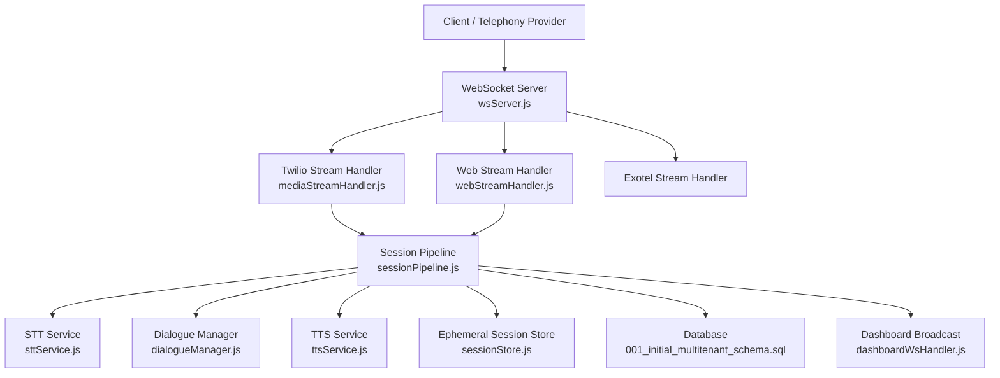
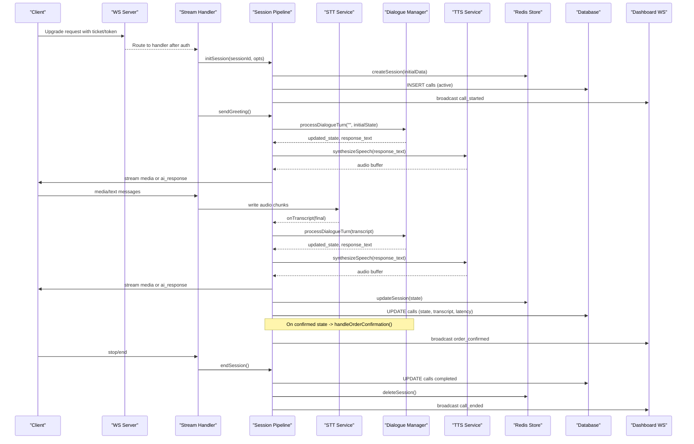
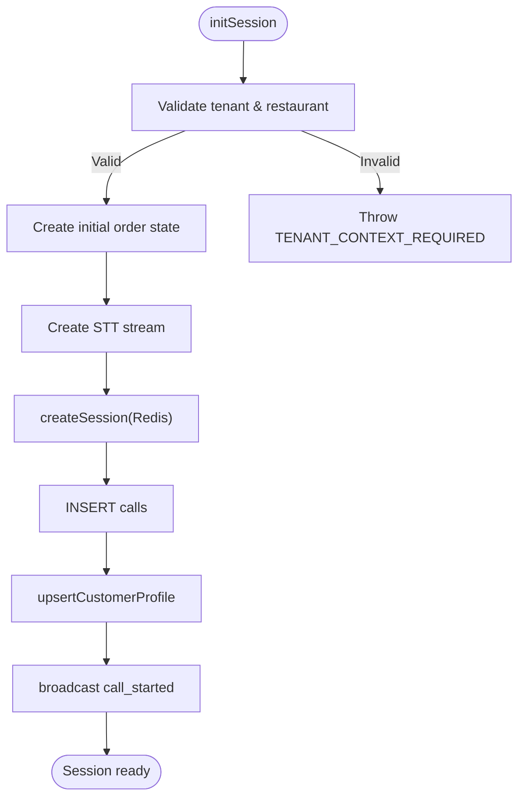
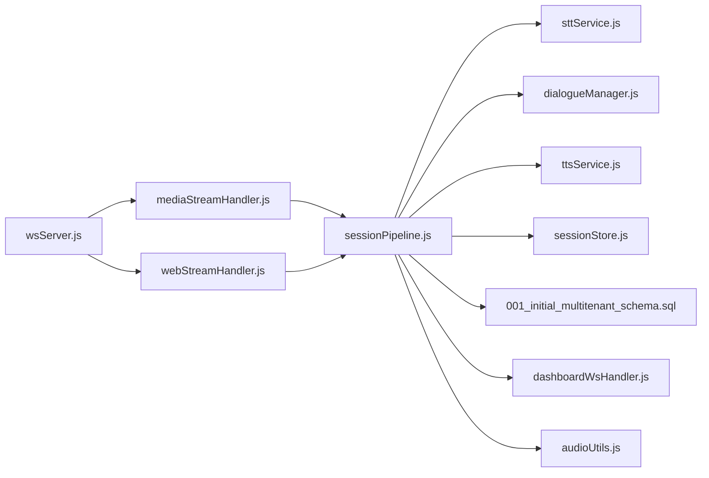

# Session Lifecycle Management

<cite>
**Referenced Files in This Document**
- [sessionPipeline.js](file://server/src/websocket/sessionPipeline.js)
- [wsServer.js](file://server/src/websocket/wsServer.js)
- [mediaStreamHandler.js](file://server/src/websocket/mediaStreamHandler.js)
- [webStreamHandler.js](file://server/src/websocket/webStreamHandler.js)
- [dashboardWsHandler.js](file://server/src/websocket/dashboardWsHandler.js)
- [sessionStore.js](file://server/src/infra/sessionStore.js)
- [sttService.js](file://server/src/services/sttService.js)
- [ttsService.js](file://server/src/services/ttsService.js)
- [orderStateMachine.js](file://server/src/domain/orders/orderStateMachine.js)
- [call.controller.js](file://server/src/controllers/call.controller.js)
- [audioUtils.js](file://server/src/utils/audioUtils.js)
- [001_initial_multitenant_schema.sql](file://server/src/db/migrations/001_initial_multitenant_schema.sql)
</cite>

## Table of Contents
1. [Introduction](#introduction)
2. [Project Structure](#project-structure)
3. [Core Components](#core-components)
4. [Architecture Overview](#architecture-overview)
5. [Detailed Component Analysis](#detailed-component-analysis)
6. [Dependency Analysis](#dependency-analysis)
7. [Performance Considerations](#performance-considerations)
8. [Troubleshooting Guide](#troubleshooting-guide)
9. [Conclusion](#conclusion)

## Introduction
This document explains the voice session lifecycle management system in Inkiro, covering initialization through termination, connection establishment, tenant context validation, state machine initialization, ephemeral cache storage, database persistence, customer profile handling, conversation history, memory optimization, monitoring and debugging, and scalability for high-volume voice processing. It is designed to be accessible to both technical and non-technical readers while providing precise references to source files.

## Project Structure
The voice session pipeline spans WebSocket upgrades, stream handlers, a central session orchestrator, speech services, order state management, and persistence layers:

- WebSocket server coordinates authentication and routes connections to stream handlers.
- Stream handlers initialize sessions, process audio, and manage lifecycle events.
- The session pipeline orchestrates STT, dialogue processing, TTS, order confirmation, and cleanup.
- Ephemeral Redis-backed session store provides distributed state across instances.
- Database stores call metadata, transcripts, orders, and recordings.
- Dashboard WebSocket enables real-time monitoring with tenant-scoped broadcasts.

**Diagram sources**
- [wsServer.js:17-147](file://server/src/websocket/wsServer.js#L17-L147)
- [mediaStreamHandler.js:7-69](file://server/src/websocket/mediaStreamHandler.js#L7-L69)
- [webStreamHandler.js:7-81](file://server/src/websocket/webStreamHandler.js#L7-L81)
- [sessionPipeline.js:24-111](file://server/src/websocket/sessionPipeline.js#L24-L111)
- [sttService.js:329-454](file://server/src/services/sttService.js#L329-L454)
- [ttsService.js:28-70](file://server/src/services/ttsService.js#L28-L70)
- [sessionStore.js:13-65](file://server/src/infra/sessionStore.js#L13-L65)
- [dashboardWsHandler.js:10-69](file://server/src/websocket/dashboardWsHandler.js#L10-L69)

**Section sources**
- [wsServer.js:17-147](file://server/src/websocket/wsServer.js#L17-L147)
- [sessionPipeline.js:24-111](file://server/src/websocket/sessionPipeline.js#L24-L111)

## Core Components
- WebSocket Coordinator: Handles upgrade requests, enforces multi-stream authentication (tickets or tokens), and routes to appropriate handlers.
- Stream Handlers: Initialize sessions for telephony and web clients; manage media messages and end-of-call flows.
- Session Pipeline: Orchestrates STT streaming, dialogue turns, TTS synthesis, order confirmation, and cleanup.
- Ephemeral Session Store: Redis-backed key-value store for fast, distributed session state with TTLs.
- Speech Services: Multi-provider STT (Groq, Google, local Whisper, mock) and TTS (Sarvam, Google, mock) with caching and fallbacks.
- Order State Machine: Authoritative transitions governing order lifecycle and pricing reconciliation.
- Monitoring: Dashboard WebSocket broadcasting tenant-scoped events for live observability.

**Section sources**
- [wsServer.js:17-147](file://server/src/websocket/wsServer.js#L17-L147)
- [mediaStreamHandler.js:7-69](file://server/src/websocket/mediaStreamHandler.js#L7-L69)
- [webStreamHandler.js:7-81](file://server/src/websocket/webStreamHandler.js#L7-L81)
- [sessionPipeline.js:24-111](file://server/src/websocket/sessionPipeline.js#L24-L111)
- [sessionStore.js:13-65](file://server/src/infra/sessionStore.js#L13-L65)
- [sttService.js:329-454](file://server/src/services/sttService.js#L329-L454)
- [ttsService.js:28-70](file://server/src/services/ttsService.js#L28-L70)
- [orderStateMachine.js:46-325](file://server/src/domain/orders/orderStateMachine.js#L46-L325)
- [dashboardWsHandler.js:10-69](file://server/src/websocket/dashboardWsHandler.js#L10-L69)

## Architecture Overview
The system uses a hub-and-spoke architecture where the WebSocket server authenticates and routes streams to handlers that delegate to the session pipeline. The pipeline composes STT, dialogue, TTS, and business logic while persisting critical data and broadcasting telemetry.

**Diagram sources**
- [wsServer.js:23-147](file://server/src/websocket/wsServer.js#L23-L147)
- [mediaStreamHandler.js:12-69](file://server/src/websocket/mediaStreamHandler.js#L12-L69)
- [webStreamHandler.js:23-81](file://server/src/websocket/webStreamHandler.js#L23-L81)
- [sessionPipeline.js:24-111](file://server/src/websocket/sessionPipeline.js#L24-L111)
- [sessionPipeline.js:132-219](file://server/src/websocket/sessionPipeline.js#L132-L219)
- [sessionPipeline.js:224-294](file://server/src/websocket/sessionPipeline.js#L224-L294)
- [sessionPipeline.js:299-389](file://server/src/websocket/sessionPipeline.js#L299-L389)
- [sessionPipeline.js:394-436](file://server/src/websocket/sessionPipeline.js#L394-L436)
- [sttService.js:329-454](file://server/src/services/sttService.js#L329-L454)
- [ttsService.js:28-70](file://server/src/services/ttsService.js#L28-L70)
- [sessionStore.js:13-65](file://server/src/infra/sessionStore.js#L13-L65)
- [dashboardWsHandler.js:43-69](file://server/src/websocket/dashboardWsHandler.js#L43-L69)

## Detailed Component Analysis

### WebSocket Server and Authentication
- Creates a WebSocket server with payload limits and binds upgrade handling.
- Validates paths and enforces authentication per endpoint:
  - Dashboard: single-use tickets or bearer tokens; role-based access control.
  - Web stream: tickets or tokens; strict production enforcement.
  - Telephony streams: stream tickets from provider orchestration.
- Routes authenticated connections to specific handlers and maintains liveness via ping/pong.

**Section sources**
- [wsServer.js:17-147](file://server/src/websocket/wsServer.js#L17-L147)

### Stream Handlers
- Twilio handler:
  - Extracts streamSid and callSid on start; initializes session with tenant and restaurant context; sends greeting; processes media chunks; ends session on stop/close.
  - Converts G.711 mu-law to PCM16 before writing to STT stream; caps audio chunk storage to prevent unbounded memory growth.
- Web handler:
  - Generates unique sessionId; initializes session with optional tenant context; sends greeting; handles text and audio messages; transcribes buffers when needed; ends session on close or explicit end message.

**Section sources**
- [mediaStreamHandler.js:7-69](file://server/src/websocket/mediaStreamHandler.js#L7-L69)
- [webStreamHandler.js:7-81](file://server/src/websocket/webStreamHandler.js#L7-L81)
- [audioUtils.js:26-33](file://server/src/utils/audioUtils.js#L26-L33)

### Session Pipeline
- Initialization:
  - Validates tenant and restaurant context; creates initial order state; builds STT stream; constructs session object with metadata, conversation history, latencies, and audio chunk buffer; persists to Redis and DB; upserts customer profile if applicable; broadcasts call started.
- User input processing:
  - Guards against concurrent processing; appends user utterance to conversation history; logs to DB; updates dashboard; runs dialogue turn; records latencies; synthesizes and streams audio; updates ephemeral and persistent state; triggers order confirmation flow when state reaches confirmed.
- Audio response:
  - Synthesizes speech; measures latency; broadcasts metrics; streams media to telephony providers in fixed-size chunks; sends base64 audio to web clients; handles errors gracefully.
- Order confirmation:
  - Geocodes delivery address asynchronously; saves addresses; optionally sends pin-drop link; authoritatively persists order with snapshots; increments customer order count; dispatches kitchen order and notifications via queues; broadcasts order confirmed.
- Termination:
  - Ends STT stream; marks call completed; offloads recording persistence to worker queue; broadcasts call ended summary; removes session from memory and Redis.

**Diagram sources**
- [sessionPipeline.js:24-111](file://server/src/websocket/sessionPipeline.js#L24-L111)

**Section sources**
- [sessionPipeline.js:24-111](file://server/src/websocket/sessionPipeline.js#L24-L111)
- [sessionPipeline.js:132-219](file://server/src/websocket/sessionPipeline.js#L132-L219)
- [sessionPipeline.js:224-294](file://server/src/websocket/sessionPipeline.js#L224-L294)
- [sessionPipeline.js:299-389](file://server/src/websocket/sessionPipeline.js#L299-L389)
- [sessionPipeline.js:394-436](file://server/src/websocket/sessionPipeline.js#L394-L436)

### Ephemeral Session Store
- Provides create, get, update, delete, touch, and list operations backed by Redis with TTLs.
- Supports cluster-wide discovery and filtering by tenant and restaurant for active sessions.

**Section sources**
- [sessionStore.js:13-92](file://server/src/infra/sessionStore.js#L13-L92)

### Speech-to-Text (STT) Service
- Multi-provider support: Groq Whisper batch mode with VAD-like chunking, Google Cloud streaming, local Whisper Tiny, and mock fallback.
- Streaming interface: write(audioChunk), onTranscript(callback), end(), with interim and final results.
- Buffer transcription: supports multiple formats and language hints; falls back to catalog-enhanced mock behavior when APIs unavailable.

**Section sources**
- [sttService.js:83-210](file://server/src/services/sttService.js#L83-L210)
- [sttService.js:329-454](file://server/src/services/sttService.js#L329-L454)
- [sttService.js:459-515](file://server/src/services/sttService.js#L459-L515)
- [sttService.js:521-603](file://server/src/services/sttService.js#L521-L603)

### Text-to-Speech (TTS) Service
- Multi-provider synthesis: Sarvam AI, Google Cloud, and mock tone generation.
- In-memory audio cache with LRU eviction to reduce repeated synthesis costs.
- Returns mulaw audio suitable for telephony playback; includes duration calculation utility.

**Section sources**
- [ttsService.js:28-70](file://server/src/services/ttsService.js#L28-L70)
- [ttsService.js:75-120](file://server/src/services/ttsService.js#L75-L120)
- [ttsService.js:125-148](file://server/src/services/ttsService.js#L125-L148)
- [ttsService.js:154-187](file://server/src/services/ttsService.js#L154-L187)

### Order State Machine
- Defines states and actions governing order lifecycle.
- Enforces legal transitions and updates totals, taxes, and delivery fees.
- Integrates with dialogue manager to reconcile LLM proposals with authoritative state.

**Section sources**
- [orderStateMachine.js:8-68](file://server/src/domain/orders/orderStateMachine.js#L8-L68)
- [orderStateMachine.js:73-148](file://server/src/domain/orders/orderStateMachine.js#L73-L148)
- [orderStateMachine.js:154-325](file://server/src/domain/orders/orderStateMachine.js#L154-L325)

### Monitoring and Debugging
- Dashboard WebSocket:
  - Authenticates users via tickets or tokens; sets up client set; broadcasts tenant-scoped events including call started, user speech, AI responses, TTS completion, order confirmed, and call ended summaries.
- Call statistics and inspection:
  - REST endpoints provide aggregated stats, recent calls, detailed call info with transcripts and logs, and audio retrieval.

**Section sources**
- [dashboardWsHandler.js:10-69](file://server/src/websocket/dashboardWsHandler.js#L10-L69)
- [call.controller.js:22-114](file://server/src/controllers/call.controller.js#L22-L114)

## Dependency Analysis
Key dependencies and relationships:

**Diagram sources**
- [wsServer.js:17-147](file://server/src/websocket/wsServer.js#L17-L147)
- [mediaStreamHandler.js:7-69](file://server/src/websocket/mediaStreamHandler.js#L7-L69)
- [webStreamHandler.js:7-81](file://server/src/websocket/webStreamHandler.js#L7-L81)
- [sessionPipeline.js:24-111](file://server/src/websocket/sessionPipeline.js#L24-L111)
- [sttService.js:329-454](file://server/src/services/sttService.js#L329-L454)
- [ttsService.js:28-70](file://server/src/services/ttsService.js#L28-L70)
- [sessionStore.js:13-65](file://server/src/infra/sessionStore.js#L13-L65)
- [dashboardWsHandler.js:43-69](file://server/src/websocket/dashboardWsHandler.js#L43-L69)
- [audioUtils.js:26-33](file://server/src/utils/audioUtils.js#L26-L33)

**Section sources**
- [wsServer.js:17-147](file://server/src/websocket/wsServer.js#L17-L147)
- [sessionPipeline.js:24-111](file://server/src/websocket/sessionPipeline.js#L24-L111)

## Performance Considerations
- Memory optimization:
  - Audio chunk limit per session prevents unbounded memory growth; handlers cap stored chunks to avoid excessive RAM usage during long calls.
  - TTS audio cache reduces redundant synthesis for repeated prompts; LRU eviction keeps memory bounded.
- Latency tracking:
  - Turn-level traces capture STT, LLM, and TTS latencies; averages persisted to DB for observability.
- Streaming efficiency:
  - Fixed-size media chunks for telephony minimize buffering overhead and ensure smooth playback.
- Concurrency:
  - Per-session processing flag ensures sequential handling of user inputs within a session to maintain state consistency.
- Scalability:
  - Redis-backed ephemeral sessions enable multi-instance deployments with shared state discovery.
  - Ticket-based authentication scales across instances without shared secrets.
  - Queue-based offloading for dispatch and notifications decouples heavy work from the hot path.

[No sources needed since this section provides general guidance]

## Troubleshooting Guide
Common issues and resolutions:

- Missing tenant context:
  - Symptom: Session initialization fails with tenant context required.
  - Resolution: Ensure stream tickets or web tokens include tenantId and restaurantId; verify provider integration passes these fields.
- STT failures:
  - Symptom: No transcripts or degraded recognition.
  - Resolution: Check configured provider; verify API keys; confirm audio format and sample rate; review fallback behavior and catalog hints.
- TTS failures:
  - Symptom: No audio playback or errors.
  - Resolution: Verify provider configuration; check network timeouts; rely on mock fallback for development; inspect cached entries.
- High memory usage:
  - Symptom: Increased heap size during long calls.
  - Resolution: Confirm audio chunk limits are enforced; monitor session cleanup; ensure endSession is called on disconnect.
- Dashboard not receiving events:
  - Symptom: No real-time updates in dashboard.
  - Resolution: Verify ticket/token authentication; ensure tenant and restaurant boundaries match; check client connection status.

**Section sources**
- [sessionPipeline.js:24-30](file://server/src/websocket/sessionPipeline.js#L24-L30)
- [sttService.js:83-210](file://server/src/services/sttService.js#L83-L210)
- [ttsService.js:28-70](file://server/src/services/ttsService.js#L28-L70)
- [mediaStreamHandler.js:40-55](file://server/src/websocket/mediaStreamHandler.js#L40-L55)
- [dashboardWsHandler.js:43-69](file://server/src/websocket/dashboardWsHandler.js#L43-L69)

## Conclusion
Inkiro’s voice session lifecycle management combines robust authentication, resilient speech services, authoritative order state management, and efficient resource handling. The design emphasizes tenant isolation, distributed state, low-latency interactions, and comprehensive observability. By leveraging ephemeral caches, database persistence, and queue-based offloading, the system scales effectively under high-volume conditions while maintaining reliability and performance.

[No sources needed since this section summarizes without analyzing specific files]