# Session Pipeline & State Management

<cite>
**Referenced Files in This Document**
- [wsServer.js](file://server/src/websocket/wsServer.js)
- [mediaStreamHandler.js](file://server/src/websocket/mediaStreamHandler.js)
- [webStreamHandler.js](file://server/src/websocket/webStreamHandler.js)
- [sessionPipeline.js](file://server/src/websocket/sessionPipeline.js)
- [dialogueManager.js](file://server/src/services/dialogueManager.js)
- [orderStateMachine.js](file://server/src/domain/orders/orderStateMachine.js)
- [pricingEngine.js](file://server/src/domain/orders/pricingEngine.js)
- [sttService.js](file://server/src/services/sttService.js)
- [ttsService.js](file://server/src/services/ttsService.js)
- [queueManager.js](file://server/src/queue/queueManager.js)
- [dispatch.worker.js](file://server/src/workers/dispatch.worker.js)
- [recording.worker.js](file://server/src/workers/recording.worker.js)
- [sessionStore.js](file://server/src/infra/sessionStore.js)
</cite>

## Table of Contents
1. [Introduction](#introduction)
2. [Project Structure](#project-structure)
3. [Core Components](#core-components)
4. [Architecture Overview](#architecture-overview)
5. [Detailed Component Analysis](#detailed-component-analysis)
6. [Dependency Analysis](#dependency-analysis)
7. [Performance Considerations](#performance-considerations)
8. [Troubleshooting Guide](#troubleshooting-guide)
9. [Conclusion](#conclusion)
10. [Appendices](#appendices)

## Introduction
This document explains the end-to-end WebSocket session pipeline and state management system that powers voice ordering in Inkiro. It covers:
- The full lifecycle from initial connection to call termination
- How speech-to-text, natural language understanding, order processing, and response generation are orchestrated
- The authoritative order state machine integration during voice interactions
- Session storage mechanisms and context preservation across stages
- Error handling strategies and observability
- Customization points for new workflows and additional processing stages
- Scalability considerations for concurrent sessions and resource management

## Project Structure
The pipeline spans several modules:
- WebSocket server and stream handlers route audio/text into a shared session map
- A session pipeline orchestrates STT, dialogue, TTS, and side effects
- Domain services enforce authoritative pricing and state transitions
- Background workers handle dispatch, notifications, and recording persistence
- Ephemeral Redis-backed session store persists state across process restarts

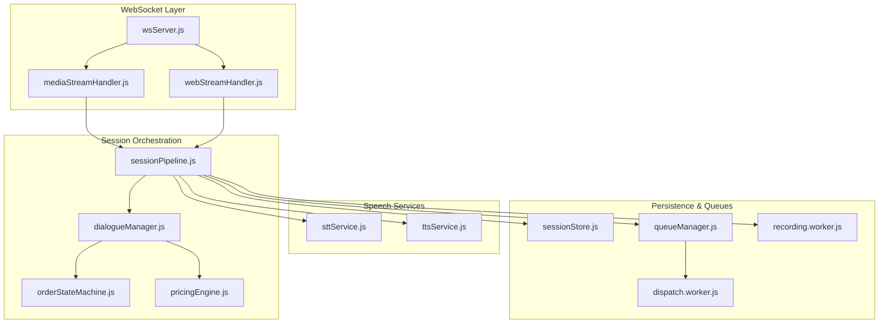

**Diagram sources**
- [wsServer.js:17-147](file://server/src/websocket/wsServer.js#L17-L147)
- [mediaStreamHandler.js:7-68](file://server/src/websocket/mediaStreamHandler.js#L7-L68)
- [webStreamHandler.js:7-80](file://server/src/websocket/webStreamHandler.js#L7-L80)
- [sessionPipeline.js:24-437](file://server/src/websocket/sessionPipeline.js#L24-L437)
- [dialogueManager.js:36-132](file://server/src/services/dialogueManager.js#L36-L132)
- [orderStateMachine.js:46-325](file://server/src/domain/orders/orderStateMachine.js#L46-L325)
- [pricingEngine.js:16-117](file://server/src/domain/orders/pricingEngine.js#L16-L117)
- [sttService.js:329-454](file://server/src/services/sttService.js#L329-L454)
- [ttsService.js:28-70](file://server/src/services/ttsService.js#L28-L70)
- [queueManager.js:1-78](file://server/src/queue/queueManager.js#L1-L78)
- [dispatch.worker.js:12-56](file://server/src/workers/dispatch.worker.js#L12-L56)
- [recording.worker.js:10-53](file://server/src/workers/recording.worker.js#L10-L53)
- [sessionStore.js:13-92](file://server/src/infra/sessionStore.js#L13-L92)

**Section sources**
- [wsServer.js:17-147](file://server/src/websocket/wsServer.js#L17-L147)
- [sessionPipeline.js:24-437](file://server/src/websocket/sessionPipeline.js#L24-L437)

## Core Components
- WebSocket coordinator authenticates and routes connections to stream handlers
- Stream handlers initialize sessions, start STT streams, and send greetings
- Session pipeline processes transcripts through dialogue, updates state, synthesizes responses, and triggers side effects
- Dialogue manager loads catalog and caller context, calls LLM or rule engine, reconciles with state machine and pricing engine
- Order state machine enforces legal transitions and maintains an audit history
- Pricing engine computes authoritative totals and item snapshots
- STT service provides streaming transcription via multiple providers
- TTS service synthesizes spoken responses with provider fallbacks and caching
- Queue manager and workers offload dispatch, notifications, and recording persistence
- Session store persists ephemeral session metadata in Redis with TTL

**Section sources**
- [wsServer.js:17-147](file://server/src/websocket/wsServer.js#L17-L147)
- [mediaStreamHandler.js:7-68](file://server/src/websocket/mediaStreamHandler.js#L7-L68)
- [webStreamHandler.js:7-80](file://server/src/websocket/webStreamHandler.js#L7-L80)
- [sessionPipeline.js:24-437](file://server/src/websocket/sessionPipeline.js#L24-L437)
- [dialogueManager.js:36-132](file://server/src/services/dialogueManager.js#L36-L132)
- [orderStateMachine.js:46-325](file://server/src/domain/orders/orderStateMachine.js#L46-L325)
- [pricingEngine.js:16-117](file://server/src/domain/orders/pricingEngine.js#L16-L117)
- [sttService.js:329-454](file://server/src/services/sttService.js#L329-L454)
- [ttsService.js:28-70](file://server/src/services/ttsService.js#L28-L70)
- [queueManager.js:1-78](file://server/src/queue/queueManager.js#L1-L78)
- [dispatch.worker.js:12-56](file://server/src/workers/dispatch.worker.js#L12-L56)
- [recording.worker.js:10-53](file://server/src/workers/recording.worker.js#L10-L53)
- [sessionStore.js:13-92](file://server/src/infra/sessionStore.js#L13-L92)

## Architecture Overview
The pipeline is event-driven and layered:
- Transport layer (WebSocket) receives media or text
- Session layer manages per-call state and coordinates services
- Domain layer enforces business rules (state machine, pricing)
- Integration layer handles external services (STT/TTS, geocoding, messaging)
- Persistence layer stores durable records and ephemeral session data
- Observability broadcasts events to dashboards and tracks latencies

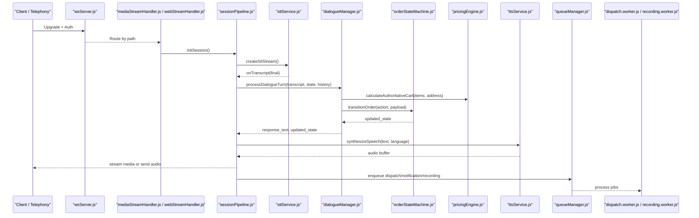

**Diagram sources**
- [wsServer.js:17-147](file://server/src/websocket/wsServer.js#L17-L147)
- [mediaStreamHandler.js:21-55](file://server/src/websocket/mediaStreamHandler.js#L21-L55)
- [webStreamHandler.js:14-60](file://server/src/websocket/webStreamHandler.js#L14-L60)
- [sessionPipeline.js:24-294](file://server/src/websocket/sessionPipeline.js#L24-L294)
- [sttService.js:329-454](file://server/src/services/sttService.js#L329-L454)
- [dialogueManager.js:36-132](file://server/src/services/dialogueManager.js#L36-L132)
- [orderStateMachine.js:154-325](file://server/src/domain/orders/orderStateMachine.js#L154-L325)
- [pricingEngine.js:76-117](file://server/src/domain/orders/pricingEngine.js#L76-L117)
- [ttsService.js:28-70](file://server/src/services/ttsService.js#L28-L70)
- [queueManager.js:15-78](file://server/src/queue/queueManager.js#L15-L78)
- [dispatch.worker.js:12-56](file://server/src/workers/dispatch.worker.js#L12-L56)
- [recording.worker.js:10-53](file://server/src/workers/recording.worker.js#L10-L53)

## Detailed Component Analysis

### WebSocket Server and Stream Handlers
- Authentication:
  - Dashboard uses single-use tickets or bearer tokens
  - Web-stream uses tickets or bearer tokens; production enforces strict auth
  - Telephony streams use stream tickets
- Routing:
  - Path-based routing to Twilio, Exotel, Web, or Dashboard handlers
- Session map:
  - Shared Map holds active sessions keyed by sessionId
- Heartbeat:
  - Ping/pong liveness check cleans dead connections

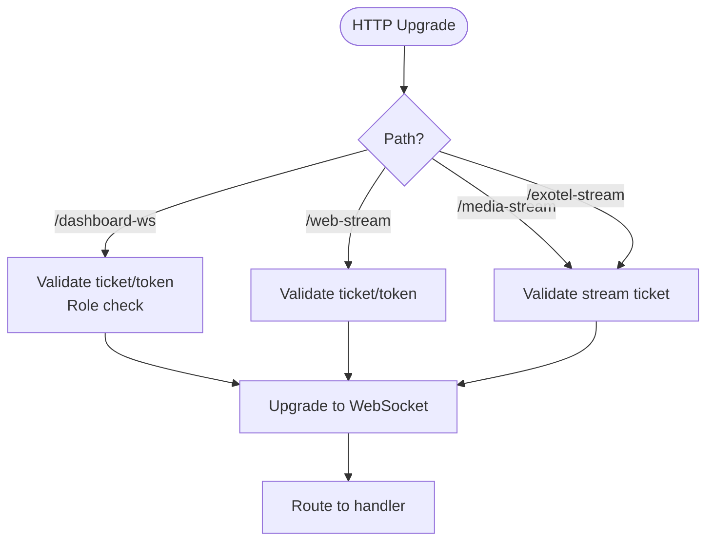

**Diagram sources**
- [wsServer.js:23-127](file://server/src/websocket/wsServer.js#L23-L127)
- [wsServer.js:129-147](file://server/src/websocket/wsServer.js#L129-L147)

**Section sources**
- [wsServer.js:23-147](file://server/src/websocket/wsServer.js#L23-L147)
- [mediaStreamHandler.js:7-68](file://server/src/websocket/mediaStreamHandler.js#L7-L68)
- [webStreamHandler.js:7-80](file://server/src/websocket/webStreamHandler.js#L7-L80)

### Session Lifecycle and Pipeline Orchestration
- Initialization:
  - Validates tenant and restaurant context
  - Creates initial order state and STT stream
  - Persists ephemeral session to Redis and DB record
  - Broadcasts call started event
- Greeting:
  - Sends first assistant turn using dialogue manager
- User input processing:
  - Appends user transcript to conversation history
  - Calls dialogue manager to get response and updated state
  - Tracks latency and logs to DB
  - Synthesizes and streams audio response immediately
  - Updates Redis session and DB
  - If order confirmed, triggers asynchronous fulfillment
- Termination:
  - Ends STT stream
  - Updates DB status and offloads audio to recording worker
  - Cleans up in-memory and Redis sessions

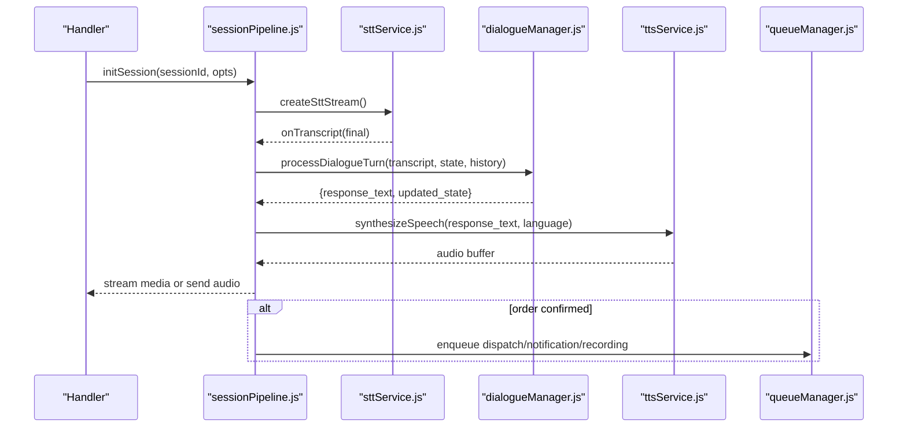

**Diagram sources**
- [sessionPipeline.js:24-294](file://server/src/websocket/sessionPipeline.js#L24-L294)
- [sttService.js:329-454](file://server/src/services/sttService.js#L329-L454)
- [dialogueManager.js:36-132](file://server/src/services/dialogueManager.js#L36-L132)
- [ttsService.js:28-70](file://server/src/services/ttsService.js#L28-L70)
- [queueManager.js:15-78](file://server/src/queue/queueManager.js#L15-L78)

**Section sources**
- [sessionPipeline.js:24-437](file://server/src/websocket/sessionPipeline.js#L24-L437)

### Speech-to-Text Service
- Provider selection:
  - Groq Whisper batch mode with VAD-like chunking
  - Google Cloud streaming with hints
  - Mock STT for development
- Streaming interface:
  - write(audioChunk), onTranscript(callback), end()
- Fallback behavior:
  - Graceful degradation if providers fail
  - Local Whisper Tiny as local CPU inference option

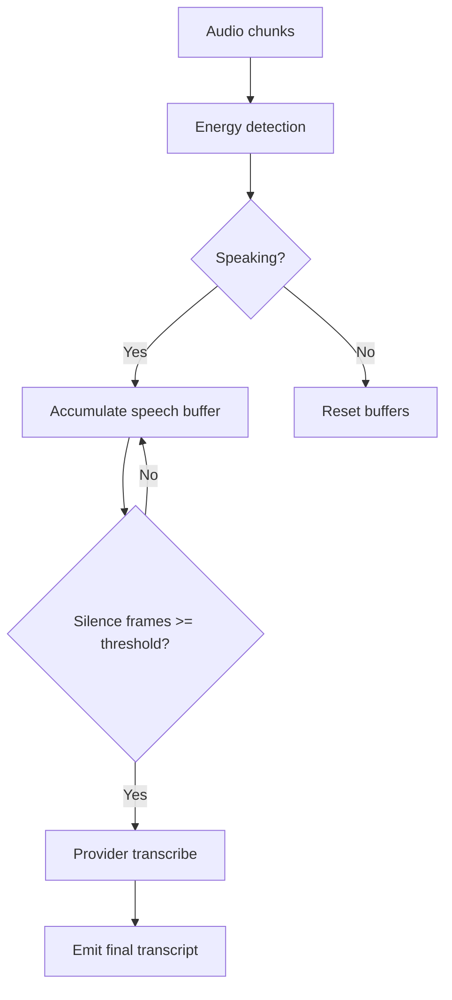

**Diagram sources**
- [sttService.js:358-454](file://server/src/services/sttService.js#L358-L454)
- [sttService.js:521-603](file://server/src/services/sttService.js#L521-L603)

**Section sources**
- [sttService.js:329-454](file://server/src/services/sttService.js#L329-L454)
- [sttService.js:521-603](file://server/src/services/sttService.js#L521-L603)

### Dialogue Manager and Natural Language Understanding
- Context loading:
  - Catalog items with categories and dietary tags
  - Caller profile, saved addresses, last order
- Prompt building:
  - System prompt assembled from catalog and caller context
- LLM execution:
  - Messages include recent history and current state snapshot
  - Returns response text, detected language, provider/model info
- Reconciliation:
  - Enforces state transitions via state machine
  - Authoritatively calculates cart totals and taxes
  - Ensures address presence before confirmation
- Fallback:
  - Rule-based engine provides deterministic behavior when LLM fails

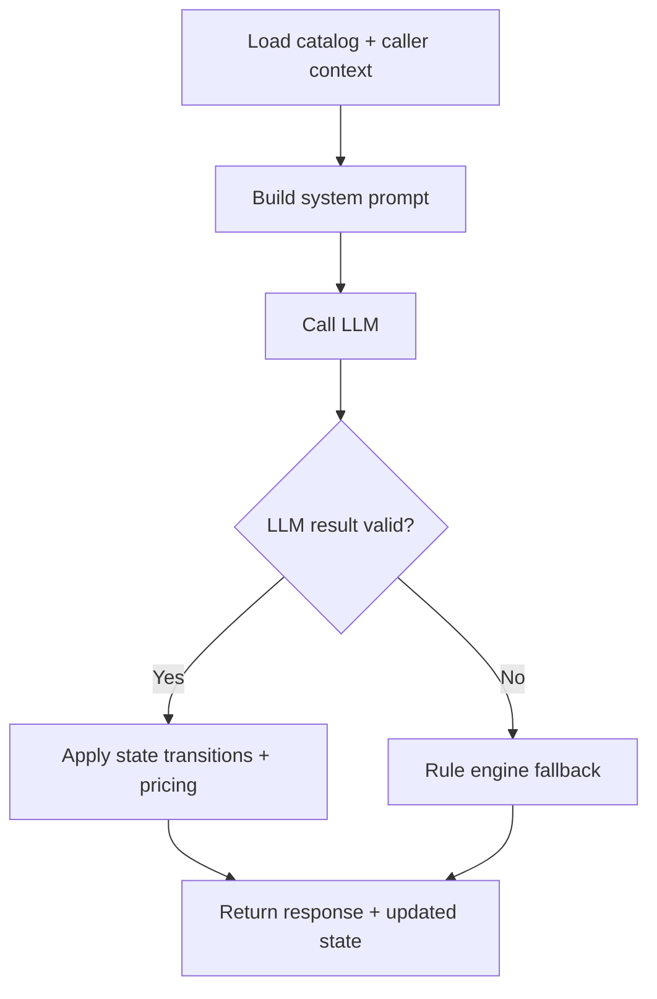

**Diagram sources**
- [dialogueManager.js:7-84](file://server/src/services/dialogueManager.js#L7-L84)
- [dialogueManager.js:93-132](file://server/src/services/dialogueManager.js#L93-L132)
- [dialogueManager.js:137-302](file://server/src/services/dialogueManager.js#L137-L302)

**Section sources**
- [dialogueManager.js:36-132](file://server/src/services/dialogueManager.js#L36-L132)
- [dialogueManager.js:137-302](file://server/src/services/dialogueManager.js#L137-L302)

### Order State Machine and Pricing Engine
- State machine:
  - Defines states like NEW, COLLECTING_ITEMS, AWAITING_CONFIRMATION, CONFIRMED, etc.
  - Validates allowed transitions per state
  - Maintains history of transitions with timestamps and payloads
- Pricing engine:
  - Matches spoken items to catalog entries
  - Computes subtotal, GST tax, delivery fee, and total in integer paise to avoid precision drift
  - Produces line-item snapshots for durability

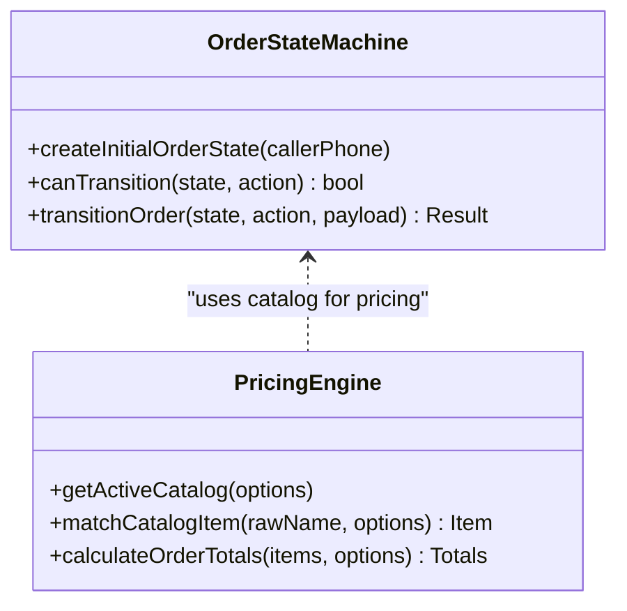

**Diagram sources**
- [orderStateMachine.js:46-325](file://server/src/domain/orders/orderStateMachine.js#L46-L325)
- [pricingEngine.js:16-117](file://server/src/domain/orders/pricingEngine.js#L16-L117)

**Section sources**
- [orderStateMachine.js:46-325](file://server/src/domain/orders/orderStateMachine.js#L46-L325)
- [pricingEngine.js:16-117](file://server/src/domain/orders/pricingEngine.js#L16-L117)

### Text-to-Speech Service
- Provider selection:
  - Sarvam AI Bulbul for Indian accents
  - Google Cloud TTS WaveNet voices
  - Mock generator for development
- Caching:
  - In-memory cache for repeated prompts to reduce latency
- Output:
  - Mulaw audio suitable for telephony playback

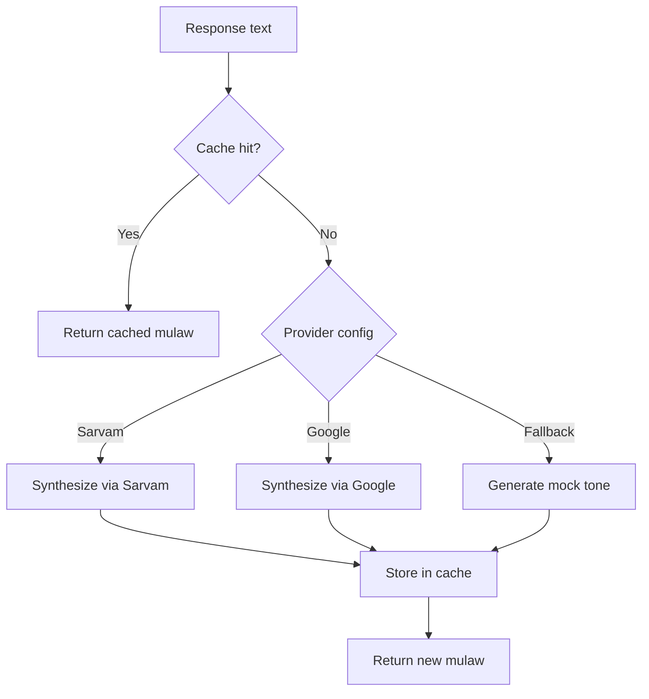

**Diagram sources**
- [ttsService.js:28-70](file://server/src/services/ttsService.js#L28-L70)
- [ttsService.js:75-120](file://server/src/services/ttsService.js#L75-L120)
- [ttsService.js:125-148](file://server/src/services/ttsService.js#L125-L148)
- [ttsService.js:154-179](file://server/src/services/ttsService.js#L154-L179)

**Section sources**
- [ttsService.js:28-70](file://server/src/services/ttsService.js#L28-L70)
- [ttsService.js:75-179](file://server/src/services/ttsService.js#L75-L179)

### Asynchronous Side Effects and Workers
- Dispatch worker:
  - Offloads kitchen/ONDC dispatch
  - Updates order status to dispatched
  - Broadcasts dashboard events with estimated time and tracking
- Recording worker:
  - Persists accumulated PCM audio to storage
  - Saves call recording metadata including duration and dispute status
- Notification queue:
  - Idempotent processing for receipts and pin-drop requests

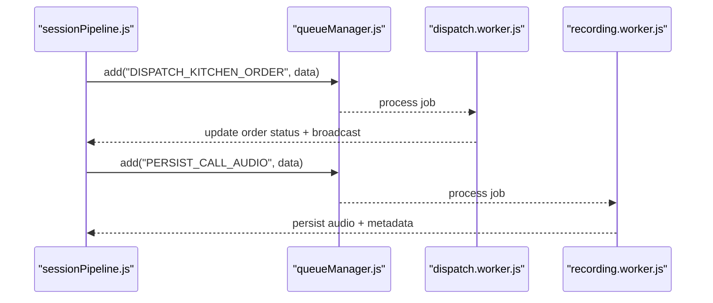

**Diagram sources**
- [sessionPipeline.js:299-389](file://server/src/websocket/sessionPipeline.js#L299-L389)
- [queueManager.js:15-78](file://server/src/queue/queueManager.js#L15-L78)
- [dispatch.worker.js:12-56](file://server/src/workers/dispatch.worker.js#L12-L56)
- [recording.worker.js:10-53](file://server/src/workers/recording.worker.js#L10-L53)

**Section sources**
- [queueManager.js:15-78](file://server/src/queue/queueManager.js#L15-L78)
- [dispatch.worker.js:12-56](file://server/src/workers/dispatch.worker.js#L12-L56)
- [recording.worker.js:10-53](file://server/src/workers/recording.worker.js#L10-L53)

### Session Storage and Context Preservation
- Ephemeral Redis store:
  - Keys prefixed per session with TTL
  - Stores tenant, restaurant, caller phone, and state
  - Supports listing active sessions filtered by tenant/restaurant
- In-memory session map:
  - Holds live session objects with STT stream, conversation history, latencies, and audio chunks
- Database persistence:
  - Call records updated with session state, transcript, and average latency
  - Orders created with snapshots and audit logs

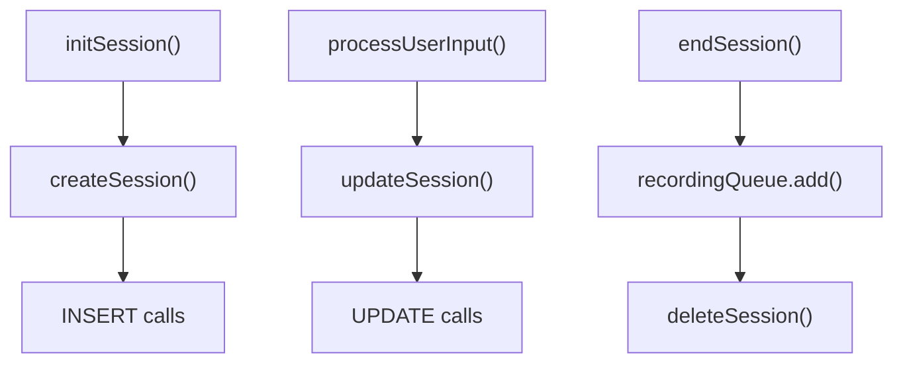

**Diagram sources**
- [sessionPipeline.js:77-111](file://server/src/websocket/sessionPipeline.js#L77-L111)
- [sessionPipeline.js:196-213](file://server/src/websocket/sessionPipeline.js#L196-L213)
- [sessionPipeline.js:394-437](file://server/src/websocket/sessionPipeline.js#L394-L437)
- [sessionStore.js:13-92](file://server/src/infra/sessionStore.js#L13-L92)

**Section sources**
- [sessionStore.js:13-92](file://server/src/infra/sessionStore.js#L13-L92)
- [sessionPipeline.js:77-111](file://server/src/websocket/sessionPipeline.js#L77-L111)
- [sessionPipeline.js:196-213](file://server/src/websocket/sessionPipeline.js#L196-L213)
- [sessionPipeline.js:394-437](file://server/src/websocket/sessionPipeline.js#L394-L437)

## Dependency Analysis
Key dependencies and coupling:
- wsServer depends on stream handlers and authentication services
- Stream handlers depend on session pipeline and STT utilities
- Session pipeline depends on STT, TTS, dialogue manager, geocoding, queues, and session store
- Dialogue manager depends on LLM adapter, prompt builder, state machine, and pricing engine
- State machine and pricing engine are domain-pure and decoupled from transport
- Queue manager wires processors to background workers
- Workers depend on repository and integration layers

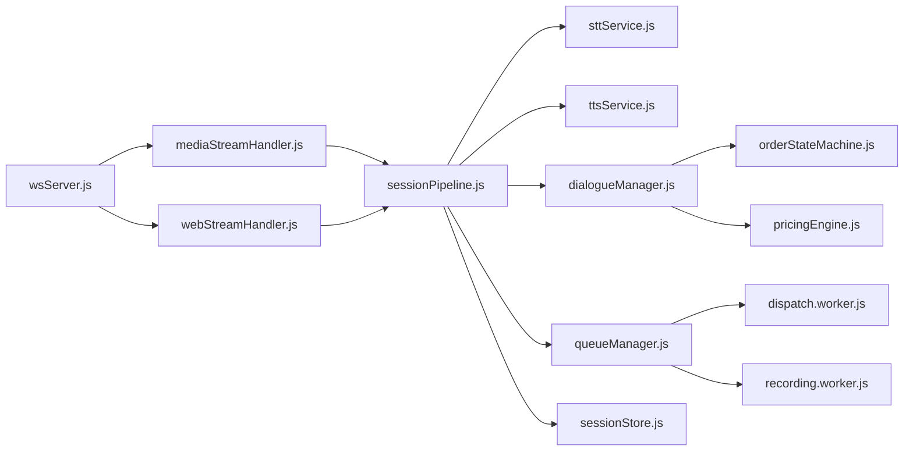

**Diagram sources**
- [wsServer.js:17-147](file://server/src/websocket/wsServer.js#L17-L147)
- [mediaStreamHandler.js:7-68](file://server/src/websocket/mediaStreamHandler.js#L7-L68)
- [webStreamHandler.js:7-80](file://server/src/websocket/webStreamHandler.js#L7-L80)
- [sessionPipeline.js:24-437](file://server/src/websocket/sessionPipeline.js#L24-L437)
- [dialogueManager.js:36-132](file://server/src/services/dialogueManager.js#L36-L132)
- [orderStateMachine.js:46-325](file://server/src/domain/orders/orderStateMachine.js#L46-L325)
- [pricingEngine.js:16-117](file://server/src/domain/orders/pricingEngine.js#L16-L117)
- [queueManager.js:1-78](file://server/src/queue/queueManager.js#L1-L78)
- [dispatch.worker.js:12-56](file://server/src/workers/dispatch.worker.js#L12-L56)
- [recording.worker.js:10-53](file://server/src/workers/recording.worker.js#L10-L53)
- [sessionStore.js:13-92](file://server/src/infra/sessionStore.js#L13-L92)

**Section sources**
- [sessionPipeline.js:24-437](file://server/src/websocket/sessionPipeline.js#L24-L437)
- [dialogueManager.js:36-132](file://server/src/services/dialogueManager.js#L36-L132)

## Performance Considerations
- Audio memory cap:
  - Per-session audio bytes capped to prevent memory growth
- STT streaming:
  - VAD-like chunking reduces network calls and improves responsiveness
  - Interim transcripts provide low-latency feedback
- TTS caching:
  - In-memory cache avoids redundant synthesis for repeated prompts
- Concurrency:
  - Queue concurrency settings balance throughput and resource usage
  - Background workers isolate heavy tasks from request paths
- Latency tracking:
  - Turn traces and stage metrics enable performance tuning
- Redis TTL:
  - Ephemeral sessions auto-expire to free resources

[No sources needed since this section provides general guidance]

## Troubleshooting Guide
Common issues and strategies:
- Missing tenant/restaurant context:
  - Pipeline throws explicit errors; ensure stream tickets or auth carry required fields
- STT provider failures:
  - Fallback to local Whisper or mock; check environment variables and API keys
- LLM adapter errors:
  - Falls back to rule engine; inspect logs for provider errors
- TTS synthesis errors:
  - Sends response without audio; verify provider configuration and network
- Order confirmation failures:
  - Validate items and address; check state machine transitions and pricing calculations
- Queue processing errors:
  - Idempotency prevents duplicates; review worker logs and retry policies
- Session cleanup:
  - Ensure endSession runs on close/stop; verify Redis deletion and DB updates

**Section sources**
- [sessionPipeline.js:28-30](file://server/src/websocket/sessionPipeline.js#L28-L30)
- [sessionPipeline.js:214-218](file://server/src/websocket/sessionPipeline.js#L214-L218)
- [sessionPipeline.js:282-293](file://server/src/websocket/sessionPipeline.js#L282-L293)
- [sttService.js:38-43](file://server/src/services/sttService.js#L38-L43)
- [dialogueManager.js:74-84](file://server/src/services/dialogueManager.js#L74-L84)
- [queueManager.js:17-41](file://server/src/queue/queueManager.js#L17-L41)
- [recording.worker.js:13-27](file://server/src/workers/recording.worker.js#L13-L27)

## Conclusion
Inkiro’s WebSocket session pipeline combines real-time audio streaming, robust NLU, authoritative state management, and scalable background processing. The design separates concerns across transport, orchestration, domain, and integration layers, enabling customization and resilience. With Redis-backed ephemeral sessions, multi-provider STT/TTS, and idempotent queues, the system supports high-concurrency voice workflows while maintaining accuracy and observability.

[No sources needed since this section summarizes without analyzing specific files]

## Appendices

### Customizing the Pipeline for New Voice Workflows
- Add a new processing stage:
  - Insert logic after dialogue manager returns updated state but before TTS synthesis
  - Example insertion point: [sendAudioResponse:224-294](file://server/src/websocket/sessionPipeline.js#L224-L294)
- Implement custom business logic:
  - Extend dialogue manager to integrate new services or rules
  - Use state machine actions to enforce new flows: [transitionOrder:154-325](file://server/src/domain/orders/orderStateMachine.js#L154-L325)
- Integrate new providers:
  - STT: configure provider via environment and implement stream factory: [createSttStream:329-352](file://server/src/services/sttService.js#L329-L352)
  - TTS: add provider fallback and caching: [synthesizeSpeech:28-70](file://server/src/services/ttsService.js#L28-L70)

**Section sources**
- [sessionPipeline.js:224-294](file://server/src/websocket/sessionPipeline.js#L224-L294)
- [dialogueManager.js:36-132](file://server/src/services/dialogueManager.js#L36-L132)
- [orderStateMachine.js:154-325](file://server/src/domain/orders/orderStateMachine.js#L154-L325)
- [sttService.js:329-352](file://server/src/services/sttService.js#L329-L352)
- [ttsService.js:28-70](file://server/src/services/ttsService.js#L28-L70)

### Adding Additional Processing Stages
- After transcript received:
  - Hook into STT callback for pre-processing or enrichment: [onTranscript:54-73](file://server/src/websocket/sessionPipeline.js#L54-L73)
- Before audio response:
  - Inject validation, moderation, or analytics: [sendAudioResponse:224-294](file://server/src/websocket/sessionPipeline.js#L224-L294)
- After order confirmation:
  - Extend asynchronous side effects via queues: [handleOrderConfirmation:299-389](file://server/src/websocket/sessionPipeline.js#L299-L389)

**Section sources**
- [sessionPipeline.js:54-73](file://server/src/websocket/sessionPipeline.js#L54-L73)
- [sessionPipeline.js:224-294](file://server/src/websocket/sessionPipeline.js#L224-L294)
- [sessionPipeline.js:299-389](file://server/src/websocket/sessionPipeline.js#L299-L389)

### Scalability Considerations for Concurrent Sessions
- Connection limits:
  - Adjust WebSocket max payload and upgrade timeouts based on load
- Memory management:
  - Cap audio chunks and purge inactive sessions promptly
- Queue scaling:
  - Tune concurrency and retries for dispatch, notifications, and recordings
- Redis clustering:
  - Use cluster-aware client for distributed session discovery
- Horizontal scaling:
  - Stateless session handlers with shared Redis and queues support multi-instance deployments

[No sources needed since this section provides general guidance]