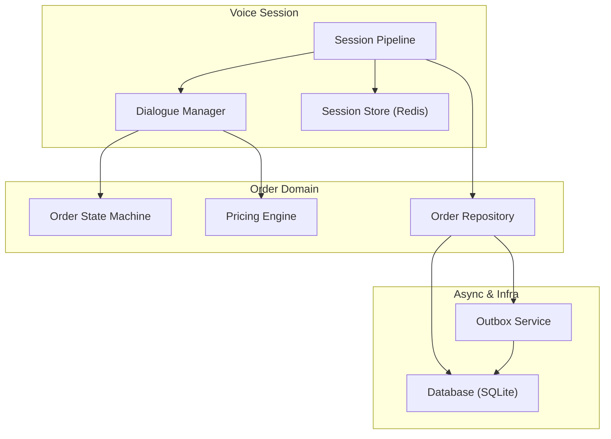
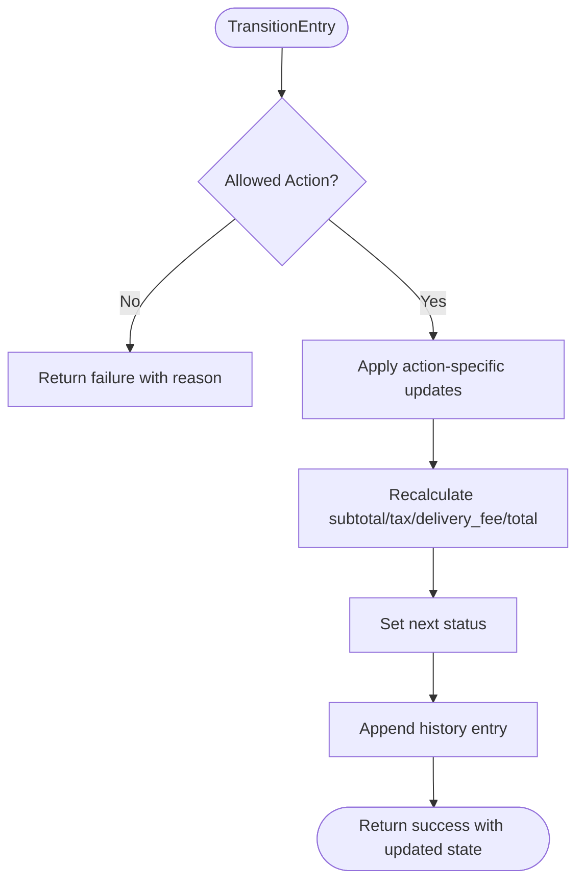
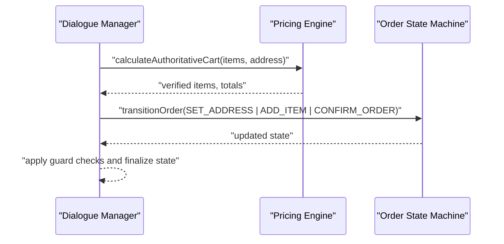
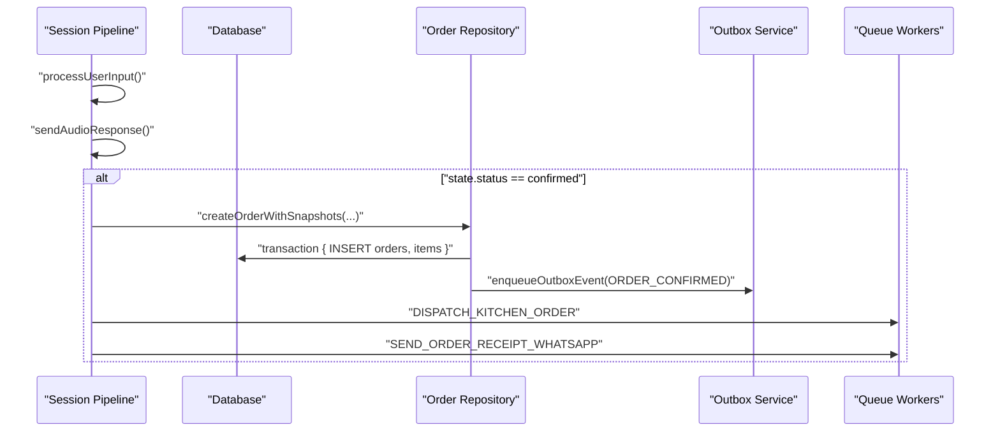
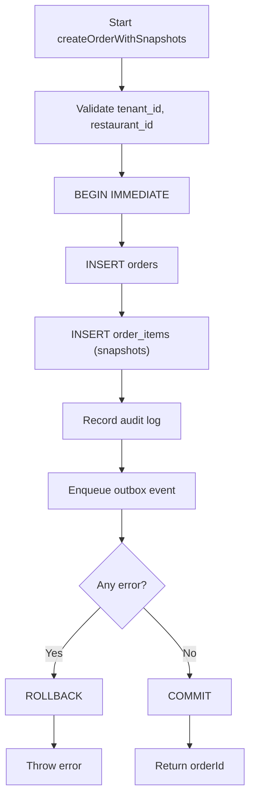
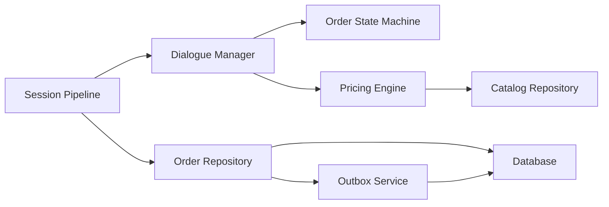

# State Machine Integration

<cite>
**Referenced Files in This Document**
- [orderStateMachine.js](file://server/src/domain/orders/orderStateMachine.js)
- [order.repository.js](file://server/src/domain/orders/order.repository.js)
- [pricingEngine.js](file://server/src/domain/orders/pricingEngine.js)
- [dialogueManager.js](file://server/src/services/dialogueManager.js)
- [sessionPipeline.js](file://server/src/websocket/sessionPipeline.js)
- [outbox.service.js](file://server/src/services/outbox.service.js)
- [sessionStore.js](file://server/src/infra/sessionStore.js)
- [db.js](file://server/src/db.js)
- [order.controller.js](file://server/src/controllers/order.controller.js)
</cite>

## Table of Contents
1. [Introduction](#introduction)
2. [Project Structure](#project-structure)
3. [Core Components](#core-components)
4. [Architecture Overview](#architecture-overview)
5. [Detailed Component Analysis](#detailed-component-analysis)
6. [Dependency Analysis](#dependency-analysis)
7. [Performance Considerations](#performance-considerations)
8. [Troubleshooting Guide](#troubleshooting-guide)
9. [Conclusion](#conclusion)
10. [Appendices](#appendices)

## Introduction
This document explains how voice conversations integrate with the order state machine to drive end-to-end order lifecycle management: creation, confirmation, payment, dispatch, and completion. It details synchronization between conversation states and backend order states, validation rules, transition guards, error handling, transactional guarantees, and strategies for extending the system with new order types or custom business logic.

## Project Structure
The integration spans several layers:
- Voice session pipeline orchestrates STT, dialogue processing, TTS, and persistence triggers.
- Dialogue manager reconciles LLM outputs with authoritative pricing and state transitions.
- Order state machine defines valid states, actions, and transitions.
- Repository persists orders atomically and emits outbox events for async processing.
- Outbox service ensures reliable event delivery with retry and recovery.
- Session store maintains ephemeral voice session state across distributed instances.



**Diagram sources**
- [sessionPipeline.js:24-111](file://server/src/websocket/sessionPipeline.js#L24-L111)
- [dialogueManager.js:36-84](file://server/src/services/dialogueManager.js#L36-L84)
- [orderStateMachine.js:46-68](file://server/src/domain/orders/orderStateMachine.js#L46-L68)
- [pricingEngine.js:16-45](file://server/src/domain/orders/pricingEngine.js#L16-L45)
- [order.repository.js:24-143](file://server/src/domain/orders/order.repository.js#L24-L143)
- [outbox.service.js:8-30](file://server/src/services/outbox.service.js#L8-L30)
- [sessionStore.js:13-29](file://server/src/infra/sessionStore.js#L13-L29)
- [db.js:108-120](file://server/src/db.js#L108-L120)

**Section sources**
- [sessionPipeline.js:24-111](file://server/src/websocket/sessionPipeline.js#L24-L111)
- [dialogueManager.js:36-84](file://server/src/services/dialogueManager.js#L36-L84)
- [orderStateMachine.js:46-68](file://server/src/domain/orders/orderStateMachine.js#L46-L68)
- [order.repository.js:24-143](file://server/src/domain/orders/order.repository.js#L24-L143)
- [outbox.service.js:8-30](file://server/src/services/outbox.service.js#L8-L30)
- [sessionStore.js:13-29](file://server/src/infra/sessionStore.js#L13-L29)
- [db.js:108-120](file://server/src/db.js#L108-L120)

## Core Components
- Order State Machine: Defines states, actions, transition guards, and deterministic updates including totals and history.
- Dialogue Manager: Bridges voice input to state transitions using LLM proposals validated by the state machine and pricing engine.
- Session Pipeline: Manages voice sessions, processes user turns, streams audio, and triggers order confirmation when state reaches confirmed.
- Order Repository: Authoritative persistence with multi-tenant scoping, optimistic concurrency, audit logs, and outbox events.
- Pricing Engine: Deterministic catalog matching and authoritative calculation of subtotal, tax, delivery fee, and total.
- Outbox Service: Transactional event persistence with atomic claiming, retries, and stale recovery.
- Session Store: Ephemeral Redis-backed storage for active voice sessions with TTL and cluster-aware listing.

**Section sources**
- [orderStateMachine.js:73-148](file://server/src/domain/orders/orderStateMachine.js#L73-L148)
- [dialogueManager.js:93-132](file://server/src/services/dialogueManager.js#L93-L132)
- [sessionPipeline.js:132-219](file://server/src/websocket/sessionPipeline.js#L132-L219)
- [order.repository.js:24-143](file://server/src/domain/orders/order.repository.js#L24-L143)
- [pricingEngine.js:50-117](file://server/src/domain/orders/pricingEngine.js#L50-L117)
- [outbox.service.js:8-30](file://server/src/services/outbox.service.js#L8-L30)
- [sessionStore.js:13-29](file://server/src/infra/sessionStore.js#L13-L29)

## Architecture Overview
The voice session pipeline drives order state changes through a layered approach:
- STT captures speech and forwards transcripts to the dialogue manager.
- Dialogue manager builds context (catalog, caller profile), calls LLM, then reconciles proposed items/address/actions with the authoritative state machine and pricing engine.
- When the order state becomes confirmed, the session pipeline persists the order with snapshots, enqueues async tasks (dispatch, notifications), and updates dashboards.

```mermaid
sequenceDiagram
participant Client as "Client / Telephony"
participant SP as "Session Pipeline"
participant DM as "Dialogue Manager"
participant OSM as "Order State Machine"
participant PE as "Pricing Engine"
participant OR as "Order Repository"
participant OB as "Outbox Service"
participant DB as "Database"
Client->>SP : "User speech transcript"
SP->>DM : "processDialogueTurn(transcript, state)"
DM->>PE : "matchCatalogItem / calculateAuthoritativeCart"
PE-->>DM : "verified items, totals"
DM->>OSM : "transitionOrder(action, payload)"
OSM-->>DM : "updated state + history"
alt "State == confirmed"
DM-->>SP : "updated_state"
SP->>OR : "createOrderWithSnapshots(orderData, items)"
OR->>DB : "BEGIN; INSERT orders/items; COMMIT"
OR->>OB : "enqueueOutboxEvent(ORDER_CONFIRMED)"
SP->>SP : "enqueue dispatch & notifications"
else "Other transitions"
DM-->>SP : "updated_state"
end
```

**Diagram sources**
- [sessionPipeline.js:132-219](file://server/src/websocket/sessionPipeline.js#L132-L219)
- [dialogueManager.js:36-84](file://server/src/services/dialogueManager.js#L36-L84)
- [dialogueManager.js:93-132](file://server/src/services/dialogueManager.js#L93-L132)
- [orderStateMachine.js:154-324](file://server/src/domain/orders/orderStateMachine.js#L154-L324)
- [order.repository.js:24-143](file://server/src/domain/orders/order.repository.js#L24-L143)
- [outbox.service.js:8-30](file://server/src/services/outbox.service.js#L8-L30)

## Detailed Component Analysis

### Order State Machine
- States include NEW, COLLECTING_ITEMS, COLLECTING_ADDRESS, VALIDATING, AWAITING_CONFIRMATION, CONFIRMED, PAYMENT_PENDING, PAYMENT_CONFIRMED, DISPATCH_PENDING, DISPATCHED, COMPLETED, CANCELLED, NEEDS_HUMAN.
- Actions include START_ORDER, ADD_ITEM, REMOVE_ITEM, CLEAR_ITEMS, SET_ADDRESS, SET_LANDMARK, REQUEST_CONFIRMATION, CONFIRM_ORDER, CANCEL_ORDER, TRIGGER_PAYMENT, PAYMENT_SUCCESS, DISPATCH_ORDER, COMPLETE_ORDER, REQUEST_HUMAN, FLAG_DISPUTE, RESOLVE_DISPUTE.
- Transition guards enforce allowed actions per current state and validate preconditions (e.g., cannot confirm empty cart or missing address).
- On successful transitions, totals are recalculated deterministically and an immutable history entry is appended.



**Diagram sources**
- [orderStateMachine.js:73-148](file://server/src/domain/orders/orderStateMachine.js#L73-L148)
- [orderStateMachine.js:154-324](file://server/src/domain/orders/orderStateMachine.js#L154-L324)

**Section sources**
- [orderStateMachine.js:8-41](file://server/src/domain/orders/orderStateMachine.js#L8-L41)
- [orderStateMachine.js:73-148](file://server/src/domain/orders/orderStateMachine.js#L73-L148)
- [orderStateMachine.js:154-324](file://server/src/domain/orders/orderStateMachine.js#L154-L324)

### Dialogue Manager and State Synchronization
- Loads catalog and caller context, constructs messages, and calls LLM.
- Reconciles LLM proposals with authoritative pricing and state machine:
  - Sets address if provided.
  - Verifies items via pricing engine and updates totals.
  - Applies state transitions only when preconditions hold (items present, address set).
- Falls back to rule-based engine if LLM fails, ensuring deterministic behavior.



**Diagram sources**
- [dialogueManager.js:93-132](file://server/src/services/dialogueManager.js#L93-L132)
- [pricingEngine.js:76-117](file://server/src/domain/orders/pricingEngine.js#L76-L117)
- [orderStateMachine.js:154-324](file://server/src/domain/orders/orderStateMachine.js#L154-L324)

**Section sources**
- [dialogueManager.js:36-84](file://server/src/services/dialogueManager.js#L36-L84)
- [dialogueManager.js:93-132](file://server/src/services/dialogueManager.js#L93-L132)
- [dialogueManager.js:137-302](file://server/src/services/dialogueManager.js#L137-L302)

### Session Pipeline and Order Confirmation Flow
- Initializes sessions with tenant/restaurant context and stores ephemeral state.
- Processes user inputs, updates session state, streams TTS responses, and persists call logs.
- When order state becomes confirmed:
  - Geocodes address asynchronously and optionally sends pin-drop links.
  - Persists master order and line-item snapshots within a database transaction.
  - Enqueues dispatch and notification workers.
  - Updates dashboard and increments customer order counters.



**Diagram sources**
- [sessionPipeline.js:132-219](file://server/src/websocket/sessionPipeline.js#L132-L219)
- [sessionPipeline.js:299-389](file://server/src/websocket/sessionPipeline.js#L299-L389)
- [order.repository.js:24-143](file://server/src/domain/orders/order.repository.js#L24-L143)
- [outbox.service.js:8-30](file://server/src/services/outbox.service.js#L8-L30)

**Section sources**
- [sessionPipeline.js:24-111](file://server/src/websocket/sessionPipeline.js#L24-L111)
- [sessionPipeline.js:132-219](file://server/src/websocket/sessionPipeline.js#L132-L219)
- [sessionPipeline.js:299-389](file://server/src/websocket/sessionPipeline.js#L299-L389)

### Order Repository and Transaction Management
- Creates orders with snapshots inside a single transaction to ensure consistency.
- Records immutable audit logs and writes outbox events within the same transaction.
- Validates multi-tenant scoping and enforces optimistic concurrency on status updates.
- Provides soft delete and dispute flagging/resolution flows with audit logging.



**Diagram sources**
- [order.repository.js:24-143](file://server/src/domain/orders/order.repository.js#L24-L143)
- [db.js:108-120](file://server/src/db.js#L108-L120)

**Section sources**
- [order.repository.js:24-143](file://server/src/domain/orders/order.repository.js#L24-L143)
- [order.repository.js:220-287](file://server/src/domain/orders/order.repository.js#L220-L287)
- [db.js:108-120](file://server/src/db.js#L108-L120)

### Outbox Service and Async Reliability
- Enqueues events atomically with tenant/restaurant context.
- Supports atomic claiming with locking and stale recovery for crashed workers.
- Implements exponential backoff retries and dead-lettering after max retries.

**Section sources**
- [outbox.service.js:8-30](file://server/src/services/outbox.service.js#L8-L30)
- [outbox.service.js:35-49](file://server/src/services/outbox.service.js#L35-L49)
- [outbox.service.js:54-93](file://server/src/services/outbox.service.js#L54-L93)
- [outbox.service.js:110-141](file://server/src/services/outbox.service.js#L110-L141)

### Session Store (Ephemeral State)
- Stores voice session metadata and state in Redis with TTL.
- Supports update, deletion, touch, and listing filtered by tenant/restaurant.

**Section sources**
- [sessionStore.js:13-29](file://server/src/infra/sessionStore.js#L13-L29)
- [sessionStore.js:31-65](file://server/src/infra/sessionStore.js#L31-L65)
- [sessionStore.js:70-92](file://server/src/infra/sessionStore.js#L70-L92)

### Controllers and Admin Operations
- Exposes endpoints to list orders, fetch by ID, update status with optimistic locking, and manage disputes.
- Uses repository functions and transactions to maintain consistency and auditability.

**Section sources**
- [order.controller.js:22-63](file://server/src/controllers/order.controller.js#L22-L63)
- [order.controller.js:65-136](file://server/src/controllers/order.controller.js#L65-L136)

## Dependency Analysis
Key dependencies and coupling:
- Session Pipeline depends on Dialogue Manager, STT/TTS services, geocoding, session store, queues, and order repository.
- Dialogue Manager depends on LLM adapter, prompt service, pricing engine, and order state machine.
- Order Repository depends on database, audit service, and outbox service.
- Outbox Service depends on database and provides worker-friendly claiming APIs.
- Pricing Engine depends on catalog repository and caches results.



**Diagram sources**
- [sessionPipeline.js:1-16](file://server/src/websocket/sessionPipeline.js#L1-L16)
- [dialogueManager.js:1-5](file://server/src/services/dialogueManager.js#L1-L5)
- [order.repository.js:1-4](file://server/src/domain/orders/order.repository.js#L1-L4)
- [outbox.service.js:1-2](file://server/src/services/outbox.service.js#L1-L2)
- [pricingEngine.js:8-8](file://server/src/domain/orders/pricingEngine.js#L8-L8)

**Section sources**
- [sessionPipeline.js:1-16](file://server/src/websocket/sessionPipeline.js#L1-L16)
- [dialogueManager.js:1-5](file://server/src/services/dialogueManager.js#L1-L5)
- [order.repository.js:1-4](file://server/src/domain/orders/order.repository.js#L1-L4)
- [outbox.service.js:1-2](file://server/src/services/outbox.service.js#L1-L2)
- [pricingEngine.js:8-8](file://server/src/domain/orders/pricingEngine.js#L8-L8)

## Performance Considerations
- Use deterministic pricing calculations to avoid floating-point drift; values stored in integer paise where applicable.
- Cache catalog data with short TTL to reduce repeated queries.
- Stream TTS audio in small chunks to minimize latency and memory usage.
- Offload heavy operations (geocoding, notifications, dispatch) to background queues.
- Monitor slow queries and log latencies for performance tuning.

[No sources needed since this section provides general guidance]

## Troubleshooting Guide
Common issues and diagnostics:
- Illegal state transitions: Check canTransition and action allowances; review error messages from transitionOrder.
- Empty cart or missing address during confirmation: Ensure items and delivery_address are set before CONFIRM_ORDER.
- Optimistic lock conflicts: Retry with latest version when updating order status concurrently.
- Stale outbox events: Recover stuck processing events older than threshold; inspect failed events and retry counts.
- Session state inconsistencies: Verify Redis session TTL and lastActivity updates; check sessionStore operations.

**Section sources**
- [orderStateMachine.js:73-148](file://server/src/domain/orders/orderStateMachine.js#L73-L148)
- [orderStateMachine.js:154-324](file://server/src/domain/orders/orderStateMachine.js#L154-L324)
- [order.repository.js:220-287](file://server/src/domain/orders/order.repository.js#L220-L287)
- [outbox.service.js:35-49](file://server/src/services/outbox.service.js#L35-L49)
- [outbox.service.js:110-141](file://server/src/services/outbox.service.js#L110-L141)
- [sessionStore.js:42-65](file://server/src/infra/sessionStore.js#L42-L65)

## Conclusion
The voice session pipeline integrates tightly with an authoritative order state machine and deterministic pricing engine to ensure consistent, auditable order lifecycles. Transactions, optimistic concurrency, and outbox events provide strong consistency and reliability. Extensibility points exist for adding new order types, custom business logic, and additional state transitions while preserving validation and rollback guarantees.

[No sources needed since this section summarizes without analyzing specific files]

## Appendices

### Extending State Machines for New Order Types
- Add new states and actions to the state machine constants.
- Extend canTransition to allow new actions from appropriate states and define preconditions.
- Implement action handlers in transitionOrder to update state fields and recalculate totals.
- Update dialogue manager reconciliation to recognize new intents and apply transitions safely.
- Add repository methods or update existing ones to persist new fields and snapshots.
- Introduce outbox events for new lifecycle milestones and wire up workers.

**Section sources**
- [orderStateMachine.js:8-41](file://server/src/domain/orders/orderStateMachine.js#L8-L41)
- [orderStateMachine.js:73-148](file://server/src/domain/orders/orderStateMachine.js#L73-L148)
- [orderStateMachine.js:154-324](file://server/src/domain/orders/orderStateMachine.js#L154-L324)
- [dialogueManager.js:93-132](file://server/src/services/dialogueManager.js#L93-L132)
- [order.repository.js:24-143](file://server/src/domain/orders/order.repository.js#L24-L143)
- [outbox.service.js:8-30](file://server/src/services/outbox.service.js#L8-L30)

### Implementing Custom Business Logic
- Encapsulate logic in dedicated modules (e.g., pricing adjustments, eligibility checks).
- Invoke from dialogue manager reconciliation or repository hooks before committing changes.
- Validate with tests mirroring state machine transitions and edge cases.
- Emit outbox events for side effects and track via audit logs.

**Section sources**
- [dialogueManager.js:93-132](file://server/src/services/dialogueManager.js#L93-L132)
- [order.repository.js:24-143](file://server/src/domain/orders/order.repository.js#L24-L143)
- [outbox.service.js:8-30](file://server/src/services/outbox.service.js#L8-L30)

### Debugging State-Related Issues
- Inspect session state and conversation history via dashboard broadcasts and call logs.
- Review transition errors and illegal action attempts in logs.
- Use optimistic version checks to detect concurrent modifications.
- Correlate outbox events with worker processing outcomes and retry schedules.

**Section sources**
- [sessionPipeline.js:132-219](file://server/src/websocket/sessionPipeline.js#L132-L219)
- [orderStateMachine.js:73-148](file://server/src/domain/orders/orderStateMachine.js#L73-L148)
- [order.repository.js:220-287](file://server/src/domain/orders/order.repository.js#L220-L287)
- [outbox.service.js:54-93](file://server/src/services/outbox.service.js#L54-L93)