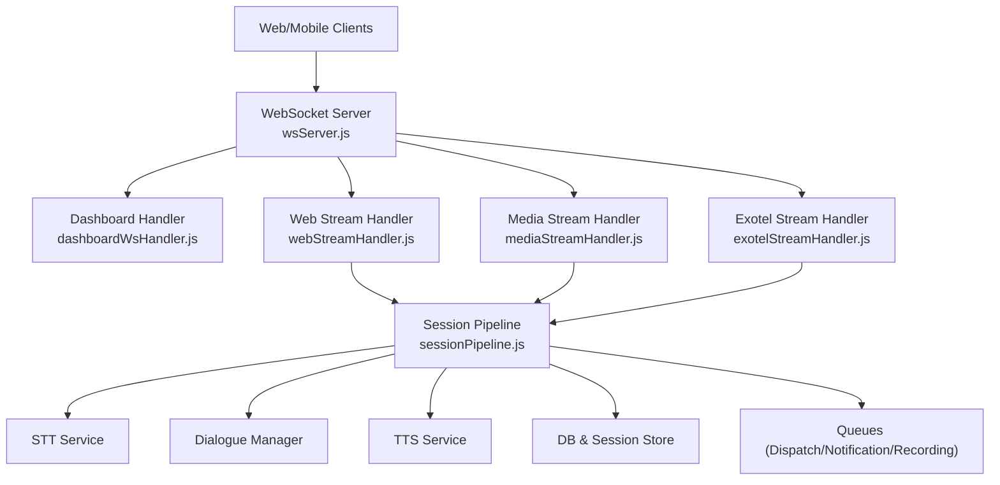
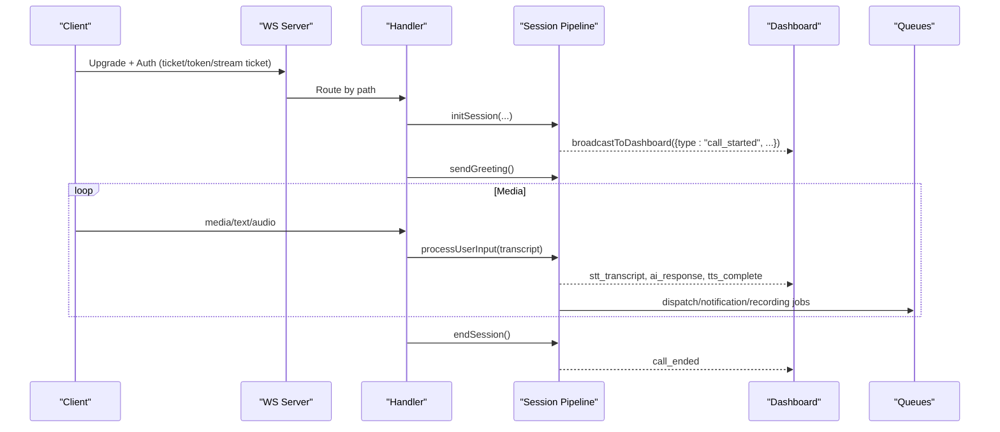
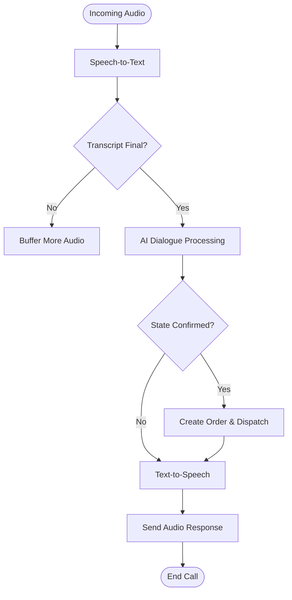
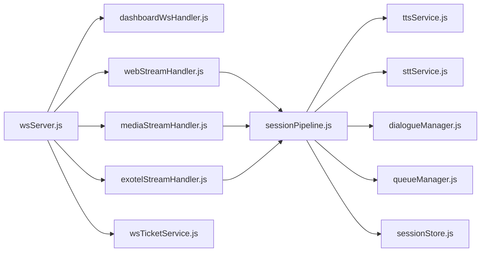

# WebSocket Real-time Communication

<cite>
**Referenced Files in This Document**
- [wsServer.js](file://server/src/websocket/wsServer.js)
- [dashboardWsHandler.js](file://server/src/websocket/dashboardWsHandler.js)
- [mediaStreamHandler.js](file://server/src/websocket/mediaStreamHandler.js)
- [webStreamHandler.js](file://server/src/websocket/webStreamHandler.js)
- [exotelStreamHandler.js](file://server/src/websocket/exotelStreamHandler.js)
- [sessionPipeline.js](file://server/src/websocket/sessionPipeline.js)
- [wsTicketService.js](file://server/src/services/wsTicketService.js)
- [sessionStore.js](file://server/src/infra/sessionStore.js)
- [useDashboardWs.js](file://client/src/hooks/useDashboardWs.js)
- [apiClient.js](file://client/src/services/apiClient.js)
- [voiceSocketService.js](file://mobile/src/services/voiceSocketService.js)
- [ConnectButton.jsx](file://mobile/src/components/controls/ConnectButton.jsx)
- [LiveCallMonitor.jsx](file://client/src/components/LiveCallMonitor.jsx)
</cite>

## Table of Contents
1. [Introduction](#introduction)
2. [Project Structure](#project-structure)
3. [Core Components](#core-components)
4. [Architecture Overview](#architecture-overview)
5. [Detailed Component Analysis](#detailed-component-analysis)
6. [Dependency Analysis](#dependency-analysis)
7. [Performance Considerations](#performance-considerations)
8. [Troubleshooting Guide](#troubleshooting-guide)
9. [Conclusion](#conclusion)
10. [Appendices](#appendices)

## Introduction
This document describes the real-time communication layer for Inkiro using WebSockets. It covers connection establishment, authentication handshakes, session management, message formats for media streaming and call events, the voice session pipeline (speech-to-text, AI processing, text-to-speech), event types for live monitoring and order updates, lifecycle management, error handling, reconnection strategies, and client implementation examples for both web dashboard and mobile applications.

## Project Structure
The WebSocket subsystem is implemented on the server with dedicated handlers per transport:
- Dashboard UI: /dashboard-ws
- Browser/Mobile voice: /web-stream
- Telephony media streams: /media-stream (Twilio), /exotel-stream (Exotel)

A central coordinator performs upgrade routing and multi-stream authentication before delegating to handlers. Sessions are tracked in-memory and persisted to Redis for cross-instance discovery.

**Diagram sources**
- [wsServer.js:17-147](file://server/src/websocket/wsServer.js#L17-L147)
- [dashboardWsHandler.js:10-38](file://server/src/websocket/dashboardWsHandler.js#L10-L38)
- [webStreamHandler.js:7-22](file://server/src/websocket/webStreamHandler.js#L7-L22)
- [mediaStreamHandler.js:7-38](file://server/src/websocket/mediaStreamHandler.js#L7-L38)
- [exotelStreamHandler.js:9-42](file://server/src/websocket/exotelStreamHandler.js#L9-L42)
- [sessionPipeline.js:24-111](file://server/src/websocket/sessionPipeline.js#L24-L111)

**Section sources**
- [wsServer.js:17-147](file://server/src/websocket/wsServer.js#L17-L147)

## Core Components
- WebSocket Coordinator: Validates upgrade paths, authenticates via tickets or tokens, routes to handlers, and runs heartbeat liveness checks.
- Dashboard Handler: Manages authenticated dashboard clients and broadcasts tenant-scoped events.
- Stream Handlers: Normalize incoming telephony/web audio into a common session pipeline.
- Session Pipeline: Orchestrates STT, dialogue, TTS, order confirmation, and end-of-call cleanup.
- Ticketing and Session Store: Provides single-use tickets and ephemeral session state across instances.

**Section sources**
- [wsServer.js:17-162](file://server/src/websocket/wsServer.js#L17-L162)
- [dashboardWsHandler.js:10-69](file://server/src/websocket/dashboardWsHandler.js#L10-L69)
- [mediaStreamHandler.js:7-69](file://server/src/websocket/mediaStreamHandler.js#L7-L69)
- [webStreamHandler.js:7-81](file://server/src/websocket/webStreamHandler.js#L7-L81)
- [exotelStreamHandler.js:9-80](file://server/src/websocket/exotelStreamHandler.js#L9-L80)
- [sessionPipeline.js:24-437](file://server/src/websocket/sessionPipeline.js#L24-L437)
- [wsTicketService.js:11-86](file://server/src/services/wsTicketService.js#L11-L86)
- [sessionStore.js:13-92](file://server/src/infra/sessionStore.js#L13-L92)

## Architecture Overview
The system supports three primary flows:
1) Dashboard real-time monitoring over /dashboard-ws
2) Voice calls from browsers/mobile over /web-stream
3) PSTN calls via Twilio/Exotel over /media-stream and /exotel-stream

All flows converge into a shared session pipeline that processes speech-to-text, AI dialogue, and text-to-speech, then emits events to dashboards and queues for fulfillment.

**Diagram sources**
- [wsServer.js:23-147](file://server/src/websocket/wsServer.js#L23-L147)
- [mediaStreamHandler.js:12-55](file://server/src/websocket/mediaStreamHandler.js#L12-L55)
- [webStreamHandler.js:23-61](file://server/src/websocket/webStreamHandler.js#L23-L61)
- [exotelStreamHandler.js:14-67](file://server/src/websocket/exotelStreamHandler.js#L14-L67)
- [sessionPipeline.js:24-111](file://server/src/websocket/sessionPipeline.js#L24-L111)
- [sessionPipeline.js:132-219](file://server/src/websocket/sessionPipeline.js#L132-L219)
- [sessionPipeline.js:224-294](file://server/src/websocket/sessionPipeline.js#L224-L294)
- [sessionPipeline.js:299-389](file://server/src/websocket/sessionPipeline.js#L299-L389)
- [sessionPipeline.js:394-437](file://server/src/websocket/sessionPipeline.js#L394-L437)

## Detailed Component Analysis

### Connection Establishment and Authentication
- Paths:
  - /dashboard-ws: Requires either a single-use ticket or Bearer token; role-gated for ADMIN/RESTAURANT_MANAGER/STAFF/KITCHEN.
  - /web-stream: Requires ticket or token; used by browser/mobile voice sessions.
  - /media-stream and /exotel-stream: Require stream tickets issued for telephony providers.
- Upgrade flow:
  - The coordinator validates path, extracts credentials, sets request.auth or request.streamMeta, then upgrades and delegates to the appropriate handler.
  - Heartbeat ping every 30 seconds terminates unresponsive connections.

Authentication details:
- Tickets are short-lived, single-use, stored in Redis with TTLs (30s for dashboard/web, 60s for streams).
- Tokens are validated via verifyToken when no ticket is provided.

Error responses:
- Unauthorized (401) for missing/invalid credentials in production.
- Forbidden (403) for insufficient roles on dashboard-ws.
- Not Found (404) for unsupported paths.

**Section sources**
- [wsServer.js:23-127](file://server/src/websocket/wsServer.js#L23-L127)
- [wsTicketService.js:11-86](file://server/src/services/wsTicketService.js#L11-L86)

### Session Management
- Session creation:
  - Each stream handler initializes a session with source, tenantId, restaurantId, caller info, and an STT stream.
  - A greeting turn is sent immediately after initialization.
- Ephemeral state:
  - In-memory Map tracks active sessions per process.
  - Redis-backed session store persists state with TTL for cross-instance visibility.
- Session end:
  - Ends STT stream, updates DB status, offloads audio recording, broadcasts call_ended, and cleans up in-memory and Redis state.

**Section sources**
- [mediaStreamHandler.js:12-55](file://server/src/websocket/mediaStreamHandler.js#L12-L55)
- [webStreamHandler.js:7-22](file://server/src/websocket/webStreamHandler.js#L7-L22)
- [exotelStreamHandler.js:14-42](file://server/src/websocket/exotelStreamHandler.js#L14-L42)
- [sessionPipeline.js:24-111](file://server/src/websocket/sessionPipeline.js#L24-L111)
- [sessionPipeline.js:394-437](file://server/src/websocket/sessionPipeline.js#L394-L437)
- [sessionStore.js:13-92](file://server/src/infra/sessionStore.js#L13-L92)

### Message Formats

#### Dashboard WebSocket (/dashboard-ws)
- Client connects with ?ticket=... or ?access_token=...
- Server sends initial handshake:
  - { type: "connected", tenant_id, restaurant_id, role, timestamp }
- Events received by dashboard (broadcast):
  - call_started, stt_transcript, user_speech, ai_response, tts_complete, order_confirmed, call_ended
- All events include timestamp and tenant-scoped fields; global events may omit tenant boundaries.

**Section sources**
- [dashboardWsHandler.js:10-38](file://server/src/websocket/dashboardWsHandler.js#L10-L38)
- [dashboardWsHandler.js:43-69](file://server/src/websocket/dashboardWsHandler.js#L43-L69)
- [sessionPipeline.js:54-73](file://server/src/websocket/sessionPipeline.js#L54-L73)
- [sessionPipeline.js:150-188](file://server/src/websocket/sessionPipeline.js#L150-L188)
- [sessionPipeline.js:236-244](file://server/src/websocket/sessionPipeline.js#L236-L244)
- [sessionPipeline.js:377-385](file://server/src/websocket/sessionPipeline.js#L377-L385)
- [sessionPipeline.js:419-431](file://server/src/websocket/sessionPipeline.js#L419-L431)

#### Web Voice Stream (/web-stream)
- Client messages:
  - { type: "audio", data: base64, format, language }
  - { type: "text", text }
  - { type: "end" }
- Server responses:
  - { type: "stt_transcript", transcript, isFinal, confidence, provider }
  - { type: "ai_response", text, audio: base64|nullable, language, state, latency_ms }

**Section sources**
- [webStreamHandler.js:23-61](file://server/src/websocket/webStreamHandler.js#L23-L61)
- [sessionPipeline.js:224-294](file://server/src/websocket/sessionPipeline.js#L224-L294)

#### Telephony Streams (/media-stream, /exotel-stream)
- Provider events:
  - connected, start, media, stop
- Media payload:
  - Base64-encoded PCM chunks streamed back via media events for telephony providers.
- For web-based voice, audio is transcribed and processed similarly to telephony once in the pipeline.

**Section sources**
- [mediaStreamHandler.js:12-55](file://server/src/websocket/mediaStreamHandler.js#L12-L55)
- [exotelStreamHandler.js:14-67](file://server/src/websocket/exotelStreamHandler.js#L14-L67)
- [sessionPipeline.js:246-269](file://server/src/websocket/sessionPipeline.js#L246-L269)

### Session Pipeline: Voice Call Processing
The pipeline orchestrates:
- Speech-to-text: Creates an STT stream, writes audio chunks, and emits transcripts.
- Dialogue processing: Processes user input through the dialogue manager, updating state and history.
- Text-to-speech: Synthesizes audio and streams it back to the caller or web client.
- Order confirmation: When state transitions to confirmed, persists orders, geocodes addresses if needed, triggers dispatch and notifications.
- End-of-call: Records audio, updates DB, broadcasts summary metrics.

**Diagram sources**
- [sessionPipeline.js:54-73](file://server/src/websocket/sessionPipeline.js#L54-L73)
- [sessionPipeline.js:132-219](file://server/src/websocket/sessionPipeline.js#L132-L219)
- [sessionPipeline.js:224-294](file://server/src/websocket/sessionPipeline.js#L224-L294)
- [sessionPipeline.js:299-389](file://server/src/websocket/sessionPipeline.js#L299-L389)
- [sessionPipeline.js:394-437](file://server/src/websocket/sessionPipeline.js#L394-L437)

**Section sources**
- [sessionPipeline.js:54-73](file://server/src/websocket/sessionPipeline.js#L54-L73)
- [sessionPipeline.js:132-219](file://server/src/websocket/sessionPipeline.js#L132-L219)
- [sessionPipeline.js:224-294](file://server/src/websocket/sessionPipeline.js#L224-L294)
- [sessionPipeline.js:299-389](file://server/src/websocket/sessionPipeline.js#L299-L389)
- [sessionPipeline.js:394-437](file://server/src/websocket/sessionPipeline.js#L394-L437)

### Event Types for Live Monitoring and Updates
- call_started: New voice session initiated
- stt_transcript: Intermediate/final transcription results
- user_speech: User utterance captured
- ai_response: Assistant response metadata and optional audio
- tts_complete: TTS synthesis completion with duration and latency
- order_confirmed: Order created and queued for dispatch
- call_ended: Session ended with summary metrics

These events are broadcast to dashboard clients scoped by tenant and restaurant.

**Section sources**
- [sessionPipeline.js:54-73](file://server/src/websocket/sessionPipeline.js#L54-L73)
- [sessionPipeline.js:150-188](file://server/src/websocket/sessionPipeline.js#L150-L188)
- [sessionPipeline.js:236-244](file://server/src/websocket/sessionPipeline.js#L236-L244)
- [sessionPipeline.js:377-385](file://server/src/websocket/sessionPipeline.js#L377-L385)
- [sessionPipeline.js:419-431](file://server/src/websocket/sessionPipeline.js#L419-L431)
- [dashboardWsHandler.js:43-69](file://server/src/websocket/dashboardWsHandler.js#L43-L69)

### Connection Lifecycle Management, Error Handling, Reconnection
- Server-side:
  - Heartbeat ping every 30 seconds; dead connections terminated.
  - Strict role gating for dashboard-ws; unauthorized/forbidden responses for invalid auth.
  - Stream tickets ensure only authorized telephony providers can connect.
- Client-side (Dashboard):
  - Exponential backoff reconnection with capped delay.
  - Refreshes stats on key events; handles auth change events to reconnect.
- Client-side (Mobile):
  - Wrapper class manages open/close, error propagation, and explicit end signaling.
  - Supports sending audio, text, and DTMF payloads.

**Section sources**
- [wsServer.js:149-158](file://server/src/websocket/wsServer.js#L149-L158)
- [useDashboardWs.js:45-109](file://client/src/hooks/useDashboardWs.js#L45-L109)
- [voiceSocketService.js:11-99](file://mobile/src/services/voiceSocketService.js#L11-L99)

### Client Implementation Examples

#### Web Dashboard
- Acquire a single-use ticket via API and connect to /dashboard-ws with ticket or access token.
- Listen for events and update UI; refresh stats on relevant events.
- Implement exponential backoff reconnection on close.

Reference paths:
- [useDashboardWs.js:45-109](file://client/src/hooks/useDashboardWs.js#L45-L109)
- [apiClient.js:58-66](file://client/src/services/apiClient.js#L58-L66)

#### Mobile Application
- Use the voice socket service to connect to /web-stream.
- Send audio chunks (base64) or text; handle stt_transcript and ai_response events.
- On disconnect, trigger reconnection logic at the app layer.

Reference paths:
- [voiceSocketService.js:11-99](file://mobile/src/services/voiceSocketService.js#L11-L99)
- [ConnectButton.jsx:5-55](file://mobile/src/components/controls/ConnectButton.jsx#L5-L55)

## Dependency Analysis

**Diagram sources**
- [wsServer.js:17-147](file://server/src/websocket/wsServer.js#L17-L147)
- [dashboardWsHandler.js:10-38](file://server/src/websocket/dashboardWsHandler.js#L10-L38)
- [webStreamHandler.js:7-22](file://server/src/websocket/webStreamHandler.js#L7-L22)
- [mediaStreamHandler.js:7-38](file://server/src/websocket/mediaStreamHandler.js#L7-L38)
- [exotelStreamHandler.js:9-42](file://server/src/websocket/exotelStreamHandler.js#L9-L42)
- [sessionPipeline.js:24-111](file://server/src/websocket/sessionPipeline.js#L24-L111)
- [wsTicketService.js:11-86](file://server/src/services/wsTicketService.js#L11-L86)
- [sessionStore.js:13-92](file://server/src/infra/sessionStore.js#L13-L92)

**Section sources**
- [wsServer.js:17-147](file://server/src/websocket/wsServer.js#L17-L147)
- [sessionPipeline.js:24-111](file://server/src/websocket/sessionPipeline.js#L24-L111)

## Performance Considerations
- Payload limits: Maximum payload set to 512KB to protect memory during media streaming.
- Chunked audio: Telephony streams send small PCM chunks to minimize latency.
- Latency tracking: Turn traces record STT, LLM, and TTS latencies; averages persisted per call.
- Ephemeral caching: Redis-backed session store reduces DB load and enables multi-instance awareness.
- Queue offloading: Order dispatch, notifications, and recording persistence are asynchronous to keep call paths fast.

[No sources needed since this section provides general guidance]

## Troubleshooting Guide
Common issues and resolutions:
- 401 Unauthorized on upgrade:
  - Ensure valid ticket or token is provided; check environment mode (production enforces strict auth).
- 403 Forbidden on dashboard-ws:
  - Verify user role includes allowed roles for dashboard access.
- No events on dashboard:
  - Confirm tenant and restaurant scoping match between client and events; check broadcast filters.
- Stuttering audio:
  - Validate chunk sizes and network stability; ensure STT stream is writing consistently.
- Reconnect loops:
  - Check exponential backoff configuration; ensure tickets are refreshed before expiry.

Operational checks:
- Inspect logs for upgrade errors and broadcast errors.
- Monitor active sessions via Redis keys and in-memory map size.
- Use dashboard to view call summaries and average latencies.

**Section sources**
- [wsServer.js:23-127](file://server/src/websocket/wsServer.js#L23-L127)
- [dashboardWsHandler.js:43-69](file://server/src/websocket/dashboardWsHandler.js#L43-L69)
- [sessionPipeline.js:214-219](file://server/src/websocket/sessionPipeline.js#L214-L219)
- [sessionPipeline.js:282-294](file://server/src/websocket/sessionPipeline.js#L282-L294)

## Conclusion
Inkiro’s WebSocket layer provides secure, scalable, and low-latency real-time communication for voice-driven ordering and live monitoring. The architecture cleanly separates transports while converging on a unified session pipeline that integrates STT, AI dialogue, and TTS. Robust authentication via single-use tickets, tenant-scoped broadcasting, and asynchronous job queues ensure reliability and performance across web, mobile, and telephony channels.

[No sources needed since this section summarizes without analyzing specific files]

## Appendices

### Appendix A: Client Integration Checklist
- Web Dashboard:
  - Acquire WS ticket via API endpoint.
  - Connect to /dashboard-ws with ticket or access token.
  - Handle events and implement exponential backoff reconnection.
- Mobile:
  - Use voice socket service to connect to /web-stream.
  - Send audio/text payloads; handle stt_transcript and ai_response.
  - Manage lifecycle with explicit end signaling and reconnection.

**Section sources**
- [useDashboardWs.js:45-109](file://client/src/hooks/useDashboardWs.js#L45-L109)
- [apiClient.js:58-66](file://client/src/services/apiClient.js#L58-L66)
- [voiceSocketService.js:11-99](file://mobile/src/services/voiceSocketService.js#L11-L99)
- [ConnectButton.jsx:5-55](file://mobile/src/components/controls/ConnectButton.jsx#L5-L55)

### Appendix B: Live Monitoring UI
- The dashboard component polls calls and sessions and displays active sessions, call history, and recordings.
- It shows latency averages and item counts for ongoing sessions.

**Section sources**
- [LiveCallMonitor.jsx:10-32](file://client/src/components/LiveCallMonitor.jsx#L10-L32)
- [LiveCallMonitor.jsx:74-111](file://client/src/components/LiveCallMonitor.jsx#L74-L111)
- [LiveCallMonitor.jsx:113-205](file://client/src/components/LiveCallMonitor.jsx#L113-L205)