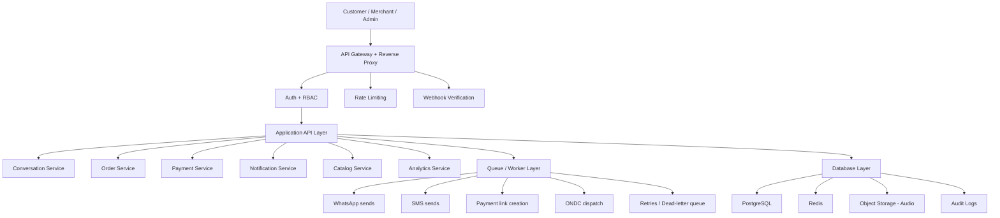

# 📋 Complete Analysis Report — VoiceCart AI Production Blueprint

> **Source Document**: [note.txt](file:///c:/Users/midun/OneDrive/Desktop/Inkiro/note.txt) (1311 lines, 24.7KB)

---

## 🎯 What This Document Is

This is a **comprehensive production roadmap and architecture review** for VoiceCart AI — written from the perspective of an experienced software architect / technical advisor evaluating your MVP codebase and providing a full blueprint to transform it into a **merchant-paid, revenue-generating production system**.

The document is structured into **3 major layers**:

| Layer | Focus | Lines |
|-------|-------|-------|
| **Technical Architecture** | Backend refactoring, database migration, state machines, queues | 1–665 |
| **Product & Business Strategy** | Market wedge, merchant ROI, positioning, feature prioritization | 666–945 |
| **10-Phase Growth Roadmap** | From MVP+ through enterprise scale over 12 months | 946–1311 |

---

## 🔑 The Core Thesis (The Single Most Important Insight)

> **"Convert the AI from the decision-maker into the speech interface, while the backend becomes the decision engine."**

This is repeated across the entire document as the #1 principle. The AI (Gemini LLM) should:
- ✅ **Understand** what the customer is saying (NLU)
- ✅ **Paraphrase** responses naturally
- ❌ **NOT** make business decisions (pricing, validation, order flow)

The backend code (deterministic rules engine) should:
- ✅ Calculate totals, validate items, enforce order flow
- ✅ Manage the order state machine
- ✅ Trigger side effects (payments, notifications)

---

## 📊 Current State Assessment

### What's Already Good ✅

The document acknowledges your codebase has the **correct product spine**:

```
Telephony/Web Audio → STT → Dialogue Engine → Order State → Payment/WhatsApp/ONDC → Dashboard
```

### What's MVP-Grade ⚠️ (9 Critical Gaps)

| # | Gap | Risk |
|---|-----|------|
| 1 | Sessions stored in memory (`server.js`) | Lost on restart, can't scale horizontally |
| 2 | SQLite as production database | No concurrency, no scaling |
| 3 | Mock fallbacks instead of production failover | Services silently break |
| 4 | No authentication / tenant separation | Can't safely sell to merchants |
| 5 | No queue for side effects | Voice latency increases |
| 6 | No central observability | Can't debug or prove ROI |
| 7 | No webhook signature validation | Security vulnerability |
| 8 | No rate limiting / abuse protection | Open to abuse |
| 9 | No formal order state machine | AI can "jump steps" |

---

## 🏗️ Target Production Architecture

The document proposes a layered architecture:



---

## 🔧 The 8 Biggest Production Upgrades Required

### A. Replace Fragile State Model
- **From**: In-memory sessions → **To**: Redis for active state + PostgreSQL for history
- **Why**: Survive restarts, scale horizontally, resume conversations

### B. Formal Order State Machine
```
new → collecting_items → collecting_address → pricing → awaiting_confirmation → confirmed → dispatched → completed → cancelled → failed
```
- **Why**: Prevents AI from "jumping steps" and removes ambiguity

### C. Separate AI from Business Rules
- **LLM does**: NLU, paraphrasing, intent extraction
- **Rules engine does**: totals, validation, item lookup, ordering constraints
- **Principle**: "The AI should suggest; the code should decide."

### D. Queue All Side Effects
- Use BullMQ/Redis or RabbitMQ/SQS
- Jobs: payment links, WhatsApp receipts, SMS, ONDC dispatch, recordings, retries
- **Why**: Voice calls need sub-second latency; side effects must not block

### E. Authentication & Tenant Isolation
- Roles: `admin`, `merchant_owner`, `merchant_staff`, `support`
- Merchant-scoped data isolation
- **Why**: "Without tenant isolation, you cannot safely sell the product"

### F. Harden Webhook & Media Pipeline
- Twilio signature verification, socket auth, backpressure handling
- Circuit breakers for STT/TTS/LLM
- **Why**: "A voice call that breaks mid-conversation destroys trust immediately"

### G. PostgreSQL Migration
- Keep SQLite for local dev, PostgreSQL in production
- Add migrations (Prisma, Drizzle, or Knex)

### H. Observability From Day One
- Structured JSON logs, request IDs, OpenTelemetry traces
- 11 key metrics to track (call answer rate, STT/LLM/TTS latency, order conversion, payment success, abandonment rate, etc.)

---

## 📁 File-by-File Refactoring Guide

| File | Current Role | Target Role |
|------|-------------|-------------|
| `server/server.js` | Monolith with business logic | Thin composition layer (bootstrap, routes, WS handlers) |
| `dialogueManager.js` | AI + order logic mixed | Pure conversational orchestrator (NLU only) |
| `db.js` | Query helpers with business logic | Repository layer with transactions, migrations, indexes |
| `sttService.js` / `ttsService.js` | Single provider with mock fallback | Provider adapter pattern (Google, Whisper, Mock) |
| `paymentService.js` | Basic link creation | Idempotent, webhook-verified, reconciliation jobs |
| `whatsappService.js` | Synchronous sends | Queue worker with delivery tracking & retry |
| `ondcService.js` | Basic connector | Signed requests, schema validation, dead-letter handling |
| `client/App.jsx` | Basic dashboard | Full operational console (live calls, failures, replay, refunds) |

**New directories to create**: `routes/`, `controllers/`, `services/`, `workers/`, `middlewares/`

---

## 🎯 Priority Matrix (What to Build When)

### P0 — Before First Paid Pilot
- PostgreSQL migration, Redis sessions, webhook verification
- RBAC login, order state machine, queue workers
- Retry policy, audio recording persistence
- Structured logging, basic metrics, production config

### P1 — Before Scaling
- Merchant onboarding portal, conversation review tool
- Manual override panel, payment reconciliation
- Cancellation/refund flow, multi-tenant support
- Analytics by merchant & city, failure alerting

### P2 — Before Serious Growth
- A/B testing for prompts, AI evaluation dataset
- Speech quality regression tests, call summarization
- Automated QA for transcripts, cost controls per merchant
- Cached menus & intent hints, dead-letter recovery

---

## 💰 Market Entry Strategy

### The Wedge (Don't Launch Broad!)

> **"Missed-call recovery + voice order conversion system for restaurants in one city."**

### Why This Works
- Clear pain point (restaurants lose customers from unanswered calls)
- Easy ROI story (recovered calls → revenue)
- Measurable conversion metrics
- Short sales cycle, narrow scope, strong demo value

### First Market Promise
1. Recover missed calls
2. Reduce order loss
3. Send WhatsApp receipt
4. Confirm payment
5. Log everything for the merchant

### Positioning (Critical!)

> ❌ Don't sell: "AI Voice Ordering"
> 
> ✅ Sell: **"An AI employee that answers every restaurant phone call, takes orders, answers customer questions, upsells menu items, and never misses a customer."**

> [!IMPORTANT]
> "Restaurant owners don't buy AI — they buy **more revenue, fewer missed orders, and lower operating costs**."

---

## 📅 10-Phase Growth Roadmap

| Phase | Name | Timeline | Key Deliverables |
|-------|------|----------|-----------------|
| **1** | Product-Market Fit | Months 1–3 | AI Receptionist, Missed Call Recovery, AI Upselling, Recommendations |
| **2** | Merchant Dashboard | Month 2–3 | Calls/orders/revenue stats, AI conversion rate, peak hours |
| **3** | Customer Intelligence | Month 3–4 | Customer profiles, preferences, personalized greetings |
| **4** | Restaurant Intelligence | Month 4–5 | Best-sellers, slow movers, peak hours, repeat customers |
| **5** | Kitchen Integration | Month 5–6 | Kitchen display → chef accepts → prep → ready → delivery |
| **6** | Delivery Integration | Month 6–7 | Own staff, third-party, ONDC logistics |
| **7** | AI Quality Improvement | Month 6–8 | Confidence scoring, re-confirmation, escalation |
| **8** | Smart Learning | Month 8–10 | Pronunciation variants, local slang, abbreviations |
| **9** | Multi-Language | Month 8–10 | Tamil, Hindi, Telugu, Kannada, Malayalam, Bengali, Marathi |
| **10** | Enterprise Features | Month 10–12 | Restaurant chains (multi-branch, separate menus/staff/reports) |

---

## 🚫 Features to NOT Build Yet

| Avoid | Why |
|-------|-----|
| Loyalty points | Complexity without validation |
| Coupons | Same |
| AI avatars | Gimmick at this stage |
| Voice cloning | Legal/ethical complexity |
| Blockchain | Irrelevant |
| AR/VR | Irrelevant |
| Complex recommendation engines | Overkill for 10 restaurants |
| Social features | Not core value |

---

## 📈 Sprint-Level Implementation Sequence

| Sprint | Deliverables |
|--------|-------------|
| **Sprint 1** | SQLite → PostgreSQL, Redis session storage, Auth + tenant model, Schema validation |
| **Sprint 2** | Order state machine, Side effects → queue workers, Webhook verification, Structured logs + metrics |
| **Sprint 3** | Merchant portal, Manual intervention panel, Replayable audio/transcripts, Payment reconciliation |
| **Sprint 4** | Pilot deployment (10 restaurants), Monitor latency/failures/conversion, Tune prompts, City-specific rules |

---

## 🎯 Staged Roadmap Summary

| Stage | Timeline | Focus |
|-------|----------|-------|
| **MVP+** | 1–2 months | PostgreSQL, Redis, Multi-tenant, Dashboard, Payments, WhatsApp, Order State Machine |
| **Pilot** | 2–3 months | 10 restaurants, Live monitoring, Call analytics, Missed call recovery, AI upselling |
| **Growth** | 3–6 months | Multi-language, POS integrations, Kitchen display, Delivery, Customer profiles |
| **Scale** | 6–12 months | Restaurant chains, ONDC optimization, High availability, Enterprise onboarding |

---

## 🧠 Key Takeaways

1. **The product spine is correct** — the architecture just needs hardening, not reimagining
2. **"AI should suggest; code should decide"** — the single most important design principle
3. **Narrow market wedge first** — one city, one restaurant type, one ordering flow
4. **Sell outcomes, not technology** — revenue recovery, not "AI voice ordering"
5. **10 paying restaurants** is the first milestone, not feature completeness
6. **4 sprints** to reach pilot-ready production state
7. **Side effects must never block the voice call** — queue everything
8. **Every action must be auditable** — calls, transcripts, orders, payments

